# 一、使用 Firebase 设置和部署 ReactJS 项目

在这一章中，你将学习 Firebase，它是 Google 提供的一套工具。您还将学习如何通过 Firebase 托管部署一个简单的 React 应用。

## Firebase 简介

Firebase 不仅仅是一个数据库，而是一套工具；它通常被称为后端即服务(BaaS)。Firebase 包含各种服务，如下所示:

*   *认证*:用户登录和身份

*   *实时数据库*:实时、云托管的 NoSQL 数据库

*   *云 Firestore* :实时云托管 NoSQL 数据库

*   *云存储*:大规模可扩展文件存储

*   *云功能*:无服务器、事件驱动的后端功能

*   *Firebase hosting* :全球虚拟主机

*   ML 套件:一个用于常见机器学习任务的 SDK

Firebase 使前端开发人员可以轻松地将后端集成到他们的应用中，而无需创建任何 API 路由和其他后端代码。图 [1-1](#Fig1) 显示了一个传统 web 应用的例子，它从客户端应用向服务器发出 API 请求。剩下的代码由服务器处理。正如你在图 [1-1](#Fig1) 中看到的，Firebase 消除了后端工作，你可以直接与 Firebase 通信，Firebase 通过 SDK 托管在谷歌平台上。

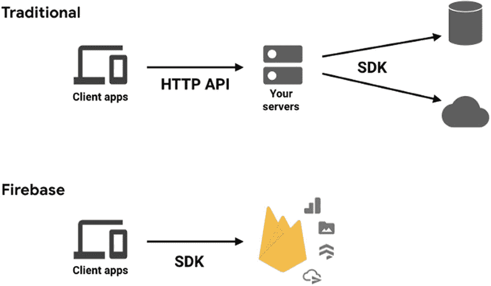

图 1-1

Firebase(火力基地)

以 ReactJS 为前端，在 Firebase 后端构建项目非常容易。如果你在 MERN 做同一个项目(意味着 MongoDB、Express、ReactJS、NodeJS)，它会花费更多的时间，而且会复杂得多，因为你需要在 NodeJS 中做后端 API。

我发现在 Firebase 中另一件容易做的事情是认证部分。身份验证曾经是 JWT 身份验证中最复杂的部分之一，但是使用 Firebase，您只需要几行代码。更好的是，您可以获得所有类型的身份验证。

Firebase 托管对于你的 ReactJS 应用来说也是非常容易使用的，这就是我们在这本书里将要讨论的。

## 创建 Firebase 帐户

要使用 Firebase，你只需要一个谷歌账户。所以，去 [`https://firebase.google.com/`](https://firebase.google.com/) 的火基地，点击**去右上角的**控制台。你需要使用你的谷歌账户登录，如图 [1-2](#Fig2) 所示。

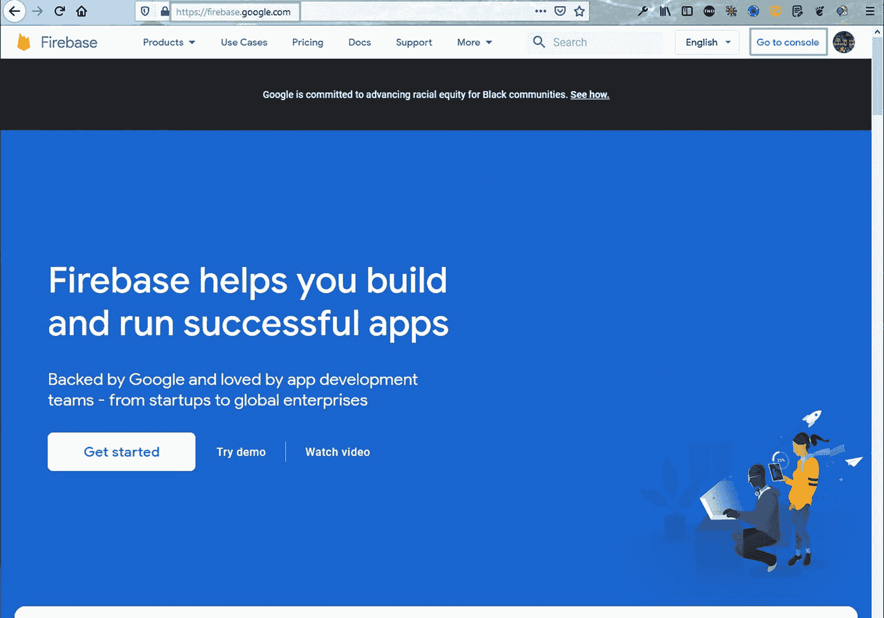

图 1-2

Firebase 站点

## 设置托管

点击页面中的**添加项目**链接，如图 [1-3](#Fig3) 所示。因为我有很多项目，所以图中显示了它们。第一次，您将只能看到**添加项目**链接。

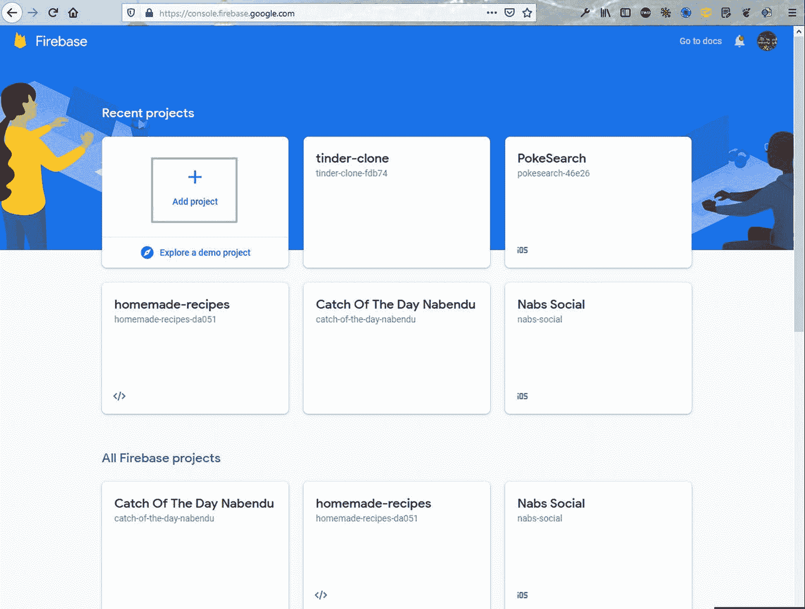

图 1-3

添加项目

在打开的页面上，给项目起一个类似 **final-space-react** 的名字，点击**继续**按钮，如图 [1-4](#Fig4) 所示。

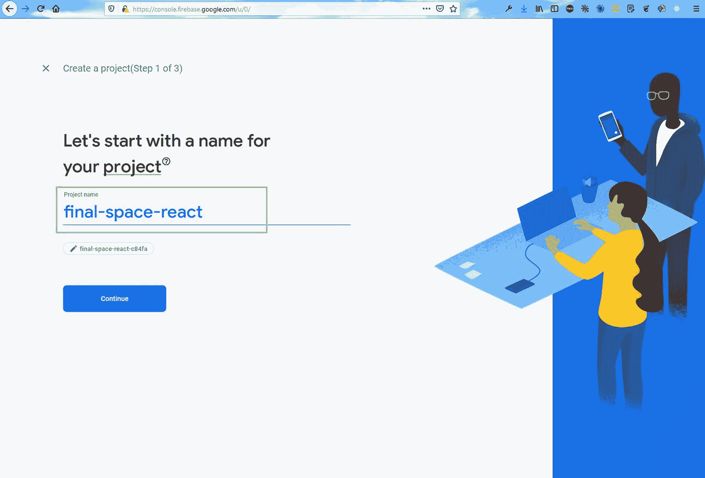

图 1-4

命名项目

在下一页面中，禁用 Google Analytics 后点击**创建项目**按钮，如图 [1-5](#Fig5) 所示。我们正在禁用谷歌分析，因为我们在这里创建一个演示项目。如果您打算在生产中部署您的应用，您应该保持它处于启用状态。

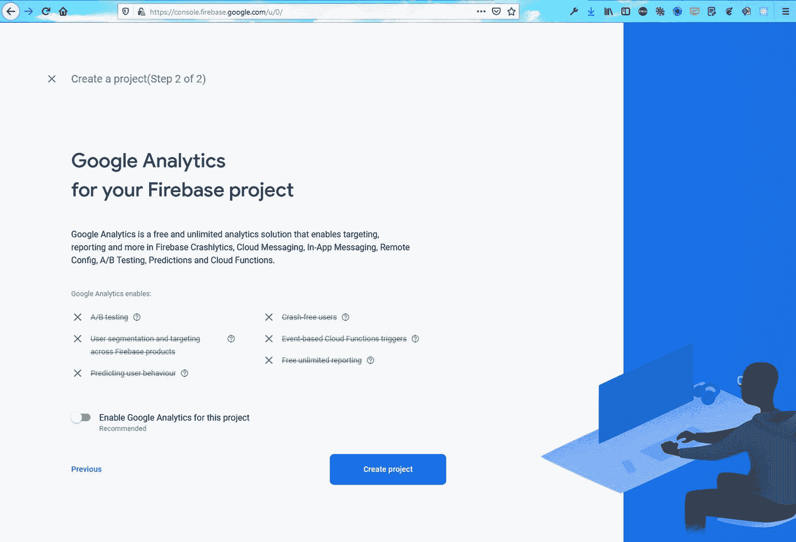

图 1-5

创建项目

一段时间后，您将看到如图 [1-6](#Fig6) 所示的屏幕。在这里，你需要点击**继续**按钮。


图 1-6

持续的

现在点击屏幕左上角的**设置**图标，如图 [1-7](#Fig7) 所示。之后，点击**项目设置**。

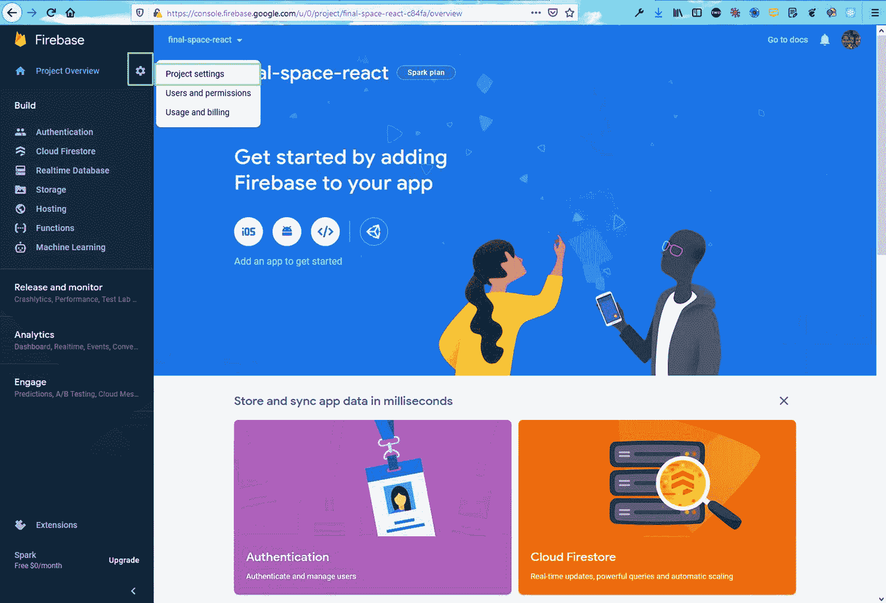

图 1-7

项目设置

在下一页中，点击页面底部的代码图标，如图 [1-8](#Fig8) 所示。

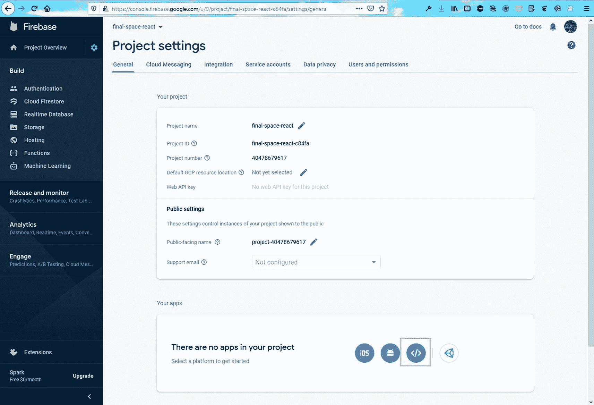

图 1-8

代码图标

在下一页上，输入您之前输入的应用的名称，在我的例子中是 **final-space-react** 。此外，单击 Firebase hosting 的复选框。之后点击**注册 app** 按钮，如图 [1-9](#Fig9) 所示。

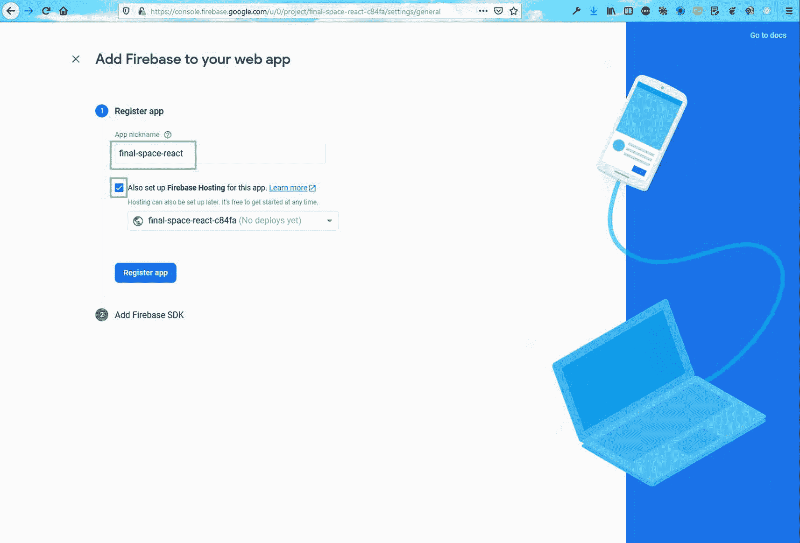

图 1-9

选择 Firebase 托管

在下一页，只需点击**下一个**按钮(图 [1-10](#Fig10) )。

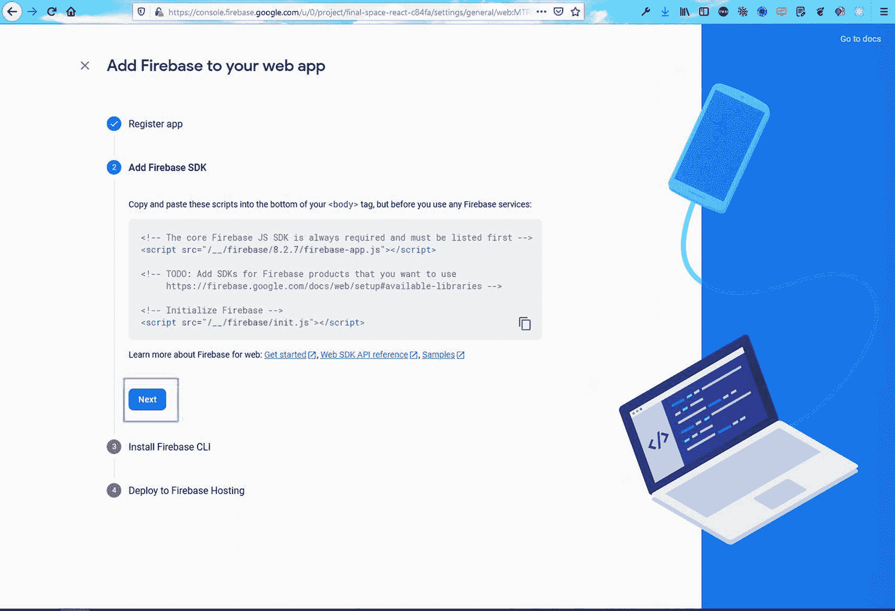

图 1-10

下一步按钮

在下一页，您将看到从终端全局安装`firebase-tools`的命令(图 [1-11](#Fig11) )。因此，打开任何终端，从任何地方运行该命令。请注意，这是机器上的一次性设置，因为我们使用了`-g`选项。`-g`选项指定需要在全球范围内安装。

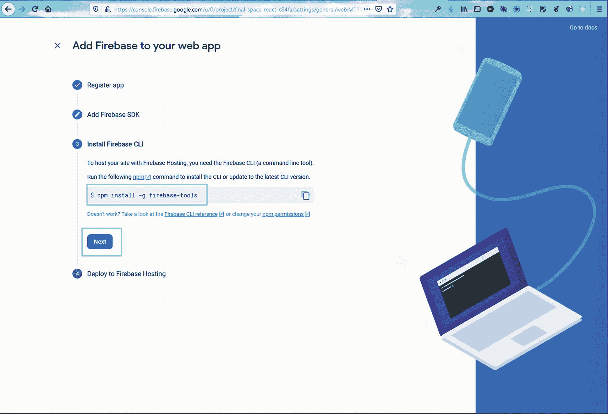

图 1-11

全球安装 Firebase

暂时忽略下一组命令，点击**继续到控制台**按钮(图 [1-12](#Fig12) )。

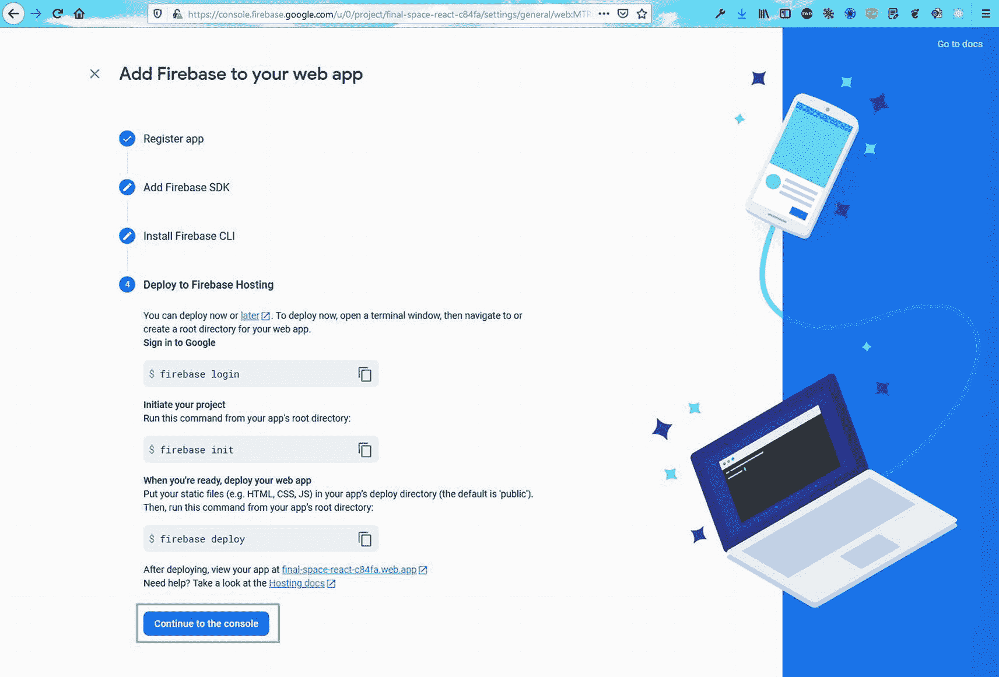

图 1-12

继续到控制台

## 从终端部署一个简单的 ReactJS 项目

在本节中，您将学习如何部署一个简单的 ReactJS 应用，该应用从一个简单的 API 获取数据。打开 [`https://github.com/nabendu82/final-space-react`](https://github.com/nabendu82/final-space-react) 然后点击**代码**和剪贴板复制图标(图 [1-13](#Fig13) )。

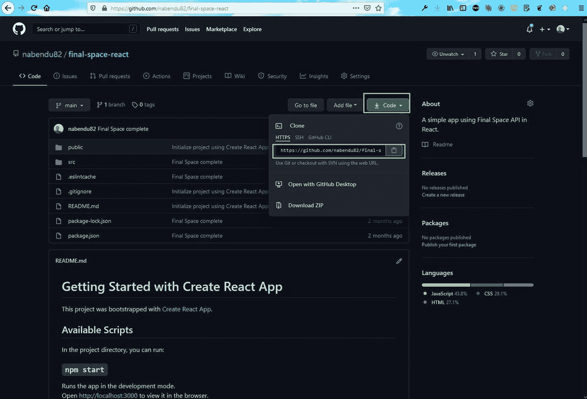

图 1-13

开源代码库

现在，转到任意终端，使用以下命令克隆项目:

```jsx
git clone https://github.com/nabendu82/final-space-react.git

```

之后，切换到项目的目录并运行`npm i`来安装所有的依赖项，如下所示:

```jsx
cd final-space-react
npm i

```

现在从终端运行`firebase login`。如果你是第一次运行它，它会给你一个弹出消息。之后，运行`firebase init`命令。键入`Y`继续(图 [1-14](#Fig14) )。

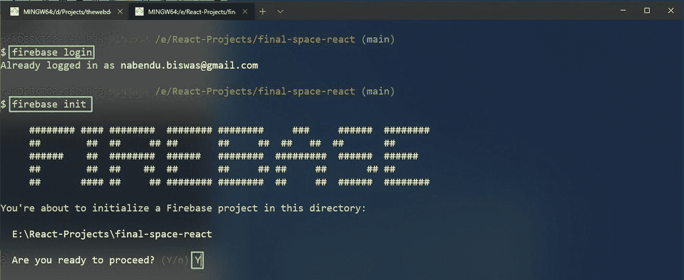

图 1-14

Firebase 登入

接下来，使用箭头键下到 Hosting，按空格键选择 Hosting，然后按 Enter，如图 [1-15](#Fig15) 所示。

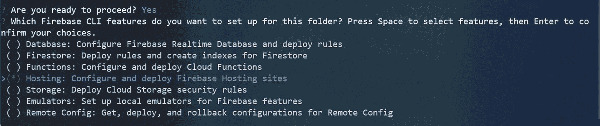

图 1-15

作战

然后选择`Use an` `existing project`，回车，如图 [1-16](#Fig16) 所示。

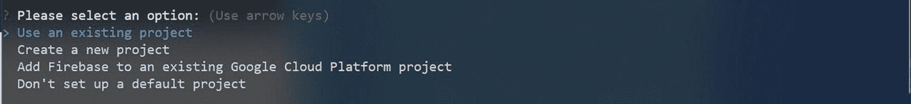

图 1-16

现有项目

这里需要选择正确的项目，在我这里是`final-space-react-c84fa`(图 [1-17](#Fig17) )。

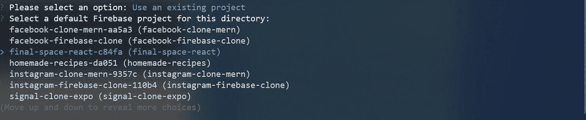

图 1-17

选择最终空间 React 项目

接下来选择公共目录，也就是`build`。下一个选项是`Yes`单页应用，GitHub 部署，在这里你选择`No`(图 [1-18](#Fig18) )。

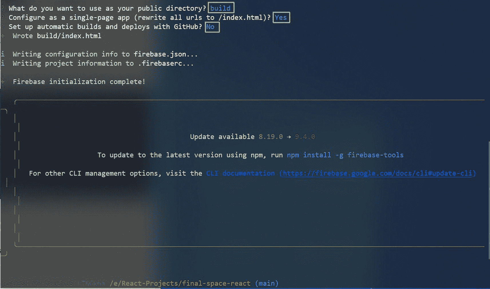

图 1-18

构建项目

现在，您需要在终端中运行`npm run build`来进行生产优化构建，命令如下:

```jsx
npm run build

n

```

最后一个命令是`firebase deploy`将项目部署到 Firebase，如下所示:

```jsx
firebase deploy

```

现在，你可以进入 [`https://final-space-react-c84fa.web.app/`](https://final-space-react-c84fa.web.app/) (或者调整到你的项目名称)查看 app 正确运行，如图 [1-19](#Fig19) 。


图 1-19

完整应用

## 摘要

在这一章中，你学习了来自 Google 的令人敬畏的 Firebase 工具套件。之后，您学习了如何在 Firebase 中部署 React 项目。