# 二、使用 React 和 Firebase 构建待办事项应用

在前一章中，您学习了通过 Firebase 部署 React 应用。在本章中，您将学习如何在 ReactJS 中构建一个出色的待办事项列表应用，将数据存储在后端，特别是 Firebase Firestore 数据库中。主机也将在 Firebase。

我们将展示如何为项目中的图标使用材质 UI，我们将在这个项目中使用一个`useRef`钩子。图 [2-1](#Fig1) 显示了应用的样子。用户将能够输入一个待办事项，并将其存储在 firebase 数据库中一个可爱的列表中。所以，这个列表是永久的，不会在浏览器刷新后改变。

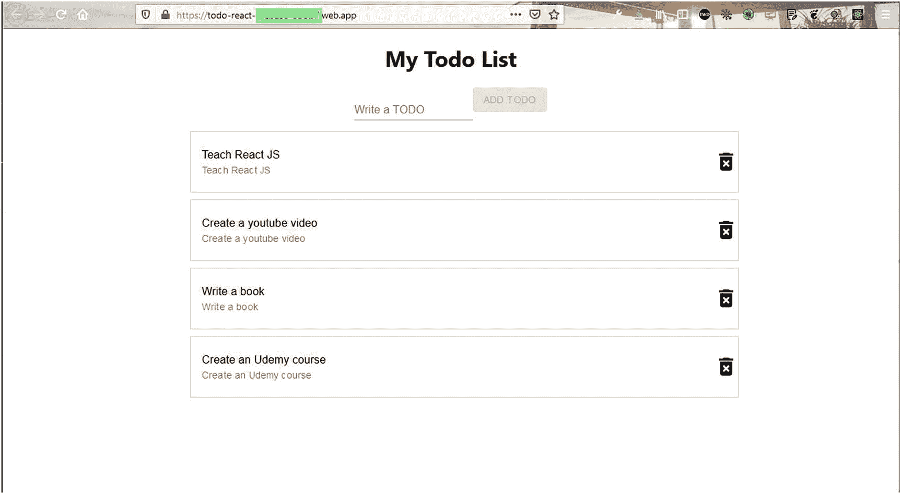

图 2-1

完成的应用

## 入门指南

首先，使用`create-react-app`命令创建一个名为`todo-react-firebase`的新应用。具体来说，命令如下:

```jsx
npx create-react-app todo-react-firebase

```

## 初始 Firebase 设置

由于我们的前端站点也将通过 Firebase 托管，我们将创建基本设置，而`create-react-app`命令创建我们的 React 应用。按照第 [1 章](1.html)中的相同步骤设置 Firebase。

在设置程序中点击**继续到控制台**按钮后，还需要一个额外的设置步骤。您需要向下滚动并点击**配置**单选按钮，然后复制`firebaseConfig`部分的所有数据。这是必需的，因为我们将在我们的项目中使用 Firebase 数据库(图 [2-2](#Fig2) )。

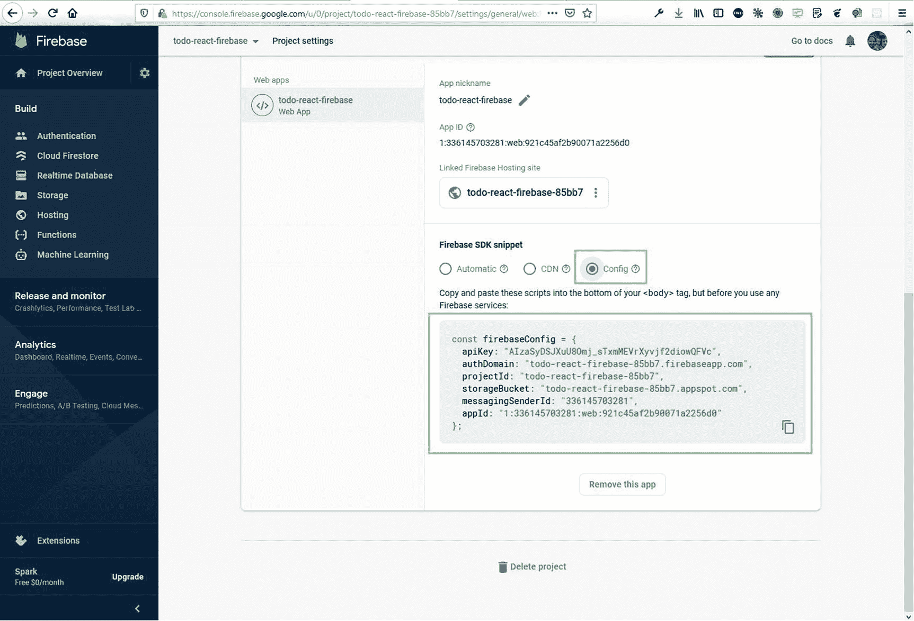

图 2-2

Firebase 配置

现在，打开 VS Code 中的代码，在`src`文件夹中创建一个名为`firebase.js`的文件。将以下代码粘贴到文件中:

```jsx
const firebaseConfig = {
        apiKey: "AIxxxxxxxxxxxxxxxxxxxxxxxxxxxxxxxxx",
        authDomain: "todo-react-xxxxxxxx.firebaseapp.com",
        projectId: "todo-react-xxxxxx",
        storageBucket: "todo-react-xxxxxxxxxxxxxxxxx.com",
        messagingSenderId: "33xxxxxxxxxxx",
        appId: "1:xxxxxxxxxxxx:9xxxxxxxxxxxxx6d0"
};

```

## 基本 React 设置

现在，我们将对 ReactJS 进行基本设置。在`todo-react-firebase`目录中，用`npm start`启动 React 应用。接下来，我们将删除一些文件，因为我们不需要它们。它们实际上是标志和其他测试的一部分，我们不会在这个项目中使用。图 [2-3](#Fig3) 显示要删除的文件。

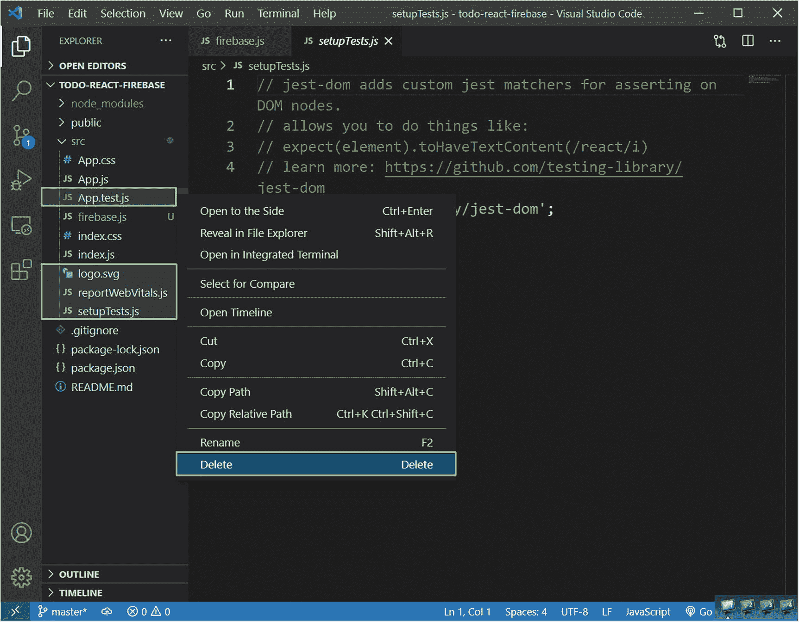

图 2-3

删除选项

我们将删除所有不必要的样板代码，因此我们的`index.js`文件将如下所示:

```jsx
import React from 'react';
import ReactDOM from 'react-dom';
import './index.css';
import App from './App';

ReactDOM.render(
    <React.StrictMode>
        <App />
    </React.StrictMode>,
    document.getElementById('root')
);

```

`App.js`文件只包含“TODO React Firebase”文本，如下所示:

```jsx
import './App.css';

function App() {
    return (
        <div className="App">
        <h1>TODO React Firebase</h1>
        </div>
    );
}

export default App;

```

现在，我们的应用在 localhost 中将看起来如图 [2-4](#Fig4) 所示。

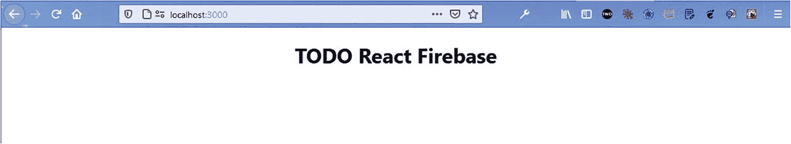

图 2-4

本地主机应用

## 本地待办事项列表

完成前一部分的设置后，我们将继续我们的待办事项应用。我们将更新我们的`App.js`文件，以包含基本待办事项列表的逻辑。这里，我们使用两个状态变量:`todos`和`input`。我们使用`useState`钩子来声明它们。`todos`包含一个包含两个字符串的数组，`input`包含一个空字符串。

接下来，在`return`语句中，我们使用 React 的受控输入来更新输入框的输入。接下来，我们有一个按钮和一个分配给该按钮的点击事件。当我们点击它时，我们运行一个名为`addTodo()`的函数，用`setTodos`改变`todos`的状态。这里，它将已经存在的内容附加到用户键入的内容中。

我们使用一个表单来包装我们的输入和按钮，按钮类型是`submit`。因此，如果我们在输入框中键入任何内容，然后按键盘上的 Enter 键，它就会工作。因此，我们需要在`addTodo()`函数中使用`e.preventDefault()`。

```jsx
import { useState } from 'react';
import './App.css';

function App() {
const [todos, setTodos] = useState([
    'Make a react firebase project',
    'Record a coding video'
])

const [input, setInput] = useState('')

const addTodo = e => {
    e.preventDefault()
    setTodos([...todos, input])
    setInput('')
}

return (
    <div className="App">
        <h1>TODO React Firebase</h1>
        <form>
            <input value={input} onChange={e => setInput(e.target.value)}/>
            <button type="submit" onClick={addTodo}>Add Todo</button>
        </form>
        <ul>
            {todos.map(todo => <li>{todo}</li>)}
        </ul>
    </div>
);
}

export default App;

```

现在，在 localhost 中，我们将默认获得两个项目，因为它们处于我们的初始状态`todos`。但是当我们输入的时候，我们会得到新的条目，如图 [2-5](#Fig5) 所示。

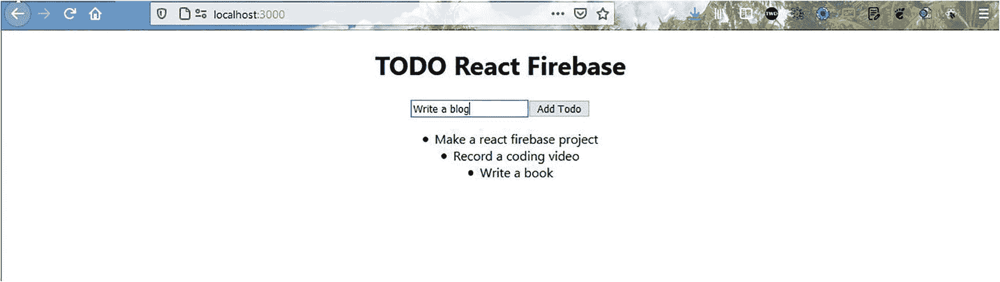

图 2-5

本地主机中的列表

我们将为图标使用材质用户界面。因此，根据文档，我们需要运行两个`npm install`命令。我们将通过集成终端安装`core`和`icons`，如下图所示:

```jsx
npm install @material-ui/core @material-ui/icons

```

现在，我们将在我们的项目中使用`material-ui`中的图标。我们已经用来自`material-ui`的`Button`和`Input`替换了我们的`Button`和`Input`字段，并且我们在顶部导入了它们。更新后的代码在这里用粗体标记:

```jsx
import { Button, FormControl, Input, InputLabel } from '@material-ui/core';

function App() {
...
...

return (
    <div className="App">
    <h1>TODO React Firebase</h1>
    <form>
              <FormControl>
               <InputLabel>Write a TODO</InputLabel>
               <Input value={input} onChange={e => setInput(e.target.value)}/>
              </FormControl>
              <Button type="submit" onClick={addTodo} variant="contained" color="primary" disabled={!input}>Add Todo</Button>
    </form>
    <ul>
           {todos.map(todo => <li>{todo}</li>)}
    </ul>
    </div>
);
}

export default App;

```

现在，我们的 web 应用看起来不错(图 [2-6](#Fig6) )。

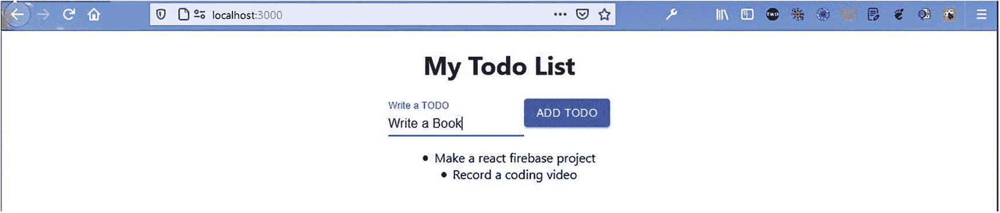

图 2-6

更新的 web 应用

接下来，我们将待办事项列表移动到一个单独的组件中。因此，在`components`文件夹中创建一个名为`Todo.js`的新文件。我们会将单独的待办事项作为`props`发送给它。更新后的代码在这里以粗体显示:

```jsx
import { Button, FormControl, Input, InputLabel } from '@material-ui/core';
import Todo from './components/Todo';

function App() {
...
...

return (
    <div className="App">
    <h1>TODO React Firebase</h1>
    <form>
    ...
    ...
    </form>
    <ul>
            {todos.map(todo => <Todo todo={todo} />)}
    </ul>
    </div>
);
}

export default App;

```

现在将下面的代码添加到`Todo.js`文件中。我们只是使用了一堆`material-ui`图标，显示了被称为`todo`的`props`。这些图标帮助我们使列表项更漂亮。

```jsx
import { List, ListItem, ListItemAvatar, ListItemText } from '@material-ui/core'
import React from 'react'

const Todo = ({ todo }) => {
    return (
        <List className="todo__list">
            <ListItem>
                <ListItemAvatar />
                <ListItemText primary={todo} secondary={todo} />
            </ListItem>
        </List>
    )
}

export default Todo

```

现在，在 localhost 中，我们将能够看到这些变化，并且我们的列表将看起来不错(图 [2-7](#Fig7) )。

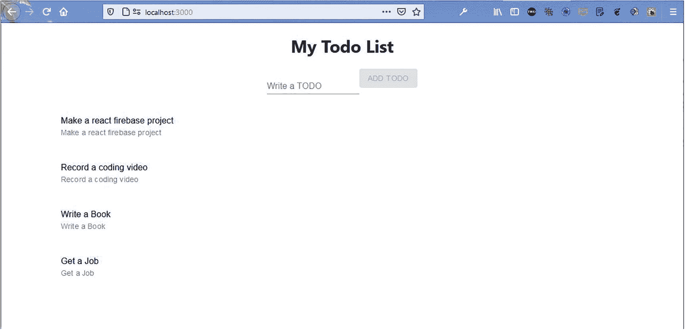

图 2-7

所有列表

现在，是时候将 Firebase 连接到项目上了。

## 使用 Firebase

现在，我们将开始为后端设置 Firebase。为此，我们将首先通过运行以下命令在终端中安装 Firebase 的所有依赖项:

```jsx
npm i firebase

```

接下来，我们将更新我们的`firebase.js`文件以使用配置来初始化应用。之后，我们使用 Firestore 作为数据库。更新后的代码在这里以粗体突出显示:

```jsx
import firebase from 'firebase'

const firebaseConfig = {
    ...
    ...
};

const firebaseApp = firebase.initializeApp(firebaseConfig)
const db = firebaseApp.firestore()

export { db }

```

现在，我们将返回到 Firebase，点击**云 Firestore** ，然后点击**创建数据库**按钮，如图 [2-8](#Fig8) 所示。


图 2-8

创建数据库

在下一个画面中，在 **测试模式**下选择**开始，然后点击**下一个**按钮，如图 [2-9](#Fig9) 所示。**

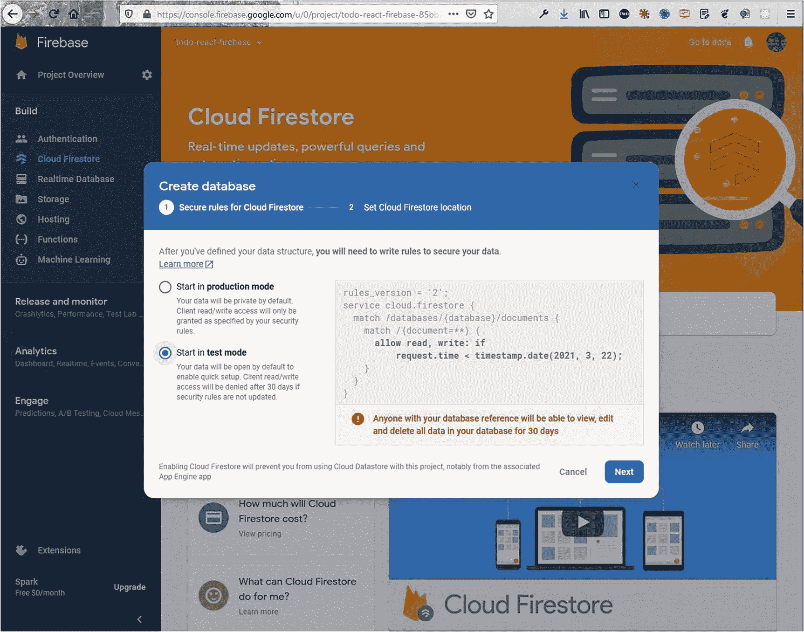

图 2-9

测试模式

在下一个屏幕上，点击**使能**按钮(图 [2-10](#Fig10) )。

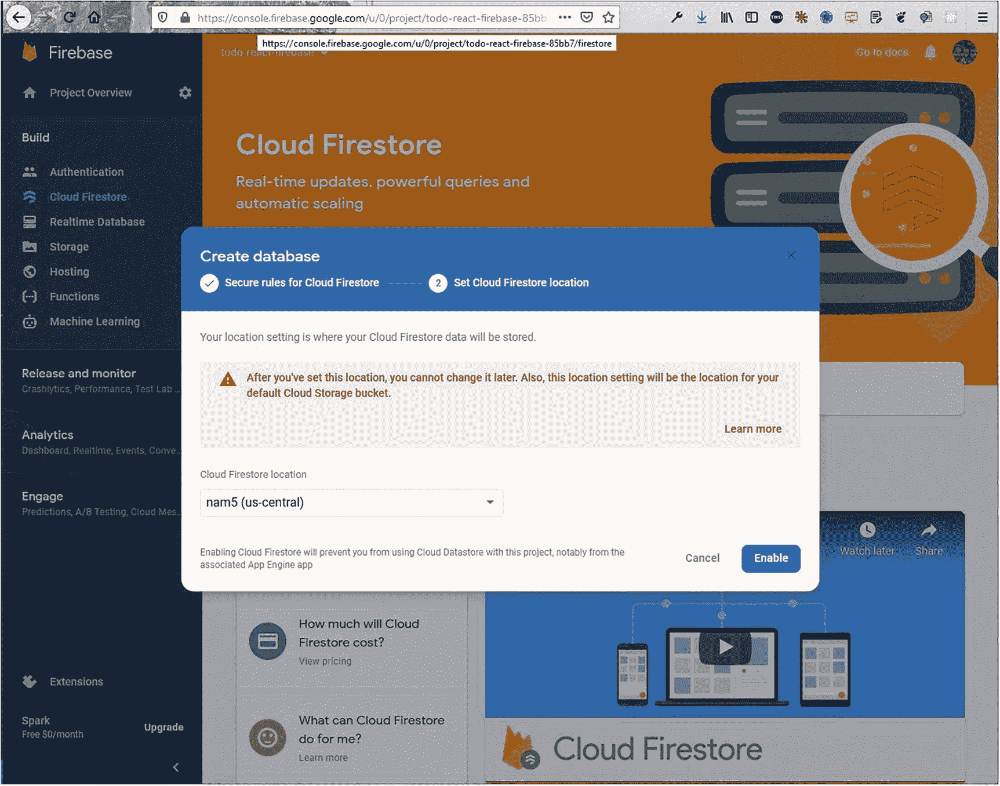

图 2-10

启用按钮

在下一个界面，点击**开始采集**，如图 [2-11](#Fig11) **所示。**

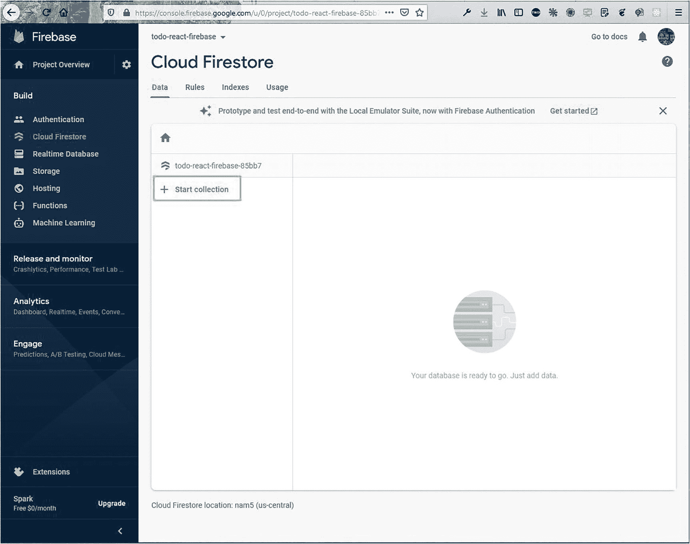

图 2-11

开始收集

将会打开如图 [2-12](#Fig12) 所示的弹出窗口。我们需要在收藏 ID 字段中输入 **todos** ，然后单击下一步按钮。

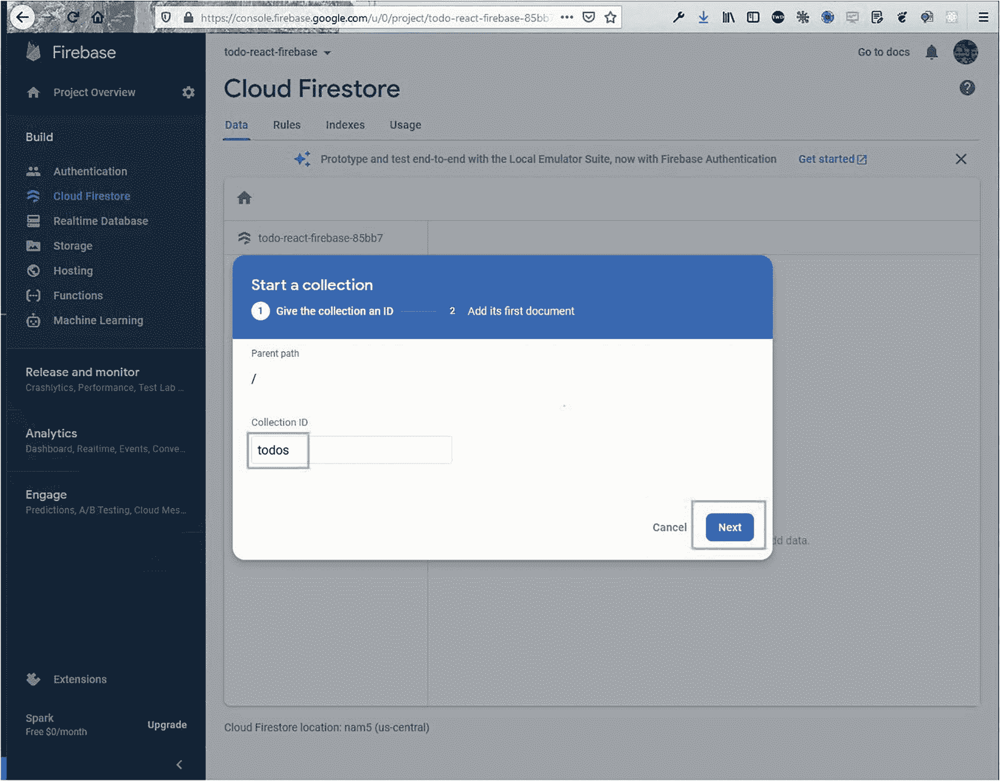

图 2-12

待办事项

在下一个屏幕上，点击**自动 ID** 填写文档 ID 字段。在字段中输入 **todo** 。之后，点击**保存**按钮(图 [2-13](#Fig13) )。

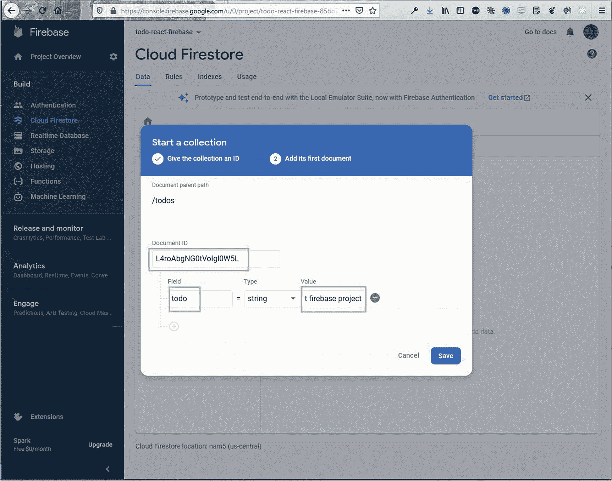

图 2-13

菲尔茨

这将把我们带回主屏幕。现在点击**添加文档**链接。这将再次打开同一个弹出窗口，我们将在其中添加另一个待办事项的详细信息。现在，我们的数据库中有两个待办事项(图 [2-14](#Fig14) )。

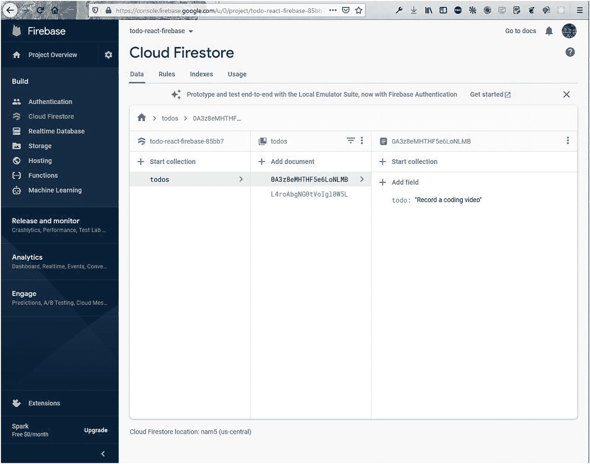

图 2-14

两个待办事项

## 将 Firebase 添加到应用

现在我们将删除`App.js`中的硬编码待办事项，并使用来自 Firebase 数据库*的数据。*因此，回到`App.js`，删除`todos`的`useState`代码中的硬编码内容。我们还创建了所需的导入。

之后，在`useEffect`内，我们调用集合`todos`，然后我们拍摄快照。用 Firebase 的术语来说，它是实时数据，我们可以立即获得。然后，我们将通过`setTodos()`在`todos`数组中设置这个数据。

另外，请注意`useEffect`在数组中有`input`。因此，任何时候用户添加一个`todo`，它都会立即显示在我们的应用中。

另外，请注意，我们已经使用`todos`改变了循环数据的方式。这样做是因为我们接收的数据是一个对象数组。更新后的代码在这里以粗体显示:

```jsx
import { useState, useEffect } from 'react';
import Todo from './components/Todo';
import { db } from './firebase';

function App() {
const [todos, setTodos] = useState([])
const [input, setInput] = useState('')
useEffect(() => {
  db.collection('todos').onSnapshot(snapshot => {
     setTodos(snapshot.docs.map(doc => doc.data()))
  })
}, [input])

...
...
return (
   <div className="App">
   <h1>TODO React Firebase</h1>
         ...
         ...
   <ul>
   {todos.map(({ todo }) => <Todo todo={todo} />)}
   </ul>
   </div>
);
}

export default App;

```

现在，我们将添加功能，以便用户可以添加待办事项。为此，我们只需要使用`add()`将输入添加到集合中。另外，请注意，我们在添加待办事项的同时添加了服务器时间戳。我们这样做是因为我们需要按降序排列待办事项。更新后的代码在这里用粗体标记:

```jsx
import { db } from './firebase';
import firebase from 'firebase';

function App() {
const [todos, setTodos] = useState([])
const [input, setInput] = useState('')
useEffect(() => {
  db.collection('todos').orderBy('timestamp','desc').onSnapshot(snapshot => {
    setTodos(snapshot.docs.map(doc => doc.data()))
  })
}, [input])

const addTodo = e => {
      e.preventDefault()
      db.collection('todos').add({
      todo: input,
      timestamp: firebase.firestore.FieldValue.serverTimestamp()
      })
      setInput('')
}

...
...

```

现在，我们需要删除 Firebase 中的旧集合，因为没有一个记录有时间戳(图 [2-15](#Fig15) )。

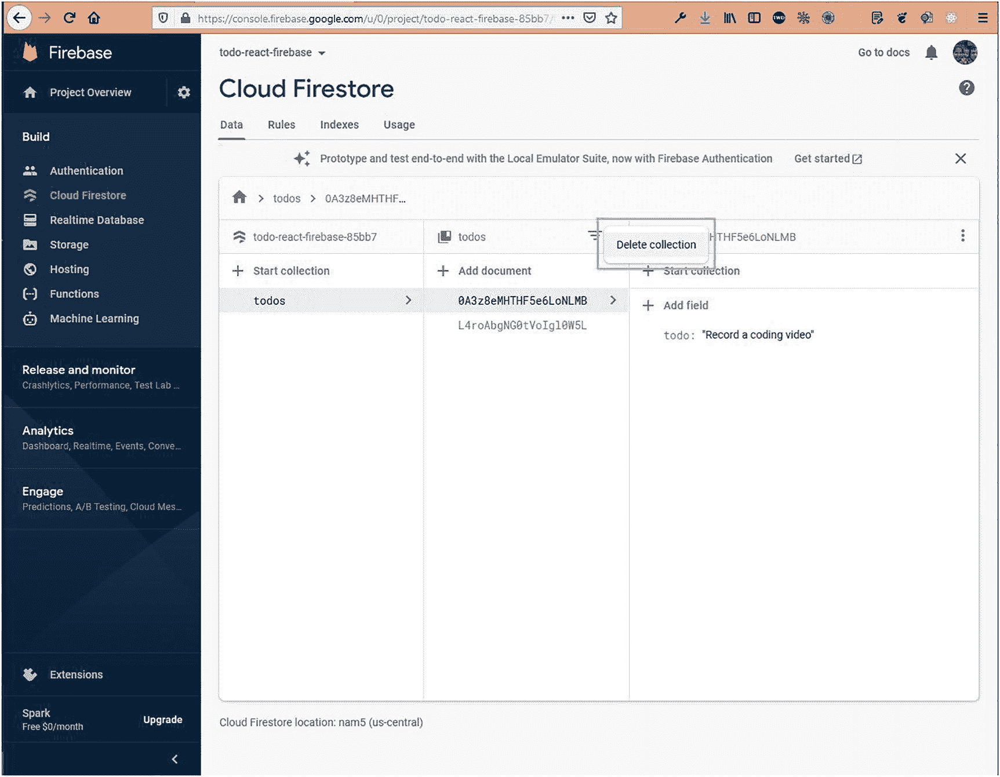

图 2-15

删除收藏

它还会显示一个弹出窗口来确认这一点(图 [2-16](#Fig16) )。

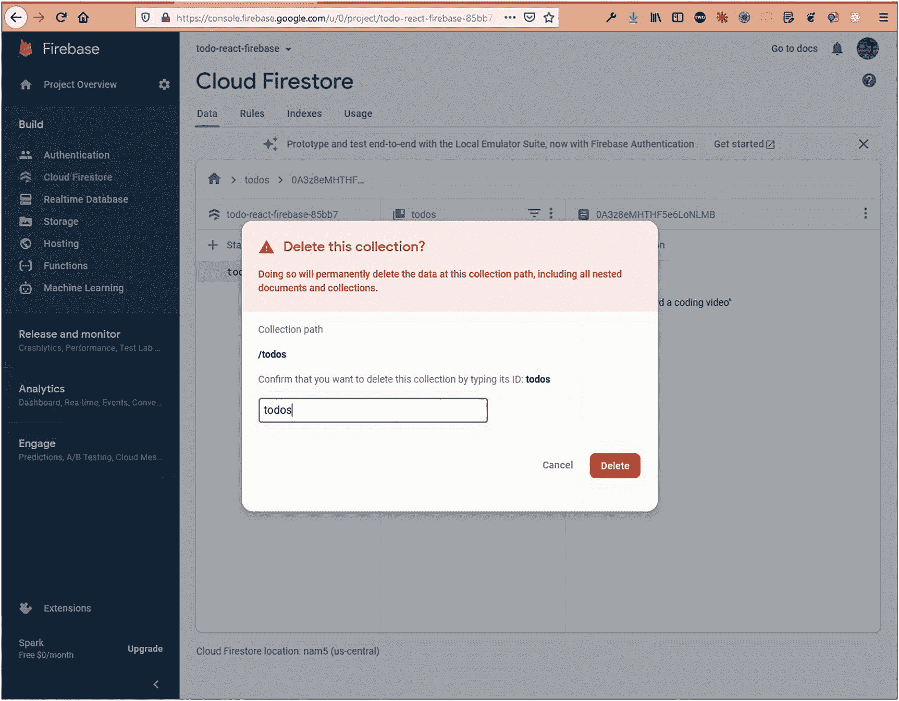

图 2-16

删除前确认

现在，我们还想获得键和删除所需的每个项目的 ID，这是我们将要实现的。这个键在 React for optimization 中是必不可少的，我们还会在控制台中得到一个警告。所以，我们需要改变我们在`setTodos()`中设置数据的结构。

现在，我们以不同的方式映射它，特别是当我们将单个项目传递给一个`Todo`组件时。下面是更新后的代码:

```jsx
function App() {
...
useEffect(() => {
  db.collection('todos').orderBy('timestamp','desc').onSnapshot(snapshot => {
           setTodos(snapshot.docs.map(doc => ({
           id: doc.id,
          item: doc.data()
          })))
  })
}, [input])

...
console.log(todos);
return (
    <div className="App">
    <h1>TODO React Firebase</h1>
           ...
           ...
    <ul>
    {todos.map(it => <Todo key={it.id} arr={it} />)}
    </ul>
    </div>
);
}

export default App;

```

现在，在`Todo.js`文件中，我们得到了一个不同的结构，我们正在为此更新我们的文件。

我们还添加了删除功能，在该功能中，我们必须获取项目的 ID 并调用`delete()`。更新后的代码在这里用粗体标记:

```jsx
import { db } from '../firebase'
import DeleteForeverIcon from '@material-ui/icons/DeleteForever'

const Todo = ({ arr }) => {
          return (
          <List className="todo__list">
          <ListItem>
                       <ListItemAvatar />
                       <ListItemText
                        primary={arr.item.todo}
                        secondary={arr.item.todo}
                        />
     </ListItem>
     <DeleteForeverIcon
             onClick={() => {db.collection('todos').doc(arr.id).delete()}}
     />
     </List>
     )
}

export default Todo

```

现在，在 localhost 中，我们可以添加和删除任何项目。另外，请注意控制台日志中的结构(图 [2-17](#Fig17) )。

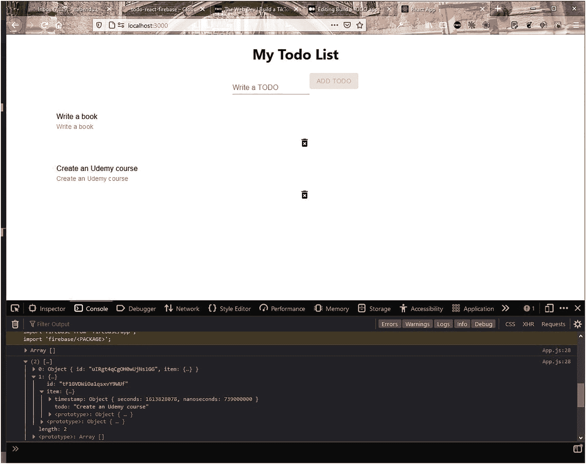

图 2-17

控制台日志

我们完成了应用，只剩下样式。现在让我们把它变得更漂亮。在`App.js`文件中，将`className`改为`app`。更新后的代码在这里用粗体标记:

```jsx
return (
   <div className="app">
   ...
   </div>
);
}

export default App;

```

接下来，在`App.css`文件中，删除所有内容并插入如下所示的内容:

```jsx
.app {
    display:grid;
    place-items: center;
}

```

现在，在`Todo.js`文件中，为`Todo.css`文件添加导入。另外，将删除图标的`fontSize`设置为`large`。更新后的代码在这里用粗体标记:

```jsx
import './Todo.css'

const Todo = ({ arr }) => {
    return (
    <List className="todo__list">
             ...
    <DeleteForeverIcon fontSize='large'
             onClick={() => {db.collection('todos').doc(arr.id).delete()}}
    />
    </List>
    )
}

```

接下来，在`Todo.css`文件中，添加以下内容:

```jsx
.todo__list{
    display:flex;
    justify-content: center;
    align-items: center;
    width: 800px;
    border: 1px solid lightgray;
    margin-bottom: 10px !important;
}

```

现在，在 localhost，这个应用看起来很完美(图 [2-18](#Fig18) )。

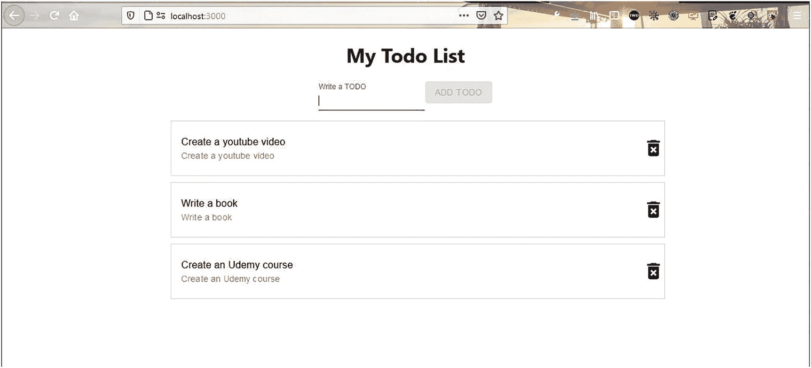

图 2-18

添加样式后的应用

## 部署火力基地

为了部署应用，我们将遵循第 [1](1.html) 章中的相同步骤。完成后，我们可以看到从终端成功部署了 app(图 [2-19](#Fig19) )。


图 2-19

完整的应用

## 摘要

在本章中，你创建了一个漂亮的待办事项应用。该应用的数据存储在 Firebase Firestore 数据库中，它甚至具有删除功能。