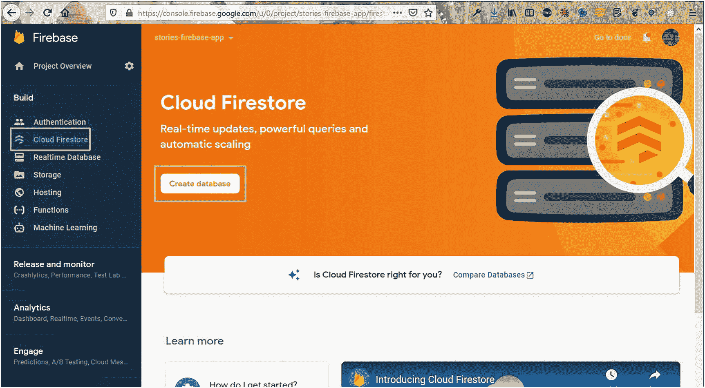

# 三、使用 React 和 Firebase 构建故事应用

在本章中，您将学习如何在 ReactJS 中构建一个 stories 应用。如今，故事应用非常受欢迎，每个大型社交媒体平台都有能力让用户将短视频*故事*添加到他们的平台上。在我们的应用中，我们将能够滚动存储在 Firebase Firestore 数据库中的短视频。最终的应用将如图 [3-1](#Fig1) 所示。


图 3-1

正在使用的最终应用

主机和数据库将在 Firebase。我们也将在项目中使用图标的材料用户界面。

因此，使用`create-react-app`命令创建一个名为`stories-firebase-app`的新应用。具体来说，打开任何终端并运行以下命令:

```jsx
npx create-react-app stories-firebase-app

```

## 初始 Firebase 设置

由于我们的前端站点也将通过 Firebase 托管，我们将创建基本设置，而`create-react-app`命令创建我们的 React 应用。继续按照第 [1](1.html) 章中列出的步骤创建应用。我已经创建了一个名为`stories-firebase-app`的应用(图 [3-2](#Fig2) )。


图 3-2

创建应用

现在，点击屏幕左上角的**设置**图标。之后点击**项目设置**按钮(图 [3-3](#Fig3) )。


图 3-3

设置

现在，向下滚动，点击**配置**单选按钮，然后复制`firebaseConfig`部分的所有代码(图 [3-4](#Fig4) )。


图 3-4

。firebaseConfig 程式码

## 基本 React 设置

我们的 React 设置应该已经完成了。所以，回到终端，将`cd`放入新创建的`stories-firebase-app`目录。

之后，在 VS 代码中打开目录，在`src`文件夹中创建一个名为`firebase.js`的文件，并将之前 Firebase 屏幕中的内容粘贴到那里。代码如下所示:

```jsx
const firebaseConfig = {
        apiKey: "AIxxxxxxxxxxxxxxxxxxxxxxxxxxKT4",
        authDomain: "stories-xxxxxx.xxxxxxxx.com",
        projectId: "stories-xxxxxx",
        storageBucket: "stories-fxxxxxxxx.com",
        messagingSenderId: "50xxxxxxxx63",
        appId: "1:507xxxxxxx63:web:0c9xxxxxxxxxxda8e"
};

```

在`stories-firebase-app`目录下，用`npm start`启动 React app。接下来，我们将删除一些文件，如图 [3-5](#Fig5) 所示，因为我们不需要它们。


图 3-5

删除一些代码

我们将删除所有不必要的样板代码，因此我们的`index.js`文件将如下所示:

```jsx
import React from 'react';
import ReactDOM from 'react-dom';
import './index.css';
import App from './App';

ReactDOM.render(
    <React.StrictMode>
        <App />

    </React.StrictMode>,
    document.getElementById('root')
);

```

`App.js`文件只包含“Stories app React”文本。我们已经从`App.css`文件中删除了所有其他内容。这里显示了`App.css`文件的更新代码:

```jsx
import './App.css';

function App() {
    return (
        <div className="app">
        <h1>Stories app React</h1>
        </div>
    );
}
export default App;

```

在`index.css`文件中，更新 CSS 以通篇使用`margin: 0`。具体来说，在顶部添加以下代码:

```jsx
* {
   margin: 0;
}

```

## 应用的基本结构

我们现在将在应用中创建基本结构。所以，用下面的内容更新`App.js`。我们首先添加图像和标题。这里，我们创建了两个`div`:`app__top`和`app__videos`。现在，`app__top`包含一个图像和一个`h1`。

```jsx
import './App.css';

function App() {
    return (
        <div className="app">
        <div className="app__top">
            
            <h1>Shorts</h1>
        </div>
        <div className="app__videos">

        </div>
        </div>
    );
}

export default App;

```

接下来，我们将在`App.css`文件中添加新内容。在这里，我们使用网格将所有东西放置在中心。我们在两个地方也有`scroll-snap-type: y mandatory`的风格。它用于在我们的应用中提供平滑滚动的滚动功能。

```jsx
html{
    scroll-snap-type: y mandatory;
}

.app{
    display: grid;
    place-items: center;
    height: 100vh;
    background-color: black;
}

.app__top {
    margin-bottom: -150px;
}
.app__top > h1 {
    text-align: center;
    color: white;
}

.app__logo {
    height: 12vh;
}

.app__videos {
    position:relative;
    height: 65vh;
    background-color: white;
    width: 70%;
    border-radius: 20px;
    max-width: 450px;
    max-height: 1200px;
    overflow: scroll;
    scroll-snap-type: y mandatory;
}

.app__videos::-webkit-scrollbar{
    display: none;
}

.app__videos{
    -ms-overflow-style: none;
    scrollbar-width: none;
}

```

现在，我们的应用在 localhost 中将看起来如图 [3-6](#Fig6) 所示。


图 3-6

应用大纲

## 在应用中显示短视频

在上一节设置了基本布局后，我们现在将开始创建在我们的应用中显示短视频的功能。

首先，在`src`文件夹中创建一个`components`文件夹，并在`src`文件夹中创建两个名为`VideoCard.js`和`VideoCard.css`的文件。

接下来，在`VideoCard.js`文件中，放置`video`标签和一个垂直视频链接。我从我的频道上的一个简短的 YouTube 视频中复制了链接。

```jsx
import React from 'react'
import './VideoCard.css'

const VideoCard = () => {
    return (
        <div className="videoCard">
            <video
                src="https://res.cloudinary.com/dxkxvfo2o/video/upload/v1608169738/video1_cvrjfm.mp4"
                className="videoCard__player"
                alt="Short Video App"
                loop
            />
        </div>
    )
}

export default VideoCard

```

现在，我们将在`VideoCard.css`文件中添加以下代码。这里，我们再次需要添加`scroll-snap-align: start`来实现视频的平滑滚动功能。

```jsx
.videoCard{
    position: relative;
    background-color: white;
    width: 100%;
    height:100%;
    scroll-snap-align: start;
}

.videoCard__player{
    object-fit: fill;
    width: 100%;
    height: 100%;
}

```

现在，在`App.js`中，添加两个`VideoCard`组件，因为我们需要不止一个视频来查看捕捉功能。更新后的代码在这里以粗体显示:

```jsx
import './App.css';
import VideoCard from './components/VideoCard';

function App() {
         return (
         <div className="app">
         <div className="app__top">
                 ...
         </div>
         <div className="app__videos">
                 <VideoCard />
                 <VideoCard />
          </div>
         </div>
         );
}

export default App;

```

现在，视频通过抓拍功能完美显示(图 [3-7](#Fig7) )。


图 3-7

视频抓拍

现在我们的视频无法播放，因为我们还没有实现`onClick`功能。为了让它们播放，我们需要使用一个引用(或 *ref* )。ref 是必需的，因为我们将实现用户在屏幕上单击鼠标时的暂停和播放功能。我们将首先导入`useRef`和`useState`钩子，然后我们将添加一个`videoRef`变量。我们在`video`元素中使用了`videoRef`，我们还创建了一个触发函数`handleVideoPress`的`onClick`处理程序。

在`handleVideoPress`函数中，我们使用一个名为`playing`的状态变量来检查视频是否正在播放。我们将`videoRef.current.pause()`设置为暂停，并将`playing`状态改为`false`。我们在`else`部分做相反的事情。更新后的代码在这里用粗体标记:

```jsx
import React, { useRef, useState } from 'react'
import './VideoCard.css'

const VideoCard = () => {
        const [playing, setPlaying] = useState(false)
        const videoRef = useRef(null)

        const handleVideoPress = () => {
        if(playing){
               videoRef.current.pause()
               setPlaying(false)
        } else {
               videoRef.current.play()
               setPlaying(true)
       }
       }

       return (
        <div className="videoCard">
                  <video
                  ...
                  loop
                  ref={videoRef}
                  onClick={handleVideoPress}
                  />
        </div>
       )
}

export default VideoCard

```

现在，在 localhost 中，只需点击视频，它就会播放。再次点按以暂停播放。

## 创建标题组件

我们将为图标使用材质 UI，这是我们接下来要用到的。因此，我们需要根据文档做两个`npm install`。我们将使用以下命令通过终端安装`core`和`icons`:

```jsx
npm i @material-ui/core @material-ui/icons

```

我们现在将为我们的视频组件创建标题。因此，在`components`文件夹中创建名为`VideoHeader.js`和`VideoHeader.css`的文件。

```jsx
import React from 'react'
import './VideoHeader.css'

const VideoHeader = () => {
         return (
         <div className="videoHeader">

         </div>
         )
}

export default VideoHeader

```

现在，在`VideoHeader.js`文件中，放入以下内容。这里，我们使用`material-ui`来显示两个图标:`ArrowBackIos`和`CameraAltOutlined`。更新的内容在此处标记为粗体:

```jsx
import React from 'react'
import './VideoHeader.css'
import ArrowBackIosIcon from '@material-ui/icons/ArrowBackIos'
import CameraAltOutlinedIcon from '@material-ui/icons/CameraAltOutlined'

const VideoHeader = () => {
    return (
        <div className="videoHeader">
            <ArrowBackIosIcon />
            <h3>Shorts</h3>
            <CameraAltOutlinedIcon />
        </div>
    )
}

export default VideoHeader

```

接下来，我们将在`VideoHeader.css`文件中设置这些样式。

```jsx
.videoHeader {
    display: flex;
    justify-content: space-between;
    align-items: center;
    position: absolute;
    width: 100%;
    color: white;
}

.videoHeader > * {
    padding: 20px;
}

```

现在，将这个`VideoHeader`组件包含在`VideoCard.js`文件中。更新的内容在此处标记为粗体:

```jsx
import VideoHeader from './VideoHeader'

const VideoCard = () => {
    ...
    ...
        return (
        <div className="videoCard">
                <VideoHeader />
                  <video
                          ...
                  />
     </div>
     )
}

export default VideoCard

```

现在，在 localhost 中，我们看到了我们漂亮的 header 组件(图 [3-8](#Fig8) )。


图 3-8

页眉

## 创建页脚组件

我们现在将为视频组件创建一个页脚。页脚组件将在应用的页脚显示一些图标。因此，在`components`文件夹中创建两个名为`VideoFooter.js`和`VideoFooter.css`的文件。

此外，我们还通过在`VideoCard`组件中传递来自`App.js`文件的属性进行了一些优化。我们传递两组不同的属性，在两个`VideoCard`组件中。更新的内容在这里用粗体标记:

```jsx
import './App.css';
import VideoCard from './components/VideoCard';

function App() {
         return (
         <div className="app">
         <div className="app__top">
                  ...
         </div>
        <div className="app__videos">
        <VideoCard
                url="https://res.cloudinary.com/dxkxvfo2o/video/upload/v1608169738/video1_cvrjfm.mp4"
                channel="TWD"
                avatarSrc="https://pbs.twimg.com/profile_images/1020939891457241088/fcbu814K_400x400.jpg"
                song="I am a Windows PC"
                likes={950}
                shares={200}
         />

         <VideoCard
               url="https://res.cloudinary.com/dxkxvfo2o/video/upload/v1608169739/video2_mecbdo.mp4"
               channel="nabendu"
               avatarSrc="https://pbs.twimg.com/profile_images/1020939891457241088/fcbu814K_400x400.jpg"
               song="I am a good PC"
                likes={850}
                shares={150}
         />
         </div>
         </div>
        );
}

export default App;

```

那么在`VideoCard.js`文件中，我们将首先使用`video`中名为`url`的属性。此外，调用新的`VideoFooter`组件，在那里我们将传递其余的属性。更新的内容在这里用粗体标记:

```jsx
import VideoFooter from './VideoFooter'
import VideoHeader from './VideoHeader'

const VideoCard = ({ url, channel, avatarSrc, song, likes, shares }) => {
    ...
    ...
       return (
       <div className="videoCard">
                <VideoHeader />
                <video
                src={url}
                className="videoCard__player"
                alt="Short Video App"
                loop
                ref={videoRef}
                onClick={handleVideoPress}
                />
                <VideoFooter
                channel={channel}
                likes={likes}
                shares={shares}
                avatarSrc={avatarSrc}
                song={song}
                />
       </div>
      )
}

export default VideoCard

```

现在，我们的`VideoFooter.js`文件将包含以下内容。我们使用了`channel`和`avatarSrc`属性，展示了一个头像和一个频道名称。

```jsx
import React from 'react'
import './VideoFooter.css'
import { Button, Avatar } from '@material-ui/core'

const VideoFooter = ({ channel, avatarSrc, song, likes, shares }) => {
    return (
        <div className='videoFooter'>
            <div className="videoFooter__text">
                <Avatar src={avatarSrc} />
                <h3>
                    {channel} . <Button>Follow</Button>
                </h3>
            </div>
        </div>
    )
}

export default VideoFooter

```

接下来，我们将在`VideoFooter.css`文件中添加这些样式。

```jsx
.videoFooter__text{
    position: absolute;
    bottom: 0;
    color: white;
    display: flex;
    margin-bottom: 20px;
}

.videoFooter__text > h3 {
    margin-left: 10px;
    padding-bottom: 20px;
}

.videoFooter__text > h3 > button {
    color: white;
    font-weight: 900;
    text-transform: inherit;
}

```

现在，在 localhost 中我们将开始设置页脚组件(图 [3-9](#Fig9) )。


图 3-9

页脚

现在，让我们在项目中创建一个漂亮的 ticker。为此，我们将在项目中安装一个名为`react-ticker`的包。这个包允许我们显示移动的文本，比如新闻提要。我们可以使用集成终端通过以下命令进行安装:

```jsx
npm i react-ticker

```

接下来，我们将根据文档将`Ticker`与`MusicNoteIcon`一起包含在我们的`VideoFooter.js`文件中，如下所示:

```jsx
import MusicNoteIcon from '@material-ui/icons/MusicNote'
import Ticker from 'react-ticker'

const VideoFooter = ({ channel, avatarSrc, song, likes, shares }) => {
     return (
     <div className='videoFooter'>
     <div className="videoFooter__text">
             ..
     </div>
     <div className="videoFooter__ticker">
                   <MusicNoteIcon className="videoFooter__icon" />
                   <Ticker mode="smooth">
                   {({ index }) => (
                   <>

                   <h1>{song}</h1>
                   </>

                   )}
                   </Ticker>

     </div>
     </div>
     )
}

export default VideoFooter

```

接下来，我们将在`VideoFooter.css`文件中包含以下样式:

```jsx
    .videoFooter{
        position: relative;
        bottom: 100px;
        margin-left: 20px;
    }

    .videoFooter__ticker > .ticker{
        height: fit-content;
        margin-left: 30px;
        margin-bottom: 20px;
        width: 60%;
    }

    .videoFooter__ticker h1{
        padding-top: 7px;
        font-size: 12px;
        color: white;
    }

    .videoFooter__icon{
        position: absolute;
        left: 5px;
        color: white;
    }

```

现在，我们将看到这个漂亮的滚动条在本地主机的屏幕上滚动(图 [3-10](#Fig10) )。


图 3-10

心脏

现在，我们将在`VideoFooter.js`文件中添加一些剩余的元素来完成我们的应用。这里，我们添加了更多的图标，并使用了`likes`和`shares`属性:

```jsx
import Ticker from 'react-ticker'
import { Favorite, ModeComment, MoreHoriz, Send } from '@material-ui/icons'

const VideoFooter = ({ channel, avatarSrc, song, likes, shares }) => {
     return (
     <div className='videoFooter'>
             <div className="videoFooter__text">
                   ...
             </div>
             <div className="videoFooter__ticker">
                   ...
            </div>
            <div className="videoFooter__actions">
            <div className="videoFooter__actionsLeft">
            <Favorite fontSize="large" />
            <ModeComment fontSize="large" />
            <Send fontSize="large" />
            <MoreHoriz fontSize="large" />
            </div>
            <div className="videoFooter__actionsRight">
            <div className="videoFooter__stat">
                    <Favorite />
                    <p>{likes}</p>
            </div>
            <div className="videoFooter__stat">
                    <ModeComment />
                    <p>{shares}</p>
            </div>
            </div>
            </div>
     </div>
     )
}

export default VideoFooter

```

接下来，我们将在`VideoFooter.css`文件中添加一些新的样式，如下所示:

```jsx
.videoFooter__actions{
    display: flex;
    position: absolute;
    width: 95%;
    color: white;
    justify-content: space-between;
}

.videoFooter__actionsLeft > .MuiSvgIcon-root{
    padding: 0 10px;
}

.videoFooter__actionsRight{
    display: flex;
}

.videoFooter__stat{
    display: flex;
    align-items: center;
    margin-right: 10px;
}

.videoFooter__stat > p{
    margin-left: 3px;
}

```

现在，我们的应用完成了我们刚刚添加的附加元素(图 [3-11](#Fig11) )。


图 3-11

应用完成

## 设置 Firebase 数据库

我们现在将建立燃烧基地。首先要做的是通过从终端运行以下命令在我们的项目中安装 Firebase:

```jsx
npm i firebase

```

接下来，我们将更新我们的`firebase.js`文件以使用配置来初始化应用。之后，我们可以使用 Firestore 作为数据库。此处的更新内容以粗体标记:

```jsx
import firebase from 'firebase';

const firebaseConfig = {
    ...
};

const firebaseApp = firebase.initializeApp(firebaseConfig)
const db = firebaseApp.firestore()

export default db

```

现在，我们将返回 Firebase 并单击云 Firestore，然后单击**创建数据库**按钮(图 [3-12](#Fig12) )。



图 3-12

创建数据库

在下一个屏幕上，在 **测试模式**下选择**开始，然后点击**下一步**按钮(图 [3-13](#Fig13) )。**


图 3-13

测试模式

在下一个屏幕上，点击**使能**按钮(图 [3-14](#Fig14) )。


图 3-14

启用按钮

在下一个屏幕上，点击**开始采集**(图 [3-15](#Fig15) )。


图 3-15

开始收集

这将打开如图 [3-16](#Fig16) 所示的弹出窗口。我们需要给出收藏 ID，所以在收藏 ID 字段中输入**视频**，然后点击**下一步**按钮。


图 3-16

输入收藏 ID

在下一个屏幕上，点击**自动 ID** 创建文档 ID。还要添加字段**网址**、**频道**、 **avatarSrc** 、**歌曲**、**喜欢**、**分享**。将`App.js`文件中的所有值输入值字段。另外，请注意，喜欢、分享和消息是`number`类型，其余是`string`类型。之后点击**保存**按钮(图 [3-17](#Fig17) )。


图 3-17

创建收藏

这将把我们带回到主屏幕。现在点击**添加文档**链接。这将再次打开我们之前看到的同一个弹出窗口，在这里我们将添加来自`App.js`文件的另一个视频的细节(图 [3-18](#Fig18) )。


图 3-18

另一个系列

现在，我们的数据库中有两个视频(图 [3-19](#Fig19) )。


图 3-19

两个视频

## 将 Firebase 数据库与 React 集成

现在，返回到`App.js`并使用`useState`钩子创建一个名为 videos 的新状态。然后我们将映射它，并将参数传递给`VideoCard`组件。请注意，我们已经删除了硬编码的内容，因为我们不会从数据库中获得这些数据。更新的内容在这里用粗体标记:

```jsx
import { useState } from 'react';
import './App.css';
import VideoCard from './components/VideoCard';

function App() {
  const [videos, setVideos] = useState([])

  return (
         <div className="app">
         <div className="app__top">
         ...
         </div>
         <div className="app__videos">
                 {videos.map(({ url, channel, avatarSrc, song, likes, shares }) => (
                 <VideoCard
                        url={url}
                        channel={channel}
                        avatarSrc={avatarSrc}
                        song={song}
                        likes={likes}
                        shares={shares}
                 />
                 ))}
       </div>
       </div>
  );
}

export default App;

```

现在，我们将在应用中使用存储在本地 Firebase 文件中的数据。之后，在`useEffect`中，我们调用集合`videos`，然后拍摄快照。用 Firebase 的术语来说，这是实时数据，我们可以立即获得。然后，我们将通过`setVideos()`在视频数组中设置这些数据。

另外，请注意`useEffect`在数组中有视频。因此，每当一个新的视频被添加到 Firebase 数据库中，它就会立即显示在我们的应用中。更新的内容在这里用粗体标记:

```jsx
import { useEffect, useState } from 'react';
import './App.css';
import VideoCard from './components/VideoCard';
import db from './firebase';

function App() {
  const [videos, setVideos] = useState([])

  useEffect(() => {
     db.collection('videos').onSnapshot(snapshot => {
     setVideos(snapshot.docs.map(doc => doc.data()))
    })
  }, [videos])

  return (
  ...
  )

```

现在，我们的应用已经完成，我们正在从 Firebase 后端获取数据(图 [3-20](#Fig20) )。


图 3-20

从数据库获取数据

## 通过 Firebase 部署和托管

现在，我们可以在 Firebase 中部署我们的应用。我们只是按照前面描述的相同步骤。

部署成功，我们的应用工作正常(图 [3-21](#Fig21) )。


图 3-21

部署的应用

## 摘要

在本章中，您学习了如何创建故事视频应用。该应用的数据存储在 Firebase Firestore 数据库中，它还有一个很好的滚动功能。