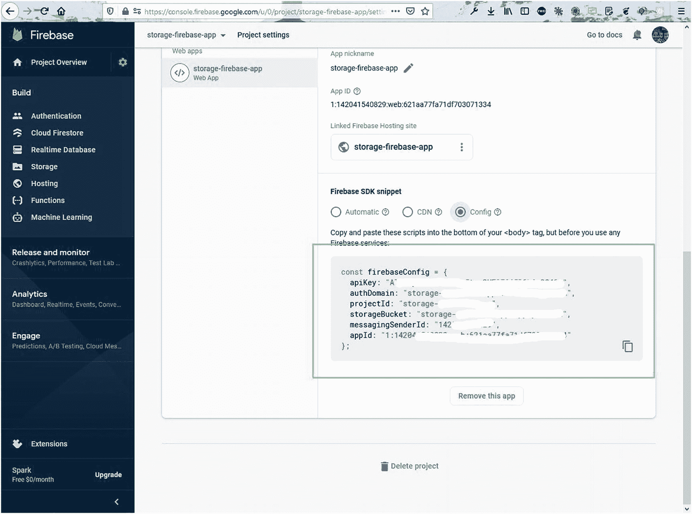
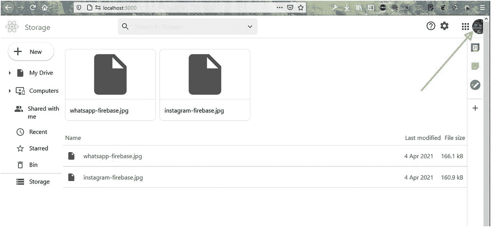

# 四、使用 React 和 Firebase 构建存储应用

欢迎来到新的 ReactJS 项目，我们将在 ReactJS 中构建一个存储应用。存储应用用于将您的数据存储在云中作为备份。有许多流行的存储应用，如 Dropbox 和 Google Drive。

主机和数据库将在 Firebase。该应用的登录将通过谷歌认证。我们也将在项目中使用图标的材料用户界面。最终项目将如图 [4-1](#Fig1) 所示。


图 4-1

已完成项目

## 入门指南

使用`create-react-app`命令创建一个名为`storage-firebase-app`的新应用。具体来说，打开任何终端并提供以下命令:

```jsx
npx create-react-app storage-firebase-app

```

### 初始 Firebase 设置

由于我们的前端站点也将通过 Firebase 托管，我们将创建基本设置，而这个`create-react-app`命令创建我们的 React 应用。在这一部分，我们将遵循与第 [1](1.html) 章相同的步骤。我已经创建了一个名为`storage-firebase-app`的应用(图 [4-2](#Fig2) )。


图 4-2

创建存储应用

现在，点击屏幕左上角的**设置**图标。之后点击**项目设置**按钮，如图 [4-3](#Fig3) 。


图 4-3

项目设置

现在，向下滚动，点击**配置**单选按钮，然后复制`firebaseConfig`元素的所有代码，如图 [4-4](#Fig4) 所示。



图 4-4

火基配置

### 基本 React 设置

我们现在将完成 React 设置。所以，回到终端，将`cd`放入新创建的`storage-firebase-app`目录。

之后，在 VS 代码中打开目录，在`src`文件夹中创建一个名为`firebase.js`的文件。将前面 Firebase 屏幕中的以下内容粘贴到该文件中:

```jsx
const  xxxxxxConfig = {
     apiKey: "AIXXXXXXXXXXXXXXXXXXXXXXXXXX",
     authDomain: "storage-XXXXXXXX.XXXXXXXXX.com",
     projectId: "storage- xxxxxx-app",
     storageBucket: "storage- xxxxxx-app.appspot.com",
     messagingSenderId: "14xxxxxxxx",
     appId: "1:142xxxxxxxxxxxxx:web:6xxxxxxxxxxx"
};

```

在`storage-firebase-app`目录中，用`npm start`启动 React 应用。接下来，我们将删除一些文件，因为我们不需要它们。我们正在删除它们，因为它们显示了 React 徽标和其他东西，需要在开始项目之前进行清理。图 [4-5](#Fig5) 显示要删除的文件。


图 4-5

删除文件

我们将删除所有不必要的样板代码，我们的`index.js`文件将如下所示:

```jsx
import React from 'react';
import ReactDOM from 'react-dom';
import './index.css';
import App from './App';

ReactDOM.render(
    <React.StrictMode>
        <App />
    </React.StrictMode>,
    document.getElementById('root')
);

```

`App.js`文件仅包含“存储应用 React”文本。我们还删除了`App.css`文件中的所有内容。

```jsx
import './App.css';

        function App() {
            return (
                <div className="app">
                <h1>Storage app React</h1>
                </div>
            );
        }
        export default App;

```

在`index.css`文件中，更新 CSS 以对所有内容使用`margin: 0`，如下所示:

```jsx
*{
  margin: 0;
}

```

## 创建标题

我们的 React 设置已经完成，我们将首先处理`Header`组件。因此，在`src`文件夹中创建一个名为`components`的文件夹。在`components`文件夹中创建一个`Header.js`文件。我们将首先将其导入到`App.js`文件中。

```jsx
function App() {
  return (
     <div className="app">
       <Header />
       </div>
  );
}
export default App;

```

我们也将为图标使用[材质界面](https://material-ui.com/)。因此，我们需要根据文档做两个`npm install`。

```jsx
npm i @material-ui/core @material-ui/icons

```

现在，我们的`Header.js`文件大部分是静态的。它将主要包含图标和标志。

这里我们有一个`div`叫做`header`，包含三个`div`，第一个是`header__logo`，包含一个图片和文字。下一个`div`是`header__searchContainer`，包含一个`SearchIcon`，一个输入框，和`ExpandMoreIcon`。

第三个`div`，称为`header__icons`，包含四个图标:`HelpOutlineIcon`、`SettingsIcon`、`AppsIcon`和`Avatar`。

```jsx
import React from 'react'
import SearchIcon from '@material-ui/icons/Search'
import ExpandMoreIcon from '@material-ui/icons/ExpandMore'
import HelpOutlineIcon from '@material-ui/icons/HelpOutline'
import SettingsIcon from '@material-ui/icons/Settings'
import AppsIcon from '@material-ui/icons/Apps'
import { Avatar } from '@material-ui/core'
import './Header.css'

const Header = () => {
    return (
        <div className="header">
            <div className="header__logo">
                
                <span>Storage</span>
            </div>
            <div className="header__searchContainer">
                <div className="header__searchBar">
                    <SearchIcon />
                    <input type="text" placeholder='Search in Storage' />
                    <ExpandMoreIcon />
                </div>
            </div>
            <div className="header__icons">
                <span>
                    <HelpOutlineIcon />
                    <SettingsIcon />
                </span>
                <AppsIcon />
                <Avatar className="header__iconsAvatar" />
            </div>
        </div>
    )
}

export default Header

```

现在，在同一个文件夹中创建一个名为`Header.css`的文件，并向其中添加以下内容。这里，我们使用了很多 flexboxes 来设计我们的页眉。

```jsx
.header {
    display: flex;
    height: 60px;
    border-bottom: 1px solid rgb(219, 219, 219);
    width: 100vw;
}

.header>div {
    padding: 12px;
}

.header__logo {
    display: flex;
    justify-content: flex-start;
    align-items: center;
}

.header__logo>img {
    height: 100%;
    object-fit: contain;
}

.header__logo>span {
    color: gray;
    font-size: 20px;
    font-weight: 500;
    margin-left: 16px;
}

.header__searchContainer {
    flex: 1;
    display: flex;
    align-items: center;
    padding: 8px;
}

.header__searchBar {
    width: 45%;
    height: 120%;
    border-radius: 6px;
    background-color: rgb(237, 237, 237);
    display: flex;
    align-items: center;
    padding: 0 8px;
}

.MuiSvgIcon-root {
    color: rgb(82, 82, 82);
}

.header__searchBar>input {
    flex: 1;
    height: 60%;
    font-size: 16px;
    color: lightgray;
    background: none;
    border: none;
    margin-left: 12px;
}

.header__searchBar>input:focus {
    outline: none;
    color: black;
}

.header__icons {
    display: flex;
    align-items: center;
    margin-right: -30px;
}

.header__icons .MuiSvgIcon-root {
    font-size: 28px;
    color: rgb(82, 82, 82);
    margin: 4px;
}

.header__icons>span{
    margin-right: 20px;
}

.header__iconsAvatar{
    margin-right: 24px;
}

```

现在，我们的头已经完成，看起来像 localhost 上的图 [4-6](#Fig6) 。


图 4-6

我们在本地主机上的标题

## 创建侧栏

现在我们的 header 组件已经完成，我们将创建`Siderbar`组件。为此，首先将`Siderbar`组件导入到我们的`App.js`文件中。这里的代码以粗体显示:

```jsx
import './App.css';
import Header from './components/Header';
import Sidebar from './components/Sidebar';

function App() {
  return (
     <div className="app">
     <Header />
     <Sidebar />
     </div>
  );
}
export default App;

```

接下来，在`components`文件夹中创建一个名为`Sidebar.js`的文件，并在其中添加以下内容。这里，我们调用两个组件:`FileComponent`和`SidebarItem`。在`SidebarItem`组件中，我们也传递属性，其中之一就是图标。

```jsx
import React from 'react';
import FileComponent from './FileComponent';
import SidebarItem from './SidebarItem';
import InsertDriveFileIcon from '@material-ui/icons/InsertDriveFile';
import ImportantDevicesIcon from '@material-ui/icons/ImportantDevices';
import PeopleAltIcon from '@material-ui/icons/PeopleAlt';
import QueryBuilderIcon from '@material-ui/icons/QueryBuilder';
import StarBorderIcon from '@material-ui/icons/StarBorder';
import DeleteOutlineIcon from '@material-ui/icons/DeleteOutline';
import StorageIcon from '@material-ui/icons/Storage';
import './Sidebar.css';

const Sidebar = () => {
    return (
        <div className="sidebar">
            <FileComponent />
            <div className="sidebar__itemsContainer">
                <SidebarItem arrow icon={(<InsertDriveFileIcon />)} label={'My Drive'} />
                <SidebarItem arrow icon={(<ImportantDevicesIcon />)} label={'Computers'} />
                <SidebarItem icon={(<PeopleAltIcon />)} label={'Shared with me'} />
                <SidebarItem icon={(<QueryBuilderIcon />)} label={'Recent'} />
                <SidebarItem icon={(<StarBorderIcon />)} label={'Starred'} />
                <SidebarItem icon={(<DeleteOutlineIcon />)} label={'Bin'} />
                <hr/>
                <SidebarItem icon={(<StorageIcon />)} label={'Storage'} />
            </div>
        </div>

    )
}

export default Sidebar

```

现在，在同一个`components`文件夹中创建一个`FileComponent.js`文件。它包含`AddIcon`和`New`图标。

```jsx
import React from 'react'
import AddIcon from '@material-ui/icons/Add'
import './FileComponent.css'

const FileComponent = () => {
    return (
        <div className="file">
            <div className="file__container">
                <AddIcon fontSize='large' />
                <p>New</p>
            </div>
        </div>
    )
}

export default FileComponent

```

现在，在`components`文件夹中创建一个名为`SidebarItem.js`的文件。需要三个属性:`arrow`、`icon`、`label`。只有当`arrow`属性通过时，我们才显示`ArrowRightIcon`。

```jsx
import React from 'react'
import './SidebarItem.css'

import ArrowRightIcon from '@material-ui/icons/ArrowRight';

const SidebarItem = ({ arrow, icon, label }) => {
    return (
        <div className='sidebarItem'>
            <div className="sidebarItem__arrow">
                {arrow && (<ArrowRightIcon />)}
            </div>

            <div className='sidebarItem__main'>
                {icon}
                <p>{label}</p>
            </div>
        </div>

)
}

export default SidebarItem

```

图 [4-7](#Fig7) 显示了图标在本地主机上的样子。


图 4-7

本地主机上的图标

现在，是时候改变我们的风格了。因此，在`Sidebar.css`文件中添加以下代码:

```jsx
.sidebar{
    width: 15%;
    height: 100vh;
    margin-right: 5px;
}

hr{
    background-color: rgb(197, 197, 197);
    height: 1px;
    border: none;
}

```

接下来，在`SidebarItem.css`文件中，添加以下内容:

```jsx
.sidebarItem{
    display: flex;
    padding: 10px 0;
    border-radius: 0 100px 100px 0;
}

.sidebarItem:hover{
    background-color: rgba(0, 0, 0, 0.04);
}

.sidebarItem__arrow{
    width: 28px;
    margin-left: 12px;
}

.sidebarItem__main{
    display: flex;
}

.sidebarItem__main>p{
    margin-left: 12px;
}

```

在`FileComponent.css`中，增加以下内容:

```jsx
.file {
    display: flex;
    align-items: center;
    padding: 12px 0;
    padding-left: 20px;
}

.file__container {
    display: flex;
    justify-content: center;
    align-items: center;
    padding: 6px 32px 6px 8px;
    border-radius: 50px;
    box-shadow: 0 1px 2px 0 rgba(60, 64, 67, 0.302), 0 1px 3px 1px rgba(60, 64, 67, 0.149);
    cursor: pointer;
}

.file__container>p{
    margin-left: 14px;
}

```

侧边栏看起来很棒，如图 [4-8](#Fig8) 所示。


图 4-8

补充报道

## 使用 Firebase 上传文件

我们需要有一些上传文件的逻辑，但为此我们首先需要在我们的项目中有 Firebase。

首先要做的是通过从终端运行以下命令在我们的项目中安装 Firebase:

```jsx
npm i firebase

```

接下来，我们将更新我们的`firebase.js`文件，以使用配置来初始化应用。之后，我们可以使用 Firestore 作为数据库。我们还在项目中使用谷歌认证和存储。

```jsx
import firebase from 'firebase'

  const firebaseConfig = {
      ...
      ...
  };

  const firebaseApp = firebase.initializeApp(firebaseConfig)

  const auth = firebase.auth()
  const provider = new firebase.auth.GoogleAuthProvider()
  const storage = firebase.storage()
  const db = firebaseApp.firestore()

  export { auth, provider, db, storage }

```

回到`FileComponent.js`文件，我们将导入必要的模块。我们在这里使用来自材质 UI 的`Modal`。更新后的代码在这里用粗体标记:

```jsx
import React, { useState } from 'react'
import AddIcon from '@material-ui/icons/Add'
import './FileComponent.css'
import firebase from 'firebase'
import { storage, db } from '../firebase'
import { makeStyles } from '@material-ui/core/styles';
import Modal from '@material-ui/core/Modal';
function getModalStyle() {
     return {
     top: `50%`,
     left: `50%`,
     transform: `translate(-50%, -50%)`,
     };
}
const useStyles = makeStyles((theme) => ({
     paper: {
     position: 'absolute',
     width: 400,
     backgroundColor: theme.palette.background.paper,
     border: '2px solid #000',
     boxShadow: theme.shadows[5],
     padding: theme.spacing(2, 4, 3),
     },
}));

const FileComponent = () => {
     const classes = useStyles();
     const [modalStyle] = useState(getModalStyle);
     const [open, setOpen] = useState(false);
     const [file, setFile] = useState(null)
     const [uploading, setUploading] = useState(false)
     const handleOpen = () => { setOpen(true); };
     const handleClose = () => { setOpen(false); };
     return (
     <div className="file">
             <div className="file__container">
             <AddIcon fontSize='large' />
             <p>New</p>
             </div>
      </div>
     )
}

export default FileComponent

```

现在，在`FileComponent.js`的`return`块中，我们将显示`Modal`。`Modal`的内容将是一个输入类型文件和一个按钮。更新后的代码在这里用粗体标记:

```jsx
...
...
     return (
         <div className="file">
                 <div className="file__container" onClick={handleOpen}>
                 <AddIcon fontSize='large' />
                 <p>New</p>
                 </div>
                 <Modal
                 open={open}
                 onClose={handleClose}
                 aria-labelledby="simple-modal-title"
                 aria-describedby="simple-modal-description"
                 >
                 <div style={modalStyle} className={classes.paper}>
                 <p>Select files you want to upload!</p>
                 {
                       uploading ? (
                       <p>Uploading...</p>
                       ) : (
                       <>
                       <input type="file" onChange={handleChange} />
                       <button onClick={handleUpload}>Upload</button>
                       </>

                       )
                 }
                 </div>
                 </Modal>
       </div>

       )
...
...

```

接下来，我们将在`FileComponent.js`文件中创建`handleChange`和`handleUpload`函数。在`handleChange`函数中，我们将文件设置为`setFile()`，在`handleUpload`函数中，我们获取上传的文件并将它的各种元素保存在`fileUrl`中，比如它的标题。这些将在我们的应用中稍后显示。更新后的代码在这里用粗体标记:

```jsx
...
...
const FileComponent = () => {
  ...
  ...

     const handleChange = (e) => {
     if (e.target.files[0]) {
    setFile(e.target.files[0])
    }

    }

    const handleUpload = () => {
    setUploading(true)
    storage.ref(`files/${file.name}`).put(file).then(snapshot => {
    console.log(snapshot)
    storage.ref('files').child(file.name).getDownloadURL().then(url => {
                    db.collection('myFiles').add({
                    timestamp: firebase.firestore.FieldValue.serverTimestamp(),
                    caption: file.name,
                    fileUrl: url,
                    size: snapshot._delegate.bytesTransferred,
                    })
                    setUploading(false)
                    setOpen(false)
                    setFile(null)
    })

    storage.ref('files').child(file.name).getMetadata().then(meta => {
    console.log(meta.size)
    })

    })
    }

    return (
    ...
    ...
    )

}

export default FileComponent

```

为了让我们的代码工作，我们需要在 Firebase 中设置存储。因此，从 Firebase 控制台，点击**存储**，然后**开始**。现在会弹出如图 [4-9](#Fig9) 所示的窗口，需要点击**下一步**按钮。


图 4-9

入门指南

在下一个画面中，点击**完成**按钮，如图 [4-10](#Fig10) 所示。


图 4-10

完成的

Firebase 需要验证才能上传文件。由于我们还没有设置认证，我们需要改变规则，如图 [4-11](#Fig11) 所示。


图 4-11

规则

现在，回到 localhost，单击 **New** 按钮，将显示一个弹出窗口。在弹出的界面中，您可以上传任何文件，如图 [4-12](#Fig12) 所示。


图 4-12

上传文件的弹出窗口

选择一个文件后点击**上传**按钮，将该文件上传到 Firebase，如图 [4-13](#Fig13) 所示。


图 4-13

Firebase 上传

## 使用 FileViewer 组件显示文件

我们有上传文件的逻辑，但是现在我们想在我们的项目中显示文件。

我们还需要首先启用 Firestore。为此，返回到 Firebase 控制台，点击**云 Firestore** ，然后点击**创建数据库**按钮，如图 [4-14](#Fig14) 所示。


图 4-14

创建数据库

在下一个画面中，在 **测试模式**下选择**开始，然后点击**下一个**按钮，如图 [4-15](#Fig15) 所示。**


图 4-15

测试模式

之后，在下一个屏幕上，点击**使能**按钮，如图 [4-16](#Fig16) 所示。


图 4-16

启用按钮

现在，创建一个名为`FilesViewer.js`的文件，并在其中添加以下内容。在这里，我们通过调用`useEffect`钩子内的`FilesViewer.js`从 Firebase 获取所有文件细节。获得数据后，我们对其进行映射，并将其传递给我们接下来将创建的`FileItem`组件。

```jsx
import React, { useEffect, useState } from 'react'
import './FilesViewer.css'
import { db } from '../firebase'
import FileItem from './FileItem'

const FilesViewer = () => {
    const [files, setFiles] = useState()

useEffect(() => {
        db.collection('myFiles').onSnapshot(snapshot => {
            setFiles(snapshot.docs.map(doc => ({
                id: doc.id,
                item: doc.data()
            })))
        })
    }, [])

    return (
        <div className='fileViewer'>
            <div className="fileViewer__row">
            </div>
            <div className="fileViewer__titles">
                <div className="fileViewer__titles--left">
                    <p>Name</p>
                </div>
                <div className="fileViewer__titles--right">
                    <p>Last modified</p>
                    <p>File size</p>
                </div>
            </div>

            {
                files.map(({ id, item }) => (
                    <FileItem id={id} caption={item.caption} timestamp={item.timestamp} fileUrl={item.fileUrl} size={item.size} />
                ))
            }
        </div>
    )
}

export default FilesViewer

```

接下来，创建一个名为`FileItem.js`的文件，并在其中添加以下内容。在这里，我们只是显示数据。但是其中一个主要的是`readableFileSizeStr`函数。通过这个功能，我们可以显示正确的数字。

```jsx
import React from 'react'
import './FileItem.css'

import InsertDriveFileIcon from '@material-ui/icons/InsertDriveFile';

const monthNames = ["Jan", "Feb", "Mar", "Apr", "May", "Jun", "Jul", "Aug", "Sep", "Oct", "Nov", "Dec"];

const FileItem = ({ id, caption, timestamp, fileUrl, size }) => {
    const fileDate = `${timestamp?.toDate().getDate()} ${monthNames[timestamp?.toDate().getMonth() + 1]} ${timestamp?.toDate().getFullYear()}`

const readableFileSizeStr = (fileSizeInBytes) => {
        let i = -1;
        const byteUnits = [' kB', ' MB', ' GB', ' TB', 'PB', 'EB', 'ZB', 'YB'];
        do {
            fileSizeInBytes = fileSizeInBytes / 1024;
            i++;
        } while (fileSizeInBytes > 1024);
        return Math.max(fileSizeInBytes, 0.1).toFixed(1) + byteUnits[i];
    };

return (
        <div className='fileItem'>
            <a href={fileUrl} target="_blank" rel="noreferrer" download>
                <div className="fileItem--left">
                    <InsertDriveFileIcon />
                    <p>{caption}</p>
                </div>
                <div className="fileItem--right">
                    <p>{fileDate}</p>
                    <p>{readableFileSizeStr(size)}</p>
                </div>
            </a>
        </div>
    )
}

export default FileItem

```

现在，回到`App.js`，我们已经包含了`FilesViewer`组件，还添加了一个叫做`app__main`的`div`来包含它和`Sidebar`组件。更新后的代码以粗体显示:

```jsx
import './App.css';
import Header from './components/Header';
import Sidebar from './components/Sidebar';
import FilesViewer from './components/FilesViewer';

function App() {
  return (
     <div className="app">
     <Header />
     <div className="app__main">
            <Sidebar />
            <FilesViewer />
     </div>
     </div>
  );
}

export default App;

```

接下来，在`App.css`中，添加以下样式:

```jsx
.app__main{
    display: flex;
}

```

现在，回到 localhost，我们必须上传另一个文件；然后我们会看到文件细节，如图 [4-17](#Fig17) 所示。


图 4-17

文件详细信息

现在，我们将在这些组件中添加样式。首先在`FileItem.css`文件中添加样式。

```jsx
.fileItem{
    height: 55px;
    border-bottom: 1px solid rgb(219, 219, 219);
    border-top: 1px solid rgb(219, 219, 219);
    width: 100%;
}

.fileItem>a{
    height: 100%;
    display: flex;
    text-decoration: none;
    color: rgb(85, 78, 78);
}

.fileItem>a>div{
    display: flex;
align-items: center;
}

.fileItem>a>div>*{
    margin: 10px;
}

.fileItem--left{
    flex: 1;
}

```

接下来，在`FilesViewer.css`文件中添加样式。

```jsx
.fileViewer{
width: 100%;
}

.fileViewer__row{
    height: 250px;
    display: flex;
    align-items: center;
}

.fileViewer__titles{
    display: flex;
    margin-bottom: 5px;
    color: rgb(85, 78, 78);
}

.fileViewer__titles>div>*{
    margin: 5px;
}

    .fileViewer__titles--left{
        flex: 1;
}

.fileViewer__titles--right{
    display: flex;
}

```

现在，我们的文件在 localhost 上看起来很棒，如图 [4-18](#Fig18) 所示。


图 4-18

布局

## 创建文件卡组件

我们现在创建一个`FileCard`组件来显示项目中文件的漂亮图标。

创建一个名为`FileCard.js`的文件，并将以下内容放入其中。在这里，我们只是显示一个大图标和文件名，从父组件传递过来。

```jsx
import React from 'react'
import './FileCard.css'

import InsertDriveFileIcon from '@material-ui/icons/InsertDriveFile';

const FileCard = ({ name }) => {
    return (
        <div className='fileCard'>
            <div className="fileCard--top">
                <InsertDriveFileIcon style={{ fontSize: 130 }} />
            </div>
            <div className="fileCard--bottom">
                <p>{name}</p>
            </div>
        </div>
    )
}

export default FileCard

```

接下来，在`FileCard.css`中，放入以下样式:

```jsx
.fileCard {
    height: 190px;
    width: 240px;
    border-radius: 10px;
    border: 1px solid rgb(219, 219, 219);
    margin: 5px;
}

.fileCard--top {
    height: 70%;
    border-bottom: 1px solid rgb(219, 219, 219);
    display: flex;
    justify-content: center;
    align-items: center;
}

.fileCard--bottom {
    display: flex;
    align-items: center;
    justify-content: center;
    width: 100%;
    height: 30%;
}

.fileCard--bottom>p {
    width: 90%;
    overflow: hidden;
    white-space: nowrap;
}

```

现在，我们需要在`FilesViewer.js`文件中导入`FileCard`组件。这里，我们映射了所有的文件，但只选择了五个，并将`name`值发送给`FileCard`组件。更新后的代码在这里被标记为粗体:

```jsx
...
import FileCard from './FileCard'

const FilesViewer = () => {
    ...
    ...

      return (
      <div className='fileViewer'>
         <div className="fileViewer__row">
         {
         files.slice(0, 5).map(({ id, item }) => (
         <FileCard key={id} name={item.caption} />
         ))

         }
         </div>
         ...
         ...
     </div>

     )
}

export default FilesViewer

```

现在，我们可以在 localhost 上看到一个大图标，如图 [4-19](#Fig19) 所示。


图 4-19

大图标

## 创建侧图标组件

我们现在创建一个`SideIcons`组件，在侧面显示一些漂亮的图标。创建一个名为`SideIcons.js`的文件，并将以下内容放入其中:

```jsx
import React from 'react'
import './SideIcons.css'
import AddIcon from '@material-ui/icons/Add'

const SideIcons = () => {
    return (
        <div className='sideIcons'>
            <div className="sideIcons__top">
                
                
                
            </div>
            <hr />
            <div className="sideIcons__plusIcon">
                <AddIcon />
            </div>
        </div>
    )
}

export default SideIcons

```

接下来，在`SideIcons.css`中，放入以下样式:

```jsx
.sideIcons{
    width: 50px;
    display: flex;
    flex-direction: column;
    align-items: center;
    border-left: 1px solid rgb(219, 219, 219);
}

.sideIcons__top{
    width: 100%;
    display: flex;
    flex-direction: column;
    align-items: center;
}

.sideIcons__top>img{
    object-fit: contain;
    width: 30px;
    margin: 10px 0;
}

.sideIcons>hr{
    margin: 12px 0;
    width: 90%;
}

.sideIcons__plusIcon{
    display: flex;
    align-items: center;
}

```

现在，导入`App.js`文件中的代码。此处的更新代码以粗体标记:

```jsx
...
import SideIcons from './components/SideIcons';

function App() {
  return (
     <div className="app">
     <Header />
     <div className="app__main">
     <Sidebar />
     <FilesViewer />
     <SideIcons />
     </div>
     </div>
  );
}
export default App;

```

现在，我们可以在右边栏看到这些漂亮的图标，如图 [4-20](#Fig20) 所示。


图 4-20

右侧的图标

## 添加 Google 身份验证

现在，我们的应用几乎完成了，但我们仍然需要添加谷歌认证。因此，进入 Firebase 控制台，点击**认证**选项卡，然后点击**开始**按钮，如图 [4-21](#Fig21) 所示。


图 4-21

身份验证入门

在下一个界面中，点击 Google 旁边的**编辑配置**图标，如图 [4-22](#Fig22) 所示。


图 4-22

点击谷歌

在弹出的消息中，点击**启用**按钮，之后输入您的 Gmail ID，点击**保存**按钮，如图 [4-23](#Fig23) 所示。


图 4-23

正在登录

接下来在`App.js`文件中，我们只需要从本地 Firebase 文件中导入`auth`和`provider`。之后，我们使用名为`signInWithPopup()`的方法来启用认证。

之后，在`return`块中，我们使用一个三元运算符来显示所有组件，如果我们有一个用户的话。如果没有找到用户，我们显示一个登录名`div`。此处的更新代码以粗体标记:

```jsx
import { auth, provider } from "./firebase";
import { useState } from 'react';

function App() {
  const [user, setUser] = useState(null)
  const handleLogin = () => {
     if (!user) {
     auth.signInWithPopup(provider).then(result => setUser(result.user))
      .catch(error => alert(error.message));
    }
  }

  return (
       <div className="app">
       {user ? (
       <>

       <Header userPhoto={user?.photoURL}/>
       <div className="app__main">
       <Sidebar />
       <FilesViewer />
       <SideIcons />
       </div>
       </>

       ) : (
       <div className='app__login'>
       
       <button onClick={handleLogin}>Log in to Storage</button>
       </div>
       )}
       </div>
  );
}
export default App;

```

现在，在`App.css`文件中，添加这些额外的样式:

```jsx
.app__login {
    width: 100vw;
    height: 100vh;
    display: grid;
    place-items: center;
}

.app__login>button{
    border: none;
    font-size: 24px;
    background-color: rgb(67, 130, 244);
    color: white;
    padding: 10px 20px;
    border-radius: 6px;
    transition: all 0.2s;
}

.app__login>button:hover{
    cursor: pointer;
    background-color: rgb(49, 94, 179);
    transform: scale(1.1);
}

```

因为我们将把`userPhoto`属性传递给`Header`组件，所以我们将在`Header.js`文件中使用它。此处的更新代码以粗体标记:

```jsx
...

const Header = ({ userPhoto }) => {
return (
         <div className="header">
              ...
              ...
             <div className="header__icons">
             <span>
             <HelpOutlineIcon />
             <SettingsIcon />
             </span>
             <AppsIcon />
             <Avatar className="header__iconsAvatar"src={userPhoto} />
             </div>
     </div>
     )
}

export default Header

```

现在，当我们转到 localhost 并点击**登录存储**时，我们会看到谷歌认证弹出窗口，如图 [4-24](#Fig24) 所示。


图 4-24

谷歌认证弹出窗口

当我们点击 Gmail ID 时，我们将进入我们的应用。在这里，我们可以在右上角看到已登录的用户图像，如图 [4-25](#Fig25) 所示。



图 4-25

登录用户

## 通过 Firebase 部署和托管

现在，我们可以按照前面描述的相同步骤在 Firebase 中部署我们的应用。部署成功且工作正常，如图 [4-26](#Fig26) 所示。


图 4-26

存储应用

## 摘要

在本章中，您学习了如何制作一个存储应用，您可以通过 Google 认证登录并上传文件。我们用 React 创建了 web 应用，并将数据存储在 Firebase 存储中。您还学习了如何在 Firebase 中进行托管。