# 五、使用 React 和 Firebase 构建一个与职业相关的社交媒体应用

欢迎来到一个新的 ReactJS 项目，这将是一个内置在 ReactJS 中的与职业相关的社交媒体应用。此外，我们将使用 Redux 和许多其他精彩的技术来创建这个应用。

主机和数据库将在 Firebase。我们也将在项目中使用图标的材料用户界面。

图 [5-1](#Fig1) 显示了完整的应用。

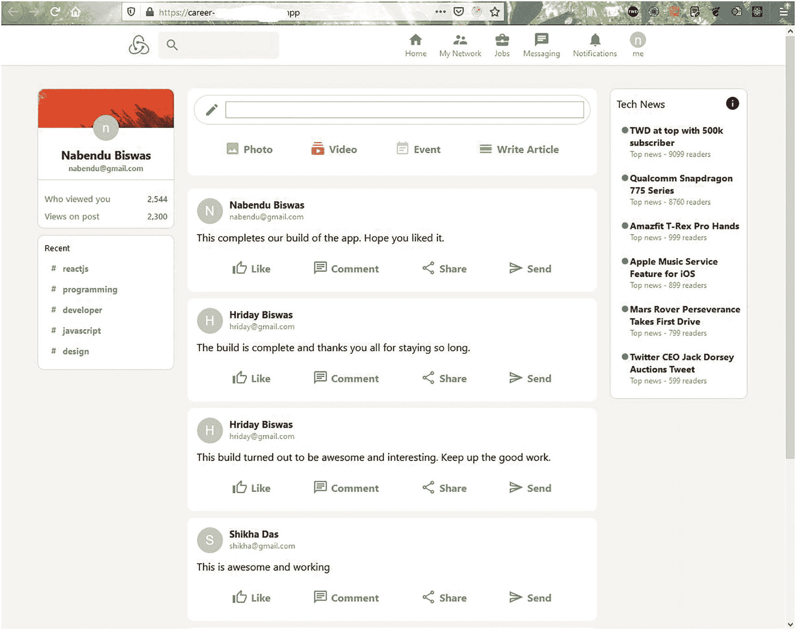

图 5-1

完成的应用

## 入门指南

使用`create-react-app`命令创建一个名为`career-firebase-app`的新应用。具体来说，打开任何终端并输入以下命令。注意，我们使用`template redux`将 Redux 包含在我们的项目中。

```jsx
npx create-react-app career-firebase-app --template redux

```

## 初始 Firebase 设置

由于我们的前端站点也将通过 Firebase 托管，我们将创建基本设置，而这个`create-react-app`命令创建我们的 React 应用。我们将遵循与第 [1](1.html) 章相同的步骤。我已经创建了一个名为`career-firebase-app`的应用(图 [5-2](#Fig2) )。


图 5-2

职业-firebase-应用

我们还将像上一章那样启用云 Firestore。最后，复制`firebaseConfig`的所有代码，如图 [5-3](#Fig3) 所示。(你可以在前一章找到这样做的步骤。)

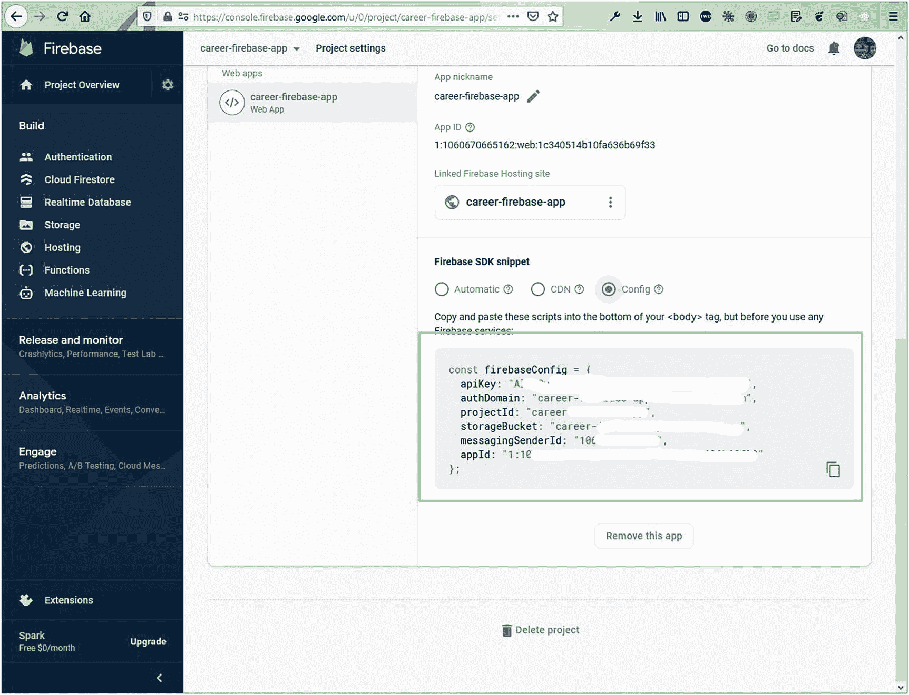

图 5-3

配置

## 基本 React 设置

我们的 React 设置将在此时完成。所以，回到终端，将`cd`放入新创建的`career-firebase-app`目录。

之后，在 VS 代码中打开目录，在`src`文件夹中创建一个名为`firebase.js`的文件，并将之前 Firebase 屏幕中的内容粘贴到其中。

```jsx
const  xxxxxxConfig = {
     apiKey: "AXXXXXXXXXXXXXXXXXXXXXXXX",
     authDomain: "career- xxxxxx-app. xxxxxxapp.com",
     projectId: "career- xxxxxx-app",
     storageBucket: "career- xxxxxx-app.appspot.com",
     messagingSenderId: "106xxxxxxxxxxxxxx",
     appId: "1:10xxxxxxxxxxx:web:1xxxxxxxxxxxxxx"
};

```

接下来，我们将进行清理过程，这与我们在上一章中所做的类似。首先我们将删除不必要的文件并更改`index.js`。

```jsx
import React from 'react';
import ReactDOM from 'react-dom';
import './index.css';
import App from './App';
import store from './app/store';
import { Provider } from 'react-redux';

ReactDOM.render(
  <React.StrictMode>
    <Provider store={store}>
      <App />
    </Provider>
  </React.StrictMode>,
  document.getElementById('root')
);

```

然后我们再改`App.js`，如下图:

```jsx
import React from 'react';
import './App.css';

function App() {
  return (
    <div className="app">
      <h1>Career Firebase App</h1>
    </div>
  );
}

export default App;

```

现在两个文件都包含了最少的内容。此外，删除`App.css`中的所有内容，并使`index.css`中的页边距为零。在这个过程之后，我们的本地主机将如图 [5-4](#Fig4) 所示。

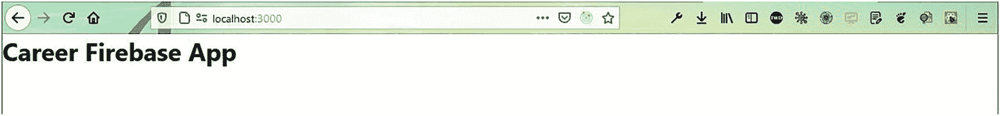

图 5-4

初始应用

## 创建标题

我们的 React 设置已经完成，我们将首先处理`Header`组件。因此，在`src`文件夹中创建一个名为`components`的文件夹。在`components`文件夹中创建`Header.js`和`Header.css`文件。但是我们将首先在`App.js`文件中导入`Header`组件。

```jsx
import React from 'react';
import './App.css';
import Header from './components/Header';

function App() {
  return (
     <div className="app">
          <Header />
     </div>
  );
}

export default App;

```

我们将为图标使用材质用户界面。因此，我们需要根据文档做两个`npm install`。我们将通过集成终端安装`core`和`icons`。

```jsx
npm i @material-ui/core @material-ui/icons

```

现在，我们的`Header.js`文件大部分是静态的。文件将主要包含图标和标志。

这里我们有一个`div`叫做`header`，包含两个`div`，第一个是`header__left`，包含一个图像，另一个`div`包含`Search`作为输入。下一个`div`是`header__right`，它包含对另一个组件`HeaderOption`的调用。

```jsx
import { Search, Home, SupervisorAccount, BusinessCenter, Chat, Notifications } from '@material-ui/icons'
import React from 'react'
import './Header.css'
import HeaderOption from './HeaderOption'

const Header = () => {
    return (
        <div className="header">
            <div className="header__left">
                
                <div className="header__search">
                    <Search />
                    <input type="text"/>
                </div>
            </div>
            <div className="header__right">
                <HeaderOption Icon={Home} title="Home" />
                <HeaderOption Icon={SupervisorAccount} title="My Network" />
                <HeaderOption Icon={BusinessCenter} title="Jobs" />
                <HeaderOption Icon={Chat} title="Messaging" />
                <HeaderOption Icon={Notifications} title="Notifications" />
                <HeaderOption avatar="https://pbs.twimg.com/profile_images/1020939891457241088/fcbu814K_400x400.jpg" title="me" />
            </div>
        </div>
    )
}

export default Header

```

现在，在同一个文件夹中创建一个名为`Header.css`的文件，并在其中添加以下内容。这里，我们使用了很多 flexboxes 来设计我们的页眉。

```jsx
.header{
    position: sticky;
    top: 0;
    display: flex;
    background-color: white;
    justify-content: space-evenly;
    border-bottom: 0.1px solid lightgray;
    padding: 10px 0;
    width: 100%;
    z-index: 999;
}

.header__left{
    display: flex;
}

.header__left > img{
    object-fit: contain;
    height: 40px;
    margin-right: 10px;
}

.header__search{
    padding: 10px;
    display: flex;
    align-items: center;
    border-radius: 5px;
    height: 22px;
    color:gray;
    background-color: #eef3f8;
}

.header__search > input{
    outline: none;
    border: none;
    background: none;
}

.header__right{
    display: flex;
}

```

接下来，创建`HeaderOption.js`文件，该文件将包含头像、图标、标题和属性，如下所示:

```jsx
import { Avatar } from '@material-ui/core'
import React from 'react'
import './HeaderOption.css'

const HeaderOption = ({ avatar, Icon, title }) => {
    return (
        <div className="headerOption">
            {Icon && <Icon className="headerOption__icon" />}
            {avatar && <Avatar className="headerOption__icon" src={avatar} />}
            <h3 className="headerOption__title">{title}</h3>
        </div>
    )
}

export default HeaderOption

```

现在，在`HeaderOption.css`文件中为此创建样式。

```jsx
.headerOption{
    display: flex;
    flex-direction: column;
    align-items: center;
    margin-right: 20px;
    color:gray;
    cursor: pointer;
}

.headerOption:hover{
    color: black;
}

.headerOption__title{
    font-size: 12px;
    font-weight: 400;
}

.headerOption__icon{
    object-fit: contain;
    height: 25px !important;
    width: 25px !important;
}

```

现在，在 localhost 上，我们可以看到如图 [5-5](#Fig5) 所示的漂亮标题。

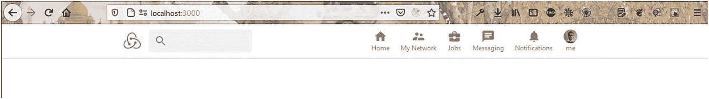

图 5-5

我们的标题

## 创建侧栏

我们现在将致力于`Sidebar`组件。因此，在文件夹`components`中创建`Sidebar.js`和`Sidebar.css`文件。但是我们将首先在`App.js`文件中导入侧栏。更新后的代码以粗体显示，如下所示:

```jsx
 import Sidebar from './components/Sidebar';

function App() {
  return (
     <div className="app">
     <Header />
     <div className="app__body">
           <Sidebar />
     </div>
     </div>
  );
}

export default App;

```

接下来，我们还将为`App.css`文件中的`app`和`app__body`添加样式。

```jsx
.app{
    background-color: #f3f2ef;
    display: flex;
    flex-direction: column;
    align-items: center;
}

.app__body{
    display: flex;
}

```

接下来将以下内容放入文件`Sidebar.js`。这里，侧边栏的主`div`包含三个`div`:`sidebar__top`、`sidebar__stats`和`sidebar__bottom`。

*   `sidebar__top`包含图像、头像、姓名和电子邮件。对于图像，我已经将一个图像放在了`public`文件夹中，这样我们就可以直接使用它了。

*   `sidebar__stats`包含两个被称为`sidebar__stat`的`div`，每个包含一个文本和一个数字段。

*   到目前为止，`sidebar__bottom`只包含一个带有“最近”一词的`p`标签。

```jsx
import { Avatar } from '@material-ui/core'
import React from 'react'
import './Sidebar.css'

const Sidebar = () => {
    return (
        <div className="sidebar">
            <div className="sidebar__top">
                
                <Avatar className="sidebar__avatar" />
                <h2>Nabendu Biswas</h2>
                <h4>nabendu.biswas@gmail.com</h4>
            </div>
            <div className="sidebar__stats">
                <div className="sidebar__stat">
                    <p>Who viewed you</p>
                    <p className="sidebar__statNumber">2,544</p>
                </div>
                <div className="sidebar__stat">
                    <p>Views on post</p>
                    <p className="sidebar__statNumber">2,300</p>
                </div>
            </div>
            <div className="sidebar__bottom">
                <p>Recent</p>
            </div>
        </div>
    )
}

export default Sidebar

```

现在，将以下样式放入`Sidebar.css`文件:

```jsx
.sidebar{
    position: sticky;
    top: 80px;
    flex: 0.2;
    border-radius: 10px;
    text-align: center;
    height: fit-content;
}

.sidebar__avatar{
    margin-bottom: 10px;
}

.sidebar__top{
    display: flex;
    flex-direction: column;
    align-items: center;
    border: 1px solid lightgray;
    border-bottom: 0;
    border-top-left-radius: 10px;
    border-top-right-radius: 10px;
    background-color: white;
    padding-bottom: 10px;
}

.sidebar__top > img{
    margin-bottom: -20px;
    width: 100%;
    height: 60px;
    border-top-left-radius: 10px;
    border-top-right-radius: 10px;
    object-fit: cover;
}

.sidebar__top > h4{
    color: gray;
    font-size: 12px;
}

.sidebar__top > h2{
    font-size: 18px;
}

.sidebar__stats{
    padding: 10px;
    margin-bottom: 10px;
    border: 1px solid lightgray;
    background-color: white;
    border-bottom-left-radius: 10px;
    border-bottom-right-radius: 10px;
}

.sidebar__stat{
    margin-top: 10px;
    display: flex;
    justify-content: space-between;
}

.sidebar__stat > p{
    color: gray;
    font-size: 13px;
    font-weight: 600;
}

.sidebar__statNumber{
    font-weight: bold;
    color: #0a66c2 !important;
}

.sidebar__bottom{
    text-align: left;
    padding: 10px;
    border: 1px solid lightgray;
    background-color: white;
    border-radius: 10px;
    margin-top: 10px;
}

```

现在，我们的侧边栏看起来像 localhost 上的图 [5-6](#Fig6) 。

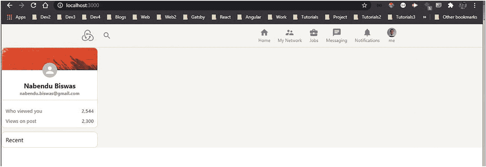

图 5-6

我们的侧栏

现在，我们将把`sidebar__bottom`中的所有项目放到`Sidebar.js`文件中。在这里，我们创建了函数`recentItem`，并向它传递不同的属性。更新后的代码在这里以粗体显示:

```jsx
const Sidebar = () => {
    const recentItem = (topic) => (
    <div className="sidebar__recentItem">
         <span className="sidebar__hash">#</span>
         <p>{topic}</p>
     </div>
     )

     return (
     <div className="sidebar">
              ...
              ...
             <div className="sidebar__bottom">
             <p>Recent</p>
             {recentItem("reactjs")}
             {recentItem("programming")}
             {recentItem("developer")}
             {recentItem("javascript")}
             {recentItem("design")}
             </div>
      </div>
     )
}

export default Sidebar

```

接下来，我们将在`Sidebar.css`文件中放入额外的样式，如下所示:

```jsx
.sidebar__bottom > p{
    font-size: 13px;
    padding-bottom: 10px;
}

    .sidebar__recentItem{
        display: flex;
        font-size: 13px;
        color: gray;
        font-weight: bolder;
        cursor: pointer;
        margin-bottom: 5px;
        padding: 5px;
    }

    .sidebar__recentItem:hover{
        background-color: whitesmoke;
        border-radius: 10px;
        cursor: pointer;
        color: black;
    }

    .sidebar__hash{
        margin-right: 10px;
        margin-left: 5px;
    }

```

现在，我们的本地主机将看起来如图 [5-7](#Fig7) 所示，带有最近框。

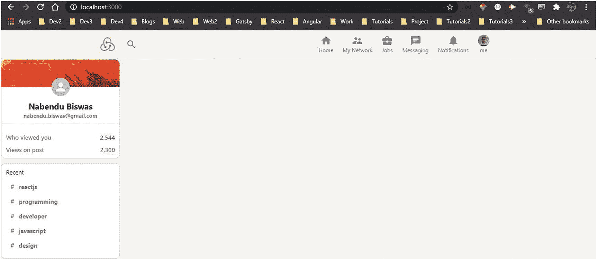

图 5-7

最近框

## 创建提要组件

我们现在将致力于`Feed`组件。因此，在文件夹`components`中，在文件夹`components`中创建名为`Feed.js`和`Feed.css`的文件。但是我们将首先在`App.js`文件中导入`Feed`组件。更新后的代码在这里以粗体显示:

```jsx
import Feed from './components/Feed';

function App() {
  return (
     <div className="app">
     <Header />
     <div className="app__body">
     <Sidebar />
     <Feed />
     </div>
     </div>
  );
}

export default App;

```

接下来，将以下内容放入文件`Feed.js`。这里，`feed`的主`div`包含一个叫做`feed__inputContainer`的`div`，它包含两个`div`:T6 和 T7。

*   `feed__input`包含一个创建图标和一个表单。该表单包含一个输入和一个按钮。

*   `feed__inputOptions`正在调用带有`Icon`、`title`和`color`属性的组件`InputOption`。`Icon`属性其实是一个材质 UI 图标。

```jsx
import { CalendarViewDay, Create, EventNote, Image, Subscriptions } from '@material-ui/icons'
import React from 'react'
import './Feed.css'
import InputOption from './InputOption'

const Feed = () => {
    return (
        <div className="feed">
            <div className="feed__inputContainer">
                <div className="feed__input">
                    <Create />
                    <form>
                        <input type="text"/>
                        <button type="submit">Send</button>
                    </form>
                </div>
                <div className="feed__inputOptions">
                    <InputOption Icon={Image} title="Photo" color="#70B5F9" />
                    <InputOption Icon={Subscriptions} title="Video" color="#E7A33E" />
                    <InputOption Icon={EventNote} title="Event" color="#C0CBCD" />
                    <InputOption Icon={CalendarViewDay} title="Write Article" color="#7FC15E" />
                </div>
            </div>
        </div>
    )
}

export default Feed

```

现在，将以下样式放入`Feed.css`文件:

```jsx
.feed{
    flex: 0.6;
    margin: 0 20px;
}

.feed__inputContainer{
    background-color: white;
    padding: 10px;
    padding-bottom: 20px;
    border-radius: 10px;
    margin-bottom: 20px;
}

.feed__input{
    border: 1px solid lightgray;
    border-radius: 30px;
    display: flex;
    padding: 10px;
    color: gray;
    padding-left: 15px;
}

.feed__input > form{
    display: flex;
    width: 100%;
}

.feed__input > form > input{
    border: none;
    flex: 1;
    margin-left: 10px;
    outline-width: 0;
    font-weight: 600;
}

.feed__input > form > button{
    display: none;
}

.feed__inputOptions{
    display: flex;
    justify-content: space-evenly;
}

```

现在，创建一个名为`InputOption.js`的文件，并将以下内容放入其中。该组件主要用于显示不同的图标和传递给它的属性。

```jsx
import React from 'react'
import './InputOption.css'

const InputOption = ({ Icon, title, color }) => {
    return (
        <div className="inputOption">
            <Icon style={{ color }} />
            <h4>{title}</h4>
        </div>
    )
}

export default InputOption

```

现在，我们将在`InputOption.css`文件中为此创建样式。

```jsx
.inputOption{
    display: flex;
    align-items: center;
    margin-top: 15px;
    color: gray;
    padding: 10px;
    cursor: pointer;
}

.inputOption:hover{
    background-color: whitesmoke;
    border-radius: 10px;
}

.inputOption > h4{
    margin-left: 5px;
}

```

我们的`Feed`组件已经完成，看起来像 localhost 上的图 [5-8](#Fig8) 。

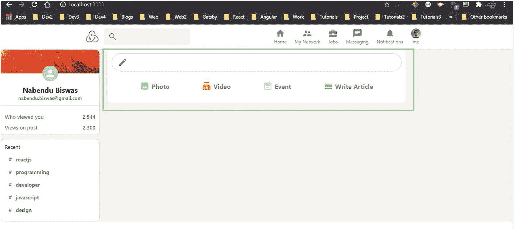

图 5-8

添加文章部分

## 构建 Post 部分

我们现在将致力于`Post`部分。因此，在文件夹`components`中，创建名为`Post.js`和`Post.css`的文件。但是我们将首先把`Post`组件导入到`Feed.js`文件中。另外，请注意，我们向它传递了三个属性:`name`、`description`和`message`。更新后的代码在这里以粗体显示:

```jsx
import Post from './Post'

const Feed = () => {
        return (
        <div className="feed">
        <div className="feed__inputContainer">
               ...
               ...
        </div>
        <Post name="Nabendu Biswas" description="This is a test" message="This is awesome thing to do" />
        </div>
        )
}

export default Feed

```

接下来将以下内容放入文件`Post.js`。这里，`post`的主`div`包含三个`div`:`post__header`、`post__body`和`post__buttons`。

*   `post__header`包含一个头像图标和另一个名为`post__info`的`div`，后者包含一个`h2`和`p`。我们在这里展示了`name`和`description`属性。

*   `post__body`显示消息属性。

*   `post__buttons`正在调用带有`Icon`、`title`和`color`属性的组件`InputOption`。`Icon`属性其实是一个材质 UI 图标。

```jsx
import { Avatar } from '@material-ui/core'
import { ChatOutlined, SendOutlined, ShareOutlined, ThumbUpAltOutlined } from '@material-ui/icons'
import React from 'react'
import InputOption from './InputOption'
import './Post.css'

const Post = ({ name, description, message, photoUrl }) => {
    return (
        <div className="post">
            <div className="post__header">
                <Avatar />
                <div className="post__info">
                    <h2>{name}</h2>
                    <p>{description}</p>
                </div>
            </div>
            <div className="post__body">
                <p>{message}</p>
            </div>
            <div className="post__buttons">
                <InputOption Icon={ThumbUpAltOutlined} title="Like" color="gray" />
                <InputOption Icon={ChatOutlined} title="Comment" color="gray" />
                <InputOption Icon={ShareOutlined} title="Share" color="gray" />
                <InputOption Icon={SendOutlined} title="Send" color="gray" />
            </div>
        </div>
    )
}

export default Post

```

现在，我们将在一个`Post.css`文件中设计这个组件。

```jsx
.post{
    background-color: white;
    padding: 15px;
    margin-bottom: 10px;
    border-radius: 10px;
}

.post__header{
    display:flex;
    margin-bottom: 10px;
}

.post__info{
    margin-left: 10px;
}

.post__info > p{
    font-size: 12px;
    color: gray;
}

.post__info > h2{
    font-size: 15px;
}

.post__body{
    overflow-wrap: anywhere;
}

.post__buttons{
    display: flex;
    justify-content: space-evenly;
}

```

现在，在 localhost 上，我们会看到一个漂亮的发布部分，如图 [5-9](#Fig9) 所示。

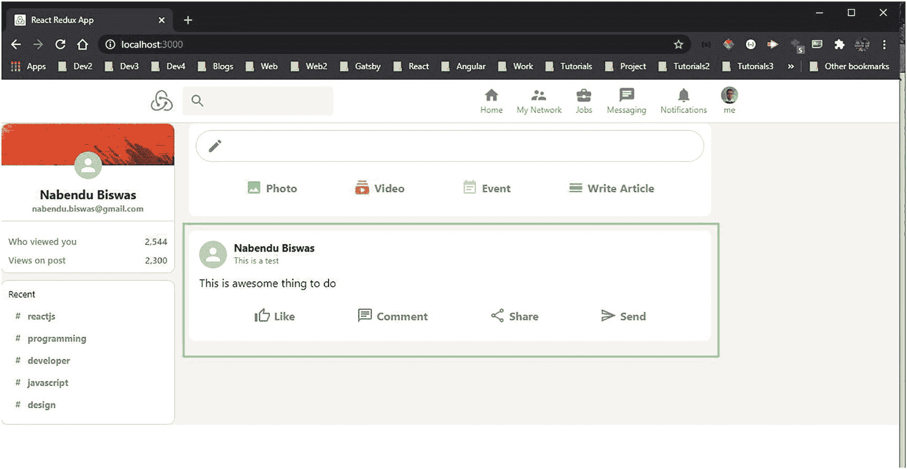

图 5-9

张贴示例

## 将 Firebase 与 React 集成

我们现在将把 Firebase 集成到我们的项目中。首先要做的是在我们的项目中安装 Firebase，方法是从终端运行以下命令。

```jsx
npm install firebase

```

接下来，您将更新我们的`firebase.js`文件，以使用配置来初始化应用。之后，使用 Firestore 作为数据库。我们也在项目中使用认证。

```jsx
import firebase from 'firebase'

const firebaseConfig = {
    ...
    ...
};

const firebaseApp = firebase.initializeApp(firebaseConfig)
const db = firebaseApp.firestore()
const auth = firebase.auth()

export { auth, db }

```

现在，回到`Feed.js`，我们首先进口所需的东西。之后，我们将创建两个状态变量:`posts`和`input`。

现在，在`useEffect`内部，我们将调用 Firebase 来获取`posts`集合，然后拍摄快照。用 Firebase 的术语来说，它是实时数据，我们可以立即获得。然后，我们将通过`setPosts()`在`posts`数组中设置这个数据。

我们还有一个`sendPost()`，马上就要和`onClick`挂钩了。这里，我们向 Firebase 添加一个帖子。消息将从输入字段中获取，而`timestamp`是服务器时间戳。我们正在对其余的字段进行硬编码。

现在，在`Feed.js`文件的`return`语句中，我们将`value`和`onChange`添加到输入字段，将`onClick`添加到按钮。

之后，我们通过`posts`数组进行映射，并将不同的属性从 Firebase 传递给`Post`组件。更新后的代码在这里以粗体显示:

```jsx
import React, { useEffect, useState } from 'react'
import { db } from '../firebase'
import firebase from 'firebase'

const Feed = () => {
      const [posts, setPosts] = useState([])
      const [input, setInput] = useState('')

      useEffect(() => {
      db.collection('posts').orderBy('timestamp', 'desc').onSnapshot(snapshot => {
      setPosts(snapshot.docs.map(doc => ({
      id: doc.id,
      data: doc.data()
      })))
      })
      }, [])

      const sendPost = e => {
      e.preventDefault()
      db.collection('posts').add({
      name: 'Nabendu Biswas',
      description: 'This is a test',
      message: input,
      photoUrl: '',
      timestamp: firebase.firestore.FieldValue.serverTimestamp()
      })
      setInput('')
      }

      return (
      <div className="feed">
      <div className="feed__inputContainer">
      <div className="feed__input">
          <Create />
          <form>
          <input value={input} onChange={e => setInput(e.target.value)} type="text" />
          <button onClick={sendPost} type="submit">Send</button>
          </form>
      </div>
      <div className="feed__inputOptions">
                  ...
      </div>
      </div>
      {posts.map(({ id, data }) => (
      <Post
          key={id}
          name={data.name}
          description={data.description}
          message={data.message}
          photoUrl={data.photoUrl}
      />
      ))}
      </div>
      )
}

export default Feed

```

现在，每当我们在输入框中键入一些内容并按 Enter 键时，这些内容就会实时显示在我们的应用中，如图 [5-10](#Fig10) 所示。

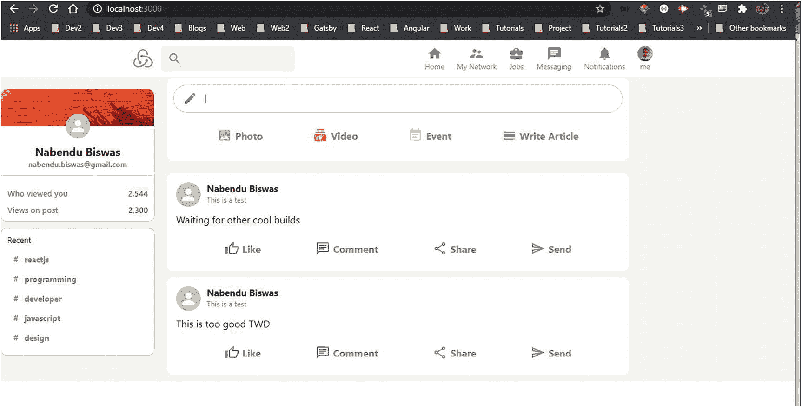

图 5-10

实时

## 集成冗余

我们现在将把 Redux 集成到我们的项目中。Redux 将用于获取用户详细信息并将它们存储在全局状态中，以便它们在所有组件中都可用。

因为我们已经在创建项目时添加了 Redux，所以我们需要删除一些样板代码。在`features\counter`文件夹中，删除`Counter.js`和`Counter.module.css`文件。

接下来，将`counterSlice.js`文件移动到`features`文件夹，并删除空的`counter`文件夹。

现在，在`store.js`文件中，更改名称，因为我们需要用户而不是计数器。此外，将`counterSlice.js`文件名改为`userSlice.js`。更新后的代码在这里以粗体显示:

```jsx
import { configureStore } from '@reduxjs/toolkit';
import userReducer from '../features/userSlice';

export const store = configureStore({
  reducer: {
     user: userReducer,
  },
});

```

现在，用以下内容更新`userSlice.js`。这里，我们有用户的初始状态。在那之后，我们有`login`和`logout`在减速器里面。两者都改变了用户状态。

我们正在导出`login`和`logout`，我们将很快使用它们来改变状态。我们也在导出`selectUser`，通过它我们可以得到任意时间点的用户状态。这方面的代码如下所示:

```jsx
import { createSlice } from '@reduxjs/toolkit';

export const userSlice = createSlice({
  name: 'user',
  initialState: {
    user: null,
  },
  reducers: {
    login: (state, action) => {
      state.user =  action.payload;
    },
    logout: state => {
      state.user = null;
    },
  },
});

export const { login, logout } = userSlice.actions;

export const selectUser = state => state.user.user;

export default userSlice.reducer;

```

现在，当我们转到 localhost 并打开 Redux devtool 时，我们可以看到用户的全局 Redux 状态，如图 [5-11](#Fig11) 所示。

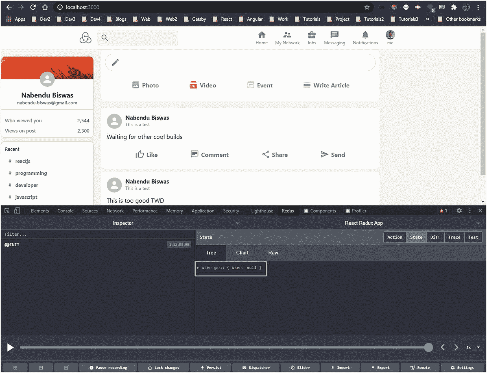

图 5-11

全球状态

## 构建登录页面

在本节中，我们将构建我们的登录页面并使用 Redux。因此，在`components`文件夹中创建两个名为`Login.js`和`Login.css`的文件。

在`App.js`文件中进行以下更改。这里，我们首先导入`useSelector`和`selectUser`，然后导入`Login`组件。

此外，我们正在使用来自`react-redux`的`useSelector`钩子。在`return`元素中，如果用户不可用，我们将显示`Login`组件或其他组件。更新后的代码在这里以粗体显示:

```jsx
import { useSelector } from 'react-redux';
import { selectUser } from './features/userSlice';
import Login from './components/Login';

function App() {
  const user = useSelector(selectUser)

  return (
     <div className="app">
     <Header />
     {!user ? (<Login />) : (
     <div className="app__body">
     <Sidebar />
     <Feed />
     </div>
     )}
     </div>
  );
}

export default App;

```

现在，在`Login.js`文件中，放入以下内容。这里，我们展示了一个图像和一个包含四个输入字段和一个按钮的表单。

我们在表单外还有一个段落，它包含一个要注册的跨度。

```jsx
import React from 'react'
import './Login.css'

const Login = () => {
    const register = () => {}
    const loginToApp = () => {}

return (
        <div className="login">
            
            <form>
                <input type="text" placeholder="Full name (required if registering)" />
                <input type="text" placeholder="Profile pic URL (optional)" />
                <input type="email" placeholder="Email" />
                <input type="password" placeholder="Password" />
                <button type="submit" onClick={loginToApp}>Sign In</button>
            </form>
            <p>Not a member?{' '}
                <span onClick={register} className="login__register">Register Now</span>
            </p>
        </div>
    )
}

export default Login

```

另外，在`Login.css`文件中添加以下样式:

```jsx
.login{
    display: grid;
    place-items: center;
    margin-left: auto;
    margin-right: auto;
    padding-top: 100px;
    padding-bottom: 100px;
}

.login > img{
    object-fit: contain;
    height: 70px;
    margin-top: 20px;
    margin-bottom: 20px;
}

.login > form{
    display: flex;
    flex-direction: column;
}

.login > form > input{
    width: 350px;
    height: 50px;
    font-size: 20px;
    padding-left: 10px;
    margin-bottom: 10px;
    border-radius: 5px;
}

.login > form > button{
    width: 365px;
    height: 50px;
    font-size: large;
    color: #fff;
    background-color: #0074b1;
    border-radius: 5px;
}

.login__register{
    color: #0177b7;
    cursor: pointer;
}

.login > p{
    margin-top: 20px;
}

```

现在，我们的登录屏幕在 localhost 上将如图 [5-12](#Fig12) 所示。

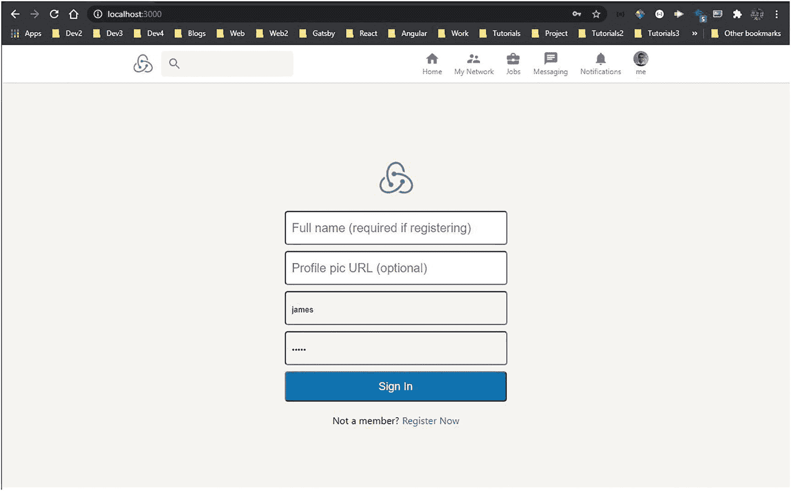

图 5-12

登录屏幕

## 添加电子邮件验证

现在，我们将向我们的应用添加电子邮件身份验证，因此我们必须首先从 Firebase 控制台启用它。

因此，点击**认证**选项卡，然后点击**开始**按钮，如图 [5-13](#Fig13) 所示。

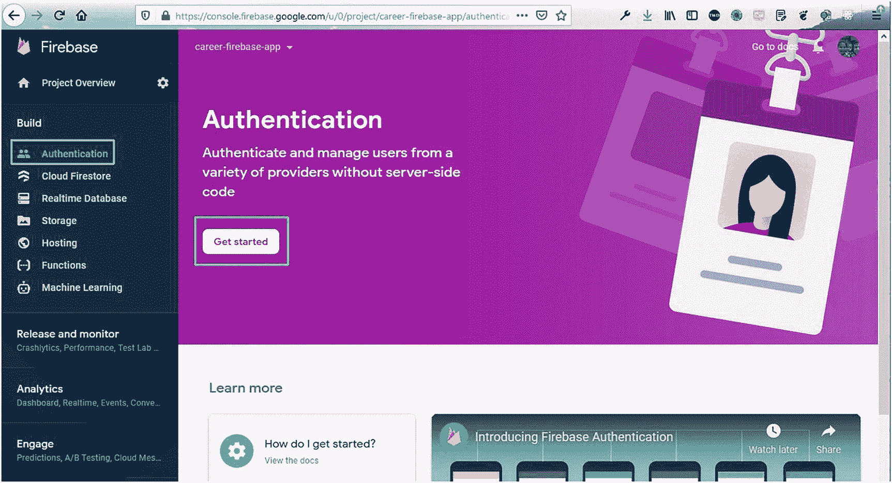

图 5-13

证明

之后，将鼠标悬停在 Email/Password 上，点击编辑图标，如图 [5-14](#Fig14) 所示。


图 5-14

电子邮件配置

在弹出的窗口中，点击**使能**按钮，然后点击**保存**按钮，如图 [5-15](#Fig15) 所示。

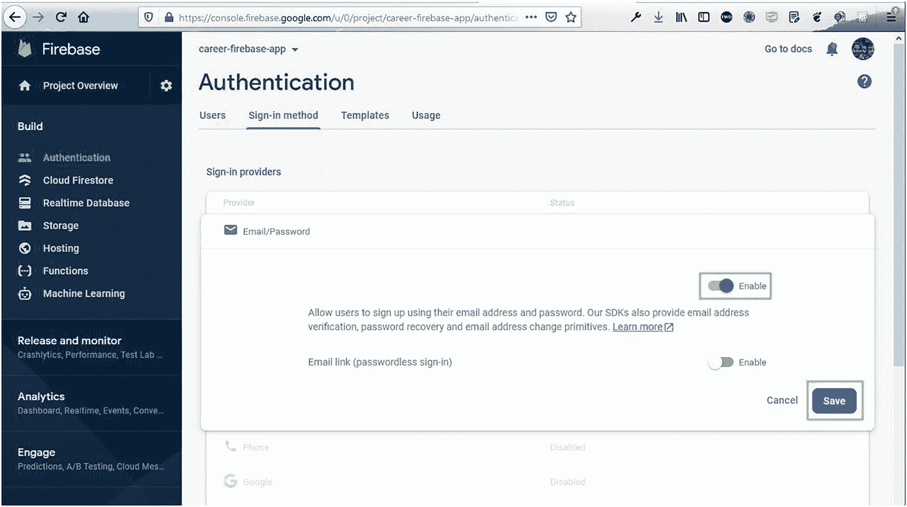

图 5-15

启用按钮

现在，在`Login.js`文件中，我们将为`email`、`password`、`name`和`profilePic`创建四个不同的状态变量。

我们还在这里完成了我们的`register`函数。在函数内部，如果用户没有输入名字，我们将返回。之后，我们使用 Firebase 的`createUserWithEmailAndPassword`来注册用户。

注册完成后，我们使用 Redux 的`dispatch`函数发送登录信息来设置全局状态。更新后的代码在这里以粗体显示:

```jsx
import React, { useState }  from 'react'
import { useDispatch } from 'react-redux'
import { auth } from '../firebase'
import { login } from '../features/userSlice'

const Login = () => {
     const [email, setEmail] = useState('')
     const [password, setPassword] = useState('')
     const [name, setName] = useState('')
     const [profilePic, setProfilePic] = useState('')
     const dispatch = useDispatch()
     const register = () => {
     if(!name) return alert('Please enter a Full Name')
     auth.createUserWithEmailAndPassword(email,password)
     .then(userAuth => userAuth.user.updateProfile({ displayName: name, photoURL: profilePic })
     .then(() => {
     dispatch(login({ email: userAuth.user.email, uid: userAuth.user.uid, displayName: name, photoUrl: profilePic }))
     }))
     }

     const loginToApp = (e) => {}

return (
     <div className="login">
     
     <form>
     <input value={name} onChange={e => setName(e.target.value)} type="text" placeholder="Full name (required if registering)" />
     <input value={profilePic} onChange={e => setProfilePic(e.target.value)} type="text" placeholder="Profile pic URL (optional)" />
     <input value={email} onChange={e => setEmail(e.target.value)} type="email" placeholder="Email" />
     <input value={password} onChange={e => setPassword(e.target.value)} type="password" placeholder="Password" />
     <button type="submit" onClick={loginToApp}>Sign In</button>
     </form>
     ...
     </div>
     )
}

export default Login

```

现在，在 localhost 上，当我们给出全名、个人资料图片、电子邮件和密码，并点击“立即注册”时，我们将被直接带到所有组件，因为在`App.js`中，用户将不会是空白的，如图 [5-16](#Fig16) 所示。

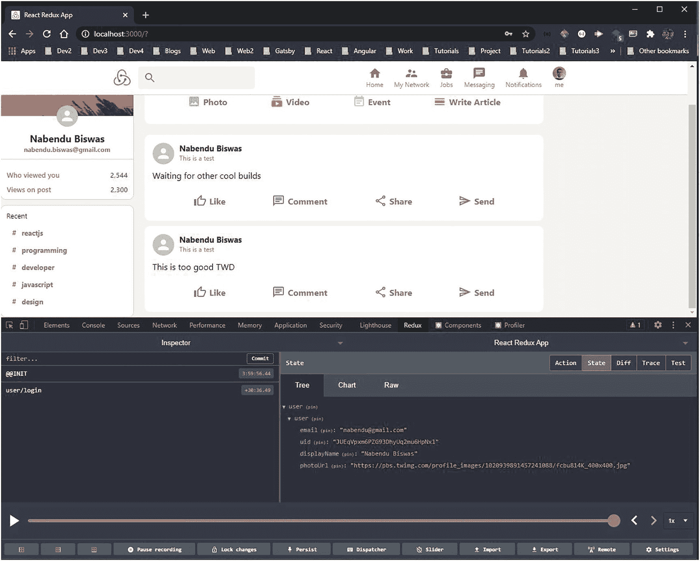

图 5-16

用户登录

现在，我们希望保持登录，因为如果我们刷新，我们将返回到注册页面。

所以，在`App.js`文件中，我们将再次使用`dispatch`和`login`方法。但是我们将从`useEffect`内部检查`login`，我们从`onAuthStateChanged`开始检查。更新后的代码在这里以粗体显示:

```jsx
import React, { useEffect }  from 'react';
import { useDispatch, useSelector } from 'react-redux';
import { login, selectUser } from './features/userSlice';
import { auth } from './firebase';

function App() {
  const user = useSelector(selectUser)
  const dispatch = useDispatch()

  useEffect(() => {
     auth.onAuthStateChanged(userAuth => {
     if(userAuth){
     dispatch(login({ email: userAuth.email, uid: userAuth.uid, displayName: userAuth.displayName, photoUrl: userAuth.photoUrl }))
     }
     })
  },[])

  return (
     ...
  );
}

export default App;

```

现在，我们将添加当我们单击标题中的图片时注销的功能。因此，在`Header.js`文件中，将代码更新如下。在这里，我们首先导入所需的东西，然后在 props 中发送`onClick`，它运行`logoutApp()`。

在`logoutApp`函数中，我们只是为 Redux 的注销和 Firebase 的`auth.signout()`分派。更新后的代码在这里以粗体显示:

```jsx
import { useDispatch } from 'react-redux'
import { logout } from '../features/userSlice'
import { auth } from '../firebase'

const Header = () => {
     const dispatch = useDispatch()
     const logoutApp = () => {
     dispatch(logout())
     auth.signOut()
     }

     return (
     <div className="header">
             <div className="header__left">
                   ...
             </div>
             <div className="header__right">
                 ...
             <HeaderOption avatar="https://pbs.twimg.com/profile_images/1020939891457241088/fcbu814K_400x400.jpg" title="me" onClick={logoutApp} />
             </div>
         </div>
     )
}

export default Header

```

现在，我们必须更新`HeaderOption.js`文件，从这里我们将把`onClick`作为`callback`函数传递。更新后的代码在这里以粗体显示:

```jsx
const HeaderOption = ({ avatar, Icon, title, onClick }) => {
     return (
     <div onClick={onClick} className="headerOption">
          ...
     </div>
     )
}

export default HeaderOption

```

现在，剩下的一件事是用户注册后登录。为此，在`Login.js`文件中，更新`loginToApp()`。在这个函数中，我们使用 Firebase 的`signInWithEmailAndPassword`来发送邮件和密码，然后在 Redux 中发送。

现在，我们可以转到 localhost，提供电子邮件和密码，然后单击**登录**按钮。更新后的代码在这里以粗体显示:

```jsx
const Login = () => {
    ...

      const loginToApp = (e) => {
      e.preventDefault()
      auth.signInWithEmailAndPassword(email,password)
      .then((userAuth) => {
          dispatch(login({
          email: userAuth.user.email,
          uid: userAuth.user.uid,
          displayName: userAuth.user.displayName,
          photoUrl: userAuth.user.photoUrl
          }))
      })
      }

      return (
      ...
      )
}

export default Login

```

## 使用用户信息

现在我们已经获得了用户信息，我们将在应用的不同部分使用它。

我们将首先更改`Sidebar.js`文件中的信息。为了使用用户数据，我们需要用`selectUser`调用`useSelector`。在`return`语句中，我们在`Avatar`、`username`和`email`中使用它。更新后的代码在这里以粗体显示:

```jsx
import { useSelector } from 'react-redux'
import { selectUser } from '../features/userSlice'

const Sidebar = () => {
    const user = useSelector(selectUser)

  ...

    return (
    <div className="sidebar">
        <div className="sidebar__top">
        
        <Avatar src={user?.photoUrl} className="sidebar__avatar">{user.email[0]}</Avatar>
        <h2>{user.displayName}</h2>
        <h4>{user.email}</h4>
        </div>
        ...
    </div>
    )
}

export default Sidebar

```

现在，在`Header.js`中，我们将在最后一个`HeaderOption`中传递一个布尔值，而不是传递硬编码的 URL。更新后的代码在这里以粗体显示:

```jsx
const Header = () => {
  ...

    return (
    <div className="header">
        ...
        <div className="header__right">
            ...
        <HeaderOption avatar={true} title="me" onClick={logoutApp} />
        </div>
    </div>
    )
}

```

现在，在`HeaderOption.js`文件中，我们将再次使用`uaeSelector`来访问用户。之后，我们用`email`或`photoUrl`的第一个字母。更新后的代码在这里以粗体显示:

```jsx
import { useSelector } from 'react-redux'
import { selectUser } from '../features/userSlice'

const HeaderOption = ({ avatar, Icon, title, onClick }) => {
    const user = useSelector(selectUser)

    return (
    <div onClick={onClick} className="headerOption">
        {Icon && <Icon className="headerOption__icon" />}
        {avatar && <Avatar className="headerOption__icon" src={user?.photoUrl}>{user?.email[0]}</Avatar>}
        <h3 className="headerOption__title">{title}</h3>
    </div>
    )
}

export default HeaderOption

```

接下来，在`Feed.js`文件中，我们将再次使用`uaeSelector`来访问用户。然后我们在添加帖子的同时使用它。更新后的代码在这里以粗体显示:

```jsx
import { useSelector } from 'react-redux'
import { selectUser } from '../features/userSlice'

const Feed = () => {
    const user = useSelector(selectUser)
  ...

    const sendPost = e => {
    e.preventDefault()
    db.collection('posts').add({
        name: user.displayName,
        description: user.email,
        message: input,
        photoUrl: user.photoUrl || '',
        timestamp: firebase.firestore.FieldValue.serverTimestamp()
    })
    setInput('')
    }

    return (
    ...
    )
}

export default Feed

```

现在，在`Post.js`中，我们使用从`Feed`组件传递来的`photoUrl`。更新后的代码在这里以粗体显示:

```jsx
const Post = ({ name, description, message, photoUrl }) => {
return (
          <div className="post">
          <div className="post__header">
          <Avatar src={photoUrl}>{name[0]}</Avatar>
          <div className="post__info">
               <h2>{name}</h2>
               <p>{description}</p>
          <div>
          </div>
          </div>
)
}

export default Post

```

现在，为了让我们的应用看起来更好，需要在`App.css`中做一个小的修正。更新后的代码在这里以粗体显示:

```jsx
.app__body{
  display: flex;
  margin-top: 35px;
  max-width: 1200px;
  margin-left: 20px;
  margin-right: 20px;
}

```

我们的应用几乎已经完成，用户数据看起来不错(图 [5-17](#Fig17) )。

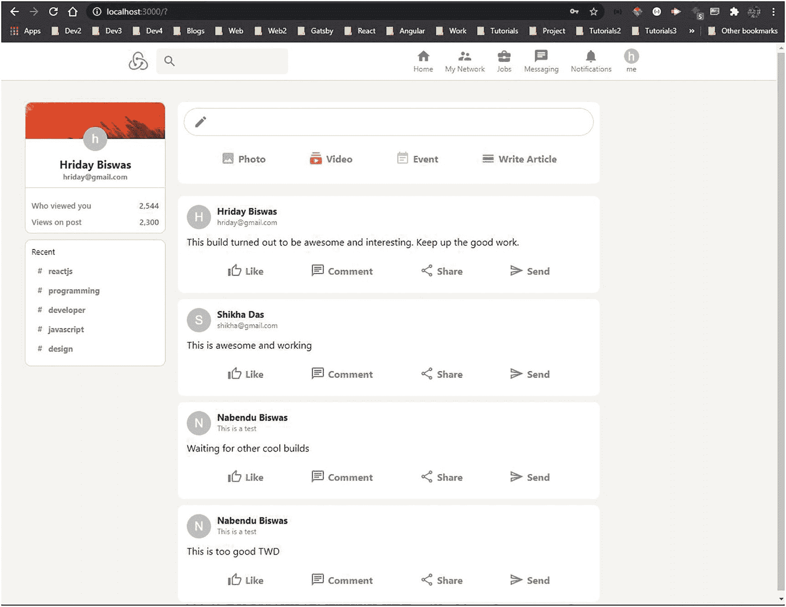

图 5-17

几乎完成

## 构建小部件部分

我们将构建最后一个部分，即小部件部分。在`components`文件夹中创建两个文件`Widgets.js`和`Widgets.css`。另外，在`App.js`文件中包含 Widgets 组件。更新后的代码在这里以粗体显示:

```jsx
import Widgets from './components/Widgets';

function App() {
    ...
    ...

  return (
      <div className="app">
      <Header />
      {!user ? (<Login />) : (
      <div className="app__body">
      <Sidebar />
      <Feed />
      <Widgets />
      </div>
      )}
      </div>
  );
}

export default App;

```

现在，我们将把下面的内容放到`Widgets.js`文件中。这只是一个静态文件，其中有一个标题和一个信息图标。之后我们在调用函数`newsArticle`，用不同的属性。

```jsx
import { FiberManualRecord, Info } from '@material-ui/icons'
import React from 'react'
import './Widgets.css'

const Widgets = () => {
    const newsArticle = (heading, subtitle) => (
        <div className="widgets__article">
            <div className="widgets__articleleft">
                <FiberManualRecord />
            </div>
            <div className="widgets__articleright">
                <h4>{heading}</h4>
                <p>{subtitle}</p>
            </div>
        </div>
    )

return (
    <div className="widgets">
      <div className="widgets__header">
        <h2>Tech News</h2>
        <Info />
      </div>
        {newsArticle("TWD at top with 500k subscriber", "Top news - 9099 readers")}
        {newsArticle("Qualcomm Snapdragon 775 Series", "Top news - 8760 readers")}
        {newsArticle("Amazfit T-Rex Pro Hands", "Top news - 999 readers")}
        {newsArticle("Apple Music Service Feature for iOS", "Top news - 899 readers")}
        {newsArticle("Mars Rover Perseverance Takes First Drive", "Top news - 799 readers")}
        {newsArticle("Twitter CEO Jack Dorsey Auctions Tweet", "Top news - 599 readers")}
    </div>
  )
}

export default Widgets

```

现在，我们将把它的样式放在`Widgets.css`文件中。

```jsx
.widgets{
    position: sticky;
    top: 80px;
    flex: 0.2;
    background-color: white;
    border-radius: 10px;
    border: 1px solid lightgray;
    height: fit-content;
    padding-bottom: 10px;
}

.widgets__header{
    display: flex;
    align-items: center;
    justify-content: space-between;
    padding: 10px;
}

.widgets__header > h2{
    font-size: 16px;
    font-weight: 400;
}

.widgets__article{
    display: flex;
    padding: 10px;
    cursor: pointer;
}

.widgets__article:hover{
    background-color: whitesmoke;
}

.widgets__articleleft{
    color: #0177b7;
    margin-left: 5px;
}

.widgets__articleleft > .MuiSvgIcon-root{
    font-size: 15px;
}

.widgets__articleright{
    flex: 1;
}

.widgets__articleright > h4{
    font-size: 14px;
}

.widgets__articleright > p{
    font-size: 12px;
    color: gray;
}

```

我们的应用现在已经完成了！看起来像图 [5-18](#Fig18) 。

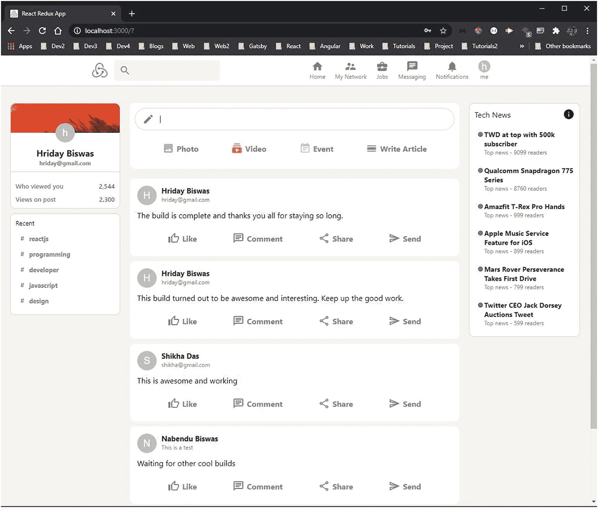

图 5-18

我们的最终应用

## 通过 Firebase 部署和托管

我们可以在 Firebase 中部署我们的应用，我们将遵循与前面章节相同的步骤。

部署成功且工作正常(图 [5-19](#Fig19) )。


图 5-19

部署

## 摘要

在本章中，你学习了如何制作一个与职业相关的社交媒体应用，你可以通过电子邮件登录。您了解了如何使用 React 创建 web 应用，还了解了如何使用 Redux。您还学习了如何在 Firebase 中进行托管。