# 一、制作您的第一个 Web 组件

欢迎构建您的第一个 web 组件。本章讨论了创建第一个 web 组件所需的各种工具、技术、设计和开发概念。您将学习什么是 web 组件，以及什么是 web 浏览器支持、设计系统和组件驱动开发(CDD)。

## 什么是 Web 组件？

在高层次上，Web 组件是孤立的部分(块的种类)，用户界面(UI)可以通过属性和事件(来自这些块的输入和输出)与其他元素进行通信。以`<video>`元素为例。我们可以在浏览器的任何技术中使用这个元素，我们可以传递像`width`和`height`这样的属性，并监听像`onclick`这样的事件。

更严格地说，我们可以说 web 组件是一组 web 平台 API(应用编程接口)，允许我们构建 HTML 标签，这些标签将跨现代 Web 浏览器工作，并可以与任何 JavaScript 技术(React、Angular、Vue.js 等)一起使用。).

Web 组件有四个主要规范:

*   自定义元素

*   影子天赋

*   是模块

*   HTML 模板

我将在接下来的章节中更深入地讨论这些规范。

## Web 组件的历史

目前，Web 组件在前端环境中无处不在。三个最流行的框架(Angular、React 和 Vue.js)使用 Web 组件作为其架构的一部分。情况并不总是如此。Web 组件是随着时间一点点发展起来的。第一个重大进展是在 2010 年用 AngularJS ( [`https://angularjs.org`](https://angularjs.org) )实现的，这是一个框架，它引入了指令的概念，作为一种创建自己的标签的方法，用它们自己的特性来构建 ui。后来，在 2011 年，亚历克斯·罗素在 Fronteers 会议上发表了题为“Web 组件和模型驱动的视图”的演讲，阐述了一些现在普遍使用的关键概念和想法。<sup>[1](#Fn1)</sup>2013 年，谷歌通过 Polymer 向前迈出了又一大步，这是一个基于 web 组件(使用 web APIs)的库，它已经成为一个为更好的 Web 构建库、工具和标准的工具。

## 为什么要使用 Web 组件？

今天，所有前端开发人员都面临着两个重大问题，它们会消耗公司的精力、时间和财务。这些如下。

### 遗产

遗留是软件开发中的一个众所周知的问题，指的是必须在某个时候更新的旧代码库，以便与新的 JavaScript 项目和工具一起操作。

### 框架变动

JavaScript 的工具及其框架生态系统正在快速变化。为一个新项目选择正确的框架可能会令人紧张和疲惫，因为我们无法猜测这个框架会持续多久。这种相关性问题以及它如何影响对一组可能很快过时的工具的培训和开发的投资，被称为框架变动。

请记住，web 组件是一组 Web 平台规范。因此，它们可能会在 web 浏览器中使用很长一段时间，并提供许多好处，包括:

*   Web 组件是可重用的，并且在框架之间工作。

*   Web 组件可以在所有主流的 web 浏览器中运行。

*   Web 组件易于维护，并为未来做好了准备，这主要是因为它们基于 web 平台规范。

## Web 组件生态系统的基本概念

在本书中，我将会用到一些与技术、方法或模式相关的术语，当我们在 web 应用中使用 Web 组件时，我们可以应用这些术语。这些如下。

### 设计系统

设计系统是可重用组件、指南和工具的目录或集合，允许组织中的团队构建数字产品以更有效地工作，并为他们的所有产品应用一致的品牌。这种方法的一些例子如下:

*   *谷歌*:材质设计( [`https://material.io`](https://material.io) )

*   *土坯*:光谱( [`https://spectrum.adobe.com`](https://spectrum.adobe.com) )

*   *Ionic* : Ionic 框架( [`https://ionicframework.com/docs`](https://ionicframework.com/docs) )

### 组件驱动开发

组件驱动开发意味着通过构建独立的组件来设计软件应用。每个组件都有一个接口或 API 来与系统的其余部分进行通信。使用这种方法的一些优点是

*   *更快的开发*:将开发分成组件允许你用小范围和小目标构建模块化的部分。这意味着您可以更快地开发，并更快地让测试部分在其他系统中重用。

*   *更简单的维护*:当您必须添加或更新应用的功能时，您只需更新组件，而不必重构应用中更重要的部分。

*   可重用性:模块化组件允许可重用的功能，并且可以扩展来构建多个应用，消除了反复重写它们的需要。

*   测试驱动开发(TDD) :实现单元测试来验证每个模块化组件的功能变得更加容易。

*   *更好地理解系统*:当系统由模块化组件组成时，它变得更容易掌握、理解和操作。

## 对 Web 组件的浏览器支持

在撰写本文时(2020 年初)，所有主流 web 浏览器都支持 Web 组件(见图 [1-1](#Fig1) )。

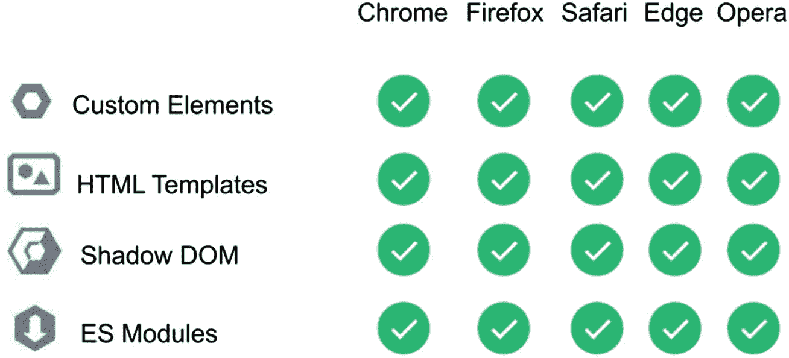

图 1-1

支持 Web 组件主要规范的主流浏览器

## 入门指南

要开始使用 Web 组件构建应用，您必须了解并安装一些技术和工具。

### cmder(仅适用于 Windows)

`cmder`是一个 Windows 的终端模拟器。默认情况下，Windows 操作系统附带一个对开发没有用的终端(命令提示符)。这就是为什么我们需要`cmder`，这是一个模拟器，我们可以使用它在我们的终端中流畅地运行命令。

要访问该仿真器，请转到`cmder.net`并下载最新版本。

将文件解压到您的`C:/`位置。

进入系统属性➤环境变量，编辑路径变量，如图 [1-2](#Fig2) 。

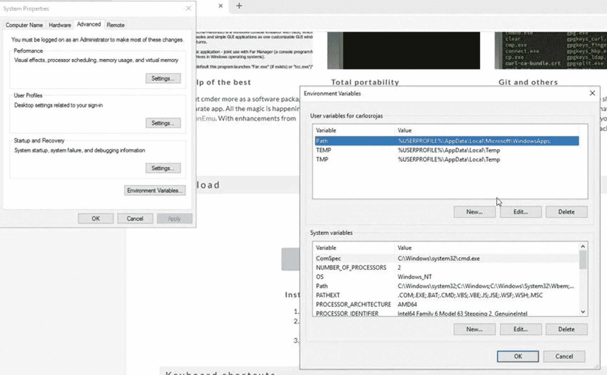

图 1-2

系统属性中的环境变量首选项

将`cmder`位置添加到`Path`变量中，如图 [1-3](#Fig3) 。

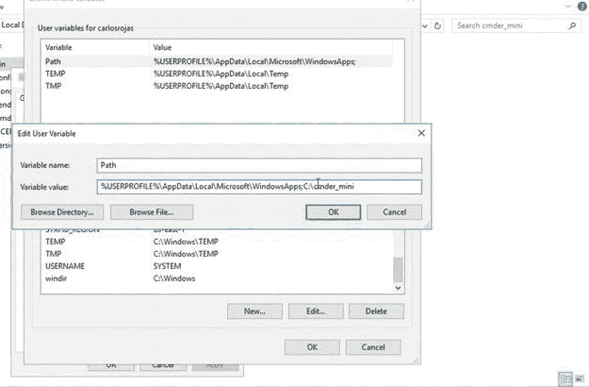

图 1-3

`Path`系统属性中的变量首选项

从选择命令提示符运行`cmder`，测试环境变量(图 [1-4](#Fig4) )。

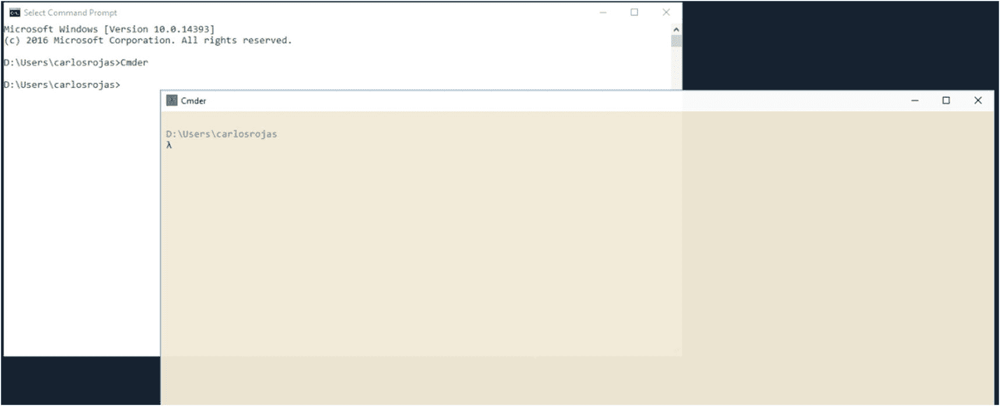

图 1-4

从选择命令提示符运行`cmder`

### Node.js

Node.js 是一个 JavaScript 运行时环境。大多数使用 JavaScript 的项目使用 Node 来安装依赖项并创建脚本来自动化开发工作流。

您必须在计算机上安装节点。可以从 [`https://nodejs.org/en/`](https://nodejs.org/en/) 下载。

下载安装程序后，运行它并按照说明进行操作。

#### 给麦克的

如果您使用的是 Mac，请遵循图 [1-5](#Fig5) 中所示的 Node.js 的安装说明。

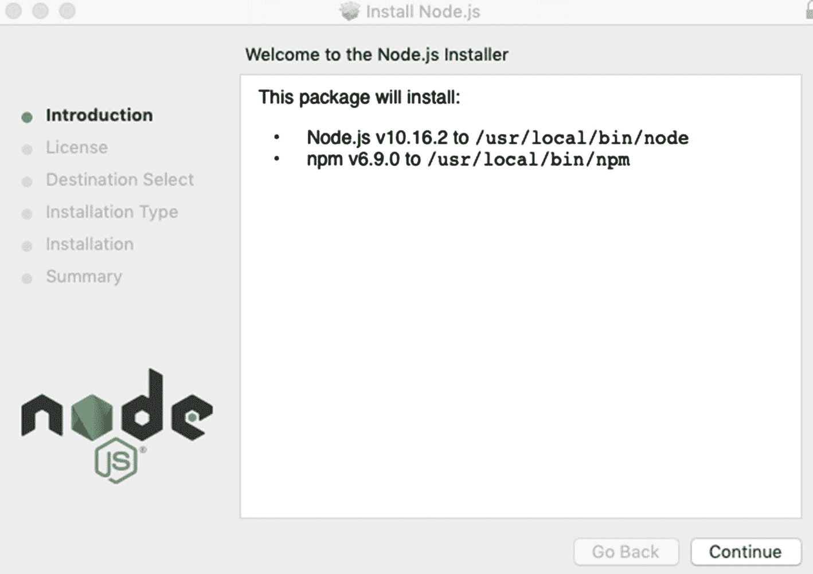

图 1-5

Node.js Mac 安装

然后打开你的终端运行`$node –v`。如果一切正常，您将在您的终端中看到节点版本，如图 [1-6](#Fig6) 所示。

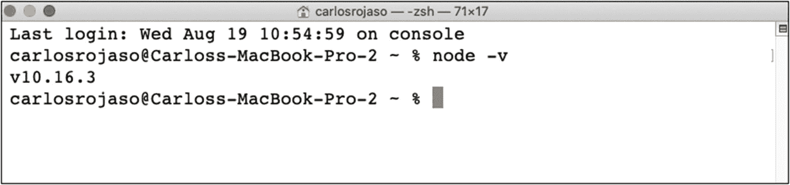

图 1-6

终端中的节点版本

#### 对于 Windows

要安装 Node.js for Windows，请遵循图 [1-7](#Fig7) 中所示的安装程序说明。

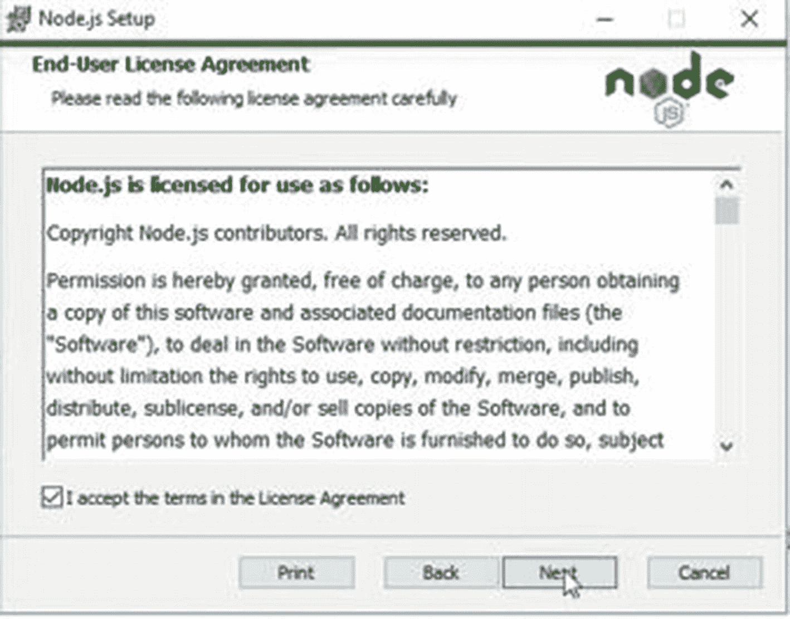

图 1-7

Node.js Windows 安装

然后，当你完成后，打开`cmder`并运行`$ node –v`。

### 新公共管理

当你安装 Node.js 的时候，你也安装了`npm`。`npm`是 Node.js 的包管理器，允许用户在他们的 JavaScript 项目中安装依赖项和运行小脚本。

#### 适用于 Mac 和 Windows

通过`$ npm –v`检查终端上运行的`npm`版本。如果一切正常，你会在你的终端看到`npm`版本，如图 [1-8](#Fig8) 。

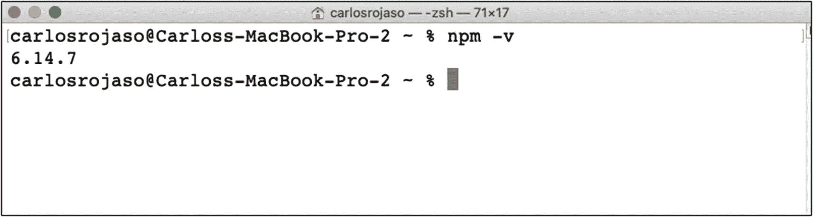

图 1-8

`npm`终端中的版本

### 谷歌 Chrome

Chrome 是一个网页浏览器，它为网页组件提供了出色的支持，并包括 Chrome DevTools，这是一个为开发者提供的便利功能。你可以从 [`www.google.com/chrome/`](http://www.google.com/chrome/) 下载安装 Chrome。

#### 适用于 Mac 和 Windows

要安装 Chrome for Mac 和 Windows，请运行安装程序并遵循相关步骤。Chrome 安装成功后，打开它，你会看到一个欢迎屏幕(图 [1-9](#Fig9) )。

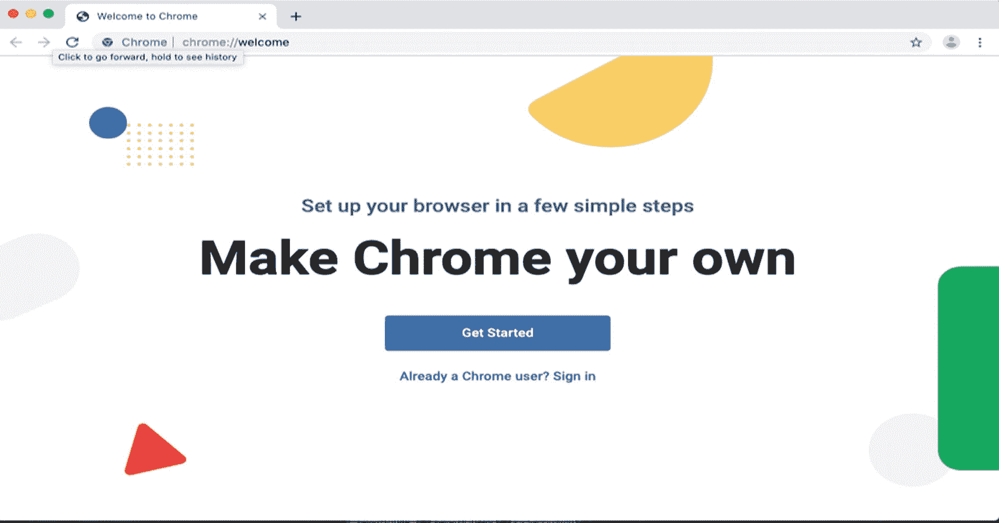

图 1-9

谷歌浏览器安装

### Chrome DevTools(铬 DevTools)

Chrome DevTools 是谷歌 Chrome 浏览器中包含的一套网络开发工具。作为一名开发者，这个工具可以帮助你诊断应用中的问题，并使它变得更快。要打开，按 Command+Option+J (Mac)或 Control+Shift+J (Windows、Linux、Chrome OS)，直接跳到控制台面板(图 [1-10](#Fig10) )。

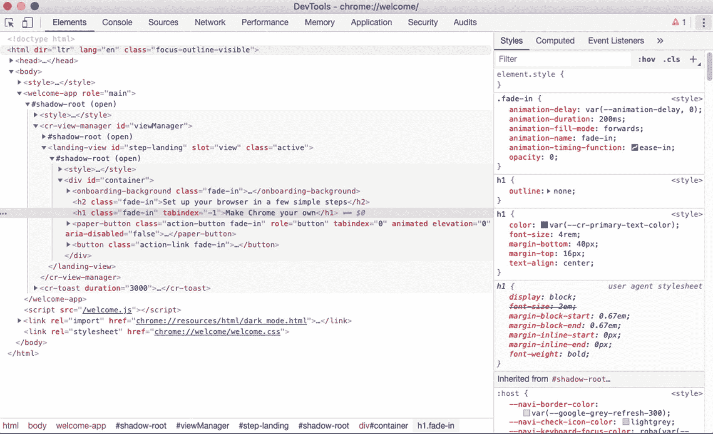

图 1-10

Google Chrome DevTools

#### 灯塔

Lighthouse 是一个开源的自动化工具，用于提高网页质量。Lighthouse 可以在 Chrome 的 DevTools 中找到。 <sup>[2](#Fn2)</sup> 进入审计页签访问(图 [1-11](#Fig11) )。

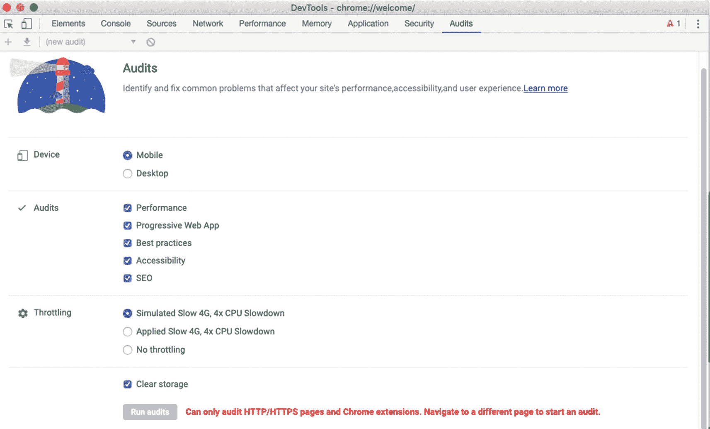

图 1-11

Google chrome devtools audit tab(Google chrome devtools 审核选项卡)

### 某视频剪辑软件

本书中的一些例子将使用 Vue.js 框架。Vue.js 是一个简单明了的 JavaScript 框架。Vue 主要面向视图层，但是您可以添加您需要的内容，并使用其生态系统中的所有工具构建强大的渐进式 web 应用。

在你的项目中使用 Vue 真的很简单。您只需在您的`index.html`中添加以下内容，如清单 [1-1](#PC1) 所示。

```jsx
<!-- development version, includes helpful console warnings -->
<script src="https://cdn.jsdelivr.net/npm/vue/dist/vue.js"></script>

Listing 1-1Adding Vue from the cdn Development Version

```

或者添加产品版本，如清单 [1-2](#PC2) 所示。

```jsx
<!-- production version, optimized for size and speed -->
<script src="https://cdn.jsdelivr.net/npm/vue"></script>

Listing 1-2Adding Vue from the cdn Production Version

```

#### CLI 视图

Vue CLI 是一个用于快速 Vue.js 开发的完整系统。多亏了这个工具，我们可以在处理 Webpack、EsLint 和其他工具时避免一些额外的工作，并专注于在我们的应用中构建业务逻辑。您必须在您的终端中运行以下命令，将它安装到您的系统中:`$npm install -g @vue/cli`。

如果一切正常，您将在您的终端中看到 Vue CLI 版本，如图 [1-12](#Fig12) 所示。

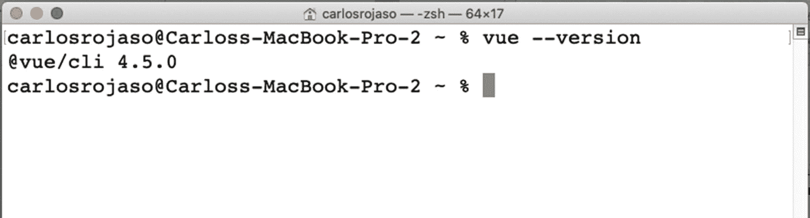

图 1-12

终端中的 Vue CLI 版本

### 饭桶

Git 是一个版本控制系统，旨在处理我们项目中的不同变更。我们将使用 Git 来操作我们的 web 应用项目，并处理每章中概述的连续步骤。可以从 [`https://git-scm.com/downloads`](https://git-scm.com/downloads) 下载安装 Git。

#### 适用于 Mac 和 Windows

要安装，请运行安装程序并按照步骤操作。完成后，打开`cmder/terminal`并运行`$ git –version`。

如果一切正常，您将在您的终端中看到 Git 版本，如图 [1-13](#Fig13) 所示。

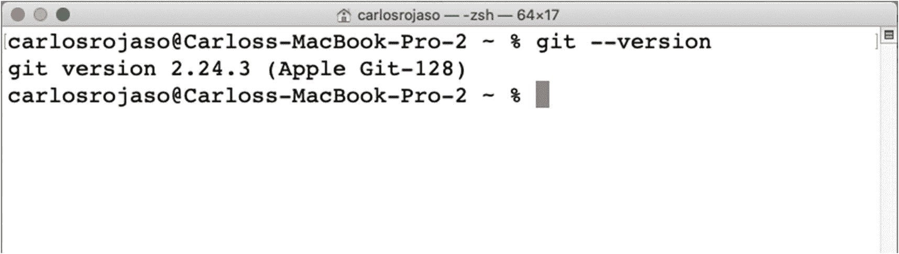

图 1-13

终端中的 Git 版本

### Firebase(火力基地)

Firebase 是一个云服务，可以帮助你自动化后端开发。您可以将 Firebase 理解为一个无需后端知识就可以保存数据、资产和验证用户身份的地方。Firebase 很强大，谷歌也支持它。对于我们的项目，您必须通过`$npm install -g firebase-tools`在您的终端中安装 Firebase CLI。

此外，您必须在 [`https://firebase.google.com/`](https://firebase.google.com/) 注册并创建一个新项目。我创建了项目“新闻-书籍-网页组件”(图 [1-14](#Fig14) )。我将使用这个项目来连接和发布本书涵盖的所有功能。

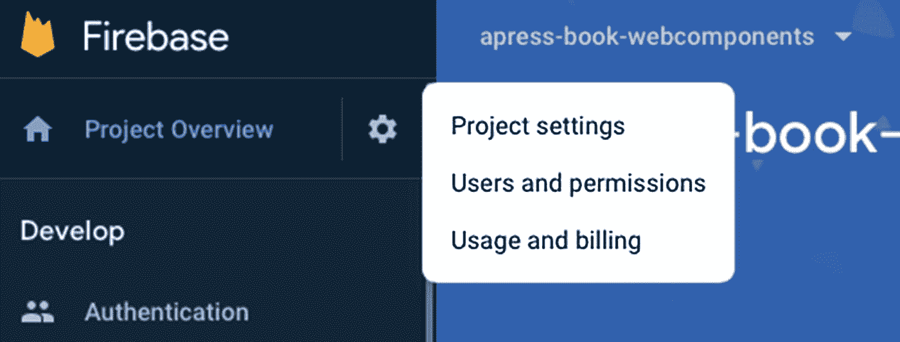

图 1-14

Firebase web 控制台项目概述

在本书中，我们将使用认证、数据库和托管来增强我们的应用。

#### Firebase 认证

Firebase Authentication 是一项服务，允许我们在应用中使用身份验证系统，以处理安全和服务器相关的问题。

您可以通过开发➤认证从您的 web 控制台( [`https://console.firebase.google.com`](https://console.firebase.google.com) )访问 Firebase 认证(图 [1-15](#Fig15) )。

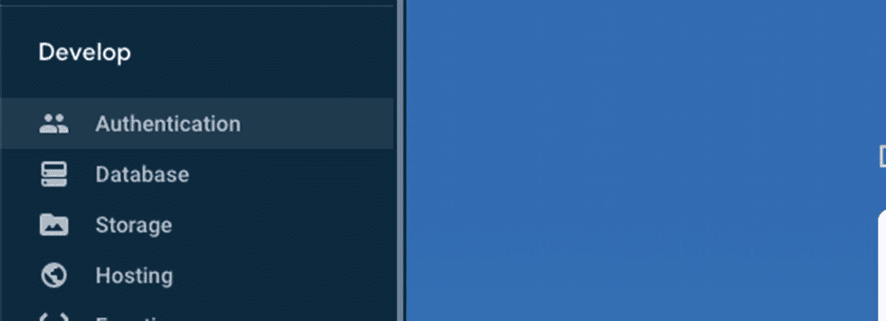

图 1-15

Firebase web 控制台身份验证

#### Firebase 数据库

Firebase Database 是一项服务，我们可以通过它添加一个远程数据库来保存我们的用户数据。此外，它是我们应用中处理实时信息的一个极好的选项，这意味着我们可以从移动或桌面设备打开我们的应用，并且会显示相同的信息。

您可以在开发➤数据库中的 web 控制台( [`https://console.firebase.google.com`](https://console.firebase.google.com) )中找到 Firebase 数据库(图 [1-16](#Fig16) )。

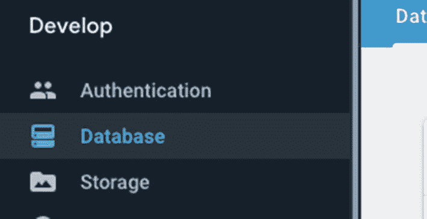

图 1-16

Firebase web 控制台数据库

#### Firebase 托管

Firebase Hosting 是一个托管服务，你可以用它来服务你所有的静态文件，连接你的域，并快速获得一个 SSL 证书。它也易于部署。

你可以通过开发➤主机从你的网络控制台( [`https://console.firebase.google.com`](https://console.firebase.google.com) )找到 Firebase 主机(图 [1-17](#Fig17) )。

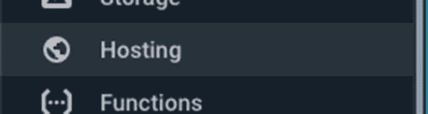

图 1-17

Firebase web 控制台托管

### Visual Studio 代码

Visual Studio Code 是一个免费的代码编辑器，它通过一组集成的工具以及通过插件扩展它们的可能性来帮助开发。可以从 [`https://code.visualstudio.com/`](https://code.visualstudio.com/) 下载 [Visual](https://code.visualstudio.com/) 工作室代码。

#### 适用于 Mac 和 Windows

要安装 Visual Studio 代码，只需运行安装程序并按照步骤操作。然后从应用/程序列表中打开 Visual Studio 代码。

有许多代码编辑器可用，但我们在本书中打算使用 Visual Studio 代码，主要是因为它是免费的，工作流畅，并且有一个大的插件生态系统。

## 开发我们的第一个 Web 组件

现在我们将创建我们的第一个 web 组件，一个我们称之为`vanilla-placeholder-component`的占位符。有了这个组件，你可以用红色背景和单词“placeholder”填充网页上的块，如图 [1-18](#Fig18) 所示。

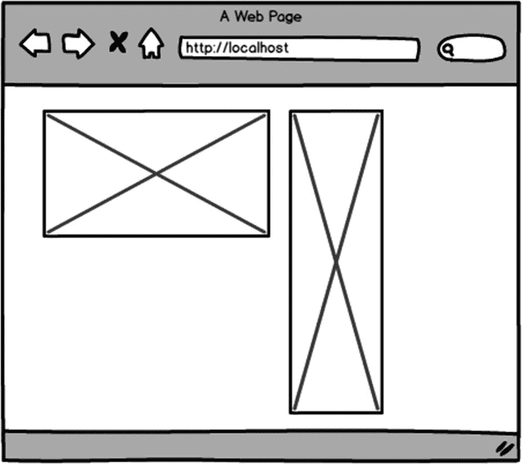

图 1-18

占位符组件

这个组件在我们的 HTML 中的基本用法如清单 [1-3](#PC3) 所示。

```jsx
<vanilla-placeholder-content></vanilla-placeholder-content>

Listing 1-3Using vanilla-placeholder-component

```

我们可以添加一些属性，如清单 [1-4](#PC4) 所示。

```jsx
<vanilla-placeholder-content height="100px" width="50px"></vanilla-placeholder-content>

Listing 1-4Using vanilla-placeholder-component with Attributes

```

我们的组件接受高度和宽度属性来定制大小，但是如果我们不提供该信息，我们将默认为两者指定 100 像素。

首先我们必须创建一个文件`index.html`并用一个基本结构填充它，如清单 [1-5](#PC5) 所示。

```jsx
<!DOCTYPE html>
<html lang="en">
<head>
    <meta charset="UTF-8">
    <meta name="viewport" content="width=device-width, initial-scale=1.0">
    <title>Demo - vanilla-placeholder</title>
</head>
<body>
</body>
</html>

Listing 1-5index.html—Basic Structure

```

有了这段代码，我们就有了一个正文中什么都没有的基本 HTML 页面。因此，我们将在`</body>`之前添加一些带有`<script></script>`标签的 JavaScript，并且我们将添加基本结构来创建一个定制组件，如清单 [1-6](#PC6) 所示。

```jsx
<!DOCTYPE html>
<html lang="en">
<head>
    <meta charset="UTF-8">
    <meta name="viewport" content="width=device-width, initial-scale=1.0">
    <title>Demo - vanilla-placeholder</title>
</head>
<body>
<script>
class VanillaPlaceholderContent extends HTMLElement {
    constructor() {}
}
customElements.define('vanilla-placeholder-content', VanillaPlaceholderContent);
</script>
</body>
</html>

Listing 1-6Adding a Custom Component in index.html

```

这样，我们将定义我们的标签`<vanilla-placeholder-content>`并创建一个继承自`HTMLElement` ( [`https://developer.mozilla.org/en-US/docs/Web/API/HTMLElement`](https://developer.mozilla.org/en-US/docs/Web/API/HTMLElement) )的 JavaScript 类，并给我们定义组件的机会。

最后，我们将向`VanillaPlaceholderContent`类添加一些代码，如清单 [1-7](#PC7) 所示。

```jsx
<!DOCTYPE html>
<html lang="en">
<head>
    <meta charset="UTF-8">
    <meta name="viewport" content="width=device-width, initial-scale=1.0">
    <title>Demo - vanilla-placeholder</title>
</head>
<body>
<script>
class VanillaPlaceholderContent extends HTMLElement {

    constructor() {
        super();
        const placeholder = document.createElement('template');
        const height = this.getAttribute('height') || '100px';
        const width = this.getAttribute('width') || '100px';
        placeholder.innerHTML = VanillaPlaceholderContent.template(height, width);

        this.appendChild(document.importNode(placeholder.content, true));
    }

    static template (height, width) {
        return `
        <style>
        .placeholder {
            background-color: red;
            width: ${height};
            height: ${width};
        }
        </style>
        <div class="placeholder">Placeholder</div>`;
    }

}
customElements.define('vanilla-placeholder-content', VanillaPlaceholderContent);
</script>
</body>
</html>

Listing 1-7Adding Component Logic to vanilla-placeholder-component

```

一般来说，我们使用`constructor()`来初始化我们的组件，使用`this.getAttribute('')`，我们检查我们是否得到了一些属性，比如高度和宽度。接下来，我们使用`template()`方法来创建我们的元素和样式，最后，我们使用`this.appendChild(document.importNode(placeholder.content, true));`将它们添加到我们的 UI 中。

我们可以在网络浏览器中看到结果(图 [1-19](#Fig19) )。

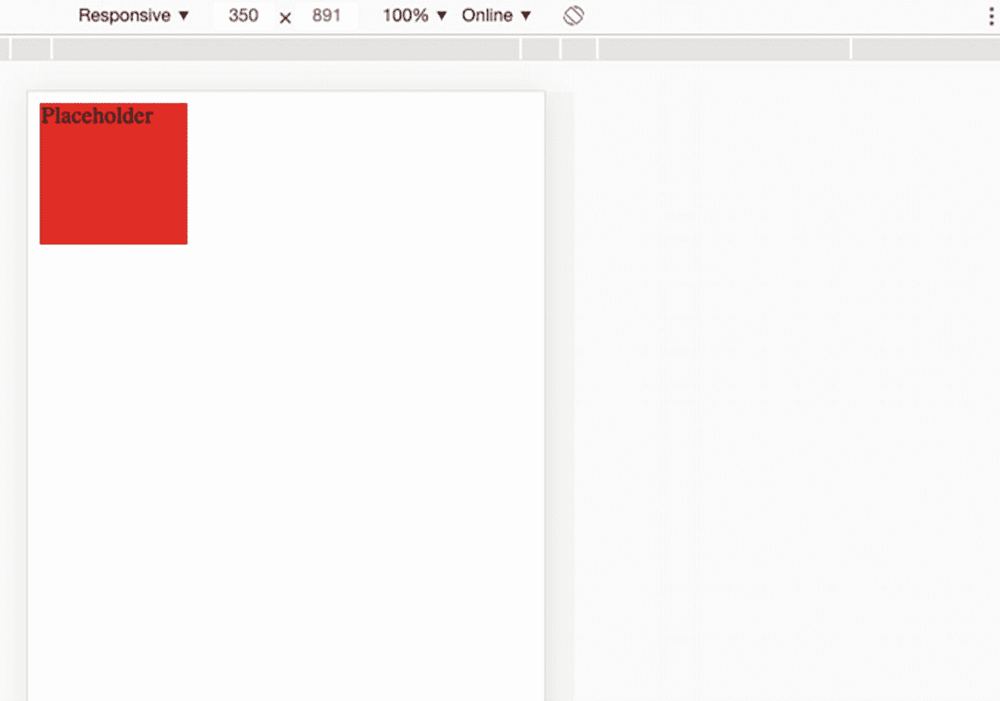

图 1-19

web 浏览器中的占位符组件

如果有些事情暂时难以理解，也不要担心。在接下来的章节中，你将会学到更多关于这个 API 的知识，以及它为什么有用。

您可以在`$git checkout chap-1`访问本书`(` [`https://github.com/carlosrojaso/apress-book-web-components`](https://github.com/carlosrojaso/apress-book-web-components) `)`的源代码。

## 摘要

在本章中，您学习了以下内容:

*   什么是 Web 组件，当前主流浏览器的支持是什么

*   什么是设计系统，我们可以在网上找到一些例子

*   什么是组件驱动开发(CDD ),在我们的软件应用中使用这种方法有什么好处

<aside aria-label="Footnotes" class="FootnoteSection" epub:type="footnotes">Footnotes [1](#Fn1_source)

亚历克斯·罗素，“Web 组件和模型驱动视图”，*前端* [`https://fronteers.nl/congres/2011/sessions/web-components-and-model-driven-views-alex-russell`](https://fronteers.nl/congres/2011/sessions/web-components-and-model-driven-views-alex-russell) ，2020 年 9 月 28 日访问。

  [2](#Fn2_source)

谷歌开发者，“灯塔”， [`https://developers.google.com/web/tools/lighthouse/`](https://developers.google.com/web/tools/lighthouse/) ，2020 年 9 月 28 日访问。

 </aside>