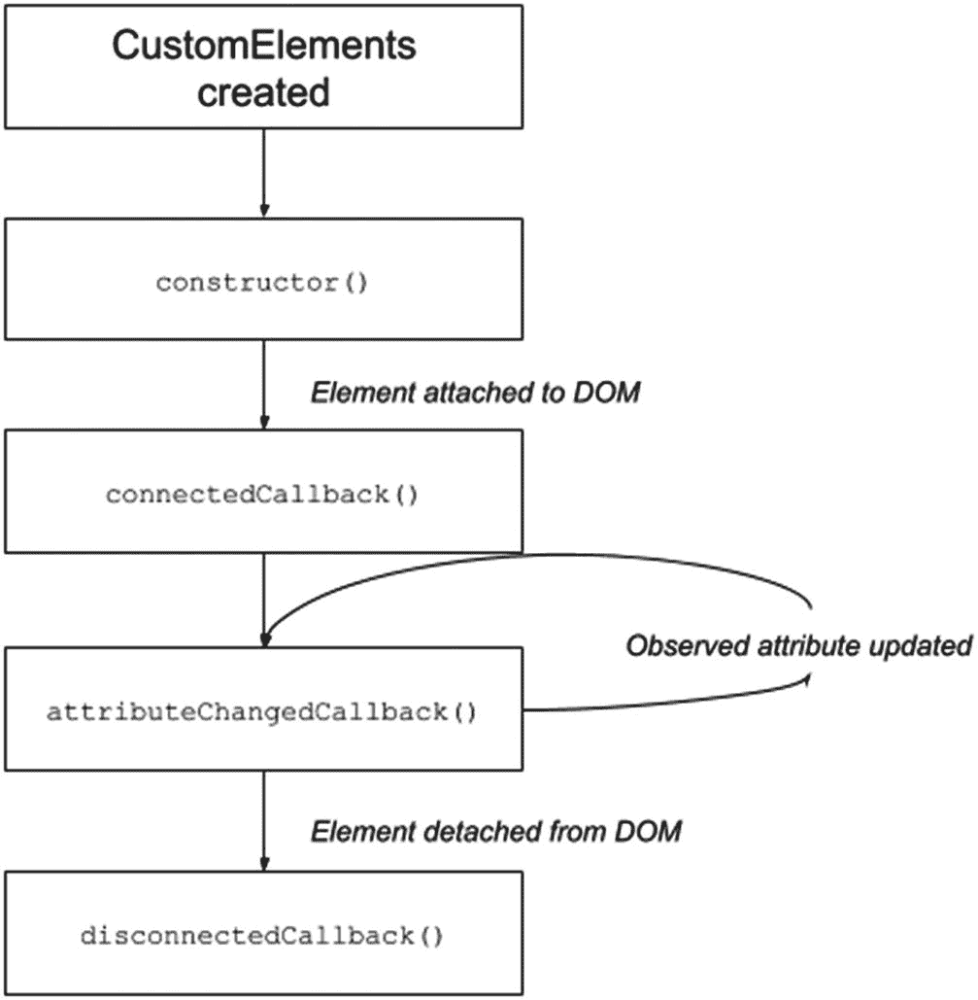

# 二、自定义元素

在本章中，我们将探索 Web 组件集中的自定义元素规范。您将了解什么是定制元素，如何创建它们，以及定制元素的生命周期是什么。然后，我们将为我们的集合构建一个新的 web 组件。

## 什么是自定义元素？

自定义元素是一种机制，web 开发人员可以使用它来创建新的 HTML 标记。我们可以使用`CustomElementRegistry`对象来创建我们的标签。例如，我们可以定义一个`random-icon-placeholder`，如清单 [2-1](#PC1) 所示。

```jsx
class randomIconPlaceholder extends HTMLElement {
    constructor(){...}
}
customElements.define('random-icon-placeholder', randomIconPlaceholder);

Listing 2-1Defining a Web Component with CustomElements

```

这里，我们使用小写的名称，由连字符(kebab-case)分隔，这是为自定义标记指定名称所必需的。此外，我们正在使用一个从`HTMLElement`扩展而来的类。`HTMLElement`是 HTML 中的主对象，文档对象模型(DOM)中的任何元素都会继承它的属性。(你可以在 [`https://developer.mozilla.org/en-US/docs/Web/API/HTMLElement`](https://developer.mozilla.org/en-US/docs/Web/API/HTMLElement) 找到更多信息)。)

有两种类型的自定义元素:自主的和自定义的。一个自治的定制元素不会继承另一个标准的 HTML 元素，比如`<p>`、`<a>`、`<br>`等等。我们可以说上一个例子中的`<random-icon-placeholder>`(清单 [2-1](#PC1) )是一个自治的定制元素。

定制的内置元素从另一个标准 HTML 元素继承而来。例如，我们可以定义一个元素来扩展`<p>`元素，如清单 [2-2](#PC2) 所示。

```jsx
class randomParagraphSizePlaceholder extends HTMLParagraphElement {
    constructor(){...}
}

customElements.define('random-paragraph-size-placeholder',
randomParagraphSizePlaceholder, {extends: p});

Listing 2-2Defining a Customized CustomElement

```

现在我们可以在 HTML 文档中使用这个元素，如清单 [2-3](#PC3) 所示。

```jsx
<p is="random-paragraph-size-placeholder">Some text</p>

Listing 2-3Using a Customized CustomElement

```

你可以在 [`https://html.spec.whatwg.org/multipage/indices.html#element-interfaces`](https://html.spec.whatwg.org/multipage/indices.html%2523element-interfaces) 找到要继承的接口列表。

## 自定义元素的生命周期挂钩

当我们定义一个定制元素时，我们可以使用生命周期挂钩在组件生命周期的特定时刻运行代码。在我们的自定义元素中有四个主要的时刻可以使用。

*   `constructor`:创建或升级元素实例时触发。它对于初始化变量、添加事件侦听器或创建影子 DOM 非常有用。

*   `connectedCallback`:每次在文档中追加自定义元素时触发。这将在每次移动节点时发生，并且可能在元素的内容被完全解析之前发生。

*   `attributeChangedCallback (attrName, oldVal, newVal)`:每次添加、删除或更改定制元素的属性时都会调用这个函数。注意到变化的观察属性是用`static get observedAttributes`方法指定的。

*   `disconnectedCallback`:每次自定义元素从文档的 DOM 断开时调用。

我们可以在图 [2-1](#Fig1) 中看到 Web 组件生命周期的所有前述方法。



图 2-1

Web 组件生命周期

## 构建自定义元素

为了学习如何使用`customElements`对象和生命周期挂钩，我们将创建`randomParagraphSizePlaceholder`组件。这个简单的组件生成一个 12 到 50px 之间的随机数，并接收属性`'text'`。

要在我们的 HTML 文档中使用这个组件，我们必须调用`<random-paragraph-size-placeholder>`，如清单 [2-4](#PC4) 所示。

```jsx
<random-paragraph-size-placeholder text="My Personal Text"></random-paragraph-size-placeholder>

Listing 2-4Using random-paragraph-size-placeholder

```

接下来，我们必须为自治的定制元素创建一个通用结构，如清单 [2-5](#PC5) 所示。

```jsx
class RandomParagraphSizePlaceholder extends HTMLElement {
    constructor(){...}
}
customElements.define('random-paragraph-size-placeholder', RandomParagraphSizePlaceholder);

Listing 2-5Declaring random-paragraph-size-placeholder Component

```

这样，web 浏览器就知道我们想要注册一个新的 HTML 标签。

稍后，我们将添加生命周期挂钩作为方法，我们将添加`console.log()`，以了解方法何时被触发。(参见清单 [2-6](#PC6) 。)

```jsx
class RandomParagraphSizePlaceholder extends HTMLElement {
    constructor(){
      console.log(`contructor.`)
    }
   connectedCallback() {
        console.log(`connectedCallback hook`);
    }
    disconnectedCallback() {
        console.log(`disconnectedCallback hook`);
    }

 attributeChangedCallback(attrName, oldVal, newVal) {
        console.log(`attributeChangedCallback hook`);
    }
}
customElements.define('random-paragraph-size-placeholder', RandomParagraphSizePlaceholder);

Listing 2-6Defining

random-paragraph-size-placeholder Component

```

为了让`attributeChangedCallback()`方法正确工作，我们必须添加静态方法`observedAttributes()`并返回我们想要观察的属性。在本例中，我们只有`'text'`属性，如清单 [2-7](#PC7) 所示。

```jsx
static get observedAttributes() {
        return ['text'];
    }

Listing 2-7Adding Text to Be Observed in attributeChangedCallback

```

接下来，我们将在构造函数中添加基本逻辑，生成随机数并将它们发送给`template`方法，如清单 [2-8](#PC8) 所示。

```jsx
constructor() {
        console.log(`constructor hook`);
        super();
        const placeholder = document.createElement('template');
        const myText = this.getAttribute('text') || 'Loren Ipsum';
        const randomSize = Math.floor((Math.random() * (50 - 12 + 1)) + 12);
        placeholder.innerHTML = RandomParagraphSizePlaceholder.template(myText, randomSize);
        this.appendChild(document.importNode(placeholder.content, true));
    }

Listing 2-8Adding the Logic to Initialize random-paragraph-size-placeholder

```

总之，代码将如清单 [2-9](#PC9) 所示。

```jsx
<!DOCTYPE html>
<html lang="en">
<head>
    <meta charset="UTF-8">
    <meta name="viewport" content="width=device-width, initial-scale=1.0">
    <title>Demo - random-paragraph-size-placeholder</title>
</head>
<body>
<div id="parent">
    <random-paragraph-size-placeholder text="My Personal Text"></random-paragraph-size-placeholder>
</div>
<button id="myButton" onclick="removeElement()">Remove Element</button>
<script>
class RandomParagraphSizePlaceholder extends HTMLElement {

    constructor() {
        console.log(`constructor hook`);
        super();
        const placeholder = document.createElement('template');
        const myText = this.getAttribute('text') || 'Loren Ipsum';
        const randomSize = Math.floor((Math.random() * (50 - 12 + 1)) + 12);
        placeholder.innerHTML = RandomParagraphSizePlaceholder.template(myText, randomSize);

        this.appendChild(document.importNode(placeholder.content, true));
    }

    static get observedAttributes() {
        return ['text'];
    }

    set text(val) {
        if (val) {
            this.setAttribute(`text`, val);
        } else {
            this.setAttribute(`text`, ``);
        }
    }

    get text() {
        return this.getAttribute('text');
    }

    connectedCallback() {
        console.log(`connectedCallback hook`);
    }
    disconnectedCallback() {
        console.log(`disconnectedCallback hook`);
    }

    attributeChangedCallback(attrName, oldVal, newVal) {
        console.log(`attributeChangedCallback hook`);
        console.log(`attrName`, attrName);
        console.log(`oldVal`, oldVal);
        console.log(`newVal`, newVal);
    }

    static template (myText, randomSize) {
        return `
        <div style="font-size:${randomSize}px">${myText}</div>`;
    }
}
customElements.define('random-paragraph-size-placeholder', RandomParagraphSizePlaceholder);

const element = document.querySelector('random-paragraph-size-placeholder');

function removeElement() {
    const parentElement = document.getElementById('parent')
    parentElement.removeChild(element);
    const myButton = document.getElementById('myButton');
    myButton.disabled = true;
}
</script>
</body>
</html>

Listing 2-9Final Code for random-paragraph-size-placeholder

```

您还会注意到，我添加了一个额外的函数`removeElement`，来看看当我从 DOM 中移除组件时`disconnectedCallback()`是如何被触发的。您可以在`$git checkout chap-2`获取这本书的代码( [`https://github.com/carlosrojaso/apress-book-web-components`](https://github.com/carlosrojaso/apress-book-web-components) )。

## 摘要

在本章中，您学习了以下内容:

*   什么是`CustomElementRegistry`对象以及如何使用它

*   自定义元素的两种主要类型是什么

*   什么是生命周期挂钩，什么时候触发