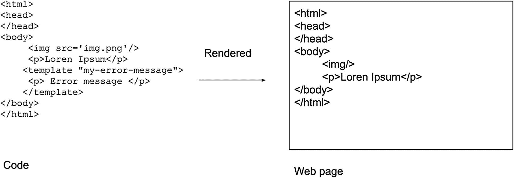
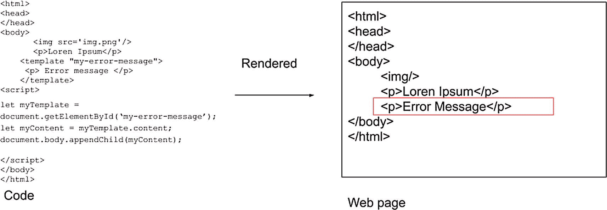
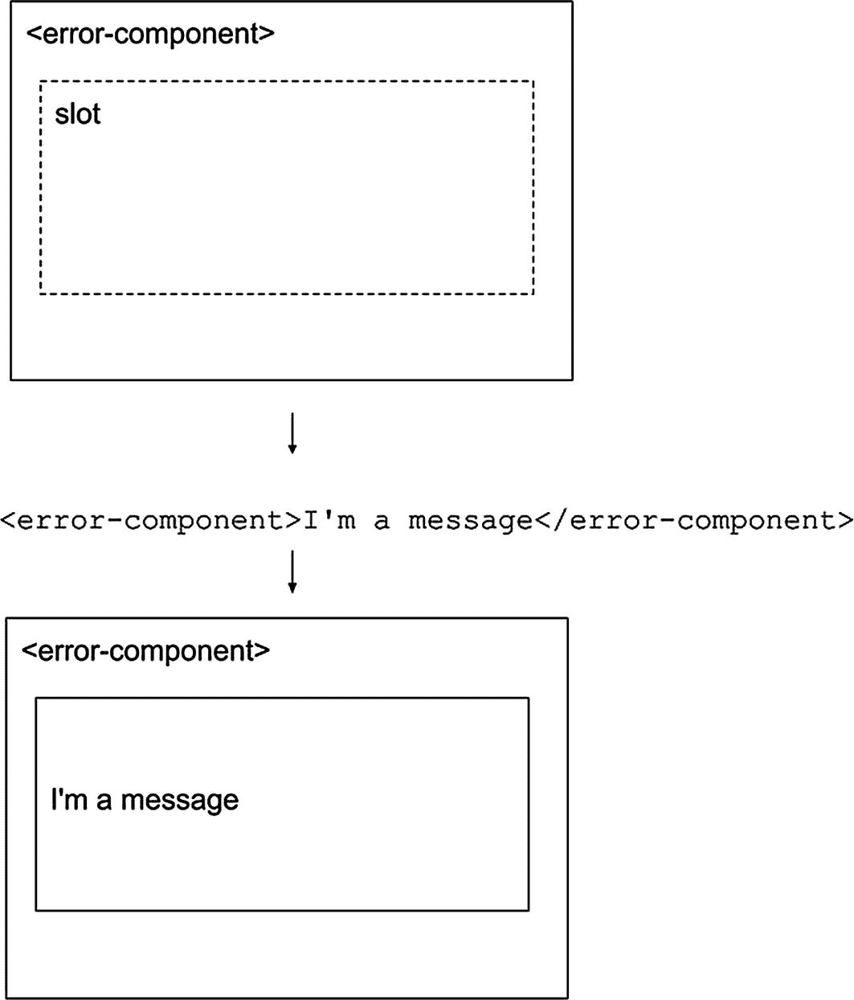
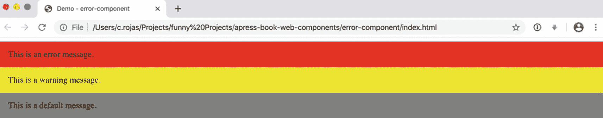

# 三、HTML 模板

在这一章中，我们将研究 HTML 模板，Web 组件集中的另一个规范。您将学习什么是 HTML 模板，以及如何在 web 组件中使用 HTML 模板。然后，我们将为我们的集合构建一个新的 web 组件。

## 什么是 HTML 模板？

HTML 模板规范定义了`<template>`元素，以创建在我们的定制元素中不使用的标记片段，直到我们稍后在运行时激活它们。这些片段可以通过脚本克隆并插入到 HTML 中。

`<template>`中的内容具有以下属性:

*   内容只有在激活后才会呈现。`<template>`中的标记是隐藏的，不会呈现。

*   内容不会有副作用。脚本、图像和媒体标签在激活之前不会运行。

*   该内容将不被视为在文档对象模型(DOM)中。使用`getElementById()`或`querySelector()`不会返回模板的子节点。

清单 [3-1](#PC1) 中说明了使用`<template>`的基本方法。

```jsx
<template id="my-error-message">
    <p>
        Some error messages.
    </p>
</template>

Listing 3-1Basic Example of Using <template>

```

我的段落在 DOM 中是隐藏的，如图 [3-1](#Fig1) 所示。



图 3-1

使用模板在网页中隐藏段落

如果我想显示我的内容，我必须用代码激活它，如清单 [3-2](#PC2) 所示。

```jsx
let myTemplate = document.getElementById('my-error-message');
let myContent = myTemplate.content;
document.body.appendChild(myContent);

Listing 3-2Activating Content in <template>

```

这样，我们就可以激活我们文档中的内容，如图 [3-2](#Fig2) 所示。



图 3-2

激活网页中的`template`

## 时间

除了`<template>`，我们还可以在内容中利用`<slot>`。插槽允许你在模板中定义占位符，如图 [3-3](#Fig3) 所示。结合其他 Web 组件规范，插槽在元素内插入标记时非常有用。

清单 [3-3](#PC3) 中概述了使用`<slot>`的基本方法。



图 3-3

用消息填充`error-component`中的槽

```jsx
<p>
    <slot>This is a default message</slot>
</p>

Listing 3-3Using <slot>

```

## 用<template></template>

现在，我们将创建一个组件来处理应用中的错误和警告消息。用这个组件，你可以发送一种错误或警告消息，以及你想在`<error-component></error-component>`之间显示的消息。如果您正在发送错误消息，您将会在红色背景下看到该消息。黄色背景下将显示一条警告消息。

首先，我们将为组件创建基本结构，如清单 [3-4](#PC4) 所示。

```jsx
<!DOCTYPE html>
<html lang="en">
<head>
    <meta charset="UTF-8">
    <meta name="viewport" content="width=device-width, initial-scale=1.0">
    <title>Demo - error-component</title>
</head>
<body>
<script>
class ErrorComponent extends HTMLElement {
    constructor() {
        super();
    }
}
customElements.define('error-component', ErrorComponent);
</script>
</body>
</html>

Listing 3-4Basic Structure of error-component

```

现在我们将创建静态方法`template()`，用它我们将生成我们的标记，如清单 [3-5](#PC5) 所示。

```jsx
<!DOCTYPE html>
<html lang="en">
<head>
    <meta charset="UTF-8">
    <meta name="viewport" content="width=device-width, initial-scale=1.0">
    <title>Demo - error-component</title>
</head>
<body>
<script>
class ErrorComponent extends HTMLElement {
    constructor() {
        super();
    }

   static template () {
        return `
        <template class="warning-type">
            <style>
                .warning {
                    background-color: yellow;
                    padding: 15px;
                    color: black;
                }
            </style>
            <div class="warning">
                <slot>Error component<slot>
            </div>
        </template>
        <template class="error-type">
            <style>
                .error {
                    background-color: red;
                    padding: 15px;
                    color: black;
                }
            </style>
            <div class="error">
                <slot>Error component<slot>
            </div>
        </template>
        <template class="none-type">
            <style>
                .none {
                    background-color: gray;
                    padding: 15px;
                    color: black;
                }
            </style>
            <div class="none">
                <slot>Error component<slot>
            </div>
        </template>
        `;
    }

}
customElements.define('error-component', ErrorComponent);
</script>
</body>
</html>

Listing 3-5Adding the template() Method

```

在我们的标记中，我们有三个`<template>`块——每个块对应一种我们可以接收的消息:错误、警告和无。此外，我们在每个标签中添加了`<slot>`，它将接受我们在标签之间传递的值，如清单 [3-6](#PC6) 所示。

```jsx
<error-component>Value that the slot going to take</error-component>

Listing 3-6Passing Error Messages with Slots

```

最后，我们将使用生命周期挂钩`connectedCallback()`来处理选择使用哪个模板的逻辑，如清单 [3-7](#PC7) 所示。

```jsx
<!DOCTYPE html>
<html lang="en">
<head>
    <meta charset="UTF-8">
    <meta name="viewport" content="width=device-width, initial-scale=1.0">
    <title>Demo - error-component</title>
</head>
<body>
<script>
class ErrorComponent extends HTMLElement {
    constructor() {
        super();
    }

    connectedCallback() {
        this.root = this.attachShadow({mode: 'open'});
        this.templates = document.createElement('div');
        this.container = document.createElement('div');
        this.root.appendChild(this.templates);
        this.root.appendChild(this.container);
        this.templates.innerHTML = ErrorComponent.template();
        const kind = this.getAttribute(`kind`) || `none`;

        const template = this.templates.querySelector(`template.${kind}-type`);
        if (template) {
            const clone = template.content.cloneNode(true);
            this.container.innerHTML = '';
            this.container.appendChild(clone);
        }
    }

   static template () {
        return `
        <template class="warning-type">
            <style>
                .warning {
                    background-color: yellow;
                    padding: 15px;
                    color: black;
                }
            </style>
            <div class="warning">
                <slot>Error component<slot>
            </div>
        </template>
        <template class="error-type">
            <style>
                .error {
                    background-color: red;
                    padding: 15px;
                    color: black;
                }
            </style>
            <div class="error">
                <slot>Error component<slot>
            </div>
        </template>
        <template class="none-type">
            <style>
                .none {
                    background-color: gray;
                    padding: 15px;
                    color: black;
                }
            </style>
            <div class="none">
                <slot>Error component<slot>
            </div>
        </template>
        `;
    }

}
customElements.define('error-component', ErrorComponent);
</script>
</body>
</html>

Listing 3-7Initializing Properties in connectedCallback()

```

这里，我们使用`'this'`在组件中进行引用，并且使用方法`connectedCallback()`来初始化这些属性。

我们也在使用影子 DOM `'this.attachShadow({mode: 'open'});'`。影子 DOM 是下一章的主题，但是你可以把这里的这个看作是特定于我们的组件的受保护的 DOM 树。

在这个逻辑中，我们获得了`'kind'`属性，并呈现了正确的`<template>`，无论它是错误、警告还是无。结果如图 [3-4](#Fig4) 所示。



图 3-4

使用 Chrome 上的错误组件

您可以在`$git checkout chap-3`通过回购( [`https://github.com/carlosrojaso/apress-book-web-components`](https://github.com/carlosrojaso/apress-book-web-components) )获取相关代码。

## 摘要

在本章中，您学习了以下内容:

*   什么是`<template>`以及如何在我们的 web 组件中使用它

*   什么是`<slot>`以及如何在我们的 web 组件中使用它

*   如何创建 web 组件来处理错误和警告