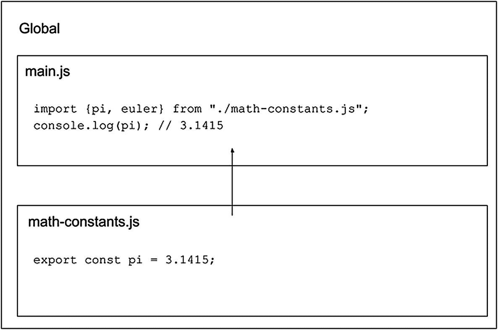
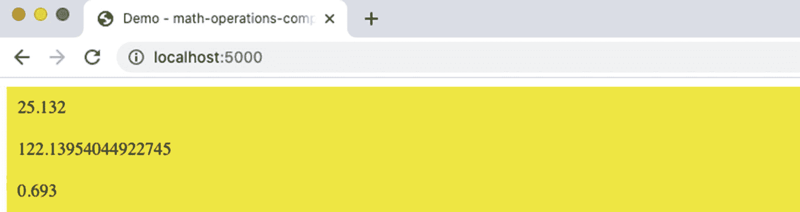

# 五、ES 模块

在这一章中，我将讨论 ES 模块，Web 组件集中的另一个规范。您将学习什么是 es 模块，以及如何在 web 组件中使用 ES 模块。然后，我们将为我们的集合构建一个新的 web 组件。

## 什么是 ES 模块？

ES 模块规范定义了一种机制，通过该机制可以在我们的项目中通过不同的文件共享变量和函数。ES6 现在提供了 ES 模块。在此之前，如果您想要共享某个东西，您可以将它添加到全局上下文中，并使它无论是否被使用都可用。考虑清单 [5-1](#PC1) 中的代码。

```jsx
var pi = 3.1415;
var euler = 2.7182;

function getCircumference(radius) {
  return 2 * pi * radius;
}

function getCalcOneYear(interestRate, currentVal) {
  return currentVal * (euler ** interestRate);
}

console.log(getCircumference(2)); // 12.566
console.log(getCalcOneYear(0.3, 100)); // 134\. 98466170045035

Listing 5-1Using Constants in main.js

```

在`main.js`中，我们有两个值`pi`和`euler`，它们是函数`getCircumference`和`getCalcOneYear`所需要的。但是如果我们在应用的不同地方的不同函数中需要`pi`和`euler`呢？

为了更容易地共享这些值，我们可以创建一个新文件`math-constants.js`，并使用`'export'`，告诉 JavaScript 我们可以导入该值。如清单 [5-2](#PC2) 所示。

```jsx
export const pi = 3.1415;
export const euler = 2.7182;

Listing 5-2Exporting Values in file math-constants.js

```

现在我们可以在其他文件中使用这些值，在 HTML 文件中使用`type="module"`，如清单 [5-3](#PC3) ，或者在 JS 文件中使用`import`，如清单 [5-4](#PC4) 。

```jsx
import {pi, euler} from "./math-constants.js";

Listing 5-4Using ES Modules in JS Scripts

```

```jsx
<script type="module" src="./math-constants.js"></script>

Listing 5-3Using ES Modules in HTML

```

图 [5-1](#Fig1) 提供了 ES 模块的图形视图。



图 5-1

ES 模块的图形表示

## 构建 MathOperationsComponent 组件

为了练习使用 Shadow DOM，我们将构建一个名为`<math-operations-component>`的简单组件，在我们的应用中添加社交网络链接。该组件接收两个参数，`operation'`和`initialValue'`，其中，`getCircumference'`接收半径为的圆周；`getCalcOneYear`获取一年的复利，有两个参数，利率和当前值；而'`getLog2'`返回`2`的自然对数值。

首先，我们将定义我们的组件，如清单 [5-5](#PC5) 所示。

```jsx
class MathOperationsComponent extends HTMLElement {

    constructor() {
    }

}
customElements.define('math-operations-component', MathOperationsComponent);

Listing 5-5Defining MathOperationsComponent

```

在与`index.html`相同的层中创建一个新的`math-constants.js`文件，并创建常量`pi`、`euler`和`ln2`，使用`'export'`允许将这些值作为一个模块使用，如清单 [5-6](#PC6) 所示。

```jsx
export const pi = 3.1415;
export const euler = 2.7182;
export const ln2 = 0.693;

Listing 5-6Defining MathOperationsComponent

```

现在，在文件`index.html`中，我们必须添加一些东西，以便使用组件中的模块，如清单 [5-7](#PC7) 所示。

```jsx
<script type="module">
import {pi, euler, ln2} from './math-constants.js';

class MathOperationsComponent extends HTMLElement {

    constructor() {
    }

}
customElements.define('math-operations-component', MathOperationsComponent);
</script>

Listing 5-7Using Modules in MathOperationsComponent

```

前面代码片段中的第一个是我们代码中模块的脚本标记中的`type="module"`。第二个是“导入”，用于我们在`math-constants.js`中声明的常量。

现在，在我们的组件中，我们将创建`getCircumference`、`getCalcOneYear`和`getLN2`，以返回我们在调用中发送的参数所需的值。这显示在清单 [5-8](#PC8) 中。

```jsx
    getCircumference(radius) {
        return 2 * pi * radius;
    }

    getCalcOneYear(interestRate, currentVal) {
        return currentVal * (euler ** interestRate);
    }

    getLN2() {
        return ln2;
    }

Listing 5-8Using Modules in MathOperationsComponent

```

注意，这里我们使用的是从模块中导入的常量。

最后，我们在`constructor()`中添加逻辑，以处理我们在组件的`'operation'`和`'initialValue'`属性中发送的参数，并为我们希望在文档中显示信息的模板和样式创建方法，如清单 [5-9](#PC9) 所示。

```jsx
<script type="module">
import {pi, euler, ln2} from './math-constants.js';

class MathOperationsComponent extends HTMLElement {

    constructor() {
        super();
        this.root = this.attachShadow({mode: 'open'});
        this.container = document.createElement('div');
        this.root.appendChild(this.container);

        switch(this.getAttribute('operation')) {
            case 'getCircumference':
                const radius = this.getAttribute('initialValue');
                this.container.innerHTML = MathOperationsComponent.getTemplate(this.getCircumference(radius));
                break;
            case 'getCalcOneYear':
                const [interestRate, currentVal] = this.getAttribute('initialValue').split(',');
                this.container.innerHTML = MathOperationsComponent.getTemplate(this.getCalcOneYear(interestRate, currentVal));
                break;
            case 'getLog2':
                this.container.innerHTML = MathOperationsComponent.getTemplate(this.getLN2());
            break;
        }
    }

    getCircumference(radius) {
        return 2 * pi * radius;
    }

    getCalcOneYear(interestRate, currentVal) {
        return currentVal * (euler ** interestRate);
    }

    getLN2() {
        return ln2;
    }

    static getTemplate(value) {
        return `
        ${MathOperationsComponent.getStyle()}
        <div>
            ${value}
        </div>
        `;
    }

    static getStyle() {
        return `
        <style>
            div {
                padding: 5px;
                background-color: yellow;
                color; black;
            }
        </style>`;
    }
}
customElements.define('math-operations-component', MathOperationsComponent);
</script>

Listing 5-9Using Modules in MathOperationsComponent

```

为了运行我们的代码，由于浏览器和模块的安全策略，我们必须使用静态服务器。我们可以初始化一个从项目根目录运行的节点应用

```jsx
$npm init

```

以及回答终端中的问题。

后来，在`package.json`文件中，我添加了两件事，如清单 [5-10](#PC11) 所示。

```jsx
...
"scripts": {
    "start": "serve",
    ...
  },
"devDependencies": {
      "serve": "^11.3.2"
    }
...

Listing 5-10Adding dependencies and npm Script in Package.json

```

这条指令将在我们的项目中安装`'serve'`包，并使用`'npm run start'`运行一个本地服务器。

然后，要运行我们的示例，您必须进入我们的`math-operations-component`文件夹并运行

```jsx
$npm install

```

稍后，运行

```jsx
$npm run start

```

现在转到`http://localhost:5000`，就这样。您可以看到我们的组件正在运行(图 [5-2](#Fig2) )。



图 5-2

在本地服务器上使用 Google Chrome 中的 ES 模块

你可以在`$git checkout chap-5`访问这本书的源代码( [`https://github.com/carlosrojaso/apress-book-web-components`](https://github.com/carlosrojaso/apress-book-web-components) )。

## 摘要

在本章中，您学习了以下内容:

*   什么是 ES 模块以及如何在 web 组件中使用它们

*   如何创建 ES 模块

*   如何使用 ES 模块创建一个 web 组件，在我们的 web 应用中添加数学函数