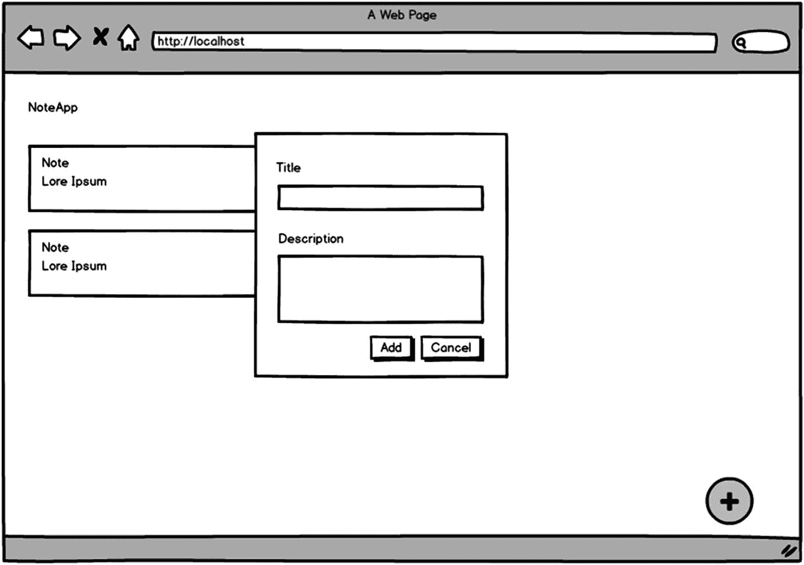
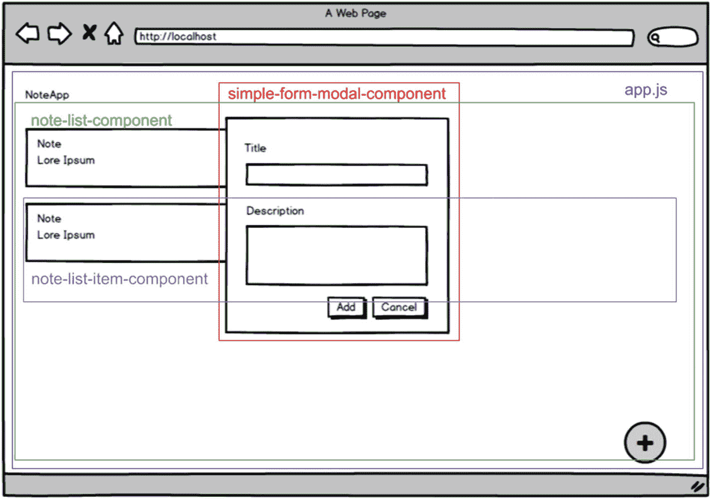
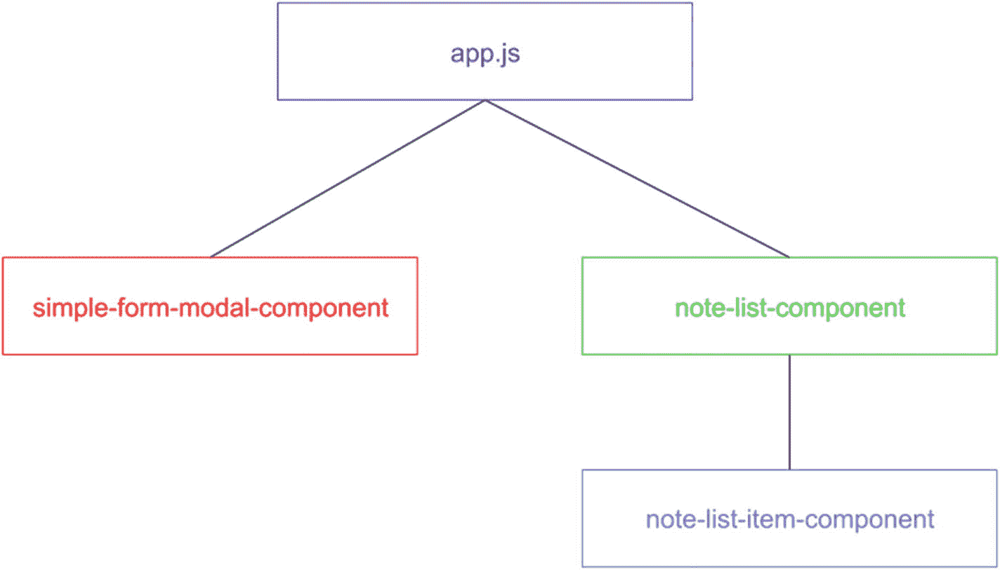
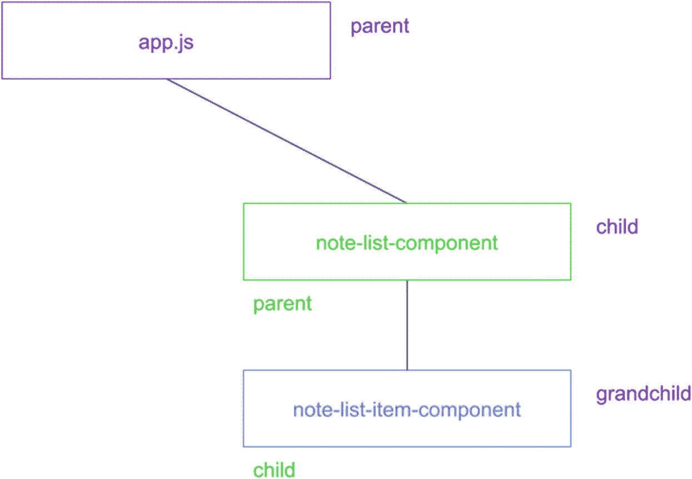
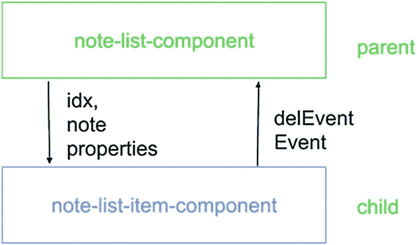
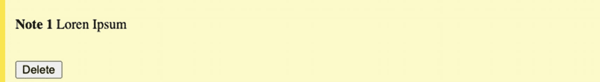
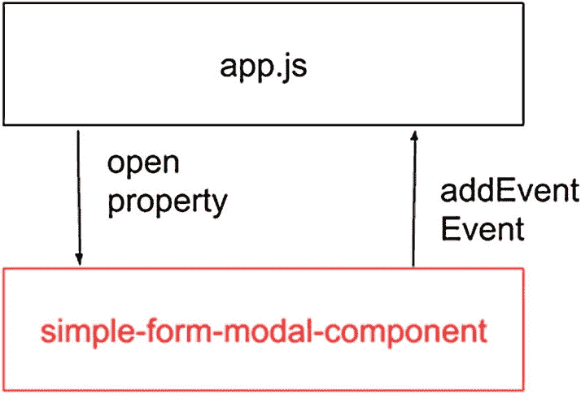
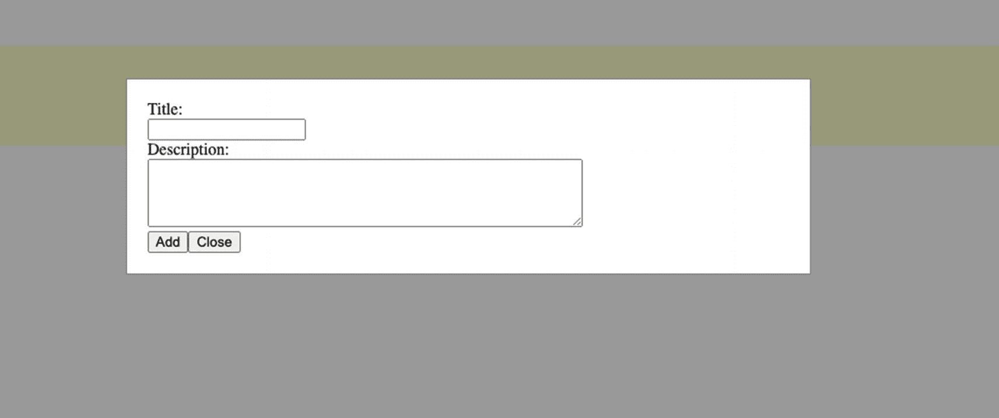
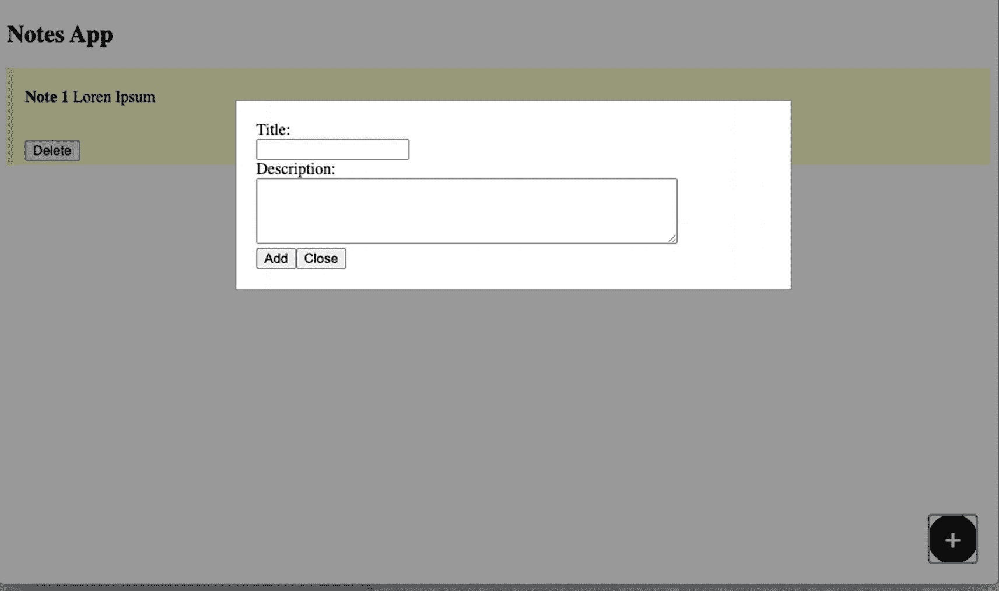

# 六、组件架构

在本章中，你将学习如何设计组件，并使它们在 web 应用中协同工作。我们将把我们的 web 应用连接到应用编程接口(API ),并为我们的组件定义数据流。

## 我们的 NoteApp 应用

我们将创建一个简单的 notes 应用，允许用户做笔记，如图 [6-1](#Fig1) 所示。在用户添加信息后，当用户单击按钮时，将使用带有“标题”和“描述”的模态和表单创建一个新的注释。我们必须将这些信息添加到一个注释列表中，向我们显示用户过去创建的所有注释，并从该列表中删除注释。



图 6-1

NoteApp 模型

现在，我们可以利用这个初始模型，考虑如何将元素分割成小块，这将使我们的开发更容易，并更好地面向将来可以使用的组件。

在图 [6-2](#Fig2) 中，你可以看到我们有三个主要组件(`simple-form-modal-component`、`note-list-component`和`note-list-item-component`)，我们可以在`app.js`的逻辑中使用它们来实现我们的目标，即拥有一个注释列表、删除注释的能力以及允许添加新注释。



图 6-2

识别我们应用中的组件

定义好组件后，我们可以考虑组件的层次结构(如图 [6-3](#Fig3) )，看看它们之间的关系。



图 6-3

识别应用中组件的层次结构

我们可以看到主要元素是`app.js`。我们将添加两个兄弟组件，`simple-form-modal-component`和`note-list-component`，在`note-list-component`中，我们将有几个`note-list-item-component`元素是`note-list-component`的子元素。清楚地理解这种关系将有助于我们在接下来的步骤中做出其他的架构决策。

## Web 组件之间的通信

当我们使用组件时，通常我们需要一种方法在父母和孩子之间发送和接收数据(如图 [6-4](#Fig4) 所示)，以更新或发送用户或其他组件在我们应用的业务逻辑中的某个时刻所做的更改的通知。为此，我们使用属性获取数据，并使用事件将数据发送给其他组件。



图 6-4

识别组件之间的通信

在图 [6-5](#Fig5) 中，你可以看到我们将使用`idx`和`note`属性定义来自`note-list-component`的传递数据，并使用`delEvent`事件接收数据。



图 6-5

设计`note-list-component`和`note-list-item-component`之间的通信机制

这意味着在我们的`NoteListComponent`中，我们将创建我们需要的`<note-list-item-component>`元素，并传递一个对象`note`和一个数字`idx`，如清单 [6-1](#PC1) 所示。

```jsx
class NoteListComponent extends HTMLElement {

    constructor() {
    }

    render() {
      return `
        <note-list-item-component note='${JSON.stringify(note)}' idx='${idx}'></note-list-item-component>`;
    }
}
customElements.define('note-list-component', NoteListComponent);

Listing 6-1Defining NoteListComponent

```

我们将使用`JSON.stringify()`来正确传递对象`note`，并使用`JSON.parse()`来接收子组件中的数据。你可以在 [`https://developer.mozilla.org/en-US/docs/Web/JavaScript/Reference/Global_Objects/JSON/stringify`](https://developer.mozilla.org/en-US/docs/Web/JavaScript/Reference/Global_Objects/JSON/stringify) 和 [`https://developer.mozilla.org/en-US/docs/Web/JavaScript/Reference/Global_Objects/JSON/parse`](https://developer.mozilla.org/en-US/docs/Web/JavaScript/Reference/Global_Objects/JSON/parse) 了解更多这些方法。

现在，在我们的`NotelistItemComponent`中，我们将创建一个自定义事件，`NoteListComponent`可以监听并知道用户何时想要从列表中删除一个注释，如清单 [6-2](#PC2) 所示。

```jsx
class NoteListItemComponent extends HTMLElement {

    constructor() {
    }

    handleDelete() {
    this.dispatchEvent(new CustomEvent('delEvent', {bubbles: true, detail:  {idx: this.idx}}));
    }
}
customElements.define('note-list-item-component', NoteListItemComponent);

Listing 6-2Adding a Custom Event in NoteListItemComponent

```

这里，我们创建了一个`handleDelete()`方法，它使用`CustomEvent()`创建一个事件，并在`detail`中发送我们需要的数据。通过这种方式，父节点将知道需要从列表中删除什么项目。你可以在 [`https://developer.mozilla.org/en-US/docs/Web/API/CustomEvent/CustomEvent`](https://developer.mozilla.org/en-US/docs/Web/API/CustomEvent/CustomEvent) 中了解更多关于`CustomEvent`的信息。

通常，有了属性和事件，我们可以在大多数中小规模的场景中处理组件之间的通信。尽管如此，如果你的应用更复杂，组件之间的交互更复杂，你将需要一个事件总线，你可以在 [`www.npmjs.com/package/js-event-bus`](http://www.npmjs.com/package/js-event-bus) 找到，或者像 Redux 这样的模式，你可以在 [`https://github.com/reduxjs/redux`](https://github.com/reduxjs/redux) 找到。

## notes list component

在上一节中，您了解了如何让我们的 web 组件进行通信。现在我们将构建这些组件。首先，处理注释的更自然的方式是接收一组注释，并为每个元素创建一个条目。然后，我们将获取属性`notes`并使用方法`JSON.parse()`将其转换成一个对象。我们使用`_notes`，以避免与组件中的设置器发生冲突，并在每次更新时再次呈现所有注释(参见清单 [6-3](#PC3) )。

```jsx
class NoteListComponent extends HTMLElement {

    constructor() {
      super();

      this._notes = JSON.parse(this.getAttribute('notes')) || [];
      this.root = this.attachShadow({mode: 'open'});
      this.root.innerHTML = this.render();
    }

    render() {
      let noteElements = '';
      this._notes.map(
      (note, idx) => {
        noteElements += `
        <note-list-item-component note='${JSON.stringify(note)}' idx='${idx}'></note-list-item-component>`;
      }
    );
    return `
      ${noteElements}`;
    }

    get notes(){
      return this._notes;
    }

    set notes(newValue) {
      this._notes = newValue;
      this.root.innerHTML = this.render();
    }
}
customElements.define('note-list-component', NoteListComponent);

Listing 6-3getter and setter in NoteListComponent

```

此外，我们在 render 方法中使用了一个`map()`,迭代 object notes 并创建我们需要的每个项目，并用项目列表更新 Shadow DOM。

记住，每当我们需要从列表中删除一个项目时，我们都会收到一个`delEvent`事件。因此，我们必须在这里处理这种行为，为该事件添加一个监听器，并从列表中删除该元素，如清单 [6-4](#PC4) 所示。

```jsx
class NoteListComponent extends HTMLElement {

    constructor() {
      super();

      this._notes = JSON.parse(this.getAttribute('notes')) || [];
      this.root = this.attachShadow({mode: 'open'});
      this.root.innerHTML = this.render();
      this.handleDelEvent = this.handleDelEvent.bind(this);
    }

    connectedCallback() {
      this.root.addEventListener('delEvent', this.handleDelEvent);
    }

    disconnectedCallback () {
      this.root.removeEventListener('delEvent', this.handleDelEvent);
    }

    handleDelEvent(e) {
      this._notes.splice(e.detail.idx, 1);
      this.root.innerHTML = this.render();
    }

    render() {
      let noteElements = '';
      this._notes.map(
      (note, idx) => {
        noteElements += `
        <note-list-item-component note='${JSON.stringify(note)}' idx='${idx}'></note-list-item-component>`;
      }
    );
    return `
      ${noteElements}`;
    }

    get notes(){
      return this._notes;
    }

    set notes(newValue) {
      this._notes = newValue;
      this.root.innerHTML = this.render();
    }
}
customElements.define('note-list-component', NoteListComponent);

Listing 6-4Adding a Listener in NoteListComponent

```

这里，我们在`connectedCallback()`中添加监听器，在`disconnectedCallback()`中移除监听器，以避免在移除组件时出现不必要的监听器。此外，我们在构造函数中使用`bind()`,在构造函数中表明我们正在定义`handleDelEvent()`,并确保当我们想要在组件中传递方法时，它不会变得未定义。经过这些修改，我们的组件就完成了。

## NoteListItemComponent

现在，`NoteListComponent`创建了一个包含`<note-list-item-component>`元素的列表，并传递了一个`note`对象和一个`idx`数字，该数字相当于音符数组中的位置。我们将在`NoteListItemComponent`中添加 getters 和 setters，并在`constructor()`中初始化这些属性。记住，笔记是一个对象，使用`JSON.parse()`，我们将把这些数据转换成一个对象(参见清单 [6-5](#PC5) )。

```jsx
class NoteListItemComponent extends HTMLElement {

  constructor() {
    super();

    this._note = JSON.parse(this.getAttribute('note')) || {};
    this.idx = this.getAttribute('idx') || -1;
    this.root = this.attachShadow({mode: 'open'});
  }

  get note() {
    return this._note;
  }

  set note(newValue) {
    this._note = newValue;
  }

  get idx() {
    return this._idx;
  }

  set idx(newValue) {
    this._idx = newValue;
  }

  handleDelete() {
    this.dispatchEvent(new CustomEvent('delEvent', {bubbles: true, detail: {idx: this.idx}}));
}

customElements.define('note-list-item-component', NoteListItemComponent);

Listing 6-5Adding Getters and Setters in NoteListItemComponent

```

我们将添加这个组件的模板和样式，为注释获得一个好的项目(参见清单 [6-6](#PC6) )。

```jsx
class NoteListItemComponent extends HTMLElement {

  constructor() {
    super();

    this._note = JSON.parse(this.getAttribute('note')) || {};
    this.idx = this.getAttribute('idx') || -1;
    this.root = this.attachShadow({mode: 'open'});
    this.root.innerHTML = this.getTemplate();
  }

  get note() {
    return this._note;
  }

  set note(newValue) {
    this._note = newValue;
  }

  get idx() {
    return this._idx;
  }

  set idx(newValue) {
    this._idx = newValue;
  }

  handleDelete() {
    this.dispatchEvent(new CustomEvent('delEvent', {bubbles: true, detail: {idx: this.idx}}));

  getStyle() {
    return `
    <style>
      .note {
        background-color: #ffffcc;
        border-left: 6px solid #ffeb3b;
      }
      div {
        margin: 5px 0px 5px;
        padding: 4px 12px;
      }
    </style>
    `;
  }

  getTemplate() {
    return`
    ${this.getStyle()}
    <div class="note">
      <p><strong>${this._note.title}</strong> ${this._note.description}</p><br/>
      <button type="button" id="deleteButton">Delete</button>
    </div>`;
  }
}
customElements.define('note-list-item-component', NoteListItemComponent);

Listing 6-6Adding the Template and Styles in NoteListItemComponent

```

有了这些改进，我们的`<note-list-item-component>`将看起来像图 [6-6](#Fig6) 。



图 6-6

`note-list-item`谷歌浏览器中的组件

最后，我们将为触发`delEvent`事件的删除按钮添加一个事件监听器。与`NoteListComponent`一样，我们必须在`connectedCallback()`中添加监听器，并在`disconnectedCallback()`中移除它，如清单 [6-7](#PC7) 所示。

```jsx
class NoteListItemComponent extends HTMLElement {

  constructor() {
    super();

    this._note = JSON.parse(this.getAttribute('note')) || {};
    this.idx = this.getAttribute('idx') || -1;
    this.root = this.attachShadow({mode: 'open'});
    this.root.innerHTML = this.getTemplate();
    this.handleDelete = this.handleDelete.bind(this);
  }

  connectedCallback() {
    this.delBtn.addEventListener('click', this.handleDelete);
  }

  disconnectedCallback () {
    this.delBtn.removeEventListener('click', this.handleDelete);
  }

  get note() {
    return this._note;
  }

  set note(newValue) {
    this._note = newValue;
  }

  get idx() {
    return this._idx;
  }

  set idx(newValue) {
    this._idx = newValue;
  }

  handleDelete() {
    this.dispatchEvent(new CustomEvent('delEvent', {bubbles: true, detail: {idx: this.idx}}));

  getStyle() {
    return `
    <style>
      .note {
        background-color: #ffffcc;
        border-left: 6px solid #ffeb3b;
      }
      div {
        margin: 5px 0px 5px;
        padding: 4px 12px;
      }
    </style>
    `;
  }

  getTemplate() {
    return`
    ${this.getStyle()}
    <div class="note">
      <p><strong>${this._note.title}</strong> ${this._note.description}</p><br/>
      <button type="button" id="deleteButton">Delete</button>
    </div>`;
  }
}
customElements.define('note-list-item-component', NoteListItemComponent);

Listing 6-7Adding an Event Listener in NoteListItemComponent

```

现在当用户点击删除按钮时，`NoteListItemComponent`将发送自定义事件，并且`NoteListComponent`将知道必须从列表中删除的项目是什么。

## SimpleFormModalComponent

准备好`NoteListComponent`和`NoteListItemComponent`后，我们现在需要一种简单的方法在我们的应用中添加新的笔记。这就是为什么我们要创建`SimpleFormModalComponent`，一个允许用户输入标题和描述的表单。该组件将与`app.js`通信，我们将使用一个 open 属性，以了解何时显示或隐藏模态，以及用户何时在表单中插入数据。我们将通过自定义事件`addEvent`传递该数据，如图 [6-7](#Fig7) 所示。



图 6-7

识别`simple-form-modal-component`和`app.js`之间的通信

我们将开始定义我们的组件，添加 setters 和 getters，如清单 [6-8](#PC8) 所示。

```jsx
class SimpleFormModalComponent extends HTMLElement {

  constructor() {
      super();

      this.root = this.attachShadow({mode: 'open'});
      this.container = document.createElement('div');
      this.container.innerHTML = this.getTemplate();
      this.root.appendChild(this.container.cloneNode(true));

      this._open = this.getAttribute('open') || false;
  }
  get open() {
    return this._open;
  }

  set open(newValue) {
    this._open = newValue;
  }
}
customElements.define('simple-form-modal-component', SimpleFormModalComponent);

Listing 6-8Adding Getters and Setters in SimpleFormModalComponent

```

现在我们将添加显示和隐藏组件所需的模板和样式(参见清单 [6-9](#PC9) )。

```jsx
class SimpleFormModalComponent extends HTMLElement {

  constructor() {
      super();

      this.root = this.attachShadow({mode: 'open'});
      this.container = document.createElement('div');
      this.container.innerHTML = this.getTemplate();
      this.root.appendChild(this.container.cloneNode(true));

      this._open = this.getAttribute('open') || false;
  }
  get open() {
    return this._open;
  }
  set open(newValue) {
    this._open = newValue;
  }
  getTemplate() {
      return `
      ${this.getStyle()}
      <div id="myModal" class="modal">
        <div class="modal-content">
          <form id="myForm">
            <label for="ftitle">Title:</label><br>
            <input type="text" id="ftitle" name="ftitle"><br>
            <label for="fdesc">Description:</label><br>
            <textarea id="fdesc" name="fdesc" rows="4" cols="50"></textarea><br/>
            <button type="button" id="addBtn">Add</button><button type="button" id="closeBtn">Close</button>
          </form>
        </div>
      </div>`;
  }

  getStyle() {
      return `
      <style>
        .modal {
          display: none;
          position: fixed;
          z-index: 1;
          padding-top: 100px;
          left: 0;
          top: 0;
          width: 100%;
          height: 100%;
          overflow: auto;
          background-color: rgb(0,0,0);
          background-color: rgba(0,0,0,0.4);
        }
        .modal-content {
          background-color: #fefefe;
          margin: auto;
          padding: 20px;
          border: 1px solid #888;
          width: 50%;
        }
        .close {
          color: #aaaaaa;
          float: right;
          font-size: 28px;
          font-weight: bold;
        }

        .close:hover,
        .close:focus {
          color: #000;
          text-decoration: none;
          cursor: pointer;
        }
      </style>`;
  }
}
customElements.define('simple-form-modal-component', SimpleFormModalComponent);

Listing 6-9Adding the Template and Styles in SimpleFormModalComponent

```

通过这种增强，我们将展示一个有两个输入和两个按钮的表单。`modal`类将元素放在所有东西的顶部，并用透明的灰色背景显示在窗口的中间。此外，因为默认显示是`"none"`，这意味着当我们将属性设置为`"block"`时，我们将隐藏该元素并使其可见。为了处理这种行为，我们将创建方法`showModal()`并在 open 属性的 setter 中触发它，如清单 [6-10](#PC10) 所示。

```jsx
class SimpleFormModalComponent extends HTMLElement {
  constructor() {
      super();

      this.root = this.attachShadow({mode: 'open'});
      this.container = document.createElement('div');
      this.container.innerHTML = this.getTemplate();
      this.root.appendChild(this.container.cloneNode(true));

      this._open = this.getAttribute('open') || false;
      this.modal = this.root.getElementById("myModal");
  }
  get open() {
    return this._open;
  }
  set open(newValue) {
    this._open = newValue;
    this.showModal(this._open);
  }
  showModal(state) {
    if(state) {
      this.modal.style.display = "block";
    } else {
      this.modal.style.display = "none"
    }
  }
  getTemplate() {
      return `
      ${this.getStyle()}
      <div id="myModal" class="modal">
        <div class="modal-content">
          <form id="myForm">
            <label for="ftitle">Title:</label><br>
            <input type="text" id="ftitle" name="ftitle"><br>
            <label for="fdesc">Description:</label><br>
            <textarea id="fdesc" name="fdesc" rows="4" cols="50"></textarea><br/>
            <button type="button" id="addBtn">Add</button><button type="button" id="closeBtn">Close</button>
          </form>
        </div>
      </div>`;
  }

  getStyle() {
      return `
      <style>
        .modal {
          display: none;
          position: fixed;
          z-index: 1;
          padding-top: 100px;
          left: 0;
          top: 0;
          width: 100%;
          height: 100%;
          overflow: auto;
          background-color: rgb(0,0,0);
          background-color: rgba(0,0,0,0.4);
        }
        .modal-content {
          background-color: #fefefe;
          margin: auto;
          padding: 20px;
          border: 1px solid #888;
          width: 50%;
        }
        .close {
          color: #aaaaaa;
          float: right;
          font-size: 28px;
          font-weight: bold;
        }

        .close:hover,
        .close:focus {
          color: #000;
          text-decoration: none;
          cursor: pointer;
        }
      </style>`;
  }
}
customElements.define('simple-form-modal-component', SimpleFormModalComponent);

Listing 6-10Adding showModal() in SimpleFormModalComponent

```

最后，我们将为按钮创建事件，并在用户添加注释时发送一个自定义事件(参见清单 [6-11](#PC11) )。

```jsx
class SimpleFormModalComponent extends HTMLElement {

  constructor() {
      super();

      this.root = this.attachShadow({mode: 'open'});
      this.container = document.createElement('div');
      this.container.innerHTML = this.getTemplate();
      this.root.appendChild(this.container.cloneNode(true));

      this._open = this.getAttribute('open') || false;

      this.modal = this.root.getElementById("myModal");
      this.addBtn = this.root.getElementById("addBtn");
      this.closeBtn = this.root.getElementById("closeBtn");

      this.handleAdd = this.handleAdd.bind(this);
      this.handleCancel = this.handleCancel.bind(this);

  }

  connectedCallback() {
    this.addBtn.addEventListener('click', this.handleAdd);
    this.closeBtn.addEventListener('click', this.handleCancel);
  }

  disconnectedCallback () {
    this.addBtn.removeEventListener('click', this.handleAdd);
    this.closeBtn.removeEventListener('click', this.handleCancel);
  }

  get open() {
    return this._open;
  }

  set open(newValue) {
    this._open = newValue;
    this.showModal(this._open);
  }

  handleAdd() {
    const fTitle = this.root.getElementById('ftitle');
    const fDesc = this.root.getElementById('fdesc');
    this.dispatchEvent(new CustomEvent('addEvent', {detail: {title: fTitle.value, description: fDesc.value}}));

    fTitle.value = '';
    fDesc.value = '';
    this.open = false;
  }

  handleCancel() {
    this.open = false;
  }

  showModal(state) {
    if(state) {
      this.modal.style.display = "block";
    } else {
      this.modal.style.display = "none"
    }
  }

  getTemplate() {
      return `
      ${this.getStyle()}
      <div id="myModal" class="modal">
        <div class="modal-content">
          <form id="myForm">
            <label for="ftitle">Title:</label><br>
            <input type="text" id="ftitle" name="ftitle"><br>
            <label for="fdesc">Description:</label><br>
            <textarea id="fdesc" name="fdesc" rows="4" cols="50"></textarea><br/>
            <button type="button" id="addBtn">Add</button><button type="button" id="closeBtn">Close</button>
          </form>
        </div>
      </div>`;
  }

  getStyle() {
      return `
      <style>
        .modal {
          display: none;
          position: fixed;
          z-index: 1;
          padding-top: 100px;
          left: 0;
          top: 0;
          width: 100%;
          height: 100%;
          overflow: auto;
          background-color: rgb(0,0,0);
          background-color: rgba(0,0,0,0.4);
        }
        .modal-content {
          background-color: #fefefe;
          margin: auto;
          padding: 20px;
          border: 1px solid #888;
          width: 50%;
        }
        .close {
          color: #aaaaaa;
          float: right;
          font-size: 28px;
          font-weight: bold;
        }

        .close:hover,
        .close:focus {
          color: #000;
          text-decoration: none;
          cursor: pointer;
        }
      </style>`;
  }
}
customElements.define('simple-form-modal-component', SimpleFormModalComponent);

Listing 6-11Adding Events in SimpleFormModalComponent

```

这个代码类似于我们为`NoteListComponent`和`NoteListItemComponent`做的代码。我们在`connectedCallback()`中添加监听器，在`disconnectedCallback()`中删除它，并在`handleAdd()`中发送定制事件。现在我们有了一个模态(见图 [6-8](#Fig8) )。



图 6-8

`simple-form-modal-component`在谷歌浏览器中

## 添加 API

通常，当您使用 web 应用时，您必须将应用连接到服务。我们将使用 API Rest 来连接开放的 API [`https://jsonplaceholder.typicode.com/`](https://jsonplaceholder.typicode.com/) 。这个 API 拥有所有可以在实际应用中使用的 HTTP 方法(`GET`、`POST`、`PUT`、`PATCH`、`DELETE`)。

调用 API 方法在我们应用的所有部分都很常见。因此，我们可能会在几个组件中重用这些方法。这就是为什么我们要构建一个带有调用的小模块，并且在将来，只导入它并使用我们需要的函数(参见清单 [6-12](#PC12) )。

```jsx
const apiUrl= 'https://jsonplaceholder.typicode.com';
export const notesDataApi = {
    createTask(task) {
        return fetch(`${apiUrl}/posts/`, {
            method: 'POST',
            body: JSON.stringify(task),
            headers: {
              "Content-type": "application/json; charset=UTF-8"
            }
          });
        },
    deleteTask(id) {
        return fetch(`${apiUrl}/posts/${id}`, {method: 'DELETE'});
        },
    getTasks(id) {
        return fetch(`${apiUrl}/users/${id}/posts`);
        }
};

Listing 6-12Creating notes-data-api.js

```

在本模块中，我们将创建创建、获取和删除任务的函数。这些函数将使用 Mozilla ( [`https://developer.mozilla.org/en-US/docs/Web/API/Fetch_API`](https://developer.mozilla.org/en-US/docs/Web/API/Fetch_API) )向 API 发出 HTTP 请求，并返回我们需要的数据。

现在我们已经有了应用所需的所有小部分，我们将把所有的东西放在一起。首先，我们将创建一个`index.html`并调用我们正在使用的所有组件和模块，如清单 [6-13](#PC13) 所示。

```jsx
<!DOCTYPE html>
<html>
<head>
  <meta name="viewport" content="width=device-width, initial-scale=1">
  <script async src="./simple-form-modal-component/simple-form-modal-component.js"></script>
  <script async type="module" src="./note-list-component/note-list-component.js"></script>
  <script async src="./note-list-item-component/note-list-item-component.js"></script>
  <link rel="stylesheet" type="text/css" href="./style.css">
</head>
<body>

  <h2>Notes App</h2>
  <button class="fab" id="myBtn">+</button>
  <simple-form-modal-component></simple-form-modal-component>
  <note-list-component></note-list-component>
</body>
</html>

Listing 6-13Creating index.html

```

在`index.html`中，我们添加了一个按钮，当用户必须添加新的笔记时，它将显示模态，我们将为`index.html`创建一个小逻辑`app.js`，它将连接所有的部分(参见清单 [6-14](#PC14) )。

```jsx
import { notesDataApi } from './utils/notes-data-api.js';
const formModal = document.querySelector('simple-form-modal-component');
const noteList = document.querySelector('note-list-component');

notesDataApi.getTasks(1)
  .then((res) => res.json())
  .then((items) => {
    const allNotes = items.map((item)=>({title: item.title, description: item.body}));
    noteList.notes = allNotes;
  });

formModal.addEventListener('addEvent', function(e) {
  let notes = noteList.notes;

  notes.push({"title": e.detail.title, "description": e.detail.description});
  noteList.notes = notes;
});

const myBtn = document.getElementById('myBtn');
myBtn.addEventListener('click', function() {
  formModal.open = !formModal.open;
});

Listing 6-14Creating app.js

```

这里，我们为在 index.html 中添加的按钮添加登录。该按钮将向`SimpleFormModalComponent`传递一个状态，以显示或隐藏模态。我们正在为定制事件`addEvent`添加一个监听器，以获取新便笺的数据，并将该数据传递给`NoteListComponent`。我们使用`note-data-api`模块获取 API 中的所有注释，并将这些数据发送给`NoteListComponent`，默认情况下填充虚拟注释。最后，我们将添加一个样式文件，以改善我们的按钮在`index.html`中的外观，如清单 [6-15](#PC15) 所示。

```jsx
.fab {
  width: 50px;
  height: 50px;
  background-color: black;
  border-radius: 50%;
  border: 1px solid black;
  transition: all 0.1s ease-in-out;

  font-size: 30px;
  color: white;
  text-align: center;
  line-height: 50px;

  position: fixed;
  right: 20px;
  bottom: 20px;
}

.fab:hover {
  box-shadow: 0 6px 14px 0 #666;
  transform: scale(1.05);
}

Listing 6-15Creating style.css

```

现在我们的 NoteApp 完成了，看起来如图 [6-9](#Fig9) 所示。



图 6-9

谷歌浏览器中的 NoteApp

你可以在`$git checkout chap-6`访问这本书的源代码( [`https://github.com/carlosrojaso/apress-book-web-components`](https://github.com/carlosrojaso/apress-book-web-components) )。

## 摘要

在本章中，您学习了

*   如何在真实的 web 应用中设计组件

*   如何让所有组件与属性和自定义事件一起工作

*   如何将我们的应用连接到 API