# 七、分发 Web 组件

在这一章中，您将学习如何在`npm`中使用我们的 web 组件。您还将了解 web 组件 API 提供的浏览器支持，如何添加 polyfills 来支持更多的 web 浏览器，以及如何添加 Webpack 和 Babel 来处理和准备我们的 Web 组件以供发布。

## 发布到状态预防机制

在第 [6](06.html) 章中，我们创建了三个组件:`<simple-form-modal-component>`、`<note-list-component>`和`<note-list-item-component>`。现在我们将通过 [`www.npmjs.com`使这些组件可用。`npm`](http://www.npmjs.com.npm) 是一个包库，我们可以使用命令`$npm install <package>`轻松地将它添加到我们的项目中。

首先，我们需要一个帐户来发布包(见图 [7-1](#Fig1) )。

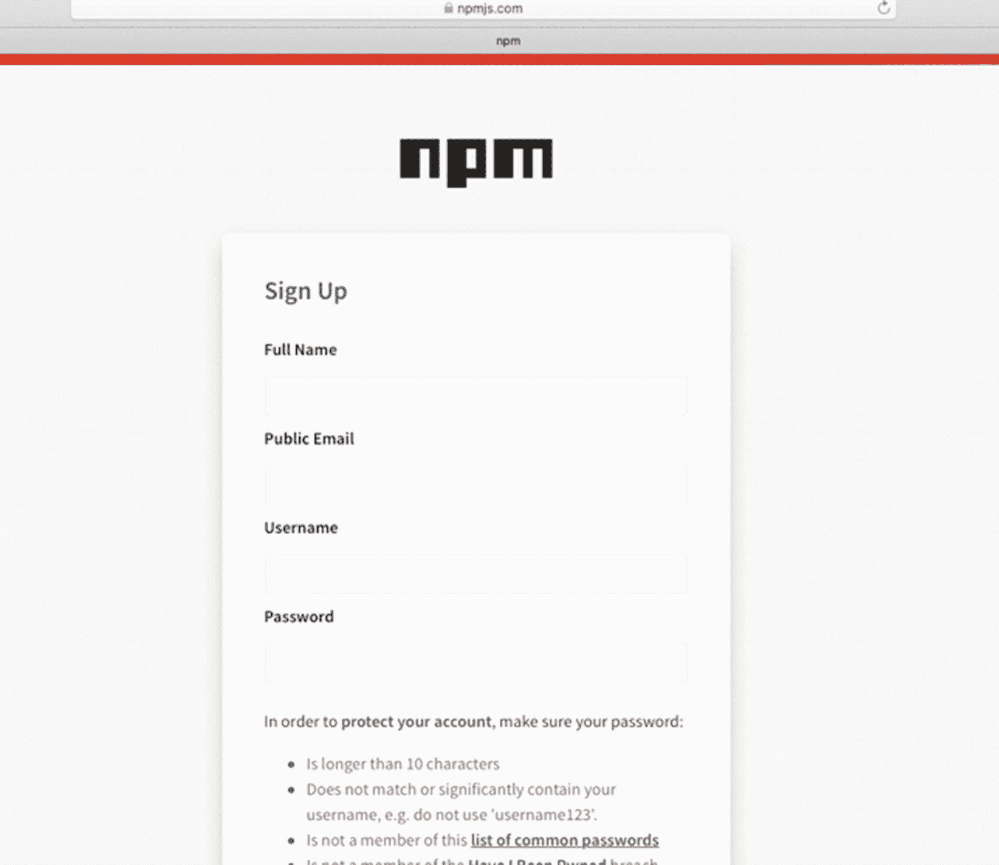

图 7-1

在`npmjs.com`中创建用户账户

接下来，我们必须使用`$npm adduser`(图 [7-2](#Fig2) )将我们的账户与终端连接起来。

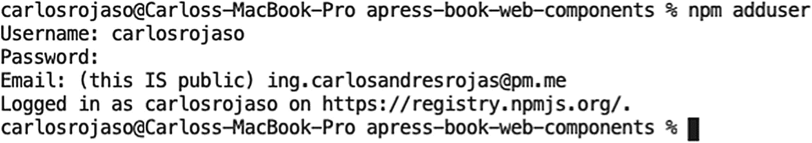

图 7-2

将我们的终端与`npm`连接

现在我们必须把我们的组件分离出来，做成模块，其结构如图 [7-3](#Fig3) 所示。

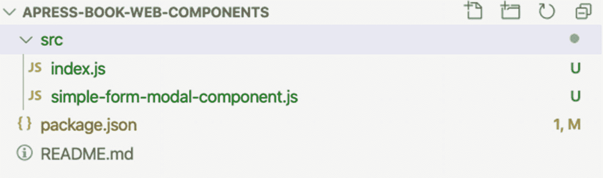

图 7-3

结构来发布组件

我们为组件创建一个`package.json`文件，如清单 [7-1](#PC1) 所示。

```jsx
{
  "name": "apress-simple-form-modal-component",
  "version": "1.0.1",
  "description": "simple form modal component",
  "main": "src/index.js",
  "module": "src/index.js",
  "directories": {
    "src": "src"
  },
  "scripts": {
    "test": "echo \"Error: no test specified\" && exit 1"
  },
  "repository": {
    "type": "git",
    "url": "git+https://github.com/carlosrojaso/apress-book-web-components.git"
  },
  "author": "Carlos Rojas",
  "license": "MIT",
  "bugs": {
    "url": "https://github.com/carlosrojaso/apress-book-web-components/issues"
  },
  "homepage": "https://github.com/carlosrojaso/apress-book-web-components#readme"
}

Listing 7-1package.json for simple-form-modal-component

```

在这个`package.json`文件中，我们定义了组件在`npmjs.com`中的名称以及文件的结构。`npm`包名应该是唯一的。因此，您必须确保您为`package.json`中的`name`属性选择的名称不会在`npmjs.com`中使用。

现在我们将创建一个名为 src 的目录，我们将在其中定位我们的代码源。然后，我们将把我们的`simple-form-modal-component.js`移到那里，并创建一个新文件`index.js`，如清单 [7-2](#PC2) 所示。

```jsx
export * from './simple-form-modal-component';

Listing 7-2index.js for simple-form-modal-component

```

这只是我们用来导入`simple-form-modal-componet.js`中所有内容的一行。因此，在我们的文件`simple-form-modal-component.js`中，我们必须添加单词*导出*，以使我们的组件作为一个模块可用，如清单 [7-3](#PC3) 所示。

```jsx
export class SimpleFormModalComponent extends HTMLElement {
...
}
customElements.define('simple-form-modal-component', SimpleFormModalComponent);

Listing 7-3Converting simple-form-modal-component in a Module

```

好了，我们现在已经准备好组件了。下一步是运行

```jsx
$npm publish

```

现在我们已经发布了我们的组件(见图 [7-4](#Fig4) )。

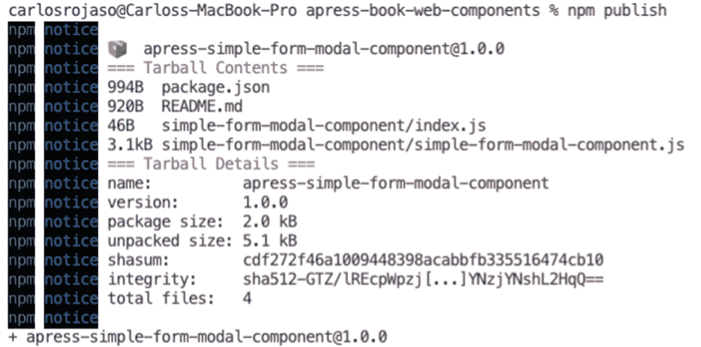

图 7-4

发布`simple-form-modal-component`

您可以在`$git checkout chap-7-1`获取这本书的代码( [`https://github.com/carlosrojaso/apress-book-web-components`](https://github.com/carlosrojaso/apress-book-web-components) )。

这个过程对于`<note-list-component>`和`<note-list-item-component>`是相似的。如果你想看修改，你可以在`$git checkout chap-7-2`和`$git checkout chap-7-3`看到。

现在我们可以很容易地在项目中使用我们的组件。现在，我们将使用服务`unpkg.com`。`unpkg`是`npm`包的`cdn`，方便插入我们的包，如清单 [7-4](#PC5) 所示。

```jsx
<!DOCTYPE html>
<html>
<head>

<meta name="viewport" content="width=device-width, initial-scale=1">

<script async type="module" src="http://unpkg.com/apress-simple-form-modal-component@1.0.1/src/simple-form-modal-component.js"></script>

<script async type="module" src="http://unpkg.com/apress-book-web-components-note-list@1.0.1/src/note-list-component.js"></script>
<script async type="module" src="http://unpkg.com/apress-note-list-item-component@1.0.1/src/note-list-item-component.js"></script>

<script async type="module" src="./app.js"></script>

<link rel="stylesheet" type="text/css" href="./style.css">

</head>
<body>

<h2>Notes App</h2>

<button class="fab" id="myBtn">+</button>

<simple-form-modal-component></simple-form-modal-component>

<note-list-component></note-list-component>

</body>
</html>

Listing 7-4package.json

for simple-form-modal-component

```

您可以在`$git checkout chap-7-4`访问代码( [`https://github.com/carlosrojaso/apress-book-web-components`](https://github.com/carlosrojaso/apress-book-web-components) )。

有了这些修改，我们不需要项目中的组件文件，因为我们是从`unpkg.com`导入的。在接下来的部分中，您将学习添加其他工具来从我们的本地环境中运行一切，使用没有`unpkg.com`的`npm`。

## 旧的网络浏览器支持

Web 组件在主流浏览器或 Webkit 以及所有基于 Chrome 的 web 浏览器中都有出色的支持(见图 [7-5](#Fig5) )。但是如果我们必须支持 IE 11 这样的网络浏览器会怎么样呢？

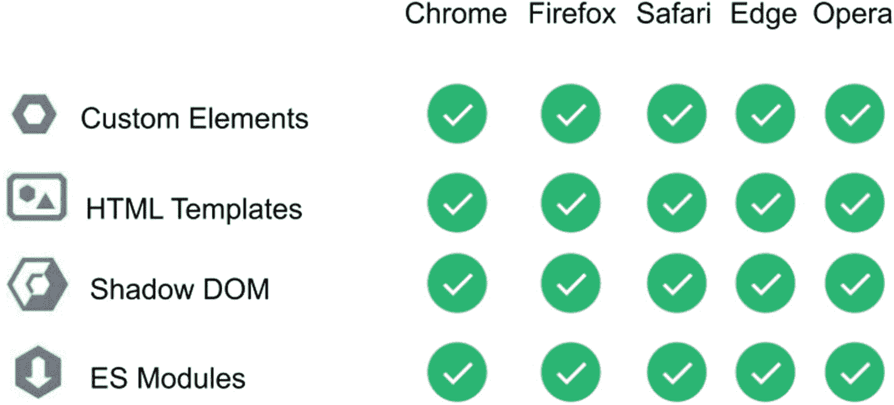

图 7-5

支持 Web 组件主要规范的主流浏览器

如果你去我能使用吗(`caniuse.com`)并搜索我们需要使用 Web 组件的每个规范，你会发现对于 ES6，IE 11 的支持是有限的(图 [7-6](#Fig6) )。

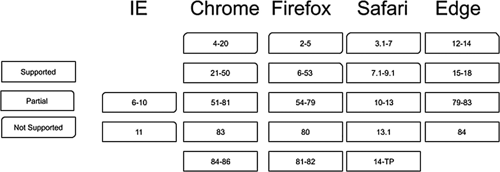

图 7-6

支持 ES6 <sup>[1](#Fn1)</sup> 的网页浏览器版本

IE 11 不提供对自定义元素的支持(图 [7-7](#Fig7) )。

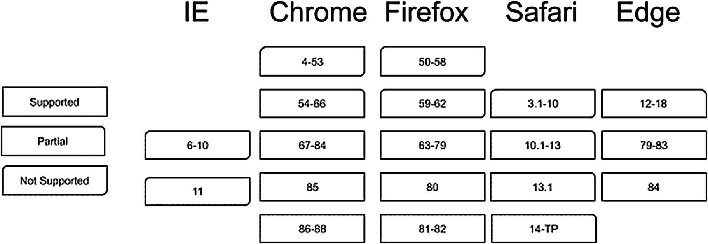

图 7-7

支持自定义元素的网页浏览器版本 <sup>[2](#Fn2)</sup>

IE 11 不提供对 HTML 模板的支持(图 [7-8](#Fig8) )。

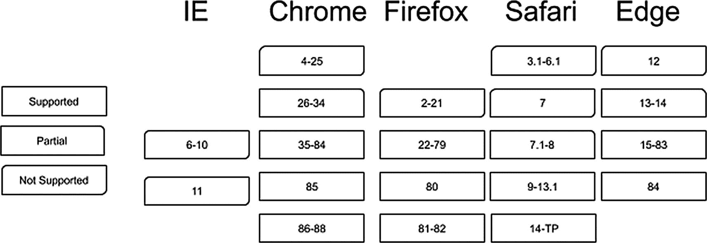

图 7-8

支持 HTML 模板的网页浏览器版本 <sup>[3](#Fn3)</sup>

IE 11 不提供对影子 DOM 的支持(图 [7-9](#Fig9) )。

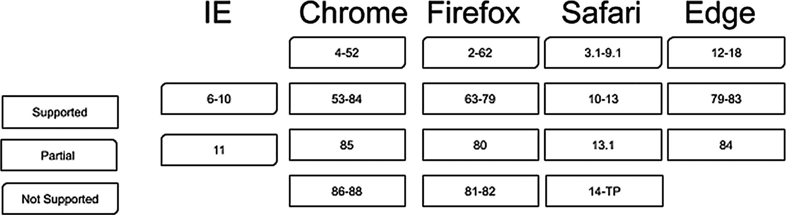

图 7-9

支持影子 DOM 的网页浏览器版本 <sup>[4](#Fn4)</sup>

IE 11 不提供对 ES 模块的支持(图 [7-10](#Fig10) )。

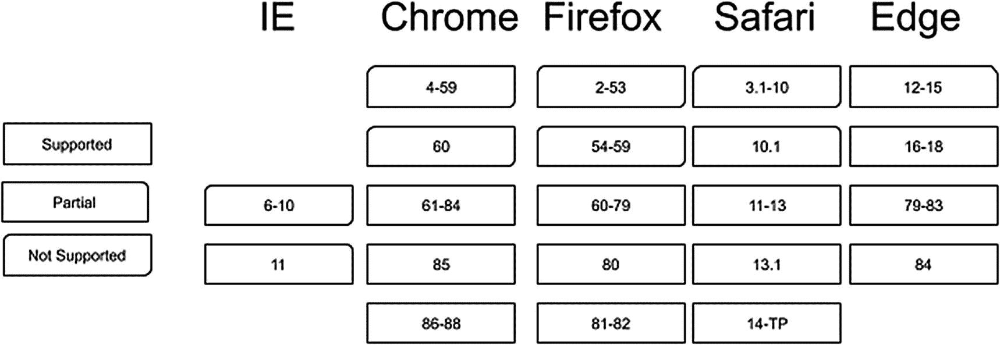

图 7-10

支持 ES 模块的网络浏览器版本 <sup>[5](#Fn5)</sup>

IE 11 是一个还不流行的网络浏览器；因此，我们可能会在某个项目的某个时候遇到问题。幸运的是，我们可以用 polyfills 解决这些问题。

## 多填充物

聚合填充用于通过模拟这些功能的库将缺失的功能添加到 web 浏览器中。对于 web 组件，我们可以将一个可靠的包添加到我们的项目中，以支持更多的 web 浏览器。您可以在 [`https://github.com/webcomponents/polyfills/tree/master/packages/webcomponentsjs`](https://github.com/webcomponents/polyfills/tree/master/packages/webcomponentsjs) 访问项目，并使用`unpkg.com`(列表 [7-5](#PC7) )快速添加聚合填充。

```jsx
<!DOCTYPE html>
<html>
<head>
<meta name="viewport" content="width=device-width, initial-scale=1">
<script async src="https://unpkg.com/browse/@webcomponents/webcomponentsjs@2.4.3/webcomponents-bundle.js"></script>
<script async type="module" src="http://unpkg.com/apress-simple-form-modal-component@1.0.1/src/simple-form-modal-component.js"></script>
<script async type="module" src="http://unpkg.com/apress-book-web-components-note-list@1.0.1/src/note-list-component.js"></script>
<script async type="module" src="http://unpkg.com/apress-note-list-item-component@1.0.1/src/note-list-item-component.js"></script>
<script async type="module" src="./app.js"></script>
<link rel="stylesheet" type="text/css" href="./style.css">
</head>
<body>

<h2>Notes App</h2>
<button class="fab" id="myBtn">+</button>
<simple-form-modal-component></simple-form-modal-component>
<note-list-component></note-list-component>
</body>
</html>

Listing 7-5Adding webcomponentsjs Polyfills

```

通过这次修改，我们现在对缺少 web 组件 API 的 Web 浏览器有了更好的支持。

您可以在`$git checkout chap-7-5`获取这本书的代码( [`https://github.com/carlosrojaso/apress-book-web-components`](https://github.com/carlosrojaso/apress-book-web-components) )。

## 网络包和巴别塔

使用聚合填充，我们现在拥有了项目中以前缺少的功能。尽管如此，我们要求 IE 11 理解我们在 ES6 中使用的 JS。为了实现这一点，我们将使用 Babel 作为 transpiler，并在 ES5 中转换我们的代码。Webpack 将处理所有的依赖关系，并把所有的东西放在一个没有 es 模块的 web 浏览器可以找到的地方。您可以在`babeljs.io and webpack.js.org`阅读关于这些工具的更多信息。

首先，在每个组件中，我们将通过`npm`安装我们需要的所有过程所需的工具。为此，请运行以下命令:

```jsx
$ npm install rimraf webpack webpack-cli babel-core babel-loader babel-preset-env path serve copyfiles --save-dev

```

使用这个命令，您将向 package.json 添加所有工具。

现在我将创建一个`webpack.config.js`文件并添加一些设置(列表 [7-6](#PC9) )。

```jsx
var path= require('path');
module.exports = {
  entry: './src/index.js',
  output: {
    path: path.resolve(__dirname, 'dist'),
    filename: 'index.js',
    library: 'apressSimpleFormModalComponent',
    libraryTarget: 'umd'
  }
};

Listing 7-6Adding webpack.config.js in simple-form-modal-component Project

```

在这里，我们说把文件放在`./src/index.js`中并解析所有的依赖关系，把它们放在`./dist/index.js`中，并把它作为一个`umd`格式的库来处理。通用模块定义，或 UMD，是一种在 web 浏览器中添加 JS 模块之前创建模块的方法。

现在我们将在我们的项目中添加一些`npm`脚本(清单 [7-7](#PC10) )。

```jsx
"scripts": {
    "clean": "rimraf dist",
    "build": "npm run clean && webpack --mode production",
    "cpdir": "copyfiles -V \"./dist/*.js\" \"./example\"",
    "start": "npm run build && npm run cpdir && serve example"
  }

Listing 7-7Adding npm Scripts in package.json

```

从先前的构建中删除任何生成的代码。`cpdir`复制`./example`文件夹中的`./dist`目录。`build`使用`webpack`创建 transpiled 文件并开始运行本地服务器，以查看我们编译的组件在示例中的运行情况。

现在我将创建一个示例文件夹，并将我们完整的 NoteApp 项目复制到其中，您可以在分支`chap-7-5`中找到。为了测试我们的构建，我们必须修改`index.html`，如清单 [7-8](#PC11) 所示。

```jsx
<!DOCTYPE html>
<html>

<head>

<meta name="viewport" content="width=device-width, initial-scale=1">

<script async src="https://unpkg.com/browse/@webcomponents/webcomponentsjs@2.4.3/webcomponents-bundle.js"></script>

<script async src="./dist/index.js"></script>

<script async type="module" src="http://unpkg.com/apress-book-web-components-note-list@1.0.1/src/note-list-component.js"></script>

<script async type="module" src="http://unpkg.com/apress-note-list-item-component@1.0.1/src/note-list-item-component.js"></script>

<script async type="module" src="./app.js"></script>

<link rel="stylesheet" type="text/css" href="./style.css">
</head>
...

Listing 7-8Loading Our simple-form-modal-component from ./dist/index.js

```

有了这个，每次我们运行一个新的构建，我们就可以测试编译后的文件是否仍然像预期的那样工作。

现在，您可以运行命令`$npm run start`并转到 localhost:5000，查看一切是否如预期的那样工作(图 [7-11](#Fig11) )。

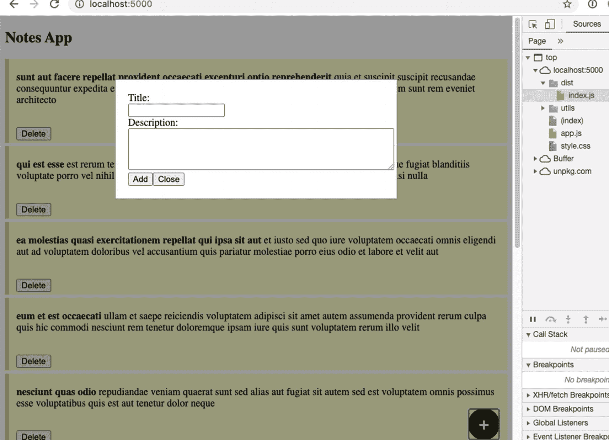

图 7-11

从编译后的文件运行`simple-form-modal`

它像预期的那样工作——现在我们可以在旧的 web 浏览器中使用它，如 IE 11——并且使用 ES5，这是 IE 11 应该理解的 JS 规范。

您可以使用`$git checkout chap-7-6`访问代码( [`https://github.com/carlosrojaso/apress-book-web-components`](https://github.com/carlosrojaso/apress-book-web-components) )。

这个过程对于`<note-list-component>`和`<note-list-item-component>`是相似的。如果你想看到修改，你可以从`$git checkout chap-7-7`和`$git checkout chap-7-8`访问它们。

您可以在`$git checkout chap-7`找到使用聚合填充和编译组件的最终示例。

## 摘要

在本章中，您学习了

*   如何发布到`npmjs.com`

*   如何让我们的组件对旧的 web 浏览器可用

*   如何用 Babel 和 Webpack 编译我们的组件

<aside aria-label="Footnotes" class="FootnoteSection" epub:type="footnotes">Footnotes [1](#Fn1_source)

[T2`https://caniuse.com/es6`](https://caniuse.com/es6)

  [2](#Fn2_source)

[T2`https://caniuse.com/custom-elementsv1`](https://caniuse.com/custom-elementsv1)

  [3](#Fn3_source)

[T2`https://caniuse.com/template`](https://caniuse.com/template)

  [4](#Fn4_source)

[T2`https://caniuse.com/shadowdomv1`](https://caniuse.com/shadowdomv1)

  [5](#Fn5_source)

[T2`https://caniuse.com/es6-module`](https://caniuse.com/es6-module)

 </aside>