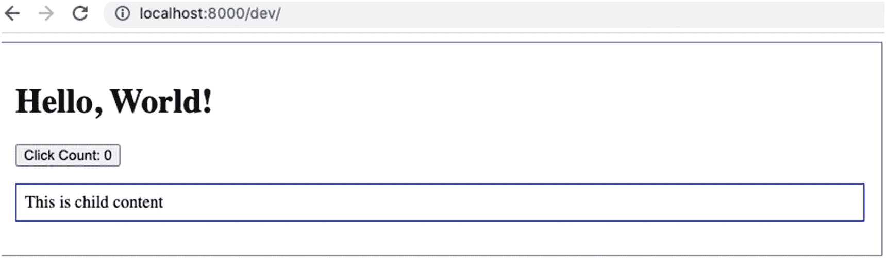
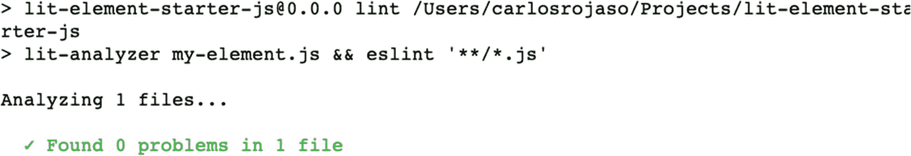
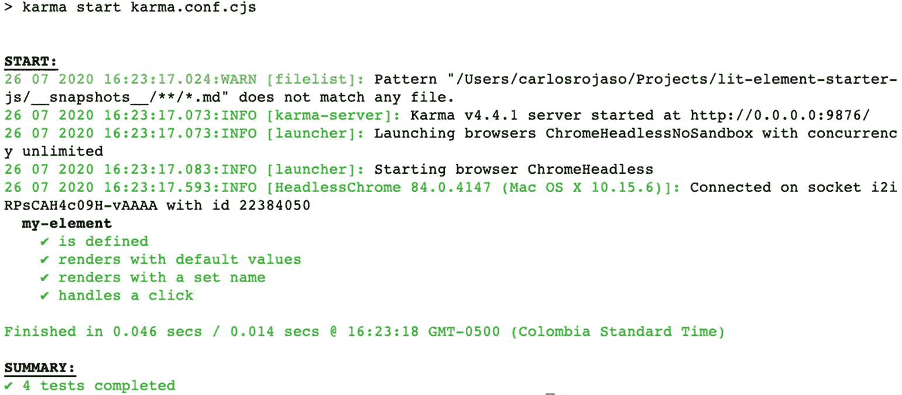
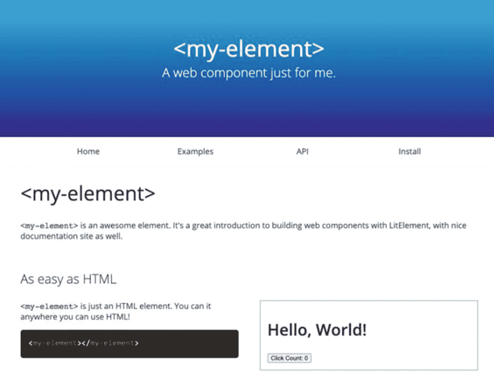

# 八、Polymer

在本章中，你将学习如何用 Polymer 构建 web 组件，为什么用 Polymer 代替 VanillaJS，如何在我们的 web 组件中使用`LitElement`，以及如何使用`lit-html`。

Polymer 已经存在很长时间了，从 Polymer 版本 1x 和 2x 开始。该项目的重点是使用 Polymer CLI 和`PolymerElements`构建一个完整的框架来制作完整的项目。有了 Polymer 3x，仍然可以使用 Polymer CLI 和`PolymerElements`。然而，该项目现在面向使用`LitElement`和`LitHtml`库来构建组件，并使它们在所有 JS 项目中可用。这就是为什么我们要关注这些库。

像谷歌、YouTube、可口可乐、麦当劳和 BBVA 这样的大公司，以及其他许多公司，都在用 Polymer 建造项目。

## 入门指南

为了开始构建我们的组件，Polymer 提供了两个惊人的“启动器”,让我们用`LitElement`开发组件，并为我们提供一些方便的工具，用于林挺、测试和生成文档。你不必使用启动器，但它会使事情变得更容易。可以在 [`https://github.com/PolymerLabs/lit-element-starter-js`](https://github.com/PolymerLabs/lit-element-starter-js) 获得 JS 首发，在 [`https://github.com/PolymerLabs/lit-element-starter-ts`](https://github.com/PolymerLabs/lit-element-starter-ts) 获得 TS 首发。我将使用 JS Starter 来构建本章中的例子。

首先，通过运行`$ git clone`(在 [`https://github.com/PolymerLabs/lit-element-starter-js.git`](https://github.com/PolymerLabs/lit-element-starter-js.git) 可用)在你的机器中克隆项目。

安装依赖项，运行在项目文件夹`$ npm install`中。

就这样。现在，您可以通过执行`$ npm run serve`来运行本地服务器。

转到`http://localhost:8000/dev/`查看如图 [8-1](#Fig1) 所示运行的示例 web 组件。



图 8-1

你好，世界！例子

你可以通过执行`$npm run lint`来运行`ESLint`。

终端将显示在您的组件中发现的所有代码样式问题(参见图 [8-2](#Fig2) )。



图 8-2

正在运行`ESLint`

您可以通过执行`$ npm run test`来运行 Karma、Chai 和 Mocha 测试。

终端将显示我们为组件编写的所有测试(见图 [8-3](#Fig3) )。



图 8-3

运行测试

执行`$ npm run docs`可以生成单据。

使用`$npm run docs:serve`，您可以看到创建的文档。

这些任务使用 eleventy，一个静态站点生成器，根据我们在文件夹`docs-src`中创建的模板来生成漂亮的文档(图 [8-4](#Fig4) )。



图 8-4

运行文档

如您所见，这个 starter 是构建组件的良好起点。在接下来的部分中，我们将为每个 web 组件使用一个新项目来迁移`<simple-form-modal-component>`、`<note-list-component>`和`<note-list-item-component>`。

## 列表元素

`LitElement`是一个库，它为我们创建 web 组件提供了一个基类，而不用担心当我们只使用 JS 时必须处理低级的复杂性，例如每次更新时呈现元素。

`LitElement`使用`lit-html`来处理我们组件中的模板。`lit-html`是一个模板库，我们可以独立地将它添加到我们的 JS 项目中，高效地呈现带有数据的 HTML 模板。

### 性能

在前面的章节中，你可能还记得我们用类中的 setters 和 getters 创建了属性。在一个`LitElement`中，我们只需要声明`get properties()`静态方法中的所有属性，如清单 [8-1](#PC1) 所示。

```jsx
static get properties() {
  return { propertyName: options};
}

Listing 8-1Declaring Properties

```

`LitElement`将为我们妥善处理更新和转换。在选项中，我们可以添加以下值:

*   `Attribute`:该值表示属性是否与某个属性相关联，或者是相关属性的自定义名称。

*   `hasChanged`:这个函数采用一个`oldValue`和`newValue`，返回一个`Boolean`来表示一个属性在被设置时是否已经改变。

*   `Type`:这是一种属性与属性之间转换的提示。可以用`String`、`Number`、`Boolean`、`Array`、`Object`。

清单 [8-2](#PC2) 中给出了一个在`<simple-form-modal-component>`中声明属性的例子。

```jsx
static get properties() {
    return {
      open: {
        type: Boolean,
        hasChanged(newVal, oldVal) {
          if (oldVal !== newVal) {
            return true;
          }
          else {
            return false;
          }
        }
      }
    };
}

Listing 8-2Declaring Properties in <simple-form-modal-component>

```

这里，我们将`open`属性创建为`Boolean`，并在属性改变时检查逻辑。你可以在 [`https://lit-element.polymer-project.org/guide/properties`](https://lit-element.polymer-project.org/guide/properties) 找到属性的所有机制。

### 模板

当发生变化时，呈现和更新 DOM 是一项困难的任务，这会影响处理它的函数中代码的性能。解决了这种复杂性，并为我们提供了一种构建模板的便捷方式。

使用模板很简单:只需在组件中使用`render()`方法，并用`html`标签函数返回一个模板文本，如清单 [8-3](#PC3) 所示。

```jsx
import { LitElement, html } from 'lit-element';
class MyComponent extends LitElement {
  render(){
    return html`
      <div>
        My Component content
      </div>
    `;
  }
}
customElements.define('my-component, MyComponent);

Listing 8-3Using Templates

```

如果我们必须使用一个属性，我们必须在模板文本中用`this.prop`符号调用它，如清单 [8-4](#PC4) 所示。

```jsx
import { LitElement, html } from 'lit-element';
class MyComponent extends LitElement {
static get properties() {
    return {
      myString: { type: String }
    };
  }
  render(){
    return html`
      <div>
        My Component content with ${this.myString}
      </div>
    `;
  }
}
customElements.define('my-component, MyComponent);

Listing 8-4Using a Property in Templates

```

如果我们想要绑定一个属性，我们可以直接从模板文本传递它，如清单 [8-5](#PC5) 所示。

```jsx
import { LitElement, html } from 'lit-element';
class MyComponent extends LitElement {
static get properties() {
    return {
      myId: { type: String }
    };
  }
  render(){
    return html`
      <div id=”${this.myId}”>
        My Component content
      </div>
    `;
  }
}

Listing 8-5Binding an Attribute in Templates

```

如果我们想绑定一个属性，我们可以用模板文字中的`.prop`符号传递它，如清单 [8-6](#PC6) 所示。

```jsx
import { LitElement, html } from 'lit-element';
class MyComponent extends LitElement {
static get properties() {
    return {
      myValue: { type: String }
    };
  }
  render(){
    return html`
      <input type="checkbox" .value="${this.myValue}"/>
    `;
  }
}

Listing 8-6Binding a Property in Templates

```

如果我们想将一个`clickHandler`绑定到一个点击事件，我们可以用模板文字中的`$click`符号传递它，如清单 [8-7](#PC7) 所示。

```jsx
import { LitElement, html } from 'lit-element';
class MyComponent extends LitElement {
  render(){
    return html`
      <button @click="${this.clickHandler}">click</button>
    `;
  }
  clickHandler(e) {
    console.log(e.target);
  }
}

Listing 8-7Binding a clickHandler in a Click Event

```

您可以在 [`https://lit-element.polymer-project.org/guide/templates`](https://lit-element.polymer-project.org/guide/templates) 或 [`https://lit-html.polymer-project.org/guide`](https://lit-html.polymer-project.org/guide) 找到模板的所有机制。

### 风格

使用 Polymer 在 web 组件中添加样式非常简单。简单地在静态方法`styles()`中添加你的选择器和属性，如清单 [8-8](#PC8) 所示。

```jsx
import { LitElement, html } from 'lit-element';

class MyComponent extends LitElement {
  static get styles() {
    return css`
      div { color: blue; }
    `;
  }
  render() {
    return html`
      <div>Content in Blue!</div>
    `;
  }}

Listing 8-8Adding Styles in Web Components

```

你可以在 [`https://lit-element.polymer-project.org/guide/styles`](https://lit-element.polymer-project.org/guide/styles) 了解更多风格。

### 事件

您可以直接在模板中添加事件监听器，如清单 [8-9](#PC9) 所示。

```jsx
import { LitElement, html } from 'lit-element';

class MyComponent extends LitElement {

  render() {
    return html`<button @click="${this.handleEvent}">click</button>`;
  }

  handleEvent(e) {
   console.log(e);
  }
}

Listing 8-9Adding an Event in the Template

```

您也可以在组件中直接添加监听器，在生命周期的某个方法中，如清单 [8-10](#PC10) 所示。

```jsx
import { LitElement, html } from 'lit-element';

class MyComponent extends LitElement {

  constructor() {
    super();
    this.addEventListener('DOMContentLoaded', this.handleEvent);
  }

  handleEvent() {
   console.log('It is Loaded');
  }
}

Listing 8-10Adding an Event in the Component

```

您可以在 [`https://lit-element.polymer-project.org/guide/events`](https://lit-element.polymer-project.org/guide/events) 了解更多活动。

### 生存期

从 Web 组件标准中继承了默认的生命周期回调，以及一些可用于在组件中添加逻辑的附加方法。

*   `connectedCallback`:当一个组件被添加到文档的 DOM 时，这个函数被调用(清单 [8-11](#PC11) )。

*   `disconnectedCallback`:当一个组件从文档的 DOM 中删除时，这个函数被调用(清单 [8-12](#PC12) )。

```jsx
import { LitElement, html } from 'lit-element';

class MyComponent extends LitElement {

  connectedCallback() {
    super.connectedCallback();
    console.log('added');
  }
}

Listing 8-11connectedCallback

```

*   `adoptedCallback`:当一个组件被移动到一个新的文档时，这个函数被调用(清单 [8-13](#PC13) )。

```jsx
import { LitElement, html } from 'lit-element';

class MyComponent extends LitElement {

  disconnectedCallback() {
    super.disconnectedCallback();
    console.log('removed');
  }
}

Listing 8-12disconnectedCallback

```

*   `attibuteChangedCallback`:当一个组件属性改变时调用(清单 [8-14](#PC14) )。

```jsx
import { LitElement, html } from 'lit-element';

class MyComponent extends LitElement {

  adoptedCallback() {
    super.disconnectedCallback();
    console.log('moved');
  }
}

Listing 8-13adoptedCallback

```

*   `firstUpdated`:这在你的组件第一次被更新和渲染后被调用(清单 [8-15](#PC15) )。

```jsx
import { LitElement, html } from 'lit-element';

class MyComponent extends LitElement {

  attributeChangedCallback(name, oldVal, newVal) {
    super.attributeChangedCallback(name, oldVal, newVal);
    console.log('attribute change: ', name, newVal);
  }
}

Listing 8-14attibuteChangedCallback

```

*   `updated`:当元素的 DOM 被更新和呈现时，这个函数被调用(清单 [8-16](#PC16) )。

```jsx
import { LitElement, html } from 'lit-element';

class MyComponent extends LitElement {

  firstUpdated(changedProperties) {
    console.log('first updated');
  }
}

Listing 8-15firstUpdated

```

```jsx
import { LitElement, html } from 'lit-element';

class MyComponent extends LitElement {

  updated(changedProperties) {
    changedProperties.forEach((oldValue, propName) => {
      console.log(`${propName} changed. oldValue: ${oldValue}`);
    });
  }
}

Listing 8-16updated

```

你可以在 [`https://lit-element.polymer-project.org/guide/lifecycle`](https://lit-element.polymer-project.org/guide/lifecycle) 中阅读更多关于生命周期的内容。

## Polymer 建筑

在本节中，我们将使用 Polymer 启动器构建我们的`<simple-form-modal-component>`、`<note-list-component>`和`<note-list-item-component>`。

正如您在清单 [8-17](#PC17) 中看到的，我们在 VanillaJS 有我们的`SimpleFormModalComponent`。

```jsx
export class SimpleFormModalComponent extends HTMLElement {

  constructor() {
      super();

      this.root = this.attachShadow({mode: 'open'});
      this.container = document.createElement('div');
      this.container.innerHTML = this.getTemplate();
      this.root.appendChild(this.container.cloneNode(true));

      this._open = this.getAttribute('open') || false;

      this.modal = this.root.getElementById("myModal");
      this.addBtn = this.root.getElementById("addBtn");
      this.closeBtn = this.root.getElementById("closeBtn");

      this.handleAdd = this.handleAdd.bind(this);
      this.handleCancel = this.handleCancel.bind(this);

  }

  connectedCallback() {
    this.addBtn.addEventListener('click', this.handleAdd);
    this.closeBtn.addEventListener('click', this.handleCancel);
  }

  disconnectedCallback () {
    this.addBtn.removeEventListener('click', this.handleAdd);
    this.closeBtn.removeEventListener('click', this.handleCancel);
  }

  get open() {
    return this._open;
  }

  set open(newValue) {
    this._open = newValue;
    this.showModal(this._open);
  }

  handleAdd() {
    const fTitle = this.root.getElementById('ftitle');
    const fDesc = this.root.getElementById('fdesc');
    this.dispatchEvent(new CustomEvent('add-event', {bubbles: true, composed:true, detail: {title: fTitle.value, description: fDesc.value}}));

    fTitle.value = '';
    fDesc.value = '';
    this.open = false;
  }

  handleCancel() {
    this.open = false;
  }

  showModal(state) {
    if(state) {
      this.modal.style.display = "block";
    } else {
      this.modal.style.display = "none"
    }
  }

  getTemplate() {
      return `
      ${this.getStyle()}
      <div id="myModal" class="modal">
        <div class="modal-content">
          <form id="myForm">
            <label for="ftitle">Title:</label><br>
            <input type="text" id="ftitle" name="ftitle"><br>
            <label for="fdesc">Description:</label><br>
            <textarea id="fdesc" name="fdesc" rows="4" cols="50"></textarea><br/>
            <button type="button" id="addBtn">Add</button><button type="button" id="closeBtn">Close</button>
          </form>
        </div>
      </div>`;
  }

  getStyle() {
      return `
      <style>
        .modal {
          display: none;
          position: fixed;
          z-index: 1;
          padding-top: 100px;
          left: 0;
          top: 0;
          width: 100%;
          height: 100%;
          overflow: auto;
          background-color: rgb(0,0,0);
          background-color: rgba(0,0,0,0.4);
        }
        .modal-content {
          background-color: #fefefe;
          margin: auto;
          padding: 20px;
          border: 1px solid #888;
          width: 50%;
        }
      </style>`;
  }
}
customElements.define('simple-form-modal-component', SimpleFormModalComponent);

Listing 8-17SimpleFormModalComponent in VanillaJS

```

我们有一个为组件返回 HTML 的`getTemplate()`方法，一个返回我们在组件中使用的样式规则的`getStyle()`方法，一些我们添加到组件中处理组件中一些逻辑的方法，以及一些更新组件中属性的 setter 和 getter。我们可以使用相同的原则快速创建一个`LitElement`，并使我们的代码更短，因为`LitElement`为我们处理一些底层的事情。

我们可以使用`LitElement`语法从属性开始，如清单 [8-18](#PC18) 所示。

```jsx
import {LitElement, html, css} from 'lit-element';

export class SimpleFormModalComponent extends LitElement {
static get properties() {
    return {
      open: {
        type: Boolean
      }
    };
  }

  constructor() {
    super();
    this.open = false;
  }
}

window.customElements.define('simple-form-modal-component', SimpleFormModalComponent);

Listing 8-18Adding Properties in SimpleFormModalComponent

with LitElement

```

在这里，我们将我们的`'open'`属性添加为`Boolean`，并将这个属性初始化为`constructor()`中的`false`。

接下来，我们将采用方法`getTemplate()`并在`LitElement`中进行迁移，如清单 [8-19](#PC19) 所示。

```jsx
import {LitElement, html, css} from 'lit-element';

export class SimpleFormModalComponent extends LitElement {
static get properties() {
    return {
      open: {
        type: Boolean
      }
    };
  }

  constructor() {
    super();

    this.open = false;
  }

  render() {
    return html`
      <div id="myModal" class="modal">
        <div class="modal-content">
          <form id="myForm">
            <label for="ftitle">Title:</label><br>
            <input type="text" id="ftitle" name="ftitle"><br>
            <label for="fdesc">Description:</label><br>
            <textarea id="fdesc" name="fdesc" rows="4" cols="50"></textarea><br/>
            <button type="button" id="addBtn">Add</button>
            <button type="button" id="closeBtn">Close</button>
          </form>
        </div>
      </div>
    `;
  }
}

window.customElements.define('simple-form-modal-component', SimpleFormModalComponent);

Listing 8-19Adding render()

in SimpleFormModalComponent with LitElement

```

正如你所看到的，这几乎是相同的代码，但是我们使用了`render()`方法并返回一个 HTML 标签文字而不是一个字符串。

现在我们要对`getStyle()`做同样的事情，将它移动到`styles()` getter，如清单 [8-20](#PC20) 所示。

```jsx
import {LitElement, html, css} from 'lit-element';

export class SimpleFormModalComponent extends LitElement {
static get styles() {
    return css`
      .modal {
        display: none;
        position: fixed;
        z-index: 1;

        padding-top: 100px;
        left: 0;
        top: 0;
        width: 100%;
        height: 100%;
        overflow: auto;
        background-color: rgb(0,0,0);
        background-color: rgba(0,0,0,0.4);
      }
      .modal-content {
        background-color: #fefefe;
        margin: auto;
        padding: 20px;
        border: 1px solid #888;
        width: 50%;
      }
    `;
}

static get properties() {
    return {
      open: {
        type: Boolean
      }
    };
  }

  constructor() {
    super();
    this.open = false;
  }

  render() {
    return html`
      <div id="myModal" class="modal">
        <div class="modal-content">
          <form id="myForm">
            <label for="ftitle">Title:</label><br>
            <input type="text" id="ftitle" name="ftitle"><br>
            <label for="fdesc">Description:</label><br>
            <textarea id="fdesc" name="fdesc" rows="4" cols="50"></textarea><br/>
            <button type="button" id="addBtn">Add</button>
            <button type="button" id="closeBtn">Close</button>
          </form>
        </div>
      </div>
    `;
  }
}

window.customElements.define('simple-form-modal-component', SimpleFormModalComponent);

Listing 8-20Adding render() in SimpleFormModalComponent with LitElement

```

现在我们将使用`@click`符号为按钮添加处理程序方法，如清单 [8-21](#PC21) 所示。

```jsx
import {LitElement, html, css} from 'lit-element';

export class SimpleFormModalComponent extends LitElement {
static get styles() {
    return css`
      .modal {
        display: none;
        position: fixed;
        z-index: 1;
        padding-top: 100px;
        left: 0;
        top: 0;
        width: 100%;
        height: 100%;
        overflow: auto;
        background-color: rgb(0,0,0);
        background-color: rgba(0,0,0,0.4);
      }
      .modal-content {
        background-color: #fefefe;
        margin: auto;
        padding: 20px;
        border: 1px solid #888;
        width: 50%;
      }
    `;
}

static get properties() {
    return {
      open: {
        type: Boolean
      }
    };
  }

  constructor() {
    super();
    this.open = false;
  }

  render() {
    return html`
      <div id="myModal" class="modal">
        <div class="modal-content">
          <form id="myForm">
            <label for="ftitle">Title:</label><br>
            <input type="text" id="ftitle" name="ftitle"><br>
            <label for="fdesc">Description:</label><br>
            <textarea id="fdesc" name="fdesc" rows="4" cols="50"></textarea><br/>
            <button type="button" id="addBtn" @click=${this.handleAdd}>Add</button>
            <button type="button" id="closeBtn" @click=${this.handleCancel}>Close</button>
          </form>
        </div>
      </div>
    `;
  }

  handleAdd() {
    const fTitle = this.shadowRoot.getElementById('ftitle');
    const fDesc = this.shadowRoot.getElementById('fdesc');
    this.dispatchEvent(new CustomEvent('addEvent', {detail: {title: fTitle.value, description: fDesc.value}}));

    fTitle.value = '';
    fDesc.value = '';
    this.open = false;
  }

  handleCancel() {
    this.open = false;
  }
}
window.customElements.define('simple-form-modal-component', SimpleFormModalComponent);

Listing 8-21Adding styles()

in SimpleFormModalComponent with LitElement

```

最后，我们将为`'open'`的更新添加`showModal()`方法，如清单 [8-22](#PC22) 所示。

```jsx
import {LitElement, html, css} from 'lit-element';

export class SimpleFormModalComponent extends LitElement {
  static get styles() {
    return css`
      .modal {
        display: none;
        position: fixed;
        z-index: 1;
        padding-top: 100px;
        left: 0;
        top: 0;
        width: 100%;
        height: 100%;
        overflow: auto;
        background-color: rgb(0,0,0);
        background-color: rgba(0,0,0,0.4);
      }
      .modal-content {
        background-color: #fefefe;
        margin: auto;
        padding: 20px;
        border: 1px solid #888;
        width: 50%;
      }
    `;
  }

  static get properties() {
    return {
      open: {
        type: Boolean,
        hasChanged(newVal, oldVal) {
          if (oldVal !== newVal) {
            return true;
          }
          else {
            return false;
          }
        }
      }
    };
  }

  constructor() {
    super();
    this.open = false;
  }

  render() {
    return html`
      <div id="myModal" class="modal">
        <div class="modal-content">
          <form id="myForm">
            <label for="ftitle">Title:</label><br>
            <input type="text" id="ftitle" name="ftitle"><br>
            <label for="fdesc">Description:</label><br>
            <textarea id="fdesc" name="fdesc" rows="4" cols="50"></textarea><br/>
            <button type="button" id="addBtn" @click=${this.handleAdd}>Add</button>
            <button type="button" id="closeBtn" @click=${this.handleCancel}>Close</button>
          </form>
        </div>
      </div>
    `;
  }

  handleAdd() {
    const fTitle = this.shadowRoot.getElementById('ftitle');
    const fDesc = this.shadowRoot.getElementById('fdesc');
    this.dispatchEvent(new CustomEvent('addEvent', {detail: {title: fTitle.value, description: fDesc.value}}));

    fTitle.value = '';
    fDesc.value = '';
    this.open = false;
  }

  handleCancel() {
    this.open = false;
  }

  showModal(state) {
    const modal = this.shadowRoot.getElementById("myModal");
    if(state) {
      modal.style.display = "block";
    } else {
      modal.style.display = "none"
    }
  }

  updated(){
    this.showModal(this.open);
  }
}

window.customElements.define('simple-form-modal-component', SimpleFormModalComponent);

Listing 8-22Adding render() in SimpleFormModalComponent with LitElement

```

这里，我们使用`'open'`中的选项`hasChanged()`来检查更新何时被触发，使用`updated()`方法，我们使用方法`showModal()`来显示/隐藏模态。现在，我们的`<simple-form-modal-component>`准备好了。

您可以通过以下方式访问本书的代码( [`https://github.com/carlosrojaso/apress-book-web-components`](https://github.com/carlosrojaso/apress-book-web-components) )

```jsx
$git checkout chap-8.

```

我在`dev/`文件夹中创建了一个例子，在`docs-src/`文件夹中创建了文档，在`test/`文件夹中创建了一些基本测试，然后你可以运行下面的代码:

```jsx
$ npm install

$ npm run serve

```

要查看在 localhost:8080/dev 中运行的示例，请运行

```jsx
$ npm run docs

$ npm run docs:serve

```

我们将继续使用我们在前面章节中写的`<note-list-component>`，如清单 [8-23](#PC26) 。

```jsx
export class NoteListComponent extends HTMLElement {
  static get observedAttributes() { return ['notes']; }

  constructor() {
    super();

    this._notes = JSON.parse(this.getAttribute('notes')) || [];
    this.root = this.attachShadow({mode: 'open'});
    this.root.innerHTML = this.render();

    this.handleDelEvent = this.handleDelEvent.bind(this);
  }

  attributeChangedCallback(name, oldValue, newValue) {
    switch(name) {
      case 'notes':
        this.note = JSON.parse(newValue);
        this.root.innerHTML = this.render();
        break;
    }
  }

  connectedCallback() {
    this.root.addEventListener('del-event', this.handleDelEvent);
  }

  disconnectedCallback () {
    this.root.removeEventListener('del-event', this.handleDelEvent);
  }

  handleDelEvent(e) {
    this._notes.splice(e.detail.idx, 1);
    this.root.innerHTML = this.render();
  }

  render() {
    let noteElements = '';
    this._notes.map(
      (note, idx) => {
        noteElements += `
        <note-list-item-component note='${JSON.stringify(note)}' idx='${idx}'></note-list-item-component>`;
      }
    );
    return `
      ${noteElements}`;
  }

  get notes(){
    return this._notes;
  }

  set notes(newValue) {
    this._notes = newValue;
    this.root.innerHTML = this.render();
  }
}
customElements.define('note-list-component', NoteListComponent);

Listing 8-23NoteListComponent

in VanillaJS

```

我们将根据清单 [8-24](#PC27) 为组件添加属性。

```jsx
import {LitElement, html, css} from 'lit-element';

export class NoteListComponent extends LitElement {
static get properties() {
    return {
      notes: {
        type: Array,
        attribute: true,
        reflect: true,
      }
    };
  }

  constructor() {
    super();
    this.notes = this.getAttribute("notes") || [];
  }
}

Listing 8-24Adding Properties in NoteListComponent with LitElement

```

这里，我们将 notes 属性定义为一个数组，并添加了`options`属性，以使该属性作为一个属性正确工作。在`constructor()`中，我们用`'notes'`中的值或者一个空数组来初始化`this.notes`。

现在我们要迁移`render()`方法，它类似于`LitElement`，如清单 [8-25](#PC28) 所示。

```jsx
import {LitElement, html, css} from 'lit-element';

export class NoteListComponent extends LitElement {
static get properties() {
    return {
      notes: {
        type: Array,
        attribute: true,
        reflect: true,
      }
    };
  }

  constructor() {
    super();
    this.notes = this.getAttribute("notes") || [];
  }

  render() {
    return html`
      ${this.notes.map((note, idx) => {
        return html` <note-list-item-component
          note="${JSON.stringify(note)}"
          idx="${idx}"
        ></note-list-item-component>`;
      })}
    `;
  }
}

Listing 8-25Adding a Template in NoteListComponent with LitElement

```

这里，我们使用`map()`来迭代注释，并以 HTML 标记文字的形式返回所有注释，以使我们的模板正确工作。

每次值发生变化时，我们都必须更新注释，但是要做到这一点，我们必须做一些特殊的事情，因为当作为引用传递时，`hasChanged()`选项不会检测数组中何时发生变化。为了解决这个问题，我们将使用`attributeChangedCallback()`，如清单 [8-26](#PC29) 所示。

```jsx
import {LitElement, html, css} from 'lit-element';

export class NoteListComponent extends LitElement {
static get properties() {
    return {
      notes: {
        type: Array,
        attribute: true,
        reflect: true,
      }
    };
  }

  constructor() {
    super();
    this.notes = this.getAttribute("notes") || [];
  }

  attributeChangedCallback() {
    this.notes = [...this.notes];
    super.attributeChangedCallback();
  }

  render() {
    return html`
      ${this.notes.map((note, idx) => {
        return html` <note-list-item-component
          note="${JSON.stringify(note)}"
          idx="${idx}"
        ></note-list-item-component>`;
      })}
    `;
  }
}

Listing 8-26Adding attributeChangedCallback

in NoteListComponent with LitElement

```

这里，在`attributeChangedCallback()`中，我们检测到组件的变化。如果出现这种情况，我们可以使用`spread`操作符，用一个新的数组(不是引用)更新`this.notes`，通过这个小小的修正，我们的组件将再次正常工作。

最后，我们将为`'del-event'`和`handleDelEvent()`函数添加事件监听器，如清单 [8-27](#PC30) 所示。经过这些修改，我们的组件就准备好了。

```jsx
import {LitElement, html, css} from 'lit-element';

export class NoteListComponent extends LitElement {
static get properties() {
    return {
      notes: {
        type: Array,
        attribute: true,
        reflect: true,
      }
    };
  }

  constructor() {
    super();
    this.notes = this.getAttribute("notes") || [];
    this.addEventListener("del-event", this.handleDelEvent);
  }

  attributeChangedCallback() {
    this.notes = [...this.notes];
    super.attributeChangedCallback();
  }

  handleDelEvent(e) {
    this.notes.splice(e.detail.idx, 1);
    this.requestUpdate();
  }

  render() {
    return html`
      ${this.notes.map((note, idx) => {
        return html` <note-list-item-component
          note="${JSON.stringify(note)}"
          idx="${idx}"
        ></note-list-item-component>`;
      })}
    `;
  }
}

Listing 8-27Adding the Event Listener in NoteListComponent with LitElement

```

您可以在`$git checkout chap-8-1`获取这本书的代码( [`https://github.com/carlosrojaso/apress-book-web-components`](https://github.com/carlosrojaso/apress-book-web-components) )。

我在`dev/`文件夹中创建了一个例子，在`docs-src/`文件夹中创建了文档，在`test/`文件夹中创建了一些基本测试，然后你可以运行下面的代码:

```jsx
$ npm install

$ npm run serve

```

要查看在`localhost:8080/dev`中运行的示例，请运行以下命令:

```jsx
$ npm run docs

$ npm run docs:serve

```

现在我们要迁移我们在前面章节中写的最后一个组件`<note-list-item-component>`(见清单 [8-28](#PC33) )。

```jsx
export class NoteListItemComponent extends HTMLElement {
  static get observedAttributes() { return ['note', 'idx']; }

  constructor() {
    super();

    this._note = JSON.parse(this.getAttribute('note')) || {};
    this.idx = this.getAttribute('idx') || -1;
    this.root = this.attachShadow({mode: 'open'});
    this.root.innerHTML = this.getTemplate();

    this.delBtn = this.root.getElementById('deleteButton');
    this.handleDelete = this.handleDelete.bind(this);
  }

  connectedCallback() {
    this.delBtn.addEventListener('click', this.handleDelete);
  }

  disconnectedCallback () {
    this.delBtn.removeEventListener('click', this.handleDelete);
  }

  attributeChangedCallback(name, oldValue, newValue) {
    switch(name) {
      case 'note':
        this.note = JSON.parse(newValue);
        this.handleUpdate();
        break;
      case 'idx':
        this.idx = newValue;
        this.handleUpdate();
        break;
    }
   }

  get note() {
    return this._note;
  }

  set note(newValue) {
    this._note = newValue;
  }

  get idx() {
    return this._idx;
  }

  set idx(newValue) {
    this._idx = newValue;
  }

  handleDelete() {
    this.dispatchEvent(new CustomEvent('del-event', {bubbles: true,  composed: true, detail: {idx: this.idx}}));
  }

  handleUpdate() {
    this.root.innerHTML = this.getTemplate();
    this.delBtn = this.root.getElementById('deleteButton');
    this.handleDelete = this.handleDelete.bind(this);
    this.delBtn.addEventListener('click', this.handleDelete);
   }

  getStyle() {
    return `
    <style>
      .note {
        background-color: #ffffcc;
        border-left: 6px solid #ffeb3b;
      }
      div {
        margin: 5px 0px 5px;
        padding: 4px 12px;
      }
    </style>
    `;
  }

  getTemplate() {
    return`
    ${this.getStyle()}
    <div class="note">
      <p><strong>${this._note.title}</strong> ${this._note.description}</p><br/>
      <button type="button" id="deleteButton">Delete</button>
    </div>`;
  }
}
customElements.define('note-list-item-component', NoteListItemComponent);

Listing 8-28NoteListComponent in VanillaJS

```

迁移该组件的过程类似于我们之前遵循的步骤。因此，我将跳过解释，只向您展示`LitElement`(列表 [8-29](#PC34) )中的完整组件。

```jsx
import { LitElement, html, css } from "lit-element";

/**
 * A Note List Item Component
 */
export class NoteListItemComponent extends LitElement {
  static get properties() {
    return {
      /**
       * The attribute is an Object.
       */
      note: {
        type: Object,
        attribute: true,
        reflect: true,
      },
      /**
       * The attribute is a number.
       */
      idx: {
        type: Number,
        attribute: true,
        reflect: true,
      }
    };
  }

  static get styles() {
    return css`
      .note {
        background-color: #ffffcc;
        border-left: 6px solid #ffeb3b;
      }

      div {
        margin: 5px 0px 5px;
        padding: 4px 12px;
      }
    `;
  }

  constructor() {
    super();
    this.note = JSON.parse(this.getAttribute('note')) || {};
    this.idx = this.getAttribute('idx') || -1;
  }

  render() {
    return html`
    <div class="note">
      <p><strong>${this.note.title}</strong> ${this.note.description}</p><br/>
      <button type="button" id="deleteButton" @click="${this.handleDelete}">Delete</button>
    </div>
    `;
  }

  handleDelete() {
    this.dispatchEvent(new CustomEvent('del-event', {bubbles: true,  composed: true, detail: {idx: this.idx}}));
  }
}

window.customElements.define('note-list-item-component', NoteListItemComponent);

Listing 8-29NoteListItemComponent with LitElement

```

您可以在`$git checkout chap-8-2`获取这本书的代码( [`https://github.com/carlosrojaso/apress-book-web-components`](https://github.com/carlosrojaso/apress-book-web-components) )。

太棒了。现在，我们所有的组件都是由 Polymer 制成的。

## 摘要

在本章中，您学习了

*   如何在我们的组件中使用`LitElement`和`lit-html`

*   如何将香草中的成分迁移到 Polymer 中

*   `litElement`的主要特点是什么