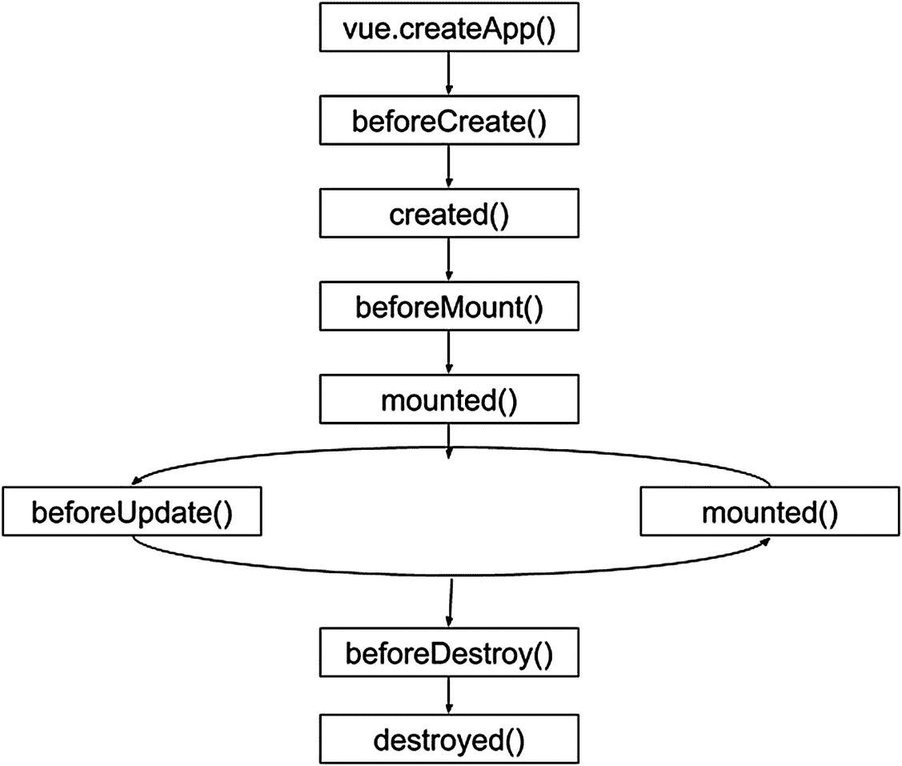

# 九、使用 Vue.js

Vue.js 是一个开源的、渐进式的 JavaScript 框架，用于构建用户界面，旨在以增量方式采用。Vue.js 的核心库只关注视图层，很容易获取并与其他库或现有项目集成。

您将学会利用它的特性来构建快速、高性能的 web 应用。贯穿本章，我们要开发一个 app，你会学到一些关键概念，了解如何集成 Web 组件和 Vue.js。

## Vue.js 有哪些主要特点？

Vue.js 拥有构建单页面应用的框架应该拥有的所有特性。一些功能比其他功能突出，如下所示:

*   *虚拟 DOM* :虚拟 DOM 是原始 HTML DOM 的轻量级内存树表示，可以在不影响原始 DOM 的情况下进行更新。

*   *组件*:用于在 Vue.js 应用中创建可重用的定制元素。

*   *Templates* : Vue.js 提供了基于 HTML 的模板，将 DOM 与 Vue 实例数据绑定在一起。

*   *路由*:页面之间的导航通过`vue-router`实现。

*   *轻量级* : Vue.js 相对于其他框架是一个轻量级的库。

## Vue.js 中有哪些组件？

组件是可重用的元素，我们用它来定义它们的名字和行为。要理解这个概念，请看图 [9-1](#Fig1) 。


图 9-1

web 应用中的组件

您可以在图 [9-1](#Fig1) 中看到，我们有六个不同级别的组件。组件 1 是组件 2 和组件 3 的父级，也是组件 4、组件 5 和组件 6 的祖父级。因此，我们可以制作一个层次树来表达这种关系(图 [9-2](#Fig2) )。


图 9-2

组件层次结构

现在，认为每个组件都可以是我们想要的——列表、图像、按钮、文本或我们定义的任何东西。清单 [9-1](#PC1) 显示了定义简单 Vue 组件的基本方法。

```jsx
const app = createApp({...})
app.component('my-button', {
  data: function () {
    return {
      counter: 0
    }
  },
  template: '<button v-on:click="counter++">Clicks {{ counter }}.</button>'
})}

Listing 9-1Declaring a Vue’s Component

```

我们可以将它作为新的 HTML 标签添加到我们的应用中，如清单 [9-2](#PC2) 所示。

```jsx
<div id="app">
  <my-button></my-button>
</div>

Listing 9-2Using a Vue’s Component

```

## Vue 组件中的生命周期挂钩有哪些？

组件被创建和销毁。总的来说，这些过程被称为一个生命周期，我们可以使用一些方法在该周期的特定时刻运行功能。考虑出现在清单 [9-3](#PC3) 中的组件。

```jsx
<script>
export default {
  name: 'HelloWorld',
  created: function () {
    console.log('Component created.');
  },
  mounted: function() {
    fetch('https://randomuser.me/api/?results=1')
    .then(
      (response) => {
        return response.json();
      }
    )
    .then(
      (reponseObject) => {
        this.email = reponseObject.results[0].email;
      }
    );
    console.log('Component is mounted.');
  },
  props: {
    msg: String,
    email:String
  }
}
</script>

Listing 9-3Using Life Cycle Hooks in a Vue Component

```

这里，我们用方法`created()`和`mounted()`添加了一个 email 属性。这些方法被称为*生命周期挂钩*。我们将使用这些来在组件中的特定时刻执行操作，例如，当我们的组件被挂载时调用一个 API，并在那时收到电子邮件。

生命周期挂钩是任何重要 Vue 组件的重要组成部分(见图 [9-3](#Fig3) )。



图 9-3

Vue 组件的生命周期

### 创建前

`beforeCreate`钩子在组件初始化的早期运行。你可以使用清单 [9-4](#PC4) 中的方法。

```jsx
Vue.createApp({
  beforeCreate: function () {
    console.log('Initialization is happening');
})

Listing 9-4Using beforeCreate in a Vue Component

```

### 创造

当你的组件被初始化时,`created`钩子运行。您将能够访问 React 数据，并且事件是活动的。你可以使用清单 [9-5](#PC5) 中的方法。

```jsx
Vue.createApp({
  created: function () {
    console.log('The Component is created');
})

Listing 9-5Using created in a Vue Component

```

### 即将挂载

`beforeMount`钩子在初始渲染发生之前和模板或渲染函数被编译之后运行。你可以使用清单 [9-6](#PC6) 中的方法。

```jsx
Vue.createApp({
  beforeMount: function () {
    console.log('The component is going to be Mounted');
  }
})

Listing 9-6Using beforeMount in a Vue Component

```

### 安装好的

`mounted`钩子提供了对 React 组件、模板和呈现的 DOM ( `via. this.$el`)的完全访问。你可以使用清单 [9-7](#PC7) 中的方法。

```jsx
Vue.createApp({
  mounted: function () {
    console.log('The component is mounted');
  }
})

Listing 9-7Using mounted in a Vue Component

```

### 更新前

`beforeUpdate`钩子在组件上的数据改变之后运行，更新周期开始，就在 DOM 被修补和重新呈现之前。你可以使用清单 [9-8](#PC8) 中的方法。

```jsx
Vue.createApp({
  beforeUpdate: function () {
    console.log('The component is going to be updated');
  }
})

Listing 9-8Using beforeUpdate in a Vue Component

```

### 更新

在组件上的数据改变和 DOM 重新呈现之后,`updated`钩子运行。你可以使用清单 [9-9](#PC9) 中的方法。

```jsx
Vue.createApp({
  updated: function () {
    console.log('The component is updated');
  }
})

Listing 9-9Using updated in a Vue Component

```

### 销毁前

就在组件被销毁之前调用了`beforeDestroy`钩子。您的组件仍将完全存在并正常工作。你可以使用清单 [9-10](#PC10) 中的方法。

```jsx
Vue.createApp({
  beforeDestroy: function () {
    console.log('The component is going to be destroyed');
  }
})

Listing 9-10Using beforeDestroy in a Vue Component

```

### 破坏

当连接到钩子上的所有东西都被销毁时，这个钩子就会被调用。您可以使用`destroyed`钩子来执行最后的清理。你可以使用清单 [9-11](#PC11) 中的方法。

```jsx
Vue.createApp({
  destroyed: function () {
    console.log('The component is destroyed');
  }
})

Listing 9-11Using destroyed in a Vue Component

```

## Vue 组件之间的通信

组件之间通常必须共享信息。对于这些基本场景，我们可以使用 props 或 ref 属性，如果你想把数据传递给子组件；发射器，如果你要把数据传递给一个父组件；以及双向数据绑定，使子节点和父节点之间的数据同步(参见图 [9-4](#Fig4) )。


图 9-4

父组件和子组件之间的通信

如图 [9-4](#Fig4) 所示，如果你想要一个父组件与子组件通信，你可以使用 props 或者 ref 属性。

### 什么是属性？

属性是可以在组件上注册的自定义属性。当一个值被传递给一个适当属性时，它就成为组件实例的一个属性。你可以在清单 [9-12](#PC12) 中看到基本结构。

```jsx
const app = createApp({...})
app.component('some-item', {
  props: ['somevalue'],
  template: '<div>{{ somevalue }}</div>'
})

Listing 9-12Declaring Props in a Vue Component

```

现在您可以像清单 [9-13](#PC13) 中那样传递值。

```jsx
<some-item somevalue="value for prop"></some-item>

Listing 9-13Using Props in a Vue Component

```

### 什么是 Ref 属性？

ref 属性用于注册对元素或子组件的引用。该引用将注册在父组件的`$refs`对象下。 <sup>[1](#Fn1)</sup> 基本结构见清单 [9-14](#PC14) 。

```jsx
<input type="text" ref="email">

<script>
    const input = this.$refs.email;
</script>

Listing 9-14Using a Ref in a Vue Component

```

### 发出事件

如果想和有家长的孩子沟通，可以用`$emit()`，这是推荐的传递信息的方法。调用 prop 函数是传递信息的另一种方法(图 [9-5](#Fig5) )，但这是一种不好的做法，因为当你的项目在增长时，这可能会令人困惑，这也是我跳过这一点的原因。


图 9-5

与具有父组件的子组件通信

在 Vue 中，可以使用`$emit`方法将数据发送给父组件。在清单 [9-15](#PC15) 中，您可以看到发出事件的基本结构。

```jsx
const app = createApp({...})
app.component('child-custom-component', {
  data: function () {
    return {
      customValue: 0
    }
  },
  methods: {
    giveValue: function () {
      this.$emit('give-value', this.customValue++)
    }
  },
  template: `
    <button v-on:click="giveValue">
      Click me for value
    </button>
  `
})

Listing 9-15Using a Ref in a Vue Component

```

### 使用双向数据绑定

促进组件间通信的一个简单方法是使用双向数据绑定。在下面的场景中，Vue.js 为我们进行组件之间的通信(图 [9-6](#Fig6) )。


图 9-6

组件之间的双向通信

双向数据绑定意味着 Vue.js 为你同步数据属性和 DOM。对数据属性的更改会更新 DOM，对 DOM 的修改会更新数据属性。因此，数据是双向流动的。在清单 [9-16](#PC16) 中，您可以看到使用双向数据绑定的基本结构。

```jsx
const app = Vue.createApp({})
app.component('my-component', {
  props: {
    myProp: String
  },
  template: `
    <input
      type="text"
      :value="myProp"
      @input="$emit('update: myProp, $event.target.value)">
  `
})
<my-component v-model:myProp="Some Value"></my-component>

Listing 9-16Using v-model in a Vue Component

```

### 材料网组件

在第八章中，我们使用 VanillaJS 和 Polymer 构建了一些 web 组件。这是学习这些技术基础的一个极好的方法。尽管如此，对于我们的 VueNoteApp，我们将使用一个更健壮的 Web 组件目录，由 Google 维护，它实现了材料设计并使用`LitElement`构建。你可以在 [`https://github.com/material-components/material-components-web-components`](https://github.com/material-components/material-components-web-components) 找到这些组件。

使用这些组件有助于我们提高生产率，因为我们有正确的材料设计指南，并提高质量，因为它们经过更多测试，在我们的用户界面中有更多使用选项。

## 建筑 VueNoteApp

本节我们要搭建一个完整的笔记 App，如图 [9-7](#Fig7) 所示，用 Vue，采用材质设计。


图 9-7

vuemoteapp 设计

### 创建新的 Vue 项目

首先，我们将使用 Vue CLI 在 Vue 3 中创建新项目。确保您使用的是最新版本的 Vue CLI，并运行以下命令:

```jsx
$npm update -g @vue/cli

```

要创建项目，请在终端中运行以下命令:

```jsx
$vue create note-app

```

选择 Vue 3，如图 [9-8](#Fig8) 所示。


图 9-8

CLI 视图中的 pick vue 3

安装完所有依赖项后，转到文件夹项目。

```jsx
$cd note-app

```

### 添加材料 Web 组件

首先，我们将安装应用中要使用的 web 组件。

安装`mwc-button`(图 [9-9](#Fig9) )。


图 9-9

`mwc-button`组件

然后在您的终端中运行以下命令:

```jsx
$npm install –-save @material/mwc-button

```

在 [`https://github.com/material-components/material-components-web-components/tree/master/packages/button`](https://github.com/material-components/material-components-web-components/tree/master/packages/button) 可以看到它的所有属性。

安装`mwc-dialog`(图 [9-10](#Fig10) )。


图 9-10

`mwc-dialog`组件

然后在您的终端中运行以下命令:

```jsx
$npm install –-save @material/mwc-dialog

```

在 [`https://github.com/material-components/material-components-web-components/tree/master/packages/dialog`](https://github.com/material-components/material-components-web-components/tree/master/packages/dialog) 可以看到它的所有属性。

安装`mwc-fab`(图 [9-11](#Fig11) )。


图 9-11

`mwc-fab`组件

然后在您的终端中运行以下命令:

```jsx
$npm install –-save @material/mwc-fab

```

在 [`https://github.com/material-components/material-components-web-components/tree/master/packages/fab`](https://github.com/material-components/material-components-web-components/tree/master/packages/fab) 可以看到它的所有属性。

安装`mwc-icon-button`(图 [9-12](#Fig12) )。


图 9-12

`mwc-icon-button`组件

然后在您的终端中运行以下命令:

```jsx
$npm install –-save @material/mwc-icon-button

```

在 [`https://github.com/material-components/material-components-web-components/tree/master/packages/icon-button`](https://github.com/material-components/material-components-web-components/tree/master/packages/icon-button) 可以看到它的所有属性。

安装`mwc-list`(图 [9-13](#Fig13) )。


图 9-13

`mwc-list`组件

然后在您的终端中运行以下命令:

```jsx
$npm install –-save @material/mwc-list

```

你可以在 [`https://github.com/material-components/material-components-web-components/tree/master/packages/list`](https://github.com/material-components/material-components-web-components/tree/master/packages/list) 中看到它的所有属性。

安装`mwc-textfield`(图 [9-14](#Fig14) )。


图 9-14

`mwc-textfield`组件

然后在您的终端中运行以下命令:

```jsx
$npm install –-save @material/mwc-textfield

```

在 [`https://github.com/material-components/material-components-web-components/tree/master/packages/textfield`](https://github.com/material-components/material-components-web-components/tree/master/packages/textfield) 可以看到它的所有属性。

安装`mwc-` `top-app-bar`(图 [9-15](#Fig15) )。


图 9-15

`mwc-top-app-bar`组件

然后在您的终端中运行以下命令:

```jsx
$npm install –-save @material/mwc-top-app-bar

```

在 [`https://github.com/material-components/material-components-web-components/tree/master/packages/top-app-bar`](https://github.com/material-components/material-components-web-components/tree/master/packages/top-app-bar) 可以看到它的所有属性。

现在我们将安装 Polyfills 来支持旧的 web 浏览器。

安装以下依赖项:

```jsx
$npm install --save-dev copy-webpack-plugin @webcomponents/webcomponentsjs

```

将`copy-webpack-plugin`添加到 Vue 的 Webpack 配置文件中。为此，我们必须创建一个新文件`vue.config.js`，并添加清单 [9-17](#PC28) 中的代码。

```jsx
const CopyWebpackPlugin = require('copy-webpack-plugin');

module.exports = {
  configureWebpack: {
    plugins: [
      new CopyWebpackPlugin({
        patterns: [{
          context: 'node_modules/@webcomponents/webcomponentsjs',
          from: '**/*.js',
          to: 'webcomponents'
        }]
      })
    ]
  }
};

Listing 9-17Using copy-webpack-plugin with webcomponentsjs

```

`copy-webpack-plugin`现在会在构建时将所有需要的 JS 文件复制到 webcomponents 目录中。

现在，在`public/index.html`中，我们将添加一些行来检查 web 浏览器是否支持`customElements`或使用 Polyfills(参见清单 [9-18](#PC29) )。

```jsx
<!DOCTYPE html>
<html lang="en">
  <head>
...
    <script src="webcomponents/webcomponents-loader.js"></script>
    <script>
      if (!window.customElements) { document.write('<!--'); }
    </script>
    <script src="webcomponents/custom-elements-es5-adapter.js"></script>
    <!-- ! DO NOT REMOVE THIS COMMENT -->

...
  </body>
</html>

Listing 9-18Adding webcomponentjs in VueNoteApp

```

在`components/HelloWorld.vue`中，我们将添加`mwc-button`(见清单 [9-19](#PC30) )。

```jsx
<template>
  <div class="hello">
    <h1>{{ msg }}</h1>
    <p>
      For a guide and recipes on how to configure / customize this project,<br>
      check out the
      <a href="https://cli.vuejs.org" target="_blank" rel="noopener">vue-cli documentation</a>.
    </p>
    <h3>Installed CLI Plugins</h3>
    <ul>
      <li><a href="https://github.com/vuejs/vue-cli/tree/dev/packages/%40vue/cli-plugin-babel" target="_blank" rel="noopener">babel</a></li>
      <li><a href="https://github.com/vuejs/vue-cli/tree/dev/packages/%40vue/cli-plugin-eslint" target="_blank" rel="noopener">eslint</a></li>
    </ul>
    <h3>Essential Links</h3>
    <ul>
      <li><a href="https://vuejs.org" target="_blank" rel="noopener">Core Docs</a></li>
      <li><a href="https://forum.vuejs.org" target="_blank" rel="noopener">Forum</a></li>
      <li><a href="https://chat.vuejs.org" target="_blank" rel="noopener">Community Chat</a></li>
      <li><a href="https://twitter.com/vuejs" target="_blank" rel="noopener">Twitter</a></li>
      <li><a href="https://news.vuejs.org" target="_blank" rel="noopener">News</a></li>
    </ul>
    <h3>Ecosystem</h3>
    <ul>
      <li><a href="https://router.vuejs.org" target="_blank" rel="noopener">vue-router</a></li>
      <li><a href="https://vuex.vuejs.org" target="_blank" rel="noopener">vuex</a></li>
      <li><a href="https://github.com/vuejs/vue-devtools#vue-devtools" target="_blank" rel="noopener">vue-devtools</a></li>
      <li><a href="https://vue-loader.vuejs.org" target="_blank" rel="noopener">vue-loader</a></li>
      <li><a href="https://github.com/vuejs/awesome-vue" target="_blank" rel="noopener">awesome-vue</a></li>
    </ul>
    <mwc-button id="myButton" label="Click Me!" @click="handleClick" raised></mwc-button>
  </div>
</template>

<script>
import '@material/mwc-button';

export default {
  name: 'HelloWorld',
  props: {
    msg: String
  },
  methods: {
    handleClick() {
      console.log('click');
    }
  },
}
</script>

<!-- Add "scoped" attribute to limit CSS to this component only -->
<style scoped>
h3 {
  margin: 40px 0 0;
}
ul {
  list-style-type: none;
  padding: 0;
}
li {
  display: inline-block;
  margin: 0 10px;
}
a {
  color: #42b983;
}
</style>

Listing 9-19Using mwc-button in HelloWorld.vue

```

要进行测试，请运行以下命令:

```jsx
$npm run serve

```

您应该在 VueNoteApp 中看到该组件，如图 [9-16](#Fig16) 所示。


图 9-16

在`HelloWorld.vue`中增加`mwc-button`

您可以在`$git checkout v1.0.1`从 GitHub 资源库访问该网站。

### 添加标题

我们将添加`mwc-top-app-bar`并创建一些空组件，以更好的结构组织我们的文件。我们必须修改`Apps.vue`并在这里添加`mwc-top-app-bar`组件，如清单 [9-20](#PC32) 所示。

```jsx
<!-- eslint-disable vue/no-deprecated-slot-attribute -->
<template>
  <mwc-top-app-bar centerTitle>
    <mwc-icon-button icon="menu" slot="navigationIcon"></mwc-icon-button>
    <div slot="title">VueNoteApp</div>
    <mwc-icon-button icon="help" slot="actionItems"></mwc-icon-button>
    <div><!-- content --></div>
  </mwc-top-app-bar>
</template>

<script>
import '@material/mwc-top-app-bar';
import '@material/mwc-icon-button';

export default {
  name: 'App',
}
</script>

Listing 9-20Using mwc-button in HelloWorld.vue

```

此时，可以使用`$npm run serve`。结果将看起来如图 9-17 所示。


图 9-17

添加`mwc-top-app-bar`

此外，我们将创建两个空组件，views/Dashboard.vue(参见清单 [9-21](#PC33) )和 views/About.vue(参见清单 [9-22](#PC34) )，以允许我们的应用拥有不同的视图。

```jsx
<template>
  <div class="about">
    <h1>This is an about page</h1>
  </div>
</template>

Listing 9-22About.vue

```

```jsx
<template>
  <div>
    Dashboard
  </div>
</template>
<script>
export default {
  name: 'Dashboard'
}
</script>
<style>

</style>

Listing 9-21Dashboard.vue

```

您可以从位于`$git checkout v1.0.2`的 GitHub 库访问这段代码。

### 添加 Vue 路由

Vue Router 是一个用于单页面应用的官方路由插件，设计用于 Vue.js 框架内。路由是在单页应用中从一个视图跳到另一个视图的一种方式，无需刷新 web 浏览器。在 VueNoteApp 中集成 Vue 路由很容易。

安装插件。

```jsx
$ vue add router

```

在`main.js`中增加`VueRouter`，如清单 [9-23](#PC36) 所示。

```jsx
import { createApp } from 'vue'
import App from './App.vue'
import router from './router'

createApp(App).use(router).mount('#app')

Listing 9-23Adding Router in main.js

```

编辑`router/index.js`文件，为`Dashboard`和`About`添加路由，如清单 [9-24](#PC37) 所示。

```jsx
import { createRouter, createWebHistory } from 'vue-router'
import Dashboard from '../views/Dashboard.vue'
const routes = [
  {
    path: '/',
    name: 'Dashboard',
    component: Dashboard
  },
  {
    path: '/about',
    name: 'About',
    component: () => import(/* webpackChunkName: "about" */ '../views/About.vue')
  }
]
const router = createRouter({
  history: createWebHistory(process.env.BASE_URL),
  routes
})

export default router

Listing 9-24Adding Router in router/index.js

```

如果你看一下`/about`路线，我们使用`import()`来装载组件。这是因为我们在用户使用视图时加载组件，而不是在启动应用时加载所有内容。这被称为延迟加载，它对性能有好处。现在我们必须在`App.vue`中添加一些东西。占位符`<router-view>`是组件将要被装载的地方，这取决于路线，`<router-link>`是在模板中改变路线的一种方式(参见清单 [9-25](#PC38) )。

```jsx
<!-- eslint-disable vue/no-deprecated-slot-attribute -->
<template>
  <mwc-top-app-bar centerTitle>
    <div slot="title"><router-link to="/">VueNoteApp</router-link></div>
    <div slot="actionItems"><router-link to="/About">About</router-link></div>
    <div><router-view/></div>
  </mwc-top-app-bar>
</template>

<script>
import '@material/mwc-top-app-bar';
import '@material/mwc-icon-button';

export default {
  name: 'App',
  methods: {
    handleAbout() {
      this.$router.push('About');
    }
  },
}
</script>

<style>
  a, a:visited {
    color:white;
    text-decoration:none;
    padding: 5px;
  }
</style>

Listing 9-25Adding Routes in App.vue

```

经过这些小小的改动，您应该会看到带有路线的标题，您可以通过点击链接来更改这些路线，如图 [9-18](#Fig18) 所示。


图 9-18

添加路线

您可以从位于`$git checkout v1.0.3`的 GitHub 库访问代码。

现在我们要给`views/Dashboard.vue`添加一些元素(见清单 [9-26](#PC39) )。

```jsx
<!-- eslint-disable vue/no-deprecated-slot-attribute -->
<template>
  <div>
    <mwc-list multi>
      <mwc-list-item twoline>
        <span>Item 0</span>
        <span slot="secondary">Secondary line</span>
      </mwc-list-item>
      <li divider padded role="separator"></li>
      <mwc-list-item twoline>
        <span>Item 1</span>
        <span slot="secondary">Secondary line</span>
      </mwc-list-item>
      <li divider padded role="separator"></li>
      <mwc-list-item twoline>
        <span>Item 2</span>
        <span slot="secondary">Secondary line</span>
      </mwc-list-item>
      <li divider padded role="separator"></li>
      <mwc-list-item twoline>
        <span>Item 3</span>
        <span slot="secondary">Secondary line</span>
      </mwc-list-item>
    </mwc-list>
    <mwc-fab class="floatButton" mini icon="add"></mwc-fab>
  </div>
</template>
<script>
import '@material/mwc-list/mwc-list';
import '@material/mwc-list/mwc-list-item';
import '@material/mwc-fab';

export default {
  name: 'Dashboard'
}
</script>
<style scoped>
.floatButton {
  position: fixed;
  bottom: 20px;
  right: 20px;
}
</style>

Listing 9-26Adding Web Components in Dashboard.vue

```

我们添加了`mwc-list-items`来显示注释，并添加了一个`mwc-fab`来拥有一个浮动按钮，我们将使用它来添加新的注释。

我们还添加了`views/About.vue`，如清单 [9-27](#PC40) 所示。

```jsx
<template>
  <div class="about">
    <h1>Building Native Web Components</h1>
    <h2><i>Front-End Development with Polymer and Vue.js</i></h2>
    <p>
    Start developing single-page applications (SPAs) with modern architecture. This book shows you how to create, design, and publish native web components, ultimately allowing you to piece together those elements in a modern JavaScript framework.<br/><br/>

    Building Native Web Components dives right in and gets you started building your first web component. You'll be introduced to native web component design systems and frameworks, discuss component-driven development and understand its importance in large-scale companies.
    You'll then move on to building web components using templates and APIs, and custom event lifecycles. Techniques and best practices for moving data, customizing, and distributing components are also covered. Throughout, you'll develop a foundation to start using Polymer, Vue.js, and Firebase in your day-to-day work.<br/><br/>

    Confidently apply modern patterns and develop workflows to build agnostic software pieces that can be reused in SPAs. Building Native Web Components is your guide to developing small and autonomous web components that are focused, independent, reusable, testable, and works with all JavaScript frameworks, modern browsers, and libraries.
    </p>
  </div>
</template>
<style scoped>
.about {
  background-color: white;
  text-justify:auto;
  padding: 30px;
}
</style>

Listing 9-27Adding Routes in About.vue

```

我们正在添加一些关于这本书的信息，在图 [9-19](#Fig19) 中，你可以看到外观上的改进，这更符合我们的目标。


图 9-19

在`Dashboard.vue`中添加 Web 组件

您可以从位于`$git checkout v1.0.4.`的 GitHub 库访问代码

### 删除注释

有了`mwc-list`和`mws-list-item`，我们可以在`Dashboard.vue`中以更令人愉快的方式看到我们的注释，但是我们的注释在代码中是静态的。这就是为什么我们要在`utils/DummyData.js`中创建一个模块，如清单 [9-28](#PC41) 所示。

```jsx
export const notesData = [
  {id: 1, title: "Note 1", description: "Loren Ipsum"},
  {id: 2, title: "Note 2", description: "Loren Ipsum"},
  {id: 3, title: "Note 3", description: "Loren Ipsum"},
  {id: 4, title: "Note 4", description: "Loren Ipsum"},
  {id: 5, title: "Note 5", description: "Loren Ipsum"},
  {id: 6, title: "Note 6", description: "Loren Ipsum"},
  {id: 7, title: "Note 7", description: "Loren Ipsum"}
];

Listing 9-28DummyData module

```

这个模块只是一个简单的数组，带有一些我们可以在`Dashboard.vue`中导入的注释，但是它很方便，因为现在我们可以动态地加载这些数据，如清单 [9-29](#PC42) 所示。将来，我们可以很容易地为 API 或 Firebase 替换它。

```jsx
<!-- eslint-disable vue/no-deprecated-slot-attribute -->
<template>
  <div>
    <mwc-list v-for="(note) in notes" :key="note.id" multi>
      <mwc-list-item twoline hasMeta>
        <span>{{note.title}}</span>
        <span slot="meta" class="material-icons">delete</span>
        <span slot="secondary">{{note.description}}</span>
      </mwc-list-item>
      <li divider padded role="separator"></li>
    </mwc-list>
    <mwc-fab class="floatButton" mini icon="add"></mwc-fab>
  </div>
</template>
<script>
import '@material/mwc-list/mwc-list';
import '@material/mwc-list/mwc-list-item';
import '@material/mwc-fab';
import '@material/mwc-button';
import { notesData } from '../utils/DummyData';

export default {
  name: 'Dashboard',
  data() {
    return {
      notes: notesData
    }
  }
}
</script>
<style scoped>
  .floatButton {
    position: fixed;
    bottom: 20px;
    right: 20px;
  }
</style>

Listing 9-29DummyData module

```

现在，在`Dashboard.vue`中，我们在属性注释中导入`notesData`，在模板中，我们使用`directive v-for`迭代所有注释，并为每个注释创建一个`mwc-list-item`，如图 [9-20](#Fig20) 所示。


图 9-20

在`Dashboard.vue`中增加`notesData`

用户在插入新便笺时可能会出错。这就是为什么我们必须允许他们删除笔记。为此，我们必须修改数组并移除元素。JavaScript 有一个方法可以帮助我们做到这一点:`Splice`。`Splice`方法允许我们改变数组中的内容。

我们将创建`handleDelete(id)`方法并将其添加到 Delete 按钮，我们将向其传递我们想要删除的项目索引。使用`Splice`，我们可以从数组中移除内容，如清单 [9-30](#PC43) 所示。

```jsx
<!-- eslint-disable vue/no-deprecated-slot-attribute -->
<template>
  <div>
    <mwc-list v-for="(note) in notes" :key="note.id" multi>
      <mwc-list-item twoline hasMeta>
        <span>{{note.title}}</span>
        <span slot="meta" class="material-icons" @click="handleDelete(note.id)">delete</span>
        <span slot="secondary">{{note.description}}</span>
      </mwc-list-item>
      <li divider padded role="separator"></li>
    </mwc-list>
    <mwc-fab class="floatButton" mini icon="add"></mwc-fab>
  </div>
</template>
<script>
import '@material/mwc-list/mwc-list';
import '@material/mwc-list/mwc-list-item';
import '@material/mwc-fab';
import '@material/mwc-button';
import { notesData } from '../utils/DummyData';

export default {
  name: 'Dashboard',
  data() {
    return {
      notes: notesData
    }
  },
  methods: {
    handleDelete(id) {
      const noteToDelete = this.notes.findIndex((item) => (item.id === id));
      this.notes.splice(noteToDelete, 1);
    }
  },
}
</script>
<style scoped>
  .floatButton {
    position: fixed;
    bottom: 20px;
    right: 20px;
  }
</style>

Listing 9-30DummyData Module

```

您可以从位于`$git checkout v1.0.5`的 GitHub 库访问相关代码。

### 添加新注释

在这一点上，我们可以动态地加载我们的笔记，并且我们可以从我们的列表中删除笔记。现在我们将添加一个添加新注释的机制，使用我们之前在右下角添加的`fab`按钮。为了实现这一点，我们将使用`mwc-dialog`，显示一个用户可以添加新注释或取消并返回注释列表的模态(见图 [9-21](#Fig21) )。


图 9-21

`Dashboard.vue`中的`mwc-dialog`

此外，我们将添加库`uuid`。有了这个库，我们可以为新的笔记生成新的惟一 id。运行以下命令:

```jsx
$npm install –save uuid

```

在模板中，我们将添加`mwc-dialog`，如清单 [9-31](#PC45) 所示。

```jsx
<!-- eslint-disable vue/no-deprecated-slot-attribute -->
<template>
  <div>
    <mwc-list v-for="(note) in notes" :key="note.id" multi>
      <mwc-list-item twoline hasMeta>
        <span>{{note.title}}</span>
        <span slot="meta" class="material-icons" @click="handleDelete(note.id)">delete</span>
        <span slot="secondary">{{note.description}}</span>
      </mwc-list-item>
      <li divider padded role="separator"></li>
    </mwc-list>
    <mwc-fab class="floatButton" @click="handleAdd" mini icon="add"></mwc-fab>
    <mwc-dialog id="dialog" heading="Add Note">
      <div class="formFields">
        <mwc-textfield
          id="text-title"
          outlined
          minlength="3"
          label="Title"
          required>
        </mwc-textfield>
      </div>
      <div class="formFields">
      <mwc-textfield
        id="text-description"
        outlined
        minlength="3"
        label="Description"
        required>
      </mwc-textfield>
      </div>
      <div>
      <mwc-button
        id="primary-action-button"
        slot="primaryAction"
        @click="handleAddNote">
        Add
      </mwc-button>
      <mwc-button
        slot="secondaryAction"
        dialogAction="close"
        @click="handleClose">
        Cancel
      </mwc-button>
      </div>
    </mwc-dialog>
  </div>
</template>

Listing 9-31Adding mwc-dialog

```

这里，我们在`mwc-dialog`中添加了一个表单，它使用`mwc-textfield`和`mwc-button`组件来允许新笔记进入并触发`handleAddNote`方法或`handleClose`方法来处理用户选择的内容。接下来，我们将在`Dashboard.vue`中添加这个逻辑，如清单 [9-32](#PC46) 所示。

```jsx
<!-- eslint-disable vue/no-deprecated-slot-attribute -->
<template>
  <div>
    <mwc-list v-for="(note) in notes" :key="note.id" multi>
      <mwc-list-item twoline hasMeta>
        <span>{{note.title}}</span>
        <span slot="meta" class="material-icons" @click="handleDelete(note.id)">delete</span>
        <span slot="secondary">{{note.description}}</span>
      </mwc-list-item>
      <li divider padded role="separator"></li>
    </mwc-list>
    <mwc-fab class="floatButton" @click="handleAdd" mini icon="add"></mwc-fab>
    <mwc-dialog id="dialog" heading="Add Note">
      <div class="formFields">
        <mwc-textfield
          id="text-title"
          outlined
          minlength="3"
          label="Title"
          required>
        </mwc-textfield>
      </div>
      <div class="formFields">
      <mwc-textfield
        id="text-description"
        outlined
        minlength="3"
        label="Description"
        required>
      </mwc-textfield>
      </div>
      <div>
      <mwc-button
        id="primary-action-button"
        slot="primaryAction"
        @click="handleAddNote">
        Add
      </mwc-button>
      <mwc-button
        slot="secondaryAction"
        dialogAction="close"
        @click="handleClose">
        Cancel
      </mwc-button>
      </div>
    </mwc-dialog>
  </div>
</template>
<script>
import '@material/mwc-list/mwc-list';
import '@material/mwc-list/mwc-list-item';
import '@material/mwc-fab';
import '@material/mwc-button';
import '@material/mwc-dialog';
import '@material/mwc-textfield';
import { notesData } from '../utils/DummyData';
import { v4 as uuidv4 } from 'uuid';

export default {
  name: 'Dashboard',
  data() {
    return {
      notes: notesData
    }
  },
  methods: {
    handleDelete(id) {
      const noteToDelete = this.notes.findIndex((item) => (item.id === id));
      this.notes.splice(noteToDelete, 1);
    },
    handleAdd() {
      const formDialog = this.$el.querySelector('#dialog');
      formDialog.show();
    },
    handleAddNote() {
      const formDialog = this.$el.querySelector('#dialog');
      let txtTitle = this.$el.querySelector('#text-title');
      let txtDescription = this.$el.querySelector('#text-description');
      const isValid = txtTitle.checkValidity() && txtDescription.checkValidity();

      if(isValid) {
        const newIndex = uuidv4();
        this.notes.push({id: newIndex, title: txtTitle.value, description: txtDescription.value});

        txtTitle.value ='';
        txtDescription.value = '';
        formDialog.close();
      }
    },
    handleClose() {
      let txtTitle = this.$el.querySelector('#text-title');
      let txtDescription = this.$el.querySelector('#text-description');
      const formDialog = this.$el.querySelector('#dialog');

      txtTitle.value ='';
      txtDescription.value = '';
      formDialog.close();
    }
  },
}
</script>
<style scoped>
  .floatButton {
    position: fixed;
    bottom: 20px;
    right: 20px;
  }

  .formFields {
    margin: 15px;
  }
</style>

Listing 9-32Adding mwc-dialog

```

这里，我们使用`this.$el.querySelector()`来选择 web 组件，并使用它们的方法来执行逻辑，例如`formDialog.show()`和`formDialog.close()`，以显示和隐藏`mwc-dialog`。此外，在`handleAddNote()`中，我们使用`uuidv4()`方法为用户在表单中输入的数据生成一个新的索引，并使用`this.notes.push()`在本地数组中添加新的笔记，我们使用该数组保存所有笔记。通过这些修改，您可以添加注释(参见图 [9-22](#Fig22) )。


图 9-22

添加新注释

您可以从位于`$git checkout v1.0.6`的 GitHub 库访问相关代码。

Challenge Exercise

在我们的应用中添加一个操作按钮和功能来编辑注释。

*   新增一个按钮，编辑，类似于删除。

*   当用户点击编辑时，应用将打开一个类似于新笔记的对话窗口，但选择了笔记中的信息。

*   用户可以进行更改并再次保存数据，注释应该会更新。

### 添加 Firebase

如果您尝试重新加载应用，您会发现我们丢失了所有笔记。我们需要一个外部持久性系统来保存我们的数据，并在我们所有的客户端之间进行同步。

Firebase 数据库为我们提供了一个完美的解决方案，可以为我们的所有客户实时保持数据同步，我们可以使用 Firebase 的 JavaScript 软件开发工具包(SDK)轻松保存数据。

要开始，请转到`firebase.google.com`并使用您的 Google 帐户登录。

接下来，进入控制台(图 [9-23](#Fig23) )。


图 9-23

Firebase 主控台连结

创建一个新项目(图 [9-24](#Fig24) )。


图 9-24

添加项目按钮

接下来，您将选择项目的名称(图 [9-25](#Fig25) )。


图 9-25

在 Firebase 中创建新项目

选择您是否希望在您的项目中使用 Google Analytics 集成(图 [9-26](#Fig26) )。


图 9-26

向新的 Firebase 项目添加 Google Analytics

只需几分钟，您就可以开始使用您的新项目。

当您的项目在 Firebase 控制台中准备就绪时，您将需要一些信息来连接我们的应用和 Firebase。

为此，请转到项目概述➤项目设置。(参见图 [9-27](#Fig27) 。)


图 9-27

Firebase 项目概述

现在点击网络应用图标(图 [9-28](#Fig28) )。


图 9-28

Firebase 项目设置视图

Firebase 将要启动一个向导(图 [9-29](#Fig29) )。


图 9-29

Firebase web 应用向导

最后你会看到我们的`firebaseConfig`总结(图 [9-30](#Fig30) )。


图 9-30

Firebase 配置摘要

复制这些信息。当我们为项目创建`firebase.js`文件时，您将需要它。

我们需要在控制台中做的最后一件事是创建一个新的数据库，以及在没有身份验证的情况下访问它的安全规则。(我们这样做是为了让我们的应用简单。)

转到数据库(图 [9-31](#Fig31) )。


图 9-31

Firebase 数据库链接

选择创建实时数据库(图 [9-32](#Fig32) )。


图 9-32

Firebase 安全规则

选择测试模式下的开始。在这种模式下，我们可以在没有身份验证的情况下将数据写入数据库。这在开发中很方便，但在生产中不安全。现在我们可以回到我们的应用。

在终端中运行以下命令:

```jsx
$npm install firebase --save

```

创建一个新的`firebase.js`文件并粘贴来自 Firebase 项目的数据，如清单 [9-33](#PC48) 所示。

```jsx
import Firebase from 'firebase';

let config = {
  apiKey: "xxx",
  authDomain: "xxx",
  databaseURL: "xxx",
  projectId: "xxx",
  storageBucket: "xxx",
  messagingSenderId: "xxx",
  appId: "xxx"
};

Firebase.initializeApp(config)

export const fireApp = Firebase;

Listing 9-33Adding Firebase

```

导入`main.js`，如清单 [9-34](#PC49) 所示。

```jsx
import Firebase from 'firebase';

import './firebase';
import { createApp } from 'vue'
import App from './App.vue'
import router from './router'

createApp(App).use(router).mount('#app')...

Listing 9-34Importing Firebase in main.js

```

您可以从位于`$git checkout v1.0.7`的 GitHub 库访问相关代码。

现在，在`Dashboard.vue`中，我们必须使用生命周期`mounted()`方法，并恢复我们实时数据库中的所有笔记。我们还必须更新`saveNote()`和`deleteNote()`，更新 Firebase 中的新注释。

下面，我们从`firebase.js`导入 Fireapp 以在我们的应用中保留一个引用:

```jsx
const db = fireApp.database().ref();

```

现在，使用`db.push`，我们向 Firebase 添加数据，使用`remove()`，我们可以从 Firebase 中删除数据(清单 [9-35](#PC51) )。欲了解更多信息，您可以通过 [`https://firebase.google.com/docs/reference/js/firebase.database`](https://firebase.google.com/docs/reference/js/firebase.database) 访问相关文件。

```jsx
<!-- eslint-disable vue/no-deprecated-slot-attribute -->
<template>
  <div>
    <mwc-list v-for="(note) in notes" :key="note.id" multi>
      <mwc-list-item twoline hasMeta>
        <span>{{note.title}}</span>
        <span slot="meta" class="material-icons" @click="handleDelete(note.id)">delete</span>
        <span slot="secondary">{{note.description}}</span>
      </mwc-list-item>
      <li divider padded role="separator"></li>
    </mwc-list>
    <mwc-fab class="floatButton" @click="handleAdd" mini icon="add"></mwc-fab>
    <mwc-dialog id="dialog" heading="Add Note">
      <div class="formFields">
        <mwc-textfield
          id="text-title"
          outlined
          minlength="3"
          label="Title"
          required>
        </mwc-textfield>
      </div>
      <div class="formFields">
        <mwc-textfield
          id="text-description"
          outlined
          minlength="3"
          label="Description"
          required>
        </mwc-textfield>
      </div>
      <div>
        <mwc-button
          id="primary-action-button"
          slot="primaryAction"
          @click="handleAddNote">
          Add
        </mwc-button>
        <mwc-button
          slot="secondaryAction"
          dialogAction="close"
          @click="handleClose">
          Cancel
        </mwc-button>
      </div>
    </mwc-dialog>
  </div>
</template>
<script>
import '@material/mwc-list/mwc-list';
import '@material/mwc-list/mwc-list-item';
import '@material/mwc-fab';
import '@material/mwc-button';
import '@material/mwc-dialog';
import '@material/mwc-textfield';
import { fireApp } from'../firebase'
import { v4 as uuidv4 } from 'uuid';

const db = fireApp.database().ref();

export default {
  name: 'Dashboard',
  data() {
    return {
      notes: []
    }
  },
  mounted() {
    db.once('value', (notes) => {
      notes.forEach((note) => {
        this.notes.push({
          id: note.child('id').val(),
          title: note.child('title').val(),
          description: note.child('description').val(),
          ref: note.ref
        })
      })
    });
  },
  methods: {
    handleDelete(id) {
      const noteToDelete = this.notes.findIndex((item) => (item.id === id));
      const noteRef = this.notes[noteToDelete].ref;
      if(noteRef) {
        noteRef.remove();
      }
      this.notes.splice(noteToDelete, 1);
    },
    handleAdd() {
      const formDialog = this.$el.querySelector('#dialog');
      formDialog.show();
    },
    handleAddNote() {
      const formDialog = this.$el.querySelector('#dialog');
      let txtTitle = this.$el.querySelector('#text-title');
      let txtDescription = this.$el.querySelector('#text-description');
      const isValid = txtTitle.checkValidity() && txtDescription.checkValidity();

      if(isValid) {
        const newIndex = uuidv4();
        const newItem = {id: newIndex, title: txtTitle.value, description: txtDescription.value};
        this.notes.push(newItem);
        db.push(newItem);

        txtTitle.value ='';
        txtDescription.value = '';
        formDialog.close();
      }
    },
    handleClose() {
      let txtTitle = this.$el.querySelector('#text-title');
      let txtDescription = this.$el.querySelector('#text-description');
      const formDialog = this.$el.querySelector('#dialog');

      txtTitle.value ='';
      txtDescription.value = '';
      formDialog.close();
    }
  },
}
</script>
<style scoped>
  .floatButton {
    position: fixed;
    bottom: 20px;
    right: 20px;
  }

  .formFields {
    margin: 15px;
  }
</style>

Listing 9-35Adding Firebase in Dashboard.vue

```

现在我们可以在 Firebase 中看到我们的数据存储(图 [9-33](#Fig33) )。


图 9-33

Firebase 数据库控制台

当我们刷新时，我们的数据将被保存(图 [9-34](#Fig34) )。


图 9-34

vuemoteapp 在 firebase 中的持久性

您可以从位于`$git checkout chap-9`的 GitHub 库访问相关代码。

## 摘要

在本章中，您学习了以下内容:

*   Vue.js 只关注视图层，很容易获取并与其他库或现有项目集成。

*   组件的创建和销毁过程统称为生命周期。我们可以用一些方法在特定时刻运行函数。这些方法被称为生命周期挂钩。生命周期挂钩是任何严肃组件的重要组成部分。

*   组件之间通常需要共享信息。对于这些基本场景，我们可以使用 props、`ref`属性、发射器和双向数据绑定。

*   Vue Router 是一个用于单页面应用的官方路由插件，设计用于在`Vue.js`框架内使用。路由是在单页应用中从一个视图跳到另一个视图的一种方式。

*   我们可以使用 Firebase 数据库来保持我们的笔记在所有客户端之间同步。

<aside aria-label="Footnotes" class="FootnoteSection" epub:type="footnotes">Footnotes [1](#Fn1_source)

[T2`https://v3.vuejs.org/api/instance-properties.html#refs`](https://v3.vuejs.org/api/instance-properties.html%2523refs)

 </aside>