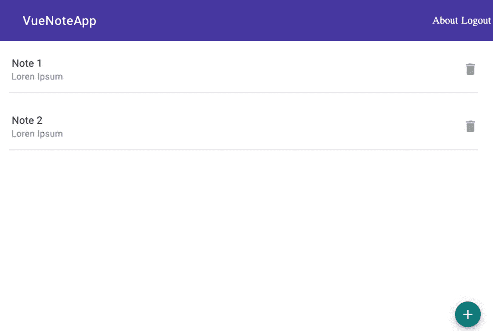

# 十、发布

恭喜你！我们现在有了自己的 web 应用，使用 Vue.js 和 Web 组件，但我们希望与全世界分享我们的应用。Firebase 托管可以帮助我们公开我们的应用，Firebase 身份验证允许我们添加一个身份验证系统，并注册用户和每个用户的相关注释。

## 添加 Firebase 身份验证

通过其软件开发工具包，Firebase Authentication 为我们提供了一种在 JavaScript 应用中添加身份验证的安全方法。但是，我们必须选择我们的应用将支持的登录提供商。你可以选择最流行的，如脸书和谷歌，或将登录集成到一个自定义的认证系统。为了简单起见，我们将只选择电子邮件和密码。

首先，我们将转到 Firebase web 控制台并选择身份验证(参见图 [10-1](#Fig1) )。


图 10-1

Firebase web 控制台中的身份验证链接

在身份验证中(图 [10-2](#Fig2) ，我们将选择登录方式。


图 10-2

Firebase web 控制台中的身份验证部分

现在启用电子邮件/密码(图 [10-3](#Fig3) )。


图 10-3

在 Firebase web 控制台中启用电子邮件/密码身份验证

好了，web 控制台到此为止。

回到我们的代码。我们需要一个表单的新组件，我们可以输入电子邮件和密码，以执行身份验证过程。

创建一个新的`components/Login.vue`文件并添加一个模板，如清单 [10-1](#PC1) 所示。

```jsx
<!-- eslint-disable vue/no-deprecated-slot-attribute -->
<template>
  <div class="formContainer">
    <div class="formLogin">
      <div class="formFields">
        <h1>{{actionText}}</h1>
        <mwc-textfield
            id="text-email"
            outlined
            minlength="3"
            label="Email"
            required>
          </mwc-textfield>
        </div>
        <div class="formFields">
          <mwc-textfield
            id="text-password"
            type="password"
            outlined
            minlength="3"
            label="Password"
            required>
          </mwc-textfield>
        </div>
        <div class="actionButtons">
          <mwc-button
            id="link-action-button"
            class="actionButton"
            slot="primaryAction"
            @click="goToLink">
            {{linkButton}}
          </mwc-button>
        </div>
        <div class="actionButtons">
          <mwc-button
            raised
            id="primary-action-button"
            class="actionButton"
            slot="primaryAction"
            @click="submitAction">
            {{actionButton}}
          </mwc-button>
          <mwc-button
            raised
            slot="secondary-action-button"
            class="actionButton"
            @click="handleClear">
            Clear
          </mwc-button>
        </div>
      </div>
  </div>
</template>
<script>
import '@material/mwc-textfield';
import '@material/mwc-button';
export default {
  name: 'Login',
  data() {
    return {
      actionText: 'Login',
      actionButton: 'Send',
      linkButton: 'Register'
    }
  },
  methods: {
    goToLink () {
      switch(this.linkButton) {
      case 'Login':
        this.actionText= 'Login';
        this.actionButton= 'Send';
        this.linkButton = 'Register';
        break;
      case 'Register':
        this.actionText= 'Register';
        this.actionButton= 'Register';
        this.linkButton = 'Login';
        break;
      }
    },

}
</script>
<style scoped>
  .formContainer {
    display:flex;
  }

  .formLogin {
    margin:auto;
  }

  .formFields {
    margin: 15px;
  }

  .actionButtons {
    text-align:center;
  }

  .actionButton {
    margin: 10px;
  }
</style>

Listing 10-1Adding a Template in Login.vue

```

这样，我们就可以添加一个表单来登录和注册用户。我们对两种操作使用相同的视图，`actionText`、`actionButton`和`linkButton`切换用户在视图中可以看到的文本，如图 [10-4](#Fig4) 所示。


图 10-4

登录组件

下一步是添加认证特性(清单 [10-2](#PC2) )。

```jsx
<!-- eslint-disable vue/no-deprecated-slot-attribute -->
<template>
  <div class="formContainer">
    <div class="formLogin">
      <div class="formFields">
        <h1>{{actionText}}</h1>
        <mwc-textfield
            id="text-email"
            outlined
            minlength="3"
            label="Email"
            required>
          </mwc-textfield>
        </div>
        <div class="formFields">
          <mwc-textfield
            id="text-password"
            type="password"
            outlined
            minlength="3"
            label="Password"
            required>
          </mwc-textfield>
        </div>
        <div class="actionButtons">
          <mwc-button
            id="link-action-button"
            class="actionButton"
            slot="primaryAction"
            @click="goToLink">
            {{linkButton}}
          </mwc-button>
        </div>
        <div class="actionButtons">
          <mwc-button
            raised
            id="primary-action-button"
            class="actionButton"
            slot="primaryAction"
            @click="submitAction">
            {{actionButton}}
          </mwc-button>
          <mwc-button
            raised
            slot="secondary-action-button"
            class="actionButton"
            @click="handleClear">
            Clear
          </mwc-button>
        </div>
      </div>
  </div>
</template>
<script>
import '@material/mwc-textfield';
import '@material/mwc-button';
import { fireApp } from '../firebase';

const auth = fireApp.auth();

export default {
  name: 'Login',
  data() {
    return {
      actionText: 'Login',
      actionButton: 'Send',
      linkButton: 'Register'
    }
  },
  methods: {
    goToLink () {
      switch(this.linkButton) {
      case 'Login':
        this.actionText= 'Login';
        this.actionButton= 'Send';
        this.linkButton = 'Register';
        break;
      case 'Register':
        this.actionText= 'Register';
        this.actionButton= 'Register';
        this.linkButton = 'Login';
        break;
      }
    },
    goToDashboard () {
      this.$router.push('/dashboard');
    },
    signInUser (email, password) {
      auth.signInWithEmailAndPassword(email,password)
      .then(
        () => {
        this.goToDashboard();
        }
      )
      .catch(
        // eslint-disable-next-line
        (error) => {console.log('Something happened.', error)}
      );
    },
    signUpUser (email, password) {
      auth.createUserWithEmailAndPassword(email,password)
      .then(
        // eslint-disable-next-line
        (user) => {console.log('User registered.', user)}
      )
      .catch(
        // eslint-disable-next-line
        (error) => {console.log('Something happened.', error)}
      );
    },
    submitAction () {

      let txtEmail = this.$el.querySelector('#text-email');
      let txtPassword = this.$el.querySelector('#text-password');
      const isValid = txtEmail.checkValidity() && txtPassword.checkValidity();

      if(isValid) {
        switch(this.actionText) {
          case 'Login':
            this.signInUser (txtEmail.value, txtPassword.value);

            txtEmail.value = '';
            txtPassword.value ='';
            break;
          case 'Register':
            this.signUpUser (txtEmail.value, txtPassword.value);

            txtEmail.value = '';
            txtPassword.value ='';
            break;
      }
      }
    }
  },
}
</script>
<style scoped>
  .formContainer {
    display:flex;
  }

  .formLogin {
    margin:auto;
  }

  .formFields {
    margin: 15px;
  }

  .actionButtons {
    text-align:center;
  }

  .actionButton {
    margin: 10px;
  }
</style>

Listing 10-2Adding a Firebase Authentication in Login.vue

```

这里，我们使用`submitAction()`方法来检查我们是否在应用中创建新用户或登录，并传递用户在表单中输入的电子邮件和密码。如果用户想要登录 app，我们使用 Firebase `auth.signInWithEmailAndPassword()`方法来检查用户是否存在于 Firebase 中。如果密码正确，我们将被重定向到仪表板视图。如果用户正在创建一个新帐户，我们使用 Firebase `auth.createUserWithEmailAndPassword()`方法将这个新用户添加到 Firebase。

最后，我们将修改我们的文件`router/index.js`来添加这个新组件(清单 [10-3](#PC3) )。

```jsx
<!-- eslint-disable vue/no-deprecated-slot-attribute -->
import { createRouter, createWebHistory } from 'vue-router'
import Login from '../views/Login.vue'

const routes = [
  {
    path: '',
    component: Login
  },
  {
    path: '/login',
    name: 'Login',
    component: Login
  },
  {
    path: '/dashboard',
    name: 'Dashboard',
    component: () => import(/* webpackChunkName: "dashboard" */ '../views/Dashboard.vue')
  },
  {
    path: '/about',
    name: 'About',
    component: () => import(/* webpackChunkName: "about" */ '../views/About.vue')
  }
]

const router = createRouter({
  history: createWebHistory(process.env.BASE_URL),
  routes
})
export default router

Listing 10-3Adding the Login Component in the Vue Router

```

从 GitHub 库( [`https://github.com/carlosrojaso/apress-book-web-components`](https://github.com/carlosrojaso/apress-book-web-components) )可以在`$git checkout v1.0.8`访问相关代码。

### 添加防护装置

现在，在`App.vue`中，我们必须添加一个机制，防止未登录的用户直接从 URL 访问`Dashboard.vue`。为了实现这一点，我们将使用 Vue 路由的一个名为 Guards 的功能。守卫主要用于通过重定向或取消导航来保护导航。可以在 [`https://router.vuejs.org/guide/advanced/navigation-guards.html#global-before-guards`](https://router.vuejs.org/guide/advanced/navigation-guards.html%2523global-before-guards) 处了解更多守卫信息。我们将把这个机制添加到我们的`router/index.js`文件中(清单 [10-4](#PC4) )。

```jsx
import { createRouter, createWebHistory } from 'vue-router'
import Login from '../views/Login.vue'
import { fireApp } from '../firebase';

const routes = [
  {
    path: '',
    component: Login
  },
  {
    path: '/login',
    name: 'Login',
    component: Login
  },
  {
    path: '/dashboard',
    name: 'Dashboard',
    component: () => import(/* webpackChunkName: "dashboard" */ '../views/Dashboard.vue'),
    meta: {
      requiresAuth: true
    }
  },
  {
    path: '/about',
    name: 'About',
    component: () => import(/* webpackChunkName: "about" */ '../views/About.vue')
  }
]

const router = createRouter({
  history: createWebHistory(process.env.BASE_URL),
  routes
})

router.beforeEach(async (to, from, next) => {
  const requiresAuth = to.matched.some(record => record.meta.requiresAuth);
  if (requiresAuth && !await fireApp.getCurrentUser()) {
    next('Login');
  } else {
    next();
  }
})

export default router

Listing 10-4Adding Navigation Guards in the Vue Router

```

在这里，我们在`/Dashboard`中使用一个路由元字段来加强这个路由中的认证，并且我们在 guard 中检查这一点。此外，我们正在检查来自`fireApp`的`getCurrentUser()`方法。我们必须在 firebase.js 中添加这个方法(清单 [10-5](#PC5) )。

```jsx
import Firebase from 'firebase';

let config = {
  apiKey: "xxx",
  authDomain: "xxx",
  databaseURL: "xxx",
  projectId: "xxx",
  storageBucket: "xxx",
  messagingSenderId: "xxx",
  appId: "xxx"
};

Firebase.initializeApp(config)

Firebase.getCurrentUser = () => {
  return new Promise((resolve, reject) => {
      const unsubscribe = Firebase.auth().onAuthStateChanged(user => {
          unsubscribe();
          resolve(user);
      }, reject);
  })
};
export const fireApp = Firebase;

Listing 10-5Adding the getCurrentUser() Method

in firebase.js

```

`getCurrentUser`方法为我们提供了关于当前用户或拒绝的信息。最后，我们将在顶部添加一个注销链接，供用户关闭他们的会话。

在`App.vue`中，我们将在`<mwc-top-app-bar>`(列表 [10-6](#PC6) )中添加一个链接。

```jsx
<!-- eslint-disable vue/no-deprecated-slot-attribute -->
<template>
  <mwc-top-app-bar>
    <div slot="title"><router-link to="/">VueNoteApp</router-link></div>
    <div slot="actionItems"><router-link to="/About">About</router-link></div>
    <div slot="actionItems" v-if="logged" @click="handleLogout">Logout</div>
    <div><router-view/></div>
  </mwc-top-app-bar>
</template>

<script>
import '@material/mwc-top-app-bar';

import { fireApp } from './firebase';
const auth = fireApp.auth();

export default {
  name: 'App',
  data() {
    return {
      logged: false
    }
  },
  mounted() {
    fireApp.getCurrentUser()
      .then((user)=> {
        this.logged = user;
        this.$router.push('Dashboard');
        })
      .catch(() => {
        this.logged = false;
      });
  },
  methods: {
    handleAbout() {
      this.$router.push('About');
    },
    handleLogout() {
      auth.signOut()
        .then(()=>{
          this.$router.push('/login');
          this.logged= false;
          })
        .catch((error)=> {
          // eslint-disable-next-line
          console.log('error', error)
        });
    }
  },
}
</script>

<style>
  a, a:visited {
    color:white;
    text-decoration:none;
    padding: 5px;
  }
</style>

Listing 10-6Adding Logout Mechanism in App.vue

```

在这里，我们使用`fireApp.currentUser()`来检查在挂载`Login.vue`时用户是否登录()，我们是否可以直接跳转到`Dashboard.vue`，或者我们是否要求用户输入凭证。此外，我们创建了`handleLogout()`，这是一个使用`auth.signOut`关闭会话并将用户重定向到`Login.vue`的方法。当用户登录时，我们使用`v-if`指令显示注销链接，然后，仅当用户已经登录时，我们向用户显示该链接(图 [10-5](#Fig5) )。



图 10-5

注销链接

从 GitHub 库( [`https://github.com/carlosrojaso/apress-book-web-components`](https://github.com/carlosrojaso/apress-book-web-components) )可以在`$git checkout v1.0.9`访问相关代码。

### 向数据中添加用户

如果您创建几个用户并添加或删除注释，您可以看到这些注释在所有帐户中共享。这是因为我们没有为每个用户过滤笔记。为了实现这一点，我们必须采取一些额外的步骤。

首先，我们将在用户创建的每个便笺中添加用户 ID，如清单 [10-7](#PC7) 所示。

```jsx
...
    handleAddNote() {
      const formDialog = this.$el.querySelector('#dialog');
      let txtTitle = this.$el.querySelector('#text-title');
      let txtDescription = this.$el.querySelector('#text-description');
      const isValid = txtTitle.checkValidity() && txtDescription.checkValidity();

      if(isValid) {
        const newIndex = uuidv4();
        const newItem = {
          id: newIndex,
          title: txtTitle.value,
          description: txtDescription.value,
          userId: this.user.uid
        };
        this.notes.push(newItem);
        db.push(newItem);

        txtTitle.value ='';
        txtDescription.value = '';
        formDialog.close();
      }
    },
...

Listing 10-7Adding userId Property

in New Notes

```

现在，数据在每个笔记和创建该笔记的用户之间有了关系(图 [10-6](#Fig6) )。


图 10-6

Firebase web 控制台数据库数据

现在我们必须返回 Firebase web 控制台，更新我们的安全规则(图 [10-7](#Fig7) )。


图 10-7

Firebase web 控制台数据库安全规则

这样，只有登录的会话才能在我们的数据库中读写数据。此外，我们用`userId`创建一个索引，以便更快地执行搜索/排序。

现在我们必须过滤笔记(清单 [10-8](#PC8) )。

```jsx
<!-- eslint-disable vue/no-deprecated-slot-attribute -->
<template>
  <div>
    <mwc-list v-for="(note) in notes" :key="note.id" multi>
      <mwc-list-item twoline hasMeta>
        <span>{{note.title}}</span>
        <span slot="meta" class="material-icons" @click="handleDelete(note.id)">delete</span>
        <span slot="secondary">{{note.description}}</span>
      </mwc-list-item>
      <li divider padded role="separator"></li>
    </mwc-list>
    <mwc-fab class="floatButton" @click="handleAdd" mini icon="add"></mwc-fab>
    <mwc-dialog id="dialog" heading="Add Note">
      <div class="formFields">
        <mwc-textfield
          id="text-title"
          outlined
          minlength="3"
          label="Title"
          required>
        </mwc-textfield>
      </div>
      <div class="formFields">
        <mwc-textfield
          id="text-description"
          outlined
          minlength="3"
          label="Description"
          required>
        </mwc-textfield>
      </div>
      <div>
        <mwc-button
          id="primary-action-button"
          slot="primaryAction"
          @click="handleAddNote">
          Add
        </mwc-button>
        <mwc-button
          slot="secondaryAction"
          dialogAction="close"
          @click="handleClose">
          Cancel
        </mwc-button>
      </div>
    </mwc-dialog>
  </div>
</template>
<script>
import '@material/mwc-list/mwc-list';
import '@material/mwc-list/mwc-list-item';
import '@material/mwc-fab';
import '@material/mwc-button';
import '@material/mwc-dialog';
import '@material/mwc-textfield';
import { fireApp } from'../firebase'
import { v4 as uuidv4 } from 'uuid';

const db = fireApp.database().ref();
const auth = fireApp.auth();

export default {
  name: 'Dashboard',
  data() {
    return {
      notes: [],
      user: null
    }
  },
  mounted() {
    this.isUserLoggedIn()
    .then(
      (user) => {
        this.user = user;
        this.updateLogged();
        this.getUserNotes();
      }
    )
    .catch(
      () => {
        this.$router.push('/login');
      }
    )
    ;
  },
  methods: {
    getUserNotes() {
      db.orderByChild('userId')
        .equalTo(this.user.uid)
        .once("value")
        .then(
          (notes) => {
            notes.forEach((note) => {
              this.notes.push({
                id: note.child('id').val(),
                title: note.child('title').val(),
                description: note.child('description').val(),
                userId: note.child('userId').val(),
                ref: note.ref
              })
            })
          }
        );
    },
    handleDelete(id) {
      const noteToDelete = this.notes.findIndex((item) => (item.id === id));
      const noteRef = this.notes[noteToDelete].ref;
      if(noteRef) {
        noteRef.remove();
      }
      this.notes.splice(noteToDelete, 1);
    },
    handleAdd() {
      const formDialog = this.$el.querySelector('#dialog');
      formDialog.show();
    },
    handleAddNote() {
      const formDialog = this.$el.querySelector('#dialog');
      let txtTitle = this.$el.querySelector('#text-title');
      let txtDescription = this.$el.querySelector('#text-description');
      const isValid = txtTitle.checkValidity() && txtDescription.checkValidity();

      if(isValid) {
        const newIndex = uuidv4();
        const newItem = {
          id: newIndex,
          title: txtTitle.value,
          description: txtDescription.value,
          userId: this.user.uid
        };
        this.notes.push(newItem);
        db.push(newItem);

        txtTitle.value ='';
        txtDescription.value = '';
        formDialog.close();
      }
    },
    handleClose() {
      let txtTitle = this.$el.querySelector('#text-title');
      let txtDescription = this.$el.querySelector('#text-description');
      const formDialog = this.$el.querySelector('#dialog');

      txtTitle.value ='';
      txtDescription.value = '';
      formDialog.close();
    },
    updateLogged() {
      this.$emit("update-logged", true);
    },
    isUserLoggedIn () {
        return new Promise(
          (resolve, reject) => {
            auth.onAuthStateChanged(function(user) {
              if (user) {
                resolve(user);
              }
              else {
                reject(user);
              }
            })
          }
        )
        ;
    }
  },
}
</script>
<style scoped>
  .floatButton {
    position: fixed;
    bottom: 20px;
    right: 20px;
  }

  .formFields {
    margin: 15px;
  }
</style>

Listing 10-8Adding a Login in the Vue Router

```

这里，在`getUserNotes()`方法中，我们获取与一个用户相关联的注释，用户 ID 为`db.orderByChild('userId').equalTo(this.user.uid).once("value")`。这样，我们解决了笔记的问题，用户可以在每个帐户中拥有自己的笔记。

从 GitHub 库( [`https://github.com/carlosrojaso/apress-book-web-components`](https://github.com/carlosrojaso/apress-book-web-components) )可以在`$git checkout v1.0.10`访问相关代码。

## 发送到 Firebase 主机

首先，我们必须用我们的 Firebase 帐户验证我们的 Firebase CLI。为此，请运行以下命令:

```jsx
$ firebase login

```

成功认证后，您可以开始使用 Firebase 工具将您的应用与 Firebase 连接起来。下一步是创建我们的产品包。来做这个实验

```jsx
$ npm run build

```

这个命令创建了`dist/`文件夹，其中包含了我们所有优化的应用。

现在我们必须运行 Firebase CLI 向导来连接 VueNoteApp 和 Firebase(图 [10-8](#Fig8) )。奔跑


图 10-8

Firebase CLI 选择要配置的服务

```jsx
$ firebase init

```

选择主机(参见图 [10-9](#Fig9) )。


图 10-9

Firebase CLI 选择 Firebase 项目设置

选择您在`firebase.google.com`中创建的项目——在我的例子中是`apress-book-webcomponents`(图 [10-10](#Fig10) )。


图 10-10

Firebase CLI 选择公共目录

公共目录是`dist/`。

好的。这样，我们就可以将我们的应用发送到 Firebase 主机了。为此，请运行以下命令:

```jsx
$ npm run build
$ Firebase deploy

```

您将看到如图 [10-11](#Fig11) 所示的进度。


图 10-11

Firebase CLI 部署和获取公共 URL

最后，你会得到一个托管 URL。这是你的网址。现在可以用 [`https://apress-book-webcomponents.web.app`](https://apress-book-webcomponents.web.app) 试试。

## 摘要

在本章中，您学习了

*   如何在 VueNoteApp 中使用导航卫士

*   如何在 Firebase 中启用电子邮件/密码验证

*   如何将数据与用户帐户相关联

*   如何准备 web 应用并将其发送到 Firebase 主机

## 最后的想法

如果你已经到了这一步，恭喜你！您现在知道如何在任何现有的 web 应用中构建、设计和使用 Web 组件。

如果您有任何意见或反馈，请随时通过`iam@carlosrojas.dev`联系我。

如果你有关于代码的问题，不要犹豫，在 [`https://github.com/carlosrojaso/apress-book-web-components/issues`](https://github.com/carlosrojaso/apress-book-web-components/issues) 查询这本书的 GitHub 知识库。

另外，为了更新，经常检查代码的官方存储库( [`https://github.com/carlosrojaso/apress-book-web-components`](https://github.com/carlosrojaso/apress-book-web-components) )。

回头见，继续编程！