# 一、JavaScript 先决条件

本章提供了开始使用 React 所必需的 JavaScript 基础知识。本章的目的是向您介绍 JavaScript 遵循的基本编程范式，以便您在下一章介绍 React 时能够更好地理解它。

即使你是 JavaScript 新手，你也不必担心，因为本章将为你提供入门所需的所有知识。您将从学习简单的概念开始，如常数、变量和控制循环，然后一直学习复杂的主题，如 rest 参数、扩展语法、HTTP 请求和承诺。到本章结束时，你将对这种语言有一个透彻的理解，并将能够开始用 JavaScript 构建 web 应用。

## JavaScript 简介

JavaScript 是 web 开发中最流行的语言之一，为了创建在 web 浏览器上运行的应用，学习这种语言是非常必要的。除了 web 应用之外，JavaScript 还可以用于创建桌面、移动以及服务器端应用，这些应用使用各种框架，如 Meteor、React Native 和 Node.js。

JavaScript 由 Brendan Eich 于 1995 年创建，并于 1997 年由 ECMA(欧洲计算机制造商协会)标准化。因此，JavaScript 也被称为 ECMAScript (ES)。随着网络浏览器的发展，JavaScript 也随之发展，1999 年发布了 ES3，2009 年发布了 ES5，2015 年发布了 ES6。在 ES6 之后，JavaScript 每年都会有小的更新，但是 ES6 是目前为止最新的主要版本。

现在让我们设置我们的开发环境，这样我们就可以从 JavaScript 编程的实际例子开始。

## 设置环境

为了开始用 JavaScript 编程，我将使用可以从 [`https://code.visualstudio.com/download`](https://code.visualstudio.com/download) 下载的 Visual Studio 代码编辑器。但是，您可以使用自己选择的任何编辑器。

一旦编辑器启动并运行，我们将使用 index.html 文件创建我们的启动工作区。该文件将包含我们的页面模板和对 JavaScript 文件(index.js)的引用，该文件将驻留在 scripts 文件夹中。我们将使用

谈到单个文件，index.html 应该包含以下代码:

```jsx
<html>
 <head>
  <title>intro-to-js</title>
  <link rel="stylesheet" type="text/css"
        href="css/style.css"></script>
 </head>
 <body>
  <h1>Introduction to JavaScript</h1>
  <hr/>
  <div id="ResultContainer"></div>
  <script type="text/javascript"
          src="scripts/index.js"></script>
 </body>
</html>

```

这里，我们添加了对 JavaScript 文件(index.js)和 css 文件(style.css)的引用。除此之外，该模板包含一个页面标题和一个我们将使用 JavaScript 代码操作的部分。现在让我们检查对 JavaScript 文件的引用是否有效。为此，将以下代码添加到 index.js 文件中:

```jsx
var ResultContainer = document.getElementById("ResultContainer");

ResultContainer.innerHTML = "Setting up the environment!";

```

请注意，我们已经使用 JavaScript 的 getElementById()方法从模板中获取了一个部分，然后通过设置 innerHTML 属性更改了它的文本。还可以使用 getElementsByClassName()方法和 getElementsByTagName()方法，以便通过类名和标记名访问元素。因为我们已经在 HTML 模板中设置了

元素的 ID 属性，所以我们使用 getElementById()方法来获取该部分。我们最初将对该部分的引用存储在一个变量中，然后使用该变量访问它的属性。当我们有多个属性需要修改时，这尤其有用。您可能不希望每次修改属性时都搜索该部分。因此，如果需要多次引用，将引用存储在变量中总是一个好的编程实践。

您可以将以下代码添加到 css 文件(style.css)中，以便将样式应用于 HTML 模板:

```jsx
body{
    margin-top:20px;
    margin-left:20px;
}

h1{
    font-size:50px;
}

#ResultContainer{
    margin-top:30px;
    padding:10px;
    width:450px;
    height:200px;
    border:1px solid black;
    font-size:30px;
}

```

现在让我们运行我们的项目，看看输出。Visual Studio 代码没有在浏览器中运行 HTML 文件的内置方法。因此，我们必须做一些配置来运行我们的项目。查看您正在使用的编辑器的文档，以找到有关启动配置的帮助。如果您使用的是 Visual Studio 代码，下面的步骤应该可以帮助您入门:

1.  按 Ctrl+Shift+P 打开命令选项板。

2.  键入“config”并选择“Tasks: Configure Task”命令打开 tasks.json。

3.  如果 tasks.json 文件不存在，编辑器将要求您使用默认模板创建一个。继续使用“其他”模板。

4.  用以下代码替换 tasks.json 文件内容:

    ```jsx
    {
     "version": "2.0.0",
     "command": "Chrome",
     "windows": {
                "command": "C:\\Program Files (x86)\\Google\\Chrome\\Application\\chrome.exe"
                 },
     "args": ["${file}"],
     "group": {
              "kind": "build",
              "isDefault": true
        }
    }

    ```

前面的过程如图 [1-2](#Fig2) 所示。请注意，该图显示了默认情况下生成的代码。我们需要将它更改为上述代码，以便为我们的应用配置启动设置。

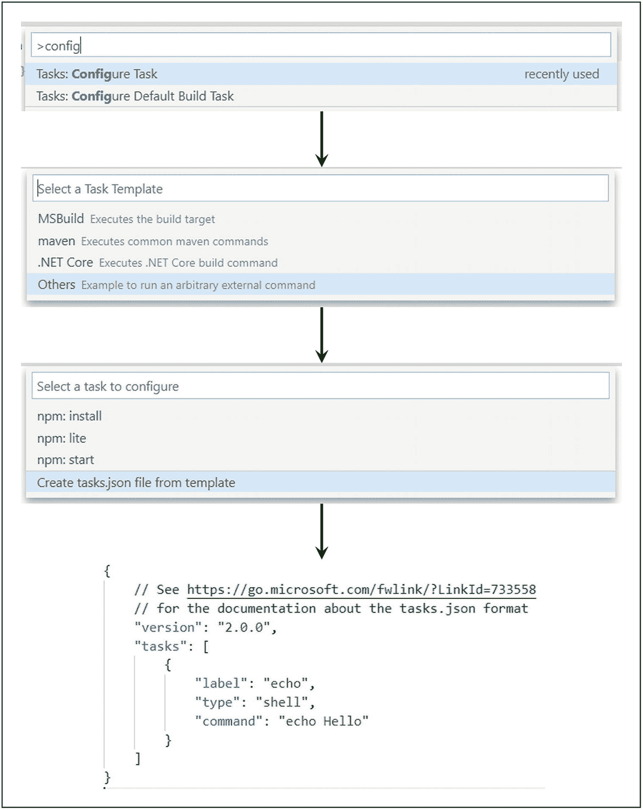

图 1-2

启动配置

要测试配置，打开 index.html 文件并按 Ctrl+Shift+B。该文件应该在 Chrome 中打开，您应该看到类似于图 [1-3](#Fig3) 所示的输出。

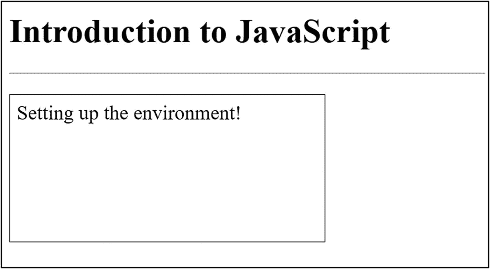

图 1-3

起始项目的输出

既然我们的开发环境已经启动并运行，让我们来探索一些基本的 JavaScript 概念。

## 常量和变量声明

常量是标识符，其值在整个程序范围内保持不变。另一方面，变量是标识符，其值可以随时更改。需要注意的一点是，您可以声明一个变量，然后在代码中初始化它，但是对于常量，您必须在声明过程中赋值。可以使用“const”关键字来声明常数。例如:

```jsx
const weightInKilos = 100;

```

JavaScript 中的变量可以使用“let”或“var”关键字来声明。虽然这两个关键字都用于变量声明，但是使用这两个关键字声明的变量范围有很大的不同。用“var”关键字声明的变量在整个程序中都是可访问的，而用“let”关键字声明的变量只在声明它们的块中可用。让我们用一个例子来理解这一点:

```jsx
...
if(true){
 let letVariable = "Variable using let";
}
ResultContainer.innerHTML =  letVariable;

```

如果您尝试执行前面的代码，您可能会在控制台中得到一个错误，指出“letVariable is not defined”。这是因为您试图访问其范围之外的 letVariable。将代码更改如下，您应该会看到类似于图 [1-4](#Fig4) 的输出:

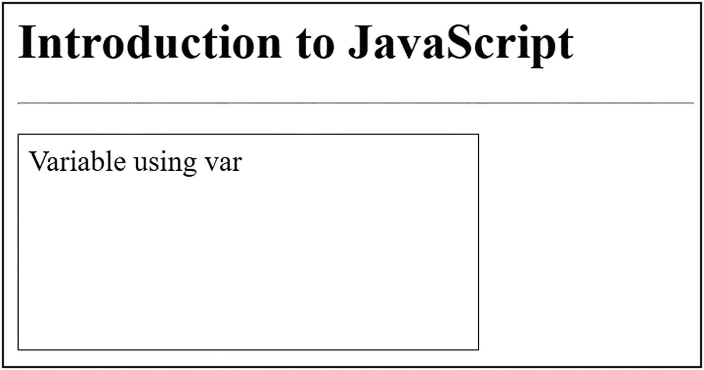

图 1-4

使用 let 和 var 的变量声明

```jsx
...
if(true){
 var varVariable = "Variable using var";
}
ResultContainer.innerHTML =  varVariable;

```

let 和 var 的另一个区别是，如果你试图在声明之前访问一个“let”变量，系统会抛出一个未定义的错误，但是对于“var”变量，系统不会抛出任何错误。例如，考虑图 [1-5](#Fig5) 中的这段代码。最后两行可能会给你一个错误，因为你访问了一个从未声明过的变量。然而，前两行不会给你任何错误。当我们试图在声明变量之前访问变量时，我们总是希望系统抛出一个错误。因此，使用“let”关键字而不是“var”关键字来声明变量始终是一个好的做法。

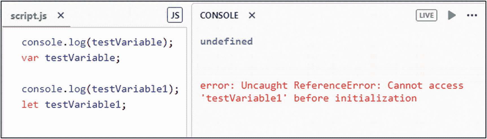

图 1-5

let 与 var

## 休息参数

Rest 参数是 ES6 中引入的 JavaScript 的一个特性。它允许我们将多个函数输入参数作为一个数组来处理。这在函数的输入参数数量不确定的情况下特别有用。

Note

ES6 是 ECMAScript 的第六个版本，旨在标准化 JavaScript。由于它是在 2015 年发布的，因此也被称为 ECMAScript 2015。

让我们借助下面的例子来理解这一点:

```jsx
...
function sum(...inputs) {
 var result = 0;
 for(let i of inputs){
  result += i;
 }
 return result;
}
ResultContainer.innerHTML = sum(5, 10, 5, 5);

```

这将在您的 HTML 模板上给出“25”的输出。现在让我们明白这里发生了什么。当我们用 rest 参数声明一个函数并调用它时，JavaScript 会自动接受我们传递给该函数的所有参数，并将其放入一个数组中。然后，该函数可以遍历数组，并对提供的所有输入元素执行操作。Rest 参数也可以与常规参数一起使用。但是，rest 参数应该始终是最后一个参数，这样 JavaScript 就可以收集所有剩余的元素并将其放入一个数组中。考虑以下示例:

```jsx
...
function sum(input1, input2, ...remainingInputs) {
 var result = input1 + input2;
 for(let i of remainingInputs){
  result += i;
 }
 return result;
}
ResultContainer.innerHTML = sum(5, 10, 5, 5);

```

前面的代码也将在 HTML 模板上给出“25”的输出。这里唯一的区别是，只有最后两个输入参数被认为是 rest 参数，而前两个是常规参数。rest parameter 的一个主要优点是可以很容易地对输入参数执行数组操作，比如过滤、排序、弹出、推送、反转等等。

## 析构和扩展语法

析构是 ES6 中引入的 JavaScript 的另一个特性，与 rest 参数正好相反。rest parameter 是将多个值赋给单个数组，而 destructuring 是从单个数组或对象中获取值并将其赋给多个变量。让我们借助一个例子来理解这一点:

```jsx
...
let fruits = ['Apple', 'Watermelon', 'Grapes'];
let [fruit1, fruit2, fruit3] = fruits;

ResultContainer.innerHTML = fruit2;

```

前面的代码将输出“西瓜”。这是因为当我们使用析构语法(左边方括号中的变量用逗号分隔，右边是数组或对象)时，JavaScript 自动从右边的数组中提取值，并开始将它们赋给左边的变量。请注意，这些值是从左到右分配的。例如，如果左边有两个变量，右边有四个数组元素，那么数组中的前两个值将被赋给变量，最后两个值将被忽略。相反，如果左边有四个变量，右边只有两个数组元素，那么值将被赋给前两个变量，最后两个变量将是未定义的。

在给变量赋值时，我们也可以跳过一些数组元素。为此，在左侧添加一个额外的逗号分隔符。考虑以下示例:

```jsx
...
let fruits = ['Apple', 'Watermelon', 'Grapes'];
let [fruit1, , fruit2] = fruits;

ResultContainer.innerHTML = fruit2;

```

这一次，显示在 HTML 模板上的输出将是“Grapes”。这是因为当 JavaScript 试图找到第二个变量来分配第二个数组元素时，它会因为逗号分隔符而找到一个空条目，并跳过那个特定的数组元素。使用析构可以做的另一件有趣的事情是，可以使用 rest 参数语法将前几个数组元素分配给单独的变量，将剩余的数组元素分配给单个变量。请看下面的例子，以便更好地理解:

```jsx
...
let fruits = ['Apple', 'Watermelon', 'Grapes',
              'Guava'];
let [fruit1, ...OtherFruits] = fruits;
ResultContainer.innerHTML = OtherFruits;

```

前面的代码会给出“西瓜，葡萄，番石榴”作为输出，因为 rest 参数语法会将所有剩余的数组元素赋给“OtherFruits”变量。

对象的析构方式与数组类似，唯一的例外是在左侧使用花括号而不是方括号来指定变量。考虑下面这个析构对象的例子:

```jsx
...
let Fruits = {Fruit1: 'Apple', Fruit2: 'Watermelon'};
let {Fruit1, Fruit2} = Fruits;

ResultContainer.innerHTML = Fruit1;

```

前面的代码将输出“Apple”。现在让我们试着在函数中使用析构。我们将尝试传递一个数组作为输入参数，并在函数定义中析构它。请看下面这段代码:

```jsx
...
function sum(a, b, c){
    return a+b+c;
}

let input = [5,9,6];
ResultContainer.innerHTML = sum(...input);

```

前面代码的输出应该是“20”。我们在这里做的与 rest 参数完全相反。我们正在创建一个输入元素的数组，并将其直接传递给一个接受三个不同参数的函数。函数声明将类似于常规函数的声明。但是，请注意我们在调用函数时使用的语法(参数名前的三个点)。这就是所谓的扩展语法，它将为我们做所有的工作。它与 rest 参数的语法相同。但是，如果您在调用函数时使用它，它将以相反的方式工作。因此，它不是收集输入参数并将其放入一个数组，而是析构输入参数的数组，并将值赋给函数声明中提到的变量。也可以同时使用 rest 参数和 spread 语法。它的行为方式将取决于环境。现在让我们来看看控制回路。

## 控制回路

JavaScript 提供了多种遍历循环的方法。让我们用例子来看看它们中的每一个。

### 为

for 循环接受三个参数:第一个参数用于控制变量的初始化，第二个参数是为 true 提供循环入口的条件，最后一个参数是增量或减量参数，它将修改每个循环中控制变量的值。这三个参数后面是循环体:

```jsx
...
for(let i=0;i<8;i++){
    if(i==1){
        continue;
    }
    console.log("i: " + i);
    if(i==4){
        break;
    }
}

```

我们可以在各种 JavaScript 循环中使用 break 和 continue 操作符。continue 操作符用于从循环体中跳过剩余的语句并跳到下一次迭代，而 break 操作符用于终止循环的所有剩余迭代。

请注意图 [1-6](#Fig6) 中的前一段代码及其输出。循环运行八次迭代，并打印每次执行的迭代次数。但是，对于第二次迭代，循环体中 print 语句之前的 if 条件将计算为 true，continue 运算符的执行将使循环跳转到下一次迭代。因此，我们在输出中看不到值“1”。类似地，对于第五次迭代，print 语句后的 if 条件将计算为 true，break 运算符的执行将终止循环的剩余迭代。因此，我们在输出中看不到“4”之后的剩余值。

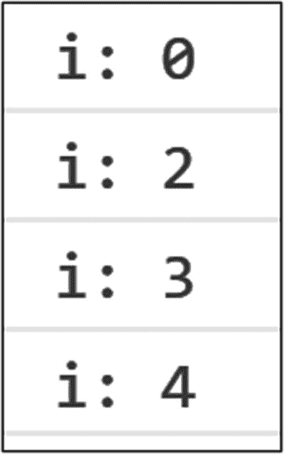

图 1-6

JavaScript 中的 for 循环

### 为每一个

forEach 循环在数组或列表上调用，并对每个数组元素执行一个函数。该函数接受三个参数:当前值(fruit)、当前值的索引(index)和当前值所属的数组对象。第二个和第三个参数是可选的，而第一个参数是必需的。使用这种控制循环的主要好处之一是，不会对空数组元素执行该函数，从而为最终应用带来更好的响应时间:

```jsx
...
let fruits = ['Apple','Grapes','Watermelon'];
fruits.forEach((fruit, index) => {
    console.log(index + ': ' + fruit);
})

```

### 正在…

while 循环是一个类似于 for 循环的入口控制循环，这意味着在迭代开始时检查验证循环入口的条件。然而，与 for 循环不同，您不必初始化或修改控制变量以及条件。初始化在循环开始前完成，其值在循环体中修改:

```jsx
...
let fruits = ['Apple', 'Grapes', 'Watermelon'];
let i = 0;
while (i < fruits.length) {
    console.log(i + ': ' + fruits[i]);
    i++;
}

```

### 做...正在…

做...while 循环是由退出控制的 while 循环的变体，这意味着在迭代完成后检查验证循环入口的条件。如果为真，循环将执行下一次迭代:

```jsx
...
let fruits = ['Apple', 'Grapes', 'Watermelon'];
let i = 0;
do{
    console.log(i + ': ' + fruits[i]);
    i++;
}while (i < fruits.length);

```

forEach、while 和 do 的输出...而控制回路示例应类似于图 [1-7](#Fig7) 所示。

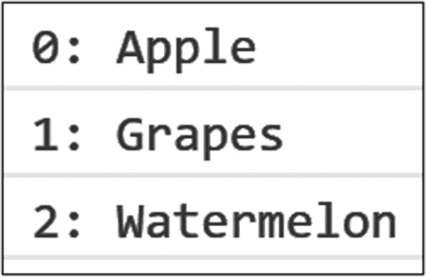

图 1-7

JavaScript 中的 forEach、while 和 do…while 循环

forEach 循环还有更多变体，例如 for…in 和 for…of。然而，前面列出的都是主要的，对于本章的范围来说已经足够了。现在让我们看看 JavaScript 中的类型转换。

## 类型变换

通常在编程期间，我们需要显式地将一种数据类型的成员转换成另一种数据类型。这可以通过使用 JavaScript 内置的类型转换方法来实现。考虑以下 JavaScript 中的类型转换示例:

```jsx
...
let input = [5,9,6];
console.log("Type Of [5,9,6]: " + typeof(input));
console.log("Type Of [5,9,6]: " +
               typeof(input.toString()));
console.log("Type Of '2': " + typeof(Number('2')));
console.log("'true' to Number: " + Number(true));
console.log("'hi' to Boolean: " + Boolean('hi'));
console.log("'NaN' to Number: " + Boolean(NaN));

```

首先，我们使用 toString()方法将对象转换成字符串。数据成员的类型可以通过将其传递给 Type of()方法来确定，如前面的示例所示。然后，我们使用 Number()方法将字符串和布尔数据类型转换为数值。我们还可以使用 boolean()方法将值转换为 Boolean，这将在示例中进一步演示。请注意，在执行此操作时，诸如 0、NaN、Undefined 等空值将被转换为 false，而所有其他值将被转换为 true。请注意，空字符串将被转换为 false，而值为“0”的字符串将被转换为 true。前面代码的输出应该类似于图 [1-8](#Fig8) 所示。

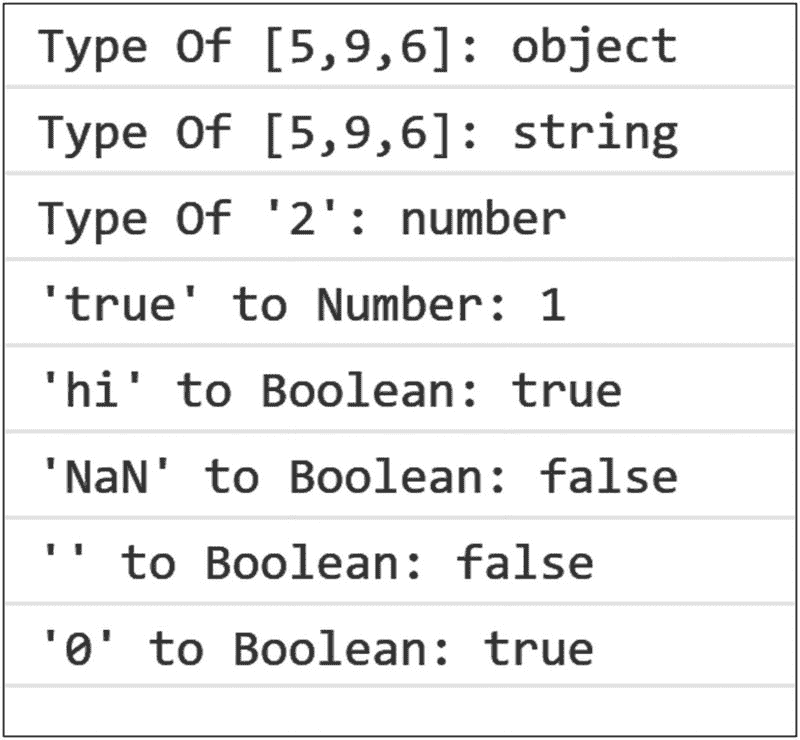

图 1-8

JavaScript 中的类型转换

这就是类型转换。现在让我们看看 JavaScript 中的操作符和函数。

## 经营者

运算符用于修改程序中的值。我们使用运算符修改的值称为操作数。JavaScript 提供了多种类别的操作符。让我们详细讨论每一个问题。

### 算术运算符

算术运算符是对数字操作数执行数学运算的运算符。加法(+)、减法(–)、乘法(∵)、除法(/)、模数(%)、增量(++)和减量(-)都是算术运算符的例子。

### 比较运算符

比较运算符比较两个操作数的值，并根据运算符的真实性返回一个布尔值。等式(==)，类型等式(===)，不等式(！=)、大于(>)、大于或等于(> =)、小于(

### 赋值运算符

赋值运算符用于给操作数赋值。" = "运算符将右操作数的值赋给左操作数，"+= "运算符将右操作数的值与左操作数相加，然后赋给左操作数，"–= "运算符从左操作数中减去右操作数的值，然后赋给左操作数，"∫= "运算符将两个操作数的值相乘，然后赋给左操作数，"/= "运算符将左操作数的值除以右操作数，然后赋给左操作数，最后，" %= "运算符计算左操作数除以右操作数后的模，然后赋给左操作数。

### 逻辑运算符

逻辑运算符用于组合两个或多个条件，并找出它们的组合真值。该运算符返回一个布尔值。逻辑 AND (&&)和逻辑 OR (||)是 JavaScript 中的两种逻辑运算符。不是(！)是另一个逻辑运算符，用于对返回的布尔值求反。

### 三元运算符

三元运算符由三部分组成:条件、主体 1 和主体 2。条件和正文 1 由“？”分隔运算符，而两个主体由“:”运算符分隔。如果条件为真，将执行主体 1，而如果条件为假，将执行主体 2。

参考下面这段代码，它演示了 JavaScript 中的所有操作符。在执行时，它应该给出类似于图 [1-9](#Fig9) 所示的输出:

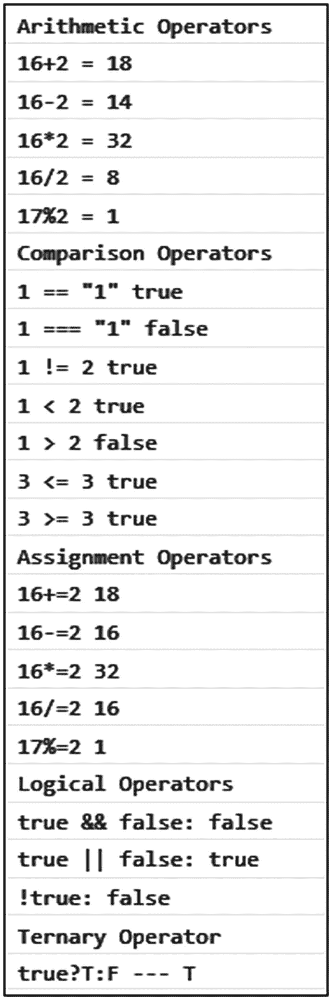

图 1-9

JavaScript 中的运算符

```jsx
...
var a=16, b=17;
console.log('Arithmetic Operators');
console.log('16+2 = ' + (16+2));
console.log('16-2 = ' + (16-2));
console.log('16∗2 = ' + (16∗2));
console.log('16/2 = ' + (16/2));
console.log('17%2 = ' + (17%2));
console.log('Comparison Operators');
console.log('1 == "1" ' + ('1' == 1));
console.log('1 === "1" ' + ('1' === 1));
console.log('1 != 2 ' + (1 != 2));
console.log('1 < 2 ' + (1 < 2));
console.log('1 > 2 ' + (1 > 2));
console.log('3 <= 3 ' + (3 <= 3));
console.log('3 >= 3 ' + (3 >= 3));
console.log('Assignment Operators');
console.log('16+=2 ' + (a+=2));
console.log('16–=2 ' + (a–=2));
console.log('16∗=2 ' + (a∗=2));
console.log('16/=2 ' + (a/=2));
console.log('17%=2 ' + (b%=2));
console.log('Logical Operators');
console.log('true && false: ' + (true && false));
console.log('true || false: ' + (true || false));
console.log('!true: ' + (!true));
console.log('Ternary Operator');
console.log('true?T:F --- ' + (true?'T':'F'));

```

## 功能

JavaScript 中的函数是自包含的代码片段，可以编写一次，并在需要时通过调用函数来执行。函数可能接受参数并返回值。但是，这不是强制性的。" function "关键字用于定义一个函数。下面给出了函数定义的语法:

```jsx
function function_name(input_paramaters)
{
     function_body
}

```

函数也可以赋给变量。这就是所谓的函数表达式。它允许我们定义匿名函数，没有名字的函数。这些类型的函数可以通过使用它们被分配到的变量的名称来调用。函数表达式的语法如下:

```jsx
let variable_name = function(input_paramaters)
{
      function_body
}

```

在 JavaScript 中定义函数的另一种方法是使用箭头函数。它们类似于函数表达式，但语法更短，如下所示:

```jsx
let variable_name = (input_paramaters) =>
{
      function_body
}

```

JavaScript 中的一切都是借助函数来完成的。例如，当我们使用 console.log 将值打印到浏览器控制台时，log()只不过是一个内置的 JavaScript 函数，为我们完成这项工作。考虑下面这个用 JavaScript 演示函数的例子:

```jsx
...
function fun()
{
    console.log('Regular JS Function.');
}

let functionExpr = function(){
    console.log('Function Expression.');
}

let arrFunction = () => {
    console.log('Arrow Function.');
}

fun();
functionExpr();
arrFunction();

```

前面一段代码在浏览器控制台中的输出应该类似于图 [1-10](#Fig10) 所示。

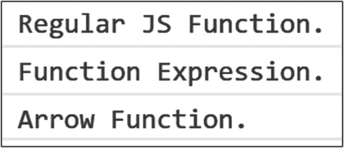

图 1-10

JavaScript 中的函数

## 关闭

闭包是一个内部函数，即使在执行了父函数之后，它也可以访问父函数的范围。让我们理解闭包的必要性。假设你的程序中有一个计数器。可以使用一个全局变量和一个函数来增加计数器的值。但是，这种情况下的问题是，代码的任何部分都可以在不访问函数的情况下修改全局变量的值。为了解决这个问题，我们需要一个函数的局部变量。但是如果你尝试这样做，每次函数被调用时，变量都会被初始化，这并不能达到我们的目的。这就是结束进入画面的地方。为了更好地理解，请考虑以下示例:

```jsx
...
var increment = (function () {
    var counter = 0;
    return function () {
        counter += 1;
        console.log(counter);
    }
})();

increment();
increment();
increment();

```

前面代码的结果应该类似于图 [1-11](#Fig11) 所示。


图 1-11

JavaScript 中的闭包

现在，让我们明白这里发生了什么。当我们将函数的值赋给“increment”变量时，函数执行一次，内部函数的整个主体都赋给变量，因为这是函数返回的内容。现在，当您使用变量名调用函数时，只会执行内部函数。这样，变量将保持为函数的私有变量，并且在将函数赋值给变量的过程中只初始化一次，从而实现了我们的目的，即拥有一个私有的计数器变量，该变量只能通过调用指定的函数来修改。

这都是关于闭包的；现在让我们看看 JavaScript 中的数组。

## 数组

数组是在单个变量中存储多个值的 JavaScript 对象。您可以通过在数组中指定索引来访问单个值，也可以轻松地遍历所有值来查找特定值。以下是定义数组的语法:

```jsx
var fruits = ['Watermelon','Apple','Grapes'];

```

我们也可以在数组中存储其他对象。例如，考虑下面的例子:

```jsx
...
var fruits = ['Watermelon','Grapes'];
fruits[2] = {
            "Apple1": "Red Apple",
            "Apple2":"Green Apple"
            };
console.log(fruits);

```

前面代码的输出应该类似于图 [1-12](#Fig12) 。

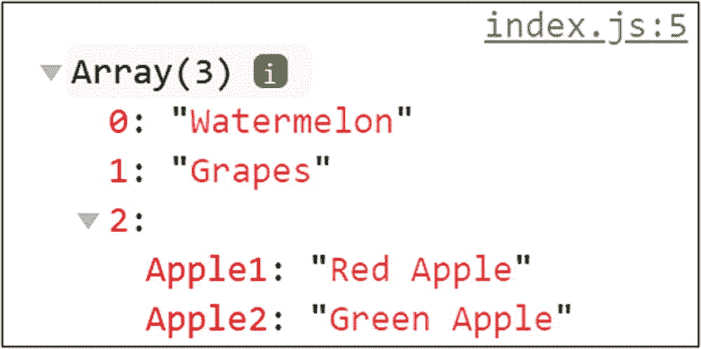

图 1-12

在 JavaScript 数组中存储对象

可以使用本章前面讨论的控制循环来迭代数组值。您可以通过在数组名称后面的方括号中提供数组中的索引来访问特定的数组元素。您也可以使用赋值运算符来更改它的值。一旦你看了下一节中的例子，事情会变得更清楚。您可以使用“长度”属性来获取数组元素的计数。除此之外，还有几个内置的数组方法可以用来在 JavaScript 中执行数组操作。以下是方法列表:

*   **arr . sort()**–这个方法对数组进行排序。

*   **arr . foreach()**–该方法用于迭代所有数组元素。

*   **arr . push(value)**–该方法用于在数组的最后一个索引处添加新元素。

*   **arr . pop()**–这个方法从数组中删除最后一个值。

*   **arr . shift()**–此方法从数组中删除第一个值，并将剩余的值移动一个索引。

*   **arr . un shift(value)**–此方法在数组的第一个索引处添加一个新元素，并将剩余的值移动一个索引。

*   **array . isarray(arr)**–如果“arr”是一个数组，则该方法返回 true。

*   **arr . tostring()**–此方法将数组转换为值的字符串。

*   **arr . join(separator)**–该方法类似于 toString 方法，但是您可以为值指定一个分隔符。

*   **arr1 . concat(arr2)**–该方法用于连接两个数组:arr 1 和 arr 2。

*   **arr.splice(position，deletecount，value1，value2，…)**–此方法用于在数组的特定位置添加一组新值。第一个参数指定需要添加值的位置，第二个参数是要从数组中删除的元素的计数，其余参数是需要添加到数组中的值。

*   **arr2 = arr1.slice(firstindex，last index)**–此方法用于从现有数组创建新数组。这些参数指定需要为新数组提取的值的起始和结束索引。如果不指定 lastindex，JavaScript 将采用所有剩余的值。

考虑下面的代码，它将帮助您理解 JavaScript 数组的属性和方法:

```jsx
...
var fruits = ['Watermelon','Apple','Grapes'];
console.log('Array: ' + fruits.toString());

fruits.sort();
console.log('Sorted Array: ' + fruits.toString());

console.log('forEach:');
fruits.forEach(element => {
     console.log(element);
});

fruits.push('Strawberry');
console.log('Push: ' + fruits.toString());

fruits.pop();
console.log('Pop: ' + fruits.toString());

fruits.shift();
console.log('Shift: ' + fruits.toString());

fruits.unshift('Apple')
console.log('Unshift: ' + fruits.toString());

console.log('isArray? ' + Array.isArray(fruits));

var moreFruits = ['Strawberry'];
fruits = fruits.concat(moreFruits);
console.log('Concatenate: ' + fruits.toString());

fruits.splice(0,0,'Guava');
console.log('Splice: ' + fruits.toString());

var top3fruits = fruits.slice(0,3);
console.log('Slice: ' + top3fruits.toString());

```

前面一段代码的输出应该类似于图 [1-13](#Fig13) 。

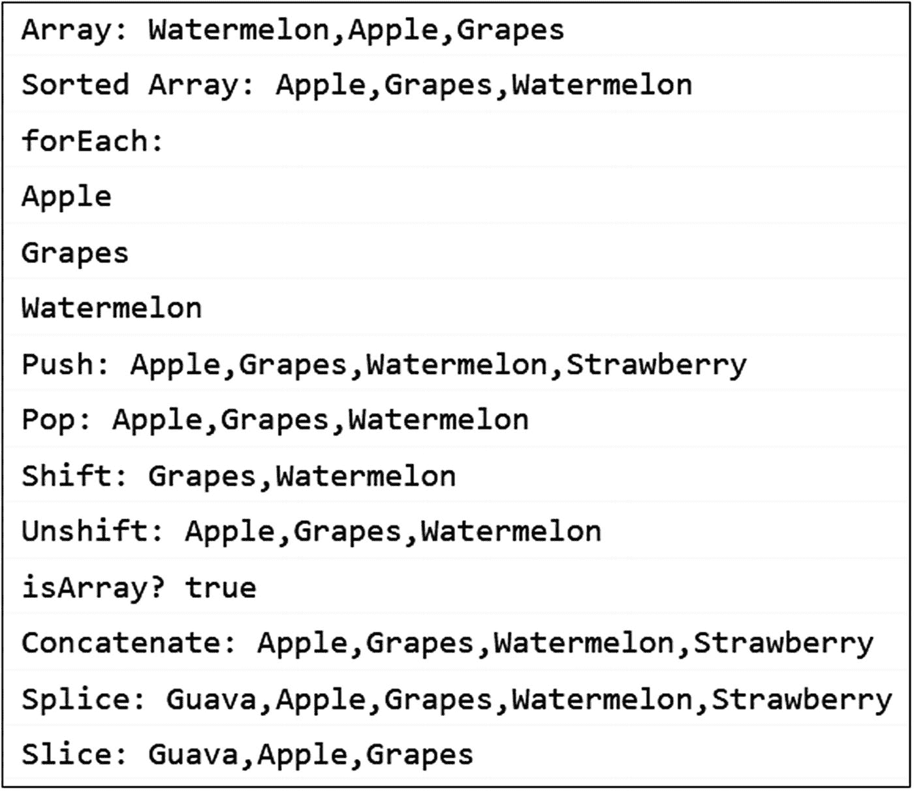

图 1-13

JavaScript 中的数组

这都是关于数组的；现在让我们看看 JavaScript 中的类和模块中的数组。

## 类别和模块

JavaScript 中的类类似于 Java 和 C++等其他编程语言中的类。它们帮助我们创建构造函数。另一方面，模块是组织代码的一种方式。我们可以将代码分成多个部分，每个部分都将成为一个独立的模块。让我们从课程开始。我们使用“class”关键字，后跟类名，在 JavaScript 中创建一个类。为了实例化该类的一个对象，我们使用了 new 关键字。下面是一个例子:

```jsx
class Dog
{
}
let dog = new Dog();

```

我们的类目前没有属性或方法，所以当您实例化该类时，它将创建一个空对象。我们现在将使用一个构造函数向我们的类添加一些属性。构造函数是为类创建对象时执行的方法。在大多数编程语言中，它与类名同名，并且没有返回类型。然而，在 JavaScript 中，使用“constructor”关键字创建构造函数。在使用 new 关键字实例化对象的过程中，可以将参数传递给构造函数。对于属性，您可以使用“this”关键字在构造函数中简单地定义它们，而不是传统地声明它们，然后在构造函数中定义它们。通过使用类的对象访问赋值运算符，可以在程序的任何位置借助该运算符更改属性值。考虑以下示例:

```jsx
class Dog
{
     constructor(id){
          this.id = id;
     }
}
let dog = new Dog(100);
console.log(dog.id);
dog.id = 200;
console.log(dog.id);

```

在执行前面的代码时，您将在浏览器控制台中得到“100”和“200”作为输出。我们还可以在类中添加方法来执行操作。让我们添加一个返回“id”属性值的方法。考虑以下示例:

```jsx
class Dog
{
     constructor(id){
          this.id = id;
     }
}
let dog = new Dog(100);
console.log(dog.getId());

```

前面的代码应该在浏览器控制台上显示“100”。注意，在 JavaScript 中定义方法时，我们不需要“function”关键字。我们可以简单地使用方法名并继续定义方法。现在让我们看看 JavaScript 中的继承。考虑以下示例:

```jsx
class Animal
{
    constructor(type){
        this.type = type;
    }
    getType(){
        return this.type;
    }
}

class Dog extends Animal{
    constructor(){
        super('dog');
    }
}

let dog = new Dog();
console.log(dog.getType());

```

我们使用“extends”关键字来继承子类中基类的属性和方法。我们可以使用“super”关键字来访问子类中基类的成员。在类之外，我们可以使用子类的对象来访问基类和子类的成员。前面的代码应该在浏览器控制台中给出“dog”作为输出。当我们创建一个“dog”类的对象时，它的构造函数被调用，然后调用“Animal”类的构造函数，并将“type”属性值设置为“Dog”。然后，当我们试图调用方法“getType()”时，它在父类和子类中搜索该方法，如果找到就调用它。请注意，如果您没有在子类中定义任何构造函数，父构造函数会被自动调用，但是如果您在子类中定义了构造函数，则需要使用“super”关键字手动调用父类构造函数。那都是关于阶级的。现在让我们来谈谈模块。

一个应用可能有数百个类。组织此类应用代码的最佳方式是在模块中定义类。我们可以为每个模块创建一个单独的文件，然后将该模块导入到其他文件中，以使用该模块中的类。让我们在“脚本”文件夹中创建一个“模块”文件夹。在这个文件夹中，让我们创建一个名为 Animals.js 的文件。现在让我们将“Animal”类从 script.js 文件移动到 Animals.js 文件。为了使它成为一个模块，我们需要在类定义前面使用“export”关键字。因此，Animals.js 文件应该包含以下代码:

```jsx
export class Animal
{
    constructor(type){
        this.type = type;
    }
    getType(){
        return this.type;
    }
}

```

但是，您仍然不能在 index.js 文件中使用该类。为此，您必须从 Animals.js 文件中导入“Animal”类。这可以通过在 index.js 文件中使用“import”关键字来完成，如下所示:

```jsx
import { Animal } from './modules/Animals.js';

let dog = new Animal('dog');
console.log(dog.getType());

```

您可以从一个文件中导出多个对象，并以类似于上例所示的方式从不同的文件中导入多个对象。请注意，为了在项目中使用模块，您还必须在 html 文件中将 index.js 脚本注册为“模块”类型，而不是“文本/JavaScript”。理想情况下，前面的代码应该在您的浏览器控制台中显示“dog”。然而，如果你使用的是 chrome 浏览器，由于 CORS 政策，你肯定会得到一个错误。这意味着你不能从没有 CORS 头文件的其他跨源文件导入模块，如果你从本地文件系统运行你的应用，这是不可能的。这个问题的解决方案是从服务器上运行你的应用。为此，我们将使用 node.js 创建一个本地服务器。

## 创建本地服务器

这样做的先决条件是您的系统中已经安装了 Node.js 和 npm。可以从 [`https://nodejs.org/`](https://nodejs.org/) 下载安装。安装完成后，您可以在编辑器中打开一个终端，并确保当前目录是项目的基本文件夹。从终端执行以下命令:

```jsx
npm init –y

```

这应该会在项目的基本文件夹中创建一个“package.json”文件。这是一个保存项目元数据和依赖项信息的文件。更新文件以添加开发服务器依赖项和脚本来启动服务器。更新后的文件应该包含以下信息:

```jsx
{
  "name": "intro-to-js",
  "version": "1.0.0",
  "description": "",
  "main": "index.js",
  "scripts": {
    "lite": "lite-server –-port 10001",
    "start": "npm run lite"
  },
  "keywords": [],
  "author": "",
  "license": "ISC",
  "devDependencies": {
    "lite-server":"^1.3.1"
  }
}

```

在更新“package.json”文件之后，从终端运行“npm install”命令来安装我们刚刚添加到 json 文件中的依赖项。将在您的项目目录中创建一个名为“node_modules”的文件夹。该文件夹将包含所有项目依赖项的文件。既然我们已经将开发服务器添加到我们的项目依赖项中并安装了它，我们可以在终端中使用“npm start”命令启动我们的应用。请注意，我们之前在模块示例中遇到的 CORS 策略错误现在已经消失了，我们在浏览器控制台中看到了“dog”输出，这是意料之中的。这是因为我们的应用现在运行在本地服务器上，而不是文件系统上。请注意，浏览器中的 URL 已经从文件路径更改为“localhost”。另请注意，服务器现在正在侦听项目文件中的更改。这意味着，只要您在项目文件中进行任何更改并保存它，它就会自动反映在浏览器中，并且您不需要在每次更改文件时手动刷新浏览器。

## DOM 修改

DOM 指的是包含网页中所有元素的文档对象模型。可以使用 JavaScript 中的“document”对象修改 DOM。DOM 是一个庞大的主题，所以我们将把范围限制在选择元素和修改它们的值上。以下是可用于从 DOM 中选择元素的方法:

*   **getElementById(' elementId ')**–该方法返回一个与输入参数中指定的 ID 相同的元素。

*   **getElementsByClassName(' class name ')**–该方法返回与输入参数中指定的类名相同的元素列表。请注意，与 getElementById 方法不同，该方法可以返回多个元素，因为 Id 对于元素是唯一的，而类名不是。

*   **getElementsByTagName(' tagName ')**–该方法返回与输入参数中指定的类名相同的元素列表。因为标记名对于一个元素来说不是唯一的，所以这个方法可以返回多个元素。

让我们看一个例子。我在 index.html 文件中添加了以下部分:

```jsx
...
 <h1>Introduction to JavaScript</h1>
 <hr/>
 <div ID="ResultContainer"></div>
 <br/>
 <div class="Footer">Footer Content</div>
...

```

现在让我们使用文档对象方法获取这些元素。考虑以下 JavaScript 代码:

```jsx
var header = document.getElementsByTagName("h1");
var body = document.getElementById("ResultContainer");
var footer = document.getElementsByClassName("Footer");

console.log(header);
console.log(body);
console.log(footer);

```

前面一段代码的输出应该类似于图 [1-14](#Fig14) 。

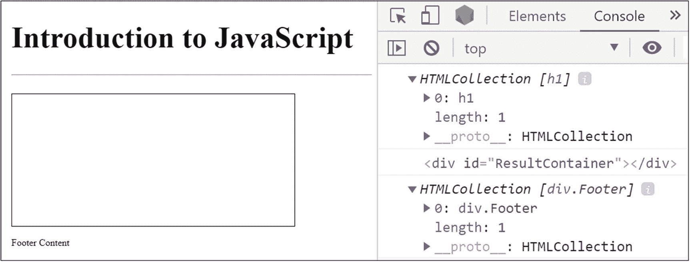

图 1-14

在 JavaScript 中访问 DOM 元素

现在让我们修改这些元素。我们可以改变这些元素的内容，为它们添加事件处理程序，还可以改变它们的视觉效果。考虑以下示例:

```jsx
var header = document.getElementsByTagName("h1");
header[0].textContent = "Header Text from JS";
header[0].setAttribute('isHeader','True');
header[0].style.border = '2px solid black';
console.log(header[0]);

```

修改 DOM 后，您的 web 页面看起来应该类似于图 [1-15](#Fig15) 。

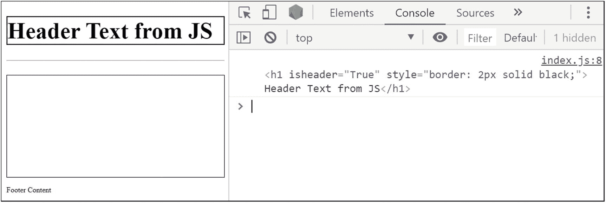

图 1-15

JavaScript 中的 DOM 修改

请注意，名为“isheader”的属性被添加到元素中，其值被设置为“true”。这是借助 setAttribute()方法完成的。此外，因为在 JavaScript 代码中使用了 style.border 属性，所以在 header 部分添加了一个边框。DOM 元素还有其他几个属性可以修改。更多信息请访问 [`https://developer.mozilla.org`](https://developer.mozilla.org) 。

## 错误处理

当我们的 JavaScript 代码出错时，我们希望平稳地处理它。这就是 JavaScript 的错误处理机制发挥作用的地方。让我们看一个系统出错的例子:

```jsx
var fruit = new Fruit();
console.log('rest of the code!');

```

前面的代码试图实例化“Fruit ”,但是程序中没有定义这样的类。因此，系统将遇到如图 [1-16](#Fig16) 所示的参考错误，并终止程序的执行。因此，其余的代码将不会被执行。


图 1-16

JavaScript 中的引用错误

处理错误最常见的方法之一是使用 try-catch 块。容易出错的代码写在 try 块中。如果在执行 try 块时发生错误，控制将被转移到下一个处理执行的 catch 块。在执行 catch 块之后，其余的代码照常执行。考虑以下代码:

```jsx
try{
    var fruit = new Fruit();
}
catch(e){
    console.log('ERROR: ' + e.message);
}
console.log('rest of the code!');

```

该代码的输出应类似于图 [1-17](#Fig17) 。

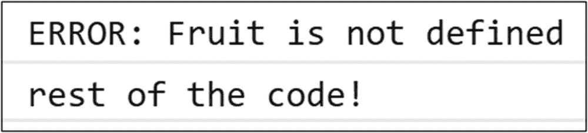

图 1-17

JavaScript 中的错误处理

请注意，尽管有错误，程序并没有终止，在错误处理之后，代码的其余部分照常执行。可以选择在 try-catch 之后添加一个“finally”块，以添加一段无论错误如何都会执行的代码。这是关于内置在 JavaScript 中的错误。但是，作为开发人员，您可能希望在某些情况下抛出自定义错误。这可以通过使用“throw”关键字来完成。考虑以下代码:

```jsx
...
try{
    throw new Error('Custom Developer Error!');
}
catch(e){
    console.log('ERROR: ' + e.message);
}
...

```

前面的代码应该显示“错误:自定义开发人员错误！”在浏览器控制台中。这就是 JavaScript 中的错误处理。现在让我们看看 HTTP 请求和承诺。

## HTTP 请求

JavaScript 中的 HTTP 请求主要用于从远程服务器或 API 获取数据和资源。我们将首先使用 XMLHttpRequest()，这是 JavaScript 用于 HTTP 请求的内置技术。以下是使用 XMLHttpRequest()创建 HTTP 请求的步骤:

1.  实例化 XMLHttpRequest()的一个对象。

2.  将函数绑定到请求对象的状态更改事件。该函数中的代码将监控请求的成功或失败，并对返回的数据执行操作。

3.  使用请求对象创建到 HTTP 资源的连接。

4.  发送请求。

考虑下面的例子来更好地理解它:

```jsx
let request = new XMLHttpRequest();

request.onreadystatechange = function(){
    if(request.readyState==4 && request.status==200){
        console.log(request.response);
    }
}

request.open('GET', 'https://api.github.com/users/msthakkar121');

request.send();

```

上例的输出应该类似于图 [1-18](#Fig18) 。这里，我们使用 GitHub 的 API，通过指定用户的登录名来获取用户数据。我们使用绑定到请求的 onReadyStateChange 事件的匿名函数不断监视状态更改请求。readyState 为 4，状态代码为 200，这意味着我们已经成功地收到了请求的响应。因此，在这种情况下，我们将响应对象记录到控制台。XMLHttpRequest()的主要问题是，为了处理响应，您需要知道 readyState 和 status code 的结果的状态代码。由于这个缺点，XMLHttpRequest()很少被直接使用。如果我们使用 JQuery 这样的库，HTTP 请求就容易处理得多。

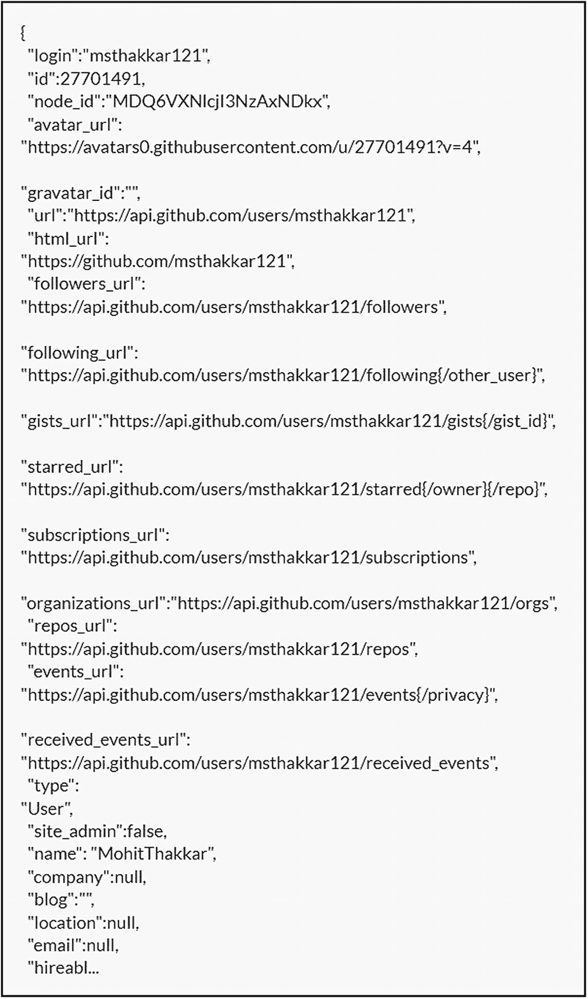

图 1-18

JavaScript 中的 XMLHttpRequest

让我们看看使用 JQuery 的 HTTP 请求。要在我们的项目中使用 JQuery，我们必须首先在“package.json”文件中注册它，并将其安装在项目的“node_modules”文件夹中。这两者都可以通过从终端执行“npm install jquery”命令来完成。一旦我们将 JQuery 安装到项目中，我们就可以使用 import 语句将它导入到 JavaScript 文件中。考虑下面的例子:

```jsx
import '../node_modules/jquery/dist/jquery.js';

$.get("https://api.github.com/users/msthakkar121", data => console.log(data));

```

“$”符号在 JQuery 中是一个常量，被定义为静态的。我们使用这个符号来访问 get 方法。此方法的第一个参数是一个字符串，其中包含请求要发送到的 URL。第二个参数是一个函数，如果请求成功，将执行该函数。第三个参数是可选的，可能包含需要随请求一起发送的数据。在前面的示例中，我们使用了一个箭头函数，它将响应数据记录到浏览器控制台。前面代码的输出应该类似于图 [1-18](#Fig18) 。尽管这似乎是处理 HTTP 请求的好方法，但它不是理想的方法。get()方法返回一个承诺，帮助我们以更好的方式处理请求。

## 承诺

承诺旨在处理异步请求。它们是存储异步请求响应的对象。考虑下面这段代码:

```jsx
let promise = new Promise(function(resolve, reject){
    setTimeout(resolve,100,'Resolved');
    //setTimeout(reject,100,'Rejected');
});

promise.then(
    value => console.log('Success: ' + value),
    error => console.log('Error: ' + error)
);

```

Promise 构造函数接受一个带有两个参数的函数。这两个参数也是分别用于成功和失败的函数。在前面的例子中，我们用匿名函数创建了 promise。这个函数有两个参数:resolve 和 reject。在匿名函数的主体中，我们调用超时为 100 毫秒的“resolve”函数，并将“Resolved”作为一个值传递给 promise。因此，承诺将处于成功状态，并将存储我们作为响应传递的消息。如果我们调用“拒绝”函数而不是 resolve 函数，承诺将处于错误状态。

这就是创造承诺的全部。现在，考虑这样一个场景，您希望根据一个承诺的成功或失败来执行一些操作。在这种情况下，您必须使用 then()函数来结算一个承诺。then()是 promise 对象中的一个函数，它接受两个参数。第一个参数是一个带有一个参数的函数，当承诺处于成功状态时执行该函数。第二个参数是一个带有一个参数的函数，当 promise 处于失败状态时执行该函数。这些函数的参数将包含解析承诺时返回的值。

在前面的代码中，如果您解决了承诺，浏览器控制台上的输出应该是“Success: Resolved”，如果您拒绝了承诺，应该是“Error: Rejected”。注意，您可能需要等待一段时间才能确定承诺，因为您将在这里处理异步操作。

现在让我们看看我们在上一节(“HTTP 请求”)中处理的例子:

```jsx
$.get("https://api.github.com/users/msthakkar121", data => console.log(data));

```

前面的代码可以使用 promise 重写，如下所示:

```jsx
let promise = $.get("https://api.github.com/users/msthakkar100");

promise.then(
    data => console.log(data),
    error => console.log(error)
);

```

这就是承诺。随着这个话题的结束，我们也来到了本章的结尾。在下一章中，我们将使用到目前为止学到的 JavaScript 概念来学习 React.js，一个基于 JavaScript 的库。

## 摘要

*   JavaScript 是 web 开发最重要的语言，它是创建在 web 浏览器上运行的应用所必需的。

*   常量是 JavaScript 中的标识符，其值在整个程序中保持不变，而变量是其值易于改变的标识符。

*   使用“let”或“var”关键字定义变量。建议使用“let”关键字，因为使用“let”定义的变量是有作用域的，并且会严格检查不适当的用法。

*   Rest 参数帮助我们将多个函数输入参数组合成一个数组。另一方面，spread 语法与 rest 参数正好相反，它帮助我们将一个输入数组分解成多个变量。

*   控制循环，如 for、forEach、while 和 do...while 用于处理 JavaScript 中的迭代。

*   类型转换是 JavaScript 中内置的一项规定，可用于显式地将一种数据类型的成员转换为另一种数据类型。

*   JavaScript 中提供了各种算术、比较、赋值、逻辑和三元运算符，可用于修改操作数的值。

*   函数是一段可以在程序中编写一次并多次使用的代码。

*   类和模块帮助我们获得 JavaScript 中面向对象编程的精髓。模块帮助我们将代码组织成文件，并使用 export 和 import 关键字在整个项目中共享代码。

*   我们可以使用 JavaScript 的 document 对象访问和修改网页的 HTML 元素。

*   JavaScript 中的错误可以使用 try-catch 块来处理。也可以选择使用“finally”块。使用“throw”关键字可以生成自定义错误。

*   XML http 请求可用于从远程服务器或 API 获取数据。但是，JQuery 库的 get()方法要方便得多。

*   在处理异步请求时，承诺可以用来方便地处理响应的成功和错误状态。