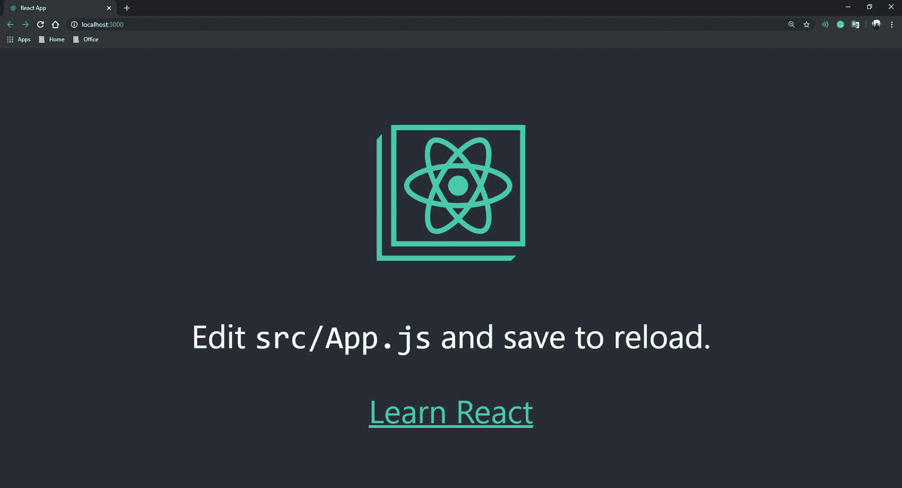
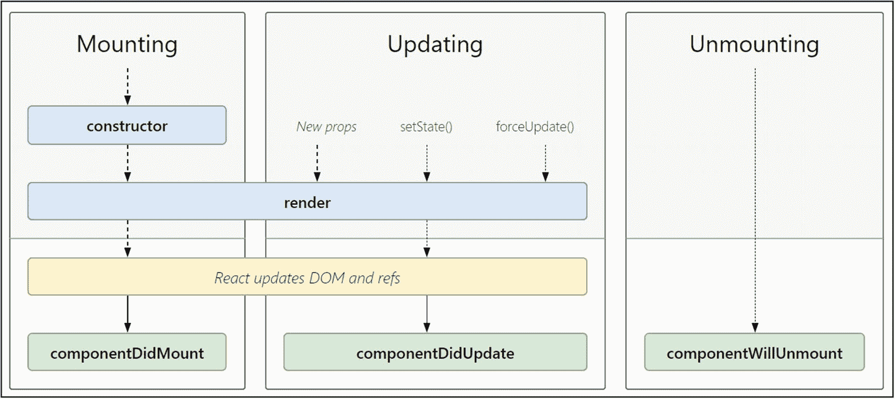
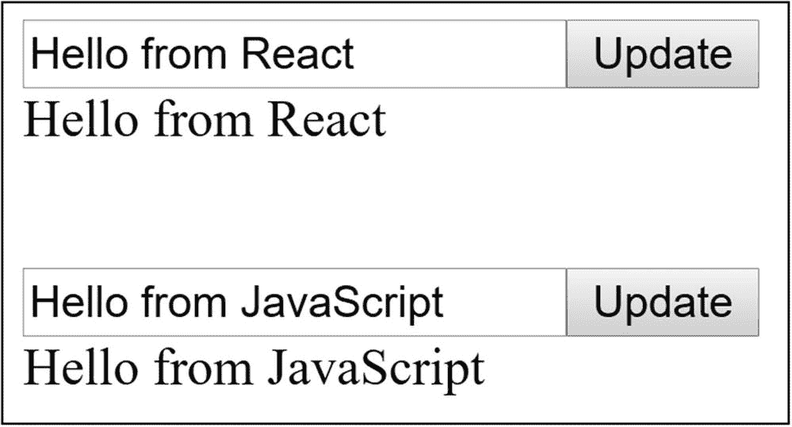
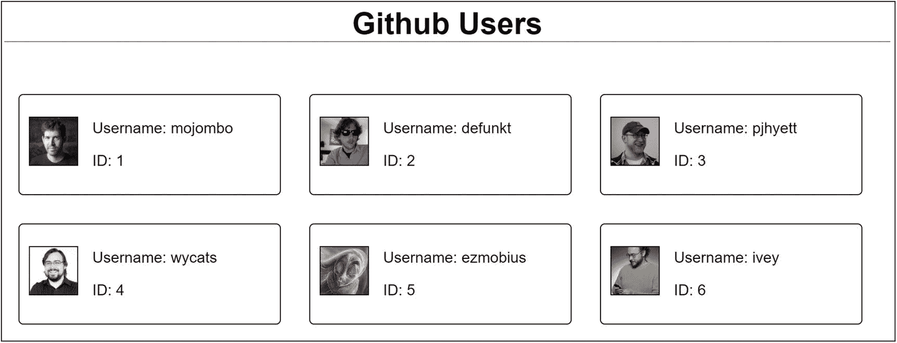

# 二、React.js 简介

React.js 是脸书在 2013 年 5 月创建的开源 JavaScript 库。它用于构建用户界面。React 最棒的地方在于它使用声明式编程风格，而不是命令式。前者指定编译器做什么，后者也必须指定如何做。因此，用 React 编程可以减少代码量。

在本章中，我们将一次一个地理解 React 的基本原理。我们还将看到每个原理在实践中是如何工作的。如果你学习了前一章，这一章应该不难理解。如果你还没有，我建议你浏览一下前一章。

## 设置环境

为了开始用 React 编程，我将使用 Visual Studio 代码编辑器，它可以从 [`https://code.visualstudio.com/download`](https://code.visualstudio.com/download) 下载。但是，您可以使用自己选择的任何编辑器。

### 安装 Node.js

Node.js 是一个开源的跨平台运行时环境，帮助我们编写 JavaScript 应用并执行它。在前一章中，我们安装了 node.js，同时创建了一个本地服务器，用于处理 JavaScript 中模块导入的跨源请求。如果你还没有安装 node.js，可以从 [`https://nodejs.org/`](https://nodejs.org/) 下载安装。安装完成后，您可以在编辑器中打开一个终端并运行“node -v”命令来检查 node.js 是否安装正确。如果是，终端将显示 node.js 的安装版本号。

Node.js 运行时有数千个随时可用的模块。这些模块只是预先编写的 JavaScript 应用，可以在您的代码中重用。这些模块可以使用 npm(节点包管理器)添加到您的代码中。npm 随 node.js 一起提供，如果您已经安装了 node.js，它应该已经安装在您的系统中。您可以在终端中执行“npm -v”命令。如果安装正确，此命令将显示系统中安装的 npm 版本。

### 安装 React

为了使用 react，您必须首先将其安装到您的项目中。有多种方法可以做到这一点。一种方法是简单地使用

```jsx
<script src="https://unpkg.com/react@16/umd/react.development.js" crossorigin></script>

  <script src="https://unpkg.com/react-dom@16/umd/react-dom.development.js" crossorigin></script>

```

请注意，前面的文件是开发版本，为了在生产环境中增强性能，您必须使用缩小的生产版本。以下是缩小版:

```jsx
<script src="https://unpkg.com/react@16/umd/react.production.min.js" crossorigin></script>

<script src="https://unpkg.com/react-dom@16/umd/react-dom.production.min.js" crossorigin></script>

```

另一种方法是为您的项目手动创建一个文件夹，并添加一个“package.json”文件，其中包含所有依赖项的列表。然后，您可以使用“npm-install”命令将所有依赖项安装到项目文件夹的“node_modules”文件夹中。一旦安装了依赖项，就可以开始在 JavaScript 和 HTML 文件中引用依赖项了。

然而，有一种更好的方法来开始 React 项目。我们将使用“create-react-app”，这是一个现有的适用于初学者的 react 节点模块。在终端中，您可以导航到要在其中创建应用的目录，并执行以下命令:

```jsx
npx create-react-app my-app

```

请注意，我们使用了 npx 而不是 npm。npx 是 npm 版本 5.2 及更高版本附带的节点包运行程序。npm 用于安装包，而 npx 用于执行包。在这种情况下，我们实际上并没有在我们的系统上安装“create-react-app”包，但是我们正在执行这个包，它反过来会在我们的系统上安装一个 react 应用。如果您使用 npm，您必须首先使用以下命令将“create-react-app”软件包安装到您的系统中:

```jsx
npm install create-react-app

```

然后，使用该包通过以下命令创建一个 react 应用:

```jsx
create-react-app my-app

```

因此，我们将简单地使用 npx 而不是 npm。成功执行该命令后，您应该会看到类似如下的输出:

```jsx
C:\Users\Mohit.Thakkar\...\Chapter_02> npx create-react-app my-app

npx: installed 91 in 35.563s

Creating a new React app in C:\Users\Mohit.Thakkar\...\Chapter_02\my-app.

Installing packages. This might take a couple of minutes.

Installing react, react-dom, and react-scripts...

> core-js@2.6.10 postinstall C:\Users\Mohit.Thakkar\...\Chapter_02\my-app\node_modules\babel-runtime\node_modules\core-js

> node postinstall || echo "ignore"

> core-js@3.2.1 postinstall C:\Users\Mohit.Thakkar\...\my-app\node_modules\core-js

> node scripts/postinstall || echo "ignore"

+ react-dom@16.12.0
+ react-scripts@3.2.0
+ react@16.12.0

added 1475 packages from 693 contributors and audited 904933 packages in 264.267s
found 0 vulnerabilities

Success! Created my-app at C:\Users\Mohit.Thakkar\...\Chapter_02\my-app

Inside that directory, you can run several commands:

  npm start
    Starts the development server.

  npm run build
    Bundles the app into static files for production.

  npm test
    Starts the test runner.

  npm run eject
    Removes this tool and copies build dependencies, configuration files and scripts into the app directory. If you do this, you can’t go back!

We suggest that you begin by typing:

  cd my-app
  npm start

Happy hacking!

```

如果您导航到 my-app 文件夹并打开 package.json 文件，您会注意到您的项目依赖于 react、react-dom 和 react-scripts。需要时，您可以向该列表添加更多依赖项。现在让我们在终端中使用“npm start”命令启动这个应用。确保在终端中将您的目录更改为“my-app”文件夹。您会注意到该应用将在端口 3000 上的本地开发服务器上运行。您将看到类似于图 [2-1](#Fig1) 的输出。



图 2-1

创建-React-应用

如果您查看文件资源管理器，您会在“public”文件夹中看到一个“index.html”文件和许多。“src”文件夹中的 js 文件。这些 JavaScript 文件是 react 的真正精髓。他们创建组件并在浏览器上呈现它们。由于我们将一个接一个地学习 react 组件，我们现在可以删除“src”文件夹中的所有文件。请注意，一旦您删除了这些文件，您将开始得到“index.js”文件的未找到错误。这是因为“create-react-app”依赖于 react-scripts，react-scripts 使用 webpack 配置文件将应用的入口点指定为“index.js”。因此，当我们删除文件时，它将不再能够找到应用的入口点，并将抛出一个错误。为了解决这个错误，我们现在将添加一个空的“index.js”文件。如果您在添加文件后查看浏览器屏幕，您会注意到输出将是一个空白窗口，但不会有错误。

## React 的基本概念

组件是 React 的主要支柱。它们类似于函数，接受属性(输入)，输出 UI 元素，并且可以在需要时在其他文件中重用。即使它们类似于函数，您也不需要调用它们。它们可以像 HTML 元素(<componentname>)一样使用。</componentname>

它的 React 式质是 React 中的另一个重要概念。这与数据绑定有关。react 组件中的数据来自 props，它是组件输入。当这些数据改变时，用户界面也会改变。这由 React 自动处理。

React 的另一个伟大概念是 HTML 是使用 JavaScript 生成的。这是合理的，因为当您的应用从服务器接收数据时，您需要在呈现数据之前对其进行处理。你可以使用 HTML 或者 JavaScript，这是一个更好的选择。既然您使用 JavaScript 来处理数据，那么您也可以使用 JavaScript 来呈现它。这正是 React 所做的。

这让我们想到了 React 的下一个概念:虚拟 DOM。由于 HTML 是使用 JavaScript 生成的，React 在 DOM 生成之前无法访问它；因此，它保留了视图的虚拟表示，然后用它来比较 UI 中的变化。

现在让我们看看 React 的更多概念，这些概念是构建 React 应用所必需理解的。

### 单页应用

传统上，当您的应用包含多个页面，并且您单击链接导航到另一个页面时，一个新的请求被发送到服务器，然后浏览器在收到来自服务器的响应时加载新页面。这个过程非常耗费时间和资源。它可以通过实现单页应用(spa)来改进。这是由 React 等 JavaScript 框架提供的客户端呈现所普及的东西。在 SPAs 中，您只需加载页面一次。稍后，当用户请求新页面时，JavaScript 解释请求，从服务器异步获取数据，获取需要更新的 UI 组件，并使用新数据更新页面的一部分，而无需重新加载整个页面。

由于此类请求的异步特性，用户可能需要等待一段时间才能更改 UI。然而，用户体验可以通过使用有吸引力的加载器来增强。SPAs 的一个主要优点是，在整个应用中保持不变的资源(如样式表和脚本)不需要在每次发出请求时重新加载，从而缩短了响应时间。然而，搜索引擎很难索引温泉。这就是为什么如果您的应用需要索引，完全依赖客户端渲染不是一个好主意。您需要记住的另一点是，与大多数服务器端编程语言不同，JavaScript 没有处理内存泄漏的内置机制。处理内存问题是你的责任，因为如果存在的话，它们可能会耗尽浏览器的内存并显著降低你的应用的速度。在本书的后面部分，我们将看到如何通过在 React 应用中实现服务器端渲染来解决这些问题。

### 不变

不变性是对象的属性，因此一旦定义了它，就不能更改它的值。为了修改此类对象的值，您必须创建一个新对象，并为其指定相同的名称。在 React 的许多地方都可以看到不变性。例如，作为函数输入传递的 React 中的状态对象永远不会被直接修改。它的值只能通过 setState()方法来更改。为了跟踪组件状态的变化，这在 React 中是必要的。如前所述，React 将虚拟 DOM 与旧版本进行比较，以查看哪些值发生了变化，然后只更新 UI 中需要更新的部分。这就是所谓的调和过程。要检查状态是否已经改变，您必须在 React 中实现以下方法:

```jsx
shouldComponentUpdate(nextProps, nextState) {
  if(this.props.myProp !== nextProps.myProp) {
    return true;
  }
  return false;
}

```

如果方法返回 true，React 将更新组件的 UI。如果状态对象是可变的，那么当状态改变时,“this.props.myProp”的值将立即被修改，并且没有先前值的痕迹可以比较。因为 state 对象是不可变的，所以当您修改包含新值的状态时，将会创建一个新对象(nextProps)。因此，在更新 UI 之前，React 可以很容易地将新值与旧值进行比较。

注意，不变性也有一些缺点。例如，您必须确保使用 setState()这样的方法来修改像 React 中的 State 对象这样的对象。如果不小心使用，不变性可能会损害应用的性能。

### 纯洁

在计算机科学中，纯度指的是函数对于同一组输入参数总是返回相同值而不会引起任何副作用或外部修改的能力。纯函数从不修改输入参数的值。而是在每次被调用时返回一个新的对象。考虑下面这个纯函数的例子:

```jsx
function add(a, b) {
  return a + b;
}

```

不管你调用这个函数多少次，它总会返回参数之和。现在考虑下面这个不纯函数的例子:

```jsx
function GetTodayDate() {
  const date = new Date();
  return date;
}

```

上述函数的输出取决于时间，因此每次调用它时都会有所不同。这类函数是不纯函数。不是所有的函数都可以是纯的。有时，您可能希望从外部世界获得一些输入，或者对外部环境做出一些改变。在这种情况下，我们使用不纯的函数。

在 React 中，如果一个组件的输出只依赖于它的 props(函数输入)，那么它就被称为纯组件。如果在计算其输出时涉及到组件的状态，则称该组件是不纯的。

### 作文

在 React 中，组合指的是如何使用属性创建组件的模式。它允许我们有几个优点，例如创建一个通用组件的专用版本，将一个方法作为属性传递，以及使用 props.children 属性将组件传递给其他组件。考虑以下示例:

```jsx
const GenericButton = props => {
  return <button> {props.text} </button>
}

const ResetButton = () => {
  return <GenericButton text="Reset"/>
}

```

在前面的例子中，我们创建了一个通用的按钮组件，它的文本会根据它接收到的属性而不同。此外，我们正在创建一个重置按钮组件，该组件将调用带有文本属性“reset”的通用按钮组件。以类似的方式，我们也可以创建其他类型的按钮，比如登录按钮、提交按钮等等。请考虑下面的示例，该示例演示了如何将方法作为属性进行传递:

```jsx
const GenericButton = props => {
  return <button onClick={props.onClickHandler}>
           {props.text}
         </button>
}

const ResetButton = () => {

  const onClickHandler = () => {
    alert('reset button clicked')
  }

  return <GenericButton text="Reset"
           onClickHandler={onClickHandler}/>
}

```

前面的例子与上一个相似。唯一的区别是，我们在重置按钮组件中为点击事件创建了一个方法，并将其与属性一起传递。该方法可以在通用按钮组件中使用。现在让我们考虑下面的例子，它演示了 props.children 属性的使用:

```jsx
const GenericButton = props => {
  return <div>
           <button> {props.text} </button>
           {props.children}
         </div>
}

const ResetButton = () => {
  return <GenericButton text="Reset">
           <p>Click to reset text.</p>
         </GenericButton>
}

```

在前面的示例中，我们在呈现通用按钮组件时传递了一个段落标记。我们不会将它作为属性内部的属性进行传递。所以问题是属性会存放在哪里？React 对此有一个简单的解释。在组件的开始和结束标记之间写入的任何内容都存储在一个特殊的属性中:props.children。如果我们为 props.children 属性使用了占位符，React 将只呈现子元素。React 中的成分就是这样。如果你现在觉得图片有点模糊，不要担心。随着我们进入这一章，事情会变得清楚。现在让我们看看 React 中的组件类型。

## 创建您的第一个 React 组件

当我们在本章开始时使用“create-react-app”命令安装 React 到我们的项目时，它为我们的项目在“src”文件夹下创建了多个 JavaScript 文件，我们删除了其中的大部分。我们还清理了 index.js 文件，这是我们应用的起点。我们将在“src”文件夹中为我们的组件创建一个新的 JavaScript 文件。然后，我们将在 index.js 文件中导入这个组件，并呈现新创建的组件。我们将创建一个带有输入框、按钮和标签的组件。按下按钮时，组件应该用输入框中的文本覆盖标签文本。

为此，我们必须将这些元素呈现给浏览器。如前所述，React 使用 JavaScript 将 HTML 呈现给浏览器。我们将看到两种不同的方法——一种使用 JavaScript，另一种使用 JSX。

### 使用 JavaScript 创建元素

在使用 JavaScript 时，我们使用两种主要方法来创建和呈现组件——createElement()和 render()。

createElement()是 React 提供的一个方法，它接受三个参数。以下是方法签名:

*   “type”参数可以是一个标记名，如“div”或“p ”,也可以是一个 React 组件。

*   “props”参数可用于以 JavaScript 对象的形式为元素指定任何属性值，如“id”或“name”。

*   “…children”参数指定了我们正在创建的元素的子元素。它可以是数字、文本或其他 React 元素的形式。

```jsx
React.createElement(
  type, [props], [...children]
)

```

考虑下面这段将创建段落元素的代码:

```jsx
React.createElement(
                       'p',
                       {id: 'para1'},
                       'Hello from React'
                   );

```

React 将编译前面的代码并创建以下等效的 HTML:

```jsx
<p id="para1">Hello from React</p>

```

现在我们已经创建了元素，我们想在浏览器上呈现它。为此，我们将使用“react-dom”库提供的 render()方法。以下是方法签名:

*   “element”参数是使用 React.createElement()方法创建的元素。您可以将 createElement()方法的输出存储在一个变量中，并将其作为“Element”参数传递。

*   “容器”参数是您希望在其中呈现当前元素的父元素。您可以使用 JavaScript 的 document.getElementById()、document . getelementsbyclassname()或 document.getElementsByTagName()来获取父元素并将其作为“容器”参数传递。

```jsx
ReactDOM.render(element, container)

```

将以下代码添加到 index.js 文件中，以便使用 JavaScript 方法创建和呈现元素:

```jsx
import React from 'react';
import ReactDOM from 'react-dom';

var reactElement = React.createElement(
    'p',
    {id: 'para1'},
    'Hello from React'
);

ReactDOM.render(reactElement, document.getElementBy('root'));

```

我们首先从库中导入 React 和 ReactDOM 模块(这是我们在前一章的“类和模块”一节中遇到的)。然后，我们使用 createElement()方法创建一个段落元素，最后，使用 render()方法呈现它。注意，在我们的 index.html 文件中已经有一个“div”元素，id 为“root”。因此，我们使用 same 作为父元素来呈现我们创建的段落。如果您在浏览器中运行代码，您应该会看到类似于图 [2-2](#Fig2) 的输出。


图 2-2

使用 JavaScript 和 JSX 创建元素

如果您检查浏览器窗口并检查源代码，您会发现以下 HTML 代码:

```jsx
<div id="root">
 <p id="para1">Hello from React</p>
</div>

```

现在您已经熟悉了创建和呈现元素的 JavaScript 方法，让我们来看看更好的方法。

### 使用 JSX 创建元素

使用 JavaScript 方法创建 HTML 元素会大大降低代码的可读性，尤其是在创建大量元素时。JSX 是 JavaScript 中一种类似 HTML 的语法，它允许我们在不调用 React.createElement()方法的情况下创建 HTML 元素。然而，在后台，JSX 元素会自动编译为 createElement()方法调用。使用 JSX 的主要好处是它显著增强了代码的可读性，并允许开发人员编写结构化代码。为了呈现 JSX 元素，我们使用 ReactDOM 提供的相同 render()方法。让我们看看下面的代码来理解 JSX 创建与上一个例子中相同的段落标记的方法:

```jsx
import React from 'react';
import ReactDOM from 'react-dom';

const ParaText = 'Hello from React';
const reactElement = <p id="para1">{ParaText}</p>

ReactDOM.render(reactElement, document.getElementById('root'));

```

在浏览器中执行前面的代码，您将得到与图 [2-2](#Fig2) 类似的输出，并且将生成以下等效的 HTML:

```jsx
<div id="root">
 <p id="para1">Hello from React</p>
</div>

```

正如您所看到的，JSX 方法给我们的输出与 JavaScript 方法相同，但有更好的开发人员体验。因此，我们将使用 JSX 来创建我们的第一个 react 组件。

### 函数与类组件

有两种方法可以在 React 中创建组件——一种是使用函数，另一种是使用类。两者的主要区别是语法。函数组件是使用普通的 JavaScript 函数创建的，这些函数将 props 作为输入参数，并返回一个 react 组件。另一方面，类组件是使用 JavaScript 类语法创建的，需要从 React 扩展。组件类。使用类组件的一个主要好处是可以使用 React 提供的 React 的状态对象。组件类。因为函数组件是普通的 JavaScript 函数，所以不能在函数组件中使用 state 对象。我们将在本章的后面学习状态的概念。

让我们回到最初的计划，创建一个带有输入框、按钮和标签的组件。在“src”文件夹下创建一个文件“MyComponent.js”。将以下代码添加到文件中:

```jsx
import React from 'react';

function MyComponent(){
    return(
        <div>
            <input id="inputTextbox"></input>
            <button type="submit"
                onClick={UpdateText}>
                Update
            </button>
            <br/>
            <label id="output"></label>
        </div>
    );
}

function UpdateText(){
    document.getElementById('output').innerText = document.getElementById('inputTextbox').value;
}

export default MyComponent;

```

前面的代码是创建我们需要的组件的函数方法。它被创建为一个名为“MyComponent”的独立模块，并被导出。我们还创建了一个函数“UpdateText()”，它包含在单击按钮时更新标签值的逻辑。我们已经使用 JSX 语法将这个函数作为属性传递给了按钮元素。React 自动将其绑定到按钮的 onClick 事件。现在让我们看看创建相同组件的类方法。考虑将放入“MyComponent.js”文件中的以下代码:

```jsx
import React from 'react';

class MyComponent extends React.Component{

    UpdateText(){
        document.getElementById('output').innerText = document.getElementById('inputTextbox').value;
    }

    render(){
        return(
        <div>
            <input id="inputTextbox"></input>
            <button type="button"
                onClick={this.UpdateText}>
                Update
            </button>
            <br/>
            <label id="output"></label>
        </div>
        );
    }
}

export default MyComponent;

```

前面的代码表示创建组件的类方法。它将给出与我们之前看到的函数方法相同的输出。在这种方法中，我们将函数定义为类的成员，并使用“this”关键字来访问类中的那些函数。当我们传递“UpdateText()”函数作为按钮的“onClick”事件的属性时，也会观察到同样的情况。做出 React。组件类提供了“render()”方法，为了编写组件将返回的 JSX 代码，我们覆盖了该方法。现在让我们将这个模块导入 index.js 文件，并将这个组件呈现给浏览器。将以下代码添加到 index.js 文件中:

```jsx
import React from 'react';
import ReactDOM from 'react-dom';
import MyComponent from './MyComponent';

ReactDOM.render(<MyComponent/>, document.getElementById('root'));

```

就是这样。我们刚刚创建了第一个 react 组件。如果您在浏览器中执行上述代码，您会看到一个类似于图 [2-3](#Fig3) 的文本框和按钮。单击按钮时，文本框的值将被复制到下面的标签中。


图 2-3

第一 React 组分

### 传递属性

属性只不过是在使用 JSX 调用组件时，在 HTML 属性的帮助下传递给 React 组件的值。除非在组件中使用它们，否则传递属性是不必要的。但是，React 建议您始终传递 props，以确保与未来更改的兼容性。可以使用“this.props.propName”语法访问传递给组件的属性。需要注意的一点是，如果您使用类语法创建一个组件，并且您已经定义了一个构造函数，那么向构造函数传递 props 和 React 总是明智的。通过 super()方法的组件类。考虑以下示例:

*支原体. js*

```jsx
import React from 'react';

class MyComponent extends React.Component{

    render(){
        return(
        <div>
            <label>{this.props.text}</label>
        </div>
        );
    }
}

export default MyComponent;

```

*Index.js*

```jsx
import React from 'react';
import ReactDOM from 'react-dom';
import MyComponent from './MyComponent';

ReactDOM.render(<MyComponent text='Hello from React'/>, document.getElementById('root'));

```

Note

React 属性是只读的，你不能修改它们的值。

在前面的例子中，我们传递一个简单的字符串作为属性，并显示在一个标签上，但是您也可以通过将变量和对象放在花括号中来传递它们。

## 无状态和有状态 React 组件

到目前为止，我们已经学习了如何使用 JSX 创建 react 组件并将其渲染到浏览器中。这足以创建静态网站。然而，React 以创建用户交互界面而闻名，这是一种对用户事件做出 React 的界面。要构建这样的接口，有必要了解 React 如何管理状态。现在，您可能想知道我们已经构建了一个 react 应用，它对用户的按钮单击事件做出 React，以便更新标签。我们使用 JavaScript 的内置事件处理程序来实现这一点。另一方面，React 有一个更好的管理方法，那就是使用状态。

状态是包含一组控制组件行为的属性的对象。这些属性的值可能会随着组件的生命周期而改变。我们可以将这个值存储在状态对象中，每当状态对象更新时，React 将部分更新视图，而不是每次值改变时都重新呈现整个视图。使用状态对象的组件是有状态组件，不使用状态对象的组件是无状态组件。如前所述，因为状态对象是通过从 React 扩展而来的。组件类，它只能在类组件中使用，不能在函数组件中使用。

Presentational vs. Container Components

请注意，无状态组件也称为表示性组件，有状态组件称为容器组件。

## 使用状态对象

让我们看一个如何使用“状态”对象的例子。考虑下面这段将放入 MyComponent.js 文件中的代码。您可以随意创建一个单独的组件，但一定要记住在使用它之前将其导入到 index.js 文件中:

```jsx
import React from 'react';

class MyComponent extends React.Component{

  constructor(props){
    super(props);
    this.state = {outputText: 'Placeholder'};
  }

  UpdateText = () => {
    this.setState({
      outputText: document.getElementById('inputTextbox').value
    });
  }

  render(){
    return(
      <div>
        <input id="inputTextbox" type="text"></input>
        <button type="button"
            onClick={this.UpdateText}>
            Update
        </button>
        <br/>
        <label id="output">
          {this.state.outputText}
        </label>
      </div>
    );
  }
}

export default MyComponent;

```

前面代码的输出应该类似于图 [2-3](#Fig3) 。我们正在做我们在第一个 React 应用中所做的事情。我们有一个文本框、一个标签和一个按钮。单击按钮时，文本框中输入的文本应该反映在标签上。然而，这里的主要区别是，我们使用 React 的内置状态对象来存储初始标签值，而不是直接更新标签，我们将更新状态对象，而 React 将处理视图中的更改。

我们已经在类构造函数中初始化了状态对象。注意，我们已经扩展了 React。组件类到我们的类。这就是状态对象的来源。在构造函数中初始化 state 对象之前，有必要调用 super()方法，该方法允许我们访问 React 的成员。我们班的组件类。该组件返回的 JSX 代码与我们之前创建第一个 React 应用时编写的代码相同。唯一的区别是标签的值现在使用花括号绑定到状态对象属性。这样做有助于 React 理解当状态对象改变时需要改变标签的值。

Note

使用状态对象时，请记住它是区分大小写的。所以，如果你写的是“state”而不是“state”，React 会把它当成普通的 JavaScript 对象，而不是内置的 State 对象。

您将注意到的另一个区别是在按钮的 click 事件上执行的 UpdateText()方法。与上次不同，我们现在使用 setState()方法来更新 State 对象的属性值，而不是直接更新标签。React 提供了 setState()方法。组件类来修改状态对象，并且可以使用“this”关键字来访问。当状态改变时，React 会自动更新视图中的标签值。这就是使用状态对象的好处。

Note

在修改状态对象时，应该始终使用 setState()方法，而不是使用赋值运算符直接更新值。因为当调用这个方法时，React 会将新的虚拟 DOM 与现有的进行比较，并对 UI 进行必要的更改。如果使用赋值操作符直接更新这些值，React 将永远不会知道虚拟 DOM 中的变化，也不会反映在 UI 上。

使用状态的一个主要好处是它支持交互式组件的创建。例如，如果用户正在与一个具有多个组件的屏幕上的一个特定组件进行交互，react 将只对该特定组件进行更改，而其他组件将完全不受这些更改的影响。

关于状态对象需要知道的另一件事是它是不可变的。因此，当您使用 setState()方法修改 state 对象的值时，会创建该对象的新副本。这允许在先前状态和新状态之间进行比较。这就是 React 跟踪变化和更新 UI 的方式。

尽管状态对象类似于属性对象，但两者之间的一个显著区别是，与属性对象不同，状态对象是组件的私有对象，完全由组件控制。当您将属性传递给组件时，它不能修改它们，因为它们是只读的。但是在状态对象的情况下，组件有完全的自由进行任何种类的改变。

尽管有这些好处，人们可能会选择不使用状态对象。您可以决定是构建有状态的组件还是表示的组件。这就是关于状态对象的内容。现在让我们看看 React 组件的生命周期。

## React 生命周期

React 中的每个组件都经历特定的生命周期方法。您可以在代码中重写这些方法，以便在应用中实现某些功能。但是在这样做之前，有必要了解 React 组件的生命周期。图 [2-4](#Fig4) 显示了一个 React 组件的生命周期图。



图 2-4

React 组件的生命周期

React 组件生命周期的三个主要阶段是安装、更新和卸载。

### 增加

挂载是创建 React 组件实例并将其插入 DOM 的过程。当一个组件被安装时，下列方法被分别调用:

1.  **构造函数(props)**–构造函数是组件实例化时调用的第一个方法。这是设置组件初始状态和绑定方法的地方。如果不必初始化状态和绑定任何方法，则不需要为组件实现构造函数。然而，如果你实现了构造函数，你需要做的第一件事就是使用 super(props)方法从你的构造函数中调用父构造函数。这将允许您的组件继承 React 的属性。组件类。如果不这样做，您将无法访问构造函数中的“this.props”对象。需要注意的一点是，构造函数是唯一可以使用赋值操作符直接给状态对象赋值的地方。在所有其他地方，您需要使用 setState()方法。

    注意我们总是建议你把 props 传递给你的组件的构造函数和父类，即使你没有使用任何 props 值。这将确保与未来变化的兼容性。

2.  **render()**–这是 React 组件中唯一需要的方法。它检查“state”和“props”对象，以便将 HTML 返回到 DOM。注意，这个函数应该是纯函数，也就是说，它应该在每次被调用时返回相同的输出，并且不应该篡改组件的状态。如果您需要执行可能会修改组件状态的操作，那么应该用 componentDidMount()方法编写这样的代码。

3.  **componentDidMount()**–在组件挂载到 DOM 树后，立即调用该方法。需要元素出现在 DOM 上的操作应该在这里执行。例如，如果您需要从远程资源加载数据，这个方法是发起网络请求的好地方。如果你的组件需要订阅一些事件，你可以在这里写代码。但是，请确保不要忘记在 componentWillUnmount()方法中取消订阅。此外，如果您想要更新组件的状态，应该从这里调用 setState()方法。

### 更新

每当组件的“属性”或“状态”对象发生变化时，都会重新呈现组件。如果你的组件有一定的依赖关系，你也可以通过调用 forceUpdate()方法让 React 强制重新渲染它。在所有情况下，更新组件时都会调用以下方法:

1.  **getDerivedStateFromProps(props，state)**–这是组件更新时调用的第一个方法。如果状态需要更新，这个方法应该返回一个对象，否则应该返回 null。此方法用于需要根据对 props 对象的更新来更新状态的情况。

2.  **shouldcomponentdupdate(next props，next state)**–这个方法返回一个布尔值，让 React 知道视图是否应该重新渲染。默认情况下，它返回“True ”,因此 React 将在每次状态改变时重新呈现视图。您可以使用这种方法来优化性能。通过比较 this.props 和 nextProps 以及 this.state 和 nextState，可以手动决定视图是否需要更新。

3.  **render()**–这与第一次挂载组件时调用的相同。但是，在这种情况下，如果 shouldComponentUpdate()方法返回“False”，则不会调用 render()方法。

4.  **getSnapshotBeforeUpdate(prev props，prev state)**–在更新的值提交到 DOM 树之前调用此方法。它让我们有机会捕捉与组件当前状态相关的任何信息。此方法返回的值将作为参数传递给 componentDidUpdate()方法。

5.  **componentDidUpdate(prev props，prevState，snapshot)**–此方法在 DOM 更新后立即调用。如果 shouldComponentUpdate()方法返回“False”，则不会调用它。如果需要，这是发起网络请求的好地方。例如，您可能希望将更新的数据值发送到某个远程数据服务器。为此，您可以将 prevProps 与 this.props 进行比较，以确定值是否已更改，并根据比较结果启动 POST 请求。

### 卸载

这是 React 组件生命周期的最后一个阶段。在这个阶段，组件从 DOM 中被删除(卸载)。React 只有一个在卸载过程中被调用的方法。

1.  **componentWillUnmount()**–这个方法在组件即将从 DOM 树中删除之前被调用。这是执行清理操作的好地方。例如，您可能希望取消订阅组件在 componentDidMount()方法期间订阅的任何事件，或者取消管道中的任何网络请求。

既然您已经对 React 组件的生命周期有了透彻的理解，那么让我们来研究一下 React 中的钩子。

## 钩住

我们在本章前面已经讨论过，React 提供了某些功能，比如状态对象和生命周期方法。只能在类组件中使用的组件类。随着 React 16.8 中钩子的引入，这种情况不再存在。

钩子是 React 函数，它允许我们从函数组件中钩住 React 状态和生命周期特性，因此不需要使用类方法来构建有状态 React 组件。在 React 中使用钩子时，您需要遵守以下两条规则:

*   不要在循环、条件或嵌套函数中调用钩子。只在函数组件的顶层调用钩子。

*   不要从常规的 JavaScript 函数中调用钩子。只能从 React 函数组件或自定义挂钩中调用它们。

Note

钩子在类组件中不起作用。它们只能在函数组件中使用。

React 首先提供了一些内置的挂钩。然而，开发人员可以编写他们自己的定制钩子，并在他们的应用中使用它们。在下一节中，我们将了解两个最常用的 React 挂钩——状态挂钩和效果挂钩，这两个挂钩都是 React 内置的。

### 状态挂钩

React 库提供了一个名为“useState()”的函数，可以在函数组件内部调用该函数来添加有状态行为。useState()返回一个状态值和一个可用于更新状态值的函数。它接受初始状态值作为输入参数。让我们考虑一下前面看到的同一个例子——有一个输入框、一个按钮和一个标签的例子。我们将把标签的初始值设置为“Placeholder ”,并在单击按钮时用输入框中的文本更新它。我们将使用 useState()方法来定义一个存储标签值的状态变量和一个更新状态值的方法。考虑下面这段将放入 MyComponent.js 文件中的代码:

```jsx
import React, {useState} from 'react';

function MyComponent(props){

 const [outputValue, setOutputValue] =
 useState('Placeholder');

 function UpdateText(){
   setOutputValue(
     document.getElementById('inputTextbox').value
   );
 }

 return(
   <div>
     <input id="inputTextbox"></input>
     <button type="button"
         onClick={UpdateText}>
         Update
     </button>
     <br/>
     <label>{outputValue}</label>
   </div>
 );
}

export default MyComponent;

```

当您在 index.js 文件中使用 ReactDOM.render()方法呈现这个组件时，您应该得到类似于图 [2-3](#Fig3) 的浏览器输出。我们首先从 React 库中导入 useState()方法，然后声明常量“outputValue”和“setOutputValue”，前者将存储标签文本，后者将是更新状态的方法。为了获得这两个常量的值，我们调用 useState()方法，将初始值作为输入参数。

每当我们想要更新状态值时，我们调用 setOutputValue()方法，将新值作为输入参数，在本例中，是在单击按钮时。

您会注意到，我们没有从代码中手动更新视图。我们刚刚更新了状态对象的值。需要注意的是，这是一个函数组件，我们没有扩展组件类。尽管如此，我们仍然能够使用组件类提供的状态对象，并且一旦状态对象被修改，React 就会自动重新呈现视图。这就是 React 提供的状态钩子的威力。现在让我们看看 React 中另一个广泛使用的内置钩子。

### 效果挂钩

效果挂钩允许您在功能组件中执行副作用。这意味着，如果您想基于 react 组件的生命周期事件执行一些操作，Effect Hook 是理想的选择。

发起网络数据请求、订阅事件和手动更新 DOM 等操作被称为副作用，因为这些操作可能会影响其他组件，并且无法在渲染期间执行。

React 库中的 useEffect()方法帮助我们实现效果挂钩。它类似于 React 类的 componentDidMount()、componentDidUpdate()和 componentWillUnmount()方法。让我们看看下面的例子，以便更好地理解:

```jsx
import React, {useState, useEffect} from 'react';

function MyComponent(props){

 const [outputValue, setOutputValue] =
 useState('Placeholder');

 function UpdateText(){
   setOutputValue(
     document.getElementById('inputTextbox').value
   );
 }

 useEffect(
   () => {
     alert('Component Updated');
        return () => {
          alert('Component will be removed');
        };
    }
 );

 return(
   <div>
     <input id="inputTextbox"></input>
     <button type="button"
         onClick={UpdateText}>
         Update
     </button>
     <br/>
     <label>{outputValue}</label>
   </div>
 );
}

export default MyComponent;

```

在前面的示例中，我们从 React 库中导入 useEffect()方法，并在组件中调用该方法，将匿名函数作为输入参数。React 将在每次渲染组件时执行该函数。因此，每次更新标签的值时，您都会看到一个警告。现在，您可能想知道这解决了我们在组件被挂载或更新时执行订阅操作的问题，但是当组件将要被卸载时，我们需要执行的清理或取消订阅操作呢？

您可能认为可能有一个单独的方法或钩子来完成清理操作，但是订阅和取消订阅是如此紧密地联系在一起，以至于 React 将它们放在一起。清理操作是在匿名函数返回的函数中执行的，我们将该函数作为输入参数传递给了 useEffect()方法。从技术上讲，在组件即将从 DOM 中卸载之前，您应该会看到一个警告“组件将被删除”。如果您想对此进行测试，请在 index.js 文件中编写以下代码:

```jsx
import React from 'react';
import ReactDOM from 'react-dom';
import MyComponent from './MyComponent';

ReactDOM.render(
  <MyComponent/>,
  document.getElementById('root')
);

ReactDOM.unmountComponentAtNode(
  document.getElementById('root')
);

```

在执行这段代码时，您会注意到看到两个警告框，一个接一个。第一个指示组件已经被挂载，第二个告诉您组件即将被卸载。

因此，总的来说，您向 useEffect()方法传递一个匿名函数。当一个组件被渲染时，你在这个函数体中写的任何东西都会被执行。当组件将要从 DOM 树中卸载时，这个函数返回的任何内容都将被执行。

### 定制挂钩

React 中的自定义钩子是普通的 JavaScript 函数，它们的名字都带有前缀“use”。这些函数或挂钩可用于跨组件共享有状态逻辑。现在让我们考虑一个场景，我们希望每次视图中有变化时都显示一个警告框。我们可能希望在几个组件中这样做，但是在我们编写的每个组件中重复这个逻辑不是一个好的做法。因此，我们可以在一个定制的钩子中编写这个逻辑，并在组件间共享它。让我们借助一个例子来理解它。让我们首先回顾一下在呈现组件时使用 useEffect()钩子显示警告的代码:

```jsx
import React, {useState, useEffect} from 'react';

function MyComponent(props){

 const [outputValue, setOutputValue] =
 useState('Placeholder');

 function UpdateText(){
   setOutputValue(
     document.getElementById('inputTextbox').value
   );
 }

 useEffect(
   () => {
     alert('Component Updated');
    }
 );

 return(
   <div>
     <input id="inputTextbox"></input>
     <button type="button"
         onClick={UpdateText}>
         Update
     </button>
     <br/>
     <label>{outputValue}</label>
   </div>
 );
}

export default MyComponent;

```

我们在这里做的是调用 useEffect()钩子，每当组件被更新时，它显示一个警告。我们知道一个钩子可以调用另一个钩子。因此，我们现在将创建一个自定义钩子，它将接受一个输入参数，并在调用组件更新时为我们显示警告。我在“src”文件夹下创建了一个新的文件夹“Hooks ”,它将包含我所有的定制钩子。你可以遵循你选择的结构。让我们为我们的钩子创建一个新文件“useChangeAlert.js”。它将包含以下代码:

*useChangeAlert.js*

```jsx
import {useEffect} from 'react';

export const useChangeAlert = (text) => {
  useEffect(
     () => {
       alert(text);
      }
   );
}

```

我们已经创建了一个简单的 JavaScript 函数，每当调用组件被更新时，它将显示一个带有输入参数的警告消息。这将作为我们的自定义挂钩。注意，我们使用了 React 内置的 useEffect()钩子来知道调用组件何时被重新呈现。现在让我们在组件中使用这个定制钩子。查看 MyComponent.js 文件中的以下代码:

*支原体. js*

```jsx
import React, {useState} from 'react';
import {useChangeAlert} from './Hooks/useChangeAlert'

function MyComponent(props){

 const [outputValue, setOutputValue] =
 useState('Placeholder');

 function UpdateText(){
   setOutputValue(
     document.getElementById('inputTextbox').value
   );
 }

 useChangeAlert(`New Label Value: ${outputValue}`);

 return(
   <div>
     <input id="inputTextbox"></input>
     <button type="button"
         onClick={UpdateText}>
         Update
     </button>
     <br/>
     <label>{outputValue}</label>
   </div>
 );
}

export default MyComponent;

```

我们已经从 Hooks 文件夹中导入了 useChangeAlert()钩子，我们没有直接调用 useEffect()钩子，而是调用了带有新标签值的定制钩子作为输入参数。还要注意，因为我们没有在组件中使用 useEffect()钩子，所以我们不需要从 React 库中导入它。如果您运行代码，您会注意到，每当您更改输入框中的值并单击按钮时，标签都会更新，并显示一个带有新标签值的警告。这是由我们的定制钩子完成的。您可以在多个组件中使用这个自定义挂钩。让我们创建另一个组件来演示这一点。我已经创建了一个与现有组件完全相似的组件。我刚刚修改了一些 id 和输入，我们将它们传递给我们的自定义钩子。请随意创建您选择的组件。请看下面的新组件代码，它将放在新文件“MyComponent2.js”中:

```jsx
import React, {useState} from 'react';
import {useChangeAlert} from './Hooks/useChangeAlert'

function MyComponent2(props){

 const [outputValue, setOutputValue] =
 useState('Placeholder');

 function UpdateText(){
   setOutputValue(
     document.getElementById('inputTextbox2').value
   );
 }

 useChangeAlert(`New Label2 Value: ${outputValue}`);

return(
   <div>
     <input id="inputTextbox2"></input>
     <button type="button"
         onClick={UpdateText}>
         Update
     </button>
     <br/>
     <label>{outputValue}</label>
   </div>
 );
}

export default MyComponent2;

```

我们已经导入了自定义钩子，并以与前面的组件类似的方式使用它。在单击 update 按钮时，标签应该被更新，并且应该显示一个带有新标签值的警告框，就像我们之前的组件一样。现在下一步是将我们的两个组件一起呈现在同一个页面上，看看我们的定制钩子如何对更新操作做出 React。考虑下面这段将进入我们索引的代码。JS 文件:

```jsx
import React from 'react';
import ReactDOM from 'react-dom';
import MyComponent from './MyComponent';
import MyComponent2 from './MyComponent2';

ReactDOM.render(
  <React.Fragment>
    <MyComponent/>
    <MyComponent2/>
  </React.Fragment>,
  document.getElementById('root')
);

```

注意，每当我们想要向 DOM 呈现一个元素数组时，我们都使用<react.fragment>。如果您执行代码，您将看到类似于图 [2-5](#Fig5) 的浏览器输出。</react.fragment>



图 2-5

自定义钩子在 React

在更新任一值并单击其相应的按钮时，您将看到一个警告框，其中显示了相应的警告消息以及新的标签值。这就是使用定制钩子在 React 组件之间共享有状态逻辑的方式。现在让我们学习如何在 React 组件中处理数据。

## 使用数据

到目前为止，我们只处理静态数据。然而，如今从远程服务器获取数据在 web 应用中非常普遍。我们将在下一个主题中学习如何使用异步 JavaScript 请求从远程 API 获取数据。现在，让我们在应用中定义一个静态 JSON 对象，并在浏览器上显示数据。考虑以下示例:

```jsx
import React from 'react';

const data = [
    {
        web_page: "http://www.davietjal.org/",
        state_province: "Punjab",
        name: "DAV Institute of Technology",
        country: "India"
    },
    {
        web_page: "http://www.lpu.in/",
        state_province: "Punjab",
        name: "Lovely Professional University",
        country: "India"
    },
    {
        web_page: "http://www.ddu.ac.in/",
        state_province: "Gujarat",
        name: "Dharamsinh Desai University",
        country: "India"
    }];

function MyComponent(props) {
  return (
    <div>
      <h1>Universities in India</h1>
      <br />
      {
        data.map(
         (item, index) => (
          <div key={index}>
            <h2>{item.name}</h2>
            <p>{item.state_province},
               {item.country} </p>
            <a href={item.web_page}>Website</a>
          </div>
         )
        )
      }
    </div>
  );
}

export default MyComponent;

```

在呈现前面的组件时，您应该会看到类似于图 [2-6](#Fig6) 的浏览器输出。


图 2-6

在 React 中使用数据

我已经对元素应用了一些基本的 CSS，所以如果你的输出和我的不完全一样，请不要担心。您可以使用自己的 CSS 自定义样式。我们在这个组件中使用了 JSX 和 JavaScript 的组合。我们使用 JavaScript 的 array.map()函数迭代数据数组，并对数据数组中的每个元素执行 JSX 代码。这就是我们在 React 组件中处理数据的方式。现在，让我们学习如何使用异步 JavaScript 调用从远程服务器获取数据。

## AJAX 调用

React 为我们提供了使用多个 AJAX 库的选项，包括 Axios、jQuery AJAX 和浏览器内置的 window.fetch。为此，我们需要使用以下命令将库安装到我们的项目中:

```jsx
$ npm install axios

```

一旦 Axios 安装到我们的项目中，我们就可以将它导入到组件文件中，并使用它的 get()方法来发起一个网络请求。我们将使用 GitHub 的公共 API 来获取 GitHub 用户列表，并在我们的应用中显示它们。考虑以下示例:

```jsx
import React from 'react';
import axios from 'axios';

class MyComponent extends React.Component {

  constructor(props) {
    super(props);
    this.state = {
      error: null,
      isLoaded: false,
      data: []
    };
  }

  componentDidMount() {
    axios.get('https://api.github.com/users')
      .then(response => {
         // success
         this.setState({ data: response.data });
         this.setState({ isLoaded: true });
      })

      .catch(error => {
         // error
         this.setState({ error: error });
      })
  }

  render() {
    if (this.state.error) {
      return <div>
               Error: {this.state.error.message}
             </div>;
    }
    else if (!this.state.isLoaded) {
      return <div>Loading...</div>;
    }
    else {
      return (
        <div>
          <h1>Github Users</h1>
          <br />
          {this.state.data.map((item, index) => (
             <div key={index} className="UserBlock">
               
               </img>

               <div className="UserDetails">
                 <p>Username: {item.login}</p>
                 <p>ID: {item.id}</p>
               </div>
             </div>
           ))}
        </div>
      );
    }
    }
}

export default MyComponent;

```

请注意，我们已经创建了一个类组件，因为我们将使用 componentDidMount()方法来执行数据操作。我们向构造函数中的状态对象添加了三个成员:

*   **data**–这个对象将存储我们从远程 API 获取的数据。最初设置为空对象。

*   **error**–这个对象将存储数据操作过程中发生的任何错误的详细信息。最初设置为空。

*   **is loaded**–这是一个布尔属性，告诉我们数据是否已经加载到数据对象中。最初设置为假。

我们使用 React 生命周期方法 componentDidMount()来编写数据获取逻辑。我们已经使用 Axios 提供的 get()方法向 GitHub API 发出网络请求。注意，为了使用 Axios 库，有必要将它导入到我们的组件文件中。您还可以使用 Axios 提供的 post()方法来发起 POST 请求。


图 2-7

AJAX 请求正在进行中

then()方法是 get()方法的扩展，如果承诺被 get()方法实现，就会被执行。因此，在这个方法中，我们已经编写了网络请求成功时要执行的代码。我们已经用 get 请求返回的数据填充了数据对象，并将 isLoaded 属性设置为 true。

catch()方法将捕获网络请求执行期间发生的任何错误。在这个方法中，我们用错误的细节填充了 error 对象。


图 2-8

AJAX 请求期间出错

然后是 render()方法。在呈现数据之前，我们可能需要检查数据是否被正确加载。我们还可能希望检查在网络操作期间是否发生了任何错误。因此，如果发生了错误，我们将简单地在浏览器上显示错误消息。如果数据仍在加载，我们将在浏览器上显示一条简单的加载消息。最后，如果数据已经加载到数据对象中，我们将使用 JavaScript 的 array.map()方法对数据进行迭代，并在浏览器上显示 GitHub 用户的详细信息。图 [2-7](#Fig7) 、 [2-8](#Fig8) 和 [2-9](#Fig9) 分别显示了*请求进行中*、*错误*和*成功*的场景。



图 2-9

成功的 AJAX 请求

就这样，你成功地创建了一个面向数据的 React 应用。您可以使用公共领域中的其他 API。例如，通过将 username 作为参数传递给 API 调用，您可以接受用户的输入并获取特定 GitHub 用户的详细信息。你玩得越多，你就越能理解它。

现在让我们看看如何向 React 应用添加样式。

## 样式 React 组件

如果您已经执行了之前的 GitHub 用户应用代码，您一定会注意到您的输出与图 [2-9](#Fig9) 略有不同。这是因为我在应用代码中添加了一些 CSS，以便为元素添加样式，这可能是您的代码中所没有的。

有多种方法来设计 React 组件的样式。其中一些将在下一节讨论。

### React 中的 CSS

我们称之为层叠样式表或 CSS，是我们在应用中经常使用的东西。使用它的一种方法是简单地添加符合 JSX 代码的样式属性，如下所示:

```jsx
<div style={{ display: 'inline-block',
              marginLeft: '15px'}} >
</div>

```

使用内联 CSS 时，有一件事你需要注意。CSS 元素键中遇到的所有“-”必须替换为 camelCase 格式。所以，你必须写“marginLeft”而不是“margin-left”。注意，您不需要在 CSS 元素的值中使用 camelCase。这种限制只针对按键。因此，键“display”的值“inline-block”将保持原样，即使它包含“-”。另外，请注意，我们使用了双花括号来指定 style 属性的值。这是因为它接受在大括号内定义的 JavaScript 对象。您也可以将它重写如下:

```jsx
const divStyle = { display: 'inline-block', marginLeft: '15px'}

<div style={divStyle}>
</div>

```

内联 CSS 是样式化 React 组件的最不可取的方式，因为它使代码结构非常混乱，难以阅读。使用 CSS 的一个更好的方法是创建一个单独的样式表，并将其导入到组件文件或根应用文件中。这是我在前面的例子中采用的方法。以下是我为 GitHub 用户示例编写的样式表:

*Index.css*

```jsx
body{
  font-family: sans-serif;
}

#root div h1{
    text-align: center;
}

img{
  height:50px;
  width:50px;
  border: 1px solid black;
}

.UserBlock{
  display: inline-block;
  border: 1px solid black;
  border-radius: 5px;
  padding: 10px;
  margin: 15px;
  width:255px;
}

.UserDetails{
  display: inline-block;
  margin-left:15px;
}

```

我使用以下代码行将这个样式表导入到根 JavaScript 文件“index.js”中:

```jsx
...
import './index.css'
...

```

在组件文件“MyComponent.js”中，可以使用“className”属性为 JSX 代码中的元素指定 CSS 类的名称，如下所示:

```jsx
<div className="UserBlock">
</div>

```

与内联 CSS 相比，这是一种更好的方法，由于样式表的可重用性，它可以产生更好的代码结构和更小的代码。

### 萨斯和 SCSS 在作出 React

在设计 React 应用时，SASS 是最受欢迎的选择。它代表语法上令人敬畏的样式表，是将输入编译成 CSS 代码的预处理器。较新版本的 SASS 被称为 SCSS (Sassy CSS ),与 SASS 相比语法略有不同。萨斯和 SCSS 都类似于 CSS 样式表，但对 CSS 变量和数学运算的支持更强大。

SASS 有一个宽松的语法，使用缩进而不是花括号来表示选择器的嵌套，使用换行符而不是分号来分隔属性。这些样式表有“.sass "文件扩展名。

另一方面，SCSS 更接近 CSS 语法，它使用花括号来表示选择器的嵌套和分号来分隔属性。这就是为什么每个 CSS 样式表都是具有相同解释的有效 SCSS 样式表。这些样式表有“.scss”文件扩展名。考虑下面这个演示萨斯和 SCSS 的例子:

*Index.sass*

```jsx
$br: 5px

.UserBlock
   border-radius: $br

```

指数. SCS

```jsx
$br: 5px;

.UserBlock{
   border-radius: $br;
}

```

您可以使用“$”符号定义变量，并在整个样式表中使用它。SCSS 提供的另一个有趣的概念是 Mixin。Mixin 允许我们创建一个 CSS 代码块，我们可以在整个样式表中重用它。考虑以下示例:

```jsx
@mixin black-border {
  border: 1px solid black;
}

div {
  @include black-border;
}

p {
  @include black-border;
}

```

这里需要注意的两个重要关键词是“@mixin”和“@include”。在 SASS 中，这些关键字被替换为“=”和“+”。我们使用前一个关键字创建一个 Mixin，并在后一个关键字的帮助下在整个样式表中使用它。前述 SCSS 码的 SASS 等价物如下:

```jsx
=black-border
   border: 1px solid black

div
   +black-border

p
   +black-border

```

您也可以将参数传递给 Mixin，如下所示:

风格. SCS

```jsx
@mixin custom-border($color) {
  border: 1px solid $color;
}

div {
  @include custom-border(black);
}

p {
  @include custom-border(blue);
}

```

*Style.sass*

```jsx
=custom-border($color)
   border: 1px solid $color

div
   +custom-border(black)

p
   +custom-border(blue)

```

萨斯和 SCSS 依赖于一个叫做“萨斯加载器”的模块。该模块依赖于“React 脚本”。如果您已经使用“create-react-app”命令创建了 React 应用，那么“react-scripts”已经作为一个依赖项添加到 JSON 文件中，并且“react-scripts”的所有依赖项(包括“sass-loader ”)都安装在 node_modules 文件夹中。但是，您仍然需要安装一个模块。那就是“node-sass”。它负责将 SASS 或 SCSS 编译成 CSS。您可以使用以下命令安装它:

```jsx
npm install node-sass

```

一旦它被安装到你的项目中，你就可以开始使用 SASS 和 SCSS，无需任何进一步的配置。在这种情况下，你只需要一个“.萨斯“或者”。scss”文件，您就可以开始了。

但是，如果您没有使用“create-react-app”命令来创建 react 应用，您将需要使用以下命令手动安装依赖项:

```jsx
npm install react-scripts
npm install node-sass

```

还有许多其他方法可以为应用添加样式，比如样式化组件、Less、CSS 模块等等。然而，在我看来，萨斯和 SCSS 比其他方法更好。

关于造型就是这样。现在让我们来看看 Babel 和 Webpack。

## 巴别塔和网络包

Babel 是一个 JavaScript 编译器，它为整个开发者社区解决了一个非常大的问题——向后兼容性。我们都面临着像 Internet Explorer 和 Edge 这样的浏览器无法支持最新 JavaScript 功能的问题。例如，大多数现代浏览器都支持 ES6 中引入的箭头功能，但 IE 11 不支持。在这种情况下，巴别塔来拯救。它接受用一种标准编写的代码，并把它编译成用另一种标准编写的代码。然而，Babel 不会自己编译任何东西。我们将不得不安装几个插件来支持老版本浏览器的特定功能。

另一方面，Webpack 是一个模块捆绑器，它处理应用文件的捆绑和缩小。它检查我们的应用，并创建一个我们的应用正常运行所依赖的所有模块的列表。然后，它创建一个可插入的包或包，其中包含我们的应用所需的最少数量的文件。它通常需要一个 webpack.config.js 文件，我们在其中指定应用的入口点以及关于应用输出的其他相关信息。

可以使用以下 npm 命令轻松安装 Babel:

```jsx
npm install @babel/core @babel/cli babel-loader

```

@babel/core 是允许我们运行 babel 的模块。@babel/cli 用于从终端运行 babel。babel-loader 是一个模块，允许我们教 webpack 如何识别和运行与 babel 相关的文件。如前所述，要让 babel 将我们的代码翻译成向后兼容的版本，我们必须为 babel 添加某些插件。让我们尝试安装将箭头函数转换为常规 JavaScript 函数的插件。使用以下命令来完成此操作:

```jsx
npm install @babel/plugin-transform-arrow-functions

```

现在，为了配置 babel，我们需要在应用的根目录下创建一个. babelrc 文件，并向其中添加以下代码:

```jsx
{
  "plugins": ["@babel/transform-arrow-functions "]
}

```

现在让我们创建以下 script.js 文件来测试 babel 是否正常工作:

*Script.js*

```jsx
var a = () => {};
var b = (c) => c;

```

如果您在终端中运行“npx babel src\Script.js”命令，您将看到以下输出:

```jsx
var a = function () {};
var b = function (c) {
  return c;
};

```

正如您所看到的，babel 成功地将箭头函数转换为普通的 JavaScript 函数，以便使它们与旧浏览器兼容。您可以在应用中安装和使用许多其他插件。然而，在一个大的应用中，你可能需要大量的插件，一个一个地安装它们是不实际的。为了解决这个问题，我们有一个叫做 babel 预置的东西，它将特定类型的应用所需的某些插件进行分组。可以直接安装一个巴别塔预置，而不是一个一个安装多个插件。以下是创建 React 应用时很重要的两个 babel 预设:

*   **@ babel/preset-env**–将 ES6、ES7 和 ES8 代码转换为 ES5

*   **@ babel/preset-react**–将 JSX 转换成 JavaScript

让我们使用以下代码安装这两个预置:

```jsx
npm install @babel/preset-env
npm install @babel/preset-react

```

既然我们已经安装了这些预置，我们还需要将它添加到。babelrc 文件。有关相同信息，请参考以下代码:

```jsx
{
    "presets": [
        "@babel/preset-env",
        "@babel/preset-react"
    ]
}

```

现在让我们将下面的 JSX 代码添加到 Script.js 文件中，看看 babel 是如何编译它的:

```jsx
ReactDOM.render(<MyComponent/>,
               document.getElementById('root'));

```

如果在终端中再次运行“npx babel src\Script.js”命令，您将看到以下输出:

```jsx
ReactDOM.render(
  React.createElement(MyComponent, null),
  document.getElementById('root')
);

```

正如您所看到的，babel 将 JSX 代码转换成等价的 JavaScript 代码，以便旧版本的浏览器能够理解它。到目前为止，我们一直在通过终端测试巴别塔。让我们看看如何在 webpack 的帮助下将它添加到我们的应用包中。使用以下命令将 webpack 安装到您的应用中:

```jsx
npm install webpack webpack-cli

```

安装后，webpack 需要在应用的根目录下有一个配置文件“webpack.config.js”。让我们创建该文件，并向其中添加以下代码:

```jsx
const path = require('path');

module.exports = {
  entry: './src/app.js',
  output: {
    path: path.join(__dirname, 'public'),
    filename: 'bundle.js'
  }
};

```

现在，是时候让 webpack 学习如何在运行时使用 babel，以便将 JSX 代码编译成 JavaScript 代码了。为此，我们必须在配置文件中添加一些代码。请参考 webpack 的以下更新配置文件:

```jsx
const path = require('path');

module.exports = {
  entry: './src/app.js',
  output: {
    path: path.join(__dirname, 'public'),
    filename: 'bundle.js'
  },
  module: {
    rules: [
      {
        test: /\.js$/,
        exclude: /node_modules/,
        loader: 'babel-loader'
      }
    ]
  }
};

```

加载器允许我们定制 webpack 在加载某些文件时的行为。我们可以通过在 webpack.config 文件中将 module 属性设置为一组规则来定义加载器。在本例中，我们将规则的“loader”属性设置为 babel-loader，这将告诉 webpack 将 JSX 代码转换为 JavaScript 代码。“test”属性允许我们指定想要在什么类型的文件上运行加载程序。我们为以“.”结尾的文件指定一种模式。js”。我们可以使用“exclude”属性来排除一组文件。在我们的例子中，我们排除了 node_modules 文件夹，因为我们不希望 babel 扫描这些文件。

Note

您在本主题中看到的代码片段不足以创建一个成熟的 React 应用。您还需要进行许多其他 webpack 配置。但是，如果您已经使用“create-react-app”命令创建了您的应用，那么一切都是预先配置好的，您不需要担心 webpack 的配置。

就是这样。Webpack 现在设置为识别 JSX 代码，并使用 babel 将其编译成 JavaScript 代码。就这样，我们来到了本章的结尾。让我们总结一下我们所学到的东西。

## 摘要

*   React.js 是一个用于构建用户界面的开源 JavaScript 库。

*   React 使用 JavaScript 生成 HTML。它以组件的形式呈现一切。

*   React 中的组件类似于 JavaScript 函数。它们接受输入参数并输出 UI 元素。组件可以像 HTML 元素一样使用。

*   当组件的状态改变时，UI 会自动改变。

*   UI 中的更改使用虚拟 DOM 进行比较，因为实际的 DOM 在 UI 呈现之前是不可访问的。

*   单页应用、不变性、纯度和组成是与 React 相关的一些重要概念。

*   “create-react-app”命令可用于在 react 中创建一个启动应用。为此，您需要在系统中安装 Node.js 环境和节点包管理器(npm)。

*   您可以使用传统的 JavaScript 语法创建 React 组件，也可以使用更接近 HTML 的现代 JSX 语法。

*   创建 React 组件有两种方法——类和函数。

*   类组件允许您扩展 React。组件类和继承 React 生命周期方法以及状态对象。在函数组件中这样做，你需要钩子。

*   您可以使用状态挂钩来创建有状态的功能组件，而要在功能组件中单步执行 React 的生命周期方法，您可以使用效果挂钩。您还可以创建适合您的应用需求的定制挂钩。

*   React 组件的生命周期包括安装、更新和卸载。

*   render()方法在每次组件更新或第一次挂载时被调用。

*   componentDidMount()方法告诉我们组件已经挂载，componentDidUpdate()方法告诉我们组件已经更新。

*   componentWillUnmount()方法在组件即将从 DOM 中卸载之前被调用。

*   您可以使用 AJAX 调用的 Axios 库从远程资源获取应用的数据。您可以使用 JavaScript 的 array.map()函数来迭代数组数据。

*   componentDidMount()是发起获取数据的网络请求的理想场所。

*   SASS 和 SCSS 是设计 React 应用最流行的替代方法。

*   Babel 是一个 JavaScript 编译器，用于增加代码的向后兼容性。

*   Webpack 是一个模块捆绑器，处理应用文件的捆绑和缩小。