# 三、Next.js

在前一章中，我们学习了一个叫做 React.js 的 JavaScript 框架，以及如何使用 React.js 框架创建一个客户端渲染应用。在这一章中，我们将学习一个叫做“Next.js”的框架，它用于构建在服务器端呈现的应用。

我们将了解 Next.js 框架的特性，路由使用 Next.js 构建的应用，动态加载内容，配置 webpack 和 Babel，等等。作为本章的一部分，我们还将从头开始创建一个交互式 Next.js 应用。

随后，我们将学习如何将用于状态管理的 Redux 和用于 API 查询的 GraphQL 等框架集成到 Next.js 应用中。让我们开始吧。

## Next.js 简介

Next.js 是一个帮助我们在服务器端呈现应用的框架。正如上一章所讨论的，当您创建一个 React 应用时，所有的内容都使用客户端 JavaScript 呈现给浏览器。与此相关的有几个问题。下面是一个简单的列表:

*   浏览器中未启用 JavaScript 的客户端可能无法查看内容。

*   出于安全原因，我们可能只想在服务器端呈现某些内容，这在普通的 React.js 应用中是不可能的。

*   在客户端呈现所有内容会显著增加应用的加载时间。

*   搜索引擎很难索引使用普通 React.js 构建的单页面应用。

所有这些问题都可以在服务器端渲染的帮助下解决。Next.js 就是这样一个框架。每次收到请求时，它都会在服务器的帮助下，在运行时动态生成一个页面。它被网飞、Docker、GitHub、优步、星巴克等领先公司使用。让我们看看 Next.js 框架的特性。

## Next.js 的特性

以下是 Next.js framework 的一些主要功能:

*   **热重新加载**–每次在页面上检测到更改时，Next.js 都会重新加载页面，以便立即反映更改。

*   **基于页面的路由**–URL 被映射到文件系统上的“pages”文件夹，无需任何配置即可使用。但是，也支持动态路由。

*   **自动代码分割**–页面只加载所需的代码，从而加快加载速度。

*   **页面预取**–您可以在链接页面时使用<链接>标签上的“预取”属性，以便在后台预取页面。

*   **热模块替换(HMR)**–您可以使用 HMR 在运行时替换、添加或删除应用中的模块。

*   **服务器端呈现(SSR)**–您可以从服务器端呈现页面，而不是在客户端生成整个 HTML。这使得内容丰富的页面的加载时间更短。SSR 还可以确保你的页面很容易被搜索引擎索引。

让我们从自己的 Next.js 应用开始，看看这些功能的实际应用。

## 入门指南

为了开始使用自己的 Next.js 应用，必须在系统上安装 Node.js。您必须在前一章练习 React.js 示例时安装它。如果没有，可以从 [`https://nodejs.org/`](https://nodejs.org/) 下载安装。安装完成后，您可以在编辑器中打开一个终端并运行“node -v”命令来检查 node.js 是否安装正确。如果是，终端将显示 Node.js 的安装版本号。我们将使用 npm(节点包管理器)来初始化我们的应用并安装我们项目的依赖项。npm 与 Node.js 捆绑在一起，如果您已经安装了 Node.js，它应该已经安装在您的系统中了。您可以在终端中执行“npm -v”命令。如果安装正确，此命令将显示系统中安装的 npm 版本。

我将使用可以从 [`https://code.visualstudio.com/download`](https://code.visualstudio.com/download) 下载的 Visual Studio 代码编辑器。但是，您可以使用自己选择的任何编辑器。

一旦完成安装，就可以为 Next.js 应用创建一个目录。我已经创建了一个名为“我的下一个应用”的目录。我们现在将从终端导航到这个新创建的目录，并运行“npm init”命令来创建 package.json 文件。运行这个命令时，您可能需要为 JSON 文件输入一些值，比如包名、版本、描述、git 存储库、关键字等等。您可以选择继续使用默认值，或者输入一些您自己的值。成功执行“npm init”命令后，您可能会注意到在目录中创建了一个 package.json 文件。它应该具有以下代码:

```jsx
{
  "name": "my-next-app",
  "version": "1.0.0",
  "description": "My Next.js Application",
  "main": "index.js",
  "scripts": {
    "test": "echo \"Error: no test specified\" &&
            exit 1"
  },
  "author": "Mohit Thakkar",
  "license": "ISC"
}

```

如果您在初始化期间指定了一组不同的值，这些值可能会有所不同。现在，我们将使用以下命令安装应用的 next、react 和 react-dom:

```jsx
npm install react react-dom next --save

```

“- save”命令将指示 npm 将已安装的软件包作为依赖项添加到 package.json 文件中。如果您检查该文件，将会向其中添加以下部分:

```jsx
"dependencies": {
  "next": "^9.1.5",
  "react": "^16.12.0",
  "react-dom": "^16.12.0"
}

```

为了启动服务器，我们必须在 package.json 文件中指定启动脚本。让我们通过用以下代码替换文件中的脚本部分来添加它:

```jsx
"scripts": {
  "start": "next"
}

```

现在您已经指定了启动脚本，您可能想要启动服务器并启动您的应用。您可以使用“npm start”命令来完成此操作。但是，在这个时间点上，您将不能这样做，因为 Next.js 应用在应用启动时会在“pages”文件夹中查找启动页面。因为我们还没有一个“pages”文件夹，所以当我们试图启动我们的应用时，会得到一个编译时错误。让我们在应用的根目录下创建一个空的“pages”文件夹。创建之后，您可以使用“npm start”命令启动您的应用。当您导航到服务器上的应用 URL–`http://localhost:3000/`时，您会注意到一个 404 错误。如图 [3-1](#Fig1) 所示。

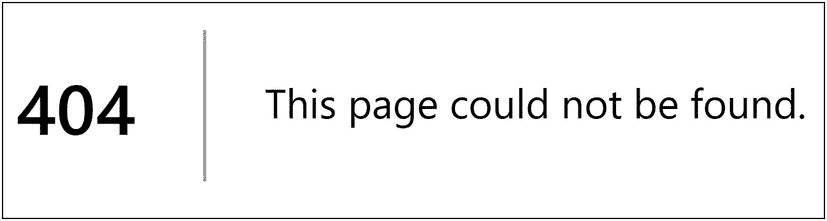

图 3-1

Next.js 应用启动

请注意这个错误页面圆滑且用户友好的设计。这就是 Next.js 处理错误的方式。它还可以处理其他错误，如 500-内部服务器错误。404 错误的原因是我们的应用中没有页面。在应用启动时，Next.js 试图在页面中找到“index.js”文件，并在默认情况下呈现它。在我们的例子中，由于它无法找到它，我们会遇到一个 404 错误。现在让我们创建我们的第一页。使用以下代码将“index.js”文件添加到“pages”文件夹中:

*Pages/index.js*

```jsx
import React from "react";

function MyComponent(){
    return(
        <div>Hello from Next.js!</div>
    );
}

export default MyComponent;

```

现在，如果您使用“`npm start`”命令启动服务器，并浏览到`http://localhost:3000/`或`http://localhost:3000/Index`，您将能够看到您刚刚创建的页面，如图 [3-2](#Fig2) 所示。

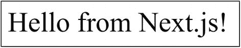

图 3-2

Next.js 的第一页

现在让我们测试内容是否真的在服务器端呈现。如果右键单击页面并查看页面源代码，您会注意到代码中生成的 HTML 内容直接填充到了根 HTML 标记中。这是因为一切都是在服务器端呈现的。如果对使用 plain React.js 构建的应用进行同样的操作，您将会注意到页面源代码中的根 HTML 标记，而不是代码生成的内容。这是因为，在 React.js 应用中，内容是在页面加载后在客户端呈现的。因此，我们可以确信 Next.js 会在服务器端呈现我们的页面。

在下一节中，我们将为我们的应用创建另一个页面，并了解如何使用 Next.js 路由在页面之间导航。

## Next.js 中的路由

到目前为止，我们只有一个页面，但一个应用可能有多个页面，在这些页面之间轻松导航是任何应用的一个重要方面。让我们用下面的代码创建一个“关于”页面:

*Pages/about.js*

```jsx
import React from "react";

function About(){
    return(
        <div>
           This is an application built using next.js to demonstrate the effectiveness of server-side rendering!
        </div>
    );
}

export default About;

```

如果您运行应用并导航到`http://localhost:3000/About`，您将看到您刚刚创建的页面，类似于图 [3-3](#Fig3) 。并不是说您不需要重新启动 npm 进程就可以看到变化。只要您保存了任何更改，Next.js 就会执行热重装，您无需重新启动服务器就可以看到这些更改。但是，您可能需要刷新浏览器页面。

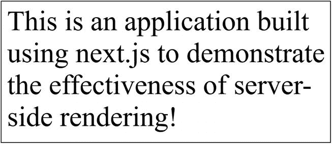

图 3-3

Next.js 中的第二页

现在，为了在两个页面之间建立链接，您可能会想到创建一个锚标记，将页面 URL 传递给“`href`”属性。让我们这样做，看看会发生什么:

*Pages/index.js*

```jsx
import React from "react";

function MyComponent(){
    return(
        <div>
            <p>Hello from Next.js!</p>
            <a href='/About'>About</a>
        </div>
    );
}

export default MyComponent;

```

如果你运行这个应用，你会看到一个“关于”页面的链接。但是，如果您单击该链接，您会注意到整个页面被重新加载。这是因为锚标签向服务器发送新的请求，并且路由将发生在服务器端。这可能会导致性能问题，因此您可能希望保持到客户端的路由。

Next.js 提供了用于为客户端路由创建链接的`<Link>`组件。它是一个可以与任何接受“`onClick`”属性的组件一起工作的包装器。因此，我们将它与一个空的锚标记一起使用。考虑代码中的以下变化:

*Pages/index.js*

```jsx
import React from "react";
import Link from 'next/link'

function MyComponent(){
    return(
        <div>
            <p>Hello from Next.js!</p>
            <Link href='/About'>
                <a>About</a>
            </Link>
        </div>
    );
}

export default MyComponent;

```

为了使用`<Link>`组件，您必须首先从“下一个/链接”模块导入它。在执行前面的代码时，您将得到与图 [3-4](#Fig4) 相同的输出，但是当您单击链接时，您会注意到网络上没有生成额外的服务器请求。你可以在 Chrome 浏览器的开发者工具窗口的“网络”标签中验证这一点。这是因为客户端路由在这里起作用。将预取在<链接>组件中指定的页面，并且导航将在没有服务器请求的情况下发生。

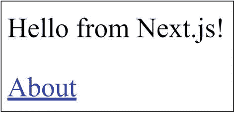

图 3-4

Next.js 中的路由

大多数客户端路由场景都会破坏浏览器导航按钮。然而，Next.js 完全支持历史 API，所以它不会破坏你的浏览器导航按钮。

Note

历史 API 允许您与浏览器历史交互，触发浏览器导航方法，以及更改地址栏内容。这在单页应用中特别有用，在这种应用中，您永远不会真正改变页面，只是内容发生了变化。维护一个栈。每当用户在同一个网站中导航时，新页面的 URL 被放在栈的顶部。每当用户触发浏览器导航按钮时，就会调整栈的指针，并呈现适当的内容。

这就是 Next.js 中的路由。现在让我们看看 Next.js 中的动态页面。

## 动态页面

大多数实时应用都有动态生成的内容。因此，在实际场景中，我们不能依赖静态页面。让我们看看如何为我们的应用生成动态内容。首先，我们将创建一个文件 DynamicRouter.js，它将基于属性创建链接。考虑以下代码:

*shared components/dynamic router . js*

```jsx
import React from "react";
import Link from 'next/link'

function GetLink(props) {
    return (
        <div>
            <Link href=">
                <a>{props.title}</a>
            </Link>
        </div>
    );
}

export default GetLink;

```

*Pages/index.js*

```jsx
import React from "react";
import GetLink from "../SharedComponents/DynamicRouter";

function MyComponent(){
    return(
        <div>
            <GetLink title='Page 1'></GetLink>
            <GetLink title='Page 2'></GetLink>
            <GetLink title='Page 3'></GetLink>
        </div>
    );
}

export default MyComponent;

```

如果您看到浏览器窗口，您会注意到在索引页面上生成了三个链接，如图 [3-5](#Fig5) 所示。但是，这些是空链接，不会导航到任何页面。


图 3-5

Next.js 中的动态链接

现在让我们创建一个页面，它将根据接收到的参数动态显示内容。然后，我们将设置这三个链接，用不同的参数导航到这个动态页面。考虑新页面的以下代码:

*页/秒。js*

```jsx
export default (props) => (
    <h1>
        Welcome to {props.url.query.content}
    </h1>
);

```

*shared components/dynamic router . js*

```jsx
...
<Link href={`/SecondPage?content=${props.title}`}>
    <a>{props.title}</a>
</Link>
...

```

现在，如果你点击链接，你将被重定向到一个动态加载内容的页面，如图 [3-6](#Fig6) 所示。

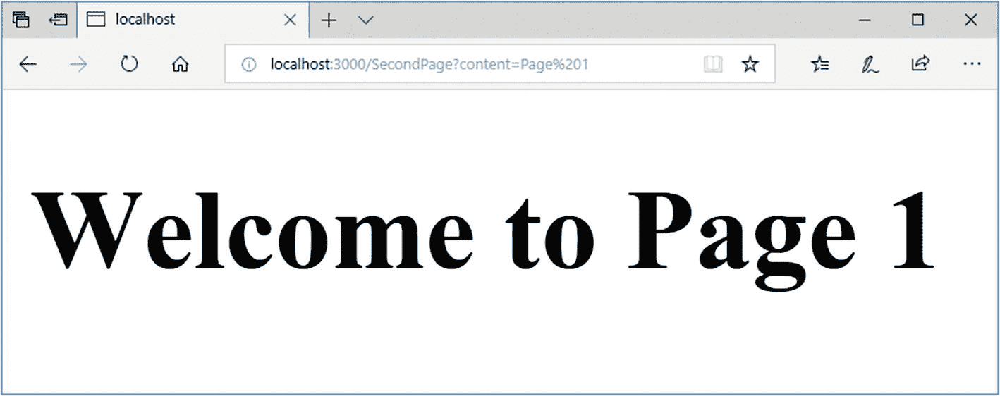

图 3-6

Next.js 中的动态页面

如果您注意到生成的 URL，您会看到查询参数显示在地址栏上。您可能希望用户看到不显示查询参数的干净 URL。这在 Next.js 中可以通过使用“Link”组件的“as”属性来实现。传递给“as”属性的任何内容都将显示在地址栏中。让我们试试这个:

*Pages/index.js*

```jsx
...
      <GetLink title='Page 1' Disp='page-1'>
      </GetLink>
      <GetLink title='Page 2' Disp='page-2'>
      </GetLink>
      <GetLink title='Page 3' Disp='page-3'>
      </GetLink>
...

```

*shared components/dynamic router . js*

```jsx
...
<Link href={`/SecondPage?content=${props.title}`}
      as={props.Disp}>
      <a>{props.title}</a>
</Link>
...

```

现在，如果你点击链接并导航到其中一个页面，你会看到一个没有任何参数的干净的 URL，如图 [3-7](#Fig7) 所示。

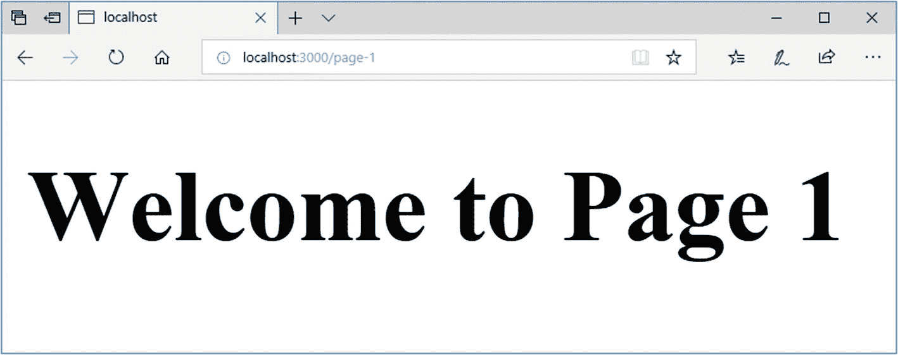

图 3-7

Next.js 页面的自定义 URL

这就是 Next.js 中的动态页面。现在让我们学习如何在 Next.js 应用中处理多媒体内容。

## 使用 CSS 添加多媒体内容

有时，您可能希望在应用中添加多媒体内容，如图像和视频。一般来说，最好在 CSS 本身中添加这些内容的 URL，以便于维护。让我们在索引页面的链接旁边添加图片。我已经下载了三张图片，并将它们添加到应用根目录下的“static/Images”文件夹中。js 提供了一个叫做 JSS(JS 中的 CSS)的东西，它允许我们在 JSX 代码中直接定义样式。让我们将以下代码添加到“index.js”文件中，以便使用 CSS 添加图像:

*index.js*

```jsx
...
return (
 <div>
  ...
  <style jsx global>
  {`
     a{
        color:blue;
     }
     .img{
        height: 50px;
        width: 50px;
        background-size: cover!important;
        background-repeat: no-repeat!important;
        background-position: center!important;
        border: 1px solid black;
        border-radius: 10px;
        display: inline-block;
        margin-top: 10px;
     }
     .p1{
        background: url(../statimg/1.jpg);
     }

     .p2{
        background: url(../statimg/2.jpg);
     }

     .p3{
        background: url(../statimg/3.jpg);
     }
  `}
  </style>
 </div>
);
...

```

既然我们已经定义了样式，我们可能想在我们的页面上使用这些样式。为此，我们需要将“index.js”文件中的类名作为属性传递给`<Link>`组件，并在“`DynamicRouter.js`”文件中使用它来为图像创建一个`<div>`,并为其设置类名。请考虑以下代码更改:

*Index.js*

```jsx
...
  <GetLink title='Page 1'
           Disp='page-1'
           Class='img p1'>
  </GetLink>
  <GetLink title='Page 2'
           Disp='page-2'
           Class='img p2'>
  </GetLink>
  <GetLink title='Page 3'
           Disp='page-3'
           Class='img p3'>
  </GetLink>
...

```

*DynamicRouter.js*

```jsx
...
return (
        <div>
          <div className={props.Class}></div>
          <Link
     href={`/SecondPage?content=${props.title}`}
     as={props.Disp}>
                <a>{props.title}</a>
          </Link>
        </div>
);
...

```

如果保存更改，您将看到类似于图 [3-8](#Fig8) 的浏览器输出。

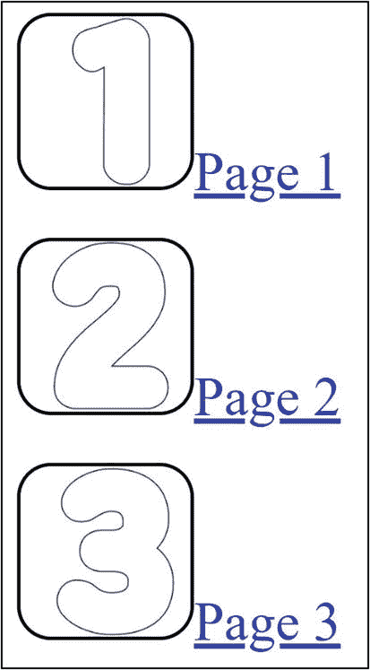

图 3-8

Next.js 中的多媒体内容

您可能希望为所有样式创建一个单独的 CSS 文件。但是，您不能在 Next.js 应用中直接这样做。你必须首先安装一个 CSS 加载器。您可以使用以下命令将@zeit/next-css 模块安装到您的应用中:

```jsx
npm install @zeit/next-css --save

```

安装后，您必须使用以下代码将配置文件“`next.config.js`”添加到应用的根目录中:

*Next.config.js*

```jsx
const withCSS = require('@zeit/next-css')
module.exports = withCSS({})

```

现在，您必须在应用的根目录下创建一个文件“`style.css`”。然后可以从“index.js”文件中删除`<style jsx global>`组件，并将样式表代码移动到“style.css”文件中，如下所示:

```jsx
a{
    color:blue;
}

.img{
    height: 50px;
    width: 50px;
    background-size: cover!important;
    background-repeat: no-repeat!important;
    background-position: center!important;
    border: 1px solid black;
    border-radius: 10px;
    display: inline-block;
    margin-top: 10px;
}

.p1{
    background: url(/statimg/1.jpg);
}

.p2{
    background: url(/statimg/2.jpg);
}

.p3{
    background: url(/statimg/3.jpg);
}

```

请注意，重要的是，您的图像放置在“静态”文件夹中，该文件夹在您的应用中与“页面”文件夹处于同一级别。在您的“index.js”文件中，您将能够使用以下代码行像导入任何其他文件一样导入 CSS 文件:

```jsx
import "../style.css";

```

如果保存更改并转到浏览器窗口，您将看到类似于图 [3-8](#Fig8) 的输出。包括视频在内的所有其他多媒体内容都可以以类似的方式呈现到您的应用中。现在让我们看看如何在 Next.js 应用中从远程服务器获取数据。

## 从远程服务器获取数据

您可能还记得，在前一章中，我们使用 Axios 库来执行 AJAX 请求，以便从远程端点获取数据。我们将在 Next.js 应用中做同样的事情。这里的区别是 AJAX 调用将在服务器端执行，而不是在客户端。首先，我们将使用以下命令将 Axios 库安装到我们的项目中:

```jsx
$ npm install axios

```

一旦安装完毕，我们可以在页面中使用它的`get()`方法从远程端点获取数据。然而，在 Next.js 应用中，事情会有一些变化。之前，我们在组件的`componentDidMount()`方法中执行了 AJAX 调用。但是在这种情况下，我们将使用由 Next.js 提供的特殊方法`getInitialProps()`，它帮助我们设置组件的属性。我们将在`getInitialProps()`方法中启动我们的 Axios 请求。考虑下面的页面，它使用 GitHub 的公共 API 来获取 GitHub 用户列表，并在我们的应用中显示这些用户:

*Pages/GithubUsers.js*

```jsx
import React from 'react'
import axios from 'axios';
import '../style.css';

export default class extends React.Component {
  static async getInitialProps() {
    try {
         const res = await axios.get('https://api.github.com/users');
         return { data: res.data }
       }catch(e){
         return {error:e}
       }
     }

     render() {
       if (this.props.error) {
         return (
           <div>
             Error: {this.props.error.message}
           </div>
         );
       }
       else {
         return (
           <div>
             <h1>Github Users</h1>
             <br />
             {this.props.data.map((item, index) => (
               <div key={index}
className='UserBlock'>
                 
      </img>

                 <div className="UserDetails">
                   <p>Username: {item.login}</p>
                   <p>ID: {item.id}</p>
                 </div>
               </div>
              ))}
           </div>
         );
       }
    }
 }

```

因为 Axios 请求是异步的，所以我们需要一种方法来捕捉可用的响应。之前，我们使用 Axios 库的`get()`方法的`then()`扩展方法来完成这项工作。这一次，我们在 Axios 方法调用中使用了 await 关键字，并将`getInitialProps()`方法标记为异步。async…await 关键字帮助我们处理异步请求，而不必使用回调或承诺，并且对于我们的应用来说很方便。我们将这个请求包装在一个 try…catch 块中，这样我们就可以知道网络上是否发生了错误。一旦请求被处理，我们从`getInitialProps()`方法返回一个包含数据或错误的对象。此方法返回的对象将被设置为 props 对象。在 render 方法中，我们通过使用“`this.props.error`”检查 error 属性来检查错误是否存在。如果是这样，用户将在浏览器上看到一条错误消息，类似于图 [3-9](#Fig9) 。

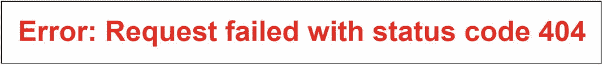

图 3-9

Axios 请求中的错误

如果没有错误，那么我们将使用 JavaScript 的`array.map()`方法迭代“`this.props.data`”对象，并在浏览器上显示 GitHub 用户的详细信息。输出应该类似于图 [3-10](#Fig10) 。

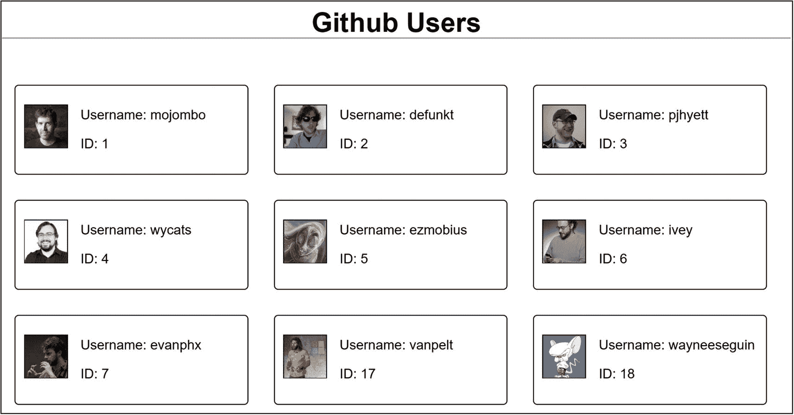

图 3-10

成功的 Axios 请求

如果您的输出与图 [3-10](#Fig10) 中的略有不同，不要担心。您的代码中还缺少一点。我已经在我们之前创建的“style.css”文件中添加了一些样式，并将其导入到我们的页面中。照着做，你就能很好地搭配这个造型了。可以参考下面的样式表代码:

*style.css*

```jsx
body {
    font-family: sans-serif;
}

body div h1 {
    text-align: center;
    border-bottom: 1px solid grey;
}

img {
    height: 50px;
    width: 50px;
    border: 1px solid black;
}

.UserBlock {
    display: inline-block;
    border: 1px solid black;
    border-radius: 5px;
    padding: 10px;
    margin: 15px;
    width: 255px;
}

.UserDetails {
    display: inline-block;
    margin-left: 15px;
}

.error {
    color: red;
    font-weight: bold;
    font-size: 26px;
    text-align: center;
}

```

就这样。您现在可以从任何远程端点获取数据，并在您的应用中使用它。

## 使用 Next.js 创建交互式应用

让我们尝试在应用中添加一些用户交互。我们将从浏览器获得作为文本输入的 GitHub 用户 id，并显示该特定 GitHub 用户的详细信息。为此，我们需要从 props 获取初始数据，并使用构造函数将其设置在我们的状态对象中，就像我们在前一章中对传统的 React 应用所做的那样。这里唯一的区别就是属性会来自`getInitialProps()`法。

Note

我们需要将属性转移到状态对象，因为属性对象是不可编辑的，因此，我们不能直接使用它进行数据操作。

当从浏览器输入一个 id 时，我们将进行一个 API 调用来获取用户详细信息并修改状态对象中的数据。状态对象一改变，React 就会重新渲染 UI。考虑以下代码:

*Pages/GithubUsers.js*

```jsx
import React from 'react';
import axios from 'axios';
import '../style.css';

export default class extends React.Component {

  static async getInitialProps() {
    try {
      const res = await axios.get('https://api.github.com/users');
      return { data: res.data }
    } catch (e) {
      return { error: e }
    }
  }

  constructor(props) {
    super(props);
    this.state = {data: props.data,
                  error: props.error };
  }

  GetUser = async () =>
  {
    try {
      const res = await axios.get('https://api.github.com/users/' + document.getElementById('inputTextbox').value);
      this.setState({
        data: [res.data],
        error: null
      });

    } catch (e) {
      this.setState({
        data: null,
        error: e
      });
    }
  }

  render() {
    if (this.state.error) {
      return(
        <div>
          <h1>Github Users</h1>
          <br />
          <div className="center">
            <input id="inputTextbox" type="text">
            </input>
            <button type="button"
                    onClick={this.GetUser}>
              Get User
            </button>
          </div>
          <br />
          <p className="error">
            Error: {this.state.error.message}</p>
        </div>
       );
    }
    else {
      return (
        <div>
          <h1>Github Users</h1>
          <br />
          <div className="center">
            <input id="inputTextbox" type="text">
            </input>
            <button type="button"
                    onClick={this.GetUser}>
              Get User
            </button>
          </div>
          <br />
          {this.state.data.map((item, index) => (
            <div key={index} className="UserBlock">
              </img>
              <div className="UserDetails">
                <p>Username: {item.login}</p>
                <p>ID: {item.id}</p>
              </div>
            </div>
          ))}
        </div>
      );
    }
  }
}

```

下面是我们在前面的代码中所做的事情的列表:

*   `getInitialProps()`方法获取 Github 用户的初始列表，并返回设置为页面属性的数据。这些属性可以使用“`this.props`”访问，并且不可编辑。

*   方法用作为 props 传递的值初始化状态对象。每当我们获取特定用户请求的 GitHub 用户详细信息时，这个状态对象就会更新。

*   `GetUser()`方法处理按钮的 click 事件，并在每次用户请求特定 GitHub 用户的详细信息时进行 API 调用。GitHub 的用户 id 从输入框中获取，并作为参数发送给 API 调用。用 API 调用返回的数据更新状态对象。状态对象一更新，React 就会重新渲染视图。

*   方法检查状态对象，如果请求成功，则显示用户详细信息，如果请求中有错误，则显示错误消息。

如果您导航到浏览器上的“GithubUsers”页面并搜索有效用户，您将看到该用户的详细信息，如图 [3-11](#Fig11) 所示。

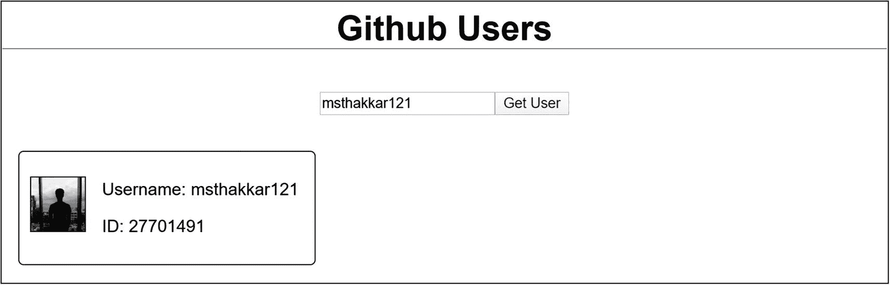

图 3-11

交互式 Next.js 应用

如果您搜索一个不存在的用户，您将看到如图 [3-12](#Fig12) 所示的错误信息。您可以根据自己的喜好定制错误消息。

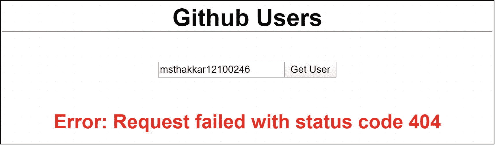

图 3-12

找不到 GitHub 用户

就是这样。我们刚刚创建了一个交互式应用，它使用 Next.js 和 React.js 在服务器端呈现内容。

## 对 Next.js 使用 Redux

市场上的大规模应用大多使用 MVC 架构进行状态管理。然而，在使用客户端库构建的应用中实现 MVC 是一项痛苦的任务，因为与传统 MVC 中的中心模型不同，客户端应用中的状态分散在页面上，而不是在应用级别。为了在客户端库中实现 MVC 风格的状态管理，我们使用 Redux。Redux 的架构如图 [3-13](#Fig13) 所示。

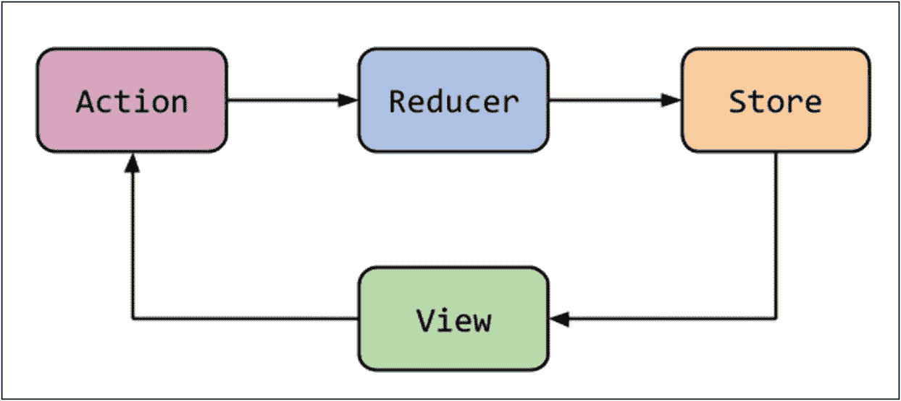

图 3-13

Redux 架构

为了理解 Redux 架构，您需要知道以下内容:

*   视图触发一个动作，该动作在 Reducers 的帮助下更新存储。然后，存储隐式地将更新后的数据发送回视图。

*   动作将信息传递给缩减器，然后缩减器根据收到的信息决定在存储中更新什么数据。

*   商店可以被视为应用级别的状态对象。此对象中的更改将触发视图更新。

*   动作是特殊的方法，每当视图中的变化触发这些方法时，它们就更新应用状态。

*   与传统的 MVC 模式不同，这里的数据流是单向的。这意味着商店不能触发任何操作。只有视图可以触发操作。这大大降低了无限循环的可能性。

当我们开始用一个例子工作时，你会更好地理解它。让我们看看 Redux 的三个基本原则:

1.  **单一事实来源**–整个应用的状态驻留在单一存储对象中。

2.  **状态是只读的**–改变状态的唯一方法是触发一个动作。视图没有直接更新状态的权限。它们触发一个动作，告诉 Reducer 更新状态。这确保了对状态的所有更改都集中地一个接一个地发生，以便出于调试目的可以跟踪它们。

3.  **用纯函数进行修改**–为了指定状态如何被动作修改，编写了纯 Reducers。这些函数将当前状态和动作作为输入，并将下一个状态作为输出返回。还记得我们在上一章学习的作为 React 基本概念的纯度概念吗？这正是减肥药所坚持的。因为它们是纯函数，所以要确保它们返回一个新的状态对象，而不是修改现有的状态对象。

Note

纯函数从不修改输入参数的值。而是在每次被调用时返回一个新的对象。此外，无论您调用一个 pure 函数多少次，对于相同的输入参数集，它总是返回相同的输出。最后，一个纯函数只依赖于它的输入参数，从不修改它范围之外的任何东西。

让我们更详细地了解一下存储、归约器和动作。

### 商店

Store 是存储整个应用状态的对象。如前所述，它是“真理的唯一来源”。使用以下代码片段可以轻松创建商店:

```jsx
import {createStore} from 'redux';
import reducer from 'reducer';

const store = createStore(reducer);

```

以下是 Store 对象提供的一些方法:

*   **store . getstate()–**该方法返回当前状态。

*   **store . dispatch(action)–**通过调度动作来更新状态。将使用当前状态和动作调用与商店相关联的 Reducer 函数。它的返回值将被认为是下一个状态。一旦状态改变，改变监听器也将被立即通知。

*   **store . subscribe(listener)–**用于向状态添加一个更改监听器。您可以将函数作为参数传递。每次调度动作时都会调用这个函数。您可以在侦听器中使用 getState()方法来获取更新后的状态值。

*   **unsubscribe()–**当状态改变时，如果不想再调用监听器方法，就使用这个方法。当您订阅侦听器时会返回此方法，因此您可能希望在订阅期间将它保存在一个变量中，以便能够取消订阅。考虑下面的代码片段:

```jsx
// Subscribing
const unsubscribe = store.subscribe(someListener);

// Unsubscribing
unsubscribe();

```

### 行动

动作是将数据从应用发送到商店的信息负载。它们是普通的 JavaScript 对象，包含一个类型和一个可选的有效载荷。他们是商店唯一的信息来源。下面的代码片段演示了如何创建和调度一个操作:

```jsx
...
const action = {
  type: 'Multiply',
  payload: { value: 10 },
};
store.dispatch(action)

```

Redux 没有严格的规则集来定义您的操作。这意味着，除了“`type`”属性之外，你如何构造你的动作完全取决于你自己。您可以直接在 Action 对象中定义“`value`属性，而不是在“`payload`属性中定义。事实上，您可以定义自己的属性和值。但是在“`payload`”属性中定义您的所有属性是推荐的方法之一。

### 还原剂

Reducers 是指定状态如何根据由动作分派的信息的类型和有效负载而改变的函数。这些函数将当前状态和动作作为输入参数，在处理信息后生成一个新状态，并将这个新状态作为输出返回。现在，即使我们整个应用的状态是一个单一的 Store 对象，我们也可能想要编写多个 Reducers 来修改这个对象。Redux 为您提供了这样做的灵活性。您可以为每个场景编写一个小的缩减器，而不是编写一个处理所有场景的缩减器函数。这将帮助我们最小化代码的复杂性。

Note

因为所有的动作都是顺序执行的，所以我们永远不会面临多个 reducers 试图同时修改状态的情况。

以下是返回初始状态的示例 Reducer 函数的代码片段:

```jsx
function sampleReducer(state, action) {
  return state
}

```

让我们创建一个基本的例子来理解 Redux 的概念。首先，我们将使用以下命令将 redux 安装到我们的应用中:

```jsx
npm install redux --save

```

完成后，我们将创建两个单独的文件夹——“Actions”和“Reducers”。让我们修改“pages”文件夹中的“index.js”文件。我们将有一个输入框，一个按钮，和一个标签。单击按钮时，应该用输入框中的值更新状态，标签应该用状态值更新自身。将为状态设置一些初始值。考虑以下代码:

*Pages/index.js*

```jsx
import React from "react";
import '../style.css';

export default class extends React.Component {
  static async getInitialProps() {
    return { text: 'Initial label value.' }
  }

  constructor(props) {
    super(props);
    this.state = { text: props.text };
  }

  render() {
    return(
      <div>
        <h1>Redux Demo</h1>
        <br />
        <div className="center">
          <input id="inputTextbox" type="text">
          </input>
          <button type="button"
              onClick={this.GetUser}>
              Update Label
          </button>
        </div>
        <br />
        <p>{this.state.text}</p>
      </div>
    );
  }
}

```

如果您在浏览器中访问该页面，您将看到类似于图 [3-14](#Fig14) 的输出。

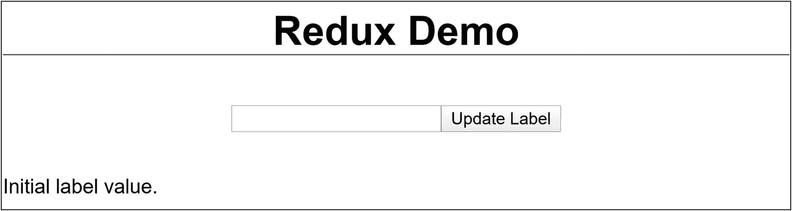

图 3-14

Redux 演示

请注意，我们刚刚创建了一个带有标签使用的初始状态值的页面。我们使用`getInitialProps()`方法传递一个静态字符串作为属性。在构造函数中，我们获取这个属性的值，并将其设置为状态。请注意，我们没有编写任何更改更新状态的逻辑。我们将使用 Redux 来实现。但是在我们这样做之前，我们必须安装一些依赖项来帮助我们。使用以下命令执行相同的操作:

```jsx
npm install redux react-redux next-redux-wrapper redux-thunk redux-devtools-extension --save

```

我们总共安装了五个新的依赖项。我们已经拥有的其他依赖项有`react`、`react-dom`、`next`、`axios`和`@zeit/next-css`。安装新的依赖项后，我的“package.json”如下所示:

*package.json*

```jsx
{
  "name": "my-next-app",
  "version": "1.0.0",
  "description": "My Next.js Application",
  "main": "index.js",
  "scripts": {
    "start": "next"
  },
  "author": "Mohit Thakkar",
  "license": "ISC",
  "dependencies": {
    "@zeit/next-css": "^1.0.1",
    "axios": "^0.19.0",
    "next": "^9.1.6",
    "next-redux-wrapper": "^4.0.1",
    "react": "^16.12.0",
    "react-dom": "^16.12.0",
    "react-redux": "^7.1.3",
    "redux": "^4.0.5",
    "redux-devtools-extension": "^2.13.8",
    "redux-thunk": "^2.3.0"
  }
}

```

如果您正在从头开始创建一个新的应用，请确保您更新了前面代码片段中提到的“package.json ”,并从终端运行“`npm install`”命令来更新依赖项。是时候创建我们的第一个动作了。我在应用的根目录下创建了一个“Actions”文件夹，其中包含我们的操作。考虑以下代码:

*Actions/**Actions . js*

```jsx
export const InitialState = {
    text: 'Initial label value.'
}

export const changeState = () => dispatch => {
 return dispatch({
  type:'ChangeLabel',
  text: document.getElementById('inputTextbox').value
 })
}

```

这里，我们定义了一个`InitialState`，它是一个普通的 JavaScript 对象，以及一个在点击按钮时用输入文本更新状态值的动作。我们将在 Reducer 函数中直接使用`InitialState`对象，在第一次创建商店时也是如此。我们稍后会看到。然而，为了更新状态，我们必须向 Reducer 发送一个动作。为此，我们创建了一个方法，`changeState()`，它将在按钮点击时被调用。这个方法调度我们的动作。

对于我们正在调度的操作，我们已经定义了一个强制的"`type`"属性，它决定了正在执行的操作的类型，还定义了一个"`text`"属性，它将新数据发送到 reducer。是时候创建我们的 Reducer 函数了，它将基于从动作接收到的数据来更新存储。我在应用的根目录下创建了一个“Reducers”文件夹，其中包含了我们的 reducer。考虑以下代码:

*减速器/* *减速器. js*

```jsx
import { InitialState } from '../Actions/actions'

export const reducer = (state = InitialState, action) => {
  if (action.type == 'ChangeLabel') {
    return Object.assign({}, state, {
      text: action.text
    })
  }
  else {
    return state;
  }
}

```

如前所述，减速器接受两个输入参数——当前状态和动作。在定义我们的缩减器时，我们将“`InitialState`”指定为第一个输入参数 state 的默认值。如果 reducer 在空状态下被触发，我们的“`InitialState`”对象中定义的初始状态值将被设置为该状态。

Note

“InitialState”是从我们的操作文件中导入的，它与我们之前创建的对象相同。

如果动作的类型是“`ChangeLabel`”，reducer 将知道状态值需要用动作分派的数据来更新。在这种情况下，Reducer 函数创建一个新的对象，将当前状态值赋给该对象，并用动作分派的新值替换“text”属性的值。这个新对象将被 Reducer 返回，并被视为应用的新状态。React 将在检测到状态变化时自动更新视图。因此，一旦执行了 Reducer，视图就会反映状态的变化。我们没有定义任何其他动作，所以如果动作的类型不是“`ChangeLabel`”，我们将只返回收到的状态对象。现在是时候编写第一次创建我们的商店的代码了。我在应用的根目录下创建了一个“`Store`”文件夹，其中包含我们的商店初始化代码。考虑以下代码:

*Store/*T2【Store . js

```jsx
import { createStore, applyMiddleware } from 'redux'
import thunkMiddleware from 'redux-thunk'
import { reducer } from '../Reducers/reducer'
import { InitialState } from '../Actions/actions.js'

export const initStore = (initialState = InitialState) => {
  return createStore(
    reducer,
    initialState,
    applyMiddleware(thunkMiddleware)
  )
}

```

这里，我们再次使用了在我们的 Actions 文件中创建的“`InitialState`”对象，这一次，当第一次创建存储时，用初始应用状态初始化存储。`createStore()`是由“redux”库提供的方法，以便第一次创建和初始化 Redux 存储。

Note

你的应用中应该只有一个商店。

我们将以下三个参数传递给`createStore()`方法:

*   `reducer (Function)`–这是我们为商店创建的减压器功能。给定当前状态和一个操作，它返回下一个应用状态。

*   这是我们应用的初始状态。它是我们在动作文件中创建的普通 JavaScript 对象。

*   `enhancer (Function)`–您可以选择指定一些使用第三方代码的功能来增强您的应用。在我们的例子中，我们使用了“redux-thunk”库提供的“thunkMiddleware”。这个中间件帮助我们编写与存储交互的异步逻辑。对于没有这个中间件的基本 Redux 存储，我们将只能通过分派一个动作来执行对存储的同步更新。我们将使用“redux”库提供的 applyMiddleware()将“thunkMiddleware”转换为增强器。

请注意，商店尚未创建。我们刚刚定义并导出了“`initStore`”函数，可以调用该函数来创建商店。

您一定已经注意到，我们已经创建了使用 Redux 执行状态管理所需的一切。是时候在我们的应用生命周期中注入 Redux 功能了。为此，我们将不得不使用“`react-redux`”库，它是我们之前作为依赖项之一安装的。这是 Redux 的官方 React 绑定。它帮助 React 组件从 Redux 存储中读取数据，并将操作分派给存储以更新数据。因为我们需要我们的状态对象在整个应用中都可用，所以我们必须将它注入到一个组件中，其余的组件都是从这个组件继承的。该父组件可以被称为高阶组件(HOC)。在 Next.js 中，我们可以创建一个特殊的组件“`_App.js`”，它包装了所有的页面，并可用于共享整个应用中常见的内容。我们将使用这个“`_App`”组件向应用生命周期注入 Redux。使用以下代码将`"_App.js"`文件添加到“Pages”文件夹中:

*页/_App.js*

```jsx
import React from 'react'
import { Provider } from 'react-redux'
import App from 'next/app'
import withRedux from 'next-redux-wrapper'
import { initStore } from '../Store/store'

export default withRedux(initStore)(
  class MyApp extends App {
    static async getInitialProps({ Component, ctx }){
      return {
        pageProps: Component.getInitialProps
          ? await Component.getInitialProps(ctx)
          : {},
      }

    }

    render() {

      const { Component, pageProps, store } = this.props

      return (
        <Provider store={store}>
          <Component {...pageProps} />
        </Provider>
      )
    }
  }
)

```

这里，我们已经创建了一个组件，它被包装在一个特殊的`withRedux()()`包装器中，这个包装器是由“next-redux-wrapper”库提供的，我们之前把它作为一个依赖项安装的。作为这个包装器的第一个输入，我们传递创建初始存储的方法，在我们的例子中是来自“T2”的“T1”。这个包装器的第二个输入是我们的高阶组件(HOC)。

该组件从“下一个”库提供的“应用”组件扩展而来。这是 Next.js 用来初始化页面的组件。因为我们覆盖了页面的默认初始化，所以我们必须在组件中编写`getInitialProps()`方法，并让它调用页面的`getInitialProps()`方法。它接受两个参数——“组件”和“ctx”。“组件”是页面组件，“ctx”是上下文。如果页面的`getInitialProps()`方法返回任何数据，我们从我们的 HOC 的`getInitialProps()`方法返回该数据，否则我们返回一个空对象。

然后我们写我们的 HOC 的`render`()方法。在 Props 对象中我们已经有了 Component 和 PageProps。Component 是正在呈现的页面的页面组件，PageProps 是我们在该页面中拥有的属性。因为我们将我们的 HOC 封装在一个 Redux 包装器中，所以当执行`getInitialProps()`方法时，Store 对象也被创建并传递给`render()`方法。我们已经指定了创建初始存储的方法。同样的将被用来创建商店，并通过它到特设属性。我们将使用析构语法从 Props 对象中获取 Component、pageProps 和 store 的值。

我们将使用“`react-redux`”库提供的`<Provider>`组件来包装我们的页面组件。我们将把 Store 对象传递给这个组件，它将对我们所有的容器组件可用。在这个组件中，我们将放置页面组件，并将页面属性传递给它。页面组件将根据所呈现的页面动态地保持变化。

这就是如何使用高阶组件(HOC)将 Redux 注入下一个. js 生命周期的方法。现在让我们在索引页面中使用我们的商店，并在点击按钮时发送一个动作。您必须对“index.js”文件进行以下修改:

*Pages/index.js*

```jsx
import React from "react";
import "../style.css";
import { connect } from 'react-redux'
import { bindActionCreators } from 'redux'
import { changeState } from '../Actions/actions'

class ReduxDemo extends React.Component {

  render() {
    return (
      <div>
        <h1>Redux Demo</h1>
        <br />
        <div className="center">
          <input id="inputTextbox" type="text">
          </input>
          <button type="button"
              onClick={this.props.changeState}>
              Update Label
          </button>
        </div>
        <br />
        <p>{this.props.text}</p>
      </div>
    );
  }
}

const mapDispatchToProps = dispatch => {
  return {
    changeState: bindActionCreators(changeState, dispatch)
  }
}

export default connect((state) => ({ text: state.text }), mapDispatchToProps)(ReduxDemo)

```

你一定已经注意到我们已经从代码中移除了`getInitialProps()`方法。这是因为属性现在将使用由“`react-redux`”库提供的特殊“`connect()()`”包装器来注入。第一个参数包含要注入到页面中的与状态相关的实体，第二个参数是页面本身。我们正在注入驻留在状态对象中的文本属性。我们还注入了用于调度修改 Store 对象的操作的方法。我们通过使用“`this.props.changeState`”在页面中访问按钮，将该方法传递给按钮的 click 事件。我们还使用“`this.props.text`”将标签(

)绑定到“

”、“状态对象的属性”。如果您执行应用并访问浏览器，您将看到类似于图 [3-14](#Fig14) 的输出。以下是运行应用时发生的事情的顺序列表:

*   当浏览器第一次请求页面时，`"_App.js"`中编写的代码被执行。

*   用初始值创建商店对象，并将其注入页面。`initStore()`首次使用方法创建商店。我们已在“`Store/store.js`”中定义了该方法，并在特设中提供了参考。

*   `"_App.js"`中的 HOC 呈现页面组件。现在控制转移到“Pages/index.js”文件中编写的代码。

*   "`connect()()` " wrapper 通过 props 将状态数据注入页面。更新状态值的方法也作为 props 传递。然后，页面就像普通的 Next.js 页面一样呈现出来。您将看到标签上显示的初始状态值。

*   只要你输入一些文本并点击按钮，就会调用“Actions/action.js”中定义的`changeState()`方法。

*   该方法将使用您在输入框中输入的文本作为数据来调度类型为"`ChangeLabel`"的操作。

*   现在，控制将被转移到写在“`Reducers/reducer.js`”的 Reducer 方法。在检查了动作的类型之后，Reducer 将使用动作分派的数据更新 State 中的“text”属性。

*   一旦状态对象被更改，React 将重新呈现视图，并更新其数据已被修改的所有字段。因此，UI 上绑定到状态的“text”属性的标签将被重新呈现，您将在 UI 上看到更新后的值。

注意，我们没有在页面中的任何地方直接使用 React 的内置状态对象。这里所有的状态管理都是由 Redux 完成的。这就是关于 Redux 的工作。现在让我们了解一下 GraphQL，以及如何在 Next.js 应用中使用它。

## 将 GraphQL 与 Next.js 一起使用

GraphQL 是 API 的查询语言。它给了客户确切地提出要求的权力。我们可以向 API 发送一个 GraphQL 查询，并向服务器传达我们在响应中需要的确切字段。请看图 [3-15](#Fig15) 以便更好地理解。

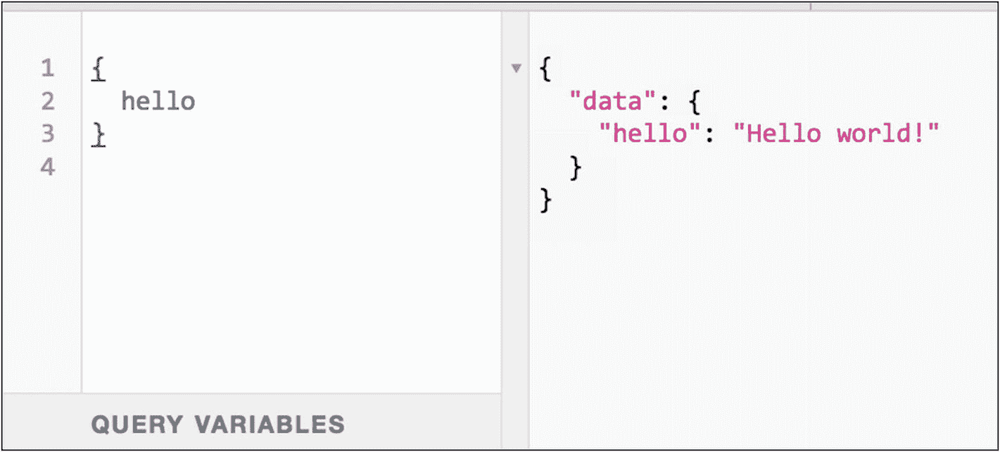

图 3-15

GraphQL 查询变量

图 [3-15](#Fig15) 完美的描绘了 GraphQL 的概念。一个 API 可能返回多个参数，但是我们的应用可能不需要所有这些参数。在这种情况下，我们可以发送我们需要的参数名作为查询变量，API 将返回同样多的参数。

为了理解工作中的 GraphQL，我们必须首先在我们的应用中创建一个常规 API 并使用它。然后我们将看到如何将 GraphQL 与该 API 一起使用。Next.js 为在应用中构建 API 提供了一个简单的解决方案。“Pages/api”文件夹中的所有文件都被视为 api 端点，而不是页面，可以在“/API/∫”处使用。为了让 API 工作，您必须从您的文件中导出一个请求处理程序，它只是一个接受以下两个参数的函数:

*   **req**–传入请求的一个实例。您可以使用这个对象来标识请求类型、输入参数、请求头和生成请求的 URL 等。

*   **RES**–传出响应的实例。您可以使用此参数设置响应的状态代码、标头和数据。

让我们从一个只有索引页面的基本 Next.js 应用开始。我们将创建“Pages/api”文件夹，并添加我们的第一个 API“testapi . js”文件，代码如下:

*页/API/test pi . js*

```jsx
const data = {
    name: 'Jhon Doe',
    address: '7th Avenue, Brooklyn',
    contact: '099251456',
    bloodgroup: 'A +ve',
    favouriteSnack: 'Hotdog',
    vehicle: 'Hyundai Tucson'
  }

export default (req, res) => {
    res.statusCode = 200
    res.setHeader('Content-Type', 'application/json')
    res.end(JSON.stringify(data))
}

```

我们在这里做的是定义一个静态数据对象并发送它作为响应。我们在响应的`end()`方法中传递这些数据。这个方法向服务器发出信号，表明已经设置了响应头和响应体，服务器应该认为这个响应是完整的。我们可以通过在浏览器中访问 URL“`http://localhost:*/api/testapi`”来使用这个 API。或者，我们可以在索引页面中使用这个 API。让我们使用下面的代码来实现它:

*页/* *索引. js*

```jsx
import React from "react";
import axios from 'axios';
import "../style.css";

export default class extends React.Component {
  static async getInitialProps() {
    try {
      const res = await axios.get('http://localhost:3000/api/testapi');
      return { data: res.data, error: null }
    } catch (e) {
      return { data: ", error: e }
    }
  }
  render() {
    return (
      <div>
        <h1>Hello, world!</h1>
        <table>
          {Object.keys(this.props.data).map((key, index) => (
            <tr key={index}>
              <td>{key}:</td>
              <td>{this.props.data[key]}</td>
            </tr>
          ))}
        </table>
      </div>
    );
  }
}

```

我们使用页面的 getInitialProps()方法中的 Axios 库向 API 发出请求。然后，我们将 API 响应作为属性发送到页面的其余部分。在 render 方法中，我们迭代数据并将其呈现给浏览器。很简单。我们已经创建了一个 API 并使用它。您将看到类似于图 [3-16](#Fig16) 的输出。

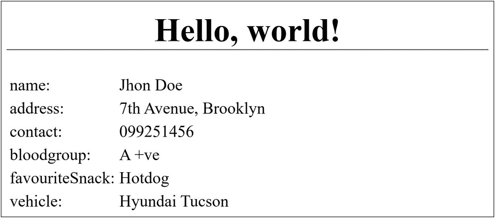

图 3-16

Next.js API 响应

现在让我们考虑一个场景，我们只需要 API 中的姓名和地址字段。目前，您必须从 API 获取所有数据，然后在消费端缩小所需的字段。然而，使用 GraphQL 有一种更好的方法来处理这种情况。让我们使用以下命令将 GraphQL 库安装到我们的应用中:

```jsx
npm install graphql --save

```

我们现在必须稍微修改一下我们的 API。我们将为我们的数据定义一个模式。该模式将指定我们将从 API 返回的数据类型。然后，我们将模式、GraphQL 查询和数据对象传递给 GraphQL，graph QL 将根据收到的查询为我们过滤数据。考虑以下 API 代码:

*页/API/**test pi . js*

```jsx
import { graphql, buildSchema } from 'graphql'

const schema = buildSchema(`
  type Query {
    name: String,
    address: String,
    contact: String,
    bloodgroup: String,
    favouriteSnack: String,
    vehicle: String
  }
`);

const data = {
    name: 'Jhon Doe',
    address: '7th Avenue, Brooklyn',
    contact: '099251456',
    bloodgroup: 'A +ve',
    favouriteSnack: 'Hotdog',
    vehicle: 'Hyundai Tucson'
}

export default async (req, res) => {
    const response = await graphql(schema, req.body.query, data);
    res.end(JSON.stringify(response.data))
}

```

是 GraphQL 提供的帮助我们构建模式的方法。它是我们的数据对象中的每个属性与其对应的数据类型的映射。我们将从请求中获取 GraphQL 查询。然后，我们将模式、查询和数据传递给 GraphQL，并等待过滤后的响应。最后，我们将把响应发送给用户。为了从消费端使用 GraphQL，您需要做的就是在您的 Axios 请求中添加一个“query”参数。将索引页中的 Axios 调用替换为以下内容:

```jsx
...
const res = await axios.get('http://localhost:3000/api/testapi', { data: { query: `{ name, address }` }});
...

```

如果在所有的更改之后，您访问我们的应用的索引页面，您将看到类似于图 [3-17](#Fig17) 的输出。您会注意到只显示了两个字段，而不是之前显示的所有字段。这就是 GraphQL 在我们的应用中的作用。

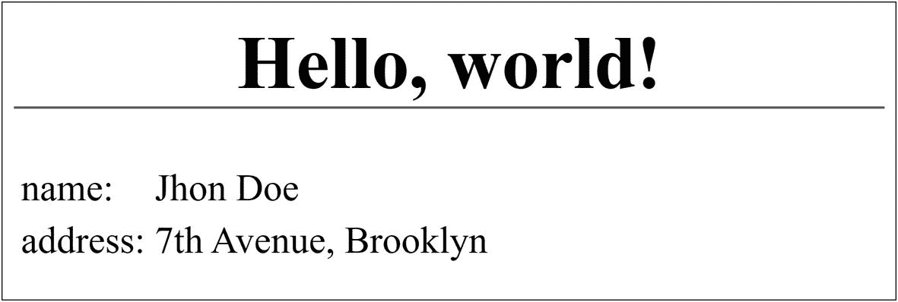

图 3-17

GraphQL API 响应

这就是 GraphQL。随着这个话题的结束，我们来到本章的结尾。让我们总结一下我们所学到的东西。

## 摘要

*   Next.js 是一个帮助我们在服务器端呈现应用的框架。

*   它解决了诸如加载时间长、索引能力差以及与客户端渲染相关的安全漏洞等问题。

*   它提供了热重载、基于页面的路由、自动代码分割、页面预取、热模块替换和服务器端呈现等功能。

*   Next.js 提供了<link>组件，帮助我们向应用添加链接。当我们导航到这样的链接时，不会对资源发出额外的服务器请求。这要归功于 Next.js 的客户端路由功能。

*   由于使用了历史 API，Next.js 中的客户端路由不会破坏浏览器的后退按钮。

*   我们应该在应用根目录的“static”文件夹中添加媒体文件。向我们的应用添加多媒体内容的最佳方法是在 CSS 文件中添加这些内容的 URL。

*   js 提供了 JSS(JS 中的 CSS ),允许我们直接在 JSX 代码中定义样式。我们将不得不在我们的应用中使用@zeit/next-css 库(或任何其他 css 加载器)来在单独的 CSS 文件中编写样式代码。

*   我们可以在页面中使用 getInitialProps()方法将属性传递给组件。我们可以在这个方法中调用 Axios API 来从远程服务器获取页面数据。作为 props 传递的数据可用于初始化构造函数中的状态对象。

*   Redux 可以在 Next.js 应用中使用，以便在应用级别管理状态。它使用动作、缩减器和存储来模仿 MVC 架构。

*   我们使用高阶组件(HOC)将 Redux 注入下一个. js 生命周期。

*   可以在 Next.js APIs 中使用 GraphQL，为客户端提供查询响应中所需字段的能力。