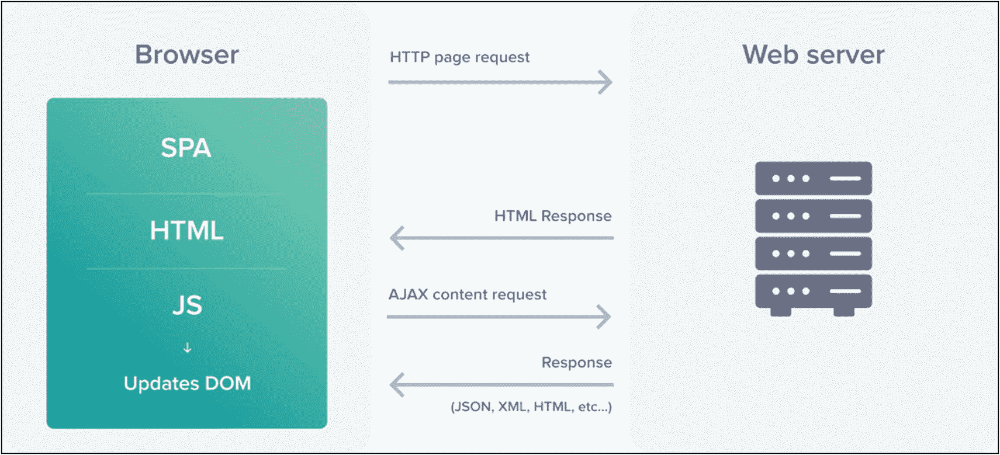
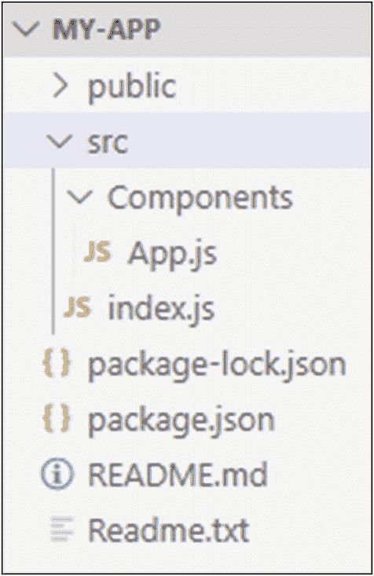
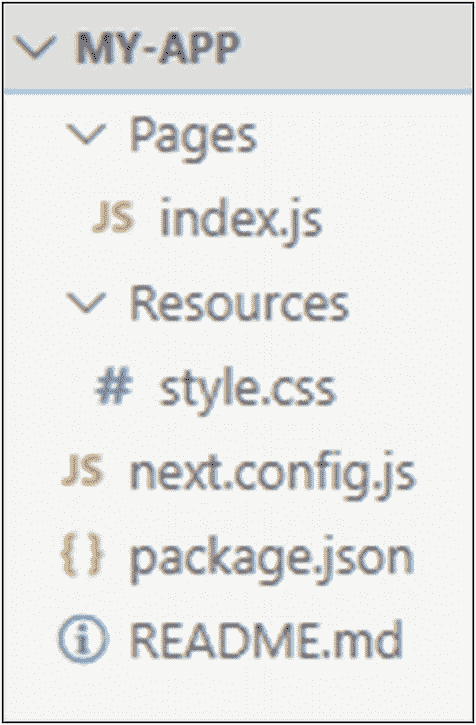
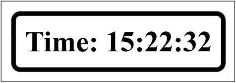

# 四、向 React 应用添加服务器端呈现

在前一章中，我们学习了如何使用 Next.js 框架创建服务器端应用。但是，我们可能希望创建一个部分在客户端呈现，部分在服务器端呈现的应用，这样我们就可以利用客户端呈现和服务器端呈现的优势。在本章中，我们将创建一个客户端渲染的 React 应用，并学习如何使用 Next.js 框架将服务器端渲染集成到应用中。在这个过程中，我们还将学习服务器端渲染的重要性，设计我们的应用，为我们的应用添加引导程序，以及其他一些主题。大多数情况下，我们将使用我们之前已经学过的东西来创建一个功能应用。

## 服务器端渲染的重要性

在前一章中，我们讨论了与客户端渲染相关的问题。在单页应用(SPA)的开发过程中面临的主要问题是。尽管 spa 提供了惊人的用户体验，但所有这些都是基于浏览器的。用户停留在同一个页面上，而不是从一个页面导航到另一个页面，并且页面上的内容基于用户交互而动态变化。这些更改是由浏览器使用客户端编写的 JavaScript 代码完成的。

虽然这是在应用启动并运行后更改页面的一个很好的方法，但对于第一次加载应用来说，这不是一个推荐的方法。在 SPA 可供用户交互之前，浏览器需要进行大量处理。此外，web 服务器和用户浏览器之间需要多次交互。正如您在图 [4-1](#Fig1) 中看到的，当用户第一次访问应用时，一个请求被发送到 web 服务器以获取页面。服务器返回一个 HTML 页面，其中包含一个空的根元素(< div >)和一些 JavaScript 代码。然后，浏览器发送更多对数据、样式表、脚本文件和其他可能需要的资源的请求。一旦所有的资源对浏览器可用，它就处理 JavaScript 代码，以确保 JSX 代码被正确编译，JSON 数据使用 REST API 调用被加载，所有的事件被绑定，承诺被履行。只有这样，用户才可以使用该页面。



图 4-1

单页应用的客户端呈现

Note

不要混淆用于客户端渲染的服务器和用于服务器端渲染的服务器。这里使用的 web 服务器可以称为“瘦服务器”。这是因为，在客户端呈现的情况下，所有的逻辑都是以 JavaScript 代码的形式编写的，这些代码将由浏览器处理。服务器充当纯数据 API，只是将 JavaScript 代码交付给浏览器。另一方面，在服务器端呈现的情况下，服务器处理所有的逻辑，并向浏览器提供一个随时可以呈现的 HTML 页面。

采用这种方法可能会花费大量的时间，并由于页面加载时的等待而导致糟糕的用户体验。这就是服务器端渲染介入的地方。我们可以在服务器端准备初始页面，并将其提供给用户的浏览器，然后浏览器可以轻松地下载页面并呈现它。这样，初始应用加载可以通过一个 web 请求来执行。在前一章中，我们已经学习了如何使用 Next.js 进行服务器端渲染。在本章的后面，我们将会看到如何使用客户端渲染和服务器端渲染来创建一个全功能的应用。让我们从创建一个简单的 React 应用开始。

## 构建一个简单的 React 应用

我们将创建一个简单的应用，在浏览器上显示时间。使用以下命令创建一个 starter React 应用:

```jsx
npx create-react-app my-app

```

成功执行该命令后，导航到“my-app”文件夹，从“src”目录中删除除“index.js”文件之外的所有文件。用以下代码替换“index.js”文件中的代码:

```jsx
import React from 'react';
import ReactDOM from 'react-dom';

ReactDOM.render(<h1>Hello from React.</h1>, document.getElementById('root'));

```

在使用“`npm-start`”命令执行应用时，您应该会看到“Hello from React”打印在您的浏览器窗口上。我们的 starter React 应用已经启动并运行。现在让我们在 React 组件的帮助下完成这项工作。

## 创建功能 React 组件

我们的组件文件将位于应用根目录下的“src/Components”文件夹中。让我们使用以下代码将“App.js”文件添加到“Components”文件夹中:

*src/Components/App.js*

```jsx
import React from 'react';

function App(){
 return(
   <div>
     <h1>Hello from React.</h1>
   </div>
 );
}

export default App;

```

我们还需要对“index.js”文件进行一些修改，以便呈现组件，而不是直接呈现 JSX 代码。按照以下代码更新“index.js”文件:

*src/index.js*

```jsx
import React from 'react';
import ReactDOM from 'react-dom';
import App from './Components/App';

ReactDOM.render(<App/>, document.getElementById('root'));

```

如果您运行应用并访问浏览器，您应该会看到“React 的 Hello”印在窗户上。到目前为止，我们还没有在浏览器上显示时间。让我们使用 React 属性来实现这一点。

## 将属性传递给功能 React 组件

我们将简单地把当前时间作为属性传递给 App 组件。该组件将从 props 中获取值，并将其呈现给浏览器。这很简单。让我们通过如下方式修改代码来实现这一点:

*src/Components/App.js*

```jsx
import React from 'react';

function App(props){
 return(
   <div>
     <h1>Time: {props.time}</h1>
   </div>
 );
}

export default App;

```

*src/index.js*

```jsx
import React from 'react';
import ReactDOM from 'react-dom';
import App from './Components/App';

ReactDOM.render(
  <App time={new Date().toLocaleTimeString()}/>,
  document.getElementById('root')
);

```

如您所见，我们将时间字符串作为属性传递给了组件，然后呈现给浏览器。然而，React 还不会更新 DOM，因为我们已经传递了一个静态时间字符串，React 还不知道时间何时改变。为了实现这个功能，我们将不得不编写一些 JavaScript 代码来随着实际时间的流逝更新存储在“props”中的时间。但是我们不能这样做，因为“属性”是只读的。因此，我们将不得不使用 React 生命周期提供的“状态”功能。

## 将功能组件转换为类组件

让我们将函数组件转换成类组件。一旦我们这样做了，我们将能够使用 React 的“state”属性来跟踪时间的变化。我们的应用的当前目录结构如图 [4-2](#Fig2) 所示。



图 4-2

当前目录结构

您必须对代码进行以下更改:

*src/Components/App.js*

```jsx
import React from 'react';

class App extends React.Component {
  constructor(props) {
    super(props);
    this.state = {
      time: new Date().toLocaleTimeString()
    }
  }

  tick() {
    this.setState(() => {
      return ({
        time: new Date().toLocaleTimeString()
      });
    });
  }

  componentDidMount() {
    this.timer = setInterval(() => this.tick(), 1000);
  }

  componentWillUnmount(){
    clearInterval(this.timer);
  }

  render() {
    return (
      <div>
        <h1>Time: {this.state.time}</h1>
      </div>
    );
  }
}

export default App;

```

*src/index.js*

```jsx
import React from 'react';
import ReactDOM from 'react-dom';
import App from './Components/App';

ReactDOM.render(<App/>, document.getElementById('root'));

```

如您所见，我们不再将时间字符串作为属性传递给组件。我们在类组件的构造函数中将 state 属性设置为当前时间。然后我们使用 render 方法将其呈现给浏览器。这里唯一的区别是，我们现在从“状态”中获取值，而不是从“`props`”中获取值。使用“`state`”属性是必要的，因为正如我们前面讨论的，“`props`”是只读的，我们不能直接修改它们。

接下来，我们必须找到一种方法来随着时间的变化更新状态属性。为此，我们使用 JavaScript 的`setInterval()`方法创建了一个间隔。我们在 React 生命周期的`componentDidMount()`方法中这样做，是为了确保只有在组件被挂载到 DOM 时才设置时间间隔。

Note

如果你已经创建了一个函数组件，你可以使用 React 钩子来钩住 React 生命周期方法`componentDidMount()`。你可以回到这本书的第 2 章来看看 React hooks 的工作原理。

如果你已经创建了一个函数组件，你可以使用 React 钩子来钩住 React 生命周期方法`componentDidMount()`。

interval 每秒调用一次`tick()`方法，最终用新时间更新“`state`”对象。一旦状态被修改，React 就会重新渲染视图。因此，用户在浏览器上看到一个每秒滴答作响的数字时钟。我们可能希望清除在`componentWillUnmount()`方法中安装组件时创建的计时器，以避免在组件从 DOM 中移除时出现内存泄漏。

就是这样。我们的应用功能齐全。我们已经完全通过使用 React 的客户端渲染方法实现了这一点。让我们看看如何使用 Next.js 框架向该应用添加服务器端呈现。

## 使用 Next.js 进行服务器端呈现

为了使用 Next.js 框架进行服务器端渲染，我们必须使用以下命令将其安装到我们的应用中:

```jsx
npm install next -–save

```

安装完成后，我们需要按如下方式更改“package.json”文件中的“scripts”部分:

```jsx
...
"scripts": {
    "start": "next",
    "build": "next build",
    "test": "echo \"Error: no test specified\" && exit 1"
  }
...

```

如果您尝试启动该应用，您将遇到一个错误，指出没有找到“Pages”目录。我们必须创建它，并将我们的“app.js”文件添加到该目录，因为 Next.js 从那里加载页面。我们可以删除我们的“index.js”文件(它包含呈现组件的代码),因为 Next.js 会为我们处理呈现工作。我们也可以删除“src”和“public”文件夹，因为它们对我们没有用。为了简单起见，我们可以将“Pages”目录中的“app.js”文件重命名为“index.js ”,因为正如我们在前一章中了解到的，Next.js 遵循基于页面的路由，它在应用启动时查找“index.js”页面。现在，如果您启动应用，您将看到一个与使用客户端渲染创建的计时器相同的计时器。如果您想验证内容是否在服务器端呈现，您可以右键单击页面并查看页面源代码。您会注意到计时器的 HTML 代码的出现，而不是一个空的`<div>`标签。这告诉我们计时器不是使用客户端 JavaScript 生成的，而是在服务器端生成的。但是，页面并不是每秒都被重新加载。这意味着客户端的 React 正在处理状态的更新。这正是我们想要的，服务器端的初始应用呈现和客户端的其他 DOM 更改。现在我们的应用已经启动并运行了，让我们给它添加一些样式。

## 将 CSS 添加到 Next.js

正如上一章所讨论的，为了给 Next.js 应用添加样式，我们必须使用一个外部 CSS 加载器。让我们将`"@zeit/next-css"`模块安装到我们的应用中，它将作为 CSS 加载器。使用以下命令:

```jsx
npm install @zeit/next-css --save

```

安装后，我们必须使用以下代码将配置文件“next.config.js”添加到应用的根目录中:

*next.config.js*

```jsx
const withCSS = require('@zeit/next-css')
module.exports = withCSS({})

```

这个配置文件充当我们的应用的 webpack 配置的入口点，默认情况下，它被 Next.js 框架隐藏。配置完成后，我们可以为应用创建一个样式表，并将其与其他导入内容一起导入到页面中。考虑我在“Resources”文件夹中创建的以下样式表:

*Resources/style.css*

```jsx
body{
    margin-top: 45vh;
    text-align: center;
}

h1{
    display:inline-block;
    border: 5px solid black;
    border-radius: 10px;
    padding: 10px;
}

```

我们的应用的当前目录结构如图 [4-3](#Fig3) 所示。



图 4-3

当前目录结构

我使用下面的语句将它导入到我们的索引页面:

```jsx
import '../Resources/style.css'

```

如果您启动应用并访问浏览器，您将看到类似于图 [4-4](#Fig4) 的输出。



图 4-4

使用 Next.js 和 React 的数字时钟

我们还可以在应用中添加 Bootstrap，以提高应用的响应能力。让我们看看如何做到这一点。

## 将 Bootstrap 集成到您的应用中

为了使用 bootstrap，我们必须首先使用以下命令将其安装到我们的应用中:

```jsx
npm install --save bootstrap

```

成功执行该命令后，您将看到引导模块被添加到我们的“node_modules”文件夹中。因为我们已经安装了 Zeit CSS loader 并在我们的应用中配置了它，所以我们将能够直接在我们的页面中导入 bootstrap CSS 文件并使用 bootstrap 框架提供的类。请参考下面的代码，以了解它是如何完成的:

Note

如果您需要在应用中全局应用 CSS，您应该创建一个包装所有组件的高阶组件(HOC ),然后在 HOC 中导入 CSS 文件。这将省去您在创建的每个组件中导入 CSS 文件的麻烦。我们在前一章中学习了如何创建一个 HOC，同时学习了 Redux 中的 Reducers。如果你不记得了，你可以回去看看。

*Pages/index.js*

```jsx
import React from 'react';
import 'bootstrap/dist/css/bootstrap.min.css';

class App extends React.Component {
  constructor(props) {
    super(props);
    ...
  }

  tick() {
    ...
  }

  componentDidMount() {
    ...
  }

  componentWillUnmount() {
    ...
  }

  render() {
    return (
      <div>
        <div className="jumbotron text-center">
          <h1>Digital Clock with React, Next.js, and Bootstrap</h1>
        </div>
        <div className="text-center">
          <p>Time: {this.state.time}</p>
        </div>
      </div>
    );
  }
}

export default App;

```

我们已经从页面中完全删除了自定义样式表“style.css ”,并替换为引导样式表。我们使用了 bootstrap 中的两个类——“jumbotron ”,它允许我们为应用定义一个标题部分，以及“text-center ”,它确保内容居中对齐。前面代码的输出应该类似于图 [4-5](#Fig5) 。


图 4-5

带自举的数字钟

就这样，我们到了这一章的结尾。您可以向应用添加更多的页面，在它们之间建立链接，并使用引导类。你探索得越多，你学到的就越多。让我们总结一下本章所学的内容。

## 摘要

*   第一次加载单页面应用时，服务器端呈现非常有用。由于等待时间更短，它带来了更好的用户体验。后续的 DOM 更改可以在客户端进行。

*   可以使用函数组件创建一个简单的客户端 React 应用。我们可以将属性传递给组件，然后组件可以将属性数据呈现给浏览器窗口。

*   由于属性是只读的，我们不能直接修改它们。如果我们在处理页面生命周期中需要修改的属性，更好的方法是使用 React 的状态对象。

*   componentDidMount()是一个 React 生命周期方法，当类组件安装到 DOM 时，它可以用来触发事件。在我们的例子中，我们使用这个方法以每秒更新的时间来修改状态对象。

*   为了将渲染转移到服务器端，我们使用 Next.js 框架。

*   因为 Next.js 负责组件的渲染，所以我们不需要担心这个问题。我们可以简单地将我们的客户端代码移动到 Next.js 页面，它将呈现在服务器端。

*   我们可以使用外部加载器在应用中添加自定义 CSS 和引导程序。