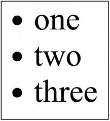

# 五、使用 Jest 的单元测试

在前几章中，我们学习了如何使用 React 和 Next.js 等库创建 web 应用。现在我们知道了如何使用这些库开发应用。接下来呢？

一旦开发了一个应用，知道它按预期工作是很重要的。为了做到这一点，我们可以编写自动化单元测试来验证我们的应用的每个组件都恰当地完成了它的工作。这正是我们在本章要学习的内容。我们将使用 Jest 框架在 React 应用上执行单元测试。

Note

作为一名开发人员，编写单元测试可能看起来交付了非常小的价值，同时给已经很紧张的时间表增加了很多工作。然而，从长远来看，当您的应用规模扩大时，它将帮助您减少工作量，提供一种非常有效的方法来检测代码中的错误和漏洞。

市场上还有很多其他的 JavaScript 测试框架，比如 Mocha 和 Jasmine。然而，由于 Jest 框架越来越受欢迎和实用，我们将使用它。我们将学习如何在我们的应用中安装和设置 Jest，然后我们将创建一个基本的单元测试来熟悉 Jest 的概念，最后，我们将学习有助于我们测试 React 组件的匹配器和酶。让我们从建立 Jest 框架开始。

## 设置笑话

Jest ( [`https://jestjs.io/`](https://jestjs.io/) )是一个 JavaScript 测试框架，我们将使用它来测试 React 应用。让我们从创建应用目录“jest-testing-app”开始。导航到目录并执行“`npm init`”命令，在目录中创建一个 package.json 文件。确保系统中安装了该节点，以便该命令能够运行。一旦成功执行，您将看到一个包含以下代码的“package.json”文件:

```jsx
{
  "name": "jest-testing-app",
  "version": "1.0.0",
  "description": "My Jest Application",
  "main": "index.js",
  "scripts": {
    "test": "jest"
  },
  "author": "Mohit Thakkar",
  "license": "ISC"
}

```

如果您在初始化期间指定了一组不同的值，这些值可能会有所不同。因为我们将使用 jest 进行测试，所以请确保您将“Jest”指定为“scripts”部分中“test”属性的值。我们现在将使用以下命令将 Jest 安装到我们的应用中:

```jsx
npm install jest --save

```

安装后，您将看到以下依赖项部分被添加到您的“package.json”文件中:

```jsx
"dependencies": {
  "jest": "^24.9.0"
}

```

就是这样。Jest 现已成功安装。让我们使用 Jest 编写我们的第一个测试。

## 使用 Jest 编写您的第一个测试

让我们首先创建一个包含一些基本函数的简单 JavaScript 文件。我用下面的代码在应用的根目录下添加了一个名为“functions.js”的文件:

*functions.js*

```jsx
const functions = {
    add: (n1, n2) => n1 + n2
}

module.exports = functions

```

这个文件包含一个简单的“add”函数，它接受两个数字作为输入，并返回它们的和作为输出。注意，我们使用简单的 JavaScript 语法将函数列表导出为一个模块。避免使用 ES6 语法，因为 Jest 希望文件在导入时是普通的 JavaScript。现在我们已经创建了一个 JavaScript 函数，让我们使用 Jest 来测试它。我们将在“tests”目录中添加我们的测试文件。将测试文件命名为您正在测试的相同的 JavaScript 文件是一个很好的实践，带有`".test.js"`后缀。考虑下面的测试文件，它包含测试“add”功能的代码:

*tests/function.test.js*

```jsx
functions = require('../functions.js')

test('Test Add Function',()=>{
    expect(functions.add(2,3)).toBe(5)
})

```

就是这样。我们已经使用 Jest 框架创建了我们的第一个测试。让我们理解这里发生了什么:

*   在测试代码中，我们简单地调用“`test()`”函数，它接受两个输入参数——第一个是测试的描述，第二个是实际的测试函数。

*   在测试函数中，我们使用了"`expect()`"函数，它接收我们正在测试的函数并对其求值，在我们的例子中，是" add()"函数。

*   我们使用 JavaScript 的"`require()`"方法从`"functions.js"`导入函数列表，因为为了调用"`add()`"函数，我们必须从定义它的文件中导入它。

*   我们在“`expect()`”函数上使用一个匹配器，在本例中是“`toBe()`”函数，以便将评估值与期望值进行比较。我们将期望值作为输入参数传递给匹配器。我们将在下一个主题中学习更多关于匹配器的知识。

使用以下命令运行测试:

```jsx
npm test

```

成功执行命令后，您将在终端中看到测试执行的摘要，如图 [5-1](#Fig1) 所示。


图 5-1

使用 Jest 的首次测试(成功)

Note

在一个文件中编写多个测试是可能的。

“测试套件”表示测试文件的数量，而“测试”表示这些文件中测试的组合数量。在前面的例子中，如果我们将期望值更改为其他值，比如说“4”，测试执行将会失败。让我们试试。考虑对“function.test.js”文件的以下更改:

*tests/function.test.js*

```jsx
functions = require('../functions.js')

test('Test Add Function',()=>{
    expect(functions.add(2,3)).toBe(4)
})

```

现在，如果您运行“npm test”命令，您将在终端中看到测试执行失败。如图 [5-2](#Fig2) 所示，您还会看到测试执行失败的原因，在这种情况下，接收值不等于预期值。您还将在测试执行总结中看到接收值和期望值。


图 5-2

使用 Jest 的首次测试(失败)

既然我们已经学习了如何使用 Jest 为 JavaScript 函数编写测试，那么让我们更深入地研究一下，了解一下可以用来测试代码的不同匹配器。

## 匹配项

匹配器是 Jest 使用的函数，用于将评估值与期望值进行比较。在前面的例子中，我们使用了 Jest 提供的“`toBe()`”匹配器。注意，我们使用“`expect()`”函数来计算实际值。这个函数返回一个期望对象，我们在这个对象上调用我们的匹配器函数，将它与期望值进行比较。让我们看看 Jest 提供的所有匹配器。

### 常见匹配器

以下是一些非常常用的通用匹配器:

*   **toBe(expected value)**–这是完全相等的匹配器。它检查“expect()”函数返回的值是否与“expectedValue”完全匹配。

*   **to equal(expected value)**–这类似于“toBe()”匹配器，只是它用于比较对象的值。它递归地检查对象的每个属性。

让我们看一个例子来理解工作中常见的匹配器。考虑对“functions.test.js”文件进行以下更改:

*tests/**functions . test . js*

```jsx
functions = require('../functions.js')

test('toBe Demo',()=>{
  expect(functions.add(2,3)).toBe(5)
})

test('toEqual Demo',()=>{
  var data = {name:'Mohit'}
  data['country'] = 'India'
  expect(data).toEqual({
    name:'Mohit',
    country:'India'
  })
})

```

为了演示"`toBe()`"匹配器的效用，我们使用了与上一个例子中测试的"`add()`"函数相同的函数。该函数返回“5”，并且“`toBe()`”匹配器断言它为真，因为它是我们所期望的值。

对于“`toEqual()”`匹配器，我们定义了一个新的测试“`toEqual Demo`”。我们用一个属性定义一个“数据”对象，然后向该对象添加一个新属性。我们现在将“数据”对象传递给“`expect()`”函数，并使用“`toEqual()`”匹配器将它与预期的输出进行比较。由于两个值匹配，Jest 将断言测试为真。上例的输出应该类似于图 [5-3](#Fig3) 。


图 5-3

笑话中常见的媒人

如果您想尝试更多的场景，您可以更改前面示例中的期望值，并注意到测试失败了。

Note

如果您使用的是 Visual Studio 代码编辑器，则可以通过“Orts”来使用“Jest”扩展。它为 Jest 提供了 IntelliSense，对于调试您编写的测试也非常有帮助。

### 真理匹配者

这些匹配器允许您检查评估值是 null、未定义、已定义、true 还是 false。您不需要向这些匹配器传递任何输入参数:

*   **tobe null()**–匹配空值

*   **tobe undefined()**–匹配未定义的值

*   **tobe defined()**–匹配未定义的值

*   **tobe truthy()**–匹配评估为 true 的值

*   **toBeFalsy()**–匹配评估为 false 的值

让我们看一个例子来理解真理匹配器的工作。以下新测试需要添加到“functions.test.js”文件中:

*tests/functions.test.js*

```jsx
...
test('truth of null', () => {
    const n = null;
    expect(n).toBeNull();
    expect(n).toBeDefined();
    expect(n).not.toBeUndefined();
    expect(n).not.toBeTruthy();
    expect(n).toBeFalsy();
  });

  test('truth of zero', () => {
    const n = 0;
    expect(n).not.toBeNull();
    expect(n).toBeDefined();
    expect(n).not.toBeUndefined();
    expect(n).not.toBeTruthy();
    expect(n).toBeFalsy();
  });
...

```

在前面的例子中，我们编写了两个新的测试，一个测试“null”的真实性，另一个检查数字零的真实性。null 值应评估为 null、defined 和 not true。另一方面，数字 0 应该计算为 not null、defined 和 false。如果您使用除零以外的任何数字，它的计算结果应该为 true。

请注意，我们使用了“not”关键字来否定某些匹配器。因此，如果表达式的计算结果为“false”，我们可以使用“not”关键字和“`toBeTruthy()`”匹配器来断言它。上例的输出应该类似于图 [5-4](#Fig4) 。


图 5-4

玩笑中的真理匹配者

### 比较匹配器

这些匹配器允许您将实际值与另一个值进行比较。要与实际值进行比较的值将作为输入参数传递给比较匹配器:

*   **toBeGreaterThan(value)**–如果实际值大于提供的值，则置位。

*   **toBeGreaterThanOrEqual(value)**–如果实际值大于或等于提供的值，则置位。

*   **tobe less than(value)**–如果实际值小于规定值，则置位。

*   **tobelesthanorequal(value)**–如果实际值小于或等于提供的值，则置位。

*   **tobe closeto(value)**–如果实际值接近提供的值，则断言。这是在处理浮点值时专门使用的。在这种情况下，期望值和实际值的精度可能不同，因此“`toBe()`”匹配器(精确相等)将不起作用。

为了理解工作中的比较匹配器，让我们看一个例子。以下是添加到“functions.test.js”文件中的新测试:

*tests/functions.test.js*

```jsx
...
test('comparison', () => {
  const value = 4 + 0.2;
  expect(value).toBeGreaterThan(3);
  expect(value).toBeGreaterThanOrEqual(3.5);
  expect(value).toBeLessThan(5);
  expect(value).toBeLessThanOrEqual(4.5);
  expect(value).toBeCloseTo(4.2);
});
...

```

前面示例中的实际值将计算为“4.2”。使用比较匹配器将它与多个值进行比较。请注意，为了断言确切的值，我们使用了“`toBeCloseTo()`”匹配器，而不是“`toBe()`”匹配器，这可能是因为精度上的差异。上例的输出应该类似于图 [5-5](#Fig5) 。


图 5-5

玩笑中的比较匹配器

### 字符串匹配

此匹配器用于将实际值与正则表达式进行比较:

*   **to match(regex)**–断言计算出的字符串是否与提供的正则表达式匹配

考虑以下示例:

*tests/functions.test.js*

```jsx
...
test('String Matcher', () => {
  expect('Mohit is a Developer').toMatch(/Mohit/);
});
...

```

前面的测试断言子字符串“Mohit”存在于计算出的字符串中。输出应类似于图 [5-6](#Fig6) 。


图 5-6

笑话中的字符串匹配器

### Iterables 匹配器

这个匹配器用于检查一个项目是否存在于一个 iterable 中，比如一个列表或一个数组:

*   **to contain(item)**–如果计算的 iterable 包含提供的项目，则断言

考虑以下示例:

*tests/functions.test.js*

```jsx
...
const countries = [
  'India',
  'United Kingdom',
  'United States',
  'Japan',
  'Canada',
];

test('Matcher for Iterables', () => {
  expect(countries).toContain('India');
  expect(new Set(countries)).toContain('Canada');
});

...

```

在前面的测试中，我们定义了一个状态列表，并使用“`toContain()`”匹配器来检查“印度”是否出现在列表中。我们还将列表转换为不同的 iterable，即集合，并检查“Canada”是否出现在新的集合中。两个匹配器都应该断言 true。输出应类似于图 [5-7](#Fig7) 。


图 5-7

笑话中可重复的匹配者

### Matcher 异常

此匹配器用于断言在评估特定代码段时是否引发了特定异常:

*   **to throw(expected exception)**–如果被评估的代码段抛出给定的异常，则断言

为了测试这个匹配器，我们将回到我们的“function.js”文件并定义一个抛出错误的函数。然后，我们将在“functions.test.js”文件中添加一个测试，它将调用函数并断言异常。考虑以下示例:

*function.js*

```jsx
const functions = {
    add: (n1, n2) => n1 + n2,
    invalidOperation: () => {
      throw new Error('Operation not allowed!')
    }
}

module.exports = functions

```

*tests/functions.test.js*

```jsx
functions = require('../functions.js')
...
test('Exception Matcher', () => {
  expect(functions.invalidOperation)
    .toThrow(Error);

  expect(functions.invalidOperation)
    .toThrow('Operation not allowed!');

  expect(functions.invalidOperation)
    .toThrow(/not allowed/);
});
...

```

在前面的示例中，我们调用了抛出错误的函数，并使用“`toThrow()`”匹配器将计算值与预期值进行匹配。请注意，我们可以将其与一般的错误对象、错误返回的特定字符串或正则表达式进行比较。上例的输出应该类似于图 [5-8](#Fig8) 。


图 5-8

玩笑中的异常匹配器

就是这样。我们已经介绍了大多数常用的笑话匹配器。现在让我们学习如何使用我们到目前为止所学的知识来测试我们的 React 组件。

## 使用 Jest 和酶测试 React 组分

为了测试 React 组件，我们必须首先创建一个 React 组件。让我们使用以下命令创建一个 starter React 应用:

```jsx
npx create-react-app react-jest-app

```

一旦创建了 starter 应用，您就可以删除所有不必要的文件。我已经删除了“src”文件夹中除“index.js”以外的所有文件，以及“public”文件夹中除“index.html”和“favicon.ico”以外的所有文件。我还清理了“index.html”文件。以下是代码，供您参考:

*public/index.html*

```jsx
<!DOCTYPE html>
<html lang="en">
  <head>
    <meta charset="utf-8" />
    <link rel="icon"
          href="%PUBLIC_URL%/favicon.ico" />
    <title>React App</title>
  </head>
  <body>
    <noscript>
      You need to enable JavaScript to run this app.
    </noscript>
    <div id="root"></div>
  </body>
</html>

```

现在我们已经清理了我们的 starter 应用，让我们将列表组件添加到“src”文件夹中。考虑以下代码:

*src/*T2】list . js

```jsx
import React from 'react';

function List(props) {
  const { items } = props;
  if (!items.length) {
      return(
        <span className="empty-message">
          No items in list
        </span>;
      );
  }

  return (
    <ul className="list-items">
      {items.map(item =>
        <li key={item} className="item">{item}</li>
      )}
    </ul>
  );
}

export default List;

```

前面的代码是一个简单的函数组件，它从 props 中获取项目，并将它们显示为一个列表。既然我们的组件已经创建，我们可能希望指示“index.js”文件在浏览器上呈现它。考虑“index.js”文件的以下代码:

*src/*T2】index . js

```jsx
import React from 'react';
import ReactDOM from 'react-dom';
import List from './List';

const data = ['one', 'two', 'three']
ReactDOM.render(<List items={data} />, document.getElementById('root'));

```

如果您启动应用并访问浏览器窗口，您应该会看到类似于图 [5-9](#Fig9) 的输出。



图 5-9

使用 React 列出组件

现在我们已经创建了一个 React 组件，让我们学习如何测试它。让我们首先使用以下命令安装 Jest 框架:

```jsx
npm install jest@24.9.0 --save

```

Note

我们已经安装了一个特定版本的 Jest 框架。这是因为使用“create-react-app”命令初始化的应用依赖于这个版本的 Jest。如果您的 Jest 框架版本与所需的版本不匹配，您将在应用启动期间得到一个错误，指出您需要的版本。您可以通过安装应用所需的版本来解决该错误。

在安装 Jest 框架之后，您还必须在“package.json”文件中添加测试脚本，如下所示:

*package.json*

```jsx
{
  ...
  "scripts": {
    ...
    "test": "jest",
    ...
  },
  ...
}

```

在测试简单的 JavaScript 函数时，我们习惯于简单地调用测试中的函数，并使用 Jest 匹配器将评估值与期望值进行比较。但是您可能想知道在 react 组件的情况下应该做什么，因为我们不能仅仅调用一个组件。

我们将完全按照 React 所做的去做。我们将组件呈现在 DOM 上，但它不是实际的浏览器 DOM；它将是由一个叫做 Enzyme 的框架创建的一个代表性的 DOM。这个框架帮助我们模拟运行时环境，以便我们可以测试我们的组件。让我们使用以下命令安装 Enzyme framework 的依赖项:

```jsx
npm install enzyme enzyme-adapter-react-16 –save

```

请注意，我们还安装了一个适配器以及与我们正在使用的 React 版本相对应的酶框架。在使用这个框架之前，我们必须在 Enzyme 中配置这个适配器。为此，我们将在应用的根目录下创建一个“enzyme.js”文件，并向其中添加以下配置代码:

*enzyme.js*

```jsx
import Enzyme, { configure, shallow, mount } from 'enzyme';
import Adapter from 'enzyme-adapter-react-16';

configure({ adapter: new Adapter() });
export { shallow, mount };
export default Enzyme;

```

在前面的代码中，我们从酶框架中导入“酶”和“配置”,从酶适配器中导入“适配器”。然后，我们使用酶框架提供的“`configure()`”方法为我们将要使用的酶实例设置适配器。配置完 Enzyme 后，我们只需导出它。我们还从酶框架中导入 shallow 和 mount，并按原样导出它们。这些是我们将用来呈现 React 组件进行测试的方法。最后，我们测试所需的酶的所有实体都将从文件“enzyme.js”中导入，而不是直接从框架中导入。如果您尝试直接从 Enzyme framework 安装文件夹导入模块，您可能会遇到错误，因为它们没有配置适配器。

现在一切都配置好了，让我们为列表组件编写测试。让我们将测试写在“src”文件夹中的“List.test.js”文件中。请参考以下代码:

*src/*T2【list . test . js

```jsx
import React from "react";
import { shallow, mount } from '../enzyme';

import List from './List';

test('List Component Test', () => {
  const items = ['one', 'two', 'three'];
  const wrapperShallow = shallow(<List items={items} />);
  const wrapperFull = mount(<List items={items} />);

  console.log(wrapperFull.debug());

  expect(wrapperShallow.find('.list-items'))
    .toBeDefined();
  expect(wrapperShallow.find('.item'))
    .toHaveLength(items.length);

  expect(wrapperFull.find('.list-items'))
    .toBeDefined();
  expect(wrapperFull.find('.item'))
    .toHaveLength(items.length);
})

```

请注意，我们使用了两种不同的方法来呈现我们的组件-浅层和挂载。让我们了解一下两者的区别。顾名思义，“`shallow()`”方法将呈现范围限制在指定的组件上，不呈现其子组件。另一方面，“`mount()`”方法呈现整个组件树。在这种情况下，我们没有任何子组件，因此两种情况下的渲染是相同的。

我们将三个项目传递给组件进行呈现。其余的语法类似于我们测试 JavaScript 函数的语法。“`shallow()`”和“`mount()`”方法返回一个 React 包装器。如果您想查看包装器包含的内容，您可以调用包装器上的“`debug()`”方法，并将输出记录到控制台，就像我们在前面的代码中所做的一样。您可以在前面测试的输出中看到，如图 [5-10](#Fig10) 所示，我们组件的整个 HTML 呈现都记录在控制台上。我们可以在这个包装器上使用“`find()`”方法来查找呈现的代码中的元素。我们可以将多种选择器传递给“`find()`”方法。这应该在"`expect()`"方法中完成，这样我们就可以为断言使用匹配器。在前面的例子中，我们使用了类选择器来评估和断言列表项的存在和长度。以下是您可以使用的一些其他选择器:


图 5-10

使用 Jest 测试列表组件

*ID 选择器*

```jsx
wrapper.find('#item1')

```

*标签和类别的组合*

```jsx
wrapper.find('div.item')

```

*标签和 ID 的组合*

```jsx
wrapper.find('div#item1')

```

*属性选择器*

```jsx
wrapper.find('[htmlFor="checkbox"]')

```

如果您使用“npm test”命令执行测试，您可能仍然会在渲染时收到有关意外标记的错误。这是因为 Enzyme 不理解我们提供给“`shallow()`”和“`mount()`”方法的 JSX 代码。我们将不得不安装和配置一个巴别塔变压器插件，将为我们转换 JSX 代码。使用以下命令安装它:

```jsx
npm install babel-plugin-transform-export-extensions --save

```

还有，我们需要创造一个”。babelrc "文件，并提供以下配置:

*.babelrc*

```jsx
{
  "env": {
    "test": {
      "presets": ["@babel/preset-env",
                  "@babel/preset-react"],
      "plugins": ["transform-export-extensions"],
      "only": [
        "./∗∗/∗.js",
        "node_modules/jest-runtime"
      ]
    }
  }
}

```

如果您在安装和配置 babel transform 插件后运行测试，测试应该会成功运行，并且输出应该类似于图 [5-10](#Fig10) 。

就是这样。我们已经使用 Jest 和酶成功测试了我们的 React 组件。随着这个话题的结束，我们来到本章的结尾。

让我们总结一下我们所学到的东西。

## 摘要

*   Jest 是一个测试框架，可以用来测试使用 JavaScript 构建的应用。

*   用“. test.js”作为测试文件的后缀是一个很好的习惯。

*   测试时,“expect()”方法用于评估 JavaScript 函数或指定需要测试的值。

*   Jest 提供了各种匹配器，可以在“expect()”方法上使用这些匹配器来断言计算值是否与期望值匹配。

*   由于 React 组件不能像函数一样被直接调用，我们将不得不使用 Enzyme 框架，该框架为我们提供了在为测试而创建的代表性 DOM 上呈现组件的功能。

*   Enzyme 框架提供了两种主要的方法来呈现组件——shallow()和 mount()。

*   我们可以使用带有“find()”方法的选择器来查找呈现组件中的特定内容。