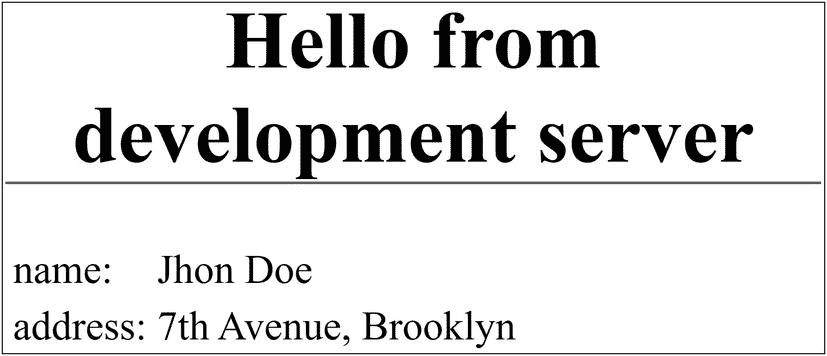
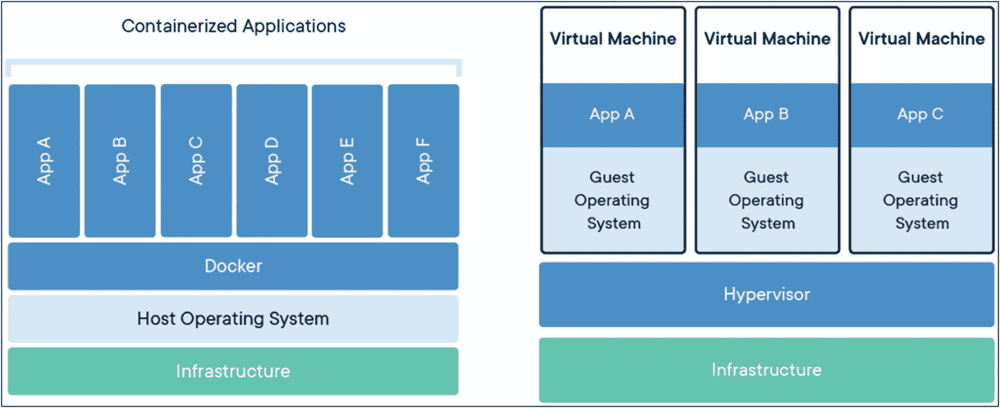
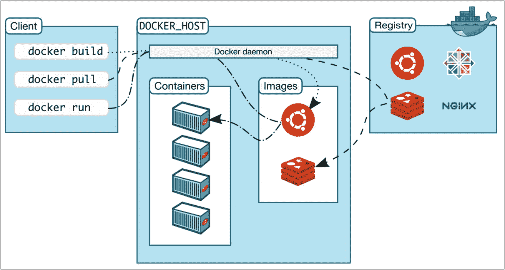
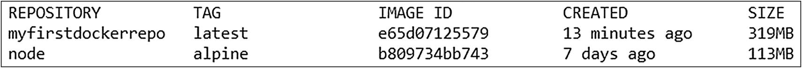
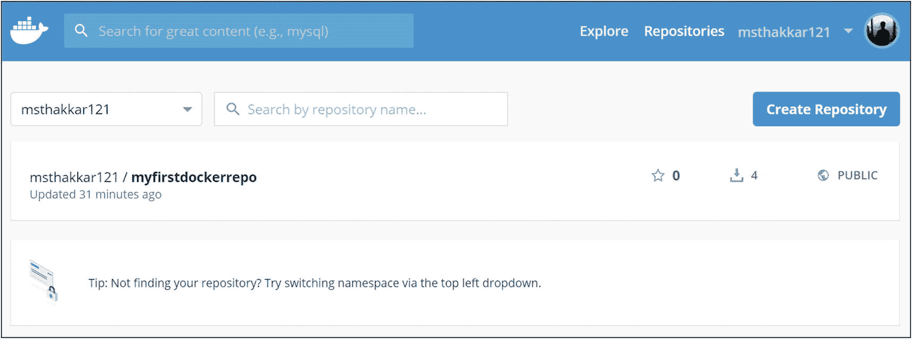
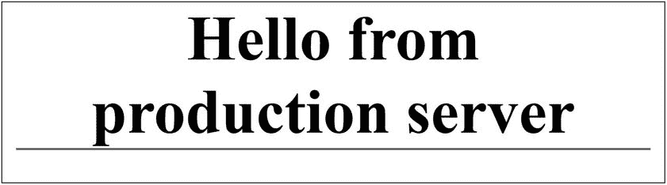

# 六、将您的应用部署到服务器

在前面的章节中，我们已经学习了如何构建和测试 React 应用。一旦我们完成了这些，我们可能想知道我们的应用在生产环境中的表现如何。这就是部署的时候了。

在本章中，我们将学习如何使用 Docker 容器部署我们的应用。让我们从了解部署流程开始。

## 部署流程

到目前为止，我们已经在本地执行了应用。然而，为了将我们的应用部署到生产服务器，我们需要遵循某些步骤。考虑以下过程:

*   首先，我们需要通过在代码中设置一些环境变量来配置应用。这将有助于应用识别其运行的环境，并做出相应的行为。

*   然后我们需要在我们的系统上安装 Docker 来封装我们的应用。

*   一旦配置完成并且安装了 Docker，我们需要为我们的应用构建一个 Docker 映像。我们将在本章的后续主题中了解更多关于 Docker 的内容。

*   一旦我们知道 Docker 映像在本地工作正常，我们就可以将它部署到面向公众的服务器上。

现在我们已经了解了部署过程，让我们从设置应用的配置开始。如果您不明白或对我们刚刚讨论的过程感到困惑，请不要担心。一旦我们详细讨论每一步，你会有更好的理解。

## 设置环境变量

环境变量是键值对，React 应用可以读取它们，以便根据应用运行的环境在运行时配置值。它促进了应用的动态行为。为了在工作中理解这一点，我们将使用在第 [3](3.html) 章中开发的 GraphQL 应用。以下是代码，供您参考:

*package.json*

```jsx
{
  "name": "my-next-app",
  "version": "1.0.0",
  "description": "My Next.js Application",
  "main": "index.js",
  "scripts": {
    "start": "next"
  },
  "author": "Mohit Thakkar",
  "license": "ISC",
  "dependencies": {
    "@zeit/next-css": "^1.0.1",
    "axios": "^0.19.0",
    "graphql": "^14.5.8",
    "next": "^9.1.6",
    "react": "^16.12.0",
    "react-dom": "^16.12.0"
  }
}

```

***next . config . js**T3】*

```jsx
const withCSS = require('@zeit/next-css')
module.exports = withCSS({})

```

*页/API/**test pi . js*

```jsx
const data = {
    name: 'Jhon Doe',
    address: '7th Avenue, Brooklyn',
    contact: '099251456',
    bloodgroup: 'A +ve',
    favouriteSnack: 'Hotdog',
    vehicle: 'Hyundai Tucson'
  }

export default (req, res) => {
    res.statusCode = 200
    res.setHeader('Content-Type', 'application/json')
    res.end(JSON.stringify(data))
}

```

*页/* *索引. js*

```jsx
import React from "react";
import axios from 'axios';
import "../style.css";

export default class extends React.Component {
  static async getInitialProps() {
    try {
      const res = await axios.get('http://localhost:3000/api/testapi');
      return { data: res.data, error: null }
    } catch (e) {
      return { data: “, error: e }
    }
  }
  render() {
    return (
      <div>
        <h1>Hello, world!</h1>
        <table>
          {Object.keys(this.props.data).map((key, index) => (
            <tr key={index}>
              <td>{key}:</td>
              <td>{this.props.data[key]}</td>
            </tr>
          ))}
        </table>
      </div>
    );
  }

}

```

在这个应用中，我们创建了一个 Next.js API，并在应用的索引页面上使用它。在使用 API 时，我们在 API URL 中使用“localhost”。这在生产环境中是行不通的。因此，让我们添加环境变量并在代码中使用它们。加一个”。env "文件，其中包含我们的环境变量:

*。环境*

```jsx
URL_TestAPI_Dev = http://localhost:3000/api/testapi
URL_TestAPI_Prod = http://www.testapplication001.com/api/testapi

```

现在，该”。env”文件对于我们的应用来说是未知的。我们必须在应用的 webpack 配置中添加一些代码。我们还必须通过从终端执行以下命令，将“dotenv-webpack”插件添加到我们的应用中:

```jsx
npm install dotenv-webpack path --save

```

我们已经使用“next.config.js”文件将我们的自定义 CSS 加载器添加到 webpack 中。我们将使用相同的文件来添加“的配置。env”文件复制到 webpack。将以下代码添加到“next.config.js”文件中:

*next.config.js*

```jsx
const withCSS = require('@zeit/next-css')

require('dotenv').config();
const path = require('path');
const Dotenv = require('dotenv-webpack');

module.exports = withCSS({
    webpack(config, options){
        config.plugins = config.plugins || [];
        config.plugins = [
            ...config.plugins,
            new Dotenv({
                path: path.join(__dirname, '.env'),
                systemvars: true
            })
        ]
        return config;
    }
})

```

一旦配置完成，我们添加到。env”文件将在整个应用中可用。现在让我们修改“index.js”文件，根据应用环境动态地使用 API URL。如果您以前使用过 Node.js 应用，您会意识到 Node 提供了一个静态类“Process ”,该类在一个名为“env”的属性中为我们提供了对用户环境的访问。我们将使用这个类来确定应用环境。考虑对“index.js”文件的以下更改:

*pages/index.js*

```jsx
...
  static async getInitialProps() {
    try {
      const res = await axios.get('http://localhost:3000/api/testapi');
      return { data: res.data, error: null }
    } catch (e) {
      return { data: ", error: e }
    }
  }

  static getAPIURL(){
    if(process.env.NODE_ENV === 'production'){
      return process.env.URL_TestAPI_Prod;
    }
    else{
      return process.env.URL_TestAPI_Dev;
    }
  }

  render() {
    return (
      <div>
        <h1>
          Hello from {process.env.NODE_ENV} server
        </h1>
        <table>
          ...
        </table>
      </div>
    );
  }
...

```

当我们使用“npm start”命令启动应用时，我们将看到类似于图 [6-1](#Fig1) 的输出。数据是从 Next.js API 获取的，它是我们的应用的一部分。这是因为“npm start”命令在开发环境中的本地服务器上运行应用。我们还将看到环境(开发)打印在标题中。一旦我们部署了应用，我们将在生产环境中进行同样的测试。



图 6-1

开发环境中的应用

这就是关于设置环境变量的内容。现在让我们了解一下 Docker。

## Docker 简介

Docker 是一个平台，它允许我们在直接运行在主机上的容器中打包和执行我们的应用。这允许我们在一台主机上同时运行多个容器化的应用。当我们需要运行针对不同操作系统的应用时，这尤其有用。特别是在这种情况下，我们必须为每个操作系统创建虚拟机，然后将我们的应用部署到它们各自的虚拟机上。然而，使用 Docker 容器，情况就不一样了。因为 Docker 容器直接与主机的内核交互，所以它们不需要额外的管理程序(虚拟机)负载。我们只需要为我们的应用创建一个图像，该图像将用于为我们的应用创建一个容器。然后，这个容器化的应用将与其他容器化的应用一起在主机操作系统的 Docker 引擎上运行。这就是如何使用 Docker 在一台主机上运行针对不同操作系统的应用。容器化应用和虚拟机实现的区别可以在图 [6-2](#Fig2) 中看到。



图 6-2

容器化应用与虚拟机实施

Docker 架构中包含多个组件，如图 [6-3](#Fig3) 所示。让我们简要地了解一下他们每一个人:



图 6-3

码头建筑

*   **Docker 客户端**——这是用户与 Docker 沟通的方式。它提供了调用 Docker API 的命令，可以用来与 Docker 守护进程进行通信。

*   Docker 守护进程–这是 Docker 主机的一部分，它监听 API 请求并管理容器和图像等对象。它还可以与其他守护程序通信。

*   **图像**–Docker 图像是一个只读模板，包含一组分层的指令，用于创建 Docker 容器。我们可以创建自己的图像或使用他人创建并发布到注册表的图像。

*   **容器**–Docker 容器是 Docker 图像的一个实例。我们可以使用 Docker API 或 CLI 在容器上执行启动、停止、移动或删除等操作。

*   **注册表**–Docker 注册表存储 Docker 图像。Docker Hub 是一个任何人都可以使用的公共注册表。默认情况下，Docker 被配置为在 Docker Hub 上查找图像。您也可以运行自己的私有注册表。当您运行“docker run”或“docker pull”命令时，将从您配置的注册表中提取所需的映像。当您运行“docker push”命令时，您的映像会被推送到您配置的注册表中。

关于 Docker 平台，我们可以了解更多的东西。然而，我们不会深入细节，因为这一章是关于部署而不是关于 Docker 的。让我们学习如何将我们的应用容器化。

## 为您的应用创建 Docker 容器

首先，我们需要在我们的机器上安装 Docker Desktop。它适用于 Windows 和 Mac。我们需要在 [`https://hub.docker.com/`](https://hub.docker.com/) 注册码头工人。一旦我们注册，我们可以登录到我们的帐户，并访问仪表板找到 Docker 桌面的下载链接。下载后，你可以像安装其他软件一样把它安装在你的机器上。由于我使用的是 Windows 操作系统，所以我下载了 Docker Desktop for Windows。要检查它是否已正确安装在我们的系统上，我们可以在终端中使用以下命令来检查 Docker 的版本:

```jsx
docker --version

```

现在，让我们回到我们的项目。我们必须使用以下一组指令将“Dockerfile”添加到我们的应用的根目录，这些指令将充当图像模板，并用于为我们的应用创建容器:

*码头式码头式码头式码头式码头式码头式码头式码头式码头式码头式码头式码头式码头式码头式码头式码头式码头式码头式码头式码头式码头式码头式码头式码头式码头式码头式码头式码头式码头式码头式码头式码头式码头式码头*

```jsx
# base image
FROM node:alpine

# create & set working directory
RUN mkdir -p /usr/src
WORKDIR /usr/src

# Install dependencies
COPY package.json /usr/src
RUN npm install

# Bundle app source
COPY . /usr/src

# start app

RUN npm run build
EXPOSE 3000

CMD ["npm", "start"]

```

让我们明白这里发生了什么。首先，我们指示 Docker 从“`alpine`”开始，这是 Linux 的一个通用实现。然后我们创建一个新的源目录并切换到它。我们将“package.json”文件复制到新的源目录，并在其中安装所有的依赖项。最后，我们将文件从节点应用复制到新的源目录。然后我们构建应用，公开运行节点服务器的端口，并启动服务器。

但是，我们需要修改我们的“package.json”文件。确保您的文件中有以下脚本:

*package.json*

```jsx
...
"scripts": {
  "dev": "next",
  "build": "next build",
  "start": "next start"
},
...

```

一旦“Dockerfile”包含所有指令，我们就可以使用 Docker 提供的以下命令为我们的应用创建一个 Docker 映像:

```jsx
docker build -t myfirstdockerrepo .

```

在执行这个命令之前，确保 Docker Desktop 正在您的系统上运行。Docker 桌面的一个常见问题是错误——“由于内存不足，无法启动”。如果您遇到类似的问题，请尝试通过导航到 Docker ➤设置➤资源来减少分配给 Docker 的内存量。一旦 Docker 启动并运行，执行上述命令。根据您的机器和应用的大小，为您的应用构建 Docker 映像可能需要几分钟时间。命令成功执行后，您可以使用以下命令查看所有可用的 Docker 图像:

```jsx
docker images

```

请注意，我们已经使用目标选项(–t)和“`docker build`”命令指定了存储库名称。我们指定的名称用作 Docker 图像的标签，并可用于引用图像容器。请注意，Docker 容器只是 Docker 图像的活实例。所以当我们执行“`docker images`”命令时，我们看到的列表是 Docker 容器的列表。术语“图像”和“容器”经常互换使用。然而，不要混淆。在执行该命令时，我们将看到类似于图 [6-4](#Fig4) 的容器列表。



图 6-4

码头集装箱

就是这样。我们已经成功地为我们的应用创建了一个容器。现在让我们学习如何托管 Docker 容器。

## 承载容器

让我们首先将我们在本地创建的图像发布到 Docker Hub。在将容器推送到 Docker Hub 之前，我们需要登录 Docker Hub。为此，请从终端执行以下命令:

```jsx
docker login

```

如果您已经登录到系统上的 Docker 桌面，前面的命令应该会自动对您进行身份验证。如果没有，将要求您提供登录凭据。登录后，我们可以使用“push”命令来发布我们的容器。但是在此之前，我们需要在容器的存储库名称前面加上 Docker 用户名。这是因为 Docker 会自动生成创建存储库的 URL 来发布您的容器。如果您不在您的存储库名称前加前缀，Docker 将自动尝试在 docker.io/library 上创建一个存储库，我们无权在公共域上创建存储库。因此，如果没有存储库名称作为前缀，我们将会遇到一个认证错误。让我们使用以下命令添加前缀:

```jsx
docker tag e65 msthakkar121/myfirstdockerrepo
docker tag e65 msthakkar121/myfirstdockerrepo

```

我们在这里做的是向现有容器添加一个标记名，然后删除旧的标记名。“e65”是我们的图像 ID 的前三个字符，这是我们在这种情况下所需要的。

Note

“msthakkar121”是我的 Docker ID，所以我用它作为前缀。但是，您需要使用各自的码头工人 id。

一旦存储库名称有了前缀，并且我们登录到 Docker，我们需要使用下面的命令将容器推送到 Docker Hub:

```jsx
docker push msthakkar121/myfirstdockerrepo:latest

```

成功执行上述命令后，Docker Hub 上将创建一个公共存储库，链接到我们的概要文件。我们可以通过访问 [`https://hub.docker.com/`](https://hub.docker.com/) 并用我们的凭据登录来验证这一点。在访问“存储库”页面时，我们将看到“myfirstdockerrepo”被添加到列表中。同样如图 [6-5](#Fig5) 所示。



图 6-5

docker hub 上的存储库

现在，为了运行我们的容器，我们需要使用以下命令:

```jsx
docker run -p 3000:3001 -d msthakkar121/myfirstdockerrepo

```

这个命令将在我们的系统上运行应用的生产版本。我们在命令中使用“-p”选项指定了两个端口。第一个端口用于命令行操作，第二个端口用于 web 应用。成功执行该命令后，应用将启动并运行在端口 3001 上。您可以通过访问浏览器上的 URL“`http://localhost:3001/`”进行验证。输出应类似于图 [6-6](#Fig6) 。



图 6-6

生产环境中的应用

如您所见，我们打印在索引页标题上的环境变量现在显示“生产”而不是“开发”。这表明我们的应用正在生产服务器上成功运行。请注意，目前没有获取 API 数据，因为我们还没有在面向公众的云上托管我们的应用。你可以使用像数字海洋( [`www.digitalocean.com/`](http://www.digitalocean.com/) )这样的平台提供的服务，将你的容器化应用托管到面向公众的云上。但是，如果您创建这个应用是为了学习，并且不想在托管服务上花钱，那么使用 Docker Desktop 在本地运行应用的生产版本就足够了。

至此，我们来到了本章的结尾。让我们总结一下我们所学到的东西。

## 摘要

*   将我们的应用部署到生产服务器对于确保它在部署后按预期工作是至关重要的。

*   我们需要定义一些环境变量，并在代码中使用它们来根据应用运行的环境改变运行时的应用行为。

*   为了将我们的应用容器化，我们使用了 Docker。

*   容器化的应用直接与主机的内核交互，因此不需要管理程序。

*   由于容器化，面向不同操作系统的多个应用可以在同一台主机上同时运行，而无需任何虚拟机管理程序。

*   我们在名为“Dockerfile”的文件中指定构建 Docker 容器的指令，该文件位于我们的应用的根目录中。

*   然后我们使用“docker build”命令，根据“dockerfile”中的指令构建一个 Docker 容器。

*   可以使用“docker run”命令在本地模拟生产环境中测试容器。

*   像“DigitalCloud”这样的服务可以用来将我们的应用发布到面向公众的云上。