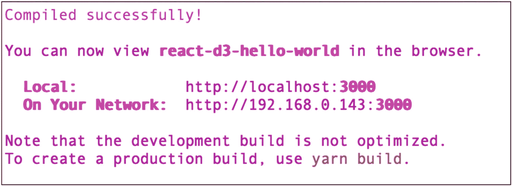

# 一、设置我们的技术栈

集成交互式数据可视化(又名*数据即*)组件可以帮助你更好地讲述你的故事。React 已经设置为能够动画可缩放矢量图形(SVG)、HTML 和 Canvas 这不是什么新鲜事。多年来，我们已经有能力用 HTML 和纯 JavaScript 制作 SVG、Canvas 和 HTML 动画。React 具有 HTML、CSS 和 JavaScript 功能，可以很好地与其他库配合使用，帮助创建图表和动画视图。

为什么要使用数据可视化？

*   具有数据可视化功能的商业智能正变得越来越受欢迎，因为它为每一美元的支出提供了 13.01 美元的投资回报( [`https://nucleusresearch.com/research/single/analytics-pays-back-13-01-for-every-dollar-spent/`](https://nucleusresearch.com/research/single/analytics-pays-back-13-01-for-every-dollar-spent/) )。

*   就像他们说的，一张图胜过千言万语。

*   百分之九十三的交流是非语言的( [`https://ubiquity.acm.org/article.cfm?id=2043156`](https://ubiquity.acm.org/article.cfm%253Fid%253D2043156) )。

*   我们的大脑以 13 毫秒的速度处理一幅图像。百分之九十传输到我们大脑的信息是视觉的( [`https://news.mit.edu/2014/in-the-blink-of-an-eye-0116`](https://news.mit.edu/2014/in-the-blink-of-an-eye-0116) )。

*   我们的大脑处理视觉信息的速度比文本快 6 万倍( [`https://carlsonschool.umn.edu/faculty-research/mis-research-center`](https://carlsonschool.umn.edu/faculty-research/mis-research-center) )。

*   高质量的信息图表比文本( [`https://blog.kissmetrics.com/your-brain-on-visualization/`](https://blog.kissmetrics.com/your-brain-on-visualization/) )更容易被阅读 30 倍。

*   97%的人认为图表比文字和数字更能可靠地显示信息(康奈尔大学)。

React 相对于其他 web 平台的最大优势是它使用了虚拟 DOM (VDOM ),从而提高了性能。我们可以利用 React 所提供的以及其他第三方库，如 D3 库和数据管理，来处理我们的数据，不仅构建引人注目的图表组件，还可以提高性能。同时。有时，我们希望取得控制权，让我们的组件控制元素，而不是做出 React。

添加其他库和技术，比如反冲、Material-UI、TypeScript、单元测试、时髦的层叠样式表(SCSS)等等，将需要更多的知识，但这是我们所得到的小小代价。

在这本书里，我会给你一些工具来学习如何用 React 创建数据可视化，我们会从大量的 D3 库以及 React 世界里的其他标准库那里得到帮助。

这第一章作为一个介绍。我们将回顾我们将在本书中使用的工具来创建动画和图表，以及设置我们的第一个“Hello World”D3/React/TypeScript 项目。此外，我们将看看我们能做些什么来确保质量，研究单元测试、林挺和格式化。

我们开始吧。

## React

React(也称为 ReactJS)是一个 JavaScript 库，由脸书( [`https://github.com/facebook/react`](https://github.com/facebook/react) )开发，用于创建 Web 用户界面。

React 是由乔丹·沃克发明的，他当时正在做脸书的广告。它与其他 web 框架和库如 jQuery、Angular、Vue.js、Svelte 等竞争。

在 2017 年 9 月发布的上一版本 React 16.x 中，React 团队在消除 bug 的同时，增加了更多的工具和开发支持。React 的最新版本(撰写本文时)是 17，发布于 2020 年 10 月。

Note

React 17 是一个“垫脚石”版本，该版本主要专注于使 React 更容易升级到未来版本，以及增加与浏览器的更好兼容性。React 团队的支持表明该库势头强劲，不会很快消失。

### 为什么要 React？

你知道吗？

*   React 是开发人员的最爱。事实上，根据一项 Stack Overflow 调查( [`https://insights.stackoverflow.com/survey/2020`](https://insights.stackoverflow.com/survey/2020) )，React 是最受欢迎的 web 框架并且已经连续两年了。

*   对 React 开发人员的需求激增；据 Indeed.com([`https://www.indeed.com/q-React-jobs.html`](https://www.indeed.com/q-React-jobs.html))统计，React 开放的开发者岗位接近 56000 个。

*   React 库很轻(大约 100KB)并且很快。

*   React 很容易上手使用。

### 对优势和局限性做出 React

正如我提到的，当 React 与 jQuery、Angular 和 Vue.js 等其他 web 框架相比时，最大的优势是 React 使用了 VDOM，可以提高性能。这里还有几个优点:

*   React 可以用作单页应用(SPA ),如 Create-React-App (CRA ),或者用于服务器端渲染(SSR ),如 Gatsby.js 和 Next.js

*   React 可以遵循单向数据流以及数据绑定。

*   React 的 JSX 产生了更好的代码可读性。

*   React 可以很容易地与其他框架集成。

React 有一些限制，如下所示:

*   React 本身只是一个 UI 库，而不是 Angular 那样的成熟框架。

*   开发人员可以决定添加哪些库以及遵循哪些最佳实践。

*   与其他工具相比，React 的学习曲线更加陡峭。

### React 模板启动项目

在创建 React 应用时，有许多选项可供选择。您可以自己编写代码，然后添加库来帮助您打包代码，为生产做好准备(工具链)，并完成编写代码时的其他常见标准任务。

Note

React *工具链*是一套编程工具，用于为我们的最终开发/部署产品执行复杂的开发任务。

开始的另一个选择是使用许多 React starter 模板项目，这些项目已经负责搭建和配置，并包括帮助您快速完成工作的库。创建 React app 最流行的模板是 Create-React-App([`https://github.com/facebook/create-react-app`](https://github.com/facebook/create-react-app))；该项目由脸书创建，在 GitHub 上有 85，000 颗星星。CRA 是基于一个单页面的应用，所以没有页面刷新，这种体验就像你在一个移动应用里面。这些页面应该在客户端呈现。这是中小型项目的理想选择。

另一个选项是 SSR，它在服务器上呈现页面，因此客户端(浏览器)无需做任何工作就可以显示应用。SSR 适用于某些用例，在这些用例中，如果渲染发生在客户端，用户体验会很慢。

CRA 不支持现成的 SSR。有一些方法可以配置 CRA 并使其与 SSR 一起工作，但是对于一些开发人员来说，这可能太复杂了，并且需要您自己维护配置，所以可能不值得花费精力。

如果您正在构建需要 SSR 的东西，最好是使用已经配置好的带有 SSR 的不同 React 库，如 Next.js framework、Razzle 或 Gatsby(在构建时将预呈现的网站转换为 HTML)。

如果你更喜欢带有 React 的 SSR，可以看看 Next.js、Razzle 或 Gatsby。

也就是说，使用 CRA，你可以进行预渲染，这是最接近 SSR 的方法，在本书后面的章节中，当我们优化 React 应用时，你会看到这一点。

在本书的例子中，我们将使用 CRA；然而，我们将要构建的组件是松散耦合的，可以很容易地导入到任何 React 项目中，几乎不需要任何努力。

Tip

我们将在本书中使用 CRA，项目将很容易理解。但是，可以随意使用任何 React 模板启动项目，甚至从头开始创建自己的 React 项目，并处理自己的工具链。在第 [10](10.html) 章，我将向你展示如何使用 SSR 和 Next.js 来设置你的 React 项目。

#### 先决条件

我们将要安装的库被提交给 NPM ( [`https://www.npmjs.com/`](https://www.npmjs.com/) )。需要 Node.js 来获得 NPM，使用 NPM 从 NPM 仓库下载包。

NPM 和 Node.js 携手并进。NPM 是 JavaScript 包管理器，也是 JavaScript Node.js 环境的默认包管理器。

#### 在 Mac/PC 上安装节点和 NPM

如果你没有安装 Node.js，你需要安装它。Node.js 至少需要 8.16.0 或 10.16.0 版本。我们需要那个版本的原因是我们需要使用 NPX，这是 2017 年推出的 NPM 任务运行器，用于设置 CRA。

通过检查版本来确保您拥有它，如下所示:

```jsx
$ node -v

```

如果没有安装，你可以从这里为 Mac 和 PC 安装(图 [1-1](#Fig1) ):


图 1-1

在 Mac 上下载 Node.js

```jsx
https://nodejs.org/en/

```

安装程序可以识别你的平台，所以如果你在 PC 上，步骤是一样的。

一旦你下载了安装程序，运行它；一旦完成，在终端/DOS 中运行`node`命令。

```jsx
$ node -v

```

该命令将输出 Node.js 版本号。

#### 下载库:纱线或 NPM

要从 NPM 资源库下载包，我们有两个选项:Yarn 或 NPM。NPM 附带 Node.js，无需安装即可使用。然而，在本书中，我们大多会使用另一个库:Yarn。我们将尽可能多地使用纱线来下载软件包，而不是 NPM。

我们在这本书里用纱代替 NPM 的原因是纱比 NPM 快。Yarn 缓存已安装的包并同时安装包。我们还安装了 NPM，因为它是 Node.js 附带的

#### 在 Mac/PC 上安装 Yarn

要在 Mac 上安装 Yarn，一个好的选择是在终端中安装`brew`。

```jsx
$ brew install yarn

```

就像 Node.js 一样，用`-v`标志运行 Yarn 输发布本号。

```jsx
$ yarn -v

```

在 PC 上，您可以从以下位置下载 MSI 下载文件:

```jsx
https://classic.yarnpkg.com/latest.msi

```

您可以在此找到更多安装选项:

```jsx
https://classic.yarnpkg.com/en/docs/install/#mac-stable

```

#### 创建-React-应用 MHL 模板项目

配备了 Node.js 以及 NPM 和 Yarn，我们就可以开始了。我们可以在 [`https://github.com/EliEladElrom/cra-template-must-have-libraries`](https://github.com/EliEladElrom/cra-template-must-have-libraries) 使用我为您创建的 CRA 必备图书馆(MHL)模板项目。

CRA 坚持己见，包括诸如 Jest、service workers 和 ES6 等库。MHL 模板项目甚至更加固执己见，包括以下库:

*   *打字检查器*:打字稿

*   预处理器:萨斯/SCSS

*   *状态管理* : Redux 工具包/反冲

*   *CSS 框架*:素材-UI

*   *CSS-in-JS 模块*:样式化组件

*   *路由*:React 路由

*   *单元测试* : Jest 和 Enzyme + Sinon

*   *E2E 测试*:笑话和木偶师

*   文件夹结构

*   生成模板

*   埃斯林特和更漂亮

*   其他有用的库 : Lodash，Moment，Classnames，Serve，react-snap，React-Helmet，Analyzer Bundle

如果您想了解这些库是如何安装的，您可以创建自己的模板或修改现有的模板。那超出了本书的范围；但是，您可以阅读本文，了解每个库的完整分步安装:

[T2`https://medium.com/react-courses/setting-up-professional-react-project-with-must-have-reactjs-libraries-2020-9358edf9acb3`](https://medium.com/react-courses/setting-up-professional-react-project-with-must-have-reactjs-libraries-2020-9358edf9acb3)

或者你可以参加我在 Udemy 上的课程:

[T2`https://www.udemy.com/course/getting-started-react17-with-must-have-libraries/`](https://www.udemy.com/course/getting-started-react17-with-must-have-libraries/)

让我们首先用一个命令创建我们的`react-d3-hello-world`“Hello World”项目，如下所示:

```jsx
$ yarn create react-app react-d3-hello-world --template must-have-libraries

```

或者我们可以使用`npx`，如下图所示:

```jsx
$ npx create-react-app react-d3-hello-world --template must-have-libraries

```

一旦库和所有依赖项的安装完成下载，您就可以通过启动本地服务器来运行项目。

将目录切换到`react-d3-hello-world`项目，在终端运行`start`命令(见图 [1-2](#Fig2) )。



图 1-2

CRA 编译成功

```jsx
$ cd react-d3-hello-world
$ yarn start

```

您可以在`package.json`文件中看到这个运行命令。该命令指向`react-scripts`库，并在默认端口 3000(您可以更改)上的本地服务器上启动项目。

现在导航到本地主机并查看项目，如图 [1-3](#Fig3) 所示。


图 1-3

运行 CRA 启动项目的本地服务器

## 类型检查器:类型脚本

在编写 React 代码时，有两个选项可供选择:可以使用 JavaScript (JS)或 TypeScript (TS)编写代码。TypeScript 是 transpiler，这意味着 ES6 不理解 TS，但 TS 会被编译成标准的 JS，这可以用 Babel 来完成。

CRA·MHL 项目已经设置了 TS 作为开箱即用的类型检查器，因此您无需做任何事情。然而，我想扩展一下为什么我选择 TS 而不是 JS。

### 为什么应该将 TypeScript 集成到 React 项目中？

以下是一些有趣的事实:

*   您知道 TypeScript 是由微软开发和维护的开源编程语言吗？

*   根据 Stack Overflow 2020 年的调查，TypeScript 编程语言是第二受欢迎的语言，去年甚至超过了 Python！

为什么 TypeScript 这么受欢迎？

### TS vs. JS，有什么大不了的？

顾名思义，TS 就是设置“类型”TS 比 JS 更容易调试和测试，并通过描述预期的内容来防止潜在的问题(当我们在本书后面测试我们的组件时，您会看到这一点)。使用 TS，一种成熟的面向对象编程(OOP)语言和模块将开发带到了更专业的水平，并提高了我们的代码质量。

如果我们做一个 TS 对 JS 的快速比较:

*   TypeScript 是一个 OOPJavaScript 是一种脚本语言。

*   TypeScript 使用遵循 ECMAScript 规范的静态类型。

*   TypeScript 支持模块。

类型系统将一个类型与每个值相关联—通过检查这些值的流程，它确保没有类型错误。

静态类型意味着在运行之前检查类型(允许您在运行之前跟踪 bug)。

JS 只包括以下八种动态(运行时)类型:BigInt、Boolean、Integers、Null、Number、Strings、Symbol、Object(对象、函数和数组)和 Undefined。

Note

所有这些类型都被称为*原始类型*，除了 Object，它被称为*非原始类型*。TS 通过设置编译器对源代码进行类型检查，将静态类型转换为动态代码，从而为 JavaScript 添加静态类型。

React 和 TypeScript 配合得很好，因为 TypeScript 使用 OOP 最佳实践提高了应用的代码质量，所以值得学习。

TS 的最新版本是版本 4 公共迭代。要在 TS 中玩编码，可以在 [`https://www.typescriptlang.org/play/`](https://www.typescriptlang.org/play/) 的 TS 游乐场运行 TS 代码(见图 [1-4](#Fig4) )。


图 1-4

TS 游乐场

TS 游乐场网站有大量的例子，可以帮助您更好地了解 TS。我建议探究这些例子。

请注意，该示例使用了“strict”，在 TS Config 菜单项中，您可以设置编译器选项。不同的编译器选项在 [`https://www.typescriptlang.org/docs/handbook/compiler-options.html`](https://www.typescriptlang.org/docs/handbook/compiler-options.html) 中解释。

这可能会使你的代码在编译时出现错误和警告，但这是值得的，因为它将帮助你避免以后编译器无法识别类型和你的应用在运行时中断的问题。

Tip

我们宁愿我们的应用在编译时中断，而不是在运行时。

我提到 TS 是 OOP 语言，遵循 ECMAScript 规范；然而，规范是动态的，经常变化，所以您可以指定 ECMAScript (ES)目标。参见图 [1-5](#Fig5) 。


图 1-5

指定 TS 操场中的 ECMAScript 目标

从 TS 开始的一个很好的地方是通过查看不同的可用类型来理解它的功能。如果您刚刚开始使用 TS，解释类型超出了本书的范围，但是我欢迎您查看下面的文章，其中还包括一个带有大量示例的备忘单:

```jsx
https://medium.com/react-courses/instant-write-reactjs-typescript-components-complete-beginners-guide-with-a-cheatsheet-e32a76022a44

```

## D3

D3(又名 D3js 或 D3.js)代表“数据驱动文档”，它使您能够创建整洁的数据驱动文档( [`https://github.com/d3/d3`](https://github.com/d3/d3) )。这是一个图表库，有助于将数据变得生动。它是由 Mike Bostock 在纽约时报创建的，用于创建交互式网络可视化。这是基于他在斯坦福可视化小组攻读博士期间的工作。

*   D3 包括一个全面的库，有将近 170 个例子。 [`https://observablehq.com/@d3/gallery`见](https://observablehq.com/%2540d3/gallery)。

*   D3 利用了这些基础技术:JavaScript、HTML、CSS3、Canvas 以及最后但同样重要的 SVG。

> *D3.js 是一个基于数据操作文档的 JavaScript 库。D3 使用 HTML、SVG 和* CSS *帮助你将数据变得生动。D3 对 web 标准的重视让您拥有现代浏览器的全部功能，而无需将自己束缚在一个专有的框架中，结合了强大的可视化组件和数据驱动的 DOM 操作方法。【T8*
> 
> [`https://d3js.org/`](https://d3js.org/)

D3 是用 JavaScript 编写的，重点是将数据附加到文档对象模型(DOM)元素上。

典型的纯 D3 的过程可以分为三个部分。

*   *Attach* :将数据附加到 DOM 元素上。

*   *显示*:使用 CSS、HTML 和/或 SVG 来显示数据。

*   *Interactive* :使用 D3 数据驱动的转换和转换使数据具有交互性。

撰写本文时的最新版本是 v6。阅读 changelog ( [`https://github.com/d3/d3/blob/master/CHANGES.md`](https://github.com/d3/d3/blob/master/CHANGES.md) )来看看版本 6 有什么新变化。

D3 有一个陡峭的学习曲线，添加 React 和 TypeScript 使曲线更加陡峭。

其实 D3 有 30 多个模块，1000 个方法！要深入了解 D3，D3 团队提供的免费资源很少。

*   [T2`https://observablehq.com/@d3/learn-d3`](https://observablehq.com/%2540d3/learn-d3)

*   [T2`https://observablehq.com/@observablehq/five-minute-introduction?collection=@observablehq/notebook-fundamentals`](https://observablehq.com/%2540observablehq/five-minute-introduction%253Fcollection%253D%2540observablehq/notebook-fundamentals)

### D3 版本> 4

正如我提到的，D3 已经是第六次迭代了。在 D3 版本 4 及以上，最大的变化是 D3 是模块化的。由于这种模块化，您可以只导入需要的东西，而不是带来整个厨房水槽。这里有一个例子:

```jsx
$yarn add d3-axis d3-interpolate d3-scale d3-selection

```

请记住，对于 TS，我们还需要引入类型(`yarn @types/module-name`)。

Tip

当你在网上看例子时，比如在 [`https://observablehq.com/@d3/gallery`](https://observablehq.com/%2540d3/gallery) 的例子，检查例子中使用的 D3 版本是很重要的。D3 v4 和更高版本已经经历了重大的变化，升级需要对 D3 库有很好的了解。

## 其他数据即库

除了 D3，还有许多其他基于 D3 构建的 React 库，包括现成的组件。以下是一些比较受欢迎的:

*   *充电* : [`https://github.com/recharts/recharts`](https://github.com/recharts/recharts)

*   *Visx* : [https:// github。com/ airbnb/ visx](https://github.com/airbnb/visx) (例: [`https://airbnb.io/visx/gallery`](https://airbnb.io/visx/gallery) `)`

*   *Nivo* : [`https://github.com/plouc/nivo`](https://github.com/plouc/nivo) (例子: [`https://nivo.rocks/components`](https://nivo.rocks/components) `)`

*   *React-vi* : [`https://github.com/uber/react-vis`](https://github.com/uber/react-vis)

*   *胜利* : [`https://github.com/FormidableLabs/victory`](https://github.com/FormidableLabs/victory) (例子: [`https://formidable.com/open-source/victory/gallery`](https://formidable.com/open-source/victory/gallery) )

*   *符号学* : [`https://github.com/nteract/semiotic`](https://github.com/nteract/semiotic) (例子: [`https://semiotic.nteract.io/examples`](https://semiotic.nteract.io/examples) )

*   *react-D3-components*:[`https://github.com/codesuki/react-d3-components`](https://github.com/codesuki/react-d3-components)(例如: [`https://github.com/codesuki/react-d3-components#examples`](https://github.com/codesuki/react-d3-components%2523examples) )

在第 9 章中，我将向你展示如何实现这些流行的库，同时回顾这些库来帮助你选择一个。

许多人会认为我们最不需要的就是另一个图表组件库，他们是对的。如果你需要现成的图表，有很多可供选择。

也就是说，使用图表库创建真正创新和高性能的可视化可能是一个挑战，您可能会发现自己需要使用 D3 或派生现有的图表库并进行更改。

除了 D3 和 React 库，还有其他高级库可以使用，比如 Vega ( [`https://vega.github.io/vega-lite/`](https://vega.github.io/vega-lite/) )。

此外，还有商业智能(BI)工具，如 Tableau 或 PowerBI，您可以使用它们来分析数据，并将可视化集成到 React 项目中。

请记住，除了我提到的顶级库之外，GitHub 还充斥着制作终极图表库的失败尝试。您将很快淹没在选项、标志和`props`中，以满足所有的用例。

D3 是最终的“图表库”如果你想做一个定制化的数据可视化，那就花时间学习 D3 吧。

也就是说，有一些特定的项目需要更快的发布或者更多的定制，比如概念验证(POC)项目。在这些情况下，知道那里有什么以及如何集成或派生它将会派上用场，所以我将在第 [9](09.html) 章中介绍一些这样的库供你参考。

## ReactTransitionGroup 附加组件

除了 D3，`ReactCSSTransitionGroup`是 React 库的一个例子，它提供了基于`ReactTransitionGroup`的高级 API。当 React 组件进入或离开 DOM 时，这是一种执行 CSS 过渡和动画的简单方法(该库的灵感来自 Angular 的`ng-animate`)。

你可以把这个库和其他的库一起使用，比如 D3；你可以在这里了解更多: [`https://reactjs.org/docs/animation.html`](https://reactjs.org/docs/animation.html) 。

## React v17 + D3 +类型脚本

我们已经介绍了名为`react-d3-hello-world`的起始项目，并查看了 TypeScript 和 D3，所以我们现在可以将它们放在一起，创建我们的第一个“Hello World”D3 项目。

首先，安装 D3 和所有的 D3 类型(对于 TS)。

```jsx
$ yarn add d3 @types/d3

```

### 将功能组件与 D3 React

接下来，让我们创建一个简单的组件；我们称它为`HelloD3` `.`，因为我们将使用一个我用`generate-react-cli`库( [`https://github.com/arminbro/generate-react-cli`](https://github.com/arminbro/generate-react-cli) )创建的模板来移动文件和创建文件夹结构。

```jsx
npx generate-react-cli component HelloD3 --type=d3

```

这里可以看到设置:`generate-react-cli.json`。导航到`src/components`，可以看到自动为你生成了三个文件(见图 [1-6](#Fig6) )。


图 1-6

HelloD3 组件

*   `HelloD3.scss`

*   `HelloD3.test.tsx`

*   `HelloD3.tsx`

#### App.tsx

打开我们的 app 入口点`App.tsx`，添加我们创建的`HelloD3`组件。

```jsx
import React from 'react'
import './App.scss'
import HelloD3 from './components/HelloD3/HelloD3'

function App() {
 return (
  <div className="App">
   <header className="App-header">
    <HelloD3 />
   </header>
  </div>
 )
}

export default App

```

现在，我们再来看看 localhost】(见图 [1-7](#Fig7) )。你可以看到一个“Hello World”信息和两个方块。


图 1-7

CRA MHL D3 "你好世界"

恭喜你，你刚刚创建了你的第一个集成了 React 和 D3 的项目。

#### HelloD3.tsx

现在，让我们检查一下`HelloD3`组件代码。

```jsx
// src/components/HelloD3/HelloD3

```

从 React 开始，我们将使用`useEffect`和`refObject`库。

```jsx
import React, { useEffect, RefObject } from 'react'

```

让我们导入样式文件；我们现在没有使用它，但它会准备好，以备我们需要添加一种风格。

```jsx
import './HelloD3.scss'

```

接下来，我们将导入整个 D3 库。

```jsx
import * as d3 from 'd3' // yarn add d3 @types/d3

```

对于我们的组件，我们将使用一个纯函数组件并设置我们的引用对象。

> *Refs 提供了访问在 render 方法中创建的* DOM *节点或 React 元素的方法。【T6*
> 
> [`https://reactjs.org/docs/refs-and-the-dom.html`](https://reactjs.org/docs/refs-and-the-dom.html)

```jsx
const HelloD3 = () => {
 const ref: RefObject<HTMLDivElement> = React.createRef()

```

注意 TS 类型被设置为`HTMLDivElement.`我怎么知道呢？我不得不钻研 React 代码来找出`ref`对象类型。这是使用 TS 时的常见做法，我发现深入研究实际的 React 库很有帮助，因为它增加了我对 React 的理解。

接下来，我们将使用`useEffect`钩子来调用一个`draw()`方法，一旦调用了`useEffect`，我们将创建这个方法。

> *钩子是 React 16.8 中新增的。它们允许您使用状态和其他 React 特性，而无需编写类。【T7*
> 
> [`https://reactjs.org/docs/hooks-effect.html`](https://reactjs.org/docs/hooks-effect.html)

```jsx
 useEffect(() => {
  draw()
 })

```

我们的`draw()`方法包括“选择”或者选择我们将要使用的 HTML 元素。接下来，我们“追加”或者换句话说，添加一个文本元素“Hello World”

Note

在整本书中，我将经常使用`draw()`函数，而不在`useEffect.`中将`draw()`函数列为依赖函数。最好的方法是记住带有`useCallback`的绘制对象，以确保不会出现无限循环(参见 [`https://reactjs.org/docs/hooks-reference.html#usecallback`](https://reactjs.org/docs/hooks-reference.html%2523usecallback) )。如果你对这种方法不熟悉，我会在第 [11](11.html) (使用`useCallback)`的`Memorize`函数)一章中向你展示如何进行优化。

此外，我们选择将在 JSX 呈现的 SVG 元素，附加一个组元素和一个矩形元素，并转换 SVG 的宽度和填充颜色属性。我们的 SVG 大小为 250×500 像素。

```jsx
 const draw = () => {
  d3.select(ref.current).append('p').text('Hello World')
  d3.select('svg').append('g').attr('transform', 'translate(250, 0)').append('rect').attr('width', 500).attr('height', 500).attr('fill', 'tomato')
 }

 return (

```

在 JSX 渲染方面，我们设置我们的`div`来保存我们用来添加文本元素的引用。

```jsx
<div className="HelloD3" ref={ref}>

```

类似地，我们设置一个宽度和高度为 500px 的 SVG 元素，并在其中绘制一个矩形，用绿色填充该空间。

```jsx
   <svg width="500" height="500">
    <g transform="translate(0, 0)">
     <rect width="500" height="500" fill="green" />
    </g>
   </svg>
  </div>
 )
}

export default HelloD3

```

这里发生的情况是，我们有一个 500×500 像素大小的矩形，然后 D3 覆盖了另一个 250×500 像素大小的矩形，这占用了 React JSX 矩形的一半大小。

这个例子很简单，没有显示为什么我们需要 D3，因为我们可以在 JSX 写这个文本和这些矩形元素，让我们的代码更可读。

然而，这是一个简单的极简“Hello World”，旨在帮助您理解工作部件，在本章的后面，您将看到`d3.HelloD3.scss`的威力。

我们的`div`包含了一个名为`HelloD3`的`className`，它与我们的`HelloD3.scss`文件绑定在一起。

```jsx
<div className="HelloD3" ref={ref}>

```

我们的 SCSS 文件内容目前只是一个占位符。

```jsx
// src/components/HelloD3/HelloD3.scss

.HelloD3 {
}

```

我们的项目自带 SCSS，Webpack 已经配置了 SCSS 加载器，所以除了 CSS，你可以不用配置任何东西就可以使用 SCSS。

如果你以前没有用过 SCSS，你可能会问，为什么我用 SCSS 而不是 CSS？

##### CSS 预处理程序:Sass/SCSS

级联样式表(CSS)是 HTML 的核心功能，如果您还不熟悉 CSS，那么您需要熟悉它。这尤其适用于 HTML 和 React。在大型项目中，CSS 预处理程序通常用于补充 CSS 和添加功能。

React 项目通常使用四个主要的 CSS 预处理程序:Sass/SCSS、PostCSS、Less 和 Stylus。

Note

CSS 用于表示不同设备上网页的可视布局。CSS 预处理器通常用于增强 CSS 功能。

简单的回答是，萨斯/SCSS 对今天的大多数项目来说更好，所以我们将使用它。

调查显示，萨斯/SCSS 最受欢迎，可能会让你找到薪水最高的开发工作( [`https://ashleynolan.co.uk/blog/frontend-tooling-survey-2019-results`](https://ashleynolan.co.uk/blog/frontend-tooling-survey-2019-results) )。萨斯/SCSS 被认为是一个众所周知的工具。如果你想了解更多，并查看不同 CSS 预处理程序之间的比较，请查看我在 Medium 上的文章: [`http://shorturl.at/dJQT3`](http://shorturl.at/dJQT3) 。

#### HelloD3.test.tsx

正如我提到的，您已经有了一个为您自动创建的单元测试文件。

```jsx
// src/component/HelloD3/HelloD3.test.tsx

import React from 'react'
import { shallow } from 'enzyme'
import HelloD3 from './HelloD3'

describe('<HelloD3 />', () => {
 let component

 beforeEach(() => {
  component = shallow(<HelloD3 />)
 })

 test('It should mount', () => {
  expect(component.length).toBe(1)
 })
})

```

如果您查看代码，您可以看到测试文件只测试了组件被安装(添加)到我们的显示中。

```jsx
expect(component.length).toBe(1)

```

代码使用 Jest 和 Enzyme 库。Jest 自带 CRA 和酵素，Sinon 自带 MHL，所以你不需要做任何配置。

为什么 Jest 和酵素+ Sinon？

##### Jest 和酶+否则

Jest 是 JavaScript 单元测试框架，也是 React 应用的标准。它是为任何 JavaScript 项目而构建的，并且是 CRA 自带的。然而，我们确实需要 Jest-dom 和 Enzyme 来增强 Jest 的能力。

##### 不然呢

另一个我们应该知道并添加到我们工具箱中的必备库是 Sinon ( [`https://github.com/sinonjs/sinon`](https://github.com/sinonjs/sinon) )。

Jest 和 Sinon 的目的是一样的，但是有时候你会发现一个框架对于特定的测试来说更自然、更容易使用。

我想尽早向您介绍测试，因为它是开发不可或缺的一部分，在构建接口时需要考虑。

```jsx
$ yarn test

```

现在，为了运行测试，`package.json`文件已经配置了一个运行任务。

```jsx
"test": "react-scripts test"

```

运行脚本时，可以看到测试通过，如图 [1-8](#Fig8) 所示。


图 1-8

单元测试通过

当您对组件进行更改时，请确保更新单元测试文件，并测试组件功能的不同部分。

我想指出的是，您的项目还附带了开箱即用的端到端(`e2e`)测试。

```jsx
"test:e2e": "jest -c e2e/jest.config.js",
"test:e2e-alone": "node e2e/puppeteer_standalone.js",
"test:e2e-watch": "jest -c e2e/jest.config.js --watch"

```

正如我前面提到的，如果您想了解这些库是如何安装的，您可以创建自己的模板或修改一个模板。那超出了本书的范围；但是，您可以阅读本文，了解每个库的逐步安装过程:

[T2`https://medium.com/react-courses/setting-up-professional-react-project-with-must-have-reactjs-libraries-2020-9358edf9acb3`](https://medium.com/react-courses/setting-up-professional-react-project-with-must-have-reactjs-libraries-2020-9358edf9acb3)

或者你可以参加我在 Udemy 上的课程，其中包括一个 40 页的电子书，帮助你理解所有的移动部件以及它们是如何安装和配置的:

[T2`https://www.udemy.com/course/getting-started-react17-with-must-have-libraries/`](https://www.udemy.com/course/getting-started-react17-with-must-have-libraries/)

### 将类组件与 D3 React

在上一节中，我们创建了一个函数组件。如果我们想创建一个集成 D3 的 React 类组件，过程是类似的。我们可以使用我为您设置的模板作为起点:

```jsx
$ npx generate-react-cli component HelloD3Class --type=d3class

```

就像 React 函数组件一样，`d3class`创建了三个文件。

*   `HelloD3Class.scss`

*   `HelloD3Class.test.tsx`

*   `HelloD3Class.tsx`

#### HelloD3Class.tsx

我们来回顾一下`HelloD3Class.tsx`。

不同的是，我们先设置引用对象，再设置构造函数；然后，在构造函数级别，我们可以初始化引用对象。

一旦组件生命周期事件`componentDidMount`被调用，我们就可以将元素添加到 DOM 中。

看一看:

```jsx
import React, { RefObject } from 'react'
import './HelloD3Class.scss'
import * as d3 from 'd3' // yarn add d3 @types/d3

export default class HelloD3Class extends React.PureComponent<IHelloD3ClassProps, IHelloD3ClassState> {
 ref: RefObject<HTMLDivElement>

 constructor(props: IHelloD3ClassProps) {
  super(props)
  this.state = {
   // TODO
  }
  this.ref = React.createRef()
 }

 componentDidMount() {
  d3.select(this.ref.current).append('p').text('Hello World')

  // const svg = d3.select(this.myRef.current).append('svg').attr('width', 500).attr('height', 500)
  d3.select('svg')
   .append('g')
   .attr('transform', 'translate(250, 0)')
   .append('rect').attr('width', 500)
   .attr('height', 500)
   .attr('fill', 'tomato')
 }

 render() {
  return (
   <div className="HelloD3Class" ref={this.ref}>
    <svg width="500" height="500">
     <g transform="translate(0, 0)">
      <rect width="500" height="500" fill="green" />
     </g>
    </svg>
   </div>
  )
 }
}

interface IHelloD3ClassProps {
 // TODO
}

interface IHelloD3ClassState {
 // TODO
}

```

#### Lint ESLint 和 beauty

进行代码审查，并让别人格式化你的代码以确保它的一致性，这有多好？

> *任何代码库中的所有代码都应该看起来像是一个人输入的，不管有多少人参与。*
> 
> —瑞克·瓦德伦

幸运的是，这是可以做到的。

Lint 是一个分析代码的工具。它是一个静态代码分析工具，用来识别在代码中发现的有问题的模式。漂亮是一个固执己见的代码格式化程序。

Note

林挺是运行一个程序来分析你的代码以发现潜在错误的过程。

Lint 工具可以分析您的代码，并警告您潜在的错误。为了让它工作，我们需要用特定的规则来配置它。

争论每一行是否应该有两个空格，或者一个制表符、单引号、双引号等等，这是不明智的。这个想法是有一个风格指南，并遵循风格的一致性。正如有人说得好，

> *关于风格的争论毫无意义。应该有一个风格指南，你应该遵循它。*
> 
> —丽贝卡·墨菲

Airbnb——作为其风格指南的一部分——提供了任何人都可以使用的 ESLint 配置，并成为标准配置。

ESLint 已经安装在 CRA MHL 模板上，但它优化了风格指南，你不需要做任何事情就能享受使用它的乐趣。

该项目已经使用 Airbnb 的风格指南(被认为是标准的)与 ESLint 和 Prettier for TypeScript 一起建立起来了。

然而，如果你想更好地理解，请阅读我在 [`https://medium.com/react-courses/react-create-react-app-v3-4-1-a55f3e7a8d6d`](https://medium.com/react-courses/react-create-react-app-v3-4-1-a55f3e7a8d6d) 的文章，使用 Airbnb 的风格指南，用 ESLint 和 Prettier for TypeScript 设置你的项目。

为您配置了三个文件。

*   `.eslintrc` : ESLint 运行命令配置文件

*   `.eslintignore`斯洛文尼亚语忽略文件

*   `.prettierrc`:漂亮运行命令配置文件

`package.json`文件的运行脚本已经为您准备好了，所以我们可以运行`lint`和`format`实用程序，甚至只需一个命令就可以运行应用构建(我们将在本书后面介绍的生产构建)。

```jsx
"scripts": {
  ..
  ..
  ..
  "lint": "eslint --ext .js,.jsx,.ts,.tsx src --color",
  "format": "prettier --write 'src/**/*.{ts,tsx,scss,css,json}'",
  "isready": "npm run format && npm run lint && npm run build"
}

```

我们已经准备好让`lint`完成它的工作并修改我们的代码，如图 [1-9](#Fig9) 所示。


图 1-9

运行 lint 命令后的输出

```jsx
$ yarn run lint

```

要运行格式化程序来清理我们的代码，我们也可以使用`yarn`，如下所示(见图 [1-10](#Fig10) ):


图 1-10

运行格式后的输出

```jsx
$ yarn run format

```

## 摘要

在这一章中，我向你介绍了我们将在本书中用到的工具。

我们讨论了 React 及其优点和局限性。我们使用 CRA 和 MHL 模板项目建立了我们的初始项目，并研究了 TS、SCSS、单元测试、格式化和林挺。我还简要地提到了 D3、`ReactTransitionGroup`插件和其他可用的数据库。

我们用 React 和 D3 创建了我们的第一个“Hello World”项目，使用 TS 作为功能组件和类组件，我们通过测试、林挺和格式化来确保它的质量。

质量通常很重要，尤其是在使用图表和动画作为资源时。低质量的代码可能会导致用户体验下降，因为许多图表使用大型数据集(内存使用)以及大量 CPU 资源在客户端机器上呈现。

在下一章中，我们将继续学习如何创建 React 组件，这些组件利用 D3 来执行诸如绘制图形、创建动画和处理用户交互事件等任务。