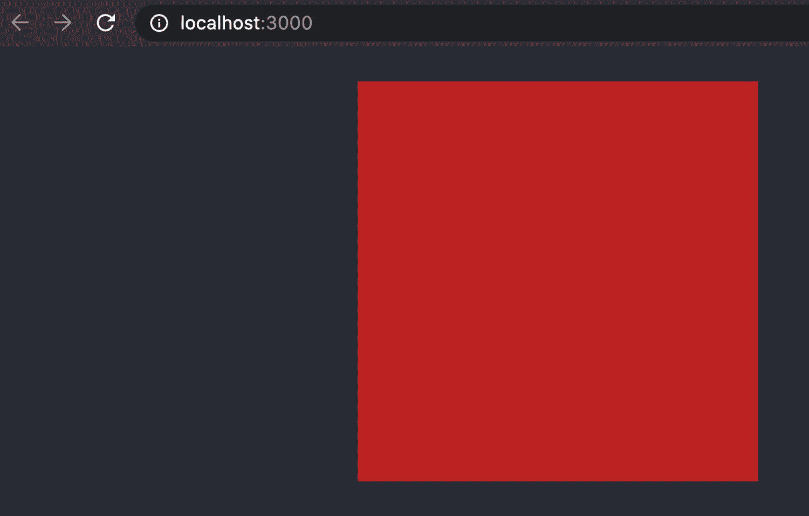
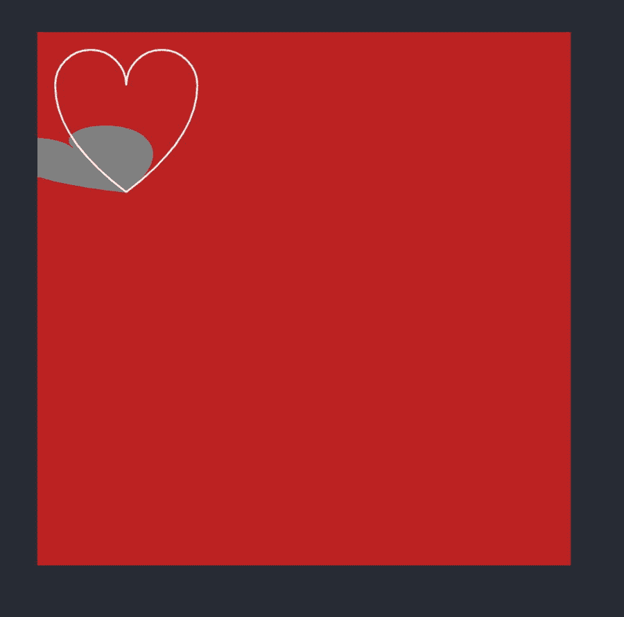
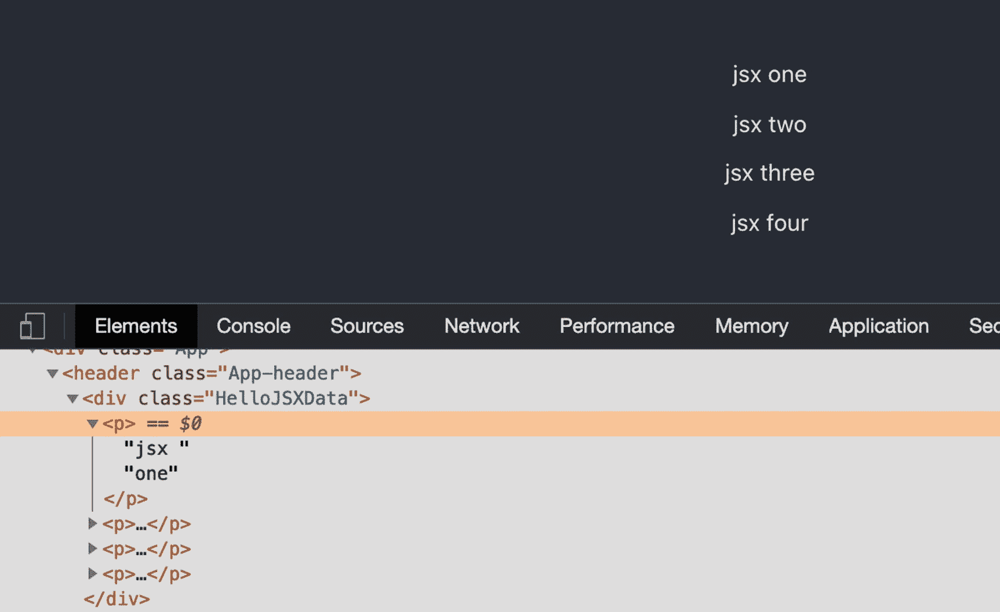
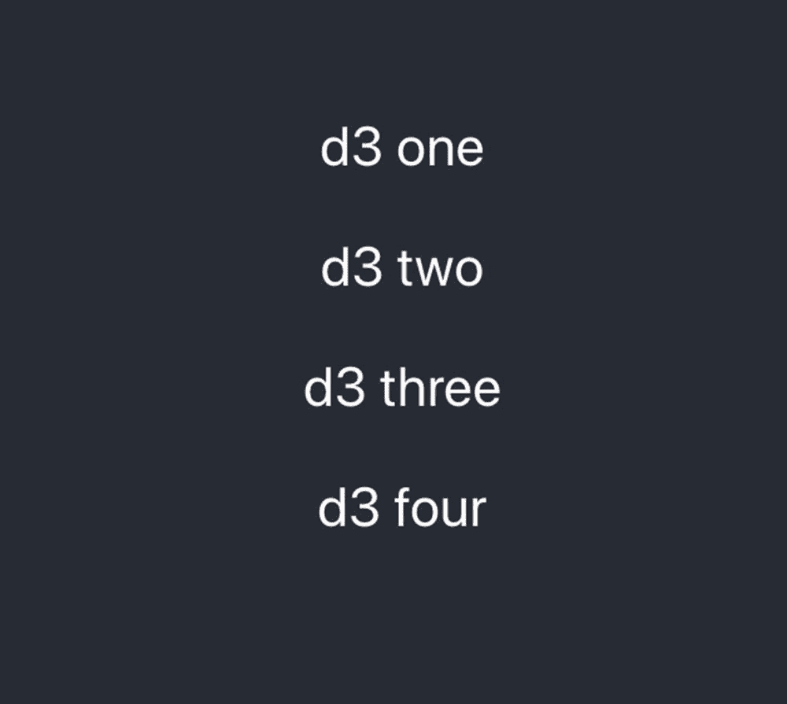
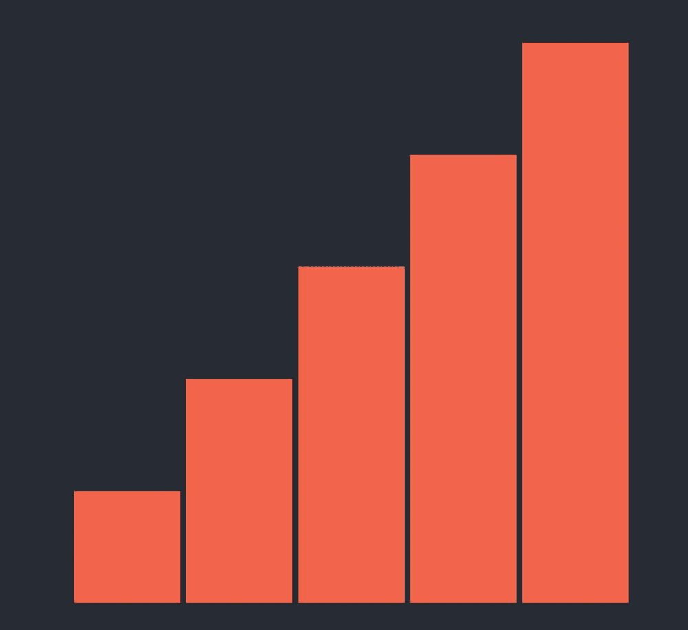
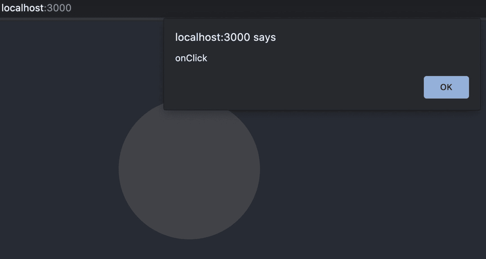
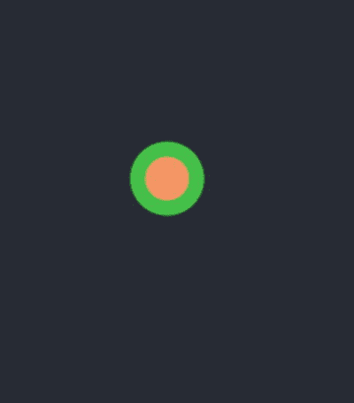

# 二、图形和交互

在这一章中，我将向你展示你有哪些选择，并将创建图表的过程分解成更小的部分，这样你就可以在深入研究和创建图表之前更好地理解这个过程。这个过程可以分为三层:数据、视图和用户交互。

在这些层的任何部分，您都可以使用 React、D3 或任何其他与 React 集成的库。有选择是很棒的；然而，决定使用什么和何时使用也是令人困惑的。理解你的选择是很重要的，因为它能帮助你做出明智的决定。

这一章分为三个主要部分。

*   制图法

*   用户手势

*   鼓舞

在本章的第一部分，我将展示如何使用 React 函数组件和类组件创建带有 HTML 和 SVG 元素的图形。我们将利用 React 的 JSX 以及 D3。我们将消耗数据和绘制元素。在本节的最后一部分，我们将创建第一个简单的图表。

在本章的第二部分，我将向你展示如何在 React 和 D3 里设置鼠标事件。

最后，我们将学习如何使用 React 制作动画，以及如何使用 D3 制作动画。

在本章结束时，你会明白在绘图、设置事件和制作动画时你有哪些选择。在这个过程中，我将向您展示设置函数和类组件的选项，并且我们将稍微讨论一下组件生命周期挂钩。还有，我会给你一些提示。

我们开始吧。

## 创建图表概述

正如我提到的，要创建数据可视化组件，这个过程可以分为三个主要层:数据、视图和用户交互。

让我们看看每一层都包括什么。

数据层由以下任务组成:

*   获取数据。

*   设定日期

*   处理数据。

视图层由以下内容组成:

*   与 React 生命周期挂钩集成。

*   画一辆手推车

*   设置组件的样式。

用户交互层包括以下内容:

*   添加转场。

*   处理用户手势。

绘制图表时，从数据开始是一个好的起点。你需要看到数据在讲述什么故事。一旦你理解了这个故事，就该选择一个图表了。您可以集成许多不同的现成图表库，也可以使用 D3 创建您的自定义解决方案。你的选择是无限的。不管你决定使用什么，理解所有东西是如何工作的是至关重要的。

## 绘制图形

你可能知道，React JSX 代码可能看起来很像 HTML，但它不是。这是 JavaScript 扩展(JSX)代码。

Note

JSX 是一个 React 扩展，它使用模仿 HTML 代码的 JavaScript 标签，因此代码大部分类似于 HTML，但它不是 HTML。

为了理解 React 为什么使用 JSX 而不仅仅是纯 HTML，我们首先需要谈谈文档对象模型(DOM)。React 会在后台处理您的 JSX 代码，然后将这些更改提交到用户的浏览器中，以加快用户页面的加载速度。

Note

文档对象模型(DOM)是 HTML 的内存表示，并且是树形结构。

React 努力匹配 HTML，JSX 可以识别 HTML 中支持的标签。SVG 就是一个很好的例子。我们在第 1 章中看到了如何将 SVG 标签添加到 React 渲染部分。

> *可缩放矢量图形(SVG)是一种基于 XML 的标记语言，用于描述基于二维的矢量图形。因此，它是一个基于文本的开放 web 标准，用于描述可以以任何大小清晰呈现的图像，并且专门设计为与其他 Web 标准(包括 CSS、DOM、JavaScript 和 SMIL)配合使用。本质上，SVG 对于图形就像 HTML 对于文本一样。【T6*
> 
> [`https://developer.mozilla.org/en-US/docs/Web/SVG`](https://developer.mozilla.org/en-US/docs/Web/SVG)

SVG 元素包括许多不同类型的图形，每个元素都有自己的属性集，从图像到圆形、线条、文本元素、矩形、组等等。即使是最有经验的 HTML 开发人员也不知道 SVG API 中的所有 SVG 元素和属性。

要了解关于 SVG 的更多信息，您可以在这里查看可用 SVG 标签的完整列表:

[T2`https://developer.mozilla.org/en-US/docs/Web/SVG/Element`](https://developer.mozilla.org/en-US/docs/Web/SVG/Element)

我建议您将此页面加入书签，并在需要时参考。

### SVG vsHTML

要画图形，SVG 是标准。SVG 已经成熟，在撰写本文时是第 2 版(从 2016 年开始)。您可以在此阅读第 2 版:

```jsx
https://github.com/w3c/svgwg/wiki/SVG-2-new-features

```

然而，我想指出还有其他方法来画图形。例如，我们可以通过 JavaScript 使用 HTML `<canvas>`元素。元素是一个图形容器。

SVG 对于较少数量的对象或较大的表面提供了更好的性能。对于较小的表面或较大数量的对象，画布可以提供更好的性能。

画布可能会变得模糊，需要检查和调整设备像素比率。为了避免不同设备像素比率的模糊图像，请在此处查看 Mozilla 文档:

[T2`https://developer.mozilla.org/en-US/docs/Web/API/Window/devicePixelRatio`](https://developer.mozilla.org/en-US/docs/Web/API/Window/devicePixelRatio)

下面是使用 canvas 和 SVG 之间的区别的简要概述:

*   SVG 允许用 CSS 进行样式化；画布只能通过脚本来更改。

*   SVG 是基于向量的；画布是基于光栅的(矩形像素网格)。

*   SVG 提供了比画布更好的可伸缩性，所以一旦一个元素需要缩放，SVG 是首选。

*   SVG 比 canvas 具有更大的屏幕和更少的对象的性能优势；但是，如果您使用较小的屏幕尺寸和许多对象，画布会更好。

### JSX Canvas(密西西比州)

画布( [`https://www.w3schools.com/html/html5_canvas.asp`](https://www.w3schools.com/html/html5_canvas.asp) )可以用来绘制 HTML 中的组件。事实上，您不仅可以使用画布来绘制组件，还可以将它制作成动画并操纵元素属性。React JSX 版本的画布没有什么不同。

让我们创造一个例子。我们可以使用我们在第 [1 章](01.html) ( `react-d3-hello-world`)中创建的同一个项目，并添加一个包含画布的组件。你可以从该书的资源库下载本章所有示例的最终代码。

[T2`https://github.com/Apress/integrating-d3.js-with-react/tree/main/ch02`](https://github.com/Apress/integrating-d3.js-with-react/tree/main/ch02)

#### JSXCanvas.tsx

我们将组件称为`JSXCanvas`。你可以自己创建文件，或者使用我为你设置的模板从`generate-react-cli`那里获得帮助。

```jsx
npx generate-react-cli component JSXCanvas --type=d3

```

在我们的`JSXCanvas`组件中，我们将使用画布 JSX 组件，它匹配 HTML 画布。我们将改变属性来改变画布的颜色为番茄红。

让我们看一下代码。

```jsx
// src/component/JSXCanvas/JSXCanvas.tsx

```

首先，我们导入将要使用的 React 库和 SCSS 文件。

```jsx
import React, { RefObject, useEffect, useRef } from 'react'
import './JSXCanvas.scss'

```

我们将使用`ref`对象和`useEffect`。我们首先创建对画布的引用。

当涉及到 TypeScript 时，我们需要定义对象的类型(当类型不能通过赋值清楚地推断出来时)。对于画布，它的类型应该是`HTMLCanvasElement`。

```jsx
const JSXCanvas = () => {

 const canvasRef: RefObject<HTMLCanvasElement> = useRef(null)

```

一旦组件被初始化，我们就可以设置`useEffect`方法。

什么是`useEffect`？`useEffect`在渲染过程完成后调用。`useEffect`检查上一次渲染的依赖值，如果其中任何一个发生变化，将调用你的效果函数。

在我们的例子中，当这种情况发生时，我们可以画出我们的画布。我们在这里使用 React 函数组件，设置一个 draw 方法是一个很好的方法，而不是仅仅在`useEffect`中编写代码，因为该函数可以被其他方法使用。然而，在某些情况下，在`useEffect`中编写实际代码会更有意义，这一点您将在本书后面看到。

```jsx
  useEffect(() => {
    draw()
  })

```

我们的 draw 方法将使用我们创建的对`<canvas>`元素的引用，然后使用画布上下文，我们可以设置画布属性，如`width`、`height`和`color`。CanvasRenderingContext2D 接口是 Canvas API 的一部分，它为 Canvas 元素的绘制表面提供了 2D 渲染上下文。它用于绘制形状、文本、图像和其他对象。【T8

[`https://developer.mozilla.org/en-US/docs/Web/API/CanvasRenderingContext2D`](https://developer.mozilla.org/en-US/docs/Web/API/CanvasRenderingContext2D)

看一看:

```jsx
  const draw = () => {
    const canvas = canvasRef.current
    const context = canvas?.getContext('2d')
    if (context) {
      context.fillStyle = 'tomato'
      context.fillRect(0, 0, context.canvas.width, context.canvas.height)
    }
  }

```

最后，在渲染方面，我们将使用我们创建的引用来设置 JSX 画布。

```jsx
  return (
    <>
      <canvas ref={canvasRef} />

    </>
  )
}
export default JSXCanvas

```

还有另一种方法可以编写更少的关于引用的代码。我们可以内联的方式来完成，而不是定义变量然后在组件中赋值。让我们来看看。

我们设定了`ref`。

```jsx
ref: SVGCircleElement | undefined

```

接下来，我们可以在 JSX 代码中内联赋值`ref`。

```jsx
<canvas
  ref={canvasRef} />
  // eslint-disable-next-line no-return-assign
  ref={(ref: SVGCircleElement) => (this.ref = ref)}
/>

```

然而，这不是最干净的代码，因为根据最佳编码实践，我们不应该返回赋值；然而，这就是为什么我通过添加一个`eslint`评论来禁止 ESLint 抱怨。但是，由于代码的模糊性，不推荐这种方法；我想让你看看这些选项。

#### App.tsx

记得将组件添加到您的`App.tsx`父组件中。

```jsx
// src/App.tsx

function App() {
  return (
    <div className="App">
      <header className="App-header">
        <JSXCanvas />
      </header>
    </div>
  )
}

```

要查看图形，请确保您仍在第 [1](01.html) 章中的端口 3000 上运行。

```jsx
$ yarn start

```

图 [2-1](#Fig1) 显示了最终结果。


图 2-1

根据我们选择的尺寸和颜色进行画布绘制

缩放怎么样？是的，您可以使用缩放并根据屏幕大小调整画布，以避免画布放大后变得模糊。为此，使用`context.scale`。

```jsx
const { devicePixelRatio: ratio = 1 } = window
context.scale(ratio, ratio)

```

但是，如果您希望在所有设备上获得清晰的打印质量，或者您需要缩放等功能，SVG 会提供更好的结果。我不打算深入研究画布，因为我建议继续使用 SVG 然而，我想让你知道这是可能的，如果你曾经有一个用例需要一个画布，比如在一个针对较小屏幕尺寸和许多对象的用例中，你会在你的工具箱中有它。

### React SVG

要用 React 创建 SVG 图形，让我们添加另一个组件，名为`HelloSVG`。

```jsx
npx generate-react-cli component HelloSVG --type=d3

```

`generate-react-cli`模板已经包含了在 React 中显示 SVG 元素所需的代码。看一看:

```jsx
import React from 'react'
import './HelloSVG.scss'

const HelloSVG = () => {

  return (
    <div className="HelloSVG">
      <svg width="500" height="500">
        <g transform="translate(0, 0)">
          <rect width="300" height="300" fill="tomato" />
        </g>
      </svg>
    </div>
  )
}

export default HelloSVG

```

注意，我使用了`transform`属性。转换将组元素移动到左上角。您可以在 Mozilla 文档中了解更多关于`transform`属性的信息。

[T2`https://developer.mozilla.org/en-US/docs/Web/SVG/Attribute/transform`](https://developer.mozilla.org/en-US/docs/Web/SVG/Attribute/transform)

现在，如果我们想改变矩形的设计属性，而不使用`fill`属性用颜色填充 SVG 矩形。React 为 HTML 类提供了一个匹配的属性( [`https://developer.mozilla.org/en-US/docs/Web/SVG/Attribute/class`](https://developer.mozilla.org/en-US/docs/Web/SVG/Attribute/class) ): `className`。我们可以指定一个类名，并在我们的 SCSS 文件中定义它。这并不新鲜，所有的 React 组件都是这样工作的。

```jsx
// HelloSVG.tsx
<rect className="myRect" width="300" height="300" />

// HelloSVG.scss
.myRect {
  fill: #ba2121;
}

```

最后，我们需要将组件添加到我们的入口点`App.tsx`。

```jsx
// src/App.tsx

<HelloSVG />

```

图 [2-2](#Fig2) 显示了我们的 SVG 矩形元素。



图 2-2

使用 SVG 绘制矩形

属性可以用于很多事情，比如旋转、缩放和倾斜。

例如，如果我们想实现 Mozilla docs ( [`https://developer.mozilla.org/en-US/docs/Web/SVG/Attribute/transform`](https://developer.mozilla.org/en-US/docs/Web/SVG/Attribute/transform) )中的例子。该示例使用`xlink`将一个 SVG 路径分配给一个元素以供重用，从而创建一个心形和一个阴影效果。不幸的是，你经常会看到，如果没有一定程度的修改和知识，你不能将你在网上看到的大多数代码(无论是否与 D3 相关)复制粘贴到 React 中。

在我们的例子中，Mozilla 示例无法编译的原因是 React SVG 不包含`use xlink`，因此这段代码将生成一个错误:

```jsx
<use xlink:href="#heart" fill="none" stroke="white"/>

```

代码将生成错误“Type { xlink:true；}不可赋给类型 SVGProps <svguseelement>。</svguseelement>

该错误是由于 React `SVGUseElement`在 React 的当前版本(撰写本文时为版本 17)中不包含`xlink`而导致的。然而，不要惊慌，因为这不是世界末日。我们需要做的是定义标签，然后我们就可以使用它了。

```jsx
const useTag = '<use xlink:href="#heart" />'

```

接下来，我们可以用一个 SVG 路径(在我们的例子中是一个心脏的形状)建立一个组，转换属性将使心脏看起来像一个阴影。

```jsx
<g
  fill="grey"
  transform="rotate(-10 50 100)
    translate(-36 45.5)
    skewX(40)
    scale(1 0.5)"
>
  <path id="heart" d="M 10,30 A 20,20 0,0,1 50,30 A 20,20 0,0,1 90,30 Q 90,60 50,90 Q 10,60 10,30 z" />
</g>

```

然后我们可以使用我们在 SVG 标签中设置的`useTag`常量来拖动实际的心脏。

```jsx
<svg dangerouslySetInnerHTML={{__html: useTag }} fill="none" stroke="white" />

```

使用`dangerouslySetInnerHTML`完成对`useTag`的赋值。

`dangerouslySetInnerHTML`听起来很吓人，顾名思义，你应该小心使用它，因为恶意代码可能会被注入到那个标签中。这就是为什么你需要添加`eslint`评论来防止 ESLint 对这个消息的攻击。

```jsx
{/* eslint-disable-next-line react/no-danger */}

```

在我们的例子中，我们知道我们在做什么，我们没有传递一些可能导致注入攻击的运行时字符串，所以我们很好。

看一下整个代码块:

```jsx
const HelloSVG = () => {
  const useTag = '<use xlink:href="#heart" />'
  return (
    <div className="HelloSVG">
      <svg width="500" height="500">
        <g transform="translate(0, 0)">
          <rect className="myRect" width="300" height="300" /* fill="tomato" */ />
        </g>
        <g
          fill="grey"
          transform="rotate(-10 50 100)
            translate(-36 45.5)
            skewX(40)
            scale(1 0.5)"
        >
          <path id="heart" d="M 10,30 A 20,20 0,0,1 50,30 A 20,20 0,0,1 90,30 Q 90,60 50,90 Q 10,60 10,30 z" />
        </g>
        {/* eslint-disable-next-line react/no-danger */}
        <svg dangerouslySetInnerHTML={{__html: useTag }} fill="none" stroke="white" />
      </svg>
    </div>
  )
}

```

输出为我们创建了心脏轮廓和阴影，如图 [2-3](#Fig3) 所示。如果我想给阴影添加一个轮廓，那不成问题。我们可以将相同的 SVG 代码放在 group 元素中。让我们继续试一试。



图 2-3

通过 xlink 使用 SVG

### 使用 JSX 在 React 中映射数据

为了使它比仅仅使用 SVG 更加真实和有趣，我们现在想使用 React `props`传递来自父组件的数据，并使用带有一些简单 React 代码的 HTML `p`标签来绘制数据。让我告诉你怎么做。

#### HelloJSXData.tsx

自己或者用模板创建一个新组件，并将其命名为`HelloJSXData`。

```jsx
npx generate-react-cli component HelloJSXData --type=d3

```

接下来，导入风格 SCSS 和 React。

```jsx
// src/component/HelloJSXData/HelloJSXData.tsx

import React from 'react'
import './HelloJSXData.scss'

```

接下来，设置我们将传递给子组件的`props`。我指向一个我将在文件底部定义的接口。

```jsx
const HelloJSXData = ( props : IHelloJSXDataProps ) => {

```

在 JSX 渲染方面，我将映射数组并从父组件传递它。一旦数据被映射，我们就可以使用`p` HTML 标签在屏幕上显示数据。看一看:

```jsx
  return (
    <div className="HelloJSXData">
      {props.data.map((d, index) => (
        <p key={`key-${  d}`}>
          jsx {d}
        </p>
      ))}
    </div>)
}

```

这是我们对`props`的接口，只是传递一个由字符串组成的数组:

```jsx
interface IHelloJSXDataProps {
  data: string[]
}

export default HelloJSXData
App.tsx

```

和往常一样，记得给 app 加上`HelloJSXData`。

```jsx
// src/app
function App() {
  return (
    <div className="App">
      <header className="App-header">
        <HelloJSXData data={['one', 'two', 'three', 'four']} />
      </header>
    </div>
  )
}

```

参见图 [2-4](#Fig4) 中的最终结果。



图 2-4

使用 React 代码映射数据示例

我将向您展示如何使用`p` HTML 标签来简化事情，但是这也可以是一个 SVG 元素，比如一个圆形或一个矩形，正如我将在其他示例中展示的那样。

### 使用 D3 在 React 中映射数据

前面的例子是纯粹、简单的 React 代码。在这个例子中，我们添加 D3 来为我们添加地图和绘图。我们姑且称这个组件为`HelloD3Data`。

#### HelloD3Data.tsx

```jsx
npx generate-react-cli component HelloD3Data --type=d3

```

我们将使用 D3，所以确保你已经有了 D3 和导入的类型，如果你以前没有为这个项目做过的话。

```jsx
yarn add d3 @types/d3

```

让我们从定义将要使用的导入开始。

```jsx
// src/component/HelloD3Data/HelloD3Data.tsx

import React, { useEffect } from 'react'
import './HelloD3Data.scss'
import * as d3 from 'd3'

```

和以前一样，我们将设置我们的`props`接口来传递相同的字符串数组。

```jsx
const HelloD3Data = ( props : IHelloD3DataProps ) => {

  useEffect(() => {
    draw()
  })

```

当我们使用 D3 时，我们需要首先选择我们将在 JSX 渲染中设置的元素。接下来，通过使用 d3 `selectAll` API，我们可以选择 p HTML 元素和`data`属性。然后我们可以传递关于`text`属性的数据。我将使用 inline 函数将文本设置为数据值。看一看:

```jsx
  const draw = () => {
    d3.select('.HelloD3Data')
      .selectAll('p')
      .data(props.data)
      .enter()
      .append('p')
      .text((d) => `d3 ${  d}`)
  }

```

对于我们的渲染，我们将设置一个`div`作为我们的`p`标签的包装器。

```jsx
  return <div className="HelloD3Data" />
}

interface IHelloD3DataProps {
  data: string[]
}

export default HelloD3Data

```

最后，让我们设置父组件。

```jsx
// src/app
<HelloD3Data data={['one', 'two', 'three', 'four']} />

```

你可以在图 [2-5](#Fig5) 中看到结果。



图 2-5

使用 D3 和 React 代码映射数据示例

如你所见，当比较 React 和 D3 之间数据迭代的两个例子时，D3 看起来不如 React 直观。我们的例子本质上很简单，但是当需要大量计算和大型数据集时，D3 将会大放异彩。

### 带 D3 的简单条形图

到目前为止，我们已经处理了简单的例子，并操作了 HTML 元素，如`<canvas>`、`p`标签和`div`。此外，我们还使用了 SVG 和 D3。

现在我们准备用 D3 创建我们的第一个数据可视化图表，并进行 React。我们的例子与上一个例子相似。我们获取数据，并使用 D3 中的 data 属性，我们将遍历我们的数据，并使用 rectangle SVG 元素来绘制条形，就像我们使用`p` HTML 标签一样。看一看:

```jsx
// src/component/SimpleChart/SimpleChart.tsx

import React, { RefObject } from 'react'
import './SimpleChart.scss'
import * as d3 from 'd3'

```

这一次，让我们用一个类组件而不是函数组件来创建图表，这样您就可以看到不同之处了。

我想指出的是，当你不需要`shouldComponentUpdate`生命周期事件时，最好扩展 React `PureComponent`。

Tip

`React.PureComponent`在某些情况下提供了性能提升，但代价是失去了`shouldComponentUpdate`生命周期挂钩。你可以在 React 文档( [`https://reactjs.org/docs/react-api.html#reactpurecomponent`](https://reactjs.org/docs/react-api.html%2523reactpurecomponent) )中了解更多。

```jsx
export default class Component extends React.PureComponent<ISimpleChartProps, ISimpleChartState> {

```

我将保存对我将用来包装图表的`div`的引用，并将数据保存在 numbers 类型的数据数组中。

```jsx
  ref: RefObject<HTMLDivElement>

  data: number[]

```

在类构造函数中，我设置接口，创建引用，并设置数据。

请注意，我并不需要状态，但我正在设置它，以防将来需要它。这是一个好习惯。

```jsx
  constructor(props: ISimpleChartProps) {
    super(props)
    this.state = {
      // TODO
    }
    this.ref = React.createRef()
    this.data = [100, 200, 300, 400, 500]
  }

```

正如您在前面的函数组件示例中回忆的那样，我们称之为`draw`函数。在 React 类组件中，我们可以在`componentDidMount`生命周期挂钩期间调用`draw`方法。

Tip

`componentDidMount()`生命周期挂钩是安装阶段的一部分，可以被类组件覆盖。在第一次安装组件时，在一个`componentDidMount()`生命周期钩子中定义的任何动作只被调用一次。

```jsx
  componentDidMount() {
    this.drawChart()
  }

```

在`drawChart`方法上，我会借助 D3。我首先选择引用，然后使用 append 添加一个 SVG 元素，最后设置我们的宽度和高度。

由于我设置了`data`属性，D3 将自动遍历数据来绘制我们所有的矩形。这与我们在前面的例子中使用`p`标签是一样的，但是这里我们使用一个矩形标签来代替 HTML `p`标签。看一看:

```jsx
  drawChart() {
    const size = 500
    const svg = d3.select(this.ref.current)
    .append('svg')
    .attr('width', size)
    .attr('height', size)

    const rectWidth = 95
    SVG
      .selectAll('rect')
      .data(this.data)
      .enter()
      .append('rect')
      .attr('x', (d, i) => 5 + i * (rectWidth + 5))
      .attr('y', (d) => size - d)
      .attr('width', rectWidth)
      .attr('height', (d) => d)
      .attr('fill', 'tomato')
  }

```

为了渲染，我正在设置我们将使用的`div`包装器。注意，我并不真的需要引用，因为我可以使用`className`选择元素。在本例中，这是一个由您决定什么更直观的偏好问题。

```jsx
  render() {
    return <div className="SimpleChart" ref={this.ref} />
  }
}

```

Tip

在一些例子中，我们在元素类名上使用 D3 `select`,而在其他例子中使用引用。在我们的例子中，使用类名作为引用很好；然而，在有些情况下，我们希望 React 控制我们的组件，这就是设置引用更好的地方，因为 React 知道元素中的变化。这种情况会出现在列表中:`array.map((item: object) => ( <ListItem item={item} /> ))}`。React 遍历一个列表，如果我们使用一个 map 来呈现这个列表，而这个组件没有使用 reference，那么计算就会被关闭。

最后，正如我之前所做的，我正在定义`props`和状态，在这个例子中我不需要它们，但是我在这个例子中设置它们，因为它们在将来可能会被需要。

```jsx
interface ISimpleChartProps {
  // TODO
}

interface ISimpleChartState {
  // TODO
}
App.tsx

```

将`<SimpleChart />`组件添加到`App.tsx`，就像我们在前面的例子中所做的一样。你可以在图 [2-6](#Fig6) 中看到最终的结果。



图 2-6

使用 React 和 D3 的简单条形图

祝贺您，您刚刚创建了您的第一个图表—条形图！

#### React 组件生命周期挂钩

当谈到 React 时，你真的想熟悉 React 的 16.9 版和更高的生命周期挂钩，因为它们自 16.9 版以来发生了变化。深刻理解 React 的生命周期挂钩有助于确保仅在需要时才更改 DOM，以更好地配合 React 的 VDOM 范式，并确保您的组件得到优化。

React 中的每个组件都有一个生命周期，您可以在它的三个主要生命周期阶段对其进行监控和操作。

*   *挂载阶段*:组件被创建来开始它的单向数据流之旅，并到达 DOM。它使用`constructor()`，以及以下方法:静态`getDerivedStateFromProps()`、`render()`和`componentDidMount()`。

*   *更新阶段*:组件被添加到 DOM 中，更新可以在属性或状态改变时重新呈现。事件有:静态`getDerivedStateFromProps()`、`shouldComponentUpdate()`、`render()`、`getSnapshotBeforeUpdate()`、`componentDidUpdate()`。

*   *卸载阶段*:这是组件生命周期的最后一个阶段。组件被销毁并从`DOM.componentWillUnmount()`移除。

在 React 17 中，对以前的方法如`componentWillMount`的访问被否决了，你应该使用新的钩子来访问组件生命周期。包括`getDerivedStateFromProps`、`getSnapshotBeforeUpdate`、`componentDidMount`、`componentDidUpdate`。

您可能需要重温您的生命周期挂钩知识，或者只是看看您可以用 React 创建的所有不同类型的类和函数组件。这超出了本书的范围，但是我强烈推荐您在这里阅读我的文章:

```jsx
https://medium.com/react-courses/react-component-types-functional-class-and-exotic-factory-components-for-javascript-1a098a49a831

```

## 用户手势

用户与图形的交互与用户与任何 React 组件的交互没有什么不同。当涉及到鼠标事件时，React JSX 支持 HTML 和 SVG。

但是，您仍然可以选择如何利用这些事件。

您可以使用 JSX 事件或使用 D3。何时使用工具取决于您正在构建什么。如果您使用 D3 来创建图形，您将需要也使用 D3 事件；然而，如果你使用 JSX 创建你的图形，你可以使用 JSX 或 D3。选择权在你。

出于这些原因，我将向您展示这两种方法。让我们来看看。

### 对鼠标事件做出 React

让我们创建一个类组件，并将其命名为`CircleWithEvents`。

```jsx
// src/component/CircleWithEvents/CircleWithEvents.tsx

import * as React from 'react'
import './CircleWithEvents.scss'

export default class CircleWithEvents extends React.PureComponent<ICircleWithEventsProps> {

  componentDidMount() {
    // TODO
  }

```

接下来，设置事件处理程序。我只是设置了一个警报来显示事件被调度。代码被注释掉了，供您随意使用。

```jsx
  onMouseOverHandler(event: React.MouseEvent<SVGCircleElement, MouseEvent>) {
    // alert('onMouseOverHandler')
  }

  onMouseOutHandler() {
    // alert('onMouseOutHandler')
  }

```

注意，我使用的是`React.MouseEvent`而不是标准 HTML 的`MouseEvent`。

Tip

在 React 中，事件是对鼠标悬停、鼠标点击、按键等特定动作的触发 React。在 React 中处理事件类似于在 DOM 元素中处理事件。但是有一些句法上的差异。

> *synthetic event**，围绕浏览器原生事件的跨浏览器包装器。它与浏览器的本机事件具有相同的接口，包括 stopPropagation()和 preventDefault()，只是这些事件在所有浏览器中的工作方式相同。【T6*
> 
> [`https://reactjs.org/docs/events.html`](https://reactjs.org/docs/events.html)

事件使用 camel case 命名，而不是仅仅使用小写字母。这里举两个例子:`React.KeyboardEvent`和`React.MouseEvent`。

事件作为函数而不是字符串传递。如果您遵循代码，您可以看到 React 事件扩展了`UIEvents`，它扩展了`SyntheticEvent`。

React 使用自己的事件系统。这就是为什么我们通常不能使用标准 DOM 中的`MouseEvent`。

我们需要使用 React 的事件；否则，我们会得到一个错误，或者我们不能访问方法。一般来说，大多数事件都以相同的名称映射。

幸运的是，React 的类型为您提供了标准 DOM 中您可能熟悉的每一个事件的适当等价物。

我们可以使用`React.MouseEvent`或者从 React 模块导入`MouseEvent`类型。

在渲染方面，我将设置一个空的包装器标签，如，一个 SVG 组，一个半径(`r`)为 100 像素的圆，以及鼠标事件。

```jsx
  render() {
    return (
    <>

        <svg width="500" height="500">
          <g>
            <circle
              className="circle"
              transform="translate(150 150)"
              r="100"
              onMouseOver={(event) => {
                event.stopPropagation()
                this.onMouseOverHandler(event)
              }}
              onMouseOut={(event) => {
                event.stopPropagation()
                this.onMouseOutHandler()
              }}

```

对于点击事件，让我们做一些不同的事情。我将使用内嵌函数(arrow 函数，又名 *fat 函数*)来显示鼠标点击事件的警告。

```jsx
              onClick={(event) => {
                event.stopPropagation()
                // eslint-disable-next-line no-alert
                alert('onClick')
              }}
            />
          </g>
        </svg>
       </>

    )
  }
}
interface ICircleWithEventsProps {
  // TODO
}

```

注意，我的 SVG 圆圈包含一个名为`circle`的`className`属性，在这里我将设置一些 CSS 属性，比如光标指针的显示、圆圈的宽度和高度以及灰色填充颜色。这些属性可以在组件本身上设置，但是这样代码更简洁。

```jsx
// src/component/CircleWithEvents/CircleWithEvents.scss

.circle {
  cursor: pointer;
  width: 150px;
  height: 150px;
  fill: #6666;
}
App.tsx

```

最后，像往常一样，记住将组件添加到`App.tsx`。继续点击圆圈；不要害羞。

```jsx
// src/App.tsx

import CircleWithEvents from './components/CircleWithEvents/CircleWithEvents'

<CircleWithEvents />

```

参见图 [2-7](#Fig7) 中的最终结果。



图 2-7

用鼠标事件圈出 SVG

### D3 鼠标事件

在下一个示例中，我将复制上一个示例中的相同功能，用鼠标事件设置一个圆圈；然而，这一次，我将使用 D3 代替 React JSX。让我们来看看。

设置`imports`和`class`组件。

```jsx
// src/component/CircleWithEvents/CircleWithD3Events.tsx

import * as React from 'react'
import './CircleWithEvents.scss'
import * as d3 from 'd3'

export default class CircleWithD3Events extends React.PureComponent<ICircleWithD3EventsProps> {

```

一旦调用了`componentDidMount`事件，我将调用我的`draw()`方法。

```jsx
  componentDidMount() {
    this.draw()
  }

```

接下来，我将设置与上一个示例相同的事件处理程序。

```jsx
  onMouseOverHandler(event: React.MouseEvent<SVGCircleElement, MouseEvent>) {
    // alert('onMouseOverHandler')
  }

  onMouseOutHandler() {
    // alert('onMouseOutHandler')
  }

```

我的`draw()`方法将选择我的 SVG 包装元素，然后添加一个组元素和一个圆形元素，并使用 D3 上的`.on`方法设置事件。

在这个例子中，我甚至附加了同一个类圈。

Note

React JSX 调用类属性`className`，在 D3 属性匹配 HTML SVG，所以它会是`class`。

```jsx
  draw = () => {
    d3.select('svg')
      .append('g')
      .append('circle')
      .attr('transform', 'translate(150, 150)')
      .attr('r', 100)
      .attr('class', 'circle')
      .on('click', () => {
        alert('onClick')
      })
      .on('mouseover', (event) => {
        this.onMouseOverHandler(event)
      })
      .on('mouseout', (event) => {
        this.onMouseOutHandler()
      })
  }

```

如您所料，这是我在渲染端的 SVG 包装器:

```jsx
  render() {
    return (
    <>

        <svg id="svg" width="500" height="500" />

    </>
    )
  }
}

interface ICircleWithD3EventsProps {
  // TODO
}
App.tsx

```

添加我们的组件`App.tsx`，你会看到与图 [2-7](#Fig7) 相同的结果。

```jsx
// src/App.tsx

import CircleWithD3Events from './components/CircleWithEvents/CircleWithD3Events'

<CircleWithEvents />

```

你可以看到，对于大多数人来说，React JSX 更直观，更容易阅读；但是，如果你需要写 D3 代码，你需要使用 D3 事件，一旦你明白你在做什么，它会很简单。

了解这两个选项会给您带来灵活性，并对您的代码有更多的控制。当我们希望 d3 负责我们组件的 DOM 时，最好使用 React 元素并尽可能多地绑定 React。在我们需要接管处理 DOM 任务的情况下，拥有 d3 可以帮助我们。

## 动画图形

在这一部分，我将介绍交互层的另一部分:创建动画。当我们改变数据或显示数据随时间的变化时，我们可能希望创建一个过渡，我们可以用动画或*过渡*以更优雅的方式来实现。

React 提供了许多创建转场的方法。以下是一些例子:

*   *CSS* *转场*:我们可以使用普通的旧 CSS，将 CSS 转场作为样式表的一部分，或者动态地使用`style={{someCSSPropertyExample: 50}}`。

*   *CSS-in-JS 模块*:如果使用 CSS-in-JS 模块之类的库，可以用直观的方式设置过渡。

*   D3 转换 : D3 也使用转换 API 提供转换。

当我们开发图表时，我们将使用过渡，正如我们在事件中看到的那样，知道我们的选项是很好的。

我将向您展示 CSS-in-JS 模块和 D3。

### 使用 React 制作动画

CSS-in-JS 模块是设计 React 应用的流行选项，因为它们与 React 组件紧密集成，并具有允许您更改从父组件传递的属性或从状态绑定属性的功能。

事实上，CRA·MHL 图书馆项目是用现成的 Material-UI 和样式组件建立的，所以你不需要安装任何东西；我们可以开始使用材质 UI 和样式组件。

例如，我们可以基于 React `props`改变我们的风格。此外，默认情况下，这些系统中的大多数都将所有样式的范围扩展到被样式化的相应组件。

当谈到 CSS-in-JS 模块时，有许多选项可供选择，如样式化组件、情感和样式化 jsx。

我选择了风格化组件，因为它与 Material-UI 密切相关；你可以在 [`https://styled-components.com`](https://styled-components.com) 了解更多(如果你不熟悉的话)。

但是等等，为什么我们需要样式化的组件？Material-UI 不是已经有了类似于样式化组件的样式化导入吗？

是的，Material-UI 是一个很棒的组件库，它模仿了 Google 的材质设计，并内置了样式机制。那么为什么还不够呢？简单的回答是，Material-UI CSS-in-JS 解决方案感觉不如样式化组件强大。Material-UI 从一开始就被设计成使用自己的样式解决方案 CSS-in-JS。但是有时你想要其他在 Material-UI 风格中没有的特性，或者你像我一样，只是更喜欢风格化的组件。

幸运的是，Material-UI 确实简化了其他样式解决方案的使用。

Styled Components 是另一个用于样式化 React 组件的伟大库。这是通过定义没有 CSS 类的 React“样式化”组件来实现的。当您想要编写常规 CSS、传递函数和`props`时，最好使用样式化组件。你可能会问，为什么不直接使用样式化的组件呢？

在撰写本文时，还没有很多成熟的库处于 Material-UI 水平，当然也没有达到 Material-UI 成熟度水平。

我们可以同时利用 Material-UI 和 Styled 组件的优点。

使用样式化组件将为您提供以下能力:

*   使用`props`有条件地渲染 CSS

*   SCSS 支持

*   CSS 的模板文字语法

还有更多。

对于我们将在本书后面使用的一个图表，我们需要一个脉动的圆。跳动的圆圈可以用来突出显示图表上的某些内容。

#### 脉动圈. tsx

为了使用样式组件库创建那个脉动的圆形组件，让我们创建一个新的功能组件，并将其命名为`PulsatingCircle.tsx`。

```jsx
// src/component/PulsatingCircle/PulsatingCircle.tsx

import React from 'react'

```

我们从样式组件中导入关键帧和样式。

```jsx
import styled, { keyframes } from 'styled-components'

```

现在，看看编写可以通过传递参数来更新的动态代码的能力。让我们定义一个采用两种颜色的函数。

```jsx
const circlePulse = (colorOne: string, colorTwo: string) => keyframes`
0% {
  fill:${colorOne};
  stroke-width:20px
}
50% {
  fill:${colorTwo};
  stroke-width:2px
}
100%{
  fill:${colorOne};
  stroke-width:20px
}

`

```

现在使用动画，我们可以创建一个无限的四秒钟线性循环来形成这种脉动效果。

```jsx
const StyledInnerCircle = styled.circle`
  animation: ${() => circlePulse('rgb(245,197,170)', 'rgba(242, 121, 53, 1)')} infinite 4s linear;
`

export default function PulsatingCircle(props: IPulsatingCircle) {

```

在渲染方面，我们可以使用作为 JSX 组件创建的`StyledInnerCircle`。

注意，我从`props`开始给 x，y 赋值。父组件可以传递这些。

```jsx
  return (
  <>

      <StyledInnerCircle cx={props.cx} cy={props.cy} r="8" stroke="limegreen" stroke-width="5" />
  </>

  )
}

```

在我们的`props`接口端，我们可以传递自定义组件的位置。

```jsx
interface IPulsatingCircle {
  cx: number  cy: number
}

```

将我们的组件添加到`App.tsx`。

```jsx
// src/app.tsx

<svg width={400} height={400} viewBox="0 0 800 450">
  <g>
    <PulsatingCircle cy={100} cx={100} />
  </g>
</svg>

```

你现在有了一个脉动的动画圆，如图 [2-8](#Fig8) 所示。



图 2-8

使用 React 样式组件的脉动圆

### 用 D3 制作动画

就用 D3 制作动画而言，这个过程遵循一个动画序列。如果你熟悉任何动画软件，你会发现 D3 更直观，因为你了解动画的概念。对其他人来说，这可能会令人困惑。

#### 脉动循环 3.tsx

作为一个例子，让我们创建另一个脉动圆，但这次让我们使用 D3。

导入并设置绘制方法。

```jsx
import React, { useEffect } from 'react'
import * as d3 from 'd3'

const PulsatingCircleD3 = () /* props */ => {
  useEffect(() => {
    drawPulsatingCircle()
  })
  const drawPulsatingCircle = () => {

```

为了保持循环，我将创建一个名为`repeat()`的函数。该功能将选择`circlSVGvg`元素(我正在 JSX 创建圆；现在你知道怎么做了，如果你想得到 100%纯的 D3)。

接下来，我将设置一个过渡。

在第一个 300 毫秒期间，我首先将笔画的属性设置为 0，然后设置持续时间并将笔画不透明度从 0 更改为 0.5。

接下来，我设置另一个笔画来改变，并在动画中使用 D3 缓动来创建正弦缓动(是的，就是我们在数学课上使用的正弦圆)。

最后，函数使用递归函数(调用自身的函数)调用自身进行循环。

```jsx
    (function repeat() {
      d3.selectAll('.circle')
        .transition()
        .duration(300)
        .attr('stroke-width', 0)
        .attr('stroke-opacity', 0)
        .transition()
        .duration(300)
        .attr('stroke-width', 0)
        .attr('stroke-opacity', 0.5)
        .transition()
        .duration(1000)
        .attr('stroke-width', 25)
        .attr('stroke-opacity', 0)
        .ease(d3.easeSin)
        .on('end', repeat)
    })()
  }

```

在 JSX，我正在创建一个半径为 8 像素，x，y 的位置为 50，50 的圆，如图 [2-9](#Fig9) 所示。


图 2-9

使用 D3 的脉动圆

```jsx
  return (
  <>

      <svg>
        <circle className="circle" cx="50" cy="50" stroke="orange" fill="orange" r="8" />
      </svg>
  </>

  )
}
export default PulsatingCircleD3

```

你可以看到这个想法是为了给动画排序。我肯定有些人会觉得这更复杂，而其他人会觉得这比上一个例子简单。

## 摘要

本章分解了开始用 React 和 D3 创建图表所需要知道的内容。这一章分成三个主要部分。

*   制图法

*   用户手势

*   鼓舞

在第一部分中，我向您展示了如何使用 React 函数和类组件用 HTML 和 SVG 元素创建图形。

我们同时使用了 JSX 和 D3。我们消耗数据，绘制元素。我们甚至创建了我们的第一个图表，一个条形图。

在第二部分中，您学习了用 D3 和 React 设置事件，以及用 React 和 D3 制作动画。

如你所见，在绘图、消耗数据、制作动画、甚至与选项交互时，你可以使用 React、D3 或其他库。这也是 D3 和 React 的独特之处。当需要将您的图表集成到现有代码中、对其进行测试，以及与拥有不同技能的不同成员团队合作时，这些选项集真的很方便；它甚至使你的代码更具可读性。

在下一章，我们将开始创建简单的图表，如折线图、面积图和条形图，以及消费数据、动画和与这些图表互动。