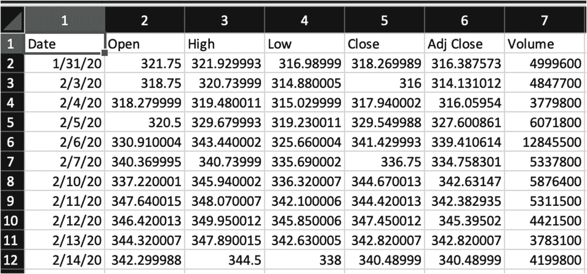
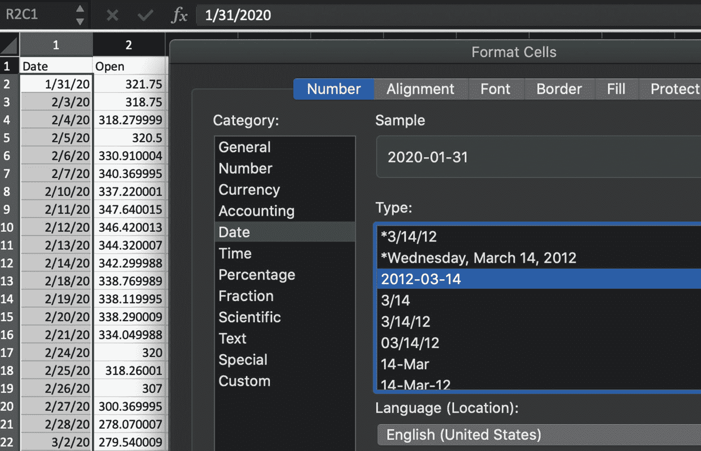
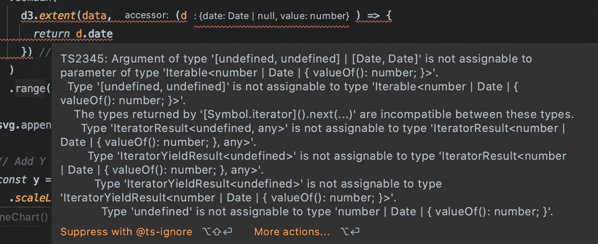
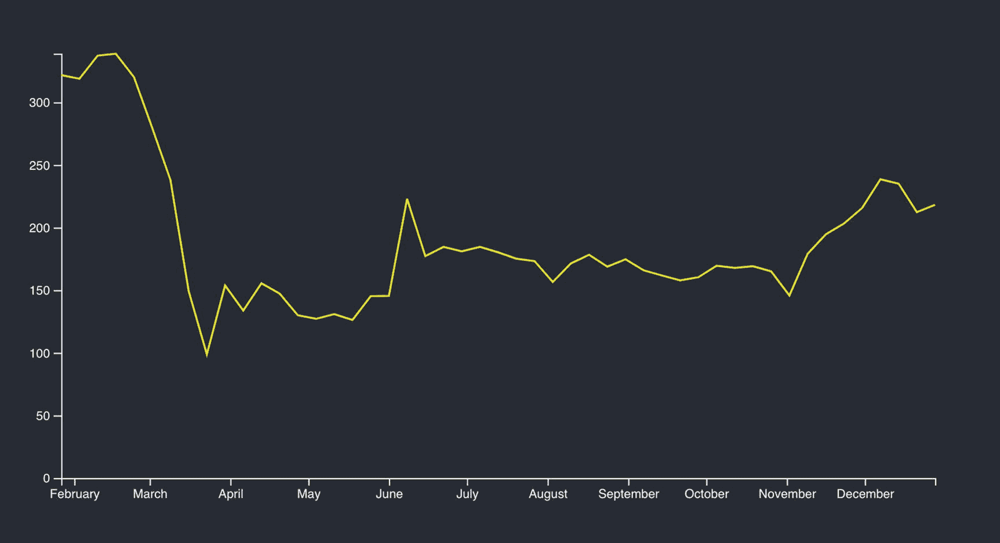
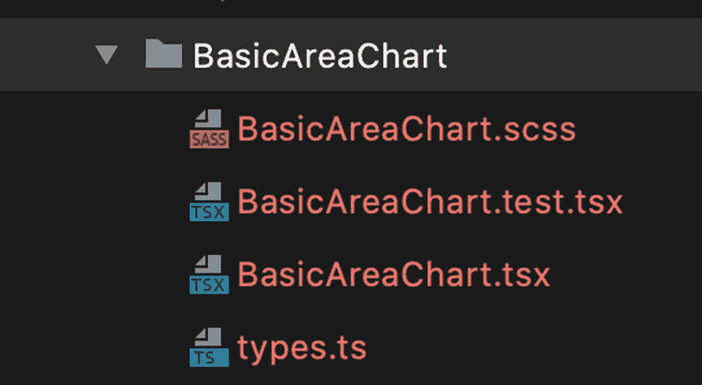
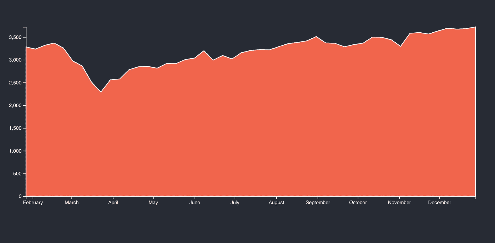
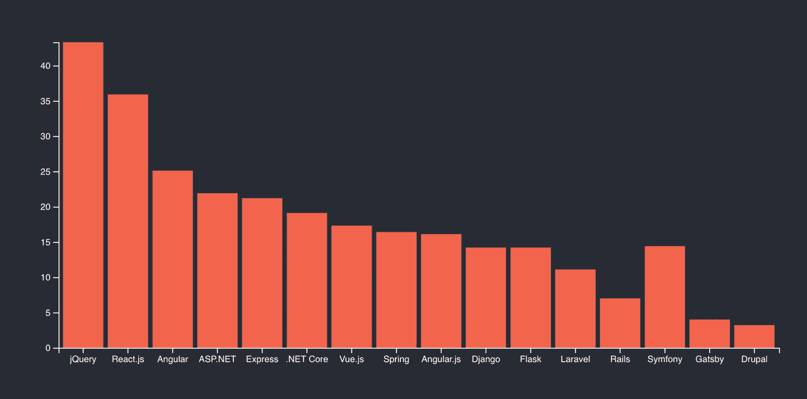
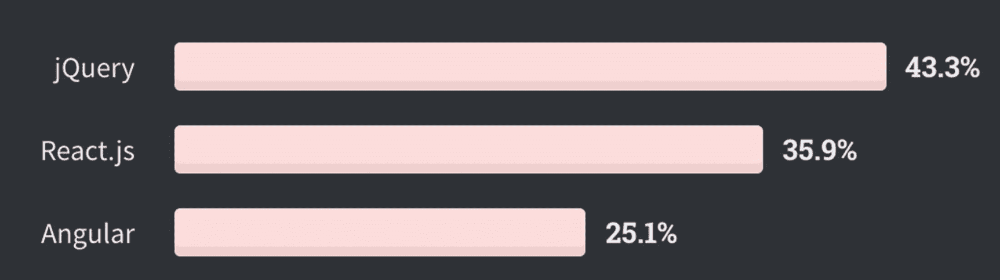
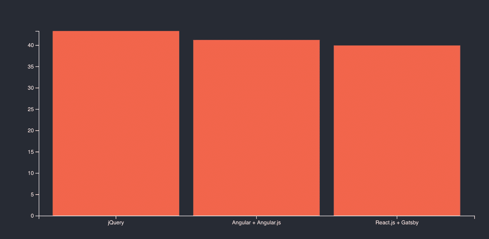
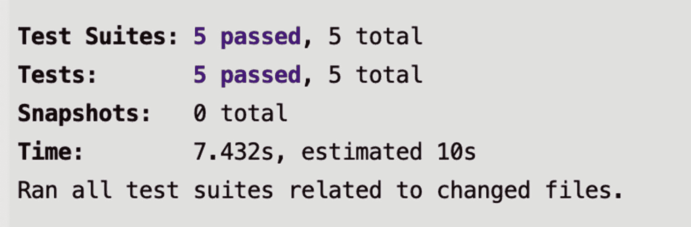

# 三、基本图表：第一部分

在前一章中，我介绍了 D3 和 React 的可能性。我们创建了函数和类组件，甚至创建了一个简单的条形图。在这一章中，我将介绍如何使用 TypeScript 作为类型检查器，用 React 和 D3 创建简单的图表。我将向您展示如何创建下面的简单图表，重点是让 D3 完成大部分工作。我将向您展示如何创建以下图表:

*   折线图

*   对比图

*   条形图

我们开始吧。

## 设置

正如前几章一样，我将使用 CRA 和 MHL 模板来创建我们的起始项目。

```jsx
$ yarn create react-app basic-charts --template must-have-libraries

$ cd basic-charts
$ yarn add d3 @types/d3
$ yarn start

```

打开起始页。

```jsx
$ open http://localhost:3000

```

您可以从这里下载本章的完整代码:

[https:// github。com/ Apress/ integrating-d3。js-with-react/tree/main/ch03](https://github.com/Apress/integrating-d3.js-with-react/tree/main/ch03)

## 折线图

我要展示的第一个图表是折线图。折线图以图形方式显示定量数据，被认为是最基本的图表类型之一。折线图由三个绘图元素组成:x 轴、y 轴和一条线。

幸运的是，D3 有一些方法可以帮助你完成创建折线图的整个过程。

### line.csv

一个好的起点是数据。对于折线图，我将使用的数据直接来自雅虎融资。我将提取波音股票的历史数据，股票代码为 BA: [`https://finance.yahoo.com/quote/BA/history`](https://finance.yahoo.com/quote/BA/history) 。一旦进入该页面，您将看到一个下载数据的选项。

在下载的 CSV 文件中(见图 [3-1](#Fig1) ，我保留了`Date`列和`Open`价格，删除了其他列。



图 3-1

BA 历史股票价格的 CSV 文件，在 Microsoft Excel 中打开

接下来，我将把日期重新格式化为`%Y-%m-%d`的格式，以便于阅读(见图 [3-2](#Fig2) )。



图 3-2

包含 BA 历史股票价格的 CSV 文件的格式化日期

我获取 BA 的价格历史，然后将 CSV 转换为两个字段:`data`和`value`。

最后，我将把`Date`和`Open`列重命名为`date`和`value`。

我将文件保存在`public/data`文件夹中:`public/data/line.csv`。

```jsx
date,value
2020-01-27,321.75
2020-02-03,318.75
2020-02-10,337.220001
2020-02-17,338.769989
2020-02-24,320
..
..
..

```

除了数据文件，我还将创建几个文件。

*   `BasicLineChart.scss` : SCSS 风格文件

*   `BasicLineChart.test.tsx`:Jest/酵素测试文件

*   `BasicLineChart.tsx`:组件

*   `types.ts`ts 类型

和往常一样，你可以自己创建这些文件，或者从`generate-react-cli`那里获得一点帮助。

```jsx
$ npx generate-react-cli component BasicLineChart --type=d3

```

### types.ts

创建类型文件是保持 TypeScript 类型有组织的常见做法。在我的图表中，我只需要我创建的日期和值，但这是一个很好的习惯，特别是对于复杂的图表，因为需要的类型数量不断增加。在我的例子中，我只需要一种保存日期和值的数据类型。

```jsx
//  src/component/BasicLineChart/types.ts

export namespace Types {
  export type Data = {
    date: string
    value: number
  }
}

```

### BasicLineChart.tsx

功能组件`BasicLineChart`做的很重，会画出轴和线图。

我将导入 React，SCSS，D3 和类型文件。结构和我们在上一章中的一样。

我已经将函数组件分解为一个被调用的`draw()`函数和一个 JSX 占位符。正如我们在上一章所做的一样，`draw()`函数被`useEffect`钩子调用。看一看:

```jsx
// src/component/BasicLineChart/BasicLineChart.tsx

import React, { useEffect } from 'react'
import './BasicLineChart.scss'
import * as d3 from 'd3'
import { Types } from './types'

const BasicLineChart = (props: IBasicLineChartProps) => {
  useEffect(() => {
    draw()
  })

  const draw = () => {

```

首先，我将设置图表的尺寸和边距。我将通过`props`从父组件传递这些。

```jsx
    const width = props.width - props.left - props.right
    const height = props.height - props.top - props.bottom

```

接下来，我将把一个 SVG 对象添加到我在 JSX 渲染部分设置的包装器`div`中，并分配属性。我还将添加一个组元素，就像我们在上一章所做的那样。

```jsx
    const svg = d3
      .select('.basicLineChart')
      .append('svg')
      .attr('width', width + props.left + props.right)
      .attr('height', height + props.top + props.bottom)
      .append('g')
      .attr('transform', `translate(${props.left},${props.top})`)

```

我不仅可以使用 D3 绘制轴和线，还可以检索 CSV 数据。看一下`dsv` API ( [`https://github.com/d3/d3-dsv`](https://github.com/d3/d3-dsv) )。一旦检索到数据，我就将对象转换为我的`Types.Data`，然后使用`d3.timeParse`将字符串转换为 D3 `Date`对象。`dsv` API 将逐个遍历列表，我将返回一个由解析为`d3`和`value`的`Date`组成的对象。

```jsx
    d3.dsv(',', '/Data/line.csv', (d) => {
      const res = (d as unknown) as Types.Data
      const date = d3.timeParse('%Y-%m-%d')(res.date)
      return {
        date,
        value: res.value,
      }

```

一旦`dsv`方法完成，我就用 D3 `Date`格式的日期和值格式化对象。下一步是添加 x 轴，这将是域的日期。这将刻度的域设置为指定数组的域值，在我们的例子中是日期。

```jsx
    }).then((data) => {
      const x = d3
        .scaleTime()
        .domain(
          d3.extent(data, (d) => {
            return d.date
          }) as [Date, Date]
        )
        .range([0, width])

```

Notice

我正在使用`d3.extent`，并将我的域转换为`[Date, Date]`。`d3.extent`同时返回最小值和最大值。我还改变了从零到图表宽度的范围。

如果不将`d3.extent`转换为`[Date, Date]`，我将得到如图 [3-3](#Fig3) 所示的平均 ESLint 错误消息。从消息中可以看出，它期待一个`[Date, Date]`。



图 3-3

由于不兼容的类型导致的 ESLint 错误消息

```jsx
TS2345: Argument of type '[undefined, undefined] | [Date, Date]' is not assignable to parameter of type 'Iterable<number | Date | { valueOf(): number; }>'.

```

最后，我将添加一个组，使用 translate 将该组设置到左下角的位置，并调用`d3.axisBottom(x)`来附加我的 x 轴。

```jsx
      svg.append('g').attr('transform', `translate(0, ${height})`).call(d3.axisBottom(x))

```

Note

`call`方法是 D3 以选择的形式返回对自身的引用的常用方法。

这里发生的事情是，`svg.append('g')`将一个 SVG 组元素附加到 SVG 中，并以选择的形式返回对自身的引用。

当我们调用一个选择时，我们是在调用选择`g`的元素上的函数`axisBottom`。我们正在新创建和添加的组`g`上运行`axisBottom`功能。

对于 y 轴，过程是相似的，只是我设置了一个值而不是日期。我使用数学( [`https://developer.mozilla.org/en-US/docs/Web/JavaScript/Reference/Global_Objects/Math/max`](https://developer.mozilla.org/en-US/docs/Web/JavaScript/Reference/Global_Objects/Math/max) )来获得可能的最大值。

```jsx
Math.max(...data.map((dt) => ((dt as unknown) as Types.Data).value), 0)

```

这将确保我的图表设置为基于最大值运行；否则，高度将会不对齐并显示第一个值，而其他值可能会溢出。

```jsx
      const y = d3
        .scaleLinear()
        .domain([
          0,
          d3.max(data, (d) => {
            return Math.max(...data.map((dt) => ((dt as unknown) as Types.Data).value), 0)
          }),
        ] as number[])
        .range([height, 0])
      svg.append('g').call(d3.axisLeft(y))

```

对于域，我需要确保对象被强制转换为`number[]`,以避免 ESLint 中又一个不兼容类型的消息。

```jsx
TS2345: Argument of type '(number | undefined)[]' is not assignable to parameter of type 'Iterable<NumberValue>'. The types returned by '[Symbol.iterator]().next(...)' are incompatible between these types.

```

最后，我需要添加我想画的线。为此，我可以添加一个 SVG path 元素，并将数据用于我的数据，这样它将遍历我的数据对象来绘制每一行。我正在使用从`props`开始的填充，笔画宽度为 1.6。

```jsx
      svg
        .append('path')
        .datum(data)
        .attr('fill', 'none')
        .attr('stroke', props.fill)
        .attr('stroke-width', 1.5)
        .attr(
          'd',
          // @ts-ignore
          d3
            .line()
            .x((d) => {
              return x(((d as unknown) as { date: number }).date)
            })
            .y((d) => {
              return y(((d as unknown) as Types.Data).value)
            })
        )
    })
  }

```

在渲染方面，我设置了一个包装器`div`，其`className`值为`basicLineChart`。

```jsx
  return <div className="basicLineChart" />
}

```

对于接口，我将从父组件传递属性，这样我就可以对齐组件并设置填充颜色，这样就可以很容易地重用我的组件。

```jsx
interface IBasicLineChartProps {
  width: number
  height: number
  top: number
  right: number
  bottom: number
  left: number
  fill: string
}

export default BasicLineChart

```

请注意，这些 D3 比例方法真的帮了大忙；他们能够进行计算，并将我们的数据转换成绘制图表所需的值。

如果我需要在基本折线图上添加一个脉动点或任何东西，我能做的就是重用这些 x 轴和 y 轴的值，例如`y(300)`。

这个什么时候派上用场？假设我想在图表的末尾再画一条线。我可以存储 x，y 的最后位置，然后用 y 轴和 x 轴计算我想要的任何价格。

```jsx
svg
 .append('line')
 .style('stroke', 'red')
 .style('stroke-width', 1)
 .attr('x1', lastX)
 .attr('y1', lastY)
 .attr('x2', lastX + x2)
 // y Axis is what turn the value to the value needed
 // on the chart
 .attr('y2', yAxis(300))

```

### basiclinechart . scss

至于我的 SCSS 文件，我可以在这里设置我的绘图元素的属性，但我真的不需要设置任何东西，因为我正在使用`props`传递我的填充颜色和其他属性。也就是说，准备好我的 SCSS 供将来使用是一个好习惯。

```jsx
.basicLineChart {
}

```

### basiclenechart . test . tsx

为了测试，我使用 Jest 和 Enzyme 来确保组件挂载并使用我设置的`props`。

如果你是第一次尝试用笑话和酶 React，看看我在 [`https://medium.com/react-courses/unit-testing-react-typescript-app-with-jest-jest-dom-enzyme-11f52487aa18`](https://medium.com/react-courses/unit-testing-react-typescript-app-with-jest-jest-dom-enzyme-11f52487aa18) 的文章。更多详情，请阅读我的《React 进度书: [`https://www.apress.com/gp/book/9781484266953`](https://www.apress.com/gp/book/9781484266953) 。

```jsx
// src/component/BasicLineChart/BasicLineChart.test.tsx

import React from 'react'
import { shallow } from 'enzyme'
import BasicLineChart from './BasicLineChart'

describe('<BasicLineChart />', () => {
  let component

  beforeEach(() => {
    component = shallow(<BasicLineChart top={10} right={50} bottom={50} left={50} width={460} height={400} fill="tomato" />)
  })

  test('It should mount', () => {
    expect(component.length).toBe(1)
  })
})

```

### App.tsx

最后，我可以用我设置的`props`添加简单的`BasicLineChart`。

```jsx
// src/App.tsx

import React from 'react'
import './App.scss'

import BasicBarChart from './components/BasicBarChart/BasicBarChart'

function App() {
  return (
    <div className="App">
      <header className="App-header">
        <BasicBarChart top={10} right={50} bottom={50} left={50} width={900} height={400} fill="tomato" />
      </header>
    </div>
  )
}

export default App

```

最终结果见图 [3-4](#Fig4) 。



图 3-4

英航股价折线图

现在我已经准备好了我的图表，我将运行我在`package.json`运行脚本中设置的格式、lint 和测试任务，以确保质量。

```jsx
$ yarn format
$ yarn lint
$ yarn test

```

如果你打开`package.json`并查看`scripts`标签下，你可以看到这些任务被设置在那里。

```jsx
"scripts": {
  "format": "prettier --write 'src/**/*.{ts,tsx,scss,css,json}'",
  "lint": "eslint --ext .js,.jsx,.ts,.tsx ./",
  "test": "react-scripts test",
  ..
  ..
}

```

我不会详细讨论格式、lint 和测试是如何设置的，但是正如我之前指出的，你可以在我的 React 和 Libraries 的书中了解更多，可以在 [`https://www.apress.com/gp/book/9781484266953`](https://www.apress.com/gp/book/9781484266953) 找到。

如果你不设置测试套件，这很好，不会影响任何功能；然而，用完整的测试覆盖来编写你的组件只是一个好的实践。

## 对比图

面积图以图形方式显示定量数据，类似于折线图。

不同的是轴和线之间的区域用颜色强调。

在编码方面，类似于我们刚刚在上例中做的折线图；唯一的区别是这个区域是有颜色的

### area.csv

至于数据，我将使用标准普尔 500 股票行情自动收报机，并将数据格式化，就像我在折线图中所做的那样( [`https://finance.yahoo.com/quote/%5EGSPC/history`](https://finance.yahoo.com/quote/%255EGSPC/history) )。

我将在`public/data/area.csv`保存结果。

```jsx
date,value
2020-01-27,3282.330078
2020-02-03,3235.659912
2020-02-10,3318.280029
..
..

```

### BasicAreaChart.tsx

我的主成分`BasicAreaChart.tsx`，和`BasicLineChart.tsx`差不多。看一看:

```jsx
// src/component/BasicAreaChart/BasicAreaChart.tsx

import React, { useEffect } from 'react'
import './BasicAreaChart.scss'
import * as d3 from 'd3'
import { Types } from './types'

const BasicAreaChart = (props: IBasicAreaChartProps) => {
  useEffect(() => {
    draw()
  })

  const draw = () => {

```

我设置尺寸和边距。

```jsx
    const width = props.width - props.left - props.right
    const height = props.height - props.top - props.bottom

```

接下来，我将`svg`对象添加到我将在渲染端设置的`basicAreaChart` JSX `div`中。

```jsx
    const svg = d3
      .select('.basicAreaChart')
      .append('svg')
      .attr('width', width + props.left + props.right)
      .attr('height', height + props.top + props.bottom)
      .append('g')
      .attr('transform', `translate(${props.left},${props.top})`)

    d3.dsv(',', '/Data/area.csv', (d) => {
      const res = (d as unknown) as Types.data
      const date = d3.timeParse('%Y-%m-%d')(res.date)
      return {
        date,
        value: res.value,
      }
    }).then(function results(data) {

```

现在我可以将日期格式设置为 x 轴。

```jsx
      const x = d3
        .scaleTime()
        .domain(
          d3.extent(data, (d) => {
            return d.date
          }) as [Date, Date]
        )
        .range([0, width])

      svg.append('g').attr('transform', `translate(0, ${height})`).call(d3.axisBottom(x))

```

我也可以将 y 轴设置为值。

```jsx
      const y = d3
        .scaleLinear()
        // @ts-ignore
        .domain([
          0,
          d3.max(data, (d) => {
            return +d.value
          }),
        ] as number[])
        .range([height, 0])
      svg.append('g').call(d3.axisLeft(y))

```

对于图表的线条，我将使用路径，就像在`BasicLineChart.tsx`中一样。

```jsx
      svg
        .append('path')
        .datum(data)
        .attr('fill', props.fill)
        .attr('stroke', 'white')
        .attr('stroke-width', 1.5)

```

面积图最大的不同是，我现在使用的是 D3 面积和曲线 API。

```jsx
d3
.area()
.curve(d3.curveLinear)

```

这段代码是对路径线的补充，因为我需要用颜色填充这个区域。

我们通过设置`x`、`y0`和`y1`值来实现。

```jsx
* @param x Sets the x accessor - in our case a date
* @param y0 Sets the y0 accessor - in our case it's zero since we start from the bottom.
* @param y1 Sets the y1 accessor - in our case it's the value of the stock.

```

看一看:

```jsx
        .attr(
          'd',
          // @ts-ignore
          d3
            .area()
            .curve(d3.curveLinear)
            .x((d) => {
              return x(((d as unknown) as { date: number }).date)
            })
            .y0(y(0))
            .y1((d) => {
              return y(((d as unknown) as Types.data).value)
            })
        )
    })
  }

```

在渲染方面，我添加了`div`包装器。

```jsx
  return <div className="basicAreaChart" />
}

```

界面与折线图相同。

```jsx
interface IBasicAreaChartProps {
  width: number
  height: number
  top: number
  right: number
  bottom: number
  left: number
  fill: string
}

export default BasicAreaChart

```

接下来，设置`types.ts`、`scss`和`BasicAreaChart.test.tsx`文件。它们的代码与 line 示例中的代码相同，所以我不会在这里向您展示它们。确保它们被设置在`BasicAreaChart`文件夹中(参见图 [3-5](#Fig5) )。



图 3-5

基础图表文件结构

### App.tsx

最后，我们需要设置`App.tsx`来包含我们的`BasicAreaChart`，并通过`props`。

```jsx
// src/App.tsx

import React from 'react'
import './App.scss'

import BasicAreaChart from './components/BasicAreaChart/BasicAreaChart'

function App() {
  return (
    <div className="App">
      <header className="App-header">
        <BasicAreaChart top={10} right={50} bottom={50} left={50} width={1000} height={400} fill="tomato" />
      </header>
    </div>
  )
}

export default App

```

然后*瞧啊*！见图 [3-6](#Fig6) 。



图 3-6

基本图表完成

如你所见，折线图和面积图是相似的。一旦我们理解了检索和格式化数据、创建 x 轴和 y 轴以及绘制图表的过程，每次绘制图表都会变得更加容易。

## 条形图

我将在本章中创建的最后一个图表是另一种常用的图表类型，条形图。

条形图用于显示和比较数字、频率或其他指标。条形图之所以受欢迎，是因为它的创建非常简单，并且易于解释。

我已经在第 [2](02.html) 章向你展示了如何创建一个简单的条形图；然而，条形图没有 x，y 轴，并且数据不是从外部文件加载的。

在这个例子中，对于数据，我将使用 Stack Overflow 调查数据来显示 React 和其他框架的受欢迎程度: [`https://insights.stackoverflow.com/survey/2020`](https://insights.stackoverflow.com/survey/2020) 。这个图表帮助你选择一个网络框架。

### 酒吧. csv

对于这些数据，我用从栈溢出调查中复制的值创建了一个名为`public/data/bar.csv`的 CSV 文件。看一看:

```jsx
framework,value
jQuery,43.3
React.js,35.9
Angular,25.1
ASP.NET,21.9
Express,21.2
.NET Core,19.1
..
..

```

### BasicBarChart.tsx

在结构方面，我将保持类似于我之前创建的折线图和面积图的结构。

```jsx
// src/component/BasicBarChart/BasicBarChart.tsx

import React, { useEffect } from 'react'
import './BasicBarChart.scss'
import * as d3 from 'd3'
import { Types } from './types'

const BasicBarChart = (props: IBasicBarChartProps) => {
  useEffect(() => {
    draw()
  })

  const draw = () => {

```

像以前一样，我们设置尺寸和边距。

```jsx
    const width = props.width - props.left - props.right
    const height = props.height - props.top - props.bottom

```

为了绘制 x，y 范围，我将从 D3 获得一些帮助，并基于从父组件通过`props`传递的属性来设置它们。

```jsx
    const x = d3.scaleBand().range([0, width]).padding(0.1)
    const y = d3.scaleLinear().range([height, 0])

```

接下来，我将把 SVG 对象追加到我的名为`basicBarChart`的`div`包装器中，我将在渲染时添加该包装器，我将添加一个组并设置我的 SVG 宽度和高度属性。

```jsx
    const svg = d3
      .select('.basicBarChart')
      .append('svg')
      .attr('width', width + props.left + props.right)
      .attr('height', height + props.top + props.bottom)
      .append('g')
      .attr('transform', `translate(${props.left},${props.top})`)

    d3.dsv(',', '/Data/bar.csv', (d) => {
      return (d as unknown) as Types.Data

```

一旦数据对象准备好了，我就可以在域中缩放`Data`的范围。

```jsx
    }).then((data) => {
      x.domain(
        data.map((d) => {
          return d.framework
        })
      )
      y.domain([
        0,
        d3.max(data, (d) => {

```

我将使用我在内嵌图表中使用的相同数学函数来设置 y 的`max`值，并将我的域转换为`number[]`以避免 ESLint 对我咆哮。

```jsx
          return Math.max(...data.map((dt) => (dt as Types.Data).value), 0)
        }),
      ] as number[])

```

为了绘制实际的条形图，我将使用`selectAll`和`data`属性，这样 D3 将遍历我的数据并为条形图添加矩形。

```jsx
      svg
        .selectAll('.bar')
        .data(data)
        .enter()
        .append('rect')
        .attr('fill', props.fill)
        .attr('class', 'bar')
        .attr('x', (d) => {
          return x(d.framework) || 0
        })

```

注意，在返回时，我使用了“或零”:`|| 0`。原因是我们不确定是否有值，数据可以是未定义的(`number` | `undefined`)。这就是 TS 需要那个“或零”的原因——这是为了避免得到 ESLint 过载错误消息。

```jsx
TS2769: No overload matches this call. Overload 1 of 4, '(name: string, value: null): Selection<SVGRectElement, Data, SVGGElement, unknown>', gave the following error. Argument of type '(this: SVGRectElement, d: Data) => number | undefined' is not assignable to parameter of type 'null'.

```

对于宽度，我使用的是`x.` `bandwidth`，它返回构成条形图的每个 bin(矩形)的宽度。对于高度→这将是图表边界的高度减去创建容器高度值的值。

```jsx
        .attr('width', x.bandwidth())
        .attr('y', (d) => {
          return y(d.value)
        })
        .attr('height', (d) => {
          return height - y(d.value)
        })

```

接下来，我将添加 x 轴和 y 轴。

```jsx
      svg.append('g').attr('transform', `translate(0,${height})`).call(d3.axisBottom(x))

      svg.append('g').call(d3.axisLeft(y))
    })
  }

```

现在我呈现我的名为`basicBarChart`的`div`包装器。

```jsx
  return <div className="basicBarChart" />
}

```

最后，我设置了我的接口。

```jsx
interface IBasicBarChartProps {
  width: number
  height: number
  top: number
  right: number
  bottom: number
  left: number
  fill: string
}

export default BasicBarChart

```

正如我们在其他例子中所做的那样，设置`types.ts`、`scss`和`BasicAreaChart.test.tsx`。

### types.ts

对于类型，我设置了两个变量:`framework`和`value`(类型为`string`和`number`)。

```jsx
// src/component/BasicBarChart/types.ts

export namespace Types {
  export type Data = {
    framework: string
    value: number
  }
}

```

### basicbarchart . scss

对于 SCSS，我可以在那里设置每个条的填充，但是由于我是在`props`中设置的，这将是一个重叠。我只是想告诉你，如果你需要的话，为我们在 SCSS 创建的 D3 元素设置属性不仅仅是可以接受的，而且很容易阅读和修改，尤其是当你在一个有设计师的团队中工作的时候。

```jsx
.basicBarChart {
}

.bar {
  fill: tomato;
}

```

### App.tsx

至于`App.tsx`，你已经知道该怎么做了，所以继续添加组件吧。

```jsx
// src/App.tsx

import React from 'react'
import './App.scss'

import BasicBarChart from './components/BasicBarChart/BasicBarChart'

function App() {
  return (
    <div className="App">
      <header className="App-header">
        <BasicBarChart top={10} right={50} bottom={50} left={50} width={900} height={400} fill="tomato" />
      </header>
    </div>
  )
}

export default App

```

*又来了*！见图 [3-7](#Fig7) 。



图 3-7

条形图最终结果

看图表，你可以看到图表讲述了一个故事。乍一看，2020 栈溢出结果似乎表明 React 绕过了 Angular 近 11%。

从图表中可以看出(图 [3-8](#Fig8) )，jQuery 显示为王者，但 React.js 正在蓄势待发，准备接管。



图 3-8

[T2`https://insights.stackoverflow.com/survey/2020#community`](https://insights.stackoverflow.com/survey/2020%2523community)

然而，事实并非如此。

该调查分别包括 React.js 和 Gatsby，尽管它们都基于 React，Angular 和 Angular.js 之间也有分裂。

实际上，如果我们把这些结果加在一起，Angular 的 41.2%、React 的 39.9%和 jQuery 的 43.3%几乎是完全相等的。

真实的结果是 React、Angular 和 jQuery 之间更加平均。如果我要相应地调整我的数据文件，我会得到这样的结果:

```jsx
framework,value
jQuery,43.3
Angular + Angular.js,41.2
React.js + Gatsby,39.9

```

一旦我输入新的数据，我将得到一个完全不同的故事；参见图 [3-9](#Fig9) 。



图 3-9

react vs Angular vs jQuery 2020

如果你有兴趣比较 React 和 Angular，可以看看我在 [`https://medium.com/react-courses/angular-9-vs-react-16-a-2020-showdown-2b0b8aa6c8e9`](https://medium.com/react-courses/angular-9-vs-react-16-a-2020-showdown-2b0b8aa6c8e9) 发表的关于媒体的文章。

在写这本书的时候，2021 栈溢出的结果还没有发表，但是看看这些值如何随着时间的推移而变化会很有趣。现在你已经有了这张图表，你可以插入新的数据了。

现在我已经准备好了所有三个图表，我将最后一次运行 format、lint 和 test 任务，以确保质量。

```jsx
$ yarn format
$ yarn lint
$ yarn test

```

继续将您的结果与我的进行比较(参见图 [3-10](#Fig10) )。



图 3-10

所有图表的测试套件结果通过

```jsx
✨  Done in 1.48s.$ eslint --ext .js,.jsx,.ts,.tsx ./
✨  Done in 9.88s.Test Suites: 5 passed, 5 total
Tests: 5 passed, 5 total
Snapshots: 0 total

```

## 摘要

在这一章中，我向你展示了如何用 React、ts 和 D3 创建流行的和基本的图表。我们创建了以下三种类型的图表:

*   折线图

*   对比图

*   条形图

我向您展示了如何最大限度地利用 D3，不仅用于绘图，甚至用于检索数据，我还向您展示了如何避免常见的 ESLint 错误消息，因为 TS 要求拥有类型。我也给了你一些技巧，关于如何组织你的作品，用格式、lint 和测试运行脚本进行质量检查。

查看我的 d3 和 React 交互课程，看看你可以用不同的方法实现本章中的所有例子。互动课程涵盖了本节的更多主题，例如，对 DOM、色彩空间、交互性、设计的更多控制，以及对本章内容的扩展。该课程灵活地补充了本章和本书；[T2`https://elielrom.com/BuildSiteCourse`](https://elielrom.com/BuildSiteCourse)

下一章将继续创建基本图表，我们将创建另外三个基本图表。

*   圆形分格统计图表

*   散点图

*   直方图