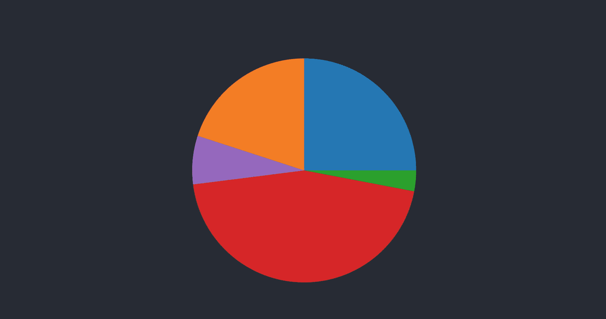
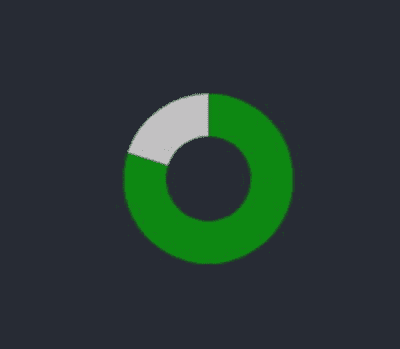
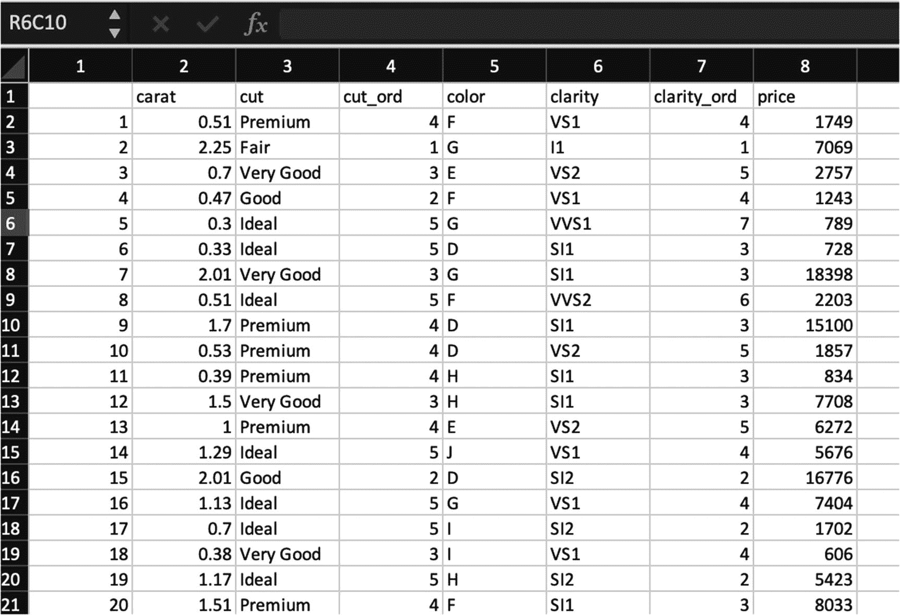
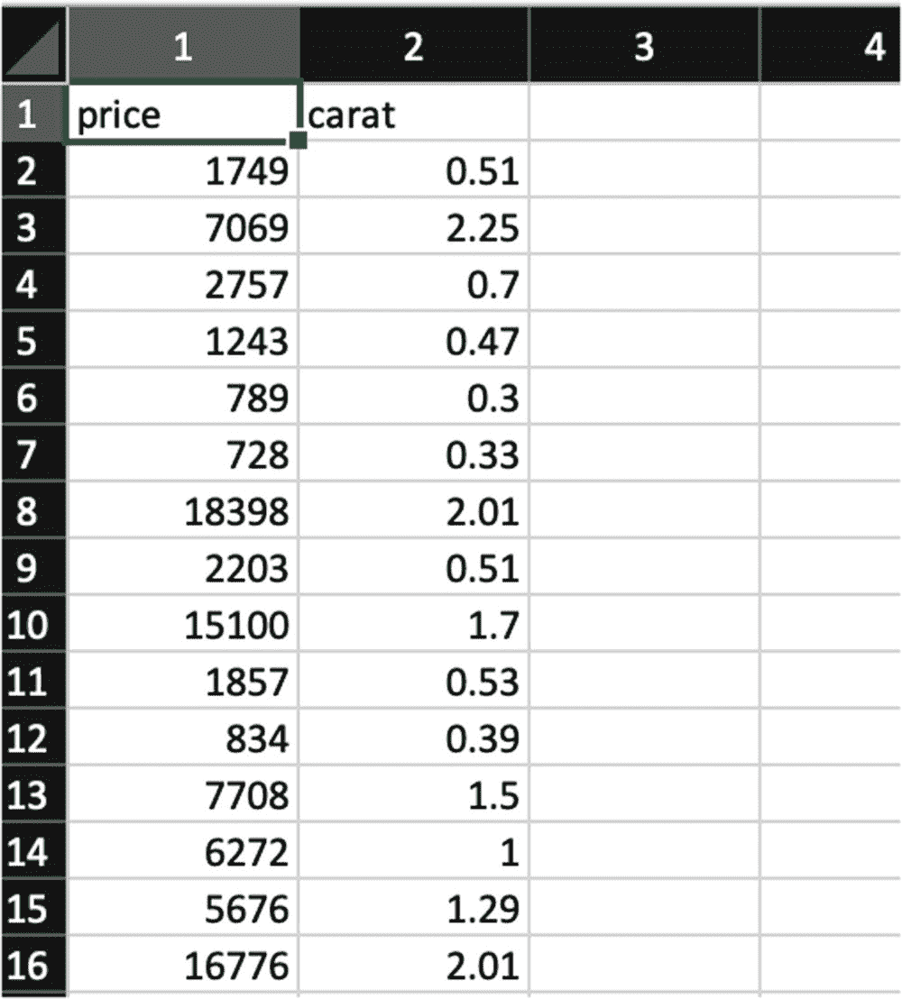
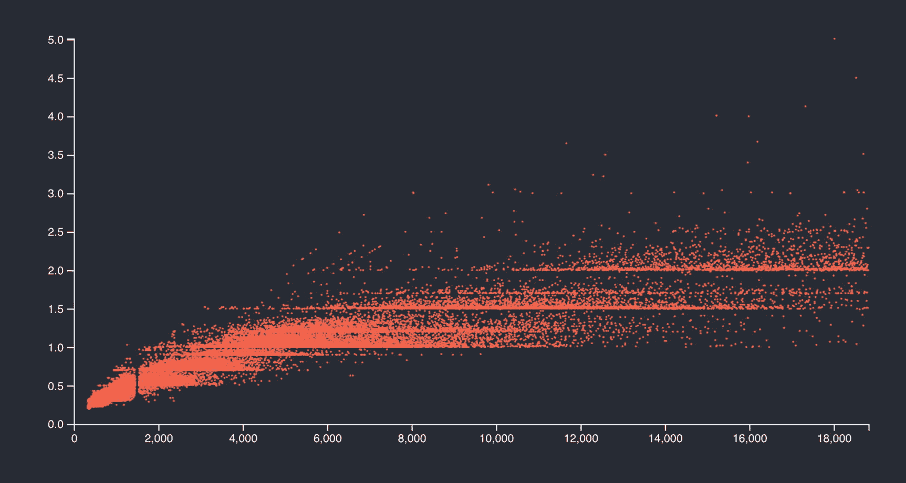
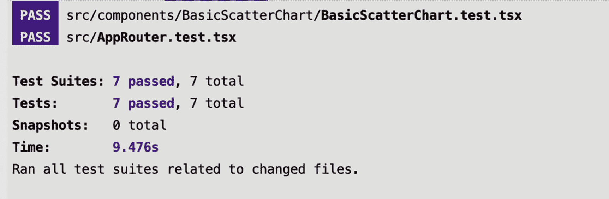
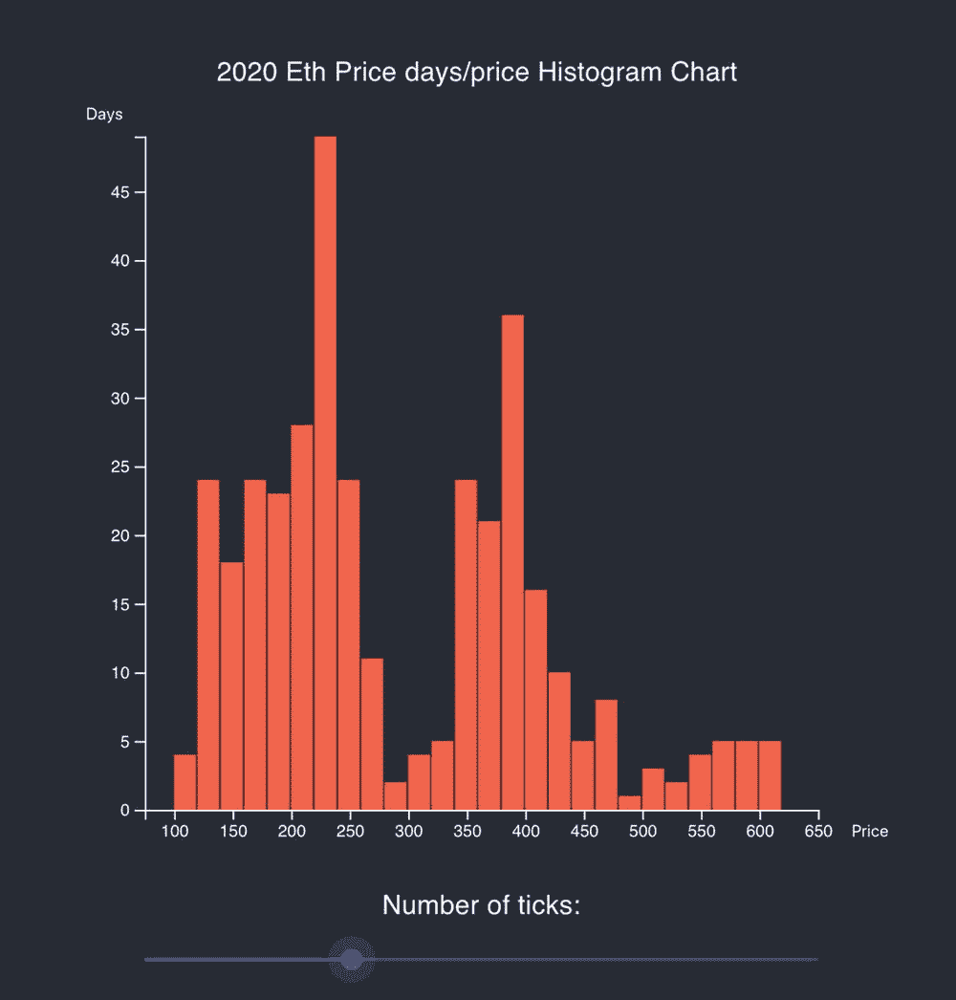

# 四、基本图表：第二部分

正如您已经看到的，D3 是创建图表的标准，所以如果您对创建和定制图表很认真，您就无法逃避对 D3 的学习。React 与其他库(如 D3)集成；但是，将 TypeScript 添加到组合中确实需要特别注意。

在前面的章节中，我向您展示了如何使用 React、ts 和 D3 创建流行和基本类型的图表。此外，如果你上过我的 React + d3 交互课程( [`https://elielrom.com/BuildSiteCourse`](https://elielrom.com/BuildSiteCourse) )，你会看到你可以用不同的方法实现上一章中的所有例子，比如应用记忆回调、处理大小调整、更多的交互以及处理 DOM。与只使用 JS 相比，React + d3 + TS 的组合需要一些特别的注意，本章和上一章的基本图表反映了我发现最有效的东西。

在这一章中，我将介绍如何使用 TypeScript 作为类型检查器，用 React 和 D3 创建更简单的图表。

我将向您展示如何创建以下简单的图表，重点是让 D3 完成大部分工作:

*   圆形分格统计图表

*   散点图

*   直方图

我们开始吧。

## 圆形分格统计图表

饼图是最基本和最流行的图表类型之一。图表类型是圆形的统计图形。饼图通过使用切片表示整体的比例来表示数字。

### 英尺. csv

我的图表的数据指标只是总计 100%的随机数。

```jsx
name,value
a,25
b,3
c,45
d,7
e,20

```

除了数据文件之外，我还将创建几个文件，就像我在上一章所做的那样。

*   `BasicPieChart.tsx`:主要成分

*   `BasicPieChart.test.tsx` : Jest 和酵素测试

*   SCSS 前置处理器

*   保存我将要使用的类型的文件

和第一部分一样，您可以自己创建这些文件，或者从`generate-react-cli`那里获得一些帮助。

```jsx
$ npx generate-react-cli component BasicPieChart --type=d3

```

### types.ts

我的类型由与数据文件相同的列组成，如`name`和`value`。

```jsx
// src/component/BasicPieChart/types.tsexport namespace Types {
  export type Data = {
    name: string
    value: number
  }
}

```

### BasicPieChart.tsx

对于`BasicPieChart`，流程类似于我们在第一部分搭建的图表，使用`useEffect`绘制方法，加载数据，绘制图表。看一看:

```jsx
// src/component/BasicPieChart/BasicPieChart.tsx

import React, { useEffect } from 'react'
import './BasicPieChart.scss'
import * as d3 from 'd3'

```

D3 是模块化构建的，所以我需要`PieArcDatum` ( [`https://github.com/d3/d3-shape`](https://github.com/d3/d3-shape) )。`PieArcDatum`泛型是指传递给`Pie`生成器的输入数组中元素的数据类型。我将使用`PieArcDatum`来更好地投射我的物体。确保添加模块，如下所示:

```jsx
yarn add d3-shape

```

看一看:

```jsx
import { PieArcDatum } from 'd3-shape'
import { Types } from './types'

const BasicPieChart = (props: IBasicPieChartProps) => {
  useEffect(() => {
    draw()
  })

```

对于`draw()`方法，我将设置饼图的宽度、高度和半径。

```jsx
  const draw = () => {
    const width = props.width - props.left - props.right
    const height = props.height - props.top - props.bottom
    const radius = Math.min(width, height) / 2

```

接下来，我选择我将要渲染的`basicPieChart div`，并添加一个名为`svg`的组，带有一个`transform`属性。

```jsx
    const svg = d3
      .select('.basicPieChart')
      .append('svg')
      .attr('width', width)
      .attr('height', height)
      .append('g')
      .attr('transform', `translate(${width / 2},${height / 2})`)

```

我将上传 CSV `pie.csv`数据文件。

```jsx
    d3.dsv(',', '/Data/pie.csv', (d) => {
      const res = (d as unknown) as Types.Data
      return {
        name: res.name,
        value: res.value,
      }
    }).then((data) => {

```

一旦我的数据对象准备好了，下一步就是设置色标。我将使用`d3.scaleOrdinal()`，对于域名，我可以设置每个名称有自己独特的颜色。

D3 使事情变得简单，因为有一组预定义的分类配色方案，所以我可以使用`d3.schemeCategory10`或任何其他( [`https://github.com/d3/d3-scale-chromatic`](https://github.com/d3/d3-scale-chromatic) )颜色类别。

```jsx
const color = d3
        .scaleOrdinal()
        .domain(
          (d3.extent(data, (d) => {
            return d.name
          }) as unknown) as string
        )
        .range(d3.schemeCategory10)

```

注意，虽然我使用的是`d3.schemeCategory10`，但是我可以创建自己的配色方案，它可以作为`props`传递或者在我的数据文件中定义。

```jsx
.range(['#000000', '#000000', '#000000', '#000000', '#000000'])

```

下一步是遍历我的数据并创建饼图。我可以把我的数据转换成键值对，然后把它传递给一个路径元素，就像这样:

```jsx
const map = d3.map(data, (d) => {
  return { 'key': d.name, value: d.value }
})

```

但是有更好的方法。我可以用我的数据类型设置饼图，用我的数据类型使用泛型`PieArcDatum`，并为半径生成路径。然后我插入我的数据来创建一个饼图数据，我可以用它来遍历结果。

```jsx
      const pie = d3
        .pie<Types.Data>()
        .sort(null)
        .value((record) => record.value)

      const path = d3.arc<PieArcDatum<Types.Data>>().innerRadius(0).outerRadius(radius)

      const pieData = pie(data)

```

现在我需要做的就是为每个饼图数据生成 arch SVGs，并使用我为每个名称创建的颜色。

```jsx
      const arch = svg
        .selectAll('.arc')
        .data(pieData)
        .enter()
        .append('g')
        .attr('class', 'arc')
        .attr('fill', (d) => {
          return color(d.data.name) as string
        })

      arch.append('path').attr('d', path)
    })
  }

```

渲染方面，我需要一个包装`div`。

```jsx
  return <div className="basicPieChart" />
}

```

对于我的`props`接口，我正在放置将从我的父组件传递的对齐元素。

```jsx
interface IBasicPieChartProps {
  width: number
  height: number
  top: number
  right: number
  bottom: number
  left: number
}

export default BasicPieChart

```

### BasicPieChart.test.tsx

对于测试，我使用 Jest 和 Enzyme 来确保组件挂载，并使用我设置的`props`。

```jsx
// src/component/BasicPieChart/BasicPieChart.test.tsx

import React from 'react'
import { shallow } from 'enzyme'
import BasicPieChart from './BasicPieChart'

describe('<BasicPieChart />', () => {
  let component

  beforeEach(() => {
    component = shallow(<BasicPieChart width={900} height={400} top={10} right={50} bottom={50} left={50} />)
  })

  test('It should mount', () => {
    expect(component.length).toBe(1)
  })
})

```

### App.tsx

最后，我的父组件`App.tsx`需要包含我的`BasicPieChart`和对齐`props`。

```jsx
// src/App.tsx

import React from 'react'
import './App.scss'

import BasicPieChart from './components/BasicPieChart/BasicPieChart'

function App() {
  return (
    <div className="App">
      <header className="App-header">
        <BasicPieChart width={400} height={400} top={10} right={10} bottom={10} left={10} />
      </header>
    </div>
  )
}

export default App

```

### basicpiechart . scss

对于 SCSS 文件，我定义了一个占位符。我还不需要任何 SCSS，但是创建一个 SCSS 文件是一个很好的实践。

```jsx
.basicPieChart {
}

```

再看一下本地主机端口 3000: `http://localhost:3000/`。你可以将你的结果与我的进行比较，如图 [4-1](#Fig1) 所示。



图 4-1

React 和 D3 饼图

和往常一样， *y* 你可以从这里下载本章的完整代码:

[T2`https://github.com/Apress/integrating-d3.js-with-react/tree/main/ch03`](https://github.com/Apress/integrating-d3.js-with-react/tree/main/ch03)

要查看这个与 React 更好集成的基本饼图，以及调整大小和切换指标的交互，请查看我的 React + d3 交互课程:`https://elielrom.com/BuildSiteCourse`。

#### BasicDonutChart.tsx

要创建一个小圆环图，过程几乎是相同的。我将使用`PieArcDatum`为内圆和外圆绘制圆弧，以创建一个圆环。变化很简单。当我们创建弧线时，只需更新`'innerRadius'`属性；`innerRadius(10)`。

在下面的例子中，我可以修改代码并使用`props`来传递来自父组件的数据，而不是将它加载到我的组件中。我还将编写代码，以便在需要时可以使用该组件来更改数据。让我们来看看。

首先使用`yarn add d3-shape`导入库。

看一看`BasicDonutChart.tsx`代码:

```jsx
import React, { RefObject, useEffect, useState } from 'react'
import * as d3 from 'd3'
import { PieArcDatum } from 'd3-shape'
import { Types } from './types'

const BasicDonutChart = (props: IBasicDonutChartProps) => {
 const ref: RefObject<HTMLDivElement> = React.createRef()
 const [data, setData] = useState<Types.Data[]>([])

```

在`useEffect`里面，我会检查数据。这是必要的，以确保我只在新数据被更新时才改变饼图。例如，当你有新数据时，这种情况就会发生。

我所做的是将数据存储在一个 React 状态对象上，然后使用`JSON.stringify`将状态数据与`props`数据进行比较，看看是否有变化。如果有变化，我会将新数据存储在状态中。

```jsx
 useEffect(() => {
   if (JSON.stringify(props.data) !== JSON.stringify(data)) {
     setData(props.data)

     const { width } = props
     const { height } = props

     const svg = d3
       .select(ref.current)
       .append('svg')
       .attr('width', width)
       .attr('height', height)
       .append('g')
       .attr('transform', `translate(${width / 2}, ${height / 2.5})`)

     const color = ['#068606', '#C1C0C0']

     const donut = d3
       .pie<Types.Data>()
       .sort(null)
       .value((record) => record.value)

     const path = d3.arc<PieArcDatum<Types.Data>>().innerRadius(10).outerRadius(20)

     const donutData = donut(props.data)

     const arch = svg
       .selectAll('.arc')
       .data(donutData)
       .enter()
       .append('g')
       .attr('class', 'arc')
       .attr('fill', (d, i) => {
         return color[i] as string
       })

     arch.append('path').attr('d', path)
   }
 }, [data, props, props.data, props.height, props.width, ref])

```

我需要指定我在`useEffect`中使用的变量。

```jsx
 return <div className="basicDonutChart" ref={ref} />
}

interface IBasicDonutChartProps {
 data: Types.Data[]
 width: number
 height: number
}

export default BasicDonutChart

```

注意，在我的例子中，我使用了一个引用，而不是 D3 `select`。这样，我就可以将我的 pie 作为列表项呈现器，以防我需要在列表中使用这个组件。

#### App.tsx

要实现这一点，您可以在父组件中设置图表，并在`App.tsx`中传递数据。

```jsx
<BasicDonutChart
 data={[
   { name: 'Yes', value: 80 },
   { name: 'No', value: 20 },
 ]}
 width={50}
 height={50}
/>

```

看一下图 [4-2](#Fig2) 。



图 4-2

基本圆环饼图

至于数据，在前面的例子中，我向您展示了实际的图表组件如何检索数据。

这使得我们的代码易于阅读和松散耦合，这是一个保持图表简单和数据在一个地方的伟大设计；然而，为了让您为下一章处理状态管理做好准备，这里我将数据提取到父组件`App.tsx`。

我们希望从图表组件中提取数据的原因是为了在多个组件之间共享数据。在这种情况下，我们希望一次性加载数据，并与多个组件共享。一个很好的例子是使用相同的数据绘制不同类型的图表。

#### 散点图

散点图(又名*散点图*或*散点图* h)用点表示数值。散点图是观察变量之间关系的好方法。

### 散点. csv

使用散点图的一个有趣方法是观察钻石价格与钻石大小的关系。我在 GitHub ( [`https://github.com/sakshi296/P1-1-Predicting-Diamond-Prices`](https://github.com/sakshi296/P1-1-Predicting-Diamond-Prices) )上找到了发布的数据。一旦我下载了图表，我可以在 Excel 或任何其他程序中打开它来修改它，如图 [4-3](#Fig3) 所示。



图 4-3

每克拉钻石价格 CSV 数据

我将删除所有不需要的列，保留价格和克拉指标(见图 [4-4](#Fig4) )。



图 4-4

清洗后每克拉钻石价格

我们的数据集很小，占用空间很小，但是清理您的数据并设置您的数据集以仅使用您需要的数据是优化您的数据并提高性能的良好做法。在第 [10](10.html) 章中，我将深入探讨优化图表的最佳实践。

我将把我的文件保存为`public/data/scatter.csv`中的`scatter.csv`。

```jsx
price,carat
1749,0.51
7069,2.25
2757,0.7
1243,0.47
789,0.3
728,0.33
...
...

```

### types.ts

对于我的类型脚本数据，我将设置与我的 CSV 列相同的名称:`price`和`carat`度量。

```jsx
// src/component/BasicScatterChart/types.ts

export namespace Types {
  export type Data = {
    price: number
    carat: number
  }
}

```

### BasicScatterChart.tsx

现在我准备开始绘制我的图表。

```jsx
// src/component/BasicScatterChart/BasicScatterChart.tsx

import React, { useEffect } from 'react'
import './BasicScatterChart.scss'
import * as d3 from 'd3'
import { Types } from './types'

const BasicScatterChart = (props: IBasicScatterChartProps) => {
  useEffect(() => {
    draw()
  })  const draw = () => {
    const width = props.width - props.left - props.right
    const height = props.height - props.top - props.bottom

    const svg = d3
      .select('.basicScatterChart')
      .append('svg')
      .attr('width', width + props.left + props.right)
      .attr('height', height + props.top + props.bottom)
      .append('g')
      .attr('transform', `translate(${props.left},${props.top})`)

    d3.dsv(',', '/Data/diamonds.csv', (d) => {
      return {
        price: d.price,
        carat: d.carat,
      }
    }).then((data) => {

```

一旦数据准备就绪，我将创建 x 轴和 y 轴外设。第一步是找出价格和克拉的最高值，然后我可以将其设置为我的 axis max 值。

```jsx
const maxPrice = Math.max(...data.map((dt) => (dt as unknown as Types.Data).price), 0)
const maxCarat = Math.max(...data.map((dt) => (dt as unknown as Types.Data).carat), 0)

```

接下来，我可以使用`d3.scaleLinear`来设置我的 x 轴和 y 轴。

```jsx
      const x = d3.scaleLinear().domain([0, 18000]).range([0, width])
      svg.append('g').attr('transform', `translate(0,${height})`).call(d3.axisBottom(x))

      const y = d3.scaleLinear().domain([0, 4.5]).range([height, 0])
      svg.append('g').call(d3.axisLeft(y))

```

最后一部分是使用一个 circle SVG 元素绘制圆点，这个元素带有一种填充颜色，我将从父组件传递过来。我将我的半径设置为 1px，因为我有这么多的结果，但是你可以用更小的结果来尝试。

```jsx
      svg
        .append('g')
        .selectAll('dot')
        .data(data)
        .enter()
        .append('circle')
        .attr('cx', (d) => {
          return x(((d as unknown) as Types.Data).price)
        })
        .attr('cy', (d) => {
          return y(((d as unknown) as Types.Data).carat)
        })
        .attr('r', 0.8)
        .style('fill', props.fill)
    })
  }

  return <div className="basicScatterChart" />
}

interface IBasicScatterChartProps {
  width: number
  height: number
  top: number
  right: number
  bottom: number
  left: number
  fill: string
}

export default BasicScatterChart

```

### App.tsx

将`BasicScatterChart`组件添加到我的`App.tsx`中。

```jsx
// src/App.tsx

import BasicScatterChart from './components/BasicScatterChart/BasicScatterChart'

<BasicScatterChart width={800} height={400} top={10} right={50} bottom={50} left={50} fill="tomato" />

```

最后，如果您之前没有这样做，请创建`BasicScatterChart.scss`和`BasicScatterChart.test.tsx`。

*   这只是 SCSS 的一个占位符。

*   `BasicScatterChart.test.tsx`:这个跟`BasicPieChart.test.tsx`一样。

现在，我们看到了钻石每克拉的历史价格，如图 [4-5](#Fig5) 所示。



图 4-5

React 和 D3 散点图

这张图表可以让我一目了然地看到价格范围，我可以看到每颗钻石的克拉大小和价格。如果我想改进图表，我可以插入其他字段，如钻石颜色的等级度量，并在图表上给出这些不同的颜色。我可以每年改变图表并过滤数据。

现在我已经准备好了所有三个图表，我将最后一次运行 format、lint 和 test 任务，以确保质量。

```jsx
$ yarn format
$ yarn lint
$ yarn test

```

把你的结果和我的比较一下。

```jsx
✨ Done in 1.97s.
$ yarn lint
yarn run v1.22.10
$ eslint — ext .js,.jsx,.ts,.tsx ./
✨ Done in 10.14s.
Test Suites: 7 passed, 7 total
Tests: 7 passed, 7 total
Snapshots: 0 total
Time: 9.476s

```

参见图 [4-6](#Fig6) 。



图 4-6

基本图表组件的测试结果

在“我的 d3 和 react 交互”课程中，你将学习如何包含交互方式线和设置调整大小，以及设置组件以便 React 更好地控制 DOM，参见 [`https://elielrom.com/BuildSiteCourse`](https://elielrom.com/BuildSiteCourse) 。

设置在鼠标移动事件时移动的交互式平均线可以帮助用户更好地阅读结果，并快速预测每克拉的价格。

## 直方图

到目前为止，我们创建的图表相对简单。

在环形饼图中，我们确实检查了数据是否发生了变化，并且我们在函数组件状态中存储了新的数据集，但是我们没有在图表中实现任何变化。

我的目的只是向您展示如何将 D3 集成到 React 组件中，该组件使用 TypeScript 作为类型检查器，并尽可能多地使用 D3。

本章中我们将创建的最后一个图表是一个基本的直方图，它将包括来自用户、交互和动画的输入。这次我们将使用类组件，因此您可以看到如何使用 React 类组件内置的挂钩将动画和更改联系在一起。

直方图是由价格和时间指标组成的条形图。直方图是显示值落入范围的频率的常用方法。

直方图将数字数据分组到多个条块中。那么容器可以显示为分段的列。

我们将建立一个图表，回顾以太币的价格随时间的变化，这样你就能以一种简单直观的方式看到硬币的销售价格。

### types.ts

对于 TypeScript 类型，我创建了两种类型。第一种类型用于数据(`Data`)，该对象保存硬币的价格。我将使用的第二种类型(`BarsNode`)是处理条形，以及重新绘制这些条形。看一看:

```jsx
//src/component/Histogram/types.ts

export namespace Types {
  export type Data = {
    price: number
  }
  export type BarsNode = {
    x0: number
    x1: number
    length: number
  }
}

```

接下来，对于实际的直方图组件，我将再次创建三个文件。这里没有什么新东西:

*   `Histogram.tsx`:自定义组件

*   `Histogram.scss`:风格

*   `Histogram.test.tsx`有一个测试

### 直方图. tsx

在直方图组件中，我将设置一个滑块。用户输入将决定显示多少条。一旦用户使用滑块输入选择，我就可以重新绘制图表。对于滑块，我将使用 Material-UI slide 组件，所以除了所有常用的导入之外，让我们导入滑块。此外，我将使用 Material-UI 中的排版模块来绘制我的图表。

```jsx
// src/component/Histogram/Histogram.tsx

import React from 'react'
import './Histogram.scss'
import * as d3 from 'd3'
import Slider from '@material-ui/core/Slider'
import { Typography } from '@material-ui/core'
import { Types } from './types'

```

对于类签名，我将使用类纯组件(`React.PureComponent`)而不是`React.Component`，因为我不需要使用`shouldComponentUpdate`事件生命周期。

我的`props`和状态`props`接口将包含调整图表的属性。

```jsx
export default class Histogram extends React.PureComponent<IHistogramProps, IHistogramState> {
  constructor(props: IHistogramProps) {
    super(props)

```

我的状态将由用户想要画多少刻度(条)组成；起始状态是 10。

```jsx
    this.state = {
      numberOfTicks: 10,
    }
  }

```

接下来，一旦用户对滑块进行了更改，我们需要重新绘制图表。为此，我们使用了 Material-UI slider change 事件；然而，由于 React 虚拟 DOM 的工作方式，这并不保证我们的图表会得到更新。最好的方法是除了在初始渲染时调用的`componentDidMount`之外，还使用`componentDidUpdate`。

```jsx
  componentDidMount() {
    this.draw()
  }

  componentDidUpdate(prevProps: IHistogramProps, prevState: IHistogramState) {
    this.draw()
  }

```

现在我们也可以使用`getDerivedStateFromProps`代替`componentDidUpdate`，但是这个方法可能会在一次更新中被调用多次，所以我们需要放置一个验证器来检查状态是否被更新。

在更新发生后立即被调用。初始呈现时不调用此方法。

避免任何副作用是很重要的，所以您应该使用`componentDidUpdate`，它只在组件更新后执行一次。

一旦滑块改变，我们需要用我们想要显示的刻度数的新值来更新我们的状态，这发生在`handleChange`方法中。事件的类型为`React.ChangeEvent`。我还可以传递作为更新结果的新值。

```jsx
  handleChange = (event: React.ChangeEvent<{}>, newValue: number | number[]) => {

```

一旦该事件被调用，我就可以将状态设置为`numberOfTicks`。我将绑定`numberOfTicks`，因此更新将会发生。

```jsx
    const value = newValue as number
    this.setState((prevState: IHistogramState) => {
      return {
        ...prevState,
        numberOfTicks: value,
      }
    })
  }

```

重物的提升是用拉的方法完成的。我可以将这段代码更多地分解成一个助手类，但是这个例子并不太复杂。

我使用`d3.selectAll`将`histogramChart`设置为包装元素。

```jsx
  draw = () => {
    const histogramChart = d3.selectAll('.histogramChart')

```

接下来，我将从图表中清除 x 和 y，因为它们可能会改变。这在第一次绘制时不需要，但在重新绘制时需要。为此，我使用了`remove`。`remove`将删除我的主包装器下的所有组元素。

```jsx
   d3.selectAll('.histogramChart').selectAll('g').remove()

```

一旦移除了这些条，我将为 x 轴和 y 轴创建一个新的 group SVG 元素，并将其添加到`histogramChart` group 元素中。

```jsx
    const xAxisGroupNode = histogramChart.append('g')
    const yAxisGroupNode = histogramChart.append('g')

```

接下来，让我们初始化并缩放 x 轴。我在烘烤的价值，但他们可以动态设置。

```jsx
    const xAxis = d3.scaleLinear().domain([75, 650]).range([0, this.props.width])

```

然后，我可以画出 x 轴。

```jsx
    xAxisGroupNode.attr('transform', `translate(0,${this.props.height})`).call(d3.axisBottom(xAxis))

```

y 轴也是一样:初始化，缩放，然后绘制。

```jsx
    const yAxis = d3.scaleLinear().range([this.props.height, 0])

```

我可以利用`d3.bin` ( [`https://github.com/d3/d3-array`](https://github.com/d3/d3-array) )，将数据点分组到桶中。我们可以为直方图设置数据、域和参数。我的领域数据在 0-750 之间，所以我正在烘烤它。

```jsx
    const histogram = d3
      .bin()
      .value((d) => {
        return ((d as unknown) as Types.Data).price
      })
      .domain([0, 750])
      .thresholds(xAxis.ticks(this.state.numberOfTicks))

```

接下来，将此函数应用于数据以获得箱:

```jsx
    const bins = histogram(this.props.data as Array<never>)

```

一旦我们设置了域并绘制了图表，y 轴将会更新这些值。

```jsx
    const yAxisMaxValues = d3.max(bins, (d) => {
      return d.length
    }) as number
    yAxis.domain([0, yAxisMaxValues])

```

接下来，画 y 轴。

```jsx
    yAxisGroupNode.transition().duration(750).call(d3.axisLeft(yAxis))

```

对于条形节点，我们用 bin 数据连接矩形，处理条形以及我们正在重画的新条形。

```jsx
    const barsNode = histogramChart.selectAll<SVGRectElement, number[]>('rect').data(bins)

    const { height } = this.props

    barsNode
      .enter()
      .append('rect')
      .merge(barsNode) // get existing elements
      .transition() // apply changes
      .duration(750)
      .attr('transform',  (d) => {
        // @ts-ignore
        return `translate(${xAxis(d.x0)},${yAxis(d.length)})`
      })
      .attr('width', (d) => {
        return xAxis((d as Types.BarsNode).x1) - xAxis((d as Types.BarsNode).x0) - 1
      })
      .attr('height', (d) => {
        return height - yAxis(d.length)
      })
      .style('fill', this.props.fill)

```

最后，如果因为变更而出现额外的小节，我们需要删除它们。

```jsx
    barsNode.exit().remove()
  }

```

`jsx`很简单。

然而，这一次我将使用 Material-UI 排版组件添加标题和标签，以包含我们的文本标签和 SVG 来保存`<g>`元素和一个 Material-UI 滑块。

我还利用父组件设置的`props`来整齐地对齐图表。

```jsx
  render() {
    const { width, height, margin } = this.props
    return (
      <div className="histogram">
        <Typography id="discrete-slider" gutterBottom>
          2020 Eth Price days/price Histogram Chart
        </Typography>
        <svg height={height + margin.top + margin.bottom} width={width + margin.left + margin.right}>
          <text x={margin.left - 35} y={margin.top - 10} fontSize={10}>
            Days
          </text>
          <text x={width + margin.left + 20} y={height + margin.top + 16} fontSize={10}>
            Price
          </text>
          <g className="histogramChart" transform={`translate(${margin.left},${margin.top})`} />
        </svg>
        <div className="sliderDiv">
          <Typography id="discrete-slider" gutterBottom>
            Number of ticks:
          </Typography>
          <Slider
            defaultValue={this.state.numberOfTicks}
            getAriaValueText={(value: number) => {
              return `${value} ticks`
            }}
            valueLabelDisplay="auto"
            min={10}
            max={85}
            onChange={this.handleChange}
          />
        </div>
      </div>
    )
  }
}

```

该接口将保存数据和对齐属性。

```jsx
interface IHistogramProps {
  data: Types.Data[]
  margin: {
    top: number
    right: number
    bottom: number
    left: number
  }
  width: number
  height: number
  fill: string
}

```

状态包含要显示的刻度数。

```jsx
interface IHistogramState {
  numberOfTicks: number

}

```

### 直方图. scss

在我的 SCSS 中，我将为`div`设置一些填充，并为滑块和 SVG 文本颜色设置属性。

```jsx
.histogram {
  padding-top: 50px;
}
.sliderDiv {
  width: 400px;
  padding-left: 50px;
  padding-top: 20px;
}
svg text {
  fill: white;
}

```

### App.tsx

最后，我在`App.tsx`中加入了直方图组件。

在您看到的饼图中，数据是从父组件通过`props`传递的。

正如我提到的，我们希望从图表组件中提取数据，以备数据在多个组件之间共享。

在这里的图表中，我使用的是`d3.dsv`。但是，我将数据从`App.tsx`传递到子组件直方图。看一看:

```jsx
import React, { useEffect } from 'react'
import './App.scss'
import * as d3 from 'd3'
import Histogram from './components/Histogram/Histogram'
import { Types } from './components/Histogram/types'

function App() {

```

我正在使用函数状态，所以一旦数据被更新，它将自动反映在直方图组件上。我的数据类型是类型`number[]`，因为我将用价格度量设置一个数组。对于初始值，我可以用`([{ 'price': 0 }])`。

```jsx
  const [data, setData] = React.useState([{ 'price': 0 }] as Types.Data[])
  useEffect(() => {

```

在每次渲染时会被多次调用，所以我想限制只加载一次数据。

为此，我可以检查数据是否只有我设置的初始值。由于我用一个数组和一个结果设置了初始值，所以结果比那个多(`data.length <= 1`)，可以检索数据。

```jsx
    if (data.length <= 1) {
      d3.dsv(',', '/data/historicalPrice.csv', (d) => {
        return {
          price: d.open as unknown as number
        }
      }).then((d) => {

```

我使用 react `set`状态机制来设置数据。

```jsx
        setData(d)
      })
    }
  })
  return (
    <div className="App">
      <header className="App-header">

```

在渲染中，我用`props`设置了直方图组件。

```jsx
        <Histogram data={data} margin={{ top: 20, right: 45, bottom: 20, left: 50 }} width={400} height={400} fill="tomato" />
      </header>
    </div>
  )
}

export default App

```

正如我们之前所做的，使用 format、lint 和 test 功能来确保质量。

```jsx
$ yarn format & yarn lint & yarn test

```

图 [4-7](#Fig7) 显示了最终结果。



图 4-7

显示以太币分组价格的直方图

看一下图表，似乎在 2020 年的大部分时间里，以太坊的价格要么是 225 美元(约 50 天)，要么是 400 美元(约 37 天)。

这就是图表的力量。只要看一眼图表，我就能了解这个故事。

注意，我在本章中使用的图表是基于投资工具的，但我不建议投资本书中的任何股票或硬币。

您可以从这里下载直方图组件的完整代码:

[T2`https://github.com/Apress/integrating-d3.js-with-react/tree/main/ch04-05/histogram-d3-ts`](https://github.com/Apress/integrating-d3.js-with-react/tree/main/ch04-05/histogram-d3-ts)

## 摘要

本章是上一章的延续，在这一章中，我介绍了如何使用 TypeScript 作为类型检查器，用 React 和 D3 创建一些简单的图表。

我向您展示了如何使用 React 函数和类组件创建下面的简单图表，重点是让 D3 完成大部分工作:

*   圆形分格统计图表

*   散点图

此外，我还向您展示了如何通过集成 D3 和 React 以及添加更多 React 库来创建直方图。

我们使用其他 React 库，如 Material-UI，并从父组件中检索数据，这样数据就可以在多个组件之间共享。

在我的 d3 和 React 交互课程中，你可以看到用不同的方法实现本章所有例子的其他方法。互动课程涵盖了本节的更多主题，例如，对 DOM、交互性、设计的更多控制，以及对本章内容的扩展。该课程灵活地补充了本章和本书； [`https://elielrom.com/BuildSiteCourse`](https://elielrom.com/BuildSiteCourse) 。

在下一章中，我们将把 React 状态管理集成到 mix 中，这样我们就可以在整个应用中共享我们的数据，甚至可以与不是来自同一个父组件的多个组件共享。