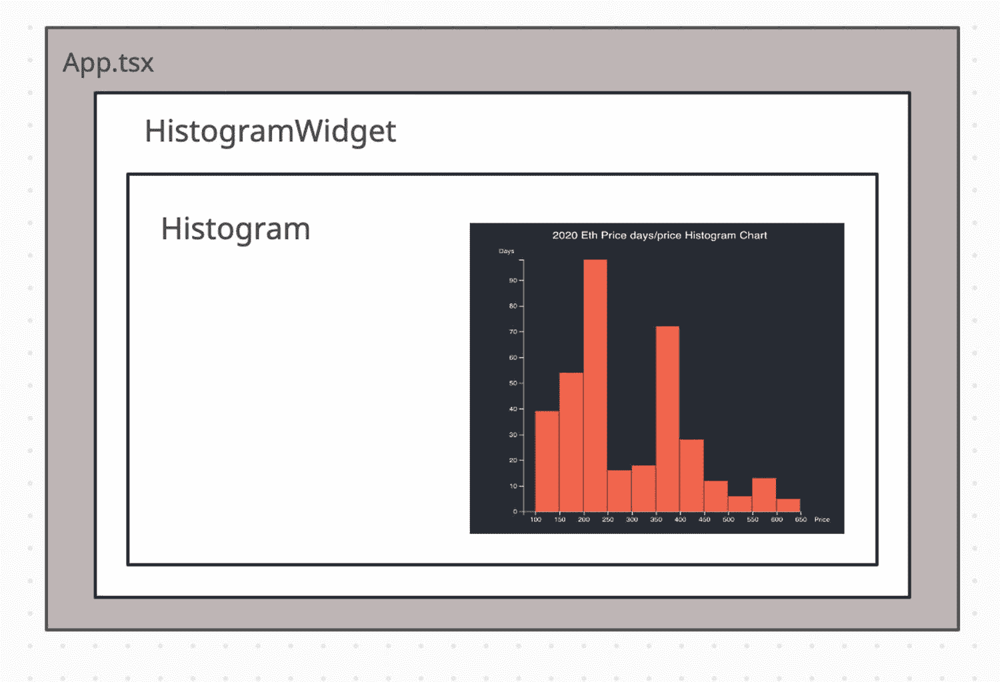
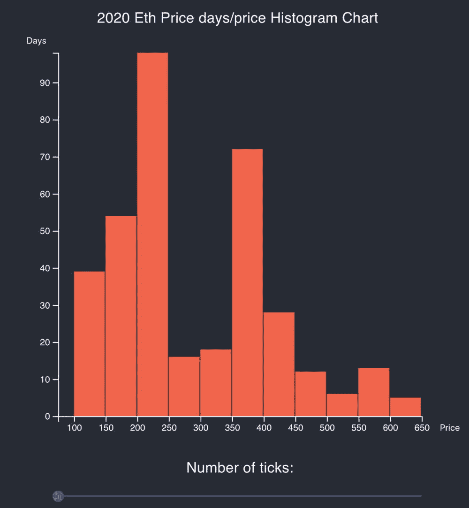
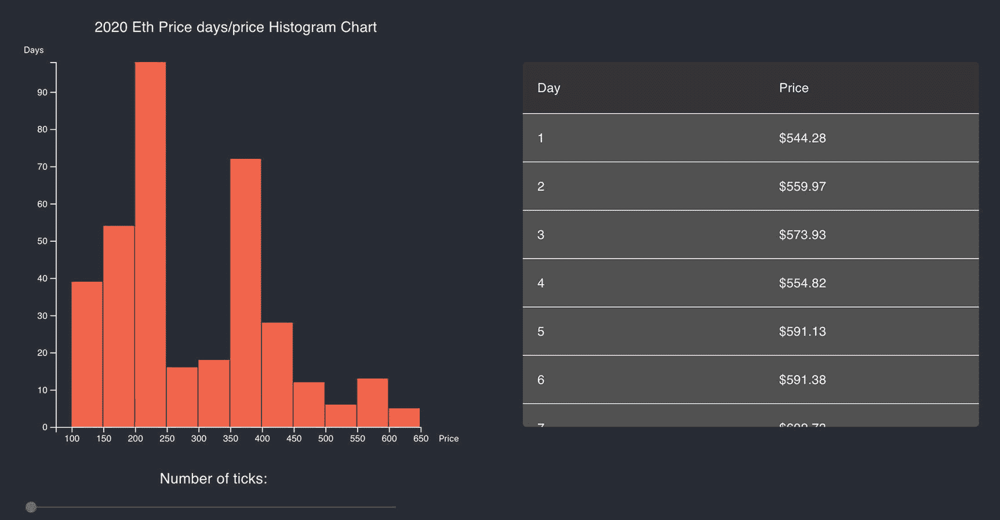

# 五、集成状态管理

在前一章中，我向您展示了如何使用 React 函数和类组件以及 D3 创建简单的图表。在最后一个例子中，我们通过集成 D3 和 React 以及添加其他 React 库(如 Material-UI 和 Jest)创建了一个直方图。

在直方图中，我们从`App.tsx`父组件中检索数据，因此数据可以在多个组件之间共享。

在这一章中，我们将进一步发展这个图表。我们将把 React 状态管理集成到这个组合中，这样我们就可以在我们的应用中共享我们的数据，甚至可以在不是来自同一个父组件的多个组件中共享我们的数据。这将使用状态管理来完成。

在这一章中，您将了解由脸书引入的状态管理体系结构 Flux，然后您将了解来自脸书的新的实验性状态管理体系结构反冲。在这个过程中，我将向您展示如何向图表添加结构，这可以帮助您构建更复杂的图表，我们甚至将集成一个使用相同数据的表列表组件。

## 状态管理

数据本身的一个变化听起来无关紧要，对于您的组件来说，实现和管理足够简单。那么为什么我们需要一个状态管理库来完成这个任务呢？

通俗地说，*状态管理*帮助组织你的 app 的数据和用户交互，直到用户的会话结束。它还有助于确保您的代码不会因为添加了更多功能而变得混乱。

它使测试变得更加容易，并确保代码不依赖于特定的开发技术，并且可以扩展。

Note

状态管理是一种在用户会话结束前维护应用状态的方法。

如果你看看我们在前几章创建的图表，我们没有问题，也不需要设计模式来帮助我们管理数据移动。事实上，实现一个架构来控制我们的数据移动，对于这样简单的功能来说，可能会被视为矫枉过正。我们使用的状态是一旦接收到数据就保存它，并且一切正常。

然而，随着我们的代码增长，我们的应用变得更大，有多个开发人员和设计人员，我们需要某种架构来帮助处理数据移动，并实施最佳实践来帮助管理我们的代码，以便它不会随着每次更改而中断。

事实上，脸书遇到了这些挑战，并寻找解决这些问题的方法。

### 流量

脸书团队首先尝试了一些已经存在的工具。他们首先实现了模型-视图-控制器(MVC)模式；然而，他们发现随着越来越多的特性被添加，架构模式会导致问题，并且由于代码经常出错，一部分代码更难维护。

React 团队在使用 MVC 模式分离关注点和管理前端状态时遇到的挑战最终导致了 Flux 的产生。

重要的是要知道 Flux 状态管理正在被逐步淘汰，项目处于维护模式。还有许多更复杂的选择。

### MVC 解决什么？

在复杂的应用中，MVC 模式是分离关注点的常见实践。

*   *模型*:模型是应用中使用的数据。

*   *视图*:视图是前端的表示层。

*   *控制器*:这是绑定模型和视图的胶水。

脸书团队解释说，当开发人员尝试使用 MVC 时，他们遇到了可能导致循环的数据流问题，这可能会导致应用崩溃，因为它会成为内存泄漏(嵌套更新的级联效应)，并不断更新渲染。

这些挑战被脸书团队解决了，他们推出了一个名为 Flux 的架构，最近又推出了一个名为反冲的实验库。

Note

Flux 是一个用于构建用户界面的应用架构。 [`https://facebook.github.io/flux/`见](https://facebook.github.io/flux/)。

> *“Flux 是脸书用来构建客户端 web 应用的应用架构。它通过利用单向数据流来补充 React 的可组合视图组件。它更多的是一种模式，而不是一个正式的框架。”*
> 
> [`https://facebook.github.io/flux/docs/in-depth-overview`](https://facebook.github.io/flux/docs/in-depth-overview)

从我个人的经验来看，我曾经使用过许多大大小小的基于 MVC 的应用，我不得不有点不同意脸书团队的观点。其中一些项目是构建在 MVC 基础上的非常复杂的企业级应用，通过实施良好的习惯，基于 MVC 的应用可以无缝地工作。也就是说，在许多 MVC 框架的实现中涉及到大量的样板代码，并且经常需要进行代码审查来加强良好的习惯并保持关注点的分离。

脸书的 Flux 架构确实简化了分离关注点的过程，并且是一种新鲜的、受欢迎的状态管理替代方案，同时保持了较少的样板代码和松散耦合的组件。您可以在此了解更多关于 Flux 的信息:

[T2`https://github.com/facebook/flux`](https://github.com/facebook/flux)

[T2`https://facebook.github.io/flux/`](https://facebook.github.io/flux/)

Flux 正在被淘汰，但是还有其他几个状态管理库。

*   *Redux* : [`http://redux.js.org/`](http://redux.js.org/)

*   *MobX*:[`https://mobx.js.org/`T4】](https://mobx.js.org/)

*   *反冲* : [`https://recoiljs.org/`](https://recoiljs.org/)

## 报应

Redux(和 Redux 工具包)是编写本文时最流行的状态管理库。如果你想了解更多关于 Redux 的知识，我推荐你在 [`https://www.apress.com/gp/book/9781484266953`](https://www.apress.com/gp/book/9781484266953) 购买我的 *React 和 Libraries* 书，或者在 [`https://medium.com/react-courses/instance-learn-react-redux-4-redux-toolkit-in-minutes-a-2020-reactjs-16-tutorial-9adaec6f2836`](https://medium.com/react-courses/instance-learn-react-redux-4-redux-toolkit-in-minutes-a-2020-reactjs-16-tutorial-9adaec6f2836) 阅读我的文章。

与 Redux 或 Redux 工具包不同，使用反冲，不需要设置复杂的中间件、连接您的组件或使用任何其他东西来使 React 组件相互之间很好地配合。

Did you know?

反冲库仍处于实验阶段，但它已经获得了一些非凡的人气，甚至超过了 Redux。反冲库在 GitHub 上有接近 10000 颗星，超过了 Redux 工具包的 4100 颗星！

我和许多其他人都认为，反冲将成为 React 中状态管理的标准，这是比继续利用 Redux 工具包 进行中间件开发更好的投资。

但是，请记住，了解 Redux 工具包仍然是很好的，因为您可能会参与到使用 Redux 的项目中。此外，反冲仍然是实验性的，因为这本书的写作，所以它不是为心脏的微弱。

为了了解反冲，我们将重构我们在前一章创建的`Histogram`组件。

反冲是脸书改变生活的状态管理实验，正在席卷 React 开发者社区。后坐力团队说的很好:

> *“后坐力的工作方式和思考方式都像 React。添加一些到您的应用中，获得快速灵活的共享状态。”*

反冲是在有许多状态管理库的时候开发和发布的，所以你可能会问为什么我们还需要另一个状态管理来共享我们的应用状态。使用反冲可以更好、更容易地在多个组件之间共享状态和设置中间件吗？快速回答是肯定的！

如果你需要做的只是全局存储值，你选择的任何库都可以；然而，当您开始做更复杂的事情时，事情就变得复杂了，比如异步调用，或者试图让您的客户端与您的服务器状态同步，或者反向用户交互。

理想情况下，我们希望我们的 React 组件尽可能纯净，并且数据管理需要在没有副作用的情况下通过 React 钩子。我们还希望“真正的”DOM 为了性能而尽可能少地改变。

保持组件松散耦合对于开发人员来说总是一个好地方，因此拥有一个与 React 很好集成的库是对 React 库的一个很好的补充，因为它将 React 与 Angular 等其他顶级 JavaScript 框架放在一起。

拥有固态管理库将有助于 React 应用服务于企业级复杂应用，以及处理前端和中间层的复杂操作。反冲简化了状态管理，我们只需要创建两个成分:原子和选择器( [`https://recoiljs.org/docs/introduction/core-concepts/`](https://recoiljs.org/docs/introduction/core-concepts/) )。

*原子*是物体。它们是组件可以订阅的状态单元。反冲让我们创建一个从这些原子(共享状态)流向组件的数据流图。

选择器是纯粹的函数，允许你同步或者异步地转换状态。

请记住，您不必创建原子和选择器。您可以只使用没有任何原子的选择器，也可以创建没有选择器的原子。

为了展示如何开始反冲，我将把这个过程分为两个步骤。

*   *步骤 1* :实施反冲

*   *第二步*:重构视图层

为了开始，我们通常首先需要安装反冲(`yarn add recoil`)。在撰写本文时，反冲的版本是 0.1.2，但在您阅读本章时，这种情况将会改变。然而，我们的 CRA MHL 模板已经包括反冲和 Redux，所以反冲已经设置好了，不需要您的任何安装。

## 历史价格状态

我们开始吧。

### ts:设置我们的数据类型

在我们的直方图中，我们创建了`types.ts`。该类保存我们在图表中使用的类型。这种类型的架构很棒，因为它允许我们复制我们的组件，并在任何我们想要的地方重用它，保持我们的代码松散耦合。

然而，反冲也需要一个定义。我可以只导入 types 类，但是这会在我们的状态和图表之间创建一个组合。

如果我有多个使用相同数据的图表，这就不理想了，因为我们需要导入类型。

Note

我的决定是创建一个模型类，我可以用它来初始化我的对象，并为 price 对象提供一个接口。这种设计不是强制性的；这取决于你需要什么。如果你能删除代码，并且一切正常，易于理解，那就继续删除代码吧。我只是让你在这里开始。

看一看:

```jsx
// src/model/historicalPriceObject.ts

export interface historicalPriceObject {
  price: number
}

export const initHistoricalPrice = (): historicalPriceObject => ({
  price: 0,
})

```

Note

就像他们说的，有很多方法可以剥一只猫的皮。每种方法都有利弊；你需要判断这是否适合你。

#### index.ts:易于访问

接下来，建立一个索引文件，以便于访问我们的类型。

```jsx
// src/model/index.ts
export * from './historicalPriceObject'

```

### 历史价格原子:共享状态

现在我有了模型对象，我可以创建反冲原子了。

正如我提到的，反冲原子是物体。它们是组件可以订阅的状态单元。反冲让我们创建一个从这些原子(共享状态)流向组件的数据流图。我可以在我的 Atom 中使用我的模型，如下面的代码所示。我们从反冲库中导入原子，以及我们在上一步中创建的模式`initHistoricalPrice`来设置默认值。

```jsx
// src/recoil/atoms/historicalPriceAtoms.ts

import { atom } from 'recoil'
import { initHistoricalPrice } from '../../model'

export const historicalPriceState = atom({
  key: 'historicalPriceState',
  default: initHistoricalPrice(),
})

```

反冲中的键应该是唯一的键。一个好的做法是将密钥命名为与文件名相同的名称。因为所有的原子可以存在于同一个目录中，`src/recoil/atoms/`，我们不能有相同名称的重复文件名，所以这将确保我们的键是唯一的。

### ts:转变我们的异步状态

反冲的第二个要素是选择器。选择器是纯函数，允许您同步或异步地转换状态。在我们的例子中，我们可以使用相同的`d3.dsv`代码从 CSV 文件中检索价格。

就像反冲原子一样，我们的选择器需要一个惟一的键，我正在进行一个异步调用并设置一个承诺，因为我不想停止我的代码。

一旦检索到数据，我将它转换为我的类型`historicalPriceObject[]`,并使用 promise resolve 返回数据。

看一看:

```jsx
//src/model/historicalPriceSelectors.ts

import { selector } from 'recoil'
import * as d3 from 'd3'

import { historicalPriceObject } from '../../model'

export const getHistoricalPriceData = selector({
  key: 'getHistoricalPriceData',
  get: async () => {
    return getData()
  },
})

const getData = () =>
  new Promise((resolve) =>
    d3
      .dsv(',', '/data/historicalPrice.csv', function results(d) {
        return {
          price: d.open,
        }
      })
      .then(function results(data) {
        resolve((data as unknown) as historicalPriceObject[])
      })
  )

```

注意，TS 不知道我们有什么类型的数据，所以我将把我的数据强制转换为`historicalPriceObject`。

```jsx
(data as unknown) as historicalPriceObject[]

```

### HistogramWidget:自定义组件

在前一章中，我们将`App.tsx`作为检索数据的父组件，将`Histogram.tsx`作为图表组件。

我要做的是添加另一个组件。姑且称之为小部件吧。小部件组件可以处理数据，在加载数据时设置加载器，并处理使用相同数据或不同数据的其他潜在组件。图 [5-1](#Fig1) 显示了组件的高层图。



图 5-1

直方图小部件图

这种架构设计让我能够为接下来发生的事情做好准备。例如，假设我们想添加一个显示一段时间内价格的列表或另一个使用相同数据的图表。

## 带反冲的直方图

我们做一个带反冲的直方图。

### HistogramWidget.tsx:自定义组件

根据 HistogramWidget 组件，我将创建三个文件。

*   `Graph.tsx`:组件

*   `Graph.scss`:风格

*   `Graph.test.tsx` : Jest 测试

CRA·MHL 有一个现成的库来帮助创建模板，它已经配置了有助于更快完成工作的组件。只需运行下面的`npx`命令，使用我创建的反冲模板生成图形文件..

```jsx
$ npx generate-react-cli component HistogramWidget --type=recoil

```

您应该会得到以下输出:

```jsx
Stylesheet "HistogramWidget.scss" was created successfully at src/components/Graph/HistogramWidget.scss
Test "HistogramWidget.test.tsx" was created successfully at src/components/Graph/HistogramWidget.test.tsx
Component "HistogramWidget.tsx" was created successfully at src/components/Graph/HistogramWidget.tsx

```

小部件代码将检索我们在反冲选择器中设置的数据，并呈现图表。

初始代码为我们提供了创建加载机制的框架。我们使用`useRecoilValue`提取数据，然后更新视图。

```jsx
const HistogramWidget= () => {
  const results: useRecoilValue( getMethod )
  useEffect(() => {
    // TODO
  })
  return (

      {results ? (
        <>Loaded
      ) : (
        <>Loading
      )}

  )
}
export default HistogramWidget

```

现在我们插入将检索数据的方法，`getHistoricalPriceData`，以及我们接下来将创建的带有一些`props`的`Histogram`组件来对齐它。我们的`HistogramWidget.tsx`会是这样的样子。：

```jsx
// src/widgets/HistogramWidget/HistogramWidget.tsx

import React, { useEffect } from 'react'
import './HistogramWidget.scss'
import { useRecoilValue } from 'recoil'
import { getHistoricalPriceData } from '../../recoil/selectors/historicalPriceSelectors'
import { historicalPriceObject } from '../../model'
import Histogram from '../../components/Histogram/Histogram'

const HistogramWidget = () => {

```

为了检索结果，我们`useRecoilValue`调用选择器并转换对象。

```jsx
  const results: historicalPriceObject = useRecoilValue(getHistoricalPriceData) as historicalPriceObject

```

这段代码类似 React 的`useState`，非常直观。这就是后坐力发光的原因。

在渲染方面，我检查是否有。结果已经显示，或者显示直方图组件，或者显示“正在加载”的消息为此，我将使用`jsx`条件内联。看一看:

```jsx
  return (
    <>
      {results?.length > 0 ? (
        <>
          <Histogram data={results} margin={{ top: 20, right: 45, bottom: 20, left: 50 }} width={400} height={400} fill="tomato" />

      ) : (
        <>Loading!
      )}

  </>
  )
}
export default HistogramWidget

```

数据绑定在`Histogram`组件上，由于我的两个对象`Types.Data[]`和`historicalPriceObject[]`是相同的，TypeScript 不会抱怨。

这里我只是使用了一个加载消息，但这可以是任何组件、动画或图像。

### 直方图 scss

我不需要任何 SCSS 风格，所以只要保持`HistogramWidget.scss`。作为占位符。

```jsx
.histogramWidget {
}

```

### Graph.test.tsx

我们的 Jest 测试使用反冲有点不同。投保全险是个好习惯。

我保持我的测试简单，只是检查组件被安装。为此，我需要将我的反冲放在`<RecoilRoot>`标签中。

```jsx
// src/component/HistogramWidget/HistogramWidget.test.tsx

import React from 'react'
import { shallow } from 'enzyme'
import { RecoilRoot } from 'recoil'
import Graph from './Graph'

describe('<HistogramWidget />', () => {
  let component

  beforeEach(() => {
    component = shallow(
      <RecoilRoot>
        <HistogramWidget />
      </RecoilRoot>
    )
  })

  test('It should mount', () => {
    expect(component.length).toBe(1)
  })
})

```

### App.tsx

最后，一切准备就绪。我可以删除检索数据的`useEffect`代码，只放置我的小部件。

```jsx
// src/App.tsx

import React from 'react'
import './App.scss'
import HistogramWidget from './components/HistogramWidget/HistogramWidget'

function App() {
  return (
    <div className="App">
      <header className="App-header">
        <HistogramWidget />
      </header>
    </div>
  )
}

export default App

```

见图 [5-2](#Fig2) 。



图 5-2

带反冲的直方图

## 价格表列表组件

在本章的这一节中，我将向您展示我们现在如何能够包含另一个组件，它可以与我们的直方图共享相同的数据。

我们将创建一个表格列表，在图表旁边显示日期和价格。

组件将使用 Material-UI。我为您设置了一个入门组件，或者您可以从头开始。

```jsx
$ npx generate-react-cli component PriceTableList --type=materialui

```

### types.ts

对于数据类型，我正在为我的`PriceTableList.tsx`组件创建另一个`types.ts`。

这可能看起来有点过了，因为现在我在每个组件中都有两个相同的类型。然而，对我来说重要的是，我能够在未来的项目中借用这些组件，编写几行代码是一个很小的代价。

```jsx
// src/component/PriceTableList/types.ts

export namespace Types {
  export type Data = {
    price: number
  }
}

```

### PriceTableList.tsx

`PriceTableList.tsx`组件将使用`makeStyle`为根容器和表格组件创建样式。

我们将使用 Material-UI 中的`TableBody`、`TableCell`、`TableContainer`、`TableRow`和`Paper`组件，因此它们需要被导入。

为了更好地理解材质-用户界面表，请看一下材质-用户界面文档:

[T2`https://material-ui.com/components/tables/`](https://material-ui.com/components/tables/)

代码如下:

```jsx
// src/components/PriceTableList/PriceTableList.tsx

import React from 'react'
import { makeStyles } from '@material-ui/core/styles'
import Table from '@material-ui/core/Table'
import TableBody from '@material-ui/core/TableBody'
import TableCell from '@material-ui/core/TableCell'
import TableContainer from '@material-ui/core/TableContainer'
import TableHead from '@material-ui/core/TableHead'
import TableRow from '@material-ui/core/TableRow'
import Paper from '@material-ui/core/Paper'
import { Types } from './types'
import './PriceTableList.scss'

```

使用 Material-UI 中的`makeStyles`,您可以为每个组件设置一个样式。对我来说，我希望容器包装的最大高度为 400 像素，因为列表和表格很长。我也可以在这里设置样式。

```jsx
const useStyles = makeStyles({
  root: {
    maxHeight: 400,
  },
  table: {
    minWidth: 650
  },
})

```

我的函数组件将包括`IPriceTableListProps` prop 接口，该接口将包括表格文本的数据和颜色。

```jsx
const PriceTableList = (props: IPriceTableListProps) => {

```

我们设置`const`来使用样式。

```jsx
  const classes = useStyles()

```

在渲染时，我使用我设置的 Material-UI 样式创建了`TableContainer`和表格。

```jsx
  return (
    <TableContainer className={classes.root} component={Paper}>
      <Table className={classes.table} aria-label="simple table">
        <TableHead>
          <TableRow>

```

对于表头和行，我使用了一个自定义样式，我将在 SCSS 文件中创建该样式来设置背景以及从父组件传递过来的文本颜色。

```jsx
            <TableCell className="priceTableListTableCellHead" style={{ color: props.textColor }}>
              Day
            </TableCell>
            <TableCell className="priceTableListTableCellHead" style={{ color: props.textColor }}>
              Price
            </TableCell>
          </TableRow>
        </TableHead>
        <TableBody>

```

为了遍历数据，我可以使用`map`方法传递价格值，并创建一个索引来设置天数。

```jsx
          {props.data.map((d: Types.Data, index: number) => (
            <TableRow key={d.price}>
              <TableCell className="priceTableListTableCell" style={{ color: props.textColor }} component="th" scope="row">
                {index + 1}
              </TableCell>
              <TableCell className="priceTableListTableCell" style={{ color: props.textColor }} component="th" scope="row">

```

为了显示价格，我可以通过添加一个美元符号来格式化文本，并将变量转换为一个字符串以作为浮点数进行解析，并且我设置了一个固定值 2(只保留两位数)。

```jsx
                ${parseFloat((d.price as unknown) as string).toFixed(2)}
              </TableCell>
            </TableRow>
          ))}
        </TableBody>
      </Table>
    </TableContainer>
  )
}

export default PriceTableList

```

该接口保存数据类型和文本颜色。

```jsx
interface IPriceTableListProps {
  data: Types.Data
  textColor: string
}

```

### 价格表列表

对于 SCSS 文件，我为标题行和实际行设置了两种不同的背景色。

```jsx
.priceTableListTableCellHead {
  background-color: #343434;
}

.priceTableListTableCell {
  background-color: #515151;
}

```

就这样，我准备将`PriceTableList.tsx`组件集成到父组件`HistogramWidget.tsx`中。

### HistogramWidget.tsx

对`HistogramWidget.tsx`父组件的更改将是使用 Material-UI 网格并排设置我的两个组件，并添加我的`PriceTableList.tsx`组件。查看该文件(突出显示了更改):

```jsx
// src/widgets/HistogramWidget/HistogramWidget.tsx

```

我需要导入网格组件和`HistogramWidget.tsx`。

```jsx
import React, { useEffect } from 'react'
import './HistogramWidget.scss'
import { useRecoilValue } from 'recoil'
import Grid from '@material-ui/core/Grid'
import { getHistoricalPriceData } from '../../recoil/selectors/historicalPriceSelectors'
import { historicalPriceObject } from '../../model'
import Histogram from '../../components/Histogram/Histogram'
import PriceTableList from '../../components/PriceTableList/PriceTableList'

const HistogramWidget = () => {
  const results: historicalPriceObject = useRecoilValue(getHistoricalPriceData) as historicalPriceObject
  return (

      {results?.length > 0 ? (

```

我的网格由两列组成。

```jsx
          <Grid container spacing={5}>
            <Grid item xs={6}>
              <Histogram data={results} margin={{ top: 20, right: 45, bottom: 20, left: 50 }} width={400} height={400} fill="tomato" />
            </Grid>

```

对于价格表列表，我用一个`div`包装组件，以确保我们可以向下滚动，并且小部件可以控制组件的大小。

```jsx
      <Grid item xs={6}>
              <div className="priceTableListDivWrapper">
                <PriceTableList data={results} textColor="white" />
              </div>
            </Grid>
          </Grid>

      ) : (
        Loading!
      )}

  )
}
export default HistogramWidget

```

### 直方图 scss

从小部件 SCSS，我需要为我的价格表列表的`div`包装添加样式。

```jsx
.priceTableListDivWrapper {
  padding-top: 100px;
  width: 500px;
  height: 500px;
}

```

最后，和以前一样，记得运行`format`、`lint`和`test`命令以确保质量。

```jsx
$ yarn format && yarn lint && yarn test

```

图 [5-3](#Fig3) 显示了最终结果。



图 5-3

具有列表材质 UI 组件和使用反冲的共享状态的直方图

查看我的 d3 和 React 交互课程，看看如何使用函数组件实现这个直方图，并使用钩子进行优化: [`https://elielrom.com/BuildSiteCourse`](https://elielrom.com/BuildSiteCourse) 。

## 摘要

在这一章中，我谈到了由脸书引入的状态管理架构 Flux，并了解了来自脸书的名为反冲的新的实验性状态管理。

我们采用了上一章开发的直方图，并用反冲状态管理替换了 React 状态。使用反冲状态管理，我们能够跨应用和多个组件共享数据。

这个设计吸收了两个世界的精华，由 D3 的模块库和 React SPA 范例组成，前者帮助我们用数据可视化图表讲述故事，后者借助虚拟 DOM 确保页面只在发生变化时才呈现。

我们使用 Material-UI table list 组件来创建另一个组件并共享数据，我们将组件重组到一个小部件中，这样我们就可以轻松地集成加载共享数据的多个组件的逻辑。

现在您已经知道了如何使用 D3、图表和数据管理来创建定制的 React 组件。我鼓励你使用我给你的例子，插入数据，改变图表，并创建新的图表。这将帮助你获得宝贵的经验。

这本书的其余部分侧重于使用更复杂的图表以及优化和发布技术。

在下一章，我们将开始处理更复杂的图表。在接下来的两章中，内容将致力于创建和使用一种通用类型的图表，即世界地图。