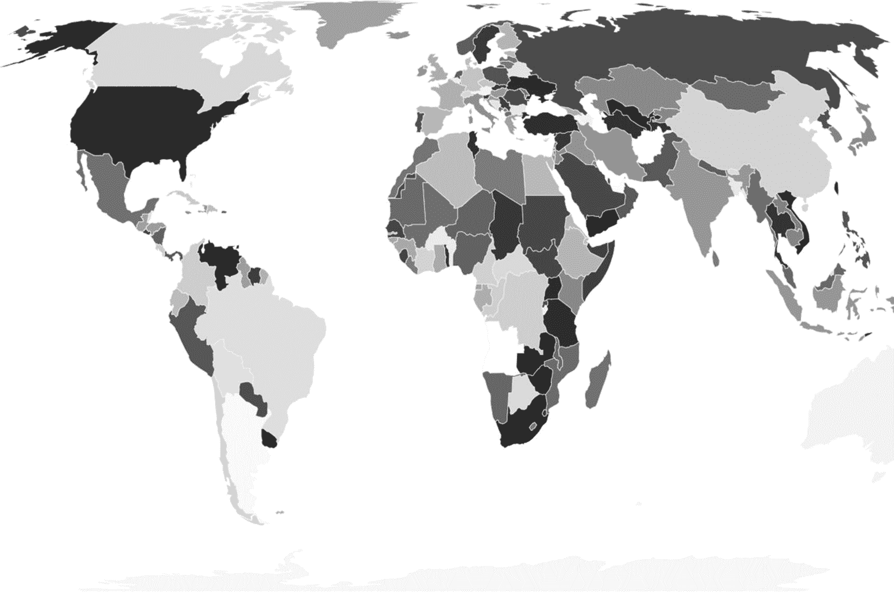
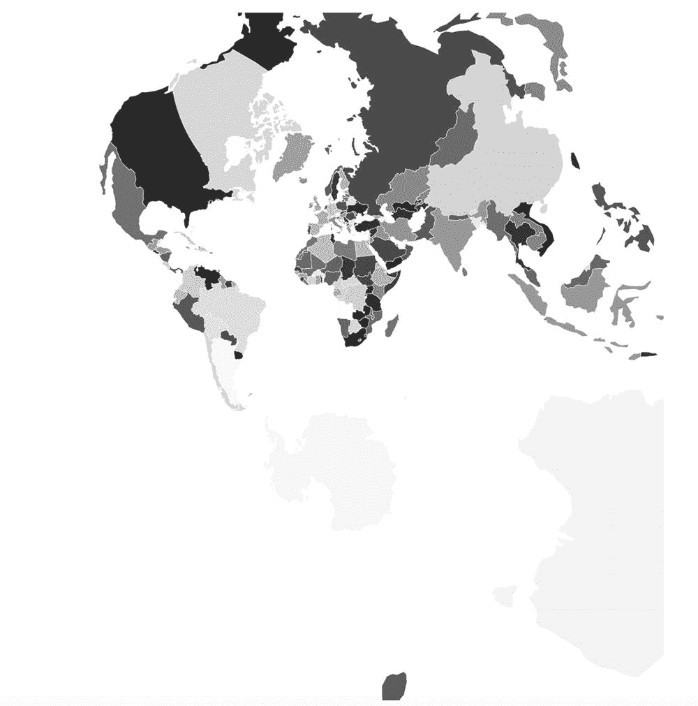
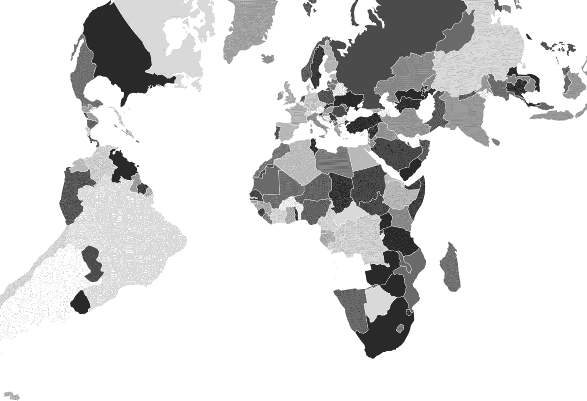
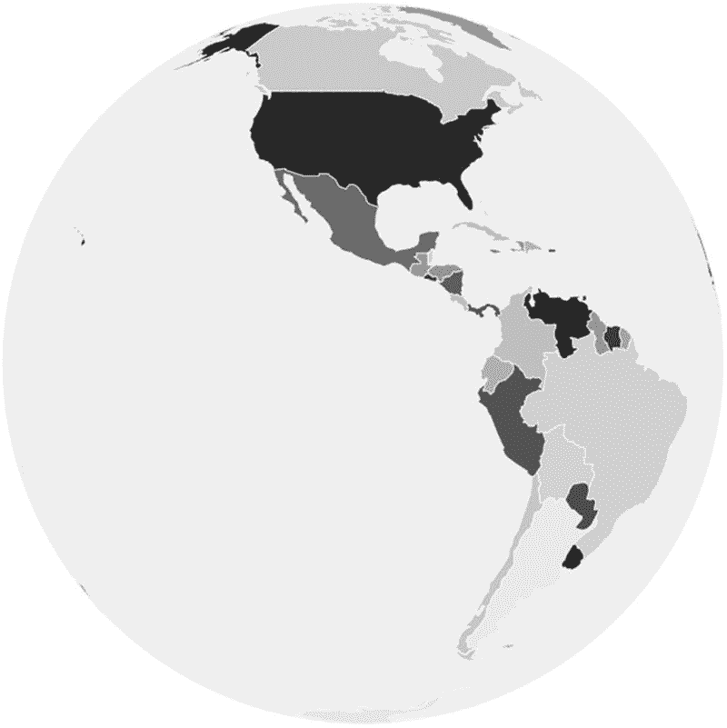
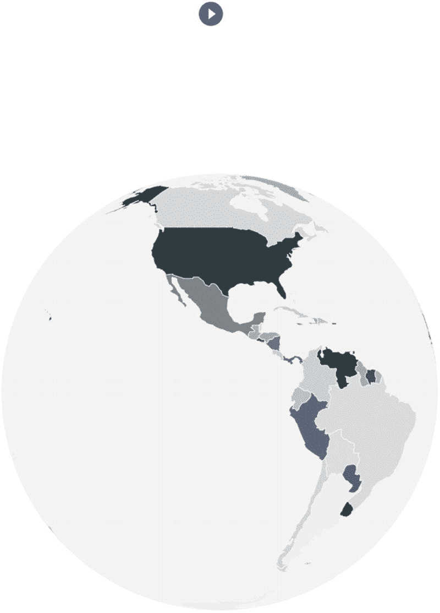
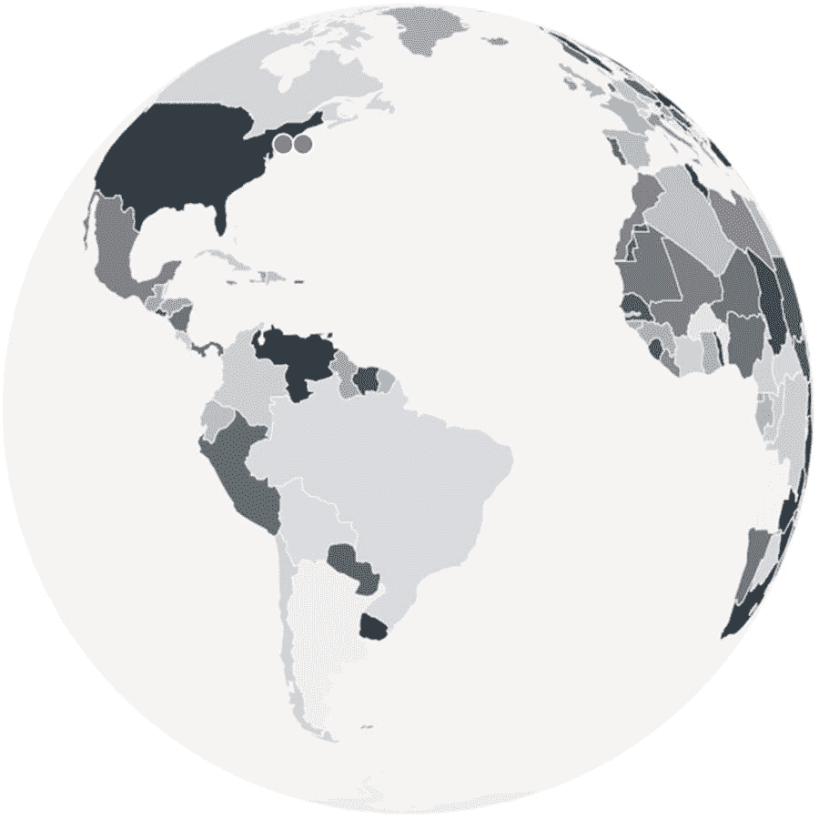

# 六、世界地图：第一部分

世界地图是展示全球物品的好方法。将 D3 与 React 和 TS 集成在一起，可以创建使用所有工具中最好的可读代码。在这一章，我将向你展示如何创建一个旋转地图，并根据坐标分配点。

具体来说，在这一章中，我将向你展示如何使用 React、D3 和 TS 作为类型检查器来操作世界地图。我将把这个过程分成几个步骤。在每一步中，我将添加更多的功能，直到我们有了用点代表坐标的旋转世界地图。

我已经将组件分成了五个文件，所以很容易看到和比较变化。

*   *世界地图图册* : `WorldMapAtlas.tsx`

*   *圆形世界地图* : `RoundWorldMap.tsx`

*   *旋转圆形世界地图* : `RotatingRoundWorldMap.tsx`

*   *坐标为* : `RotatingRoundWorldMapWithCoordinates.tsx`的旋转圆形世界地图

*   *重构* : `WorldMap.tsx`

该项目可以从这里下载:

[T2`https://github.com/Apress/integrating-d3.js-with-react/tree/main/ch06/world-map-chart`](https://github.com/Apress/integrating-d3.js-with-react/tree/main/ch06/world-map-chart)

## 设置

项目设置很简单，使用 CRA 与 MHL 模板项目。

```jsx
$ yarn create react-app world-map-chart --template must-have-libraries
$ cd world-map-chart
$ yarn start
$ open http://localhost:3000

```

### 安装其他所需的库和类型

我们需要另外四个库来开始。

*   `d3-geo`:我们将使用`d3-geo`进行地理投影(绘制地图)。 [`https://github.com/d3/d3-geo`见](https://github.com/d3/d3-geo)。

*   `topojson-client`:这是一个操纵 TopoJSON 的客户端。TopoJSON 是提供世界地图的库，我可以用它来绘制地图。`https://github.com/topojson/topojson-client`见。

*   `geojson`:这是地理数据的编码格式。 [`https://geojson.org/`见](https://geojson.org/)。TopoJSON 文件属于“拓扑”类型，遵循 TopoJSON 规范。GeoJSON 将用于格式化地理数据结构的编码。 [`https://geojson.org/`见](https://geojson.org/)。

*   `react-uuid`:创建一个随机 UUID，我们将在映射 React 组件时使用它作为所需的列表键。`https://github.com/uuidjs/uuid`见。

继续用 Yarn 安装这些库:

```jsx
$yarn add d3-geo @types/d3-geo
$yarn add topojson-client @types/topojson-client
$yarn add geojson @types/geojson
$yarn add react-uuid

```

最后，下载世界地图集的数据。数据由 TopoJSON 提供，其中包含预构建的状态数据( [`https://github.com/topojson/world-atlas`](https://github.com/topojson/world-atlas) )。下面是我将使用的实际 JSON:

[T2`https://d3js.org/world-110m.v1.json`](https://d3js.org/world-110m.v1.json)

将文件放在公共文件夹中以便于访问:`/public/data/world-110m.json`。

## 世界地图图册

我将创建的第一个地图只是一个平面世界地图集类型的地图，将显示世界。

### 世界地图图册. tsx

自己创建文件或使用`generate-react-cli`。

```jsx
$ npx generate-react-cli component WorldMap --type=d3

```

正如我提到的，我将把组件作为单独的组件来创建，因此跟踪工作和比较变化将会很容易。第一档是`WorldMapAtlas.tsx`。以下是完整的组件代码:

```jsx
// src/components/WorldMap/WorldMapAtlas.tsx
import React, { useState, useEffect } from 'react'
import { geoEqualEarth, geoPath } from 'd3-geo'
import { feature } from 'topojson-client'
import { Feature, FeatureCollection, Geometry } from 'geojson'
import './WorldMap.scss'

const uuid = require('react-uuid')

const scale: number = 200
const cx: number = 400
const cy: number = 150

const WorldMapAtlas = () => {
  const [geographies, setGeographies] = useState<[] | Array<Feature<Geometry | null>>>([])

  useEffect(() => {
    fetch('/data/world-110m.json').then((response) => {
      if (response.status !== 200) {
        // eslint-disable-next-line no-console
        console.log(`Houston we have a problem: ${response.status}`)
        return
      }
      response.json().then((worldData) => {
        const mapFeatures: Array<Feature<Geometry | null>> = ((feature(worldData, worldData.objects.countries) as unknown) as FeatureCollection).features
        setGeographies(mapFeatures)
      })
    })
  }, [])

  const projection

= geoEqualEarth().scale(scale).translate([cx, cy]).rotate([0, 0])

  return (
    <>
      <svg width={scale * 3} height={scale * 3} viewBox="0 0 800 450">
        <g>
          {(geographies as []).map((d, i) => (
            <path
              key={`path-${uuid()}`}
              d={geoPath().projection(projection)(d) as string}
              fill={`rgba(38,50,56,${(1 / (geographies ? geographies.length : 0)) * i})`}
              stroke="aliceblue"
              strokeWidth={0.5}
            />
          ))}
        </g>
      </svg>

  )
}

export default WorldMapAtlas

```

我们来复习一下。

第一步，我们导入 React 和我们安装的库。我还创建了`WorldMap.scss`作为未来使用的样式占位符。

```jsx
import React, { useState, useEffect } from 'react'
import { geoEqualEarth, geoPath } from 'd3-geo'
import { feature } from 'topojson-client'
import { Feature, FeatureCollection, Geometry } from 'geojson'
import './WorldMap.scss'

```

对于`react-uuid`库，TS 没有类型，所以我将使用`require`，这样 ESLint 就不会抱怨了。

```jsx
const uuid = require('react-uuid')

```

接下来，我们设置地图比例和定位等属性。

```jsx
const scale: number = 200
const cx: number = 400
const cy: number = 150

```

`WorldMapAtlas`设置为功能组件。这是一个偏好问题，我可以使用类组件。

至于状态的数据，我将客户端数据设置为州。一旦加载了数据，我就将 JSON 转换成可以呈现的特征几何数组。

```jsx
  const [geographies, setGeographies] = useState<[] | Array<Feature<Geometry | null>>>([])

```

就类型而言，我必须通过钻取实际的`geojson`库来确定类型。

接下来，我将数据加载到`useEffect`钩子上。在本章的后面，我将重构这段代码，并把它移到父组件中，但现在我希望代码尽可能简单。这是我的工作地图:

```jsx
  useEffect(() => {
    fetch('/data/world-110m.json').then((response) => {
      if (response.status !== 200) {
        console.log(`Houston we have a problem: ${response.status}`)
        return
      }
      response.json().then((worldData) => {

```

注意，我使用的是“fetch ”,然而，另一种方法是使用 d3.json 模块。D3 已经将对象格式化为 JSON，所以代码更少。

```jsx
  useEffect(() => {
    d3.json('/data/world-110m.json').then((d) => { return d }).then((worldData) => {
        // @ts-ignore const mapFeature: Array<Feature<Geometry | null>> = (feature(worldData, worldData.objects.countries) as FeatureCollection).features setGeographies(mapFeature)
    })
  })

```

一旦得到响应，我就可以将 JSON 转换成一个`Geometry`特性数组，并将其设置为函数状态。

```jsx
        const mapFeatures: Array<Feature<Geometry | null>> = ((feature(worldData, worldData.objects.countries) as unknown) as FeatureCollection).features
        setGeographies(mapFeatures)
      })
    })
  }, [])

```

用外行人的话来说，这个投影就是我希望我的实际地图集的样子。有很多选项可以选择(见 [`https://github.com/d3/d3-geo/blob/master/README.md`](https://github.com/d3/d3-geo/blob/master/README.md) )。让我们以`geoEqualEarth`作为第一次尝试。

```jsx
  const projection = geoEqualEarth().scale(scale).translate([cx, cy]).rotate([0, 0])

```

为了呈现我的地图集，我将首先设置一个 SVG 包装器，它保存一个组元素，然后使用一个 map 遍历路径，通过我设置为 state 的`geographies`数据来绘制每个状态。

```jsx
  return (
    <>
      <svg width={scale * 3} height={scale * 3} viewBox="0 0 800 450">
        <g>
          {(geographies as []).map((d, i) => (
            <path
              key={`path-${uuid()}`}
              d={geoPath().projection(projection)(d) as string}
              fill={`rgba(38,50,56,${(1 / (geographies ? geographies.length : 0)) * i})`}
              stroke="aliceblue"
              strokeWidth={0.5}
            />
          ))}
        </g>
      </svg>
      </>

  )
}

export default WorldMapAtlas

```

注意，我正在使用`key={`path-${uuid()}`}`。

键是标识唯一虚拟 DOM (VDOM) UI 元素及其相应数据的常见做法。如果不执行这一步，React VDOM 会在需要刷新 DOM 时感到困惑。这是最佳实践。您可以使用随机数，但请注意不要使用地图索引作为关键字，因为地图可能会发生变化，从而导致 VDOM 引用错误的项目。

> *按键帮助 React 识别哪些项目已经更改、添加或删除。应该给数组内部的元素赋予键，以给元素一个稳定的标识。*
> 
> [`https://reactjs.org/docs/lists-and-keys.html`](https://reactjs.org/docs/lists-and-keys.html)

键和引用作为属性添加到一个`React.createElement()`调用中。它们通过回收 DOM 中的所有现有元素来帮助 React 优化渲染。

### App.tsx

接下来，让我们将我们的`WorldMapAtlas`组件作为子组件添加到`App.tsx`中。

请注意，更改以粗体突出显示。

```jsx
import React from 'react'
import './App.scss'
import WorldMapAtlas from './components/WorldMap/WorldMapAtlas'

function App() {
  return (
    <div className="App">
      <header className="App-header">
        <WorldMapAtlas />
      </header>
    </div>
  )
}

export default App

```

### app . scss

对于`App.scss`样式，我将背景颜色改为白色。

```jsx
.App-header {
  background-color: #ffffff;
  min-height: 100vh;
  display: flex;
  flex-direction: column;
  align-items: center;
  justify-content: center;
  font-size: calc(10px + 2vmin);
  color: white;
}

```

就是！参见图 [6-1](#Fig1) 。



图 6-1

简单世界地图图册

正如我提到的，对于投影，我使用了`geoEqualEarth`；但是，我可以很容易地将投影更改为其他投影。例如，如果我想换到`geoStereographic`，我的地图就会改变。见图 [6-2](#Fig2) 。

从此处更改投影:

```jsx
import { geoEqualEarth, geoPath} from 'd3-geo'

const projection = geoEqualEarth().scale(scale).translate([cx, cy]).rotate([0, 0])

```

致以下内容:



图 6-2

使用地球立体投影的世界地图集

```jsx
import { geoPath, geoStereographic } from 'd3-geo'
const projection = geoStereographic().scale(scale).translate([cx, cy]).rotate([0, 0])

```

另一个例子是`geoConicConformal`投影(图 [6-3](#Fig3) )。



图 6-3

使用地理共形投影的世界地图集

```jsx
const projection = geoConicConformal().scale(scale).translate([cx, cy]).rotate([0, 0])

```

## 圆形世界地图

现在我们知道如何绘制世界地图图册。接下来我们将看到如何创建一个圆形的世界地图。

要改变地图为圆形，我所要做的就是使用`geoOrthographic`投影。

为了让圆形地图看起来更好，我还打算使用 SVG circle 元素绘制一个圆形浅灰色背景。

### RoundWorldMap.tsx

创建一个名为`RoundWorldMap.tsx`的新组件；查看此处突出显示的更改。

```jsx
// src/components/WorldMap/RoundWorldMap.tsx

  const projection = geoOrthographic().scale(scale).translate([cx, cy]).rotate([rotation, 0])

  return (
    <svg width={scale * 3} height={scale * 3} viewBox="0 0 800 450">
      <g>
        <circle
          fill="#0098c8"
          cx={cx}
          cy={cy}
          r={scale}
        />
      </g>
      <g>
        {(geographies as []).map((d, i) => (
          <path
            key={`path-${uuid()}`}
            d={geoPath().projection(projection)(d) as string}
            fill={`rgba(38,50,56,${(1 / (geographies ? geographies.length : 0)) * i})`}
            stroke="aliceblue"
            strokeWidth={0.5}
          />
        ))}
      </g>
    </svg>
  )
}

```

记得更新`App.tsx`。

```jsx
return (
  <div className="App">
    <header className="App-header">
      <RoundWorldMap />
    </header>
  </div>
)

```

见图 [6-4](#Fig4) 。



图 6-4

环球地图图册

## 旋转圆形世界地图

现在我们有了一个圆形的世界地图图集，再加上动画和互动岂不是很棒？我们可以旋转图集，添加一个按钮开始动画。

### AnimationFrame.tsx

要添加动画，我们可以调用 JavaScript 窗口`requestAnimationFrame` API ( [`https://developer.mozilla.org/en-US/docs/Web/API/window/requestAnimationFrame`](https://developer.mozilla.org/en-US/docs/Web/API/window/requestAnimationFrame) )。

`requestAnimationFrame`方法告诉浏览器我要执行一个动画，浏览器会调用我的回调函数，这样我就可以在下次重绘之前更新我的动画。

要使用`requestAnimationFrame`，我可以将下面的代码放在我的 React 组件中:

```jsx
window.requestAnimationFrame(() => {
  // TODO
})

```

但是，更好的架构设计是使用`useRef`创建一个 hook 函数组件，并包装我的`requestAnimationFrame`。看一看:

```jsx
// src/hooks/WindowDimensions.tsx
import { useEffect, useRef } from 'react'

export default (callback: (arg0: ICallback) => void) => {
  const frame = useRef()
  const last = useRef(performance.now())
  const init = useRef(performance.now())

  const animate = () => {
    const now = performance.now()
    const time = (now - init.current) / 1000
    const delta = (now - last.current) / 1000
    callback({ time, delta })
    last.current = now
    ;((frame as unknown) as IFrame).current = requestAnimationFrame(animate)
  }

  useEffect(() => {
    ((frame as unknown) as IFrame).current = requestAnimationFrame(animate)
    return () => cancelAnimationFrame(((frame as unknown) as IFrame).current)
  })
}

interface ICallback {
  time: number
  delta: number
}

```

让我们回顾一下代码。

我将回调作为参数传递。

```jsx
export default (callback: (arg0: ICallback) => void) => {

```

接下来，我将使用`performance.now()` ( [`https://developer.mozilla.org/en-US/docs/Web/API/Performance/now`](https://developer.mozilla.org/en-US/docs/Web/API/Performance/now) )来跟踪帧。这个特性带来了一个一毫秒分辨率的时间戳，我可以用它来计算时间增量，以备不时之需。

Note

时间差是时间上的差异。

```jsx
  const frame = useRef()
  const last = useRef(performance.now())
  const init = useRef(performance.now())

```

在每次调用`requestAnimationFrame`时，`animate`将返回当前时间戳。

```jsx
  const animate = () => {
    const now = performance.now()
    const time = (now - init.current) / 1000
    const delta = (now - last.current) / 1000
    callback({ time, delta })
    last.current = now;
    (frame as unknown as IFrame).current = requestAnimationFrame(animate)
  }

```

然后我可以使用`useEffect`钩子来绑定`animate`方法。

我的效果需要在组件离开屏幕之前清理干净。为此，传递给`useEffect`的函数需要返回一个清理函数。在我的例子中，`cancelAnimationFrame`需要在`useEffect`返回回调中被调用。你可以在这里了解更多关于 React 特效和清理: [`https://reactjs.org/docs/hooks-reference.html`](https://reactjs.org/docs/hooks-reference.html) 。

```jsx
  useEffect(() => {
    (frame as unknown as IFrame).current = requestAnimationFrame(animate)
    return () => cancelAnimationFrame((frame as unknown as IFrame).current)
  })
}

```

### RotatingRoundWorldMap.tsx

现在我们已经准备好将`AnimationFrame`钩子用于我们的动画，我可以添加我的旋转动画了。此外，我将从 Material-UI 添加一个图标按钮形式的用户手势来启动动画。

从我们之前的例子中复制`RoundWorldMap.tsx`文件，并将其保存为一个名为`RotatingRoundWorldMap.tsx`的新文件。看看这些来自`RoundWorldMap.tsx`的变化:

```jsx
// src/components/WorldMap/RotatingRoundWorldMap.tsx

import PlayCircleFilledWhiteIcon from '@material-ui/icons/PlayCircleFilledWhite'
import { Button } from '@material-ui/core'

```

动画逻辑检查 360 度旋转是否结束，以在每次完成 360 度时重置旋转变量。动画检查`isRotate`状态是否设置为真，这样我的地图只有在我点击开始按钮时才会开始旋转。

```jsx
  AnimationFrame(() => {
    if (isRotate) {
      let newRotation = rotation
      if (rotation >= 360) {
        newRotation = rotation - 360
      }
      setRotation(newRotation + 0.2)
      // console.log(`rotation: ${  rotation}`)
    }
  })

```

我正在添加一个按钮来启动动画。这是通过使用粗箭头内嵌函数将`isRotate`状态设置为 true 来实现的。

```jsx
  return (
    <>
      <Button
        size="medium"
        color="primary"
        startIcon={<PlayCircleFilledWhiteIcon />}
        onClick={() => {
          setIsRotate(true)
        }}
      />
      <svg width={scale * 3} height={scale * 3} viewBox="0 0 800 450">
        <g>
          <circle
            fill="#0098c8"
            cx={cx}
            cy={cy}
            r={scale}
          />
        </g>
        <g>
          {(geographies as []).map((d, i) => (
            <path
              key={`path-${uuid()}`}
              d={geoPath().projection(projection)(d) as string}
              fill={`rgba(38,50,56,${(1 / (geographies ? geographies.length : 0)) * i})`}
              stroke="aliceblue"
              strokeWidth={0.5}
            />
          ))}
        </g>
      </svg>
      </>

  )
}

```

记得更新`App.tsx`以包含`RotatingRoundWorldMap`组件。

```jsx
return (
  <div className="App">
    <header className="App-header">
      <RotatingRoundWorldMap />
    </header>
  </div>
)

```

图 [6-5](#Fig5) 显示了最终结果。



图 6-5

旋转圆形世界地图图册

我们需要做的另一个改变是将地图数据的加载放在一个检查数据是否被加载的语句中。

原因是由于使用了动画钩子，useEffect 会一直被调用。

看一看；

```jsx
useEffect(() => { if (geographies.length === 0) {
    // load map
}

```

## 带坐标的旋转圆形世界地图

在这一节中，我将向你展示如何在我们的地图上添加坐标点。

### rotationroundworldmapwithcoordinates . tsx

复制前面例子中的`RotatingRoundWorldMap.tsx`文件，并将其命名为`RotatingRoundWorldMapWIthCoordinates.tsx`。

是的，我知道这是一个很长的名字，但是使用莎士比亚的方法名，很容易看出这个组件在做什么。

为了创建坐标点，我将添加一个新的数据数组提要，其中包括坐标的经度和纬度。看看与之前的`RotatingRoundWorldMap.tsx`组件相比的变化:

```jsx
// src/components/WorldMap/RotatingRoundWorldMapWIthCoordinates.tsx
import React, { useState, useEffect } from 'react'
import { geoOrthographic, geoPath } from 'd3-geo'
import { feature } from 'topojson-client'
import { Feature, FeatureCollection, Geometry } from 'geojson'
import './WorldMap.scss'
import PlayCircleFilledWhiteIcon from '@material-ui/icons/PlayCircleFilledWhite'
import { Button } from '@material-ui/core'
import AnimationFrame from '../../hooks/AnimationFrame'

const uuid = require('react-uuid')

const data: { name: string; coordinates: [number, number] }[] = [
  { name: '1', coordinates: [-73.9919, 40.7529] },
  { name: '2', coordinates: [-70.0007884457405, 40.75509010847814] },
]

const scale: number = 200
const cx: number = 400
const cy: number = 150
const initRotation: number = 50

const RotatingRoundWorldMapWithCoordinates = () => {
  const [geographies, setGeographies] = useState<[] | Array<Feature<Geometry | null>>>([])
  const [rotation, setRotation] = useState<number>(initRotation)
  const [isRotate, setIsRotate] = useState<Boolean>(false)

  useEffect(() => {
    if (geographies.length === 0) {
        fetch('/data/world-110m.json').then((response) => {
          if (response.status !== 200) {
            // eslint-disable-next-line no-console
            console.log(`Houston we have a problem: ${response.status}`)
          return
        }
        response.json().then((worldData) => {
          const mapFeatures: Array<Feature<Geometry | null>> = ((feature(worldData, worldData.objects.countries) as unknown) as FeatureCollection).features
          setGeographies(mapFeatures)
        })
      })
    }
  }, [])

  // geoEqualEarth
  // geoOrthographic
  const projection = geoOrthographic().scale(scale).translate([cx, cy]).rotate([rotation, 0])

  AnimationFrame(() => {
    if (isRotate) {
      let newRotation = rotation
      if (rotation >= 360) {
        newRotation = rotation - 360
      }
      setRotation(newRotation + 0.2)
      // console.log(`rotation: ${  rotation}`)
    }
  })

  function returnProjectionValueWhenValid(point: [number, number], index: number) {
    const retVal: [number, number] | null = projection(point)
    if (retVal?.length) {
      return retVal[index]
    }
    return 0
  }

  const handleMarkerClick = (i: number) => {
    // eslint-disable-next-line no-alert

    alert(`Marker: ${JSON.stringify(data[i])}`)
  }

  return (
  <>

      <Button
        size="medium"
        color="primary"
        startIcon={<PlayCircleFilledWhiteIcon />}
        onClick={() => {
          setIsRotate(true)
        }}
      />
      <svg width={scale * 3} height={scale * 3} viewBox="0 0 800 450">
        <g>
          <circle fill="#f2f2f2" cx={cx} cy={cy} r={scale} />
        </g>
        <g>
          {(geographies as []).map((d, i) => (
            <path
              key={`path-${uuid()}`}
              d={geoPath().projection(projection)(d) as string}
              fill={`rgba(38,50,56,${(1 / (geographies ? geographies.length : 0)) * i})`}
              stroke="aliceblue"
              strokeWidth={0.5}
            />
          ))}
        </g>
        <g>
          {data.map((d, i) => (
            <circle

              key={`marker-${uuid()}`}
              cx={returnProjectionValueWhenValid(d.coordinates, 0)}
              cy={returnProjectionValueWhenValid(d.coordinates, 1)}
              r={5}
              fill="#E91E63"
              stroke="#FFFFFF"
              onClick={() => handleMarkerClick(i)}
              onMouseEnter={() => setIsRotate(false)}
            />
          ))}
        </g>
      </svg>

  </>
  )
}
export default RotatingRoundWorldMapWithCoordinates

```

```jsx
Let’s review the changes in RotatingRoundWorldMapWIthCoordinates from RoundWorldMapAtlas. I am setting a data object that includes the names and coordinates.
const data: { name: string; coordinates: [number, number] }[] = [
  { name: '1', coordinates: [-73.9919, 40.7529] },
  { name: '2', coordinates: [-70.0007884457405, 40.75509010847814] },
]

```

对于初始的世界地图旋转位置，我可以用一个常量来设置，我希望世界地图开始旋转的角度。

```jsx
const initRotation: number = 50

```

接下来，我将添加一个`returnProjectionValueWhenValid`方法来调整点的位置。这是需要的，因为世界地图是动画，投影地图上的位置将会改变。

```jsx
function returnProjectionValueWhenValid(point: [number, number], index: number) {
    const retVal: [number, number] | null = projection(point)
    if (retVal?.length) {
      return retVal[index]
    }
    return 0
  }

```

一旦用户点击圆点，我将设置一个处理程序。一旦用户被点击，这可以用来打开一个详细的信息窗口或你想做的任何事情。

```jsx
  const handleMarkerClick = (i: number) => {
    alert(`Marker: ${  JSON.stringify( data[i])}` )
  }

```

在渲染时，我将使用数组映射属性遍历坐标数组，并设置`onClick`处理程序和鼠标输入事件来停止动画，这样更容易单击标记。

```jsx
        <g>
          {data.map((d, i) => (
            <circle
              key={`marker-${uuid()}`}
              cx={returnProjectionValueWhenValid(d.coordinates, 0)}
              cy={returnProjectionValueWhenValid(d.coordinates, 1)}
              r={5}
              fill="#E91E63"
              stroke="#FFFFFF"
              onClick={() => handleMarkerClick(i)}
              onMouseEnter={() => setIsRotate(false)}
            />
          ))}
        </g>

```

请注意，就像上一步一样，每次我在 React 中使用地图时，我都会为每个项目添加一个唯一的键。

最后，记得更新`App.tsx`。

```jsx
return (
  <div className="App">
    <header className="App-header">
<RotatingRoundRotatingRoundWorldMapWithCoordinatesWIthCoordinates />
    </header>
  </div>
)

```

图 [6-6](#Fig6) 显示了最终结果。



图 6-6

用坐标旋转圆形世界地图图册

## 重构

在本章的最后一步，我将做一些简单的重构工作。我将做以下事情:

*   *属性*:提取`props`属性，以便父组件调整属性和数据。

*   *坐标*:将坐标数据设置为 CSV 格式的第二个数据进给。

*   *Loader* :从父组件加载数据，使用异步任务将数据传递给 map chart。

*   *Types* :添加 TypeScript 类型，使代码可读性更好，避免错误，并有助于测试。

### 坐标. csv

最好将坐标数据提取到一个单独的 CSV 数据文件中。那不仅仅是为了清理代码。数据可能会增长，我可能需要从外部来源获取这些数据。我把坐标分解成纬度和经度，以防我需要用到这些信息。

```jsx
id,latitude,longitude
1,-73.9919,40.7529
2,-70.0007884457405,40.75509010847814

```

将文件放在这里以便于访问:`world-map-chart/public/data/coordinates.csv`。

### types.tsx

正如您将在本书中看到的，TS 中的一个常见做法是为 TypeScript 创建类型。这不仅是一个好的实践，而且会清理代码，使其更具可读性。在我的例子中，我将为两个数据馈送设置两种类型:`CoordinatesData`和`MapObject`。

```jsx
// src/component/BasicScatterChart/types.ts

import { Feature, Geometry } from 'geojson'

export namespace Types {
  export type CoordinatesData = {
    id: number
    latitude: number
    longitude: number
  }

  export type MapObject = {
    mapFeatures: Array<Feature<Geometry | null>>
  }
}

```

引用类型时，通常使用小写的首字母。我们正在创建引用，因此任何一种方式都可以。换句话说，你可以决定你喜欢什么，但要保持一致。我想让你知道这两种选择。

```jsx
export type coordinatesData

```

请注意，如果您以小写字母开头，您将会得到一个 lint 错误，因为我们的 lint 规则被设置为对任何不是以大写字母开头的导出类型进行投诉。您可以禁用它，只是这次禁用或全局禁用。

```jsx
// eslint-disable-next-line @typescript-eslint/naming-convention

export type coordinatesData

```

### WorldMap.tsx

对于我们的重构工作，复制前面示例中的`RotatingRoundWorldMapWIthCoordinates.tsx`文件，并将其命名为`WorldMap.tsx`。

大部分代码保持不变。

对于`props`接口，我将添加数据馈送和对齐属性，因此我需要添加`props`接口并更改函数签名。

对`WorldMap.tsx`的大部分改变只是增加了这些`props`而不是数据。更改以粗体突出显示。

```jsx
// src/components/WorldMap/WorldMap.tsx

import React, { useState } from 'react'
import { geoOrthographic, geoPath } from 'd3-geo'
import './WorldMap.scss'
import PlayCircleFilledWhiteIcon from '@material-ui/icons/PlayCircleFilledWhite'
import { Button } from '@material-ui/core'
import AnimationFrame from '../../hooks/AnimationFrame'
import { Types } from './types'

const uuid = require('react-uuid')

const WorldMap = (props: IWorldMapProps) => {
  const [rotation, setRotation] = useState<number>(props.initRotation)
  const [isRotate, setIsRotate] = useState<Boolean>(false)

  const projection = geoOrthographic().scale(props.scale).translate([props.cx, props.cy]).rotate([rotation, 0])

  AnimationFrame(() => {
    if (isRotate) {
      let newRotation = rotation
      if (rotation >= 360) {
        newRotation = rotation - 360
      }
      setRotation(newRotation + 0.2)
    }
  })

  function returnProjectionValueWhenValid(point: [number, number], index: number ) {
    const retVal: [number, number] | null = projection(point)
    if (retVal?.length) {
      return retVal[index]
    }
    return 0
  }

  const handleMarkerClick = (i: number) => {
    alert(`Marker: ${  JSON.stringify( props.coordinatesData[i].id)}` )
  }

  return (
  <>

      <Button
        size="medium"
        color="primary"
        startIcon={<PlayCircleFilledWhiteIcon />}
        onClick={() => {
          setIsRotate(true)
        }}
      />
      <svg width={props.scale * 3} height={props.scale * 3} viewBox="0 0 800 450">
        <g>
          <circle
            fill="#f2f2f2"
            cx={props.cx}
            cy={props.cy}
            r={props.scale}
          />
        </g>
        <g>
          {(props.mapData.mapFeatures as ).map((d, i) => (
            <path
              key={`path-${uuid()}`}
              d={geoPath().projection(projection)(d) as string}
              fill={`rgba(30,50,50,${(1 / (props.mapData.mapFeatures ? props.mapData.mapFeatures.length : 0)) * i})`}
              stroke="aliceblue"
              strokeWidth={props.rotationSpeed}
            />
          ))}
        </g>
        <g>
          {props.coordinatesData?.map((d, i) => (
            <circle
              key={`marker-${uuid()}`}
              cx={returnProjectionValueWhenValid([d.latitude, d.longitude], 0)}
              cy={returnProjectionValueWhenValid([d.latitude, d.longitude], 1)}
              r={5}
              fill="#E91E63"
              stroke="#FFFFFF"
              onClick={() => handleMarkerClick(i)}
              onMouseEnter={() => setIsRotate(false)}
            />
          ))}
        </g>
      </svg>

  </>
  )
}

export default WorldMapinterface IWorldMapProps {
  mapData: Types.MapObject
  coordinatesData: Types.CoordinatesData[]
  scale: number
  cx: number
  cy: number
  initRotation: number
  rotationSpeed: number
}

```

如您所见，与上一个示例中的`RotatingRoundWorldMapWIthCoordinates.tsx`文件相比，我们在`WorldMap.tsx`中的代码现在更加清晰，可读性更好。

### App.tsx

对于父组件，我将提取数据，把它放在 effect 钩子中，并使用 D3 加载 JSON 和 CSV。

因为我想在绘制地图之前加载两个数据集，所以一个好的方法是在将数据传递给图表组件之前对两个数据集使用异步调用。

我们可以用 D3 的`queue()`。 [`https://github.com/d3/d3-queue`见](https://github.com/d3/d3-queue)。D3 的`queue()`做异步任务。添加这些 D3 模块和 TS 类型。

第一步是将这些库添加到我们的项目中；

```jsx
$ yarn add d3-queue d3-request @types/d3-queue @types/d3-request

```

接下来，让我们重构我们的`App.tsx`。

```jsx
// src/App.tsx

import React, { useEffect, useState } from 'react'
import './App.scss'
import { queue } from 'd3-queue'
import { csv, json } from 'd3-request'
import { FeatureCollection } from 'geojson'
import { feature } from 'topojson-client'
import WorldMap from './components/WorldMap/WorldMap'
import { Types } from './components/WorldMap/types'

function App() {
  const [mapData, setMapData] = useState<Types.MapObject>({ mapFeatures: [] })
  const [coordinatesData, setCoordinatesData] = useState<Types.CoordinatesData[]>([])

  useEffect(() => {
    if (coordinatesData.length === 0) {
      const fileNames = ['./data/world-110m.json', './data/coordinates.csv']
      queue()
        .defer(json, fileNames[0])
        .defer(csv, fileNames[1])
        .await((error, d1, d2: Types.CoordinatesData[]) => {
          if (error) {
            // eslint-disable-next-line no-console
            console.log(`Houston we have a problem:${error}`)
          }
          setMapData({ mapFeatures: ((feature(d1, d1.objects.countries) as unknown) as FeatureCollection).features })
          setCoordinatesData(d2)
        })
    }
  })
  return (
    <div className="App">
      <header className="App-header">
        <WorldMap mapData={mapData} coordinatesData={coordinatesData} scale={200} cx={400} cy={150} initRotation={50} rotationSpeed={0.5} />
      </header>
    </div>
  )
}

export default App

```

让我们回顾一下代码。

我们为`geojson`和`topojson-client`添加了`imports`，因为我们将在这里上传数据。我还使用`d3-request`来加载数据，而不是之前使用的 fetch。

```jsx
import { queue } from 'd3-queue'
import { csv, json } from 'd3-request'
import { FeatureCollection } from 'geojson'
import { feature } from 'topojson-client'
import WorldMap from './components/WorldMap/WorldMap'
import { Types } from './components/WorldMap/types'

```

我正在将数据馈送设置为状态；这将允许我分配`props`并确保 React 在数据加载后刷新`props`。

```jsx
  const [mapData, setMapData] = useState<Types.MapObject>({ 'mapFeatures': [] })
  const [coordinatesData, setCoordinatesData] = useState<Types.CoordinatesData[]>([])

```

吊钩将承担起重物。`if`语句确保我不会多次加载我的数据。

D3 `queue`将加载两个数据馈送并设置状态。

```jsx
  useEffect(() => {
    if ( coordinatesData.length === 0 ) {
      const fileNames = ['./data/world-110m.json', './data/coordinates.csv']
      queue()
        .defer(json, fileNames[0])
        .defer(csv, fileNames[1])
        .await((error, d1, d2: Types.CoordinatesData[]) => {
          if (error) {
            console.log(`Houston we have a problem:${  error}`)
          }
          setMapData({ mapFeatures: ((feature(d1, d1.objects.countries) as unknown) as FeatureCollection).features })
          setCoordinatesData(d2)
        })
    }
  })

```

最后，我需要用数据和属性`props`设置`WorldMap`，以匹配我们为`WorldMap`组件设置的`props`接口。

```jsx
        <WorldMap mapData={mapData} coordinatesData={coordinatesData} scale={200} cx={400} cy={150} initRotation={50} rotationSpeed={0.5} />

```

从用户的角度来看，一旦检查了端口 3000: `http://localhost:3000`，实际上没有什么变化。然而，我的代码更有组织性，更容易阅读，也更容易实现状态管理，如反冲或 Redux，因为数据是从实际组件中提取的，可以与多个组件共享。

## 摘要

在本章中，我们在 D3、TopoJSON 和 React 的帮助下创建了一个世界地图。将地图绘制为背景并添加点、动画和交互的能力有助于创建引人注目的图表，该图表可用于讲述您的故事。

在这一章中，我将步骤分解为五个部分，并创建了五个组件。

*   *世界地图图册* : `WorldMapAtlas.tsx`

*   *圆形世界地图* : `RoundWorldMap.tsx`

*   *旋转圆形世界地图* : `RotatingRoundWorldMap.tsx`

*   *坐标为* : `RotatingRoundWorldMapWithCoordinates.tsx`的旋转圆形世界地图

*   *重构* : `WorldMap.tsx`

从这一章可以看出，在`topojson`和`geojson`的帮助下使用 D3 集成世界地图图集是很简单的。

让 React 参与进来使得添加动画和交互更加直观。TS 有助于确保我们理解我们正在做的事情，并避免潜在的错误，在做了一些重构后，您可以看到我们的组件不仅是可重用的，而且可以进行状态管理。

在下一章中，我将向您展示如何使用我们在这里创建的地图并实现反冲状态管理和一个列表来创建一个以交互方式显示简历的小部件。