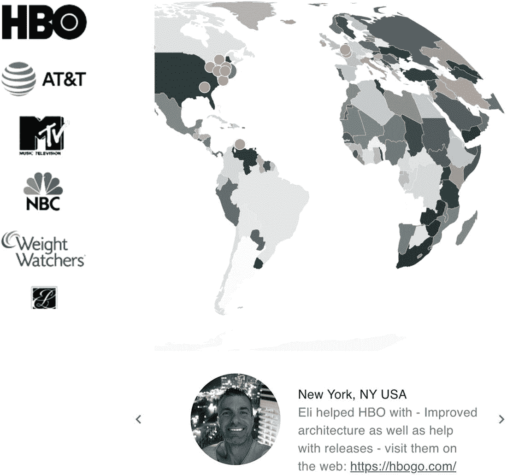
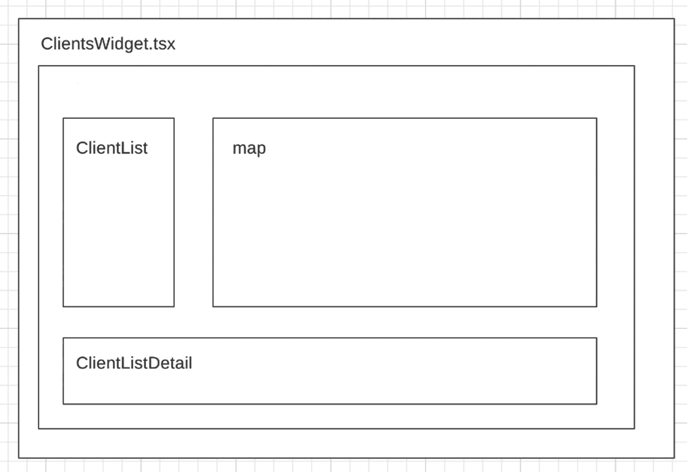
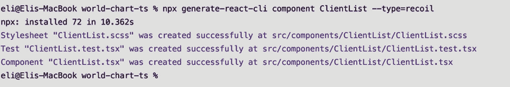
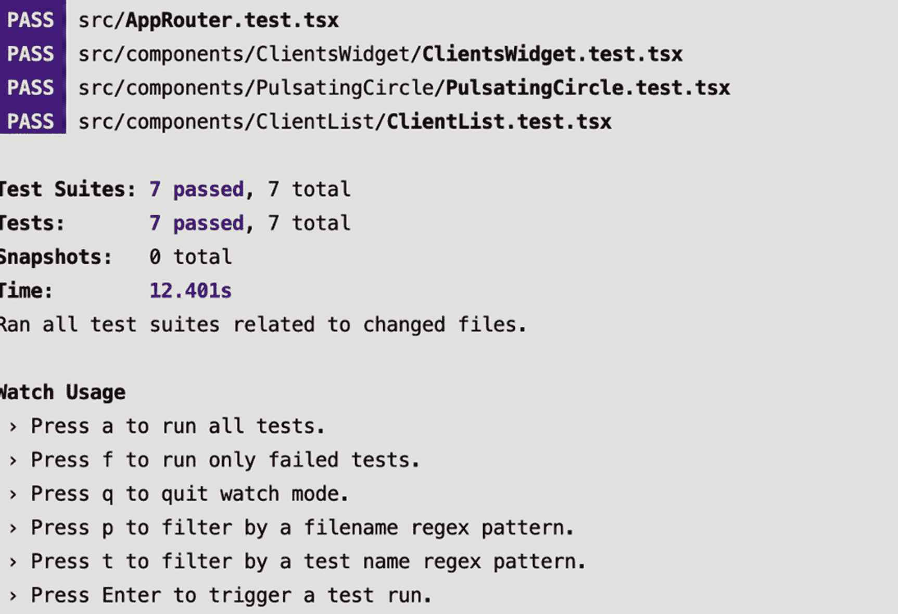

# 七、世界地图：第二部分

在前一章中，我们使用 React 和 D3 创建了一个世界地图图集。在本章中，我将向您展示如何使用我们创建的 map 组件来跨多个组件共享状态并与 map 进行交互。

潜在客户经常问我以前在不同公司的工作和角色，这样他们就能知道我是否适合他们当前的项目。我将使用地图创建一个交互式简历，显示我以前的客户及其在世界各地的位置。

图 [7-1](#Fig1) 在我的网站上显示最终结果: [`https://elielrom.com/about`](https://elielrom.com/about) 。



图 7-1

互动简历的最终结果

这一章是上一章的延续。

就结构而言，这一章分为三个步骤。

*   *第一步*:设置

*   *第二步*:状态管理

*   *步骤 3* :小工具创建

我们开始吧。

## 设置

为了保持一切整洁，我将开始一个新项目。项目设置是快速和简单的使用 CRA 与 MHL 模板项目，你应该熟悉了。

```jsx
$ yarn create react-app world-map-widget --template must-have-libraries
$ cd world-map-widget
$ yarn start
$ open http://localhost:3000

```

正如我们在前一章所做的，我们需要安装额外的库和 TS 类型。

```jsx
$ yarn add d3 @types/d3
$ yarn add d3-geo @types/d3-geo topojson-client @types/topojson-client
$ yarn add @types/geojson geojson
$ yarn add react-uuid

```

在前一章中，我使用了`coordinates.csv`，它包括`id`、`latitude`和`longitude`。

代替`coordinates.csv`，对于客户端列表，我将创建一个新的 CSV 文件，该文件将包括客户端的 CSV 格式的数据馈送，然后添加其他字段。

用以下字段创建`/public/data/client-list.csv`:

```jsx
id,latitude,longitude,name,logo,description,address,city,state,country,website

```

对于地图数据，从上一个项目中复制相同的`world-110m.json`文件并放在这里:`/public/data/world-110m.json`。

## 共享状态管理

你可能还记得，在第 5 章中，我向你展示了如何处理反冲和共享状态。在这一章中，我们将做同样的事情，并通过跨不同组件共享数据来扩展这个主题。

我将创建一个模型对象来保存我们的类型，然后创建反冲选择器。

### 模型文件

有两种数据馈送，分别用于地图和客户端列表。

*   `clientsObject.ts`

*   `mapObject.ts`

如果你看代码，你会看到我正在初始化对象。当我需要设置一些测试并需要缺省值时，这将在本章后面派上用场。

```jsx
// src/model/clientsObject.ts

export interface clientsObject {
  id: number
  latitude: number
  longitude: number
  name: string
  logo: string
  description: string
  address: string
  city: string
  state: string
  country: string
  website: string
}

export const initClientsObject = (): clientsObject => ({
  id: -1,
  latitude: 0,
  longitude: 0,
  name: '',
  logo: '',
  description: '',
  address: '',
  city: '',
  state: '',
  country: '',
  website: '',
})

```

地图对象保存地图特征。这与我们在`App.tsx`的前一章中的代码相同。这一次，我将把代码从`App.tsx`中移出，放到它自己的小部件组件中。这个过程并不新鲜。我们在第五章[中做了同样的事情。](05.html)

我们的 map 对象将包括对象本身的方法以及初始化和设置保存状态数组的对象的方法。看一看:

```jsx
// src/model/mapObject.ts

import { Feature, Geometry } from 'geojson'

export interface mapObject {
  mapFeatures: Array<Feature<Geometry | null>>
}

export const initMapObject = (): mapObject => ({
  mapFeatures: Array<Feature<null>>(),
})

export const setMapObject = (data: Array<Feature<Geometry | null>>): mapObject => ({
  mapFeatures: data,
})

```

### 原子

现在我们有了模型对象集，我们可以创建反冲的原子和选择器。反冲简化了状态管理，所以我们只需要创建两种成分:原子和选择器。

对于我们的例子，我们可以使用`clientAtom.ts`和`mapAtoms.ts`来设置初始状态，但是我们不需要它们。我们创造的模型就足够了。

反冲选择器不需要使用来创建原子，能够跳过一个步骤并编写更少的代码是很好的。原子对于一些情况非常有用，比如当我们想要获得多个组件的状态更新或者将状态传递给选择器时。在我们的例子中，我们不需要这些功能，所以设置原子是多余的，可以跳过。

### 选择器

您可能还记得，选择器是允许您同步或异步转换状态的纯函数。

我们的选择器将为客户端列表和地图提取 CSV 数据。我将使用 D3 `dsv` API 在选择器异步调用中提取 CSV 格式。

```jsx
// src/recoil/selectors/clientsSelectors.ts

import { selector } from 'recoil'
import * as d3 from 'd3'

import { clientsObject } from '../../model'

export const getPreviousClientListData = selector({
  key: 'GetPreviousClientListData',
  get: () => {
    return getData()
  },
})

const getData = async () =>
  new Promise((resolve) =>
    d3
      .dsv(',', '/data/client-list.csv', function results(d) {
        return d
      })
      .then(function results(data) {
        resolve((data as unknown) as clientsObject[])
      })
  )

```

对于地图，我将使用`fetch`内置命令，类似于我们在上一章中所做的，并从`world-110m.json`中提取数据。

```jsx
// src/recoil/selectors/mapSelectors.ts

import { selector } from 'recoil'
import { Feature, FeatureCollection, Geometry } from 'geojson'
import { feature } from 'topojson-client'
import { setMapObject } from '../../model'

export const getMapData = selector({
  key: 'GetMapData',
  get: async () => {
    return getMapDataFromFile()
  },
})

const getMapDataFromFile = () =>
  new Promise((resolve) =>
    fetch('/data/world-110m.json').then((response) => {
      if (response.status !== 200) {
        console.log(`Houston, we have a problem! ${response.status}`)
        return
      }
      response.json().then((worldData) => {
        const mapFeatures: Array<Feature<Geometry | null>> = ((feature(worldData, worldData.objects.countries) as unknown) as FeatureCollection).features
        resolve(setMapObject(mapFeatures))
      })
    })
  )

```

如果你想创建一个 atom，你可以把我返回的对象转换成那个类型。这一步不是必需的，正如您将看到的那样，代码不这样做也能正常工作。

## 小部件

就我们的前端部件而言，你可以在图 [7-2](#Fig2) 中看到前端的线框。



图 7-2

ClientsWidget 组件和子组件高级线框

要生成这些组件、Jest 测试和 SCSS 文件，您可以再次使用我在 CRA/MHL 放置的模板或自己创建的模板`generate-react-cli`。

```jsx
$ npx generate-react-cli component ClientsWidget --type=recoil
$ npx generate-react-cli component WorldMap --type=d3
$ npx generate-react-cli component ClientList --type=recoil
$ npx generate-react-cli component ClientListDetail --type=recoil

```

每个生成三个文件:`Component.tsx`、`Component.test.tsx`和`Component.scss`。以`ClientList`输出为例，如图 [7-3](#Fig3) 所示。



图 7-3

CRA·MHL 模板生成的客户列表

### WorldMap.tsx

接下来，我将使用我们在前一章中创建的`WorldMap.tsx`组件，并做一些额外的重构，使它符合我们的需求。

突出显示了这些更改。看一看:

```jsx
// src/components/WorldMap/WorldMap.tsx
import React, { useState } from 'react'
import { geoEqualEarth, geoPath } from 'd3-geo'
import './WorldMap.scss'
import AnimationFrame from '../../hooks/AnimationFrame'
import { Types } from './types'
import PulsatingCircle from '../PulsatingCircle/PulsatingCircle'
import { clientsObject } from '../../model'

const uuid = require('react-uuid')

const WorldMap = (props: IWorldMapProps) => {
  const [rotation, setRotation] = useState<number>(props.initRotation)
  const [isRotate, setIsRotate] = useState<Boolean>(true)

  const projection = geoEqualEarth().scale(props.scale).translate([props.cx, props.cy]).rotate([rotation, 0])

  AnimationFrame(() => {
    if (isRotate) {
      let newRotation = rotation
      if (rotation >= 360) {
        newRotation = rotation - 360
      }
      setRotation(newRotation + 0.2)
    }
  })

  function

returnProjectionValueWhenValid(point: [number, number], index: number) {
    const retVal: [number, number] | null = projection(point)
    if (retVal?.length) {
      return retVal[index]
    }
    return 0
  }

  const handleMarkerClick = (index: number) => {
    props.setSelectedItem(props.clientsData[index])
    setIsRotate(false)
  }

  return (
    <>
      <svg width={props.scale * 3} height={props.scale * 3} viewBox="0 0 800 450" onMouseMove={() => setIsRotate(false)} onMouseOut={() => setIsRotate(true)}>
        <g>
          {(props.mapData.mapFeatures as []).map((d, i) => (
            <path
              key={`path-${uuid()}`}
              d={geoPath().projection(projection)(d) as string}
              fill={`rgba(30,50,50,${(1 / (props.mapData.mapFeatures ? props.mapData.mapFeatures.length : 0)) * i})`}
              stroke="aliceblue"
              strokeWidth={props.rotationSpeed}
            />
          ))}
        </g>
        <g>
          {props.clientsData.map((d, i) => {
            return props.selectedItem.id !== d.id ? (
              <circle
                style={{ cursor: 'pointer' }}
                key={`marker-${uuid()}`}
                cx={returnProjectionValueWhenValid([d.latitude, d.longitude], 0)}
                cy={returnProjectionValueWhenValid([d.latitude, d.longitude], 1)}
                r="8"
                fill="rgba(242, 121, 53, 1)"
                stroke="#FFFFFF"
                onClick={() => handleMarkerClick(i)}
              />
            ) : (
              <PulsatingCircle key={`pulsatingCircle-${uuid()}`} cx={returnProjectionValueWhenValid([d.latitude, d.longitude], 0)} cy={returnProjectionValueWhenValid([d.latitude, d.longitude], 1)} />
            )
          })}
        </g>
      </svg>
    </>

  )
}

export default WorldMap

interface IWorldMapProps {
  mapData: Types.MapObject
  clientsData: Types.ClientData[]
  setSelectedItem: Function
  selectedItem: clientsObject
  scale: number
  cx: number
  cy: number
  initRotation: number
  rotationSpeed: number
}

```

如果我们将第六章[的](06.html)的`WorldMap.tsx`与本章最新的`WorldMap.tsx`进行比较，我们会发现有一些变化。

对于函数`props`的接口签名，我将根据我们创建的`clientObject`和`mapObject`设置`props`，并传递一个函数，一旦用户单击地图上选定的点，我们就可以使用该函数进行回调。

```jsx
interface IWorldMapProps {
  mapData: Types.MapObject
  clientsData: Types.ClientData[]
  setSelectedItem: Function
  selectedItem: clientsObject
  scale: number
  cx: number
  cy: number
  initRotation: number
  rotationSpeed: number
}

```

在渲染中，最大的变化是坐标点，我在上一章中设置的，如果它们被选中，将被检查。

我为每个点返回一个圆或者一个`PulsatingCircle`分量。

```jsx
return (
    <>
      <svg width={props.scale * 3} height={props.scale * 3} viewBox="0 0 800 450" onMouseMove={() => setIsRotate(false)} onMouseOut={() => setIsRotate(true)}>
        <g>
          {(props.mapData.mapFeatures as []).map((d, i) => (
            <path
              key={`path-${uuid()}`}
              d={geoPath().projection(projection)(d) as string}
              fill={`rgba(30,50,50,${(1 / (props.mapData.mapFeatures ? props.mapData.mapFeatures.length : 0)) * i})`}
              stroke="aliceblue"
              strokeWidth={props.rotationSpeed}
            />
          ))}
        </g>
        <g>

```

如果选择了一个点，我将使用一个自定义组件来创建一个脉动的圆。没错，我将使用我们在第 [2](02.html) 章中创建的代码来创建一个动画脉动圈。看一看:

```jsx
          {props.clientsData.map((d, i) => {
            return props.selectedItem.id !== d.id ? (
              <circle
                style={{ cursor: 'pointer' }}
                key={`marker-${uuid()}`}
                cx={returnProjectionValueWhenValid([d.latitude, d.longitude], 0)}
                cy={returnProjectionValueWhenValid([d.latitude, d.longitude], 1)}
                r="8"
                fill="rgba(242, 121, 53, 1)"
                stroke="#FFFFFF"
                onClick={() => handleMarkerClick(i)}
              />
            ) : (
              <PulsatingCircle key={`pulsatingCircle-${uuid()}`} cx={returnProjectionValueWhenValid([d.latitude, d.longitude], 0)} cy={returnProjectionValueWhenValid([d.latitude, d.longitude], 1)} />
            )
          })}
        </g>
      </svg>
    </>

  )
}

```

我用的是`geoEqualEarth`，但是你可以试试`geoOrthographic`或者其他任何 D3 地理投影形状。

在 JSX 代码中使用`selectedItem`是至关重要的，因为它将确保当一个新的客户端被选择时，地图被渲染。

至于渲染，我将使用`geoEqualEarth`进行投影，使用`window.requestAnimationFrame`制作动画；与前一章相比，这里没有什么变化。

```jsx
const projection = geoEqualEarth().scale(props.scale).translate([props.cx, props.cy]).rotate([rotation, 0])

AnimationFrame(() => {
  if (isRotate) {
    let newRotation = rotation
    if (rotation >= 360) {
      newRotation = rotation - 360
    }
    setRotation(newRotation + 0.2)
  }
})

```

`handleMarkerClick`处理器将客户端数据对象传递回父组件`ClientsWidget.tsx`并停止地图的旋转。

```jsx
const handleMarkerClick = (index: number) => {
  props.setSelectedItem(props.clientsData[index])
  setIsRotate(false)
}

```

请注意，`ClientList`和`ClientListDetail`使用`setSelectedClient`来设置选定的客户端。我可以在这里使用反冲原子状态来避免钻取，但是，因为它不会钻取任何不需要数据的组件。有一种方法来处理这个问题是很好的，而且是帮助调试和避免麻烦的更安全的方法。

Avoid prop drilling

在 React 中，一切都是组件，数据通过`props`自上而下(从父到子)传递。假设您需要一个父组件的子组件的子组件中的属性。你是做什么的？您可以将属性从一个组件传递到另一个组件。使用层次结构中更高的另一个组件提供的数据来深度嵌套组件的技术被称为`prop` *钻探*。

正确钻孔的主要缺点是，原本不应该知道数据的组件变得不必要的复杂和麻烦。它们也更难维护，因为现在我们必须在测试中添加它们(如果我们可以测试的话),并试图找出提供数据的父组件。

### 脉动圈. tsx

React 大放异彩。我可以在 Material-UI 和样式组件的帮助下使用 JSX，而不是一些复杂的 D3 编码。我需要通过`cx`和`cy`，这样我的脉动圈就会随着旋转图移动。

```jsx
import React from 'react'
import styled, { keyframes } from 'styled-components'const circlePulse = (colorOne: string, colorTwo: string) => keyframes`
0% {
  fill:${colorOne};
  stroke-width:20px
}
50% {
  fill:${colorTwo};
  stroke-width:2px
}
100%{
  fill:${colorOne};
  stroke-width:20px
}
`
const StyledInnerCircle = styled.circle`
  animation: ${() => circlePulse('rgb(245,197,170)', 'rgba(242, 121, 53, 1)')} infinite 4s linear;
`export default function PulsatingCircle(props: IPulsatingCircle) {
  return (
    <>
      <StyledInnerCircle cx={props.cx} cy={props.cy} r="8" stroke="limegreen" stroke-width="5" />
    </>

  )
}interface IPulsatingCircle {
  cx: number
  cy: number
}

```

### ClientList.tsx 子组件

`ClientList.tsx`是直截了当的素材——有风格的 UI。我正在制作一个代表我工作过的公司的标志列表，并允许滚动和选择。所选的项目将被传递回父组件，以便可以更新所有其他组件。看一下完整的代码:

```jsx
// src/component/ClientList/ClientList.tsx
import React from 'react'
import './ClientList.scss'
import { createStyles, makeStyles, Theme } from '@material-ui/core/styles'
import List from '@material-ui/core/List'
import ListItem from '@material-ui/core/ListItem'
import ListItemAvatar from '@material-ui/core/ListItemAvatar'
import { clientsObject } from '../../model'

const useStyles = makeStyles((theme: Theme) =>
  createStyles({
    root: {
      width: '150px',
      maxWidth: 150,
      backgroundColor: theme.palette.background.paper,
      maxHeight: '340px',
      overflow: 'auto',
      paddingTop: '5px',
      scroll: 'paper',
    },
  })
)

const ClientList = (props: IClientListProps) => {
  const handleClick = (id: number) => {
    // console.log(`id: ${id}`)
    props.setSelectedItem(props.data[id])
  }
  const classes = useStyles()
  return (
    <List dense className={classes.root}>
      {props.data.map((value) => {
        return (
          <ListItem key={value.id} button onClick={() => handleClick(value.id - 1)}>
            <ListItemAvatar>
              
            </ListItemAvatar>
          </ListItem>
        )
      })}
    </List>
  )
}

interface IClientListProps {
  data: clientsObject[]
  setSelectedItem: Function

}

export default ClientList

```

让我们回顾一下代码。

对于样式，我使用了 Material-UI 主题和样式，并将组件设置为可滚动，这样用户就可以滚动浏览客户列表。

```jsx
const useStyles = makeStyles((theme: Theme) =>
  createStyles({
    root: {
      width: '150px',
      maxWidth: 150,
      backgroundColor: theme.palette.background.paper,
      maxHeight: '340px',
      overflow: 'auto',
      paddingTop: '5px',
      scroll: 'paper',
    },
  })
)

```

函数签名`IClientListProps`包括传递用户手势的`setSelectedItem`函数，该手势指示列表上的项目被选择，以及客户端数据的数据馈送。

```jsx
const ClientList = (props: IClientListProps) => {
  const handleClick = (id: number) => {
    props.setSelectedItem(props.data[id])
  }
  const classes = useStyles()
  return (
    <List dense className={classes.root}>

```

我使用数组映射属性来迭代每个数据并绘制一个`ListItem`。`ListItem`包括映射到`public/logo`文件夹的徽标和点击处理程序。

```jsx
      {props.data.map((value) => {
        return (
          <ListItem key={value.id} button onClick={() => handleClick(value.id - 1)}>
            <ListItemAvatar>
              
            </ListItemAvatar>
          </ListItem>
        )
      })}
    </List>
  )
}

```

最后，`IClientListProps` prop 接口包括从`ClientsWidget.tsx`父组件传递来的客户端数据提要和所选项方法。

```jsx
interface IClientListProps {
  data: clientsObject[]
  setSelectedItem: Function
}

```

### ClientListDetail.tsx 子组件

对于`ClientListDetail`，我正在设置客户的详细信息以及我的个人资料头像图片和对他们项目的贡献。以下是完整的代码:

```jsx
// src/component/ClientListDetail/ClientListDetail.tsx
import React from 'react'
import './ClientListDetail.scss'
import { createStyles, makeStyles, Theme } from '@material-ui/core/styles'
import ListItem from '@material-ui/core/ListItem'
import ListItemText from '@material-ui/core/ListItemText'
import { Button, Typography } from '@material-ui/core'
import ChevronLeftIcon from '@material-ui/icons/ChevronLeft'
import ChevronRightIcon from '@material-ui/icons/ChevronRight'
import { clientsObject } from '../../model'

const useStyles = makeStyles((theme: Theme) =>
  createStyles({
    root: {
      width: '500px',
      backgroundColor: theme.palette.background.paper,
      position: 'absolute',
      top: (props) => `${(props as IClientListDetailProps).paddingTop}px`,
      paddingLeft: '0px',
    },
    inline: {
      display: 'inline',
    },
    button: {
      margin: theme.spacing(0),
    },
  })
)

const profileImage = require('../../assets/about/EliEladElrom.jpg')

const ClientListDetail = (props: IClientListDetailProps) => {
  const classes = useStyles(props)
  const handleNext = () => {
    const index = props.data.indexOf(props.selectedItem)
    let nextItem
    if (index < props.data.length - 1) {
      nextItem = props.data[index + 1]
    } else {
      // eslint-disable-next-line prefer-destructuring
      nextItem = props.data[0]
    }
    props.setSelectedItem(nextItem)
  }
  const handlePrevious = () => {
    const index = props.data.indexOf(props.selectedItem)
    let nextItem
    if (index > 0) {
      nextItem = props.data[index - 1]
    } else {
      nextItem = props.data[props.data.length - 1]
    }
    props.setSelectedItem(nextItem)
  }
  return (
    <div className={classes.root}>
      <ListItem>
        <Button
          size="medium"
          color="primary"
          className={classes.button}
          startIcon={<ChevronLeftIcon />}
          onClick={() => {
            handlePrevious()
          }}
        />
        
        <ListItemText
          primary={props.selectedItem?.name}
          secondary={
            <>
              <Typography component="span" variant="body2" className={classes.inline} color="textPrimary">
                {props.selectedItem?.city}, {props.selectedItem?.state} {props.selectedItem?.country}
              </Typography>
              <br />
              Eli helped {props.selectedItem?.name} with - {props.selectedItem?.description} - visit them on the web:{' '}
              <a href={props.selectedItem?.website} target="_blank" rel="noopener noreferrer">
                {props.selectedItem?.website}
              </a>
            </>

          }
        />
        <Button
          size="medium"
          color="primary"
          className={classes.button}
          startIcon={<ChevronRightIcon />}
          onClick={() => {
            handleNext()
          }}
        />
      </ListItem>
    </div>
  )
}

interface IClientListDetailProps {
  selectedItem: clientsObject

  setSelectedItem: Function
  data: clientsObject[]
  // eslint-disable-next-line react/no-unused-prop-types
  paddingTop: number
}

export default ClientListDetail

```

我们来复习一下。

我使用`material-ui`样式来传递顶部的填充，这样我可以调整这个子组件。

```jsx
 import { createStyles, makeStyles, Theme } from '@material-ui/core/styles'
import ListItem from '@material-ui/core/ListItem'
import ListItemText from '@material-ui/core/ListItemText'
import { Button, Typography } from '@material-ui/core'
import ChevronLeftIcon from '@material-ui/icons/ChevronLeft'
import ChevronRightIcon from '@material-ui/icons/ChevronRight'
import { clientsObject } from '../../model'

```

注意，我在顶部为从父组件通过`props`传递的组件设置了填充。`props`被传递给`useStyle`方法，它们可以被动态使用。

```jsx
const useStyles = makeStyles((theme: Theme) =>
  createStyles({
    root: {
      width: '500px',
      backgroundColor: theme.palette.background.paper,
      position: 'absolute',
      top: (props) => `${(props as IClientListDetailProps).paddingTop}px`,
      paddingLeft: '0px',
    },
    inline: {
      display: 'inline',
    },
    button: {
      margin: theme.spacing(0),
    },
  })
)

const profileImage = require('../../assets/about/EliEladElrom.jpg')

```

`ClientListDetail`组件包括左箭头和右箭头以及使用这些箭头在客户机中导航的方法。看看`handleNext`和`handlePrevious`。

对于`ClientListDetail`组件签名，我们需要`props`接口，它将包含所选项目数据以及设置所选项目的函数。

```jsx
const ClientListDetail = (props: IClientListDetailProps) => {

```

`props`被传递给`useStyles`以便使用。

```jsx
  const classes = useStyles(props)
  const handleNext = () => {
    const index = props.data.indexOf(props.selectedItem)
    let nextItem
    if (index < props.data.length - 1) {
      nextItem = props.data[index + 1]
    } else {
      nextItem = props.data[0]
    }
    props.setSelectedItem(nextItem)
  }
  const handlePrevious = () => {
    const index = props.data.indexOf(props.selectedItem)
    let nextItem
    if (index > 0) {
      nextItem = props.data[index - 1]
    } else {
      nextItem = props.data[props.data.length - 1]
    }
    props.setSelectedItem(nextItem)
  }

```

细节组件被包装在一个`ListItem`中，包括材质-UI 图标按钮、照片和选定的项目细节。

```jsx
  return (
    <div className={classes.root}>
      <ListItem>
        <Button
          size="medium"
          color="primary"
          className={classes.button}
          startIcon={<ChevronLeftIcon />}
          onClick={() => {
            handlePrevious()
          }}
        />
        
        <ListItemText
          primary={props.selectedItem?.name}
          secondary={
            <>

              <Typography component="span" variant="body2" className={classes.inline} color="textPrimary">
                {props.selectedItem?.city}, {props.selectedItem?.state} {props.selectedItem?.country}
              </Typography>
              <br />
              Eli helped {props.selectedItem?.name} with - {props.selectedItem?.description} - visit them on the web:{' '}
              <a href={props.selectedItem?.website} target="_blank" rel="noopener noreferrer">
                {props.selectedItem?.website}
              </a>
              </>

          }
        />
        <Button
          size="medium"
          color="primary"
          className={classes.button}
          startIcon={<ChevronRightIcon />}
          onClick={() => {
            handleNext()
          }}
        />
      </ListItem>
    </div>
  )
}

```

`IClientListDetailProps` `props`界面包括选择的项目、设置选择的项目的方法、客户端数据馈送和填充。

```jsx
interface IClientListDetailProps {
  selectedItem: clientsObject
  setSelectedItem: Function
  data: clientsObject
  paddingTop: number

}

```

### ClientsWidget 组件

ClientWidget 组件是父组件，它将借助反冲获取地图和客户端列表的结果，并将结果传递给子组件。

我正在使用 Material-UI 网格组件来设置一个客户列表和一个旋转的世界地图。我设置的网格将有一个容器和两列。以下是有助于理解结构的布局:

```jsx
import Grid from '@material-ui/core/Grid'
<Grid container>
     <Grid item xs={6}>
         ...
     </Grid>
     <Grid item xs={6}>
         ...
     </Grid>
</Grid>

```

看一看`ClientsWidget.tsx`完整代码:

```jsx
// src/widgets/ClientsWidget/ClientsWidget.tsx
import React, { useEffect, useState } from 'react'
import './ClientsWidget.scss'
import { useRecoilValue } from 'recoil'
import { Grid } from '@material-ui/core'
import { getPreviousClientListData } from '../../recoil/selectors/clientsSelectors'
import { clientsObject, mapObject } from '../../model'
import { getMapData } from '../../recoil/selectors/mapSelectors'
import WorldMap from '../../components/WorldMap/WorldMap'
import ClientListDetail from '../../components/ClientListDetail/ClientListDetail'
import ClientList from '../../components/ClientList/ClientList'

const ClientsWidget = () => {
  const clientsData: clientsObject = useRecoilValue(getPreviousClientListData) as clientsObject
  const mapData: mapObject = useRecoilValue(getMapData) as mapObject

  const [selectedItem, setSelectedItem] = useState<clientsObject>(clientsData[0])

  useEffect(() => {
    // results
    // console.log(`Result: ${JSON.stringify(clientsData)}`)
    // console.log(`Result: ${JSON.stringify(mapResults)}`)
  })
  return (
    <>

      {clientsData?.length > 0 && mapData.mapFeatures.length > 0 ? (
        <>

          <Grid container>
            <Grid item xs={3}>
              <ClientList data={clientsData} setSelectedItem={setSelectedItem} />
            </Grid>
            <Grid item xs={8}>
              <WorldMap mapData={mapData} clientsData={clientsData} selectedItem={selectedItem} setSelectedItem={setSelectedItem} scale={200} cx={0} cy={100} initRotation={100} rotationSpeed={0.3} />
            </Grid>
          </Grid>
          <ClientListDetail selectedItem={selectedItem} data={clientsData} setSelectedItem={setSelectedItem} paddingTop={400} />
        </>

      ) : (
        <>Loading!</>
      )}
    </>

  )
}
export default ClientsWidget

```

我们来复习一下。

我正在把反冲选择器的数据传送过来。

```jsx
  const clientsData: clientsObject[] = useRecoilValue(getPreviousClientListData) as clientsObject[]
  const mapData: mapObject = useRecoilValue(getMapData) as mapObject

```

对于所选的项目，我正在使用状态。

```jsx
  const [selectedItem, setSelectedItem] = useState<clientsObject>(clientsData[0])

```

对于 JSX 渲染，我正在检查以确保数据被上传，然后包括`ClientList`、`WorldMap`和`ClientListDetail`子组件。

```jsx
  return (
    <>

      {clientsData?.length > 0 && mapData.mapFeatures.length > 0 ? (
    <>

          ...
    </>

      ) : (
        <>Loading!</>
      )}
    </>

  )
}

```

### App.tsx

最后一步，不要忘记将小部件添加到父组件`App.tsx`。

```jsx
// src/App.tsx

import React from 'react'
import './App.scss'
import ClientsWidget from './widgets/ClientsWidget/ClientsWidget'

function App() {
  return (
    <div className="App">
      <header className="App-header">
        <ClientsWidget />
      </header>
    </div>
  )
}

export default App

```

## 节目质量监视

现在，如果您运行`format`、`lint`和`test`命令，我们应该得到一个整洁的确认，我们都是好的。

```jsx
$ yarn format && yarn lint

```

这将为您提供以下结果:

```jsx
$ eslint --ext .js,.jsx,.ts,.tsx ./
✨  Done in x seconds.

```

### WorldMap.test.tsx

对于 Jest 酶测试，我将确保组件已安装。

从代码中可以看出，使用`initClientsObject`和`initClientsObject`来设置初始值非常方便。

```jsx
// src/component/WorldMap/WorldMap.test.tsx

import React from 'react'
import { shallow } from 'enzyme'
import WorldMap from './WorldMap'
import { initClientsObject, initMapObject } from '../../model'

describe('<WorldMap />', () => {
  let component

  beforeEach(() => {
    component = shallow(<WorldMap mapData={initMapObject()} clientsData={[initClientsObject()]} selectedItem={initClientsObject()} setSelectedItem={Function} scale={200} cx={0} cy={100} initRotation={100} rotationSpeed={0.3} />)
  })

  test('It should mount', () => {
    expect(component.length).toBe(1)
  })
})

```

运行测试。

```jsx
$ yarn test

```

您可以将您的结果与我的进行比较(参见图 [7-4](#Fig4) )。



图 7-4

世界地图小部件测试结果

您可以从这里下载该项目:

[T2`https://github.com/Apress/integrating-d3.js-with-react/tree/main/ch07/world-map-widget`](https://github.com/Apress/integrating-d3.js-with-react/tree/main/ch07/world-map-widget)

## 摘要

在本章中，我向您展示了如何使用我们在上一章中创建的世界地图作为基础来构建一个工作小部件，以使用 D3、React v17、Material-UI、反冲和 TypeScript 来显示客户列表。

用 React 配合 D3 是纯善。我能够创建组件，并在需要时让 React 管理 DOM 的状态和更新。它需要很少的 D3 代码，但很有用，因为 JSX 可以处理大部分代码，我们的前端代码是可读的，并由 VDOM 管理。反冲有助于保持状态，仅在需要时渲染。

如您所见，将 D3 与 React 结合使用有助于创建简洁的可视化工具，从而更直观地展示信息。

最后，我能够运行`format`、`lint`和`test`来确保质量。

我希望这一章能启发你创建自己的互动简历，展示工作、客户名单、相册或任何你想突出的东西。

正如您在本章中看到的，使用这种小部件、状态管理和组件的结构，并设置数据的类型和模型，有助于创建可读和可测试的代码。一旦需要更改，您将能够轻松地重构和添加特性。

在下一章，我们将在 React 组件的帮助下创建一个 D3 力图。