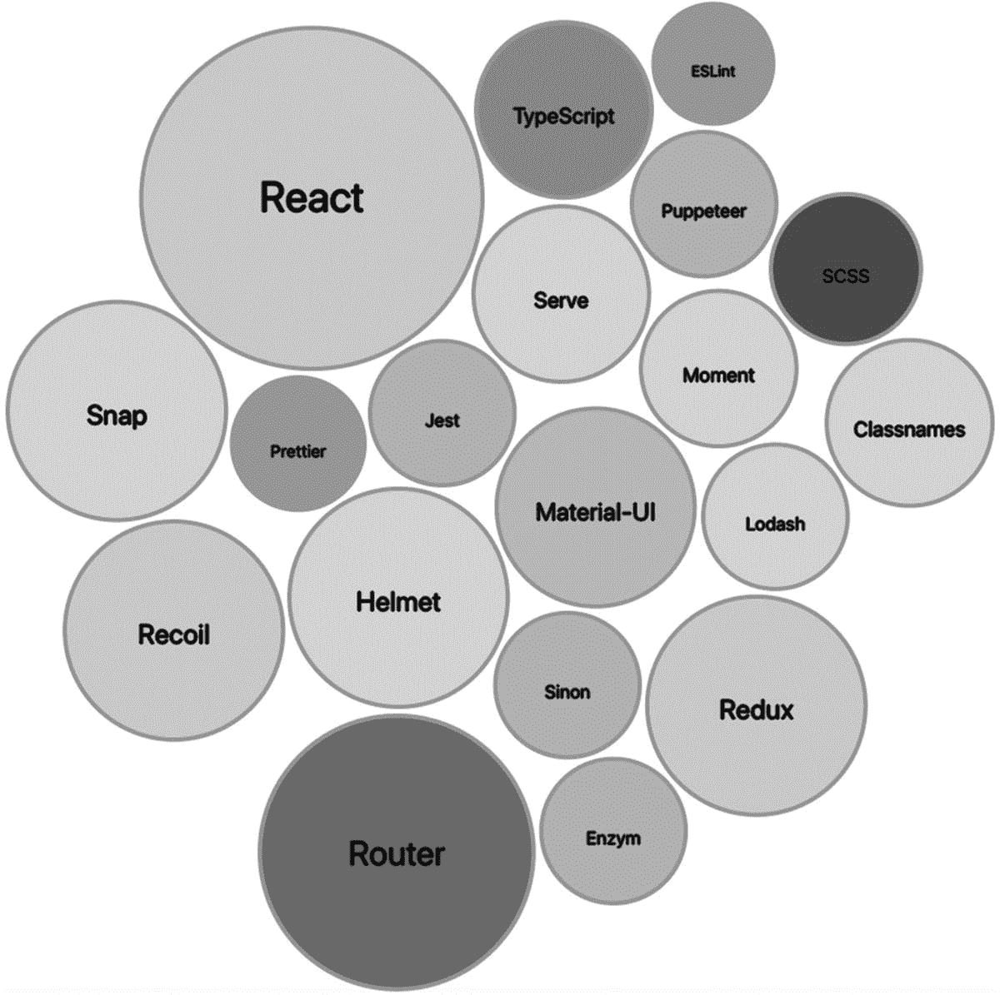
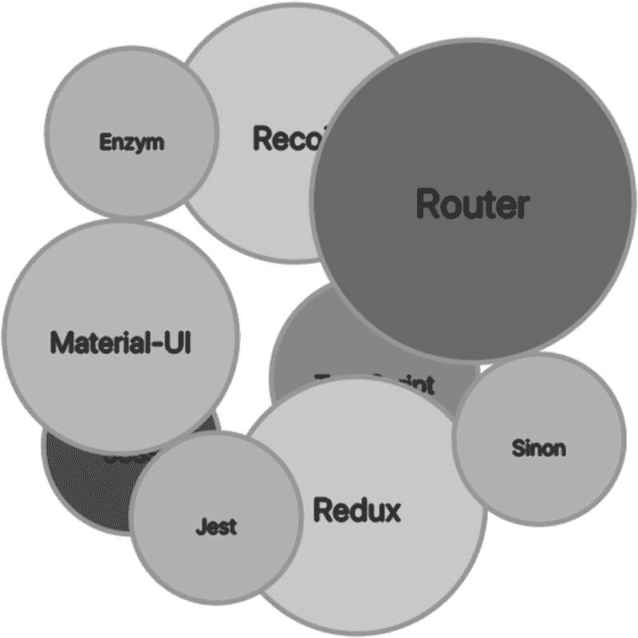
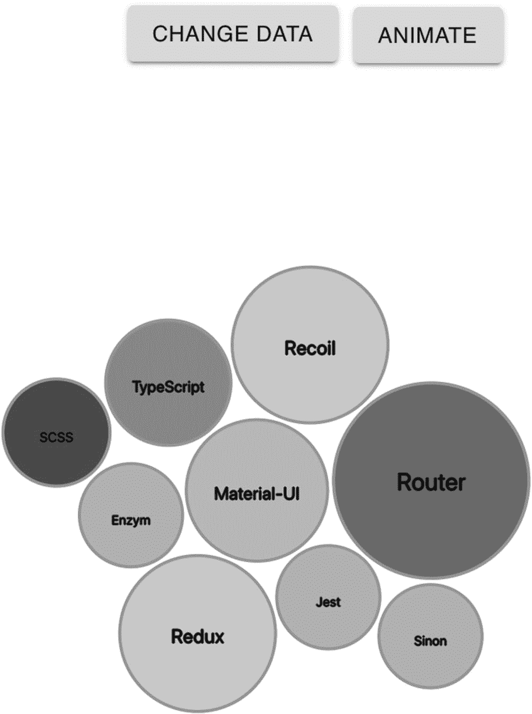

# 八、力图：第一部分

力定向图是一类以吸引人的方式在图中布置数据的算法。力图可用于机械弹簧行为、网络可视化、知识表示等。使用 React 和 D3 的组合是很棒的，因为每个库可以用于不同的事情。它给你最好的一切。将 TypeScript 作为类型检查器添加到组合中有助于确保类型得到良好的定义，并帮助您避免潜在的错误。太好了！

在这一章中，我将向你展示如何创建一个基本的力图，也就是一个带有动画的气泡图，它将迫使每个气泡向中心移动。

我们开始吧。

## 泡泡图

气泡图在二维图中显示多个圆圈(图 [8-1](#Fig1) )。气泡图是指出彼此相关的特定单词的理想方式。



图 8-1

气泡图的最终结果

## 我们将会建造什么？

在本章的这一节，我将向你展示如何使用 D3 和 React 创建一个带有机械弹簧行为的基本气泡图。对于数据提要，我将使用流行的固执己见的 React 库，这些库是每个开发人员工具箱中的必备工具。这些库在我的 *React 和库*一书中有更详细的介绍: [`https://www.apress.com/gp/book/9781484266953`](https://www.apress.com/gp/book/9781484266953) 。

## 家政

技术栈是固执己见的，在这一点上你应该很熟悉。以下是主要的移动部件:

*   React v17

*   以打字打的文件

*   D3 v6

*   我们将使用的其他库:Jest 和 Enzyme，react-uuid

我把这一章分成三步。

*   *第一步*:设置

*   *第二步*:气泡图创建

*   *第三步*:重绘

## 设置

建立一个新的 CRA 项目，并使用 MHL 模板项目将其命名为`bubble-chart`，就像我们在前面章节中所做的那样。

```jsx
$ yarn create react-app bubble-chart --template must-have-libraries
$ cd bubble-chart
$ yarn start // check http://localhost:3000

```

对于力量图，我将使用`d3-force`模块。不要忘记 TS 的类型。

```jsx
$ yarn add d3 @types/d3 d3-force @types/d3-force

```

最后，我将安装一个库来生成随机密钥；正如您所记得的，我们在前面的章节中也使用了这个库。

```jsx
$ yarn add react-uuid

```

## 气泡图组件

我们的气泡图组件包括以下内容:

*   `BubbleChart.scss`

*   `BubbleChart.test.tsx`

*   `BubbleChart.tsx`

*   `types.tsx`

在`generate-react-cli`的帮助下或自己动手，你可以随意创建它们。

要使用`generate-react-cli`和我为`d3`类预先填充的模板创建脚手架，使用以下命令:

```jsx
$ npx generate-react-cli component BubbleChart --type=d3class

```

### types.ts

为了保存我将在气泡图组件中使用的组件类型，我将创建一个 TS 类型文件。

在类型文件中，我将保存数据馈送以及我的力图需要的特定数据，这只是每个气泡的大小。

请注意，对于每个气泡，我都持有其名称、大小，甚至填充颜色。`ForceData`对象只是保存了 D3 需要的气泡大小。

```jsx
// src/component/BubbleChart/types.ts

export namespace Types {
  export type Data = {
    id: number
    name: string
    size: number
    fillColor: string
  }

  export type ForceData = {
    size: number
  }
}

```

气泡成分将包括 D3 功能以及 React 成分。让我们来看看完整的代码:

```jsx
// src/BubbleChart/BubbleChart.tsx
import React from 'react'
import * as d3 from 'd3'
import { Simulation, SimulationNodeDatum } from 'd3-force'
import './BubbleChart.scss'
import { Types } from './types'

const uuid = require('react-uuid')

class BubbleChart extends React.PureComponent<IBubbleChartProps, IBubbleChartState> {

  public forceData: Types.ForceData[]

  private simulation: Simulation<SimulationNodeDatum, undefined> | undefined

  constructor(props: IBubbleChartProps) {
    super(props)
    this.state = {
      data: [],
    }
    this.forceData = this.setForceData(props)
  }

  componentDidMount() {
    this.animateBubbles()
  }

  setForceData = ( props: IBubbleChartProps ) => {
    const d = []
    for (let i= 0; i < props.bubblesData.length; i++) {
      d.push({ 'size': props.bubblesData[i].size })
    }
    return d
  }

  animateBubbles = () => {
    if (this.props.bubblesData.length > 0) {
      this.simulatePositions(this.forceData)
    }
  }

  radiusScale = (value: d3.NumberValue) => {
    const fx = d3.scaleSqrt().range([1, 50]).domain([this.props.minValue, this.props.maxValue])
    return fx(value)
  }

  simulatePositions = (data: Types.ForceData[]) => {
    this.simulation = d3
      .forceSimulation()
      .nodes(data as SimulationNodeDatum[])
      .velocityDecay(0.05)
      .force('x', d3.forceX().strength(0.2))
      .force('y', d3.forceY().strength(0.2))
      .force(
        'collide',
        d3.forceCollide((d: SimulationNodeDatum) => {
          return this.radiusScale((d as Types.ForceData).size) + 2
        })
      )
      .on('tick', () => {
        this.setState({ data })
      })
  }

  renderBubbles = (data: []) => {

    return data.map((item: { v: number; x: number; y: number }, index) => {
      const { props } = this
      const fontSize = this.radiusScale((item as unknown as Types.ForceData).size) / 4
      const content = props.bubblesData.length > index ? props.bubblesData[index].name : ''
      const strokeColor = props.bubblesData.length > index ? 'darkgrey' : this.props.backgroundColor
      return (
        <g key={`g-${uuid()}`} transform={`translate(${props.width / 2 + item.x - 70}, ${props.height / 2 + item.y})`}>
          <circle
            style={{ cursor: 'pointer' }}
            onClick={() => {
              this.props.selectedCircle(content)
            }}
            id="circleSvg"
            r={this.radiusScale((item as unknown as Types.ForceData).size)}
            fill={props.bubblesData[index].fillColor}
            stroke={strokeColor}
            strokeWidth="2"
          />
          <text
            onClick={() => {
              this.props.selectedCircle(content)
            }}
            dy="6"
            className="bubbleText"
            fill={this.props.textFillColor}
            textAnchor="middle"
            fontSize={`${fontSize}px`}
            fontWeight="normal"
          >
            {content}
          </text>
        </g>
      )
    })
  }

  render() {
    return (
      <div>
        <div id="chart" style={{ background: this.props.backgroundColor, cursor: 'pointer' }}>
          <svg width={this.props.width} height={this.props.height}>
            {this.renderBubbles(this.state.data as [])}
          </svg>
        </div>
      </div>
    )
  }
}

interface IBubbleChartProps {

  bubblesData: Types.Data[]
  width: number
  height: number
  backgroundColor: string
  textFillColor: string
  minValue: number
  maxValue: number
  selectedCircle: (content: string) => void
}

interface IBubbleChartState {
  data: Types.ForceData[]
}

export default BubbleChart

```

让我们回顾一下代码。`import`语句包括`d3-force`、样式文件和 ts 类型。

```jsx
// src/BubbleChart/BubbleChart.tsx

import React from 'react'
import * as d3 from 'd3'
import { Simulation, SimulationNodeDatum } from 'd3-force'
import './BubbleChart.scss'
import { Types } from './types'

const uuid = require('react-uuid')

```

对于类签名，我正在设置`props`和状态接口，以及一个包含我需要的所有属性的气泡数据对象。

```jsx
interface IBubbleChartProps {
  bubblesData: Types.Data[]
  width: number
  height: number
  backgroundColor: string
  textFillColor: string
  minValue: number
  maxValue: number
  selectedCircle: (content: string) => void
}

interface IBubbleChartState {
  data: Types.ForceData[]
}

```

在前两章中，我们使用了一个函数组件。这一次，我想向您展示您可以用类组件做同样的事情。至于类签名，最好使用`PureComponent`并包含`props`和状态，而不是`React.Component`。

```jsx
class BubbleChart extends React.PureComponent<IBubbleChartProps, IBubbleChartState> {

```

我将克隆我的数据，因为我正在喂养 D3。D3 获取数据，并通过添加属性来扩展它。React `props`和 state 变量不应该扩展到包括 D3 可能需要的其他字段，一种方法是克隆数据。

```jsx
public forceData: Types.ForceData[]

```

当涉及到气泡的力动画模拟时，我将它设置为一个私有成员，我可以在我的组件中访问它。

如果您想知道我是如何知道模拟 TS 类型的，我必须深入 D3 代码才能找到类型。这种复杂性是值得努力的，因为我在整个代码中都进行了类型检查。付出的代价并不大。

```jsx
private simulation: Simulation<SimulationNodeDatum, undefined> | undefined

```

我的构造函数将设置`props`和状态，以及创建我的状态变量的方法。

我设置一个状态变量而不是使用来自`props`的数据对象的原因是，图表气泡需要的数据变量包括其他属性，如 x，y 位置，所以最好创建第二个对象，而不是试图在属性数据上设置它。`forceData`将保存我可以用来生成气泡的每个气泡的大小。`setForceData`方法将遍历属性数据来提取每个气泡的大小。

```jsx
constructor(props: IBubbleChartProps) {
  super(props)
  this.state = {
    data: [],
  }
  this.forceData = this.setForceData(props)
}

```

一旦组件安装完毕(`componentDidMount`)，我将通过调用`animateBubbles`使用 D3 力制作气泡动画。

我设置的`setForceData`方法是为了克隆 D3 所需的大小字段。

```jsx
componentDidMount() {
  this.animateBubbles()
}setForceData = ( props: IBubbleChartProps ) => {
  const d = []
  for (let i= 0; i < props.bubblesData.length; i++) {
    d.push({ 'size': props.bubblesData[i].size })
  }
  return d
}

animateBubbles = () => {
  if (this.props.bubblesData.length > 0) {
    this.simulatePositions(this.forceData)
  }
}

```

`radiusScale`函数将采用`d3.scaleSqrt`并根据我们将提供的最小和最大`props`缩小比例。

如果需要，您可以包含逻辑来处理气泡大小的不同用例。这将使代码更加复杂，所以我们不打算在这里这样做。

```jsx
radiusScale = (value: d3.NumberValue) => {
  const fx = d3.scaleSqrt().range([1, 50]).domain([this.props.minValue, this.props.maxValue])
  return fx(value)
}

```

`simulatePosition`方法就是做繁重的工作。D3 力模块进行速度计算；`https://github.com/d3/d3-force`见。

我可以用力量法调整力量。一旦更改生效，我就可以将它与组件状态联系起来。看一看:

```jsx
simulatePositions = (data: Types.ForceData[]) => {
  this.simulation = d3
    .forceSimulation()
    .nodes(data as SimulationNodeDatum[])
    .velocityDecay(0.05)
    .force('x', d3.forceX().strength(0.2))
    .force('y', d3.forceY().strength(0.2))
    .force(
      'collide',
      d3.forceCollide((d: SimulationNodeDatum) => {
        return this.radiusScale((d as Types.ForceData).size) + 2
      })
    )
    .on('tick', () => {
      this.setState({ data })
    })
}

```

Note

这些`strength`、`velocity`和`collide`设置可以作为`props`移动。小变化会让动画和视觉效果发生大变化。

为了渲染气泡，我可以使用 D3，但是 React 更适合这项工作，因为它有 VDOM，代码也更容易阅读。

Note

和前几章一样，我使用`uuid`库给每个组的 SVG 一个键。你可以自己随机生成一个密钥，但这是我最喜欢的生成密钥的方式。

我使用地图来遍历结果，然后渲染结果。我正在生成气泡和文本。这些结果是可点击的，并且将向用户提供用户点击的气泡的名称。函数`renderBubbles`返回 JSX 代码，可以在我们的类返回方法中使用。

```jsx
renderBubbles = (data: []) => {
  return data.map((item: { v: number; x: number; y: number }, index) => {
    const { props } = this
    const fontSize = this.radiusScale((item as unknown as Types.ForceData).size) / 4
    const content = props.bubblesData.length > index ? props.bubblesData[index].name : ''
    const strokeColor = props.bubblesData.length > index ? 'darkgrey' : this.props.backgroundColor
    return (
      <g key={`g-${uuid()}`} transform={`translate(${props.width / 2 + item.x - 70}, ${props.height / 2 + item.y})`}>
        <circle
          style={{ cursor: 'pointer' }}
          onClick={() => {
            this.props.selectedCircle(content)
          }}
          id="circleSvg"
          r={this.radiusScale((item as unknown as Types.ForceData).size)}
          fill={props.bubblesData[index].fillColor}
          stroke={strokeColor}
          strokeWidth="2"
        />
        <text
          onClick={() => {
            this.props.selectedCircle(content)
          }}
          dy="6"
          className="bubbleText"
          fill={this.props.textFillColor}
          textAnchor="middle"
          fontSize={`${fontSize}px`}
          fontWeight="normal"
        >
          {content}
        </text>
      </g>
    )
  })
}

```

在 render 方法中，我们设置了一个`div`和`svg`包装器，并包含了将返回气泡内容的`renderBubbles`方法。注意，因为我们允许用户点击每个圆圈并获得结果，所以我们将光标设置为整个`div`的指针。

```jsx
render() {
    return (
      <div>
        <div id="chart" style={{ background: this.props.backgroundColor, cursor: 'pointer' }}>
          <svg width={this.props.width} height={this.props.height}>
            {this.renderBubbles(this.state.data as [])}
          </svg>
        </div>
      </div>
    )
  }
}

```

### bubblechart . scss

对于气泡图的 SCSS 风格文件，我将每个气泡内的文本设置为深灰色阴影，这样更容易阅读文本标签。

```jsx
.bubbleText {
  text-shadow: 1px 0 0 darkslategrey, 0 1px 0 darkslategrey, -1px 0 0 darkslategrey, 0 -1px 0 darkslategrey;
}

```

### App.tsx

为了实现这个文件，我将在`App.tsx`文件中包含气泡图组件。

我将数据设置为一个数组。数组的类型将是我在 bubble 组件中定义的类型，并将保存气泡的名称、大小和填充颜色。

这可以很容易地提取为 CSV 或 JSON 文件，如果需要，可以使用反冲在多个组件之间共享数据。正如我们在前面几章中所做的那样，我们将在本章的下一节创建第二张力图时这样做。

至于`BubbleChart`，我会通过我在 bubble 组件中设置的可视化设置。看一看:

```jsx
// src/App.tsx

import React from 'react'
import './App.scss'
import BubbleChart from './components/BubbleChart/BubbleChart'
import { Types } from './components/BubbleChart/types'

function App() {

  const d: Types.Data[] = [
    { id: 1, name: 'React', size: 350, fillColor: '#D3D3D3' },
    { id: 2, name: 'TypeScript', size: 100, fillColor: '#9d9a9f' },
    { id: 3, name: 'SCSS', size: 75, fillColor: '#605f62' },
    { id: 4, name: 'Recoil', size: 150, fillColor: '#D3D3D3' },
    { id: 5, name: 'Redux', size: 150, fillColor: '#D3D3D3' },
    { id: 6, name: 'Material-UI', size: 125, fillColor: '#c6c5c6' },
    { id: 7, name: 'Router', size: 230, fillColor: '#808080' },
    { id: 8, name: 'Jest', size: 70, fillColor: '#C0C0C0' },
    { id: 9, name: 'Enzym', size: 70, fillColor: '#C0C0C0' },
    { id: 10, name: 'Sinon', size: 70, fillColor: '#C0C0C0' },
    { id: 11, name: 'Puppeteer', size: 70, fillColor: '#C0C0C0' },
    { id: 12, name: 'ESLint', size: 50, fillColor: '#A9A9A9' },
    { id: 13, name: 'Prettier', size: 60, fillColor: '#A9A9A9' },
    { id: 14, name: 'Lodash', size: 70, fillColor: '#DCDCDC' },
    { id: 15, name: 'Moment', size: 80, fillColor: '#DCDCDC' },
    { id: 16, name: 'Classnames', size: 90, fillColor: '#DCDCDC' },
    { id: 17, name: 'Serve', size: 100, fillColor: '#DCDCDC' },
    { id: 18, name: 'Snap', size: 150, fillColor: '#DCDCDC' },
    { id: 19, name: 'Helmet', size: 150, fillColor: '#DCDCDC' },
  ]

  const [data, setData] = React.useState<Types.Data[]>(d.slice(1, 10))

  const selectedKeyHandler = (key: string) => {
    alert(key)
  }

  return (

    <div className="App">
      <header className="App-header">
        <BubbleChart bubblesData={data} width={800} height={600} textFillColor="drakgrey" backgroundColor="#ffffff" minValue={1} maxValue={150} selectedCircle={selectedKeyHandler} />
      </header>
    </div>
  )
}

export default App

```

注意，我们有一个函数，`BubbleChart`可以调用它来通过循环`selectedKeyHandler`，我们将调用一个警报。

### app . scss

对于 app 风格，一切照旧；我只是将背景色从默认的深色改为白色，这样图表在本书的印刷版本中会显示得更好。

```jsx
.App-header {
  background-color: #ffffff;
  min-height: 100vh;
  display: flex;
  flex-direction: column;
  align-items: center;
  justify-content: center;
  font-size: calc(10px + 2vmin);
  color: white;
}

```

## 节目质量监视

现在我们运行`format`、`lint`和`test`。我们应该得到一切都好的明确确认。这是我确保代码质量的标准做法，就像我们在前面章节中所做的那样。

```jsx
$ yarn format && yarn lint

```

对于测试文件，测试模板文件为我们创造了一切；我们只需要实现组件`props`。

```jsx
// src/component/BubbleChart/BubbleChart.test.tsx

        <BubbleChart bubblesData={[]} width={800} height={600} textFillColor="drakgrey" backgroundColor="#ffffff" minValue={1} maxValue={150} selectedCircle={Function} />
      </RecoilRoot>

```

我们现在可以运行测试。

```jsx
$ yarn test

```

如果你查看我们组件的当前状态(图 [8-2](#Fig2) ，你可以看到气泡正在渲染，每个气泡都是可点击的，一旦点击库名，就会给你一个警告。但是，气泡互相覆盖，并且此时没有激活。



图 8-2

没有动画的 BubbleChart

## 重画并制作动画

现在我们已经有了气泡图，下一步是添加代码，这样我们就可以成功地重新绘制气泡图，并提供动画和更好地显示它们。我们需要能够在数据发生变化的情况下重新绘制。

要进行这些更改，复制`BubbleChart.tsx`组件，创建一个新文件，并将其命名为`BubbleChartWithAnimation.tsx`。

### BubbleChartWithAnimation.tsx

为了制作动画并支持数据的更改，我们可以利用 React `componentDidUpdate`类组件生命周期。一旦组件基于数据更改进行了更新，我们就可以用新的数据集更新气泡图。为了检查数据是否改变，我们可以使用`JSON.stringify`来创建数据的克隆，并将`prevProps`数据与新的`props`数据进行比较。如果数据改变了，设置新的`forceData`作为数据，并制作气泡动画。

Note

我只展示了`BubbleChart.tsx`和`BubbleChartWithAnimation.tsx`之间的变化。

首先，实现`componentDidUpdate`。

```jsx
// src/component/BubbleChart/BubbleChartWithAnimation.tsx

componentDidUpdate(prevProps: IBubbleChartProps, prevState: IBubbleChartState) {
  if (JSON.stringify(prevProps.bubblesData) !== JSON.stringify(this.props.bubblesData)) {
    this.forceData = this.setForceData(this.props)
    this.animateBubbles()
  }
}

```

为了使泡沫复活，一切都在那里；我需要做的就是添加一个按钮(我使用的是 Material-UI)并设置 click 事件处理程序来使用我已经有的`animateBubbles()`方法。我正在使用粗箭头内联函数，所以我不需要绑定我的处理程序。

```jsx
import { Button } from '@material-ui/core'render()

    return (
      <div>
        <Button
          className="buttonFixed"
          variant="contained"
          color="default"
          onClick={() => {

            this.animateBubbles()
          }}
        >
          Animate
        </Button>
           ...
      </div>
    )
  }
}

```

### App.tsx 更新

对于父组件，让我们添加一个按钮来更新数据。我能做的是随机排序我的数组数据，这样气泡图将模拟数据的变化。突出显示`App.tsx`的变化。

Note

我只显示了以前的`App.tsx`文件的变化。

```jsx
// src/App.tsx
import { Button } from '@material-ui/core'
const changeData = () => {
  setData(d.sort(() => Math.random() - 0.5))
}
return (
    <div className="App">
      <header className="App-header">
        <Button
          className="appButtonFixed"
          variant="contained"
          color="default"
          onClick={() => {
            changeData()
          }}
        >
          Change data
        </Button>
        <BubbleChartWithAnimation bubblesData={data} width={800} height={600} textFillColor="drakgrey" backgroundColor="#ffffff" minValue={1} maxValue={150} selectedCircle={selectedKeyHandler} />
      </header>
    </div>
  )

```

### App.scss 更新

对于`App.scss`，我将为我的按钮添加样式，使其位于屏幕顶部的固定位置。

```jsx
.appButtonFixed {
  position: fixed;
  left: -100px;
  top: 60px;
}

```

看一下图 [8-3](#Fig3) 中的最终结果。一旦我单击了 change data 按钮，数据就会发生变化，组件就会变成动画。

此外，当我使用气泡图中的动画按钮时，我可以看到我的气泡重新动画，正如预期的那样。



图 8-3

重绘气泡图

您可以从这里下载完整的项目:

[T2`https://github.com/Apress/integrating-d3.js-with-react/tree/main/ch08/bubble-chart`](https://github.com/Apress/integrating-d3.js-with-react/tree/main/ch08/bubble-chart)

## 摘要

在这一章中，我向你展示了如何使用 React、D3 和 TypeScript 构建一个简单的气泡图。

我们能够创建自己的组件，并使用 React 来帮助管理状态，并在需要时更新和重绘 DOM。

这种架构设计吸收了所有领域的精华:D3 的模块库让我们可以讲故事，React 虚拟 DOM 确保页面只在发生变化时才呈现。

在下一章，我将向你展示如何创建一个更复杂的网络力图的例子，使用我在本章和前几章中介绍的工具。