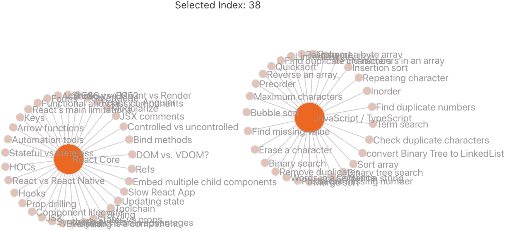
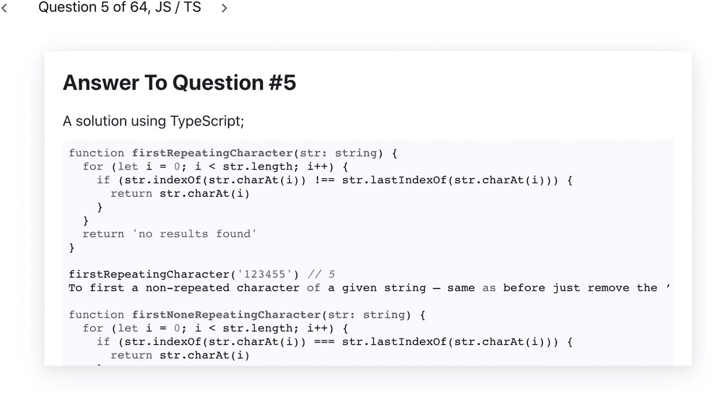

# 九、力图：第二部分

在这一章中，我将向你展示如何创建一个网络图(强制定向图)。我们将创建一个带有机械弹簧行为的网络可视化图表，来表示您可能希望在下一次 React 工作面试之前回顾的面试问题。我们开始吧。

## 力定向图

力定向图通常用于显示节点之间的关系。

## 我们将会建造什么？

图 [9-1](#Fig1) 显示最终结果； [`https://elielrom.com/ReactQuestions`亦见](https://elielrom.com/ReactQuestions)。



图 9-1

简单力图最终结果

## 家政

我把这一小节分成了三个步骤。

*   *第一步*:设置

*   *第二步*:力图创建

*   *步骤 3* :反冲部件创建

我们开始吧。

## 设置

创建新项目。

```jsx
$ yarn create react-app force-chart --template must-have-libraries

```

安装我们在前一个项目中安装的相同的库。

```jsx
$ yarn add d3 @types/d3 d3-force @types/d3-force react-uuid

```

## 力图组件

对于数据馈送，我将使用 top React 和打字稿面试问题和答案。

就结构而言，数据馈送由节点和链接组成。我把数据文件放在这里:`/public/data/power_network.json`。看一看它:

```jsx
/public/data/power_network.json
{
  "results": [
    {
      "nodes": [
        {
          "name": "JavaScript / TypeScript",
          "radiusSize": 20,
          "fillColor": "#fa6502"
        }
      ],
      "links": [
        {
          "source": "Erase a character",
          "target": "JavaScript / TypeScript",
          "value": "How would you erase a character from a string?"
        }
      ]
    }
  ]
}

```

### types.ts

类型文件将保存我将用于`SimpleForceGraph`的所有 TS 类型。

*   这些是我们在数据馈送中设置的节点。

*   这些是我们在数据馈送中设置的链接。

*   `dataObject`:数据对象包括节点和链接。

*   `Point`:这代表一个 x 和一个 y。

*   `Datum`:这是 D3 的内部数据。

看一下代码:

```jsx
// src/component/SimpleForceGraph/types.ts

export namespace Types {
  export type node = {
    name: string
    group: number
    radiusSize: number
    fillColor: string
  }
  export type link = {
    source: string
    target: string
    value: string
  }
  export type dataObject = {
    nodes: node[]
    links: link[]
  }
  export type point = {
    x: number
    y: number
  }
  export type datum = {
    x: number
    y: number
    fx: number | null
    fy: number | null
  }
}

```

## 图形子组件

为了表示图中的元素，我可以用 D3 画出所有的东西。然而，混合使用 D3 和 React 更适合这项工作，因为 React 可读性更好，并且具有内置逻辑，只在刷新时更新 DOM 和样式。

该图由多个圆圈、链接和标签组成。我将把这些元素分解成相应的文件。

*   *Circles.tsx 和 Circle.tsx* :用于圆的元素

*   *Links.tsx 和 Link.tsx* :用于 Link(节点间的连线)元素

*   *Labels.tsx 和 Label.tsx* :每个节点的文本标签

### Circles.tsx 和 Circle.tsx

我将创建一个包含所有节点的组件。每个节点将被表示为一个圆，但是这可以被改变为我们喜欢的任何形状。

#### Circles.tsx

我将创建一个包含所有节点的组件。每个节点将被表示为一个圆，但是如果你愿意，这可以被改变为其他的东西。

为了实现这一点，我将传递节点数据以及`restartDrag`和`stopDrag`方法，这样我的父组件就可以告诉何时停止这种交互。我宁愿让我的父组件知道发生了什么，以防我需要添加额外的逻辑。看一下完整的代码:

```jsx
// src/component/SimpleForceGraph/Circles.tsx
import * as React from 'react'
import * as d3 from 'd3'
import { D3DragEvent } from 'd3'
import Circle from './Circle'
import { Types } from './types'

const uuid = require('react-uuid')

export default class Circles extends React.PureComponent<ICirclesProps, {}> {
  componentDidMount() {
    this.setMouseEventsListeners()
  }

  componentDidUpdate(prevProps: ICirclesProps) {}

  setMouseEventsListeners = () => {
    const { props } = this
    d3.selectAll('.node')
      // @ts-ignore
      .call(d3.drag<SVGCircleElement, Types.datum>().on('start', onDragStart).on('drag', onDrag).on('end', onDragEnd))

    // @ts-ignore
    function onDragStart(event: D3DragEvent<SVGCircleElement>, d: Types.datum) {
      if (!event.active) {
        props.restartDrag()
      }
      // eslint-disable-next-line no-param-reassign
      d.fx = d.x
      // eslint-disable-next-line no-param-reassign
      d.fy = d.y
    }

    function onDrag(event: D3DragEvent<SVGCircleElement, never, never>, d: Types.datum) {
      // eslint-disable-next-line no-param-reassign
      d.fx = event.x
      // eslint-disable-next-line no-param-reassign
      d.fy = event.y
    }

    function onDragEnd(event: D3DragEvent<SVGCircleElement, never, never>, d: Types.datum) {
      if (!event.active) {
        props.stopDrag()
      }
      // eslint-disable-next-line no-param-reassign
      d.fx = null
      // eslint-disable-next-line no-param-reassign
      d.fy = null
    }
  }

  render() {
    const nodes = this.props.nodes.map((node: Types.node) => {
      return <Circle key={`node-${uuid()}`} node={node} />
    })
    return <g className="nodes">{nodes}</g>
  }
}

interface ICirclesProps {
  nodes: Types.node[]
  restartDrag: () => void
  stopDrag: () => void
}

```

注意，对于鼠标事件处理程序，我使用了 D3 拖动事件，并为 D3 设置了新的 x 和 y。有一个事件需要改变。

```jsx
  setMouseEventsListeners = () => {
    const { props } = this
    d3.selectAll('.node')
      .call(d3.drag<SVGCircleElement, Types.datum>().on('start', onDragStart).on('drag', onDrag).on('end', onDragEnd))

    function onDragStart(event: D3DragEvent<SVGCircleElement>, d: Types.datum) {
      if (!event.active) {

        props.restartDrag()
      }
      d.fx = d.x
      d.fy = d.y
    }

    function onDrag(event: D3DragEvent<SVGCircleElement, never, never>, d: Types.datum) {
      d.fx = event.x
      d.fy = event.y
    }

    function onDragEnd(event: D3DragEvent<SVGCircleElement, never, never>, d: Types.datum) {
      if (!event.active) {
        props.stopDrag()
      }
      d.fx = null
      d.fy = null
    }
  }

```

对于 render 方法，我将通过数据映射来绘制每个节点，并为每个节点设置一个唯一的键，以便 React 执行 VDOM，从而知道哪个元素需要更新才能使 React 执行得更好。

```jsx
  render() {
    const nodes = this.props.nodes.map((node: Types.node) => {
      return <Circle key={`node-${uuid()}`} node={node} />
    })
    return <g className="nodes">{nodes}</g>
  }
}

```

#### Circle.tsx

对于每个节点，我使用一个引用(`ref`)，一旦节点被挂载，我将使用节点数据中的数据来填充和设置每个节点的颜色和大小。

```jsx
// src/component/SimpleForceGraph/Circle.tsx

import * as React from 'react'
import * as d3 from 'd3'
import { Types } from './types'

export default class Circle extends React.Component<{ node: Types.node }> {
  ref: SVGCircleElement | undefined

  componentDidMount() {
    if (this.ref) d3.select(this.ref).data([this.props.node])
  }

  render() {
    return (
      // eslint-disable-next-line no-return-assign
      <circle className="node" r={this.props.node.radiusSize} fill={this.props.node.fillColor as string} ref={(ref: SVGCircleElement) => (this.ref = ref)}>
        <title>{this.props.node.name}</title>
      </circle>
    )
  }
}

```

### Links.tsx 和 Link.tsx

对于链接(每个节点之间的线路)，我遵循为节点设置的相同体系结构。我创建一个 links 子组件，附加事件，并映射每个项目来绘制每个链接。

#### Links.tsx

注意，因为我只需要我的`props`的链接数据，所以我只是在签名中设置它，而不是创建一个`props`接口。

在渲染时，我通过数据映射来绘制每个链接。

```jsx
// src/component/SimpleForceGraph/Links.tsx

import * as React from 'react'
import Link from './Link'
import { Types } from './types'

const uuid = require('react-uuid')

export default class Links extends React.PureComponent<{ links: Types.link[] }> {
  render() {
    const links = this.props.links.map((link: Types.link) => {
      return <Link key={`links-${uuid()}`} link={link} />
    })
    return <g className="links">{links}</g>
  }

}

```

链接本身为每个映射的项目调用`link.tsx`组件，以保持代码整洁。

#### Link.tsx

每个链接都用一个 SVG 线路径(线)来表示。我还放置事件，并在鼠标悬停事件上显示数据。看看完整的`Link.tsx`代码:

```jsx
// src/component/SimpleForceGraph/Link.tsx
import * as React from 'react'
import * as d3 from 'd3'
import { Types } from './types'

export default class Link extends React.PureComponent<ILinkProps> {
  ref: SVGElement | undefined

  componentDidMount() {
    if (this.ref) d3.select(this.ref).data([this.props.link])
  }

  // eslint-disable-next-line class-methods-use-this
  onMouseOverHandler(event: React.MouseEvent<SVGLineElement, MouseEvent>, link: ILinkProps) {
    d3.select('.linkGroup')
      .append('text')
      .attr('class', 'linkTextValue')
      .text((link.link.value as string).replace(/(.{50})..+/, '$1…'))
      .attr('x', event.nativeEvent.offsetX)
      .attr('y', event.nativeEvent.offsetY)
  }

  // eslint-disable-next-line class-methods-use-this
  onMouseOutHandler() {
    d3.select('.linkTextValue').remove()
  }

  render() {
    return (
      <g className="linkGroup">
        <line
          // eslint-disable-next-line no-return-assign
          ref={(ref: SVGLineElement) => (this.ref = ref)}
          className="link"
          onMouseOver={(event) => {
            this.onMouseOverHandler(event, this.props)
          }}
          onMouseOut={(event) => {
            this.onMouseOutHandler()
          }}
        />
      </g>
    )
  }
}

interface ILinkProps {
  link: Types.link
}

```

注意，在 mouseover 事件中，我使用 D3 选择 link group 元素并添加文本副本。

```jsx
  onMouseOverHandler(event: React.MouseEvent<SVGLineElement, MouseEvent>, link: ILinkProps) {
    d3.select('.linkGroup')
      .append('text')
      .attr('class', 'linkTextValue')
      .text((link.link.value as string).replace(/(.{50})..+/, '$1...'))
      .attr('x', event.nativeEvent.offsetX)
      .attr('y', event.nativeEvent.offsetY)
  }

```

鼠标离开时，我使用 D3 删除文本。

```jsx
  onMouseOutHandler() {
    d3.select('.linkTextValue').remove()
  }

```

呈现包括 SVG 组和事件行。

```jsx
      <g className="linkGroup">
        <line
          ref={(ref: SVGLineElement) => (this.ref = ref)}
          className="link"
          onMouseOver={(event) => {
            this.onMouseOverHandler(event, this.props)
          }}
          onMouseOut={(event) => {
            this.onMouseOutHandler()
          }}
        />
      </g>

```

### Labels.tsx 和 Label.tsx

对于标签，我可以遵循与呈现节点和链接相同的过程。

#### Labels.tsx

标签将迭代每个节点的所有标签。接口将是节点，我还设置了一个选定的节点调度程序来将数据传递回父图。

```jsx
// src/component/SimpleForceGraph/Labels.tsx
import * as React from 'react'
import { Dispatch, SetStateAction } from 'react'
import Label from './Label'
import { Types } from './types'

const uuid = require('react-uuid')

export default class Labels extends React.PureComponent<ILabelsProps> {
  render() {
    const labels = this.props.nodes.map((node: Types.node) => {
      return <Label key={`label-${uuid()}`} node={node} onNodeSelected={this.props.onNodeSelected} />
    })
    return <g className="labels">{labels}</g>
  }
}

interface ILabelsProps {
  nodes: Types.node[]
  onNodeSelected: Dispatch<SetStateAction<number>>
}

```

请注意，我通过映射数组来创建每个标签。

```jsx
<Label key={`label-${uuid()}`} node={node} onNodeSelected={this.props.onNodeSelected} />

```

#### Label.tsx

对于每个标签，我需要节点数据和 dispatcher 来指示所选择的标签。

Note

这段代码可以改为使用上下文，而不是我在这里做的`props`演练，但是我想让代码保持简单。请随意重构它。

```jsx
import * as React from 'react'
import * as d3 from 'd3'
import { Dispatch, SetStateAction } from 'react'
import { Types } from './types'

export default class Label extends React.PureComponent<ILabelProps> {
  ref: SVGTextElement | undefined

  componentDidMount() {
    if (this.ref) d3.select(this.ref).data([this.props.node])
  }

  render() {

    return (
      <text
        style={{ cursor: 'pointer' }}
        className="label"
        // eslint-disable-next-line no-return-assign
        ref={(ref: SVGTextElement) => (this.ref = ref)}
        onClick={() => {
          this.props.onNodeSelected(((this.props.node as unknown) as { index: number }).index - 1)
        }}
      >
        {this.props.node.name}
      </text>
    )
  }
}

interface ILabelProps {
  node: Types.node
  onNodeSelected: Dispatch<SetStateAction<number>>
}

```

## simple force graph . tsx-简单力图. tsx

简单的力图顾名思义将是主要的图形组件。

就接口而言，我将展示对齐的属性，如宽度、高度、距离、链接强度和居中。

此外，数据将从父组件传递，最后，我将传递一个函数，以便在用户选择一个节点时传递数据。以下是完整的代码:

```jsx
// src/component/SimpleForceGraph/SimpleForceGraph.tsx
import * as React from 'react'
import * as d3 from 'd3'
import './SimpleForceGraph.scss'
import { Simulation, SimulationNodeDatum } from 'd3-force'
import { Dispatch, SetStateAction } from 'react'
import Links from './Links'
import Circles from './Circles'
import Labels from './Labels'
import { Types } from './types'

class SimpleForceGraph extends React.PureComponent<ITopContentPowerChartProps, ITopContentPowerChartState> {

  private simulation: Simulation<SimulationNodeDatum, undefined> | undefined

  constructor(props: ITopContentPowerChartProps) {
    super(props)
    this.state = {
      // EE: the clone data is needed to avoid:
      // TypeError: Cannot add property index, object is not extensible
      clonedData: JSON.parse(JSON.stringify(this.props.data)),
    }
  }

  componentDidMount() {
    this.simulatePositions()
    this.drawTicks()
    this.addZoomCapabilities()
  }

  componentDidUpdate(prevProps: ITopContentPowerChartProps, prevState: ITopContentPowerChartState) {
    this.simulatePositions()
    this.drawTicks()
  }

  simulatePositions = () => {
    this.simulation = d3
      .forceSimulation()
      .nodes(this.state.clonedData?.nodes as SimulationNodeDatum[])
      .force(
        'link',
        d3
          .forceLink()
          .id((d) => {
            return (d as Types.node).name
          })
          .distance(this.props.linkDistance)
          .strength(this.props.linkStrength)
      )
      .force('charge', d3.forceManyBody().strength(this.props.chargeStrength))
      .force('center', d3.forceCenter(this.props.centerWidth, this.props.centerHeight))

    // @ts-ignore
    this.simulation.force('link').links(this.state.clonedData?.links)
  }

  drawTicks = () => {
    const nodes = d3.selectAll('.node')
    const links = d3.selectAll('.link')
    const labels = d3.selectAll('.label')

    if (this.simulation) {
      this.simulation.nodes(this.state.clonedData?.nodes as SimulationNodeDatum[]).on('tick', onTickHandler)
    }

    function onTickHandler() {
      links
        .attr('x1', (d) => {
          return (d as { source: Types.point }).source.x
        })
        .attr('y1', (d) => {
          return (d as { source: Types.point }).source.y
        })
        .attr('x2', (d) => {
          return (d as { target: Types.point }).target.x
        })
        .attr('y2', (d) => {
          return (d as { target: Types.point }).target.y
        })
      nodes
        .attr('cx', (d) => {
          return (d as Types.point).x
        })
        .attr('cy', (d) => {
          return (d as Types.point).y
        })
      labels
        .attr('x', (d) => {
          return (d as Types.point).x + 5
        })
        .attr('y', (d) => {
          return (d as Types.point).y + 5
        })
    }
  }

  addZoomCapabilities = () => {
    const container = d3.select('.container')
    const zoom = d3
      .zoom()
      .scaleExtent([1, 8])
      .translateExtent([

        [100, 100],
        [300, 300],
      ])
      .extent([
        [100, 100],
        [200, 200],
      ])
      .on('zoom', (event) => {
        let { x, y, k } = event.transform
        x = 0
        y = 0
        k *= 1
        container.attr('transform', `translate(${x}, ${y})scale(${k})`).attr('width', this.props.width).attr('height', this.props.height)
      })

    // @ts-ignore
    container.call(zoom)
  }

  restartDrag = () => {
    if (this.simulation) this.simulation.alphaTarget(0.2).restart()
  }

  stopDrag = () => {
    if (this.simulation) this.simulation.alphaTarget(0)
  }

  render() {
    if (JSON.stringify(this.props.data) !== JSON.stringify(this.state.clonedData)) {
      this.setState({
        clonedData: JSON.parse(JSON.stringify(this.props.data)),
      })
    }
    const initialScale = 1
    const initialTranslate = [0, 0]
    const { width, height } = this.props
    return (
      <svg className="container" x={0} y={0} width={width} height={height} transform={`translate(${initialTranslate[0]}, ${initialTranslate[1]})scale(${initialScale})`}>
        <g>
          <Links links={this.state.clonedData?.links as Types.link[]} />
          <Circles nodes={this.state.clonedData?.nodes as Types.node[]} restartDrag={this.restartDrag} stopDrag={this.stopDrag} />
          <Labels nodes={this.state.clonedData?.nodes as Types.node[]} onNodeSelected={this.props.onNodeSelected} />
        </g>
      </svg>
    )
  }

}

interface ITopContentPowerChartProps {
  width: number
  height: number
  data: Types.dataObject
  onNodeSelected: Dispatch<SetStateAction<number>>
  linkDistance: number
  linkStrength: number
  chargeStrength: number
  centerWidth: number
  centerHeight: number
}

interface ITopContentPowerChartState {
  clonedData: Types.dataObject
}

export default SimpleForceGraph

```

让我们回顾一下代码。

D3 扩展了为 force graph 提供的数据，所以我需要克隆这个项目，因为 D3 添加了一个索引，我不想修改从父组件传递的原始数据。

这不仅仅是好的实践；这也将避免我们得到这个类型脚本错误:“类型错误:无法添加属性索引，该对象是不可扩展的。”

```jsx
interface ITopContentPowerChartState {
  clonedData: Types.dataObject
}

```

对于导入部分，我将添加一个 React 库和链接，圆，标签子组件，以及 D3，`d3-force`库，和一个样式 SCSS 文件。

```jsx
import * as React from 'react'
import * as d3 from 'd3'
import './SimpleForceGraph.scss'
import { Simulation, SimulationNodeDatum } from 'd3-force'
import { Dispatch, SetStateAction } from 'react'
import Links from './Links'
import Circles from './Circles'
import Labels from './Labels'
import { Types } from './types'

class SimpleForceGraph extends React.PureComponent<ITopContentPowerChartProps, ITopContentPowerChartState> {

```

我以私人成员的身份持有力模拟的副本，所以我可以通过组件使用它。

```jsx
  private simulation: Simulation<SimulationNodeDatum, undefined> | undefined

```

签名包括`props`和我将用于 D3 的克隆数据。

```jsx
  constructor(props: ITopContentPowerChartProps) {
    super(props)
    this.state = {
      clonedData: JSON.parse(JSON.stringify(this.props.data)),
    }
  }

```

一旦组件安装完毕，我将设置力模拟的位置，绘制每个项目，并添加缩放功能。

```jsx
  componentDidMount() {
    this.simulatePositions()
    this.drawTicks()
    this.addZoomCapabilities()
  }

```

如果我想更新数据，我需要设置`componentDidUpdate`来确保 DOM 被重画。

```jsx
  componentDidUpdate(prevProps: ITopContentPowerChartProps, prevState: ITopContentPowerChartState) {
    this.simulatePositions()
    this.drawTicks()
  }

```

对于 D3 力模拟，我正在设置诸如居中、强度和链接距离等属性。

```jsx
  simulatePositions = () => {
    this.simulation = d3
      .forceSimulation()
      .nodes(this.state.clonedData?.nodes as SimulationNodeDatum[])
      .force(
        'link',
        d3
          .forceLink()
          .id((d) => {

            return (d as Types.node).name
          })
          .distance(this.props.linkDistance)
          .strength(this.props.linkStrength)
      )
      .force('charge', d3.forceManyBody().strength(this.props.chargeStrength))
      .force('center', d3.forceCenter(this.props.centerWidth, this.props.centerHeight))

    // @ts-ignore
    this.simulation.force('link').links(this.state.clonedData?.links)
  }

```

我正在设置一个方法来绘制一切，设置一个基于每个时间跨度的刻度句柄，并重置新的 x，y 值。

```jsx
  drawTicks = () => {
    const nodes = d3.selectAll('.node')
    const links = d3.selectAll('.link')
    const labels = d3.selectAll('.label')

    if (this.simulation) {
      this.simulation.nodes(this.state.clonedData?.nodes as SimulationNodeDatum[]).on('tick', onTickHandler)
    }

    function onTickHandler() {
      links
        .attr('x1', (d) => {
          return (d as { source: Types.point }).source.x
        })
        .attr('y1', (d) => {
          return (d as { source: Types.point }).source.y
        })
        .attr('x2', (d) => {
          return (d as { target: Types.point }).target.x
        })
        .attr('y2', (d) => {
          return (d as { target: Types.point }).target.y
        })
      nodes
        .attr('cx', (d) => {
          return (d as Types.point).x
        })
        .attr('cy', (d) => {
          return (d as Types.point).y
        })
      labels
        .attr('x', (d) => {
          return (d as Types.point).x + 5
        })
        .attr('y', (d) => {
          return (d as Types.point).y + 5
        })
    }
  }

```

接下来，我将添加`addZoomCapabilities`方法来处理鼠标和触控板缩放功能。我使用最少的代码来获得工作的功能。我们可以改进这段代码，但是我想保持这个组件简单。注意，D3 需要设置缩放，然后使用调用来设置这些处理程序。

```jsx
  addZoomCapabilities = () => {
    const container = d3.select('.container')
    const zoom = d3
      .zoom()
      .scaleExtent([1, 8])
      .translateExtent([
        [100, 100],
        [300, 300],
      ])
      .extent([
        [100, 100],
        [200, 200],
      ])
      .on('zoom', (event) => {
        let { x, y, k } = event.transform
        x = 0
        y = 0
        k *= 1
        container.attr('transform', `translate(${x}, ${y})scale(${k})`).attr('width', this.props.width).attr('height', this.props.height)
      })

    // @ts-ignore
    container.call(zoom)
  }

```

如果您还记得当我绘制节点时，我将重新启动和停止拖动处理程序传递给了父节点；它们在这里，一旦阻力停止，我可以处理模拟和动画的力量图:

```jsx
  restartDrag = () => {
    if (this.simulation) this.simulation.alphaTarget(0.2).restart()
  }

  stopDrag = () => {
    if (this.simulation) this.simulation.alphaTarget(0)
  }

```

对于渲染方法，我将数据设置为缩放比例(用于缩放功能)。最后，我正在添加我的子组件，这样链接、圆圈和标签就会显示出来。

```jsx
  render() {
    if (JSON.stringify(this.props.data) !== JSON.stringify(this.state.clonedData)) {
      this.setState({
        clonedData: JSON.parse(JSON.stringify(this.props.data)),
      })
    }
    const initialScale = 1
    const initialTranslate = [0, 0]
    const { width, height } = this.props
    return (
      <svg className="container" x={0} y={0} width={width} height={height} transform={`translate(${initialTranslate[0]}, ${initialTranslate[1]})scale(${initialScale})`}>
        <g>
          <Links links={this.state.clonedData?.links as Types.link[]} />
          <Circles nodes={this.state.clonedData?.nodes as Types.node[]} simulation={this.simulation} restartDrag={this.restartDrag} stopDrag={this.stopDrag} />
          <Labels nodes={this.state.clonedData?.nodes as Types.node[]} onNodeSelected={this.props.onNodeSelected} />
        </g>
      </svg>
    )
  }
}

export default SimpleForceGraph

```

## 反冲小部件

我已经准备好了力图。现在最后一部分是设置数据，并将力图组件包含在`App.tsx`父组件中。

对于数据管理，我将使用反冲，就像我们在前面的章节中所做的那样。我将设置一个选择器，使用最少的代码获取数据，并设置一个小部件组件。最后，我将在`App.tsx`中包含这个小部件。这个过程分为三个部分，我们将使用这三个组件；

*   权力图选择器

*   网络部件

*   应用

### powerChartSelectors.ts

反冲选择器会拉 JSON 文件，并将其转换为`Types.dataObject`。我可以创建一个 atom，而不是使用我的 force 图中的 TS 类型，但是我想保持代码最少，不需要 atom。

```jsx
// src/recoil/selectors/powerChartSelectors.ts

import { selector } from 'recoil'
import { Types } from '../../components/SimpleForceGraph/types'

export const getPowerChartData = selector({
  key: 'getPowerChartData',
  get: () => {
    return getDataFromAPI()
  },
})
const getDataFromAPI = () =>
  new Promise((resolve) =>
    fetch('/data/power_network.json').then((response) => {
      if (response.status !== 200) {
        // eslint-disable-next-line no-console
        console.log(`Houston, we have a problem! ${response.status}`)
        return
      }

      response.json().then((data) => {
        const d = data.results[0] as Types.dataObject
        resolve(d)
      })
    })
  )

```

### NetworksWidget.tsx

现在我们已经有了所有的部分，即力图和反冲选择器，最后一步是实现它们。

正如您在前面的章节中看到的，使用小部件非常好，因为我可以添加其他相关组件、共享数据并提供交互性。看一下完整的代码:

```jsx
// src/component/QuestionsWidget/QuestionsWidget
import React, { useState } from 'react'
import './NetworksWidget.scss'
import { useRecoilValue } from 'recoil'
import SimpleForceGraph from '../../components/SimpleForceGraph/SimpleForceGraph'
import { Types } from '../../components/SimpleForceGraph/types'
import { getPowerChartData } from '../../recoil/selectors/powerChartSelectors'

const NetworksWidget = () => {
  const forceData: Types.dataObject = useRecoilValue(getPowerChartData) as Types.dataObject
  const [selectedIndex, setSelectedIndex] = useState(0)

  return (
    <>

      {forceData ? (
        <>

          <div className="selectedText">Selected Index: {selectedIndex}</div>
          <div className="wrapperDiv">
            <SimpleForceGraph
              width={800}
              height={350}
              data={forceData}
              onNodeSelected={setSelectedIndex}
              linkDistance={80}
              linkStrength={1}
              chargeStrength={-20}
              centerWidth={350}
              centerHeight={170}
            />
          </div>

        </>

      ) : (
        <>Loading</>
      )}

    </>
  )
}
export default NetworksWidget

```

我们来复习一下。

我的选择器数据将在`forceData`中被捕获，我还添加了一个状态以传递给我的力图，这样我就可以知道一个被选择的节点。

```jsx
  const forceData: Types.dataObject = useRecoilValue(getPowerChartData) as Types.dataObject
  const [selectedIndex, setSelectedIndex] = useState(0)

```

为了渲染组件，我只在反冲选择器组件设置了`forceData`后才使用`props`设置力图；否则，它会显示加载消息。

一旦用户选择了一个节点，`{selectedIndex}`就被绑定并将显示所选择的节点。

```jsx
  return (
    <>

      {forceData ? (

       <>
          <div className="selectedText">Selected Index: {selectedIndex}</div>
          <div className="wrapperDiv">
            <SimpleForceGraph
              width={800}
              height={350}
              data={forceData}
              onNodeSelected={setSelectedIndex}
              linkDistance={80}
              linkStrength={1}
              chargeStrength={-20}
              centerWidth={350}
              centerHeight={170}
            />
          </div>
        </>

      ) : (
        <>Loading</>

      )}

    </>
  )
}

```

### networkswidget . scss

最后，我设置了一个包装器`div`来裁剪我的图表，这样它就不会溢出其他内容，然后我设置了我用来显示所选索引的所选文本。

```jsx
.wrapperDiv {
  width: 800px;
  height: 350px;
  clip-path: inset(10px 20px 30px 40px);
}

.selectedText {
  font-size: 13px;
  color: #373636;
}

```

请记住，还有其他方法可以确保内容不出血。这只是一个简单的选择。

## 父组件应用

我的父组件很简单；只需添加`NetworksWidget`文件。

### App.tsx

代码如下:

```jsx
// src/App.tsx

import React from 'react'
import './App.scss'
import NetworksWidget from './widgets/NetworksWidget/NetworksWidget'

function App() {
  return (
    <div className="App">
      <header className="App-header">
        <NetworksWidget />
      </header>
    </div>
  )
}

export default App

```

### app . scss

对于`App.tsx`样式，我将颜色改为白色，就像我对气泡图所做的那样，这样图像在本书的印刷版本中看起来更好。

```jsx
.App-header {
  background-color: #ffffff;
  min-height: 100vh;
  display: flex;
  flex-direction: column;
  align-items: center;
  justify-content: center;
  font-size: calc(10px + 2vmin);
  color: white;
}

```

就这样！导航到端口 3000 进行检查。继续拖动节点，看看力模拟如何将它们拉回到中心。

现在，我能用这张图表做什么？

我可以将我的图表与我创建的动画书联系起来，以显示 React 并打印面试问题和答案，就像在 [`https://elielrom.com/ReactQuestions`](https://elielrom.com/ReactQuestions) (图 [9-2](#Fig2) )。



图 9-2

活动挂图

您可以从这里下载该项目:

[T2`https://github.com/Apress/integrating-d3.js-with-react/tree/main/ch09/force-chart`](https://github.com/Apress/integrating-d3.js-with-react/tree/main/ch09/force-chart)

## 摘要

在这一章中，我向你展示了如何使用 React、D3 和 TypeScript 构建一个力定向图表。

我使用反冲状态管理来获取数据，添加逻辑以便能够共享状态。我添加了一个小部件来包含图表。

这一章向你展示了如何创建一个更复杂的图表，使用我在前面章节中提到的工具。

我们让 React 管理我们的状态，并在需要时更新和重绘 DOM。这给了我们最好的一切:来自 D3 的模块库，让我们重用逻辑、计算、力模拟，甚至鼠标事件处理，并在虚拟 DOM 的帮助下做出 React，以确保页面只在发生变化时才呈现。

在下一章，我将介绍如何集成基于 D3 构建的流行图表库。