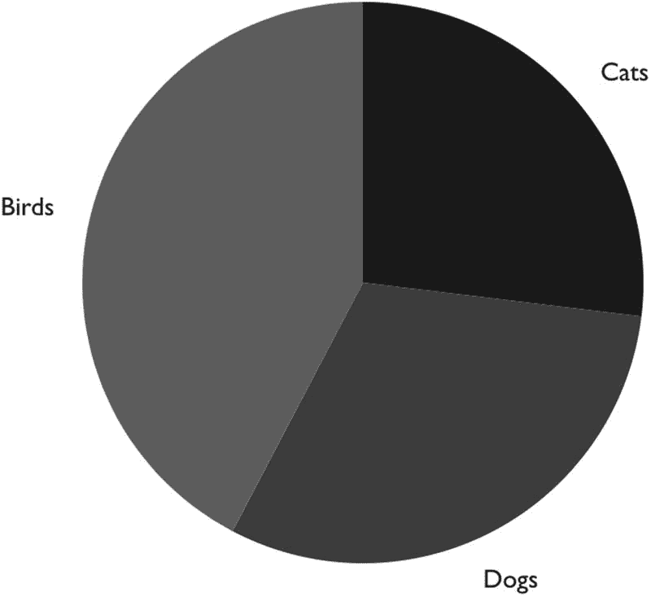

# 十、集成基于 D3 的流行图表库

正如我们在本书中所提到的，D3 是创建图表的标准。

我们已经看到了如何将 React 的功能与 D3 结合起来。这带来了一个额外的好处，因为利用 React VDOM 可以确保 DOM 只在需要的时候更新。您还可以受益于其他 React 库。

在这一章中，我将探索一些最流行的 React/D3 库。我将首先介绍我用来测试每个 React D3 库的标准，并对它们进行比较。在本章的第二部分，我将向你展示如何实现每一个库，并给出每一个库的优缺点。

请记住，我没有在每个库上工作很长时间，所以我的观点仅限于我从实现每个示例中学到的东西。这些库是有生命的，这里提供的信息可能会有变化，所以我建议你自己去看看这些库。

## 为什么使用现成的组件？

在 D3 的基础上构建了大量的库，包括已经过测试的现成组件。它们是跨平台的，包括文档、社区支持、示例、模拟数据等等。

也就是说，使用图表“库”创建一个真正创新的可视化图表可能是一个挑战，并且您很可能会发现自己需要使用 D3 从头创建图表，或者派生您正在使用的原始库来实现对图表的更多控制。

然而，这些第三方库确实有它们的用途，可以帮助创建概念证明(POC ),或者在这些香草风味满足您的需求的情况下加快开发。

我想指出的是，使用这些库是有代价的。许多库可能没有被设置为模块，这可能会使您的包膨胀为一个简单的图表。通用图表在网上随处可见，因为它们可能被数百甚至数千个应用使用，它们可能有许多需要很长时间才能解决的错误。

Caution

我想指出，使用这些 D3 React 库是有代价的。许多库没有被设置为模块，这可能会增加一个简单图表的数量。

## 基于 D3 构建的流行 React 图表

当我说“受欢迎”时，我是基于 GitHub 参与和我个人的观点来陈述的。

我发现的最受欢迎的网站如下:

*   *充电* : [`https://github.com/recharts/recharts`](https://github.com/recharts/recharts) **(** 例子: [`http://recharts.org/en-US/examples`](http://recharts.org/en-US/examples) )

*   *Visx* : [`https://github.com/airbnb/visx`](https://github.com/airbnb/visx) (例如: [`https://airbnb.io/visx/gallery`](https://airbnb.io/visx/gallery) )

*   *胜利* : [`https://github.com/FormidableLabs/victory`](https://github.com/FormidableLabs/victory) (例子: [`https://formidable.com/open-source/victory/gallery`](https://formidable.com/open-source/victory/gallery) )

*   *Nivo* : [`https://github.com/plouc/nivo`](https://github.com/plouc/nivo) (例如: [`https://nivo.rocks/components`](https://nivo.rocks/components) )

*   *React-vi* : [`https://github.com/uber/react-vis`](https://github.com/uber/react-vis) (例子: [`https://github.com/uber/react-vis/tree/master/docs/examples/showcases`](https://github.com/uber/react-vis/tree/master/docs/examples/showcases) )

## 基于 D3 构建的流行 React 图表的比较

表 [10-1](#Par180) 列出了我根据不同标准得出的结果。

***表 10-1。*** *热门 React 排行榜*


让我们回顾一下这些标准。

### 支持 TS

让 TypeScript (TS)作为类型检查器对我来说是必须的。即使您现在不使用 TS，将来也可能会使用。

很多时候，只需要参与者添加类型，或者您可能需要自己设置类型。如果你有一个严格的时间表，你可能没有这样做的奢侈。

幸运的是，我介绍的所有库都包含类型支持。请记住，React-vis 包括对主库的 TS 支持，但不包括对许多模块的支持。

### 模块

基于模块方法的库比包含整个库要好。

在表 [1-1](01.html#Par180) 中，我使用了每个模块的成本(如果可能的话)。如果你需要一个可以用 D3 创建的简单图表，只需要几行代码，那么使用这些库是没有意义的，特别是因为 D3 是由 D3 版本 4 及更高版本的模块组成的。

Rechart 不包括模块化，必须包括和使用整个库。React-vis 有一个相当大的主库，其他库是独立的模块。

我检查的其余库都是按模块组织的，当我只使用一个简单的图表时，花费很少。

### 模拟数据

拥有模拟数据使得创建图表变得更加容易，而不是必须提供数据并进行设置。有了模拟数据，一开始使用库就变得更加愉快。

Victory 带来的一个小惊喜是，它包含了模拟数据，因此无需自带数据。

### 简单

当我谈到简单性时，我指的是准备好图表需要多长时间。大多数图表库都有很好的文档和例子，并且很容易上手。

Visx 看起来是所有版本中最复杂的，因为它是由小部分组成的。这在灵活性方面非常好，但是需要更多的时间来学习和实现。

### 已经设计好了

拥有一个外观漂亮且易于设计的库大有裨益。

很高兴看到 React-vis 中包含了样式表，与其他一些看起来更像需要样式化的线框的库相比，Visx 看起来很棒。

### 文档和示例

拥有好的文档和例子是至关重要的，可以帮助你理解如何实现它们。

Nivo 是一个挑战，因为我不能在屏幕上呈现和显示任何东西，只是发现包装容器需要设置容器的宽度和高度。

让文档尽可能简单是关键。大多数库通过文档和例子很容易理解。

### 贡献者、受欢迎程度和未决问题

知名度、开放问题和贡献者是一个很大的考虑因素。Rechart 在人气方面领先。

Visx 排在第二位，因为它有最少的公开 bug，所以得到了额外的分数。React-vis 在受欢迎程度和支持度方面都排在最后。

## 实现库

在这一节中，我将实现每个库，尝试看看它有多容易上手。我将实现以下库:

*   重新开始

*   维斯克斯

*   获胜

*   清华普天

*   对…做出 React

### 启动项目

使用 CRA 和 MHL 模板项目创建一个新项目。

```jsx
$ yarn create react-app react-chart-libraries --template must-have-libraries
$ cd react-chart-libraries
$ yarn start
$ open http://localhost:3000

```

### 重新开始

Rechart ( [`https://recharts.org/en-US/`](https://recharts.org/en-US/) )被描述为构建在 React 组件上的可组合图表库。

Rechart 是我找到的最流行的库，它是用 React 和 D3 构建的。它有 15800 颗星星，在 GitHub ( [`https://github.com/recharts/recharts`](https://github.com/recharts/recharts) )上还有一个 1.2K 的叉子。

此外，它有一个专门的网站，有例子和文档，它似乎得到了很好的维护，有 177 个贡献者，但有 130 个开放的问题。

该库基于声明性组件(仅表示性组件)，是轻量级的，仅包含几个 D3 模块，并支持 SVG。

#### 设置

安装 Rechart 和 TS 类型。

```jsx
yarn add recharts @types/recharts

```

#### 实施重新计费

我将实现一个简单的折线图，并使用 SVG 作为自定义的 x 轴和 y 轴。

对于这些类型，我将设置一个文件来保存我将要设置的数据对象。

##### types.ts

文件如下:

```jsx
// src/component/SimpleLineChart/types.ts

export namespace Types {
  export type Data = {
    date: string
    value: number
  }
}

```

##### simplelinechart component 简单线条图表元件

我正在实现一个简单的折线图。看一下完整的代码:

```jsx
// src/component/SimpleLineChart/SimpleLineChart.tsx
import React from 'react'
import { LineChart, Line, XAxis, CartesianGrid, Tooltip, YAxis } from 'recharts'
import { Types } from './types'

const CustomizedAxisTick = (props: { x: number; y: number; payload: { value: string } }) => {
  return (
    <g transform={`translate(${props.x},${props.y})`}>
      <text fontSize={12} x={0} y={0} dy={16} textAnchor="end" fill="black" transform="rotate(-35)">
        {props.payload.value}
      </text>
    </g>
  )
}

const CustomizedYAxisTick = (props: { x: number; y: number; payload: { value: string } }) => {
  return (
    <g transform={`translate(${props.x},${props.y})`}>
      <text fontSize="12px" x={0} y={0} dy={0} textAnchor="end" fill="black">
        {props.payload.value}
      </text>
    </g>
  )
}

const EmptyDot = () => {
  return <></>
}

const SimpleLineChart = (props: ISimpleLineChartProps) => {
  return (
    <>
      <LineChart
        width={500}
        height={300}
        data={props.data}
        margin={{
          top: 5,
          right: 30,
          left: 20,
          bottom: 5,
        }}
      >
        <CartesianGrid strokeDasharray="3 3" />
        <XAxis
          height={60}
          dataKey="date"
          // @ts-ignore
          tick={<CustomizedAxisTick />}
        />
        <YAxis
          // @ts-ignore
          tick={<CustomizedYAxisTick />}
        />
        <Tooltip />
        <Line type="monotone" dataKey="value" stroke="#8884d8" dot={<EmptyDot />} />
      </LineChart>

    </>
  )
}

interface ISimpleLineChartProps {
  data: Types.Data[]
}

export default SimpleLineChart

```

我们来复习一下。

我正在设置一个函数组件，该组件将具有自定义文本，并且我将呈现旋转了 35 度的 x 轴。看一看:

```jsx
const CustomizedAxisTick = (props: { x: number; y: number; payload: { value: string } }) => {
  return (
    <g transform={`translate(${props.x},${props.y})`}>
      <text fontSize={12} x={0} y={0} dy={16} textAnchor="end" fill="black" transform="rotate(-35)">
        {props.payload.value}
      </text>
    </g>

  )
}

```

至于自定义 y 轴，我只是使用 SVG 设置一些自定义文本:

```jsx
const CustomizedYAxisTick = (props: { x: number; y: number; payload: { value: string } }) => {
  return (
    <g transform={`translate(${props.x},${props.y})`}>
      <text fontSize="12px" x={0} y={0} dy={0} textAnchor="end" fill="black">
        {props.payload.value}
      </text>
    </g>
  )
}

```

默认情况下，图表的每个点上都有点，因为我有很多点，我不想在图表上看到它们，所以我将设置一个空的渲染，而不是显示它们。

```jsx
const EmptyDot = () => {
  return <>
}

const SimpleLineChart = ( props : ISimpleLineChartProps ) => {
  return (
    <>

```

对于折线图，我使用了 Rechart LineChart 组件，并为 x 轴、y 轴和点设置了自定义 SVG。

```jsx
      <LineChart
        width={500}
        height={300}
        data={props.data}
        margin={{
          top: 5,
          right: 30,
          left: 20,
          bottom: 5,
        }}
      >

        <CartesianGrid strokeDasharray="3 3" />
        <XAxis
          height={60}
          dataKey="date"
          // @ts-ignore
          tick={<CustomizedAxisTick />}
        />
        <YAxis
          // @ts-ignore
          tick={<CustomizedYAxisTick />}
        />
        <Tooltip />
        <Line
          type="monotone"
          dataKey="value"
          stroke="#8884d8"
          dot={<EmptyDot />}
        />
      </LineChart>

    </>
  )
}

```

##### lineDataSelectors.ts

对于数据，我使用反冲选择器通过 D3 获取数据。

```jsx
// src/recoil/selectors/lineDataSelectors.ts

import { selector } from 'recoil'
import * as d3 from 'd3'

export const getLineData = selector({
  key: 'getLineData',
  get: () => {
    return getData()
  },
})

const getData = () =>
  new Promise((resolve) =>
    d3
      .dsv(',', '/Data/line.csv', (d) => {
        const res = d as { date: string; data: string }
        const value = parseFloat(res.data as string)
        const { date } = res
        return {
          date,
          value,
        }
      })
      .then((data) => {
        resolve(data)
      })
  )

```

##### App.tsx

最后一部分是让父组件`App.tsx`使用反冲来获取状态，并将其传递给图表组件。

```jsx
// src/App.tsx

import React from 'react'
import './App.scss'

import { useRecoilValue } from 'recoil'
import SimpleLineChart from './components/SimpleLineChart/SimpleLineChart'
import { Types } from './components/SimpleLineChart/types'
import { getLineData } from './recoil/selectors/lineDataSelectors'

function App() {
  const data = useRecoilValue(getLineData) as Types.Data[]

  return (
    <div className="App">
      <header className="App-header">
        <SimpleLineChart data={data} />
      </header>
    </div>
  )

}

export default App

```

你可以在图 [10-1](#Fig1) 中看到最终的结果。


图 10-1

重新绘制折线图组件

#### 费用

一个图表的 Rechart 的开销是 186.5KB 解析；见图 [10-2](#Fig2) 。这并不像我想象中的大众图书馆那么小；然而，考虑到我们所得到的，这个大小是可以接受的。


图 10-2

重新计算图书馆成本

#### 赞成的意见

我喜欢使用 SVG 定制我的图表如此简单。可用图表的数量、受欢迎程度和社区参与度也给我留下了深刻的印象。很容易理解这个图书馆的受欢迎程度。

#### 骗局

每个组件都不是模块化的，所以我需要引入整个库。也就是说，如果您需要使用来自 Rechart 的多个图表，186.5KB 并不是太大的代价。

### 维斯克斯

由 Airbnb 创建的 Visx ( [`https://airbnb.io/visx/`](https://airbnb.io/visx/) )被描述为 React 的一组富有表现力的低级可视化原语。

Visx 是第二受欢迎的库。Airbnb 团队似乎在这个库、它的视觉吸引力和它的支持上做了一些额外的努力。

#### 设置

我将使用 Visx 示例中的条形图。

Visx 是作为模块构建的，所以我可以只安装我需要的，而不是整个库。

```jsx
yarn add @visx/mock-data @visx/group @visx/shape @visx/scale

```

#### 实施 Visx

我使用了来自 Visx GitHub 位置的示例，做了一些修改来克服一些 ESLint 错误，而不是丢弃或忽略所有错误。

以下是我的主要变化:

*   条形键是基于数组索引的(这是一个大禁忌！).

*   变量数据使用了两次。

*   我删除了未使用的代码。

*   我把名字重构为`SimpleBarGraph`。

看一看:

```jsx
// src/component/SimpleBarGraph/SimpleBarGraph.tsx

import React from 'react'
import { letterFrequency } from '@visx/mock-data'
import { Group } from '@visx/group'
import { Bar } from '@visx/shape'
import { scaleLinear, scaleBand } from '@visx/scale'

const uuid = require('react-uuid')

// We'll use some mock data from `@visx/mock-data` for this.
const data = letterFrequency

// Define the graph dimensions and margins
const width = 500
const height = 500
const margin = { top: 20, bottom: 20, left: 20, right: 20 }

// Then we'll create some bounds
const xMax = width - margin.left - margin.right
const yMax = height - margin.top - margin.bottom

// We'll make some helpers to get at the data we want
// eslint-disable-next-line @typescript-eslint/no-explicit-any
const x = (d: { letter: any }) => d.letter
const y = (d: { frequency: React.Key }) => +d.frequency * 100

// And then scale the graph by our data
const xScale = scaleBand({
  range: [0, xMax],
  round: true,
  domain: data.map(x),
  padding: 0.4,
})
const yScale = scaleLinear({

  range: [yMax, 0],
  round: true,
  domain: [0, Math.max(...data.map(y))],
})

// Compose together the scale and accessor functions to get point functions
// @ts-ignore
const compose = (scale, accessor) => d => scale(accessor(d))
const xPoint = compose(xScale, x)
const yPoint = compose(yScale, y)

// Finally we'll embed it all in an SVG
function SimpleBarGraph() {
  return (
    <svg width={width} height={height}>
      {data.map((d, i) => {
        const barHeight = yMax - yPoint(d)
        return (
          <Group key={`bar-${uuid()}`}>
            <Bar
              x={xPoint(d)}
              y={yMax - barHeight}
              height={barHeight}
              width={xScale.bandwidth()}
              fill="grey"
            />
          </Group>
        )
      })}
    </svg>
  )
}

export default SimpleBarGraph

```

对于`App.tsx`，只需包含组件:`<SimpleBarGraph />`。

你可以在图 [10-3](#Fig3) 中看到最终的结果。


图 10-3

Visx 条形图组件

#### 费用

42KB 的解析大小很小(见图 [10-4](#Fig4) )。


图 10-4

条形图的 Visx 模块大小

#### 赞成的意见

总的来说，我对 Visx 印象深刻。它占地面积小，正如承诺的那样，Visx 由低级组件组成，当您想要获得最终产品并且 Visx 功能接近您所寻求的功能时，这是一个很好的选择。我喜欢它内置的模拟数据。拥有这一点很好，这样我就可以专注于组件的前端开发。

#### 骗局

从代码中可以看出，这些组件被分解成小的、低级别的组件，开发人员需要将它们修补在一起。使用 Visx 库需要一个学习曲线。对于简单的图表来说，这似乎有些矫枉过正，最好只是将时间投入到掌握 D3 上。

### 获胜

Victory ( [`https://formidable.com/open-source/victory/`](https://formidable.com/open-source/victory/) )被描述为 React.js 组件，用于模块化制图和数据可视化。

与 Visx 相比，它在 GitHub 上的星数几乎相同。也就是说，有双倍的贡献者和双倍的错误。

#### 设置

我们需要安装胜利。

```jsx
$ yarn add victory

```

#### 实现胜利

我将基于 [`https://formidable.com/open-source/victory/docs/victory-pie`](https://formidable.com/open-source/victory/docs/victory-pie) 的代码实现一个饼状图。

胜利很容易实现。只需导入库并包含组件。它甚至不需要传递数据；模拟数据作为默认数据存在。

```jsx
// src/component/SimplePie/SimplePie.tsx

import React from 'react'
import { VictoryPie } from 'victory'

const SimplePie = () => {
  return (
    <div className="SimplePie">
      <VictoryPie />
    </div>
  )
}

export default SimplePie

```

您可以像在任何其他数据 viz 库中一样传递数据。

```jsx
// src/component/SimplePie/SimplePie.tsx

import React from 'react'
import { VictoryPie } from 'victory'

const SimplePie = () => {
  return (
    <div className="SimplePie">
      <VictoryPie
        data={[
          { x: 'Cats', y: 35 },
          { x: 'Dogs', y: 40 },
          { x: 'Birds', y: 55 }
        ]}
      />
    </div>
  )
}

export default SimplePie

```

看看最后的结果(见图 [10-5](#Fig5) )。



图 10-5

胜利饼图组件

#### 费用

解析的开销为 164KB(见图 [10-6](#Fig6) )。


图 10-6

饼图中的胜利图书馆成本

#### 赞成的意见

在我见过的所有库中，Victory 是最容易实现的。例子很简单，有令人印象深刻的画廊例子，有大量的追随者，粉丝和支持者。

#### 骗局

Victory 没有其他图书馆那么多图表。另外，在撰写本文时，似乎有太多未解决的问题( [`https://github.com/FormidableLabs/victory/issues`](https://github.com/FormidableLabs/victory/issues) )。

### 清华普天

Nivo ( [`https://nivo.rocks/`](https://nivo.rocks/) )提供了一组丰富的数据，即构建在 D3 和 Reactjs 库之上的组件。

#### 设置

我们可以只安装 Nivo 核心和我们需要的模块。

```jsx
$ yarn add @nivo/core @nivo/calendar

```

#### 实施 Nivo

我将创建一个日历图表( [`https://nivo.rocks/calendar/`](https://nivo.rocks/calendar/) )。

##### 日历. json

对于数据，让我们创建一个 JSON 文件。

```jsx
/public/data/calendar.json
[
  {
    "day": "2020-01-01",
    "value": 100
  },
]

```

##### 日历数据选择器

我将使用反冲选择器来检索数据。

```jsx
// src/recoil/selectors/calendarDataSelectors.ts

import { selector } from 'recoil'

export const getCalendarData = selector({
  key: 'getCalendarData',
  get: () => {
    return getData()
  },
})
const getData = () =>
  new Promise((resolve) =>
    fetch(`${process.env.PUBLIC_URL}/data/calendar.json`).then((response) => {
      if (response.status !== 200) {
        // eslint-disable-next-line no-console
        console.log(`Houston, we have a problem! ${response.status}`)
        return
      }
      response.json().then((data) => {

        resolve(data)
      })
    })
  )

```

##### SimpleCalendarChart

现在是主日历组件的时间了。以下是完整的代码:

```jsx
// src/component/SimpleCalendarChart/SimpleCalendarChart.tsx

import React from 'react'
import { ResponsiveCalendar } from '@nivo/calendar'

const SimpleCalendarChart = (props: ISimpleCalendarChartProps) => {
  return (
    <div style={{ width: 800, height: 500 }}>
      <ResponsiveCalendar
        data={props.data}
        from="2019-01-01"
        to="2021-12-31"
        emptyColor="#eeeeee"
        colors={['#61cdbb', '#97e3d5', '#e8c1a0', '#f47560']}
        margin={{ top: 40, right: 40, bottom: 40, left: 40 }}
        yearSpacing={40}
        monthBorderColor="#ffffff"
        dayBorderWidth={2}
        dayBorderColor="#ffffff"
        legends={[
          {
            anchor: 'bottom-right',
            direction: 'row',
            translateY: 36,
            itemCount: 4,
            itemWidth: 42,
            itemHeight: 36,
            itemsSpacing: 14,
            itemDirection: 'right-to-left',
          },
        ]}
      />
    </div>
  )
}

interface ISimpleCalendarChartProps {
  data: { day: string; value: number }
}

export default SimpleCalendarChart

```

我们来复习一下。

为了设置父组件的宽度和高度，我使用了 Nivo `ResponsiveCalendar`组件。

```jsx
  return (
    <div style={{ width: 800, height: 500 }}>
      <ResponsiveCalendar
        data={props.data}
        from='20110-01-01'
        to='2021-12-31'
        emptyColor='#eeeeee'
        colors={[ '#61cdbb', '#97e3d5', '#e8c1a0', '#f47560' ]}
        margin={{ top: 40, right: 40, bottom: 40, left: 40 }}
        yearSpacing={40}
        monthBorderColor='#ffffff'
        dayBorderWidth={2}
        dayBorderColor='#ffffff'
        legends={[
          {
            anchor: 'bottom-right',
            direction: 'row',
            translateY: 36,
            itemCount: 4,
            itemWidth: 42,
            itemHeight: 36,
            itemsSpacing: 14,
            itemDirection: 'right-to-left'
          }
        ]}
      />
    </div>
  )
}

```

对于类型，我可以将数据提取到它自己的 ts 类型中(就像我们在本书前面的例子中所做的那样)。为了使我们的例子简单，我把它留在了界面中。

```jsx
interface ISimpleCalendarChartProps {
  data: { day: string, value: number }[]
}

```

##### App.tsx

`App.tsx`将使用我创建的反冲选择器检索数据，并将数据传递给`SimpleCalendarChart`组件。

```jsx
import React from 'react'
import './App.scss'
import { useRecoilValue } from 'recoil'
import SimpleCalendarChart from './components/SimpleCalendarChart/SimpleCalendarChart'
import { getCalendarData } from './recoil/selectors/calendarDataSelectors'

function App() {

  const data = useRecoilValue(getCalendarData) as { day: string, value: number }[]

  return (
    <div className="App">
      <header className="App-header">
        <SimpleCalendarChart data={data} />
      </header>
    </div>
  )
}

export default App

```

看看图 [10-7](#Fig7) 中的最终结果。


图 10-7

Nivo 日历组件

#### 费用

Nivo 库是基于模块的；但是，使用一个模块需要核心库，需要 241KB，包括 React-spring ( [`https://www.npmjs.com/package/react-spring`](https://www.npmjs.com/package/react-spring) )、D3、lodash 等库，以及少数 Nivo 库。

#### 赞成的意见

我对 Nivo 提供的独特图表的选择印象深刻；它们看起来很漂亮，也很容易实现。该库有一个服务器端呈现(SSR) API，这在处理大型数据集时非常有用。

#### 骗局

这些例子并不简单明了；当我试图使用文档提供的一些例子时，我无法让它们呈现出来，所以我必须弄清楚包装容器需要设置宽度和高度；否则，什么都不会显示。如果他们已经设置了一些缺省值来获取一些要渲染的东西，并允许我们覆盖缺省设置，那就更容易了。

### 对…做出 React

由优步创建的 React-vis ( [`https://uber.github.io/react-vis/`](https://uber.github.io/react-vis/) )被描述为一个可组合的图表库。

这是名单上最不受欢迎的图书馆。有 116 个贡献者和 277 个公开的 bug。

#### 设置

我们需要安装库和类型。

```jsx
$ yarn add react-vis @types/react-vis

```

#### 实施 React-vis

我将创建一个简单的折线图。我使用了来自 [`https://github.com/uber/react-vis/blob/master/docs/getting-started/getting-started.md`](https://github.com/uber/react-vis/blob/master/docs/getting-started/getting-started.md) 的例子，并做了一些修改。看一看:

```jsx
// src/component/SimpleReactVizChart/SimpleReactVizChart.tsx

import React from 'react'
import './BasicRadarChart.scss'
import '../../../node_modules/react-vis/dist/style.css'
import { XYPlot, LineSeries, XAxis, YAxis, HorizontalGridLines, VerticalGridLines } from 'react-vis'

const SimpleReactVizChart = () => {
  return (
    <>

      <div className="App">

        <XYPlot height={300} width={300}>
          <LineSeries
            data={[
              { x: 0, y: 8 },
              { x: 1, y: 5 },
              { x: 2, y: 4 },
              { x: 3, y: 9 },
              { x: 4, y: 1 },
              { x: 5, y: 7 },
              { x: 6, y: 6 },
              { x: 7, y: 3 },
              { x: 8, y: 2 },
              { x: 9, y: 0 },
            ]}
          />
          <VerticalGridLines />
          <HorizontalGridLines />
          <XAxis />
          <YAxis />
        </XYPlot>

      </div>
    </>

  )
}

export default SimpleReactVizChart

```

参见图 [10-8](#Fig8) 。


图 10-8

React-可见折线图组件

#### 费用

该库包括一个核心库和附加的模块化库。635KB 未解析(316KB 已解析)，这是一个很高的数字。参见图 [10-9](#Fig9) 。


图 10-9

对…做出 React

#### 赞成的意见

React-vis 易于实现，它包含大量简单的自定义图表。此外，我非常喜欢 React-vis 自带的内置 CSS 文件来帮助设计组件的样式。

#### 骗局

这个库看起来不一致，体积很大，有太多未解决的错误，这个库可以使用架构重构。

您可以从这里下载该项目:

[T2`https://github.com/Apress/integrating-d3.js-with-react/tree/main/ch10/react-chart-libraries`](https://github.com/Apress/integrating-d3.js-with-react/tree/main/ch10/react-chart-libraries)

## 摘要

在这一章中，我介绍了一些最流行的 React D3 库。在本章的第一部分，我使用特定的标准比较了不同的库。

在这一章的第二部分，我向你展示了如何建立、实现和使用每个库，包括每个库的成本和优缺点。

如您所见，通过 React 使用构建在 D3 上的现成组件是显而易见的。我们毫不费力地完成了几个小时的工作；许多图表是开源的和跨平台的；它们还附带了模拟数据、文档、示例，甚至社区支持。

也就是说，在所有这些库中有太多公开的 bug，并且在我使用的许多库中，发布包显著增加。如果你所需要的只是一个简单的图表，它们就显得有些多余了。继续在 D3 上投入时间似乎是更好的选择。

如您所见，每个库包含不同的图表集，各有利弊。

以下是一些例子:

*   Rechart 是最受欢迎的，拥有最多的贡献者。

*   Visx 是一个令人印象深刻的库，提供独特的图表、支持和组织水平。理解和使用所有的模块部分确实需要付出努力。

*   胜利是伟大的，因为它很容易实现，并有许多不同的图表提供。

归结起来就是找到你要找的图表。如果你找到了一个接近你所需要的，那么从零开始，用 D3 实现是值得的。

也就是说，D3 也有一个学习曲线。我认为了解这些库并把它们记在心里是有用的；但是，如果你对图表很认真，学习 D3 是不可避免的。一旦你理解了 D3，这些知识将帮助你定制这些现成的组件。另外，如果开源组件没有您需要的东西，您可以随时使用它们。

请记住，我只关注了六个库，但是还有许多其他的库，例如:

*   *符号学* : [`https://github.com/nteract/semiotic`](https://github.com/nteract/semiotic) (例子: [`https://semiotic.nteract.io/examples`](https://semiotic.nteract.io/examples) )

*   *react-D3-components*:[`https://github.com/codesuki/react-d3-components`](https://github.com/codesuki/react-d3-components)(例如: [`https://github.com/codesuki/react-d3-components#examples`](https://github.com/codesuki/react-d3-components%2523examples) )

请记住这些库，即使您不使用它们，这些库也可以作为您定制图表的灵感。