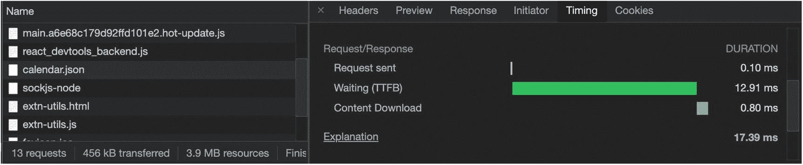

# 十一、性能提示

很多时候，数据可视化需要大量的资源来运行。例如，考虑普通图表包含的功能:动画、运行时更新的实时数据馈送、包含数千条记录的图表或放在单个页面上的几个图表，等等。

这些要求可能会导致缓慢的体验，特别是当用户使用功能较弱的设备时，如旧的移动设备或内存较低或网络连接较慢的计算机。

在这一章中，我将向你展示一些性能技巧，你可以实现它们来提供更好的用户体验。

这一章分为不同的主题领域。

*   数据加载

*   安装模块而不是全局导入

*   服务器端渲染

*   树摇晃

*   仅在需要时更新 DOM

*   在 JSON 上使用 CSV

*   通过预渲染、预取和预缓存优化 CRA

*   用`useCallback`记忆功能

完整的章节代码可以在这里找到:

[T2`https://github.com/Apress/integrating-d3.js-with-react/tree/main/ch11/knick-knacks`](https://github.com/Apress/integrating-d3.js-with-react/tree/main/ch11/knick-knacks)

## 设置

让我们建立一个项目来实现我将在本章中向您展示的性能增强。

```jsx
$ yarn create react-app knick-knacks — template must-have-libraries
$ cd knick-knacks
$ yarn start

```

## 数据加载

使用图表的核心是数据。优化通过网络发送的数据会对加载图表的时间产生重大影响。

您应该只传输您需要的指标，而不是加载整个数据集。例如，在我们的前一章中，我们使用数据集`calendar.json`用 Nivo 绘制了一个日历图表。

该数据集包括 2018 年的数据；然而，我使用的图表设置为显示 2019 年至 2021 年的数据，因此我们的应用不需要 2018 年的所有数据，这将不必要地降低用户体验。

类似地，当我们在前一章创建网络力图时，我们使用了`power_network.json`文件，该文件包括带有节点颜色的`fillColor`字段。

我们可以控制每个节点的颜色，这太棒了；然而，这是不需要的，因为我们可以将其更改为一个类型，并创建一个枚举类，该类指向我们稍后可以在代码中使用的类型。

每个小的变化可能看起来并不显著，但是将它们结合起来，这些小的度量将减少数据大小并提高性能。

```jsx
export enum ColorsTypeEnum {
 ONE = '#fffff',
 TWO = '#00000'
}

```

减少开销的一般规则是避免数据和代码中的重复。

同样，如果您通过网络发送数据，有许多方法可以减小数据的大小，只发送您需要的内容。GraphQL ( [`https://graphql.org/`](https://graphql.org/) )就是一个很好的例子，它让客户能够准确地要求所需要的东西，仅此而已。

要测量进行这些服务调用需要多长时间，您可以使用浏览器工具或其他第三方工具。

例如，在 Chrome 中，右键单击，选择 Inspect，然后转到 Network 选项卡。在图 [11-1](#Fig1) 中，可以看到响应时序击穿用了 17.39 毫秒；这并不多，但是对于一个大数据集来说，用户需要等待半秒甚至几秒钟的时间来加载图表。



图 11-1

calendar.json 的 Chrome 网络响应时间分解

最后，在使用服务时有三个快速的基本规则，正如最近 [`https://catchjs.com/Blog/PerformanceInTheWild`](https://catchjs.com/Blog/PerformanceInTheWild) 在渲染了一百万个网页后所展示的。

*   尽可能少的请求:保持低数量的请求比传输的千字节数更重要，这适用于任何资源。性能测试证明了这一点。

*   *HTTP 3 over HTTP2，避免 HTTP* : HTTP 3 是最好的选择，而且它要常见 100 倍左右。为什么呢？这是因为大多数网站链接到相同的资源，如`analytics.js`和`fbevents.js`。

*   *异步过阻塞请求*:使用异步，尽可能避免阻塞请求。

## 安装模块而不是全局导入

使用 D3(版本 4 及以上)以及许多其他库，可以导入某些模块而不是整个库。这样做可以显著减少运行应用所需的包大小。

要了解这一点，您可以分析产品构建。我已经用运行脚本设置了 CRA·MHL 模板，所以你只需要安装`cra-bundle-analyzer`作为开发者依赖项。

```jsx
$ yarn add --dev cra-bundle-analyzer

```

现在，您可以运行分析工具并亲自检查，如图 [11-2](#Fig2) 所示。


图 11-2

CRA MHL 模板初始捆绑大小

```jsx
$ yarn analyzer

```

如您所见，CRA·MHL 解析后的树形图大小为 214KB。这包括 React 和 React DOM v17 (129.17KB)以及反冲(54KB)。

为了更好地理解不同尺寸代表什么，请看下面的列表:

*   *Stat size* :这是 webpack 捆绑之后、优化(比如缩小)之前的输入大小。

*   *解析大小*:这是优化后文件在磁盘上的大小。它是客户端浏览器解析的 JavaScript 代码的有效大小。

*   *gzip 大小*:这是 gzip 通常通过网络传输后文件的大小。请记住，gzip 到达客户端(浏览器)后需要解压缩。

首先，让我们创建一些简单的 React D3 代码来绘制一个矩形。

```jsx
$ npx generate-react-cli component Rectangle --type=d3

```

接下来，让我们安装 D3 全局库以及我们唯一需要的模块(`d3-selection`)。

```jsx
$ yarn add d3-selection @types/d3-selection
$ yarn add d3 @types/d3

```

如果我们创建相同的代码，我们可以先使用全局 D3 库，然后使用我们正在使用的`d3-selection`模块。代码几乎相同；然而，足迹发生了变化。

下面是导入整个 D3 库(`import * as d3 from d3'`)时`Rectangle.tsx`函数组件的版本:

```jsx
// src/component/Rectangle/Rectangle.tsx

import React, { useEffect, RefObject } from 'react'
import * as d3 from 'd3'

const Rectangle = () => {
  const ref: RefObject<HTMLDivElement> = React.createRef()

  useEffect(() => {
    draw()
  })

  const draw = () => {
    d3.select(ref.current).append('p').text('Hello World')
    d3.select('svg')
      .append('g')
      .attr('transform', 'translate(250, 0)')
      .append('rect').attr('width', 500)
      .attr('height', 500)
      .attr('fill', 'tomato')
  }

  return (
    <div className="Rectangle" ref={ref}>
      <svg width="500" height="500">
        <g transform="translate(0, 0)">
          <rect width="500" height="500" fill="green" />
        </g>
      </svg>
    </div>
  )
}

export default Rectangle

```

再次运行分析仪检查捆尺寸，如图 [11-3](#Fig3) 所示。


图 11-3

D3 全局库解析大小

```jsx
$ yarn analyzer

```

如您所见，D3 库被解析了 37.57KB。

现在，让我们修改代码，只包含`d3-selection`模块，我们正在使用它，因为我们不需要来自 D3 的任何其他代码。

```jsx
// src/component/Rectangle/Rectangle.tsx

import React, { useEffect, RefObject } from 'react'
import { select } from 'd3-selection'

const Rectangle = () => {
  const ref: RefObject<HTMLDivElement> = React.createRef()

  useEffect(() => {
    draw()
  })

  const draw = () => {
    select(ref.current).append('p').text('Hello World')
    select('svg')
      .append('g')
      .attr('transform', 'translate(250, 0)')
      .append('rect').attr('width', 500)
      .attr('height', 500)
      .attr('fill', 'tomato')
  }

  return (
    <div className="Rectangle" ref={ref}>
      <svg width="500" height="500">
        <g transform="translate(0, 0)">
          <rect width="500" height="500" fill="green" />
        </g>
      </svg>
    </div>
  )
}

export default Rectangle

```

再次运行分析仪以检查束尺寸。见图 [11-4](#Fig4) 。

正如你所看到的(图 [11-4](#Fig4) ，通过使用`d3-selection`而不是进行全局导入，D3 解析的大小从 37.57KB 减少到 11.97KB。这意义重大！


图 11-4

D3 模块库解析大小

## 服务器端渲染

CRA (SPA)模式在某些情况下非常好，因为你不会得到任何页面刷新，所以这种体验就像你在一个移动应用中一样。

这些页面应该在客户端呈现。除了 SPA，还有一个我之前在书中提到的选项:服务器端渲染(SSR)。

CRA 不支持现成的 SSR。但是，有一些方法可以配置路由等。，并让 CRA 作为 SSR 工作，但这可能涉及到您自己退出和维护配置，可能不值得这样做。

Note

退出意味着您正在承担更新您可能不完全理解的配置构建代码的责任。如果构建中断，CRA 可能无法支持您设置的自定义配置，并且更新构建文件可能会中断。

如果您正在构建需要 SSR 来提高性能的东西，那么最好使用已经配置了 SSR 的不同 React 库，例如 Next.js framework、Razzle 或 Gatsby(它们在构建时包含一个 HTML 格式的 prerender 网站)。

Tip

如果你想用 React 和 Node.js 做服务器渲染，可以去看看 Next.js，Razzle，或者 Gatsby。

## 树摇晃

摇树( [`https://webpack.js.org/guides/tree-shaking/`](https://webpack.js.org/guides/tree-shaking/) )是 JavaScript 中使用的一个术语，意思是移除死代码。

当我说死代码时，可能有两种情况:

*   *从未执行过的代码*:代码在运行时从不执行。

*   *结果从未使用过*:代码被执行，但结果从未使用过。

在我们当前的项目配置中，我们有反冲状态管理，但是我们没有对任何东西使用反冲特性。

现在，如果我们深入我们的 JS 包，看看发生了什么，我们可以看到反冲几乎使用了 54.24KB，如图 [11-5](#Fig5) 所示。


图 11-5

反冲库大小占地面积

在我的发布构建代码中包含反冲的原因是，我使用反冲作为暂停回退来显示加载消息，直到组件被加载，但是我的代码加载很快，并且不需要该代码，因为我没有使用选择器或任何需要该代码的异步调用。

```jsx
// src/AppRouter.tsx

import React, { FunctionComponent, Suspense } from 'react'
import { BrowserRouter as Router, Route, Switch } from 'react-router-dom'
import { RecoilRoot } from 'recoil'
import App from './App'

const AppRouter: FunctionComponent = () => {
  return (
    <Router>
      <RecoilRoot>
        <Suspense fallback={<span>Loading...</span>}>
          <Switch>
            <Route exact path="/" component={App} />
          </Switch>
        </Suspense>
      </RecoilRoot>
    </Router>
  )
}

```

为了优化代码，重构`AppRouter.tsx`并移除反冲引用。

```jsx
// src/AppRouter.tsx

import React, { FunctionComponent } from 'react'
import { BrowserRouter as Router, Route, Switch } from 'react-router-dom'
import App from './App'

const AppRouter: FunctionComponent = () => {
  return (
    <Router>
      <Switch>
        <Route exact path="/" component={App} />
      </Switch>
    </Router>
  )
}

```

你甚至可以通过运行`yarn remove`命令从你的`package.json`文件中删除反冲来清理东西，但是如果它没有被使用，如果你认为你以后需要反冲，那就没有必要了。

```jsx
$ yarn remove recoil

```

为我们不使用的库导入会增加我们代码的大小(JS 包)。这些进口商品应该取消。

再次运行分析器，您可以看到包的大小减少到了 175KB。

```jsx
$ yarn analyzer

```

## 仅在需要时更新 DOM

当使用 D3 和 React 时，正如我们所看到的，最大的优势是我们可以让 React 控制 DOM。React VDOM 只需要更新一次改变。我们需要确保只有在需要改变时才重新渲染。

D3 代码被认为是副作用，因为它在 React 的 VDOM 机制之外向 DOM 添加了内容。正因为如此，我们想让 VDOM 知道什么时候重画。

在一个函数组件中，`useEffect`钩子用于任何副作用，在组件卸载后，任何不是基于 React 的事件都需要手动清理，以确保不会出现内存泄漏。

但这还不够。我们可能关心的另一个问题是确保我们的图表只在需要时更新，而不是在每次组件更新时更新。

例如，如果你查看我们在本书前几章中使用的`HelloD3Data.tsx`函数组件，你会发现我们可以通过函数`props`传递数据，并将每个数据字符串绘制为文本标签。

```jsx
// src/component/HelloD3Data/HelloD3Data.tsx

import React, { useEffect } from 'react'
import './HelloD3Data.scss'
import { select, selectAll } from 'd3-selection'
interface IHelloD3DataProps {
  data: string[]
}
const HelloD3Data = (props: IHelloD3DataProps) => {
  useEffect(() => {
    draw()
  })

  const draw = () => {
    console.log('draw!')
    select('.HelloD3Data')
      .selectAll('p')
      .data(props.data)
      .enter()
      .append('p')
      .text((d) => `d3 ${d}`)
  }
  return <div className="HelloD3Data" />
}

export default HelloD3Data

```

父组件`App.tsx`保存数据数组字符串作为状态。单击一个按钮，我用与原始初始值相同的数组字符串值来改变状态:`['one', 'two', 'three', 'four']`。看一看:

```jsx
import React, { useState } from 'react'
import './App.scss'
import { Button } from '@material-ui/core'
import HelloD3Data from './components/HelloD3Data/HelloD3Data'

function App() {
  const [data, setData] = useState<string[]>(['one', 'two', 'three', 'four'])
  return (
    <div className="App">
      <HelloD3Data data={data} />
      <Button onClick={() => setData(['one', 'two', 'three', 'four'])}>
        Click
      </Button>
    </div>
  )
}

export default App

```

现在，如果我们运行这段代码并一直单击 click 按钮，那么每次单击都会重绘子组件`HelloD3Data.tsx`。见图 [11-6](#Fig6) 。


图 11-6

hello 3d data . tsx 组件

这里发生的事情是，React 在每次更新时调用`useEffect`，由于 D3 绘制 DOM，它导致相同代码的重绘。

我们需要做的是检查数据更新。

有几种方法可以做到这一点。这里有三个:

*   *检查 D3 数据*:检查 D3 元素内部的数据。

*   *克隆*:本地克隆数据。

*   *创建 React 类组件* : React 类组件已经内置了传递先前值的逻辑。

### 检查 D3 数据

为了检查 D3 元素中的数据，我们可以选择所有正在使用的`p`元素，然后遍历数组来创建一个可以比较的先前数据对象。

```jsx
// src/component/HelloD3Data/HelloD3Data.tsx

import React, { useEffect } from 'react'
import './HelloD3Data.scss'
import { select, selectAll } from 'd3-selection'

const HelloD3Data = (props: IHelloD3DataProps) => {
  useEffect(() => {
    draw()
  })

  const draw = () => {
    const previousData: string[] = []
    const p = selectAll('p')
    p.each((d, i) => {
      previousData.push(d as string)
    })
    if ( JSON.stringify(props.data) !== JSON.stringify(previousData) ) {
      console.log('draw!')
      select('.HelloD3Data')
        .selectAll('p')
        .data(props.data)
        .enter()
        .append('p')
        .text((d) => `d3 ${d}`)
    }
  }

  return (
    <div className="HelloD3Data">
    </div>
  )
}

interface IHelloD3DataProps {
  data: string[]
}

export default HelloD3Data

```

有了数据检查，我们就可以更新结果，而不用担心 DOM 会过多地重绘我们的元素。

```jsx
<Button onClick={() => setData(['one', 'two', 'three', 'four', 'five'])}>
  Click
</Button>

```

### 克隆数据

第二种方法是克隆数据，然后我们可以将`props`值与我们的状态值进行比较。

```jsx
// src/component/HelloD3DataCloned/HelloD3DataCloned.tsx

import React, { RefObject, useEffect, useState } from 'react'
import './HelloD3Data.scss'
import { select } from 'd3-selection'

const ref: RefObject<HTMLDivElement> = React.createRef()

const HelloD3DataCloned = (props: IHelloD3DataProps) => {

  const [data, setData] = useState<string[]>([])

  useEffect(() => {
    if (JSON.stringify(props.data) !== JSON.stringify(data)){
      setData(props.data)
      console.log('draw!')
      select(ref.current)
        .selectAll('p')
        .data(data)
        .enter()
        .append('p')
        .text((d) => `d3 ${d}`)
    }
  }, [data, props.data, setData])

  return <div className="HelloD3Data" ref={ref} />
}

interface IHelloD3DataProps {
  data: string[]
}

export default HelloD3DataCloned

```

这种方法很好，但是不如在 D3 中检查数据理想，因为我们现在将相同的数据存储在内存或引用中三次(`props`、state 和 HTML 元素)。

也就是说，克隆数据有时是必要的一步，因为 D3 逻辑会改变对象内部的数据，而 React `props`不会容忍这种情况。TypeScript 实际上会吐出一条错误消息:“TypeError:无法添加属性索引，对象不可扩展。”正如您所记得的，我们在创建气泡图和功率图时就是这样做的。

### React 类组件

第三种选择是创建一个类组件，而不是一个函数组件，因为当组件被安装和更新时，它已经有了生命周期挂钩(如`componentDidUpdate`)来处理。我们可以用它来比较之前的数据和当前的数据。

```jsx
// src/component/HelloD3DataClass/HelloD3DataClass.tsx

import React, { RefObject } from 'react'
import { select } from 'd3-selection'

export default class HelloD3DataClass extends React.PureComponent<IHelloD3DataClassProps, IHelloD3DataClassState> {
  ref: RefObject<HTMLDivElement>

  constructor(props: IHelloD3DataClassProps) {
    super(props)
    this.ref = React.createRef()
  }

  componentDidMount() {
    this.draw()
  }

  componentDidUpdate(prevProps: IHelloD3DataClassProps, prevState: IHelloD3DataClassState) {
    if (JSON.stringify(prevProps.data) !== JSON.stringify(this.props.data)) {
      this.draw()
    }
  }

  draw = () => {
    // eslint-disable-next-line no-console
    console.log('draw!')
    select(this.ref.current)
      .selectAll('p')
      .data(this.props.data)
      .enter()
      .append('p')
      .text((d) => `d3 ${d}`)
  }

  render() {

    return (
      <div className="HelloD3DataClass" ref={this.ref} />
    )
  }
}

interface IHelloD3DataClassProps {
  data: string[]
}

interface IHelloD3DataClassState {
  // TODO
}

```

如您所见，我向您展示的所有选项(检查 d3 数据、克隆和 React 类组件)都是有效的，它们允许我们控制 D3 更新仅在数据改变时发生，以避免不必要地不断更新 DOM。

Note

正如你所看到的和我在书的前面提到的，我尽可能使用`React.PureComponent`而不是`React.Component`，因为它在某些情况下提供了性能提升，但代价是失去了`shouldComponentUpdate`生命周期事件。`React.PureComponent`和`React.memo()`都优先于`React.Component`。

## 在 JSON 上使用 CSV

在创建 D3 图表时，通常使用 CSV 和 JSON 作为数据源，事实上我们在书中的许多例子中都使用了 CSV 和 JSON。

请记住，如果您可以选择，CSV 比 JSON 更受欢迎。

*   *CSV 使用更少的带宽* : CSV 使用字符分隔符，JSON 仅仅为了语法格式就需要更多的字符。

*   *CSV 处理数据更快*:CSV 字符分隔符拆分更快，在 JSON 中需要解释语法。

## 通过预渲染、预取和预缓存优化 CRA

在某些情况下，CRA (SPA)模式非常好，因为你不会刷新页面，感觉就像在移动应用中一样。

这些页面应该在客户端呈现。CRA 不支持服务器端渲染。

但是，有一些方法可以配置路由等。，并让 CRA 作为 SSR 工作，但这可能涉及到您自己退出和维护配置，可能不值得这样做。

如果您正在构建需要 SSR 的东西，那么最好使用已经配置了 SSR 的不同 React 库，比如 Next.js framework、Razzle 或 Gatsby。

Tip

如果你想用 React 和 Node.js 做服务器渲染，可以去看看 Next.js，Razzle，或者 Gatsby。

CRA 在后端是不可知的，只产生静态的 HTML/JS/CSS 包。也就是说，通过 CRA，我们可以进行预渲染，这是目前最接近 SSR 的方法。参见 CRA 文档 [`https://create-react-app.dev/docs/pre-rendering-into-static-html-files/`](https://create-react-app.dev/docs/pre-rendering-into-static-html-files/) 。

为每个路线或相对链接生成 HTML 页面有许多选项。这里有几个:

*   React-捕捉

*   React-快照

*   Webpack 静态站点生成器插件

我推荐 React-snap ( [`https://github.com/stereobooster/react-snap`](https://github.com/stereobooster/react-snap) )，因为它在 GitHub 上更受欢迎，并且可以与 CRA 无缝协作。

React-snap 使用 Puppeteer 在应用中自动创建不同路径的预渲染 HTML 文件。

最大的好处是，一旦我们使用 React-snap，应用不会关心 JS 包是否成功加载，因为我们设置的每个页面都是独立的。

请记住，对于要单独加载的每个页面，有些包可能有多余的代码，所以这是有代价的。

*第一步*:开始使用这个:

```jsx
$ yarn add --dev react-snap

```

*第二步*:接下来添加`package.json`的`post build`运行脚本。

```jsx
// package.json
"scripts": {
  ...
  "postbuild": "react-snap"
},

```

*第三步*:几乎即时渲染的静态 HTML 默认情况下，它是未设置样式的，可能会导致显示“未设置样式的内容闪烁”(FOUC)的问题。如果使用 CSS-in-JS 库来生成选择器，这一点尤其明显，因为 JavaScript 包必须在设置任何样式之前完成执行。

React-snap 使用另一个名为`minimalcss` ( [`https://github.com/peterbe/minimalcss`](https://github.com/peterbe/minimalcss) )的第三方库来提取不同路线的任何关键 CSS。

您可以通过在您的`package.json`文件中指定以下内容来启用它:

```jsx
// package.json"scripts": {
  ...
  "postbuild": "react-snap"
},
"reactSnap": {
  "inlineCss": true
},

```

*第四步*:现在在`src/index.tsx`就是我们要补水的地方，我们也可以用这个`serviceWorker.register()`在那里注册预缓存。在下一节中，您将了解更多关于预缓存的内容。

```jsx
// src/index.tsx
import React from 'react'
import { hydrate, render } from 'react-dom'
import './index.scss'
import AppRouter from './AppRouter'
import * as serviceWorker from './serviceWorker'

const rootElement = document.getElementById('root')
if (rootElement && rootElement!.hasChildNodes()) {
  hydrate(<AppRouter />, rootElement)
  serviceWorker.register()
} else {
  render(<AppRouter />, rootElement)
}

```

第五步:现在构建你的应用的生产版本。

```jsx
$ yarn build

```

将通过在 CRA 配置的 NPM 脚本自动调用后期构建脚本。你应该看到成功的结果。

```jsx
$ react-snap
✅ crawled 1 out of 1 (/)

```

## 将矩形添加为页面

如果你打开`AppRouter.tsx`，你可以看到有一条到`App.tsx`的路线。

```jsx
// src/AppRouter.tsx

import React, { FunctionComponent, Suspense } from 'react'
import { BrowserRouter as Router, Route, Switch } from 'react-router-dom'
import { RecoilRoot } from 'recoil'
import App from './App'

const AppRouter: FunctionComponent = () => {
  return (
    <Router>
      <RecoilRoot>
        <Suspense fallback={<span>Loading...</span>}>
          <Switch>
            <Route exact path="/" component={App} />
          </Switch>
        </Suspense>
      </RecoilRoot>
    </Router>
  )
}

```

现在让我们添加另一个页面路由，并将其添加到路由标签(`Rectangle`)。

```jsx
// src/AppRouter.tsx

import Rectangle from './components/Rectangle/Rectangle'

const AppRouter: FunctionComponent = () => {
  return (
    <Router>
      <RecoilRoot>
        <Suspense fallback={<span>Loading...</span>}>
          <Switch>
            <Route exact path="/" component={App} />
            <Route exact path="/Rectangle" component={Rectangle} />
          </Switch>
        </Suspense>
      </RecoilRoot>
    </Router>

  )
}

```

现在，如果您导航到此处显示的`Rectangle` URL，您可以看到我们构建的组件:

```jsx
http://localhost:3000/Rectangle

```

再次运行`yarn build`。

```jsx
$ yarn build

```

它仍然给出一个页面被抓取的相同结果，但是为什么呢？

```jsx
✅ crawled 1 out of 1 (/)

```

原因是`Rectangle`页面没有任何链接，无法抓取。为了抓取页面，我们需要在我们的`App.tsx`文件中添加一个路由链接。

```jsx
<NavLink to='/Rectangle' key='Rectangle'>
  Navigate To Rectangle
</NavLink>

```

现在再次运行构建，现在两个页面都被抓取了。

```jsx
$ react-snap
✅  crawled 1 out of 3 (/)

✅  crawled 2 out of 2 (/Rectangle)

```

您也可以在公共文件夹中看到这一点；见图 [11-7](#Fig7) 。


图 11-7

在构建文件夹中创建的矩形文件夹

## 预取

您可能已经在 React 中使用了高阶组件(hoc)来增强组件功能( [`https://reactjs.org/docs/higher-order-components.html`](https://reactjs.org/docs/higher-order-components.html) )。对于我们的 JS 包，我们可以采用类似的方法。

我们希望首先加载页面，然后检索 JS 包，所以我们要尽快显示页面。

让我们来看看。您可以构建一个 prod 版本，并使用`serve`命令来查看构建。

```jsx
$ yarn build:serve

```

在 Chrome DevTools 中检查构建(`http://localhost:5000/Rectangle`)。看看 JS bundle chunks 的层次结构；他们在顶部(见图 [11-8](#Fig8) )。


图 11-8

没有为 JS 包设置层次结构

我们想把这些块束移到底部。为此，我们可以使用 Quicklink ( [`https://github.com/GoogleChromeLabs/quicklink`](https://github.com/GoogleChromeLabs/quicklink) )。

Quicklink 通过使用技术来决定先加载什么，试图使后续页面的导航加载得更快。让我们安装 Quicklink。

```jsx
$ yarn add -D webpack-route-manifest

$ yarn add quicklink

```

请注意，您的`package.json`文件是用以下代码更新的:

```jsx
"devDependencies": {
  "webpack-route-manifest": "^1.2.0"
}

```

在我们的例子中，我们使用 React CRA 温泉；我们将使用 React HOC，在这里我们希望为我们延迟加载的页面添加预取功能。为此，我们只需使用一个空的选项对象，并用 Quicklink HOC 包装我们的组件。

```jsx
// src/AppRouter.tsx

import React, { FunctionComponent, lazy, Suspense } from 'react'
import { BrowserRouter as Router, Route, Switch } from 'react-router-dom'
import { RecoilRoot } from 'recoil'

import { withQuicklink } from 'quicklink/dist/react/hoc.js'

import App from './App'

const MyPage = lazy(() => import('./components/Rectangle/Rectangle'))
const options = {
  origins: [],
}

const AppRouter: FunctionComponent = () => {
  return (
    <Router>
      <RecoilRoot>
        <Suspense fallback={<span>Loading...</span>}>
          <Switch>
            <Route exact path="/" component={App} />
            <Route exact path="/Rectangle" component={withQuicklink(MyPage, options)} />
          </Switch>
        </Suspense>
      </RecoilRoot>
    </Router>
  )
}

export default AppRouter

```

Note

运行`prerender`并提供静态页面不一定总是最好的方法；这实际上会给用户带来不愉快的体验，因为每个页面都将被加载，并且组件的加载会跨页面分布。对于轻量级应用，等待半秒钟来加载所有内容可能比每次页面加载时等待一会儿更好，不会有更多的等待时间。你需要自己测试和观察，但是要意识到这个特性。

*步骤 5* :要在本地剥离生产构建，运行 CRA 模板，然后运行脚本(`yarn build:serve`)。它使用的是 serve 库，所以如果你使用的是 CRA MHL 模板，你甚至不需要安装或配置`package.json`。

运行`serve`运行脚本来添加本地服务器并查看生产构建。

```jsx
$ yarn build:serve

```

正如你所看到的，在实现了逻辑之后，HOC 工作了，现在我们的包块在底部，如图 [11-9](#Fig9) 所示。


图 11-9

特设工作束块在底部

```jsx
http://localhost:5000/Rectangle

```

我想指出的是，使用`prerender`的另一个重要原因是，除了用搜索引擎优化(SEO)进行优化之外，还需要静态页面。如果您预渲染页面，并希望生成不同的标题、描述、元数据等。，对于由于 SEO 原因的每个页面，或者需要通过社交媒体共享单个页面，请查看`react-helmet`，它可以帮助为每个 React 页面组件设置唯一的标题。

## 预缓存:脱机工作

能够脱机是渐进式 web 应用(PWA)的核心功能。我们可以用一个`serviceWorker`来做。

CRA 将`serviceWorker`包含在`index.tsx`文件中。

```jsx
serviceWorker.unregister()

```

## 这是什么意思？

CRA 包括一个开箱即用的“生产工具箱”( [`https://developers.google.com/web/tools/workbox/modules/workbox-webpack-plugin`](https://developers.google.com/web/tools/workbox/modules/workbox-webpack-plugin) )。

要启用该功能，只需将`serviceWorker`状态改为 register 即可。

```jsx
serviceWorker.register()

```

在前面的部分中，我们已经在为生产构建时将`serviceWorker`添加到了我们的`index.tsx`组件中。

```jsx
const rootElement = document.getElementById('root')
if (rootElement && rootElement!.hasChildNodes()) {
  hydrate(<AppRouter />, rootElement)
  serviceWorker.register()
} else {
  render(<AppRouter />, rootElement)
}// serviceWorker.unregister()

```

现在当您再次构建(`$yarn build`)时，会出现一个新文件:`build/precache-manifest.[string].js`。

参见图 [11-10](#Fig10) 。


图 11-10

运行时主包文件被添加到我们的静态文件夹中

要查看工作器的运行情况，您需要再次运行发布构建脚本。

```jsx
$ yarn build:serve

```

看一下 Chrome DevTools 的网络选项卡；在尺寸栏中，可以看到写着 ServiceWorker，如图 [11-11](#Fig11) 所示。


图 11-11

预缓存 ServiceWorker 出现在 Chrome DevTools 的网络选项卡中

继续，关闭你的网络连接，或者在 Chrome DevTools 的网络标签上，勾选离线复选框。

您现在可以模拟离线体验了。刷新 app 它仍然像你在线一样工作！

## 你的应用如何离线工作？

CRA 的工作箱默认预缓存策略是`CacheFirst`。静态资产从服务工作者缓存机制中检索，如果失败，则发出网络请求。

Workbox 支持`CacheOnly`、`NetworkFirst`等不同的策略。，但 CRA 可能需要被驱逐，以使用不同于默认的策略。

点击 [`https://create-react-app.dev/docs/making-a-progressive-web-app/`](https://create-react-app.dev/docs/making-a-progressive-web-app/) 了解更多关于此功能的信息。

### 用 useCallback 记忆函数

我在本章前面和整本书中已经向你展示了如何使用`useEffect`和`draw`。看一看:

```jsx
useEffect(() => {
   draw()
}const draw = () => {
  // TODO
}

```

然而，这段代码是有问题的，因为它会导致无限循环！有助于防止这种情况。

`useCallback()`可以与`useEffect()`一起使用，帮助防止函数的重新创建。[见`https://reactjs.org/docs/hooks-reference.html#usecallback`](https://reactjs.org/docs/hooks-reference.html%2523usecallback) 。)

```jsx
useEffect(() => {
   memoizedDrawCallback()
}, [memoizedDrawCallback]const memoizedDrawCallback = useCallback(() => {
  // TODO using data as dependency
}, [data])

```

如你所见，`memoizedDrawCallback`之类的函数只不过是 JS 中的对象。将它们包装在函数声明中并定义函数的依赖关系，可以确保只有当函数的依赖关系发生变化时才重新创建函数。例如，您可以在 dependencies 数组中列出您需要的数据或`props`。

```jsx
[props.bottom, props.data, props.fill, props.height, props.left, props.right, props.top, props.width]

```

`memoizedDrawCallback`函数不会在每次渲染 DOM 周期更新时重新构建，所以我们已经打破了潜在的无限循环！在我的 d3 和 React 交互课程中，你可以看到如何用 memorizedDrawCallback 方法实现本章中的许多例子。 [`https://elielrom.com/BuildSiteCourse`](https://elielrom.com/BuildSiteCourse) 。

## 摘要

应用本章中的方法并测量结果有助于减少应用的占用空间和宝贵的加载时间。

当你分析和调试你的应用时，很多技巧都会用到。如果你对分析和调试 React 应用有点生疏，可以看看我的 React 书( [`https://www.apress.com/gp/book/9781484266953`](https://www.apress.com/gp/book/9781484266953) )。此外，我有两篇文章可以提供帮助。

*   [T2`https://medium.com/react-courses/4-ways-to-profile-your-react-app-75b740e39ab2`](https://medium.com/react-courses/4-ways-to-profile-your-react-app-75b740e39ab2)

*   [T2`https://medium.com/react-courses/six-best-debugging-options-to-crush-your-reacts-bugs-like-a-champion-70b11b6a1a2d`](https://medium.com/react-courses/six-best-debugging-options-to-crush-your-reacts-bugs-like-a-champion-70b11b6a1a2d)

在下一章，也是最后一章，我将介绍发布你的 React D3 图表作为 SPA 和 SSR。