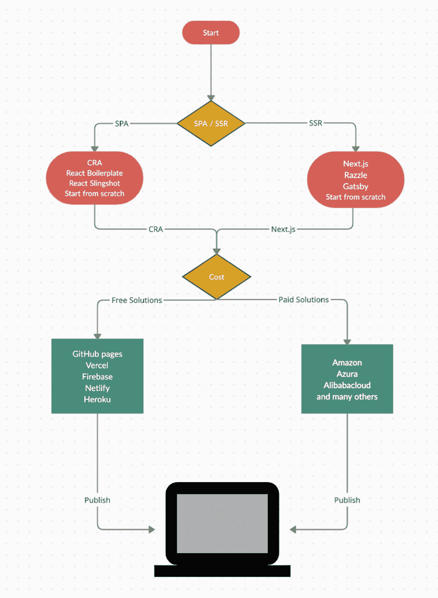
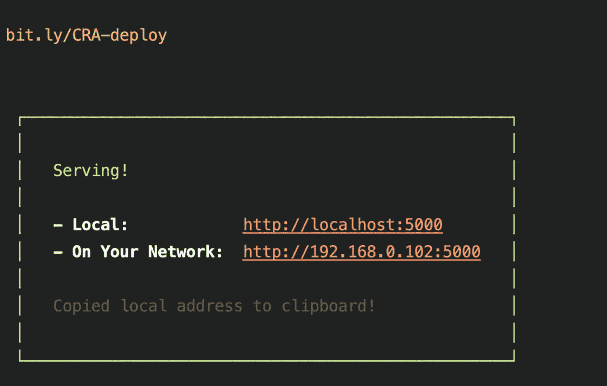
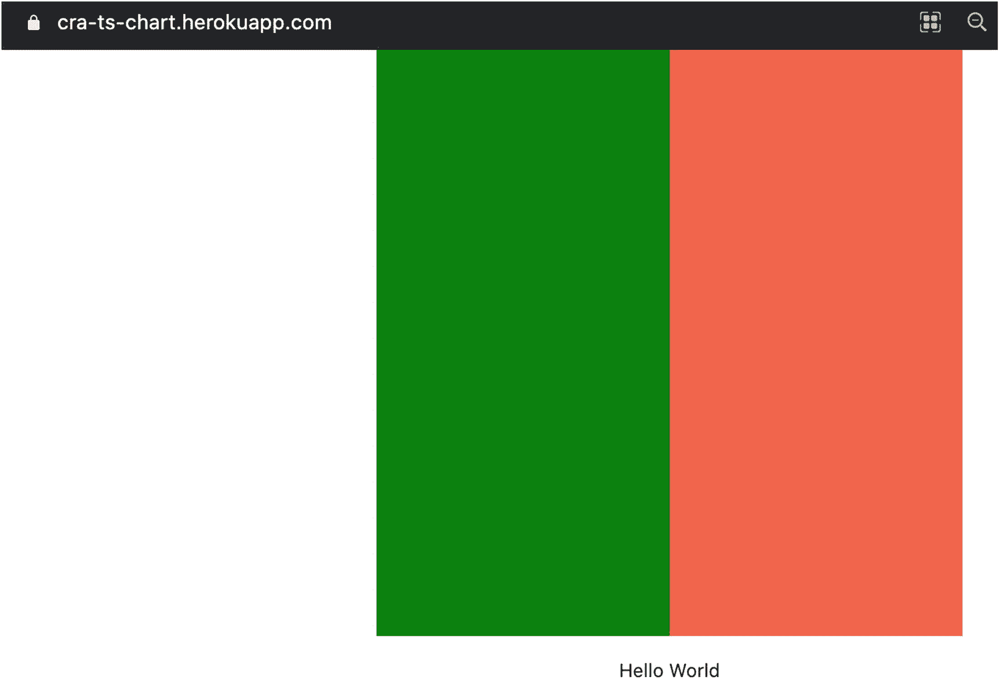
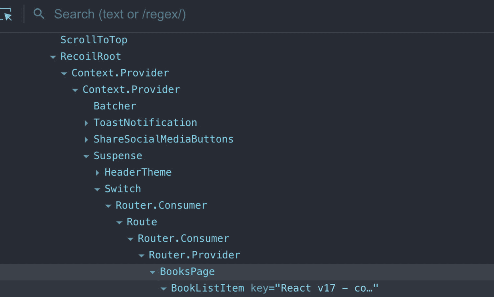
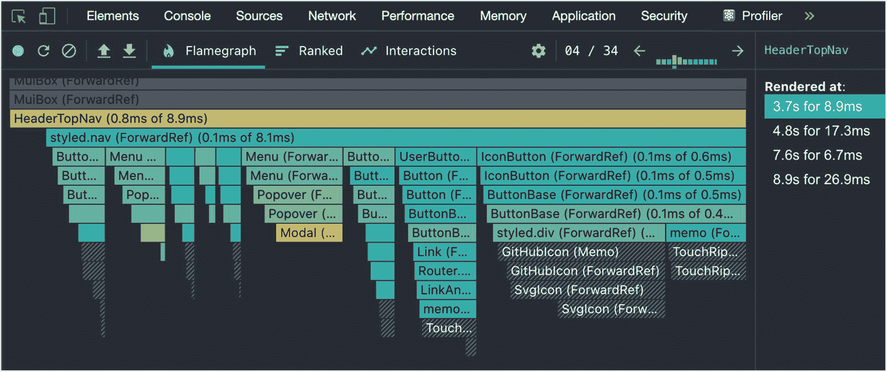
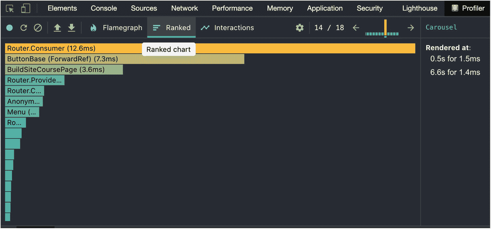
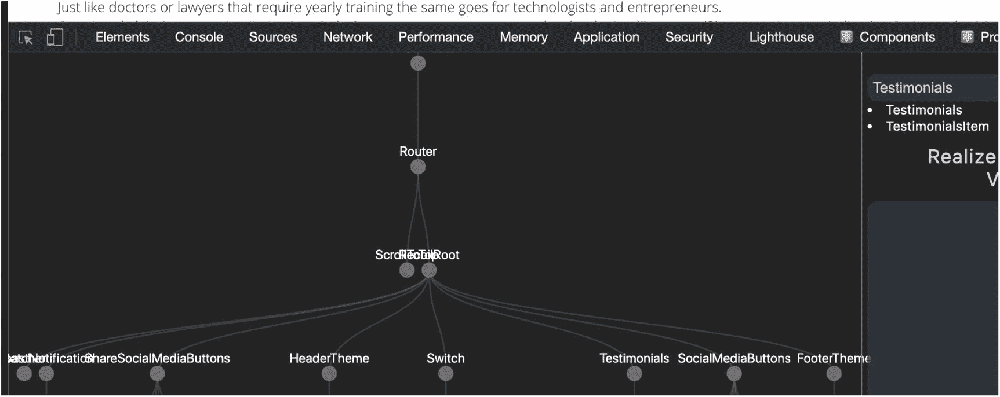
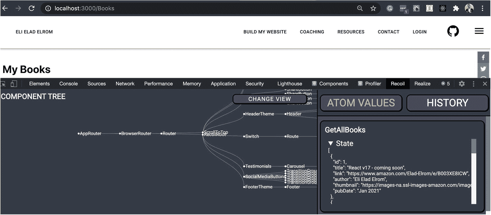
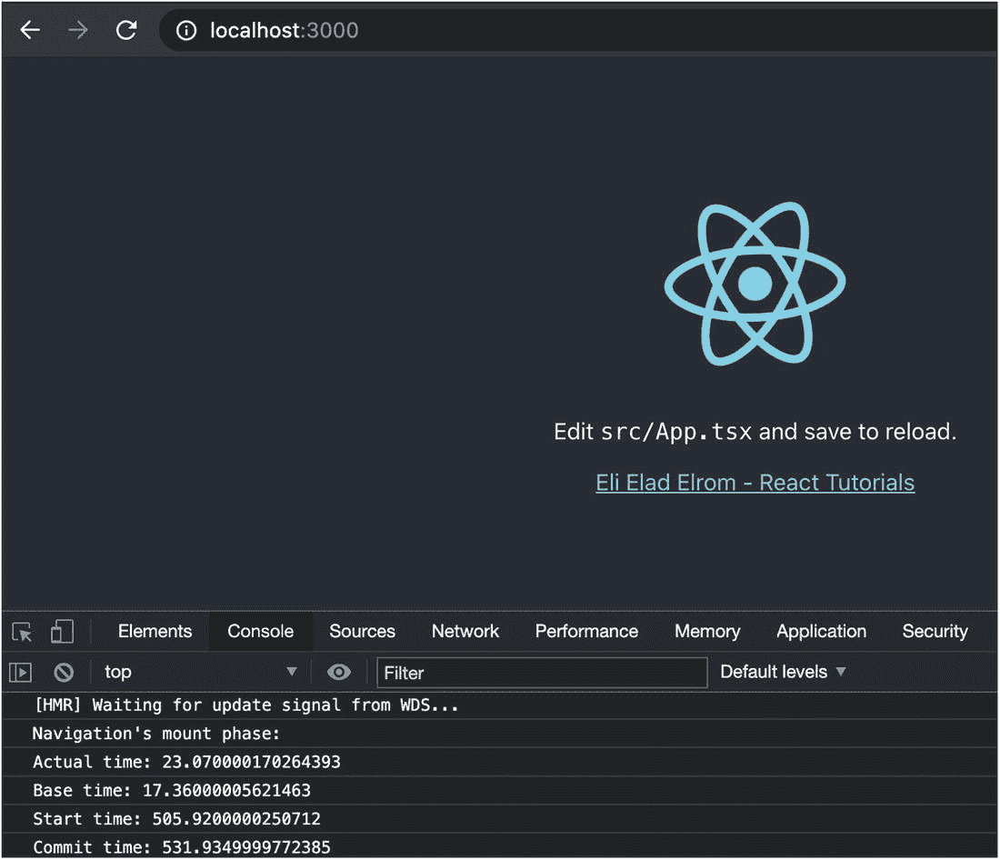

# 十二、发布 React D3 应用

恭喜你读到了这本书的最后一章。你们应该为自己的承诺感到骄傲，我很高兴你们已经走到了这一步。现在我们已经准备好了一些图表，是时候发布 React 和 D3 代码了。

有很多因素要考虑，也有很多选择。作为团队领导、创业顾问、首席技术官或任何技术专家，您可能需要决定使用哪种工具。那么，你应该选哪个呢？

在这一章中，您将了解一些可以为 React starter 项目选择的最佳选项。此外，我将向您介绍创建一个 SPA React 应用和一个 SSR React 应用的示例并发布代码的过程。

本章分为以下几节:

*   选择您的启动项目

*   使用 Next.js 创建和发布 SSR 应用

*   与 CRA 一起创建和发布水疗中心

*   有用的调试分析工具

我们开始吧。

## 选择您的启动项目

在许多情况下，为开发环境选择技术栈已经为您完成了。然而，如果你需要推荐一个技术栈(即使你还不需要发布你的应用)，创建一个已发布的版本是一个很好的实践。

### 为什么在开发阶段发布构建？

创建一个已发布的版本是很重要的，因为与那些已经优化并准备好进行部署的库相比，它给你一个更真实的版本。

当你在做你的项目时。代码中的变化可能是显著的，重要的是不断地创建发布的构建，而不是等到冲刺结束的最后一分钟才发现构建被破坏了或者没有按预期工作。

我坚信你应该快速发布，经常发布，甚至一天两次。

### 你应该选择什么工具？

当决定选择什么工具时，有许多付费和免费的解决方案和选择，在发布您的作品方面，它可能会变得势不可挡。

此外，您可以选择使用 React 作为 SPA，而不是选择 SSR，使用完全配置的服务器，如 Ubuntu 或 Windows，或者作为无配置解决方案的无服务器。

归结起来就是你需要集成哪些其他技术、使用、成本、维护、要部署的语言、你的个人偏好、团队经验、社区支持以及许多其他因素。

为了给你一个看待它的方法，我创建了图 [12-1](#Fig1) 中的高层活动图。此图表可以帮助您决定如何从头到尾规划您的发布选项。请注意，这个活动图是简化的，没有深入到应该考虑的所有细节。

在每个选项中，都有多个选项。例如，当你扩大规模时，免费的解决方案通常会开始收费，所以应该检查并考虑这一点。



图 12-1

选择启动 React 项目并发布的活动图

### SPA 与 SSR

一旦你决定使用 React 作为你的网络技术，我建议你采取的第一步是决定你的应用是作为单页应用(SPA)还是具有服务器端渲染(SSR)。

使用动态内容而不是简单的静态页面可以改善用户体验，提高参与度。例如，考虑一下您的代码可能包含的这些特性:交互、动画、运行时的动态数据更新、处理数千条记录、单个页面上放置的组件数量等等。

使用 SPA 时，渲染在客户端完成，外部资源的使用受到限制。服务器端呈现是应用在服务器上显示内容的能力，而不是像在单页应用中那样在浏览器中呈现内容。

有时使用 SSR 比 SPA 更受欢迎。关于何时以及为何在 SPA 上使用 SSR，有许多考虑因素，这又回到团队的经验、技术栈、性能、代码大小以及许多其他考虑因素。

SSR 的建立是为了支持 SEO，服务于静态页面；然而，SPAs 也可以用额外的库来设置，这样内容就可以被缓存，甚至可以离线工作，就像你在前一章看到的那样。这可以通过使用 useCallback、预渲染、预取和预缓存等技术优化 SPA 来实现，正如您在上一章中看到的那样。

在我看来，SSR 相对于 spa 的最大优势是当您需要以下内容时:

*   用户机器少缴税

*   能够与后端 Node.js 共享代码

以下是 SSR 优于 SPA 的缺点:

*   SSR 增加了应用的复杂性。

*   如果服务器繁忙，SSRs 会降低响应时间。

您可能已经在使用 SSR 或 SPA，那么我如何在两者之间转换呢？

即使您选择了 SPA，并且需要将项目转换为 SPA，反之亦然，如果构建正确，React component 的第一个范例是为拖放组件而构建的，因此您应该能够通过移动组件来设置项目。

### SPA 和 SSR 启动项目

一旦你决定了 SSR 和 SPA，你需要决定你想要使用的启动库。使用一个启动项目是很棒的，因为你不需要配置项目，你可以马上开始。在我们的书的例子中，你看到了我们是多么容易能够和 CRA·MHL 一起快速启动项目。

然而，由于模板是香草味的，所以它是通用的，您需要努力添加和/或删除您使用或需要的任何基于 React 的库。

CRA ( [然而，这个启动项目是基于 SPA 技术的。](https://github.com/facebook/create-react-app)

将该项目转化为一个纯粹的 SSR 应用是可能的，但这需要退出(您需要自己管理配置)并自行设置。我不推荐这种方法，除非你对移动的部分非常了解。

如果你需要水疗，我会选择 Next.js ( [`https://nextjs.org/`](https://nextjs.org/) )。在撰写本文时，Next.js 是最受欢迎的基于 SSR 的 React starter 项目(在 GitHub 上有 63，000 颗星)，并被许多成功的公司使用，如网飞、GitHub、Hulu 和优步。

除了 CRA 和 Next.js 之外，许多其他入门库也在不断发展壮大，它们都是为了增强特定需求而构建的。以下是一些例子:

*   *Gatsby* :它提供了 PayPal、Spotify、IBM 等公司使用的无服务器渲染。 [`https://www.gatsbyjs.com/`见](https://www.gatsbyjs.com/)。(这与 Next.js 的受欢迎程度非常接近。)

*   *React 样板*:这个侧重于离线模式和可伸缩性( [`https://github.com/react-boilerplate/react-boilerplate`](https://github.com/react-boilerplate/react-boilerplate) )。

*   *React Slingshot* :这个是用 Redux，Babel，hot reloading，more ( [`https://github.com/coryhouse/react-slingshot`](https://github.com/coryhouse/react-slingshot) )等一些自以为是的库搭建的。

*   *Razzle* :这是基于 SSR 的，没有配置( [`https://github.com/jaredpalmer/razzle`](https://github.com/jaredpalmer/razzle) )。

此外，您可以从头开始您的项目，安装您自己需要的库，以及管理您自己的配置。它确实需要更多的努力来设置，但你可以确保你的项目像手套一样适合你的需要。

### 发布您的 React 代码

在发布你的作品方面有如此多的解决方案和选择，如果你需要自己选择技术，这可能会变得势不可挡。

例如，有一些免费的解决方案(在撰写本文时是免费的)非常适合于概念证明(POC)或小型或非商业项目。

*   github pages-github 页面

*   你看

*   Firebase(火力基地)

*   网易

*   赫罗库

*   和许多其他人

除了免费入门的平台，还有传统的付费解决方案，比如设置传统服务器以及无服务器解决方案。以下是几个例子:

*   亚马逊 AWS(参见 Lambda for serverless)

*   阿祖拉(参见无服务器的 Azure 函数)

*   阿里云(见无服务器功能计算)

*   和许多其他人

请记住，今天许多解决方案都是免费的，基于试用，基于您的早期使用，或者两者兼而有之；然而，一旦你开始使用这些资源，账单就会接踵而来。

您应该估计您的资源使用情况，以备扩大规模或试用期结束时使用，因此请确保阅读细则并经常阅读。此外，在“计费”部分设置警报(如果存在)。我在这里并不是以任何方式推荐任何工具；在选择解决方案之前，先做自己的研究。

公司如何负担得起免费提供服务？大多数云服务意识到，收集美分变成了数百万，并且通常需求增长超过了最低使用量。如果没有很好地记录设置过程，迁移到不同的解决方案会很困难。

Tip

我强烈建议您记录您如何设置项目，以避免与解决方案结合。价格和条款经常变化。

在本章的下一节，我将向你展示如何用 Next.js 建立一个初学者项目并发布作品。

## 用 Next.js 创建和发布 SSR

到目前为止，在本书中，我们已经使用 CRA 为我们的项目。在这一节中，我们将使用 Next.js 创建一个 starter 项目。唯一的先决条件是安装 Node.js 和 Yarn，我们已经安装了。

### 设置 Next.js 启动项目

让我们用最少的代码用一个 D3 库建立一个简单的 Next.js React 项目。

```jsx
$ yarn create next-app

```

当它在终端问我“你的项目叫什么？”我选择了 nextjs-ts-chart，但是当然您可以使用任何您喜欢的名称。安装完成后，您可以将目录更改为`nextjs-ts-chart.`

```jsx
$ cd nextjs-ts-chart

```

下载完库后，运行应用。

```jsx
$ yarn run dev
$ open localhost:3000

```

#### 安装 TypeScript

Next.js 默认用 js 设置；然而，我强烈建议用类型检查器的 TypeScript 来设置你的项目，就像我们用 CRA 一样。

```jsx
$ yarn add -D typescript @types/react @types/node

```

当我们运行这些库时，请注意,`tsconfig.json`文件会自动添加到您的项目中。

#### 安装 D3

我要安装的最后一个库是 D3，用来帮我画一些图形。因为我只使用 select 模块，所以我可以只安装我需要安装的整个 D3 全局库。

```jsx
$ yarn add d3-selection @types/d3-selection

```

#### 矩形. tsx

现在项目已经设置好了。我将使用 React 的函数组件，用简单的 D3 代码设置项目。创建一个`components`文件夹，并添加我们在前面章节中使用的`Rectangle.tsx`组件。

```jsx
// components/Rectangle/Rectangle.tsx

import React, { useEffect, RefObject } from 'react'
import { select } from 'd3-selection'

const Rectangle = () => {
  const ref: RefObject<HTMLDivElement> = React.createRef()

  useEffect(() => {
    draw()
  })

  const draw = () => {
    select(ref.current).append('p').text('Hello World')
    select('svg').append('g').attr('transform', 'translate(250, 0)').append('rect').attr('width', 500).attr('height', 500).attr('fill', 'tomato')
  }

  return (
    <div className="Rectangle" ref={ref}>
      <svg width="500" height="500">
        <g transform="translate(0, 0)">
          <rect width="500" height="500" fill="green" />
        </g>
      </svg>
    </div>
  )
}

export default Rectangle

```

#### 更新 index.ts

接下来，为了包含`Rectangle.tsx`组件并使用 TS，将索引从`index.js`更改为`index.ts`，并添加我们刚刚创建的`Rectangle.tsx`组件。最后，删除剩余的代码。下面是完整的`index.tsx`组件:

```jsx
// src/component/pages/index.tsx

import Rectangle from "../components/Rectangle/Rectangle"
import styles from '../styles/Home.module.css'
import React from "react";

export default function Home() {
  return (
    <div className={styles.container}>
      <Rectangle />
    </div>
  )
}

```

看看最后的结果，如图 [12-2](#Fig2) 所示。


图 12-2

Next.js starter 项目中我的自定义 React + D3 组件

### 用 Express 发布 Next.js

现在我们已经准备好了我们的应用，一种方法是在 Express 服务器上发布应用。

为此，安装`express`库( [`https://github.com/expressjs/express`](https://github.com/expressjs/express) )作为开发人员依赖项。

```jsx
$ yarn add -D express

```

#### server.js

接下来，让我们创建一个可以为我们的应用服务的`express`服务器文件。在代码级别，我允许您传递将要使用的端口，或者将其设置为端口 9000(可以随意更改为端口 3000 或您喜欢的任何端口)。

我还允许传递一个`NODE_ENV`以便应用知道它是在开发还是在生产中运行。

```jsx
// server.js
const express = require('express')
const next = require('next')const port = process.env.PORT || 9000;
const dev = process.env.NODE_ENV !== 'production'
const app = next({ dev })
const handle = app.getRequestHandler()app.prepare()
    .then(() => {
        const server = express()        server.get('*', (req, res) => {
            return handle(req, res)
        })        server.listen(port, (err) => {
          if (err) throw err
            console.log(`Server Ready on http://localhost:${port}`)
        })
    })
    .catch((ex) => {
        console.error(ex.stack)
        process.exit(1)
    })

```

既然我们已经设置了 Node.js `express`服务器代码，我们需要构建应用的发布版本。这是使用在`package.json`文件中为我们设置的运行脚本完成的。

```jsx
$ yarn build

```

因为我们是在本地机器上部署应用，所以我们需要在终端中设置一个环境变量。在 Windows 上，您可以这样做:

```jsx
$ SET NODE_ENV=development

```

在 macOS/Linux 上，您可以这样做:

```jsx
$ export NODE_ENV=development

```

使用 Node 运行`express`服务器，并在端口 9000 上打开 localhost 以查看结果。

```jsx
$ node server.js
$ open http://localhost:9000/

```

如果我们想在任何支持`express`的服务器上部署这个应用，比如 Ubuntu，只需复制文件并运行服务器脚本，将`NODE_ENV`变量设置为 production。

```jsx
$ export NODE_ENV=production

```

### 用 Heroku 发布 Next.js 无服务器

我们已经看到我们的 SSR React 应用在内部 Next.js 脚本以及我的自定义 Node.js Express 服务器脚本的帮助下运行。一旦您理解了该过程并多次练习，就可以轻松地使用不需要配置的无服务器选项进行生产。

正如我提到的，在野外有很多免费和付费的解决方案。

Heroku 就是其中之一。首先，你需要创建一个账户: [`https://signup.heroku.com/`](https://signup.heroku.com/) 。

您还需要 Heroku CLI。

对于使用 brew 的 macOS 用户，只需在终端中运行以下命令:

```jsx
$ brew tap heroku/brew && brew install heroku

```

对于 Windows 用户，请下载安装程序。

[T2`https://devcenter.heroku.com/articles/heroku-cli`](https://devcenter.heroku.com/articles/heroku-cli)

接下来，在终端中，您需要登录到该帐户。login 命令将打开您的浏览器，要求您登录并确认。

```jsx
$ heroku loginLogging in... done
Logged in as [your email address]

```

现在我们准备创建 Heroku 项目。在项目路径中，键入`Heroku`和您的项目名称。这将创建项目并设置您的公共地址和 Git 位置。

```jsx
$ heroku create nextjs-ts-chart
Creating ⬢ nextjs-ts-chart... donehttps://nextjs-ts-chart.herokuapp.com/ | https://git.heroku.com/nextjs-ts-chart.git

```

在我们发布之前，还有一个步骤。我们需要用一个指向我们创建的服务器文件的`start` run 命令在`pacakge.json`上设置我们的运行脚本。Heroku 将自动使用该启动命令。

由此改变`package.json`:

```jsx
// package.json"scripts": {
  "start": "next start"
  ..
}

```

致以下内容:

```jsx
// package.json"scripts": {
  "start": "node server.js"
  ..
}

```

接下来，让我们使用`package.json run build`命令脚本创建构建并推送到 Heroku 服务器。

```jsx
$ yarn run build
$ git remote
$ git push heroku master

```

正如你所看到的，用 Next.js 创建一个启动项目，运行一个已发布的版本，然后发布你的代码，这很简单，我们只需要做很少的工作，就像我们用 CRA 做的一样。

### 使用 Heroku 的常见有用命令

一旦你做了修改，就像你平常用 Git 做的那样。

```jsx
$ git add && git commit -m 'change' && git push heroku master

```

如果您在主服务器之外的 Git 分支上(例如 dev、main 或 production ),您可以通过设置分支名称来避免此错误:“主服务器不匹配任何错误，无法将一些引用推送到 Heroku”。

```jsx
$ git push heroku [branch name]:master

```

这里有一个例子:

```jsx
$ git push heroku HEAD:master

```

最后，假设您想要删除我们刚刚创建的回购。只需使用以下代码:

```jsx
$ git remote rm heroku

```

如果您需要检查任何错误，请使用`tail`标志。

```jsx
$ heroku logs --tail

```

## 与 CRA 一起创建和发布 SPA

使用 CRA MHL，让我们用`cra-ts-chart`创建一个新项目。

```jsx
$ yarn create react-app cra-ts-chart --template must-have-libraries
$ cd cra-ts-chart
$ yarn start
$ open http://localhost:3000

```

### 矩形. tsx

接下来，使用我们之前创建的相同的`Rectangle.tsx`组件，并将其放在这里:`src/components/Rectangle/Rectangle.tsx`。

### App.tsx

正如我们对 Next.js 所做的那样，添加父组件`App.tsx`中的组件`Rectangle.tsx`，并删除其余的样板代码。

```jsx
// src/App.tsx

import React from 'react'
import './App.scss'
import Rectangle from './components/Rectangle/Rectangle'

function App() {
  return (
    <div className="App">
      <Rectangle />
    </div>
  )
}

export default App

```

### 发布 CRA 与服务

发布 CRA 代码最简单的方法是使用 CRA `serve`并让它处理剩下的事情。

使用我用一个命令添加的 CRA·MHL 模板项目的运行脚本。

```jsx
$ yarn build:serve

```

如果您检查`package.json`，您可以看到这个运行脚本运行另外两个运行脚本:

```jsx
$ yarn build && serve -s build

```

请记住，相同的脚本也适用于 Next.js。这将打开带有已发布脚本的浏览器。

该脚本创建了一个优化版本的应用，并将其设置在端口 5000 上(如果未使用)，如图 [12-3](#Fig3) 所示。



图 12-3

使用 serve 运行已发布的版本

若要关闭服务器，请在 Mac 上按 Command+C(或在 PC 上按 Control+C)来关闭服务器。

### 用快递发布 CRA

接下来，我们可以用与设置 Next.js 相同的方式设置 CRA 和 Express

将 Express 作为开发人员依赖项安装。

```jsx
$ yarn add -D express

```

#### Server.js

接下来，让我们创建一个`express` Node.js 文件，类似于我们为 Next.js 创建的文件。我使用`process.env.PORT`或端口 9000，并以`index.html`作为入口点指向构建目录。

```jsx
const express = require('express')
const path = require('path')
const server = express()

const publicFolder = path.join(__dirname, 'build')
const port = process.env.PORT || 9000;

server.use(express.static(publicFolder))
server.get('*', (req, res) => {
  res.sendFile(path.join(publicFolder, 'index.html'))
});

server.listen(port, (err) => {
  if (err) throw err
    console.log(`Server Ready on http://localhost:${port}`)
})

```

运行它来测试。

```jsx
$ node server.js

```

### 用 Heroku 发布 CRA 无服务器

用 Heroku 发布我们的 CRA 无服务器，步骤和 Next.js 一样，我们已经有了 Heroku CLI，所以不需要重新安装。从登录部分开始，如下所示:

```jsx
$ heroku login

```

该命令应该会打开一个浏览器，允许您登录并接受。

接下来，创建项目名称，您将看到与 Next.js 步骤中相同的 Git 和公共 URL。

```jsx
$ heroku create cra-ts-chartCreating ⬢ cra-ts-chart... donehttps://cra-ts-chart.herokuapp.com/ | https://git.heroku.com/cra-ts-chart.git

```

我们需要为 Heroku 添加一个运行脚本。

```jsx
// package.json"scripts": {
  "start": "node server.js",
  ..}

```

最后一部分和之前一样。运行构建并将代码推送到 Heroku repo。

```jsx
$ yarn build

$ git remote
$ git push heroku master

```

现在，看到那个 [`https://cra-ts-chart.herokuapp.com/`](https://cra-ts-chart.herokuapp.com/) 被部署到 Heroku。

```jsx
$ heroku open

```

见图 [12-4](#Fig4) 。



图 12-4

在 Heroku 上发布的项目

CRA 在 [`https://create-react-app.dev/docs/deployment/`](https://create-react-app.dev/docs/deployment/) 有一个发布选项页面。

## 有用的调试分析工具

现在您已经发布了您的应用，您可能会发现一两个错误，需要修复您的应用。调试是检测和删除代码中可能导致不良行为的错误(也称为*bug*)的常见做法。

当您使用 React 应用时，当遇到问题时，可以使用一些特定的有用工具来调试和分析您的应用。拥有适合工作的工具并知道如何使用它们可以消除棘手问题并加快流程。

React 基于 JavaScript，所有适用于任何基于 JS 的应用的工具都可以在 React 上工作。诸如检查 DOM 元素、IDE 调试、设置警告和控制台消息等技术都是有效的。

我不打算展示简单和通用的方法来调试和分析你的应用，因为这本书假设你有一些 React、HTML 和 JavaScript 的工作知识；然而，请随意查看我的另一本 React 书:

[T2`https://www.apress.com/gp/book/9781484266953`](https://www.apress.com/gp/book/9781484266953)

此外，您可以在线查看我的两篇文章:

*   [T2`https://medium.com/react-courses/six-best-debugging-options-to-crush-your-reacts-bugs-like-a-champion-70b11b6a1a2d`](https://medium.com/react-courses/six-best-debugging-options-to-crush-your-reacts-bugs-like-a-champion-70b11b6a1a2d)

*   [T2`https://medium.com/react-courses/4-ways-to-profile-your-react-app-75b740e39ab2`](https://medium.com/react-courses/4-ways-to-profile-your-react-app-75b740e39ab2)

这些资源强调了一些你可能不知道的方法。

在本章的最后一节，我想指出一些额外的工具，一旦你发布了你的代码，它们可以帮助你完成工作。

下面是我将要介绍的调试和分析工具:

*   使用 Chrome DevTools 进行调试和配置

*   React Chrome 开发工具扩展

*   React 探查器 API

### 使用 Chrome DevTools 进行调试和配置

Chrome DevTools extensions 是用于调试和分析应用的标准工具，也是最常用的工具之一。如果你需要在其他浏览器中测试一个应用，记住他们也提供类似 Chrome 的开发工具。

#### 什么是 Chrome DevTools 扩展？

React 团队以及 React 社区构建了一个 Chrome DevTools 扩展，可以提供帮助。

这里有三个有用的 React development DevTools 扩展管理工具:

*   React 开发者工具: [`https://chrome.google.com/webstore/detail/react-developer-tools/fmkadmapgofadopljbjfkapdkoienihi`](https://chrome.google.com/webstore/detail/react-developer-tools/fmkadmapgofadopljbjfkapdkoienihi)

*   意识到 React 过来: [`https://chrome.google.com/webstore/detail/realize-for-react/llondniabnmnappjekpflmgcikaiilmh`](https://chrome.google.com/webstore/detail/realize-for-react/llondniabnmnappjekpflmgcikaiilmh)

*   反冲: [`https://chrome.google.com/webstore/detail/recoil-dev-tools/dhjcdlmklldodggmleehadpjephfgflc`](https://chrome.google.com/webstore/detail/recoil-dev-tools/dhjcdlmklldodggmleehadpjephfgflc)

#### React 开发者工具 Chrome DevTools 扩展

React 开发者工具允许你在 Chrome 开发者工具中检查 React 组件层次结构。我们在你的 Chrome 开发工具中获得了两个新标签:⚛组件和⚛剖析器。

为了测试这个工具，我使用我的网站并导航到 [`https://elielrom.com/Books`](https://elielrom.com/Books) 。

我们可以看到很多关于组件和 React 的信息，比如 React 的版本(在我的例子中是`v17-rc.0`)、`0s`、路由信息和组件层次结构，如图 [12-5](#Fig5) 所示。



图 12-5

React 开发人员工具—组件窗口

第二个选项卡用于 Profiler，在这里我们可以记录一个产品概要构建。

#### React 开发工具 Chrome DevTools 扩展中的探查器

React Developer Tools Chrome DevTools 扩展有两个选项卡:组件和概要分析器。Profiler 选项卡提供了对 Flamegraph 的深入了解。

Flamegraph 是一个有序的图表工具，显示每个组件渲染所用的总时间。颜色表示渲染时间(越绿越好)，以及从 VDOM 到“真实”DOM 渲染或重新渲染这些变化所花的时间。它包括排名和互动的标签。见图 [12-6](#Fig6) 。



图 12-6

我的开发版本的火焰图结果

记住，我们创建了一个运行脚本来分析生产构建。您可以比较优化版本和开发版本的不同结果。图 [12-7](#Fig7) 显示了生产构建(`$ yarn build:profile`)的分级分析结果。



图 12-7

我的生产版本的排名结果

您还可以选择进入您的产品版本，以使概要分析工作正常进行。请记住，在生产版本上设置概要分析确实会带来一些开销。

#### React Chrome DevTools 扩展的实现

组件是 React 的核心。一旦你安装了 React 开发工具，有一个很棒的工具可以帮助你可视化 React 组件树。该工具有助于跟踪状态，并为您提供组件层次结构的整体概述。见图 [12-8](#Fig8) 。



图 12-8

在 [`https://EliElrom.com`](https://elielrom.com) 上实现 React Chrome DevTools

这种全面的概述正在我的个人网站上整齐地分解`AppRouter.tsx`文件。

#### Recoil Chrome DevTools Extension(回收铬 DevTools 扩展)

当使用诸如 Redux 或反冲之类的状态管理时，能够跟踪状态的内部工作将会非常有用。有很多关于 Redux Chrome DevTools 扩展的文章，但我想指出一个我们在书中使用的用于状态管理的新反冲工具。该工具提供了关于原子、选择器和订阅者的信息。参见图 [12-9](#Fig9) 。



图 12-9

回火铬债务工具在 [`https://EliElrom.com`](https://elielrom.com)

在我的例子中，atom 是基于`bookObject,`的，我可以在浏览器中检查状态值和变化。

```jsx
export interface bookObject {
  title: string
  author: string
  pubDate: string
  link: string
  thumbnail: string
}

```

### React 探查器 API

React Profiler API ( [`https://reactjs.org/docs/profiler.html`](https://reactjs.org/docs/profiler.html) )包括一个`<Profiler/>`组件，帮助定制来自源代码的度量标准，以测量组件的生命周期时间。

为了测试这个组件，您可以用 CRA 模板项目建立一个新的项目。

```jsx
$ yarn create react-app your-project-name --template must-have-libraries

```

接下来重构路由`AppRouter.tsx`，用`<Profiler/>`组件包装；见图 [12-10](#Fig10) 。



图 12-10

CRA-MHL 模板开发构建的探查器 API 结果

```jsx
// src/AppRouter.tsx

import { Profiler } from 'react'

const AppRouter: FunctionComponent = () => {
  return (
    <Profiler onRender={(id, phase, actualTime, baseTime, startTime, commitTime) => {
      console.log(`${id}'s ${phase} phase:`);
      console.log(`Actual time: ${actualTime}`);
      console.log(`Base time: ${baseTime}`);
      console.log(`Start time: ${startTime}`);
      console.log(`Commit time: ${commitTime}`);
    }}>
    <Router>
      <RecoilRoot>
        <Suspense fallback={<span>Loading...</span>}>
          <Switch>
            <Route exact path="/" component={App} />
          </Switch>
        </Suspense>
      </RecoilRoot>
    </Router>
    </Profiler>
  )
}

```

在这个例子中，我记录了所有的事情，但是我们可以创建一个脚本来过滤结果并以不同的方式处理它们。

## 摘要

如您所见，在选择启动项目和发布 React 应用时，您有很多选择。首先，决定是使用 SPA 还是 SSR，接下来选择启动项目，然后选择 server 或 serverless。归结起来就是你需要将 React 项目与哪些其他技术集成，使用，成本，维护，语言，你个人和团队的经验，以及许多其他事实。

在本章的最后一部分，我向您展示了一些有用的调试和分析工具，它们可以在您的开发之旅中为您提供帮助。我想感谢你购买这本书，并祝贺你完成它。

查看我的 d3 和 React 交互课程，看看你可以用不同的方法、见解和更多的解释来实现本书中的所有例子。

互动课程包含更多主题的材料，例如，对 DOM、色彩空间、交互性、设计进行更多控制，以及扩展本书的内容。互动课程补充了这本书，可以帮助你掌握 React 和 D3； [`https://elielrom.com/BuildSiteCourse`](https://elielrom.com/BuildSiteCourse) 。

把你和这本书的社交媒体帖子发给我，我会收到互动课程的折扣代码。

如果你用这本书制作了一个很酷的带有 React 图表的 D3，我很乐意收到你的来信并看看你的图表。请给我留言并分享:

*   [T2`https://elielrom.com/Contact`](https://elielrom.com/Contact)

*   [T2`https://twitter.com/EliEladElrom`](https://twitter.com/EliEladElrom)

*   [T2`https://www.linkedin.com/in/eladelrom`](https://www.linkedin.com/in/eladelrom)