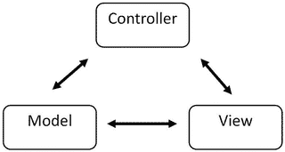

# 一、什么是 React？

Electronic supplementary material The online version of this chapter (doi:[10.​1007/​978-1-4842-1245-5_​1](http://dx.doi.org/10.1007/978-1-4842-1245-5_1)) contains supplementary material, which is available to authorized users.

看到一个不可救药的不墨守成规者的固执受到热烈欢迎，我确实感到非常高兴。—阿尔伯特·爱因斯坦

您可能对这本书有一定程度的 JavaScript 知识。您也很有可能知道 React 是什么。本章强调了 React 作为一个框架的关键方面，解释了它所解决的问题，并描述了如何利用本书中包含的特性和其他信息来改进您的 web 开发实践，并使用 React 创建复杂但可维护的用户界面。

## 定义 React

React 是一个 JavaScript 框架。React 最初是由脸书的工程师创建的，旨在解决开发复杂的用户界面时遇到的挑战，这些界面的数据集会随着时间的推移而变化。这不是一个微不足道的任务，不仅要可维护，而且要可扩展到脸书的规模。React 实际上诞生于脸书的广告公司，他们一直在利用传统的客户端模型-视图-控制器方法。诸如此类的应用通常由双向数据绑定和呈现模板组成。React 通过在 web 开发方面取得一些大胆的进步，改变了创建这些应用的方式。当 React 在 2013 年发布时，web 开发社区对 React 所做的事情既感兴趣，又似乎感到厌恶。

正如您将在本书中发现的，React 挑战了已经成为 JavaScript 框架最佳实践事实上的标准的惯例。React 通过引入许多新的范例和改变创建可伸缩和可维护的 JavaScript 应用和用户界面的现状来做到这一点。随着前端开发心态的转变，React 提供了一组丰富的功能，使得许多技能水平的开发人员都可以编写单页应用或用户界面——从刚接触 JavaScript 的人到经验丰富的 web 老手。当你阅读这本书时，你会看到这些特性——比如虚拟 DOM、JSX 和 Flux 概念——并发现它们如何被用来创建复杂的用户界面。

简而言之，您还将看到脸书如何用 React Native 不断挑战开发领域。React Native 是一个新的开源库，利用与 React 的 JavaScript 库相同的原理来创建原生用户界面。通过创建原生 UI 库，React 推动了其“一次学习，随处编写”的价值主张。这种范式转变适用于能够利用 React 的核心概念来制作可维护的接口。到目前为止，您可能认为在开发方面没有 React 做不到的事情。事实并非如此，为了进一步理解 React 是什么，您需要理解 React 不是什么，这将在本章的后面学习。首先，您将了解导致 React 创建的潜在问题，以及 React 如何解决这些问题。

## 为什么要 React？

如前所述，对于一般的 web 开发来说，React 是一个不同的概念。这是对普遍接受的工作流程和最佳实践的转变。为什么脸书回避了这些趋势，转而支持创建一个全新的 web 开发过程的愿景？挑战公认的最佳实践是不是非常漫不经心，或者创建 React 是否有一个通用的商业案例？

如果你看看 React 背后的推理，你会发现它是为了满足脸书面临的一系列特定技术挑战的特定需求而创建的。这些挑战过去和现在都不是脸书所独有的，但脸书所做的是用自己解决问题的方法直接应对这些挑战。您可以把这看作是 Eric Raymond 在他的书《Unix 编程的艺术》中总结的 Unix 哲学的类比。在这本书里，Raymond 写了模块化规则，它是这样写的:

> The only way to write complex software is to reduce its global complexity-build it with simple parts with well-defined interfaces-so that most of the problems are local, and you can hope to upgrade a part without destroying the whole.

这正是 React 在解决复杂用户界面问题时采用的方法。脸书在开发 React 时，并没有创建一个完整的模型-视图-控制器架构来取代现有的框架。没有必要重新发明那个特殊的轮子，增加创建大规模用户界面问题的复杂性。React 的创建是为了解决一个特殊的问题。

React 是为了处理在用户界面中显示数据而构建的。您可能认为在用户界面中显示数据是一个已经解决的问题，您这样想是正确的。不同之处在于，React 是为大规模用户界面(脸书和 Instagram 规模的界面)服务的，其数据会随着时间的推移而变化。这种接口可以用 React 之外的工具创建和解决。事实上，脸书在创建 React 之前肯定已经解决了这些问题。但脸书确实创造了 React，因为它有有效的推理，并发现 React 可以用来解决构建复杂用户界面时遇到的特定问题。

## React 解决什么问题？

React 并没有着手解决你在用户界面设计和前端开发中会遇到的每一个问题。React 解决一组特定的问题，通常是一个问题。正如脸书和 Instagram 所说，React 用随时间变化的数据构建大规模用户界面。

数据随时间变化的大规模用户界面可能是许多 web 开发人员在他们自己的工作或爱好编码经历中可能会涉及到的东西。在现代 web 开发世界中，您通常会将用户界面的大部分职责交给浏览器和 HTML、CSS 和 JavaScript。这些类型的应用通常被称为单页面应用，其中对服务器的常见请求/响应仅限于展示浏览器的强大功能。这是自然的；既然大多数浏览器都能够进行复杂的布局和交互，为什么不这样做呢？

当您的周末项目代码不再可维护时，问题就出现了。您必须“附加”额外的代码片段来使数据正确绑定。有时，您必须重新构建应用，因为次要的业务需求无意中破坏了用户开始一项任务后界面呈现一些交互的方式。所有这些导致用户界面脆弱，高度互联，不容易维护。这些都是反动派试图解决的问题。

以客户端的模型-视图-控制器架构为例，它在前面提到的模板中有双向数据绑定。这个应用必须包含监听模型的视图，然后视图根据用户交互或模型变化独立地更新它们的表示。在一个基本的应用中，这并不是一个明显的性能瓶颈，更重要的是，对于开发人员的工作效率而言。随着新的模型和视图添加到应用中，这个应用的规模将不可避免地增长。这些都是通过微妙而复杂的代码连接在一起的，这些代码可以指导每个视图及其模型之间的关系。这很快变得越来越复杂。位于渲染链深处或远处模型中的项目现在会影响其他项目的输出。在许多情况下，开发人员甚至可能不完全知道发生的更新，因为维护跟踪机制变得越来越困难。这使得开发和测试您的代码更加困难，这意味着开发一个方法或新特性并发布它变得更加困难。代码现在不太容易预测，开发时间也急剧增加。这正是 React 着手解决的问题。

起初，React 是一个思想实验。脸书认为他们已经编写了初始布局代码来描述应用可能和应该是什么样子，那么为什么不在数据或状态改变应用时再次运行启动代码呢？您现在可能正在畏缩，因为您知道这意味着他们将牺牲性能和用户体验。当你在浏览器中完全替换代码时，你将会看到屏幕的闪烁和无样式内容的闪现。这只会显得效率低下。脸书知道这一点，但也指出，它确实创造了一种在数据变化时替代状态的机制，这种机制实际上在某种程度上是有效的。脸书然后决定，如果替换机制可以优化，它将有一个解决方案。这就是 React 作为一组特定问题的解决方案是如何诞生的。

## React 不仅仅是另一个框架

在很多情况下，当你学东西的时候，你首先需要意识到你正在学的东西是什么。对于 React，了解哪些概念不是 React 框架的一部分会很有帮助。这将有助于您理解，为了完全理解 React 等新框架的概念，您所学习的哪些标准实践需要被抛弃，或者至少需要被搁置。那么是什么让 React 与众不同，为什么它很重要？

许多人认为 React 是一个全面的 JavaScript 框架，与其他框架相比，如 Backbone、Knockout.js、AngularJS、Ember、CanJS、Dojo 或现有的众多 MVC 框架中的任何一个。图 [1-1](#Fig1) 显示了一个典型 MVC 框架的例子。

图 1-1。

A basic MVC architecture

图 [1-1](#Fig1) 显示了模型-视图-控制器架构中每个组件的基础。模型处理应用的状态，并向视图发送状态改变事件。视图是面向用户的外观和最终用户的交互界面。视图可以向控制器发送事件，在某些情况下，还可以向模型发送事件。控制器是事件的主要调度器，可以将事件发送到模型以更新状态，发送到视图以更新表示。您可能会注意到，这是 MVC 架构的一般表示，实际上有如此多的变体和定制实现，以至于没有单一的 MVC 架构。重点不是陈述 MVC 结构是什么样子，而是指出 React 不是什么样子。

这种 MVC 结构实际上并不是对 React 是什么或打算成为什么的公平评估。这是因为 React 是这些框架中的一个特殊部分。React 最简单的形式，只是这些 MVC、MVVM 或 MV*框架的观点。正如您在上一节中看到的，React 是一种描述应用用户界面的方法，也是一种随着数据的变化而改变的机制。React 由描述接口的声明性组件组成。React 在构建应用时不使用可观察的数据绑定。React 也很容易操作，因为您可以使用您创建的组件并组合它们来制作定制组件，因为它可以伸缩，所以每次都可以按照您的预期工作。React 可以比其他框架更好地伸缩，因为它从创建之初就遵循这些原则。当创建 React 接口时，您以这样的方式构建它们，即它们是由多个组件构建的。

让我们暂停一分钟，检查几个框架的最基本结构，然后将它们进行比较，以便突出差异。对于每个框架，您将检查为 [`http://todomvc.com`](http://todomvc.com/) 网站创建的最基本的待办事项列表应用。我不打算嘲笑其他框架，因为它们都有一个目的。相反，我试图展示 React 与其他相比是如何构建的。在这里，我只展示了重要的部分来突出和限制应用的完全重建。如果你想看完整的例子，链接到源包括在内。尽量不要过于关注这些例子的实现细节，包括 React 例子，因为随着你阅读本书的进展，这些概念将会被完整地涵盖，并帮助你完全理解正在发生的事情。

### Ember.js

js 是一个流行的框架，它利用了由把手模板形式的视图组成的 MVC 框架。在本节中，请注意，为了便于模板、模型和控制器的集成，还需要做一些工作。这并不是说 Ember.js 是一个不好的框架，因为修改是这样一个框架的副产品。

在清单 [1-1](#FPar1) 中，它是`TodoMVC Ember.js`例子的主体，您可以看到标记由两个用于待办事项列表和待办事项的手柄模板组成。

Listing 1-1\. Body of TodoMVC with Ember.js

`<body>`

``

``

``

``

``

``

``

``

``

``

``

``

``

``

``

``

`</body>`

除此之外还有三个控制器——一个`app.js`入口点、一个路由和一个`todo`输入视图组件。这看起来像很多文件，但是在生产环境中，这将被最小化。注意控制器和视图的分离。视图，包括清单 [1-2](#FPar2) 中显示的待办列表视图，非常冗长，很容易确定代码做了什么。

Listing 1-2\. Ember.js Handlebars Template

`{{#if length}}`

`<section id="main">`

`{{#if canToggle}}`

`{{input type="checkbox" id="toggle-all" checked=allTodos.allAreDone}}`

`{{/if}}`

`<ul id="todo-list">`

`{{#each}}`

`<li {{bind-attr class="isCompleted:completed isEditing:editing"}}>`

`{{#if isEditing}}`

`{{todo-input`

`type="text"`

`class="edit"`

`value=bufferedTitle`

`focus-out="doneEditing"`

`insert-newline="doneEditing"`

`escape-press="cancelEditing"}}`

`{{else}}`

`{{input type="checkbox" class="toggle" checked=isCompleted}}`

`<label {{action "editTodo" on="doubleClick"}}>{{title}}</label>`

`<button {{action "removeTodo"}} class="destroy"></button>`

`{{/if}}`

`</li>`

`{{/each}}`

`</ul>`

`</section>`

`{{/if}}`

这是一个清晰的例子，可以作为一个可读的视图。如您所料，有几个属性是由控制器指定的。控制器在`router.js`文件中命名，该文件还命名了要使用的视图。该控制器如清单 [1-3](#FPar3) 所示。

Listing 1-3\. Ember.js TodosListController

`(function () {`

`'use strict';`

`Todos.TodosListController = Ember.ArrayController.extend({`

`needs: ['todos'],`

`allTodos: Ember.computed.alias('controllers.todos'),`

`itemController: 'todo',`

`canToggle: function () {`

`var anyTodos = this.get('allTodos.length');`

`var isEditing = this.isAny('isEditing');`

`return anyTodos && !isEditing;`

`}.property('allTodos.length', '@each.isEditing')`

`});`

`})();`

你可以看到这个`TodosListController`采用了一个待办事项模型，并随着`'todo'`的`itemController`添加了一些属性。这个`todo`控制器实际上是大多数 JavaScript 驻留的地方，它规定了在本节前面看到的视图中可见的动作和条件。作为一个熟悉 Ember.js 的人，这是一个定义良好、组织有序的 Ember.js 的例子。然而，它与 React 完全不同，您很快就会看到 React。首先，让我们检查一下 AngularJS `TodoMVC`的例子。

### 安古斯

AngularJS 可能是世界上最流行的 MV*框架。它非常容易上手，并且有 Google 以及许多开发人员的支持，这些开发人员已经参与进来并创建了很棒的教程、书籍和博客帖子。它与 React 当然不是同一个框架，您很快就会看到 React。清单 [1-4](#FPar4) 展示了 AngularJS `TodoMVC`应用。

Listing 1-4\. AngularJS Body

`<body ng-app="todomvc">`

`<ng-view />`

``

``

``

``

``

``

``

``

``

`</body>`

您已经可以看到，与 Ember.js 相比，Angular 在其模板中更具有声明性。您还可以看到，控制器、指令和服务等概念都与这个应用相关联。`todoCtrl`文件保存了驱动这个视图的控制器值。清单 [1-5](#FPar5) 中显示的下一个例子只是这个文件的一个片段，但是您可以看到它是如何工作的。

Listing 1-5\. Todo Controller for AngularJS

`angular.module('todomvc')`

`.controller('TodoCtrl', function TodoCtrl(``$scope`T2】

`/* omitted */`

`$scope.``addTodo`T2】

`var newTodo = {`

`title: $scope.newTodo.trim(),`

`completed: false`

`};`

`if (!newTodo.title) {`

`return;`

`}`

`$scope.saving = true;`

`store.insert(newTodo)`

`.then(function success() {`

`$scope.newTodo = '';`

`})`

`.finally(function () {`

`$scope.saving = false;`

`});`

`};`

`/* omitted */`

`});`

这个例子展示了`todoCtrl`并展示了它如何构建一个`$scope`机制，然后允许您将方法和属性附加到 AngularJS 视图。下一节将深入 React 并解释它如何以不同于 Ember.js 和 AngularJS 的方式作用于用户界面。

### React

正如您在其他例子中看到的，`TodoMVC`应用有一个基本的结构，这使它们成为展示差异的一个简单选择。Ember.js 和 AngularJS 是两个流行的框架，我认为它们有助于证明 React 不是一个 MV*框架，而只是一个用于构建用户界面的基本 JavaScript 框架。本节将详细介绍 React 示例，并向您展示如何从组件级别构建 React 应用，然后反向解释组件是如何组成的。现在，关于 React 的书已经有很多页了，你终于可以在清单 [1-6](#FPar7) 中看到 React 代码。

Note

提供的代码将从 web 服务器上运行。这可以是 Python 中的一个`SimpleHTTPServer`，一个 Apache 服务器，或者任何你熟悉的东西。如果这不可用，您可以在您的浏览器中提供 HTML 文件，但是您需要确保相关的文件是本地的，并且可以被您的 web 浏览器获取。

Listing 1-6\. The Basic HTML of the React Todo App

`<!-- some lines removed for brevity -->`

`<body>`

`<section id="todoapp"></section>`

``

``

``

``

``

``

``

`</body>`

在清单 [1-6](#FPar7) 中，您可以看到基本 React `todoMVC`应用的主体。请注意该部分及其`id`属性。将这个主体与 AngularJS 和 Ember.js 示例进行比较，注意，对于这种类型的应用，脚本标记的数量以及您需要处理的文件数量要少得多。有人可能会说，文件的数量不是一个公平的比较，因为从理论上讲，你可以构建一个 AngularJS 应用，使每个文件包含不止一个控制器，或者找到类似的方法来限制脚本元素的数量。关键是 React 似乎很自然地分裂成这些类型的结构，因为组件的编写方式不同。这并不意味着 React 一定更好，甚至更简洁，而是 React 创建的范例至少使创建组件看起来更简洁。

该部分将是渲染 React 组件时放置它们的目标。包含的脚本是 React 库和 JSX 转换器文件。接下来的两项是每个`todoMVC`应用中包含的数据模型和实用程序。这些项目之后是三个 JSX 文件，它们构成了整个应用。该应用是由包含在`app.jsx`文件中的组件呈现的，您将在清单 [1-7](#FPar8) 中检查该组件。

Listing 1-7\. app.jsx Render Function

`var model = new app.TodoModel('react-todos');`

`function render() {`

`React.render(`

`<TodoApp model={model}/>,`

`document.getElementById('todoapp')`

`);`

`}`

`model.subscribe(render);`

`render();`

清单 [1-7](#FPar8) 展示了 React 如何工作的有趣视图。在本书的其余部分，您将了解到这是如何实现的，但在示例中，基本内容以粗体显示。首先，您会看到看起来像 HTML 或 XML 元素的东西`<TodoApp model={model}/>`。这是 JSX，或 JavaScript XML transpiler，它是为了与 React 集成而创建的。JSX 并不要求与 React 一起使用，但它可以使创作应用更加容易。它不仅使编写 React 应用变得更容易，而且当您阅读和更新代码时，它允许更清晰的语法。前面的 JSX 转换成如下所示的 JavaScript 函数:

`React.createElement(TodoApp, {model: model});`

这是目前值得注意的一点，你会在第三章中读到更多关于 JSX 及其转变的内容。

从这个例子中可以看出，您可以创建一个组件，然后通过在 DOM 中命名要附加的元素作为 render 方法的第二个参数，将它附加到 DOM。在前一个例子中，这个命名元素是`document.getElementById('todoapp')`。在接下来的几个例子中，您将看到如何创建`TodoApp`组件，并了解代表 React 组件如何组成的基本思想，所有这些都将在本书的后面详细介绍。

`var TodoApp =``React.createClass`T2】

`/* several methods omitted for brevity */`

`render: function() {`

`/* see next example */`

`}`

`});`

从这个例子中，你可以看到这个`TodoApp`组件的组成的几个核心概念。首先使用一个名为`React.createClass()`的函数创建它。这个函数接受一个对象。`createClass`方法将在下一章深入讨论，以及如何使用 ES6 类创作这样一个组件。在这个对象中，`TodoMVC`应用中有几个方法，但是在这个例子中，突出显示 render 方法是很重要的，这是所有 React 组件所必需的。您将在清单 [1-8](#FPar9) 中更仔细地检查它们。这是一个很大的方法，因为它处理了 React 所做的很大一部分工作，所以在通读时要有耐心。

Listing 1-8\. React TodoMVC Render Method

`render: function() {`

`var footer;`

`var main;`

`var todos =` `this.props.model.todos;`

`var showTodos = todos.filter(function (todo) {`

`switch (this.state.nowShowing) {`

`case app.ACTIVE_TODOS:`

`return !todo.completed;`

`case app.COMPLETED_TODOS:`

`return todo.completed;`

`default:`

`return true;`

`}, this);`

`var todoItems = shownTodos.map(function (todo) {`

`return (`

`<TodoItem`

`key={todo.id}`

`todo={todo}`

`onToggle={this.toggle.bind(this, todo)}`

`onDestroy={this.destroy.bind(this, todo)}`

`onEdit={this.edit.bind(this, todo)}`

`editing={this.stat.editing === todo.id}`

`onSave={this.save.bind(this, todo)}`

`onCancel={this.cancel}`

`/>`

`);`

`}, this);`

`var activeTodoCount = todos.reduce(function (accum, todo) {`

`return todo.completed ? accum : accum + 1;`

`}, 0);`

`var completedCount = todos.length - activeTodoCount;`

`if (activeTodoCount || completedCount) {`

`footer =`

`<TodoFooter`

`count={activeTodoCount}`

`completedCount={completedCount}`

`nowShowing={this.state.nowShowing}`

`onClearCompleted={this.clearCompleted}`

`/>` `;`

`}`

`if (todos.length) {`

`main = (`

`<` `section id="main">`

`<input`

`id="toggle-all"`

`type="checkbox"`

`onChange={this.toggleAll}`

`checked={activeTodoCount === 0}`

`/>`

`<ul id="todo-list">`

`{todoItems}`

`</ul>`

`);`

`}`

`return (`

`
`

`<header id="header">`

`<h1>todos</h1>`

`<input`

`ref="newField"`

`id="new-todo"`

`placeholder="What needs to be done?"`

`onKeyDown={this.handleNewTodoKeyDown}`

`autoFocus={true}`

`/>`

`</header>`

`{main}`

`{footer}`

`
`

`);`

`}`

如您所见，这里发生了很多事情，但是我希望您也看到从开发的角度来看这是多么简单和声明性。它展示了 React 比其他框架(包括 AngularJS 示例)更具声明性。这种声明式方法准确地显示了在应用呈现时您将在页面上看到的内容。

让我们回到这一节的开头，在那里您看到了`<TodoApp model={model} />`组件。该组件充当位于`app.jsx`文件末尾的渲染函数的主要组件。在最近的例子中，我加粗了代码中的一些关键点。首先，请注意，`model={model}`被传递到函数中，然后在`TodoApp`类的开始处被称为`this.props.model.todos`。这是 React 声明性的一部分。您可以在组件上声明属性，并在组件方法内的`this.props`对象中使用它们。

接下来是子组件的概念。创建并引用另一个名为`<TodoItem/>. TodoItem`的 React 组件的变量`todoItems`是在自己的 JSX 文件中创建的另一个 React 组件。拥有一个专门描述特定`TodoItems`行为的`TodoItem`组件，并将其作为`TodoApp`组件中的命名元素，这是一个非常强大的概念。当您使用 React 构建越来越复杂的应用时，您会发现准确地知道您需要更改什么组件，并且它是独立的和自包含的，这将使您对应用的稳定性充满信心。清单 [1-9](#FPar10) 是来自`TodoItems`组件的渲染函数。

Listing 1-9\. TodoItems Render Method

`app.``TodoItem`T2】

`/* omitted code for brevity */`

`render: function () {`

`return (`

`<li` `className={React.addons.classSet({`

`completed: this.props.todo.completed,`

`editing: this.props.editing`

`})}>`

`
`

`<input`

`className="toggle"`

`type="checkbox"`

`checked={this.props.todo.completed}`

`onChange={this.props.onToggle}`

`/>`

`<label onDoubleClick={this.handleEdit}>`

`{this.props.todo.title}`

`</label>`

`<button className="destroy" onClick={this.props.onDestroy} />`

`
`

`<input`

`ref="editField"`

`className="edit"`

`value={this.state.editText}`

`onBlur={this.handleSubmit}`

`onChange={this.handleChange}`

`onKeyDown={this.handleKeyDown}`

`/>`

`</li>`

`);`

`}`

`});`

在这个例子中，您可以看到`TodoItem`组件的呈现，它是`TodoApp`的子组件。这只是一个处理包含在`TodoApp`中的单个列表项的组件。这被分割成它自己的组件，因为它代表了应用中它自己的一组交互。它可以处理编辑以及标记项目是否完成。由于该功能不一定需要了解应用的其余部分或与之交互，因此它是作为独立的组件构建的。最初可能很容易添加到`TodoApp`本身，但是在 React 的世界中，正如您将在后面看到的，让事情更加模块化通常更好。这是因为在将来，维护成本将通过利用这种交互的逻辑分离而得到补偿。

现在，您已经在较高层次上理解了 React 应用中的子组件通常包含交互。`TodoApp`呈现函数的代码显示了`TodoItem`作为一个子组件存在，并且显示了`TodoFooter`，它本身包含在一个 JSX 中，容纳了它自己的交互。下一个重要的概念是关注这些子组件是如何重新组装的。`TodoItems`被添加到一个无序列表中，该列表包含在一个名为`main`的变量中，该变量返回`TodoApp`的主要部分的 JSX 标记。类似地,`footer`变量包含`TodoFooter`组件。这两个变量`footer`和`main`被添加到`TodoApp`的返回值中，您可以在示例的最后看到。在 JSX 中，这些变量是用花括号来访问的，所以您会看到它们如下所示:

`{main}`

`{footer}`

现在，您已经对 React 应用和组件的构建有了全面的了解，尽管只是一个基本的概述。您还可以通过访问`todomvc.com`，将这些想法与用 Ember.js 和 Angular 或任何其他框架构建的相同应用的概述进行比较。React 作为一个框架与其他框架有很大的不同，因为它只是一种利用 JavaScript 来制作复杂用户界面的方法。这意味着交互都包含在声明性组件中。像其他框架一样，没有用于创建数据绑定的直接可观察对象。该标记是或者至少可以是利用嵌入式 XML 语法 JSX 生成的。最后，您可以将所有这些放在一起创建定制组件，如 singular `<TodoApp />`。

## React 概念和术语

这一部分强调了一些你将在本书中看到的关键术语和概念，并帮助你更清楚地理解后面几章所写的内容。您还将获得一个工具和实用程序列表，这些工具和实用程序将帮助您立即熟悉 React。[第 2 章](2.html)深入解释了 React 核心的许多概念，并深入到构建 React 应用和实现 React 附加组件和附件。

### 做出 React

既然您已经阅读了 React 的简要概述，知道它是什么以及它为什么重要，那么了解您可以获得 React 并开始使用它的方法是很重要的。在 React 文档中，有指向可破解的 JSFiddle 演示的链接，您可以在那里进行体验。这些应该足够开始跟随这本书。

`JSFiddle with JSX:`[`http://jsfiddle.net/reactjs/69z2wepo/`T3】](http://jsfiddle.net/reactjs/69z2wepo/)

`JSFiddle without JSX:`[`http://jsfiddle.net/reactjs/5vjqabv3/`T3】](http://jsfiddle.net/reactjs/5vjqabv3/)

除了浏览器内开发之外，获得 React 的最简单方法之一是浏览 React 入门网站，然后单击标有 Download Starter Kit 的大按钮。

当然，您可以获取源文件并将其添加到应用的脚本标记中。事实上，脸书在其 CDN 上有一个版本，链接可以在 React 下载页面的 [`https://facebook.github.io/react/downloads.html`](https://facebook.github.io/react/downloads.html) 找到。当您将 React 作为脚本标签时，变量`React`将是一个全局对象，一旦页面加载了 React 资产，您就可以访问它。

越来越常见的是，你会看到人们使用 Browserify 或 WebPack 工具将 React 集成到他们的工作流中。这样做允许您以一种与 CommonJS 模块加载系统兼容的方式`require('React')`。要开始这个过程，您需要通过`npm`安装 React:

`npm install react`

### 成分

组件是 React 的核心，是应用的视图。这些通常通过调用`React.createClass()`来创建，如下所示:

`var MyClass = React.createClass({`

`render: function() {`

`return (`

`
hello world
`

`);`

`}`

`});`

或者使用 ES6 类，例如:

`class MyClass extends React.Component {`

`render() {`

`return 
hello world
;`

`}`

`}`

在下一章你会看到更多关于 React 组件的内容。

### 虚拟 DOM

也许 React 最重要的部分是虚拟 DOM 的概念。这一点在本章开始时就提到过，你在那里读到过脸书在每次数据改变或用户与应用交互时都重建界面。有人指出，尽管脸书意识到新框架的性能并不符合其标准，但它仍然希望按照这一理想进行工作。所以脸书开始改变框架，从每次数据改变时一组 DOM 突变的框架，到它所谓的协调。脸书通过创建一个虚拟 DOM 来做到这一点，他们每次遇到更新时都使用这个虚拟 DOM 来计算更新应用的实际 DOM 所需的最小更改集。你将在第 2 章中了解更多关于这个过程的信息。

### 小艾

您之前已经了解到，JSX 是转换层，它将用于编写 React 组件的 XML 语法转换为 React 用于在 JavaScript 中呈现元素的语法。这不是 React 的必需元素，但它肯定会受到高度重视，可以使构建应用更加流畅。该语法不仅可以接受自定义的 React 类，还可以接受普通的 HTML 标签。它将标记转换成适当的 React 元素，如下例所示。

`// JSX version`

`React.render(`

`
`

`<h1>Header</h1>`

`
`

`);`

`// This would translate to`

`React.render(`

`React.createElement('div', null,`

`React.createElement('h1', null, 'Header')`

`);`

`);`

当你通读第三章中对 JSX 的深入概述时，你会看到所有细节。

### 性能

属性在 React 中通常被称为`this.props`，因为这是访问属性最频繁的方式。属性是组件拥有的一组选项。`this.props`是 React 中的普通 JavaScript 对象。这些属性在组件的整个生命周期中不会改变，因此您不应该将它们视为不可变的。如果你想改变组件上的某些东西，你将改变它的状态，你应该利用状态对象。

### 状态

状态是在每个组件初始化时设置的，并且在组件的整个生命周期中也会改变。除非父组件正在添加或设置组件的初始状态，否则不应从组件外部访问该状态。不过，一般来说，您应该尝试使用尽可能少的状态对象来创作组件。这是因为当您添加状态时，组件的复杂性会增加，因为 React 组件不会根据状态随时间而改变。如果可以避免的话，组件中根本没有任何状态也是可以接受的。

### 流量

Flux 是一个与 React 密切相关的项目。理解它如何与 React 一起工作很重要。Flux 是脸书的应用架构，用于如何让数据以一种有组织、有意义的方式与 React 组件进行交互。Flux 不是模型-视图-控制器体系结构，因为它们利用双向数据流。助焊剂对 React 至关重要，因为它有助于促进 React 组件按预期方式使用。Flux 通过创建单向数据流来实现这一点。数据流经 Flux 架构的三个主要部分:调度程序、存储和最终的 React 视图。关于 Flux 这里没有太多要说的，但是在第 5 章和第 6 章[中，你将得到对 Flux 的全面介绍，然后学习将它集成到你的 React 应用中，以完成对 React 的介绍。](6.html)

### 工具

有几个工具可以帮助 React 开发变得更加有趣。要通过`npm`访问可以安装在命令行上的 JSX 转换器，使用以下命令:

`npm install -g react-tools`

有几个实用程序和编辑器集成，其中大部分在 [`https://github.com/facebook/react/wiki/Complementary-Tools#jsx-integrations`](https://github.com/facebook/react/wiki/Complementary-Tools#jsx-integrations) 中列出。你可能会在那里找到你需要的工具。例如，如果您使用 Sublime Text 或 vim 创作 JavaScript，那么这两者都有一个语法高亮器。

另一个有用的工具是 lint 你的代码。JSX 为林挺你的文件提供了一些特殊的挑战，还有一个`jsxhint`项目，它是流行的 JSHint 林挺工具的 JSX 版本。

在开发过程中，您很可能最终需要在浏览器中检查 React 项目。目前在 [`https://chrome.google.com/webstore/detail/react-developer-tools/fmkadmapgofadopljbjfkapdkoienihi`](https://chrome.google.com/webstore/detail/react-developer-tools/fmkadmapgofadopljbjfkapdkoienihi) 有 Chrome 扩展，可以让你直接检查你的 React 组件。在调试或优化 React 应用时，您可以获得关于属性、状态和所有需要的细节的有价值的信息。

### 附加组件

脸书已经提供了几个实验插件来对`React.addons`物体做出 React。当您开发应用时，这些只能通过使用`/react-with-addons.js`文件来访问。或者，如果您通过 React `npm`包使用 Browserify 或 WebPack，您可以将您的`require()`语句从`require('react');`改为`require('react/addons')`。您可以在 React 网站的 [`https://facebook.github.io/react/docs/addons.html`](https://facebook.github.io/react/docs/addons.html) 找到关于哪些附加组件当前可用的文档。

除了这些附加组件，还有几个社区附加组件对 React 开发非常有用。这种类型的数量正在增加，但是一个有用的例子是一个名为 react-router 的项目，它为 react 应用提供路由。

`var App = React.createClass({`

`getInitialState: function() {`

`},`

`render: function () {`

`return (`

`
`

`<ul>`

`<li><Link to="main">Demographics</Link></li>`

`<li><Link to="profile">Profile</Link></li>`

`<li><Link to="messages">Messages</Link></li>`

`</ul>`

`<UserSelect />`

`
`

`<RouteHandler name={this.state.name}/>`

`
`

`);`

`}`

`});`

`var routes = (`

`<Route name="main" path="/" handler={App}>`

`<Route name="profile" handler={Profile}/>`

`<Route name="messages" handler={Messages}/>`

`<DefaultRoute handler={ Demographics }/>`

`</Route>`

`);`

`Router``.run(``routes`T3】

`React.render(<Handler />, document.getElementById("content"));`

`});`

此示例显示了路由如何处理菜单选择，并将从路由移动到适当的组件。这是 React 的强大扩展。没有它你也能过，但它让事情变得更简单。React 社区很大，而且发展很快。在构建 React 应用的过程中，您可能会遇到新的插件，甚至可以创建自己的插件。在下一章中，您将看到 React 的更多核心内容，并了解它是如何工作的，这将帮助您进一步理解 React 是什么以及它为什么重要。

## 摘要

本章介绍了允许脸书构建 React 的概念。您了解了 React 的概念如何被普遍视为偏离了用户界面开发中通常接受的最佳实践。挑战现状和测试理论使 React 成为一个高性能和可伸缩的 JavaScript 框架，用于构建用户界面。

通过几个例子，您还直接看到了 React 如何通过以一种新的方式解决这些框架的视图部分而不同于一些领先的模型-视图-控制器框架。

最后，您能够了解组成 React 框架及其社区的术语、概念和工具。在下一章，你将更深入地了解如何使用 React 以及它是如何工作的。