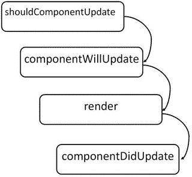

# 二、React 的核心

Electronic supplementary material The online version of this chapter (doi:[10.​1007/​978-1-4842-1245-5_​2](http://dx.doi.org/10.1007/978-1-4842-1245-5_2)) contains supplementary material, which is available to authorized users.

在最后一章中，你已经了解了 React 是什么，以及为什么它对你这样的开发人员很重要。它展示了 React 与其他框架的比较，并强调了它的不同之处。有几个概念被介绍了，但没有详细介绍一本介绍性的书应该做的。本章将深入讨论 React 的构建模块——它的核心结构和架构。

在本章和接下来的其他章节中，您将看到 React 代码，包括应用示例和 React 的一些内部工作方式。对于组成库的 React 代码，您会注意到代码被标记为这样，并带有一个标题，说明它在源代码中的出处。示例代码至少以两种形式之一编写。一种形式(目前在开发人员中很常见)是 ECMAScript 5 语法。在适用的地方，您会看到使用 ECMAScript 2015 (ES6)语法的重复示例，这种语法在 React 中变得越来越普遍，并且正在作为一等公民融入 React 环境中。你会发现大多数例子都使用了 JSX 语法，这在第 3 章中有详细介绍。

## React

当我们开始查看 React 时，最好从 React 对象本身开始。react 对象包含几个方法和属性，允许您最大限度地利用 React。对于`jsfiddle.net`或`jsbin.com`上的大多数示例，本章的来源都是可用的。这些示例的链接(如果有)包含在列表标题中。

### createClass React

`createClass`方法将在 React 中创建新的组件类。`createClass`可以用一个对象创建，这个对象必须有一个`render()`函数。在本节的稍后部分，您将获得关于组件的更深入的信息，但是`createClass`的基本实现如下，其中`specification`是将包含`render()`方法的对象。

`React.createClass( specification );`

清单 [2-1](#FPar1) 展示了如何使用`createClass`创建一个简单的组件。该组件只是创建一个`div`元素，并将一个名称属性传递给要呈现的`div`。

Listing 2-1\. `createClass`. Example Available Online at [`https://jsfiddle.net/cgack/gmfxh6yr/`](https://jsfiddle.net/cgack/gmfxh6yr/)

`var MyComponent = React.createClass({`

`render: function() {`

`return (`

`
`

`{this.props.name}`

`
`

`);`

`}`

`});`

`React.render(<MyComponent name="frodo" />, document.getElementById('container'));`

正如你将在本章后面详细讨论组件时看到的，通过从`React.Component`继承，使用 ES6 类创建组件是可能的。这可以在清单 [2-2](#FPar2) 中看到。

Listing 2-2\. ES6 Class Component. Available Online at [`http://jsbin.com/hezewe/2/edit?html,js,output`](http://jsbin.com/hezewe/2/edit?html,js,output)

`class MyComponent extends React.Component {`

`render() {`

`return (`

`
`

`{this.props.name}`

`
`

`);`

`}`

`};`

`React.render(<MyComponent name="frodo" />, document.getElementById('container'));`

### 做出 React。儿童地图

`React.Children.map`是`React.Children`内的函数。它是一个包含几个帮助函数的对象，这些函数允许你轻松地使用你的组件属性`this.props.children`，它将对包含的每个直接子对象执行一个函数，并将返回一个对象。`React.Children.map`的用法如下

`React.Children.map( children, myFn [, context])`

在这里，`children`参数是一个包含您想要定位的子对象的对象。然后将函数`myFn`应用于每个孩子。最后一个参数`context`是可选的，它将在映射函数上设置`this`。

清单 [2-3](#FPar3) 通过在一个简单的组件中创建两个子元素展示了这是如何工作的。然后，在组件的`render`方法中，设置了一个`console.log()`语句，这样您就可以看到子对象`ReactElements`被显示出来。

Listing 2-3\. Using `React.Children.map`. Available Online at [`https://jsfiddle.net/cgack/58u139vd/`](https://jsfiddle.net/cgack/58u139vd/)

`var MyComponent = React.createClass({`

`render: function() {`

`React.Children.map(this.props.children, function(child){`

`console.log(child)`

`});`

`return (`

`
`

`{this.props.name}`

`
`

`);`

`}`

`});`

`React.render(<MyComponent name="frodo" >`

`
a child
`

`
another
`

`</MyComponent>, document.getElementById('container'));`

### 做出 React。Children.forEach

`forEach`是另一个可以在 React 中的`this.props.children`上使用的实用程序。它类似于`React.Children.map`函数，只是它不返回对象。

`React.Children.forEach( children, myFn [, context])`

清单 [2-4](#FPar4) 展示了如何使用`forEach`方法。类似于 map 方法，这个例子将`ReactElement`子对象记录到控制台。

Listing 2-4\. Using `React.Children.forEach`. Available Online at [`https://jsfiddle.net/cgack/vd9n6weg/`](https://jsfiddle.net/cgack/vd9n6weg/)

`var MyComponent = React.createClass({`

`render: function() {`

`React.Children.forEach(this.props.children, function(child){`

`console.log(child)`

`});`

`return (`

`
`

`{this.props.name}`

`
`

`);`

`}`

`});`

`React.render(<MyComponent name="frodo" >`

`
a child
`

`
another
`

`</MyComponent>, document.getElementById('container'));`

### 做出 React。儿童.计数

`count`方法将返回包含在`this.props.children`中的组件数量。该函数执行如下，并接受一个参数，一个对象。

`React.Children.count( children );`

清单 [2-5](#FPar5) 显示了一个调用`React.Children.count` `()`并将计数记录到控制台的例子。

Listing 2-5\. `React.Children.count()`. Also Available Online at [`https://jsfiddle.net/cgack/n9v452qL/`](https://jsfiddle.net/cgack/n9v452qL/)

`var MyComponent = React.createClass({`

`render: function() {`

`var cnt =` `React.Children.count(this.props.children);`

`console.log(cnt);`

`return (`

`
`

`{this.props.name}`

`
`

`);`

`}`

`});`

`React.render(<MyComponent name="frodo" >`

`
a child
`

`
another
`

`</MyComponent>, document.getElementById('container'));`

### 做出 React。仅限儿童

`only`方法将返回`this.props.children`中唯一的子节点。它接受`children`作为单个对象参数，就像`count`函数一样。

`React.Children.only( children );`

清单 [2-6](#FPar6) 展示了如何利用这种方法。请记住，如果您的组件有多个子组件，React 将不允许您调用此方法。

Listing 2-6\. `React.Children.only`. Available Online at [`https://jsfiddle.net/cgack/xduw652e/`](https://jsfiddle.net/cgack/xduw652e/)

`var MyComponent = React.createClass({`

`render: function() {`

`var only = React.Children.only(this.props.children);`

`console.log(only);`

`return (`

`
`

`{this.props.name}`

`
`

`);`

`}`

`});`

`React.render(<MyComponent name="frodo" >`

`
a child
`

`</MyComponent>, document.getElementById('container'));`

### react . createelement

`createElement`方法将生成一个新的`ReactElement`。它是使用函数的至少一个、可选的最多三个参数创建的——一个字符串`type`，可选的一个对象`props`，可选的`children`。在本章的后面，您将了解更多关于`createElement`功能的信息。

`React.createElement( type, [props[, [children ...] );`

清单 [2-7](#FPar7) 展示了如何使用这个函数创建一个元素。在这种情况下，不使用 JSX `
`标签，而是显式地创建一个元素。

Listing 2-7. `createElement`

`var MyComponent = React.createClass({`

`displayName: "MyComponent",`

`render: function render() {`

`return` `React.createElement(`

`"div",`

`null,`

`this.props.name`

`)` `;`

`}`

`});`

`React.render(``React.createElement(MyComponent, { name: "frodo" })`T2】

### React.cloneElement

该方法将基于作为参数提供的目标基数`element`克隆一个`ReactElement`。可选地，您可以接受第二个和第三个参数— `props`和`children`。当我们在本章后面更详细地讨论元素和工厂时，你会看到更多关于`cloneElement`函数的内容。

`React.cloneElement( element, [props], [children ...] );`

### 做出 React。数字正射影像图

如果不使用 JSX，这个对象提供了帮助创建 DOM 元素的实用函数。除了在 JSX 编写`
my div
`之外，您还可以通过编写如下代码来创建元素。

`React.DOM.div(null, "my div");`

由于本书中的大多数例子都将利用 JSX，所以在写代码的时候你可能不会看到太多的`React.DOM`。只要理解 JSX 转换到的底层 JavaScript 将包含这些方法。

### React.createFactory

`React.createFactory`是一个在给定的`ReactElement type`上调用`createElement`的函数。在本章后面深入讨论元素和工厂时，你会学到更多关于工厂的知识。

`React.createFactory( type );`

### React.渲染

`React.render`将获取一个`ReactElement`并将其呈现给 DOM。React 只知道通过提供一个`container`来放置元素，它是一个 DOM 元素。可选地，您可以提供一个`callback`函数，一旦`ReactElement`被呈现给 DOM 节点，该函数就会被执行。

`React.render( element, container [, callback ] );`

清单 2-8 突出了一个简单 React 组件的渲染方法。注意，ID 为`container`的 DOM 元素是 React 将呈现该组件的地方。

Listing 2-8\. `React.render`. Available Online at [`https://jsfiddle.net/cgack/gmfxh6yr/`](https://jsfiddle.net/cgack/gmfxh6yr/)

`var MyComponent = React.createClass({`

`render: function() {`

`return (`

`
`

`{this.props.name}`

`
`

`);`

`}`

`});`

`React.render(<MyComponent name="frodo" />, document.getElementById('container'));`

### React.renderToString

`React.renderToString`是一个函数，允许你将一个`ReactElement`渲染到它的初始 HTML 标记。正如您可能会想到的，这在 web 浏览器中不如在 React 应用的服务器端呈现版本中有用。此功能用于从服务器为您的应用提供服务。事实上，如果你在一个已经用服务器上的`React.renderToString`渲染过的元素上调用`React.render()`，React 足够聪明，只需要给那个元素附加事件处理程序，而不需要重新移植整个 DOM 结构。

`React.renderToString( reactElement );`

### React。findDOMNode

`React.findDOMNode`是一个函数，它将返回所提供的 React 组件的 DOM 元素或传递给该函数的元素:

`React.findDOMNode( component );`

它首先检查组件或元素是否是`null`。如果是，它将返回 null。然后，它检查传递的组件本身是否是 DOM 节点，如果是，它将返回该元素作为节点。然后，它将利用内部的`ReactInstanceMap`，然后从该映射中获取 DOM 节点。

在接下来的章节中，我们将获得关于 React 组件和元素工厂的更深入的信息，并讨论它们如何应用于您的 React 应用。

## 发现 React 组件

在构建 React 应用时，React 组件是主要的构建块。在本节中，您将演示如何创建组件，以及可以用它们做什么。

React 组件是在使用 ES6 从基类`React.Component`扩展时创建的。或者，更传统地，你可以使用`React.createClass`方法(参见清单 [2-9](#FPar9) 和 [2-10](#FPar10) )。

Listing 2-9\. `myComponent` class Created Using ES6\. Example Found Online at [`https://jsbin.com/jeguti/2/edit?html,js,output`](https://jsbin.com/jeguti/2/edit?html,js,output)

`class myComponent extends React.Component {`

`render() {`

`return ( 
Hello World
 );`

`}`

`}`

Listing 2-10\. `myComponent` Created Using `React.createClass`. An interactive Version of this Example Can Be Found Online at [`https://jsbin.com/wicaqe/2/edit?html,js,output`](https://jsbin.com/wicaqe/2/edit?html,js,output)

`var myComponent React.createClass({`

`render: function() {`

`return ( 
Hello World
 );`

`}`

`});`

React 组件有自己的 API，其中包含几个方法和帮助器，如下所述。在撰写本文时，这些函数中的一些在 React v 0.13.x 中不可用或被弃用，但在 React 框架的遗留版本中存在。你会看到这些被提及，但重点将是最未来友好的功能，尤其是那些使用 ECMAScript 2015 (ES6)可访问的功能。

基类`React.Component`是组件 API 的未来友好版本。这意味着它只实现了 ES6 特性，`setState`和`forceUpdate`。要使用`setState`，您可以向`setState`方法传递一个函数或一个普通对象。或者，您可以添加一个回调函数，该函数将在设置状态后执行。见清单 [2-11](#FPar11) 。

Listing 2-11\. `setState` Using a Function, the `currentState` Passed into the Function Will Alter the Returned (New) State Being Set

`setState( function( currState, currProps ) {`

`return { X: currState.X + "state changed" };`

`});`

`setState using an object directly setting the state.`

`setState( { X: "state changed" } );`

当调用`setState`时，您实际上是将新对象排队到 React 更新队列中，这是 React 用来控制何时发生变化的机制。一旦状态准备好改变，新的状态对象或部分状态将与组件状态的剩余部分合并。实际的更新过程是批量更新中的一个句柄，所以在使用`setState`函数时有几个注意事项。首先，不能保证您的更新将以任何特定的顺序处理。因此，如果在执行完`setState`后您希望依赖某些东西，那么在回调函数中这样做是个好主意，您可以选择将回调函数传递给`setState`函数。

关于状态的一个重要注意事项是，永远不要通过直接设置`this.state`对象来直接改变组件的状态。这里的想法是，您希望将状态对象视为不可变的，并且只允许 React 和排队并合并状态的`setState`过程来控制状态的更改。

在`React.Component`类的原型中出现的另一个核心 API 方法是一个名为`forceUpdate`的函数。`forceUpdate`所做的正是你所期待的；它会强制组件更新。它通过再次利用 React 的队列系统，然后强制组件更新来实现这一点。它通过绕过组件生命周期的一部分`ComponentShouldUpdate`来做到这一点，但是您将在后面的章节中了解关于组件生命周期的更多信息。为了强制更新，你需要做的就是调用函数。您可以选择添加一个回调函数，该函数将在强制更新后执行。

`forceUpdate( callback );`

组件 API 还有其他几个值得一提的部分，因为尽管它们是不推荐使用的特性，但它们在许多实现中仍然很普遍，并且您将看到的许多关于 React 的文档可能包括这些特性。请注意，这些功能已被弃用。在 React 的未来版本中，如高于 0.13.x 的版本，它们很可能会被删除。这些方法将在下一节中介绍。

## 了解组件属性和方法

你现在已经看到了`forceUpdate`和`setState`，这两个核心函数是`React.Component`类原型的 ES6 版本的一部分。使用 ES6 时，有几个方法不可用，因为它们已被弃用。尽管在使用 React 创建组件时它们不是必需的，但是您会发现许多文档和示例都包含了它们，所以我们在这本介绍性的书中提到了它们。这些方法只有在您使用`React.createClass`作为您的函数来创作组件时才可用。它们以一种巧妙的方式被添加到 React 代码中，我认为这值得一提，因为它强调了这是一个真正的附加解决方案，在未来的版本中很容易被放弃。添加这些额外函数的代码如下:

`var ReactClassComponent = function() {};`

`assign(`

`ReactClassComponent.prototype,`

`ReactComponent.prototype,`

`ReactClassMixin`

`);`

这里你可以看到`ReactClassComponent`——当你调用`React.createClass`时，它变成了你的组件——被创建，然后`assign`方法被调用。`assign`方法基于`Object.assign( target, ...sources )`，它将获取`sources`的所有可枚举的自身属性，并将它们分配给`target`。这基本上是深度合并。最后，`ReactClassMixin`被添加到组件中，它有几个方法。一种方法是`setState`的表亲，叫做`replaceState`。`replaceState`函数将完全覆盖当前属于组件的任何状态。

`replaceState( nextState, callback );`

方法签名包括一个表示`nextState`的对象和一个可选的`callback`函数，一旦状态被替换，该函数将被执行。通常，您希望您的状态在组件的整个生命周期中保持一致的签名类型。正因为如此，`replaceState`在大多数情况下应该避免，因为它违背了一般的想法，而状态仍然可以利用`setState`来操纵。

另一个函数是`ReactClassMixin`的一部分，因此当你使用`React.createClass`创建一个组件时可以使用，如果你引用的组件已经被渲染到 DOM，布尔函数`isMounted. isMounted`将返回 true。

`bool isMounted();`

`getDOMNode`是一个不推荐使用的特性，可以从用`React.createClass`创建的组件中访问。这实际上只是一个访问`React.findDOMNode`的实用程序，这应该是查找组件或元素所在的 DOM 节点的首选方法。

使用 React 组件时，您可能会发现有必要触发组件的另一个渲染。您将会看到，最好的方法是简单地调用组件上的`render()`函数。还有另一种方式来触发你的组件的渲染，类似于`setState`，叫做`setProps`。

`setProps( nextProps, callback );`

`setProps`所做的是允许你将下一组属性传递给对象形式的组件。或者，您可以添加一个回调函数，该函数将在组件再次呈现后执行。

与`setProps`方法类似的是`replaceProps`函数。该函数接受一个对象，并将完全覆盖组件上现有的一组属性。`replaceProps`还允许一个可选的回调函数，一旦组件在 DOM 中完全重新呈现，该函数就会执行。

这里总结了 React 组件的基本特性，以及开发人员可以使用的基本属性和功能。在研究 React 元素和工厂之前，下一节将着眼于组件的生命周期，包括它是如何呈现的。

## 组件生命周期和渲染

在深入 React 组件生命周期之前，您首先应该了解组件规范功能。当您创建一个组件时，这些功能将会或者可以包含在您的规范对象中。这些规范函数的一部分是生命周期函数，当遇到这些函数时，将显示它们在组件生命周期中何时执行的细节。

### 提出

正如在本章开始的核心 API 回顾中提到的，每个 React 组件都必须有一个`render`函数。这个`render`函数将接受一个`ReactElement`，并提供一个容器位置，组件将在这个位置被添加或挂载到 DOM。

### getInitialState

这个函数将返回一个对象。该对象的内容将在组件最初呈现时设置组件的状态。该函数在组件呈现之前被调用一次。当使用 ES6 类创建一个组件时，你实际上将通过`this.state`在类的构造函数中设置`state`。清单 [2-12](#FPar12) 展示了如何在非 ES6 组件和 ES6 组件中处理这个问题。

### getDefaultProps

当第一次创建`ReactClass`时，`getDefaultProps`被调用一次，然后被缓存。该函数返回一个对象，该对象代表组件上`this.props`的默认状态。不存在于父组件中，但存在于组件映射中的`this.props`的值将被添加到这里的`this.props`中。当您使用 ES6 设置创建一个组件时，默认的 props 是在组件类的`constructor`函数中完成的。

清单 [2-12](#FPar12) 展示了创作组件的`React.createClass`方法和使用 ES6 的`getInitialState`和`getDefaultProps`。

Listing 2-12\. `getDefaultProps` and `getInitialState` in Action

`var GenericComponent = React.createClass({`

`getInitialState: function() {`

`return { thing: this.props.thingy };`

`},`

`getDefaultProps: function() {`

`return { thingy: "cheese" }`

`}`

`});`

`// ES6`

`class GenericComponent extends React.Component {`

`constructor(props) {`

`super(props);`

`this.state = { thing: props.thingy };`

`}`

`}`

`GenericComponent.defaultProps = { thingy: "cheese" };`

### 混入类

组件规范中的 mixin 是一个数组。mixin 可以共享您的组件的生命周期事件，并且您可以确信该功能将在组件生命周期的适当时间执行。mixin 的一个例子是一个定时器控件，它将一个`SetIntervalMixin`的生命周期事件与名为`TickTock`的主组件合并。如清单 [2-13](#FPar13) 所示。

Listing 2-13\. Using a React Mixin. An Interactive Example Is Found Online at [`https://jsfiddle.net/cgack/8b055pcn/`](https://jsfiddle.net/cgack/8b055pcn/)

`var SetIntervalMixin = {`

`componentWillMount: function() {`

`this.intervals = [];`

`},`

`setInterval: function() {`

`this.intervals.push(setInterval.apply(null, arguments));`

`},`

`componentWillUnmount: function() {`

`this.intervals.map(clearInterval);`

`}`

`};`

`var TickTock = React.createClass({`

`mixins: [SetIntervalMixin], // Use the mixin`

`getInitialState: function() {`

`return {seconds: 0};`

`},`

`componentDidMount: function() {`

`this.setInterval(this.tick, 1000); // Call a method on the mixin`

`},`

`tick: function() {`

`this.setState({seconds: this.state.seconds + 1});`

`},`

`render: function() {`

`return (`

`
`

`React has been running for {this.state.seconds} seconds.`

`
`

`);`

`}`

`});`

### 类型(p)

`propTypes`是一个对象，您可以为传递给组件的每个属性添加类型检查。`propTypes`是基于一个名为`React.PropTypes`的 React 对象设置的，它们的类型将在下面讨论。

如果你想强制一个特定类型的属性，你可以用几种方法。首先让属性有一个类型，但是让它成为一个可选的属性。您可以通过在您的`propTypes`对象中指定属性的名称并将其设置为相应的`React.PropTypes`类型来实现。例如，一个可选布尔值属性如下所示:

`propTypes: {`

`optionalBoolean: React.PropTypes.bool`

`}`

同样的格式也适用于其他 JavaScript 类型:

`React.PropTypes.array`

`React.PropTypes.bool`

`React.PropTypes.func`

`React.PropTypes.number`

`React.PropTypes.object`

`React.PropTypes.string`

`React.PropTypes.any`

除了这些类型，您还可以通过将`isRequired`标签附加到`React.PropType`声明来使它们成为必需的属性。所以在你的布尔型`propType`的情况下，你现在需要它如下:

`propTypes: {`

`requiredBoolean: React.PropTypes.bool.isRequired`

`}`

在 JavaScript 类型之外，您可能希望实施一些更特定于 React 的东西。您可以使用`React.PropType.node`来做到这一点，它表示 React 可以呈现的任何内容，比如数字、字符串、元素或这些类型的数组。

`myNodeProp: React.PropTypes.node`

也有`React.PropTypes.element`型。它将强制该属性是一个 React 元素:

`myNodeProp: React.PropTypes.element`

这里也有几个`PropType`助手。

`//enforces that your prop is an instance of a class`

`React.PropTypes.instanceOf( MyClass ).`

`// Enforces that your prop is one of an array of values`

`React.PropTypes.oneOf( [ 'choose', 'cheese' ])`

`// Enforces a prop to be any of the listed types`

`React.PropTypes.onOfType( [`

`React.PropTypes.string,`

`React.PropTypes.element,`

`React.PropTypes.instanceOf( MyClass )`

`])`

`// Enforce that the prop is an array of a given type`

`React.PropTypes.arrayOf( React.PropTypes.string )`

`// Enforce the prop is an object with values of a certain type`

`React.PropTypes.objectOf( React.PropTypes.string )`

### 静力学

在您的组件规范中，您可以在`statics`属性中设置一个静态函数对象。静态函数存在于组件中，无需创建函数的实例就可以调用。

### 显示名称

`displayName`是当您看到来自 React 应用的调试消息时使用的属性。

### 组件将安装

`componentWillMount`是 React 在获取组件类并将其呈现到 DOM 的过程中使用的生命周期事件。在组件的初始渲染之前，`componentWillMount`方法被执行一次。关于`componentWillMount`的独特之处在于，如果你在这个函数中调用你的`setState`函数，它不会导致组件的重新呈现，因为初始的`render`方法将接收修改后的状态。

`componentWillMount()`

### 组件安装

`componentDidMount`是一个函数，在组件被呈现到 DOM 之后，它只在 React 处理的客户端被调用。此时，React 组件已经成为 DOM 的一部分，您可以使用本章前面提到的`React.findDOMNode`函数来访问它。

`componentDidMount()`

### componentWillReceiveProps

从名字就可以看出，`componentWillReceiveProps`是在组件接收属性时执行的。该函数在每次有适当的变化时被调用，但从不在第一次渲染时调用。你可以在这个函数中调用`setState`,并且不会导致额外的渲染。您提供的函数将为下一个 props 对象提供一个参数，该对象将成为组件的 props 的一部分。在这个函数中，你仍然可以使用`this.props`访问当前的属性，所以你可以在这个函数中对`this.props`和`nextProps`进行任何逻辑比较。

`componentWillReceiveProps( nextProps )`

### shouldComponentUpdate

在组件渲染之前以及每次收到属性或状态的更改时，都会调用此函数。在初始渲染之前，或者在使用`forceUpdate`时，它不会被调用。如果您知道对属性或状态的更改实际上不需要更新组件，则可以使用此函数来跳过渲染。为了缩短渲染过程，您需要根据您确定的任何标准在函数体中返回 false。这样做将绕过组件的呈现，不仅跳过了`render()`函数，还跳过了生命周期中的下一步— `componentWillUpdate`和`componentDidUpdate`

`shouldComponentUpdate( nextProps, nextState );`

### 组件将更新

在组件呈现之前调用`componentWillUpdate`。在此功能中不能使用`setState`。

`componentWillUpdate( nextProps, nextState )`

### componentDidUpdate

在所有渲染更新都被处理到 DOM 中之后，立即执行`componentDidUpdate`。因为这是基于更新的，所以它不是组件初始渲染的一部分。该函数可用的参数是 previous props 和 previous state。

`componentDidUpdate( prevProps, prevState );`

### 组件将卸载

如前所述，当一个组件被呈现到 DOM 时，它被称为挂载。因此，这个函数`componentWillUnmount`将在组件不再被挂载到 DOM 之前立即被调用。

`componentWillUnmount()`

既然您已经看到了创建 React 组件时可用的所有属性和生命周期方法，现在是时候来看看不同的生命周期是什么样子了。清单 [2-14](#FPar14) 显示了 React 在初始渲染期间的生命周期。

Listing 2-14\. Lifecycle During Initial Render

`var GenericComponent = React.createClass({`

`// Invoked first`

`getInitialProps: function() {`

`return {};`

`},`

`// Invoked Second`

`getInitialState: function() {`

`return {};`

`},`

`// Third`

`componentWillMount: function() {`

`},`

`// Render – Fourth`

`render: function() {`

`return ( <h1>Hello World!</h1> );`

`},`

`// Lastly`

`componentDidMount: function() {`

`}`

`});`

清单 [2-14](#FPar14) 的可视化表示如图 [2-1](#Fig1) 所示，在这里你可以看到 React 组件在初始渲染时所遵循的过程。

图 2-1。

Function invocation order during the initial render of a React component

在状态改变时，React 也有特定的生活方式。这显示在清单 [2-15](#FPar15) 中。

Listing 2-15\. Lifecycle During Change of State

`var GenericComponent = React.createClass({`

`// First`

`shouldComponentUpdate: function() {`

`},`

`// Next`

`componentWillUpdate: function() {`

`},`

`// render`

`render: function() {`

`return ( <h1>Hello World!</h1> );`

`},`

`// Finally`

`componentDidUpdate: function() {`

`}`

`});`

正如清单 [2-15](#FPar15) 向您展示了 React 在状态变化期间的代码生命周期一样，图 [2-2](#Fig2) 直观地展示了相同状态变化过程的生命周期。

图 2-2。

Component lifecycle that happens when the state changes on a component

清单 [2-16](#FPar16) 显示了一个代码示例，突出显示了在 React 组件中，随着属性的改变而处理的生命周期事件。

Listing 2-16\. Component Lifecycle for Props Alteration

`var GenericComponent = React.createClass({`

`// Invoked First`

`componentWillReceiveProps: function( nextProps ) {`

`},`

`// Second`

`shouldComponentUpdate: function( nextProps, nextState ) {`

`// if you want to prevent the component updating`

`// return false;`

`return true;`

`},`

`// Third`

`componentWillUpdate: function( nextProps, nextState ) {`

`},`

`// Render`

`render: function() {`

`return ( <h1> Hello World! </h1> );`

`},`

`// Finally`

`componendDidUpdate: function() {`

`}`

`});`

清单 [2-16](#FPar16) 中的代码展示了 React 组件的属性变更过程。如图 [2-3](#Fig3) 所示。

图 2-3。

Lifecycle of a component when it has altered props

理解功能在组件生命周期中的位置很重要，但是同样重要的是要注意到`render()`仍然是组件规范中唯一需要的功能。让我们再看一个例子，使用代码来查看 React 组件以及所有显示的规范方法。

## React 元素

你可以使用 JSX 创建一个 React 元素，你将在下一章中看到细节，或者你可以使用`React.createElement. React.createElement`创建一个和 JSX 一样的元素，因为这是 JSX 在转换成 JavaScript 后使用的，正如你在本章开始时看到的。但是，有一点需要注意，使用`createElement`时支持的元素并不是所有 web 浏览器都支持的全套元素。清单 [2-17](#FPar17) 中显示了支持的 HTML 元素。

Listing 2-17\. HTML Elements That Are Supported When Creating a ReactElement

`a abbr address area article aside audio b base bdi bdo big blockquote body br button canvas caption cite code col colgroup data datalist dd del details dfn dialog div dl dt em embed fieldset figcaption figure footer form h1 h2 h3 h4 h5 h6 head header hr html i iframe img input ins kbd keygen label legend li link main map mark menu menuitem meta meter nav noscript object ol optgroup option output p param picture pre progress q rp rt ruby s samp script section select small source span strong style sub summary sup table tbody td textarea tfoot th thead time title tr track u ul var video wbr`

当然，除了这些元素之外，您还可以利用`React.createElement`来创建一个名为`ReactClass`的自定义组合，如果您希望满足某个特定的元素，它可以填补这个空白。对这些 HTML 元素的其他补充是支持的 HTML 属性，如清单 [2-18](#FPar18) 所示。

Listing 2-18\. HTML Attributes Available To Be Used When Creating React Elements

`accept acceptCharset accessKey action allowFullScreen allowTransparency alt`

`async autoComplete autoFocus autoPlay cellPadding cellSpacing charSet checked classID className colSpan cols content contentEditable contextMenu controls coords crossOrigin data dateTime defer dir disabled download draggable encType form formAction formEncType formMethod formNoValidate formTarget frameBorder headers height hidden high href hrefLang htmlFor httpEquiv icon id label lang list loop low manifest marginHeight marginWidth max maxLength media mediaGroup method min multiple muted name noValidate open optimum pattern placeholder poster preload radioGroup readOnly rel required role rowSpan rows sandbox scope scoped scrolling seamless selected shape size sizes span spellCheck src srcDoc srcSet start step style tabIndex target title type useMap value width wmode data-* aria-*`

## React 工厂

正如你在本章开始时看到的，这基本上是你创建 React 元素的另一种方式。因此，它能够呈现所有前面的部分、HTML 标记、HTML 属性以及定制的`ReactClass`元素。需要工厂的一个基本例子是在没有 JSX 的情况下实现一个元素。

`// button element module`

`class Button {`

`// class stuff`

`}`

`module.exports = Button;`

`// using the button element`

`var Button = React.``createFactory``(require(``'Button'`T4】

`class App {`

`render() {`

`return``Button`T2】

`}`

`}`

工厂的主要用例是当你决定不像前面的例子那样使用 JSX 编写应用时。这是因为当您利用 JSX 创建一个`ReactClass`时，transpiler 进程将创建正确呈现元素所需的必要工厂。因此，JSX 版本，包括与工厂的前一个代码等效的代码，看起来如下。

`var Button = require('Button');`

`class App {`

`render() {`

`return <Button prop="foo" />; // ReactElement`

`}`

`}`

## 摘要

本章涵盖了 React 的核心。您了解了 React API，包括如何使用`React.createClass`创建组件。您还学习了在使用 ES6 工具构建应用时如何使用`React.Component`类。其他 API 方法是所有的`React.Children`实用程序、`React.DOM`、`React.findDOMNode`和`React.render`。

在对 React 核心进行了初步介绍之后，您了解了实现 React 组件的细节，包括它们可以包含哪些属性和特性，以及生命周期功能和呈现过程中的各种差异。

最后，你会读到更多关于`ReactElements`和工厂的细节，这样你就能在下一章深入了解 JSX。一旦你了解了 JSX，你将能够一步一步地创建一个 React 应用，并把所有这些信息放在一起。