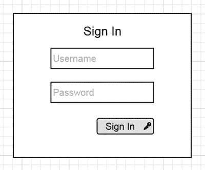
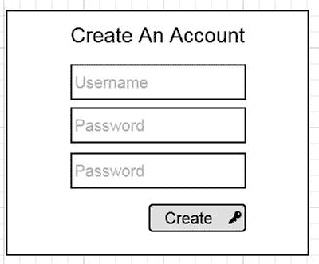
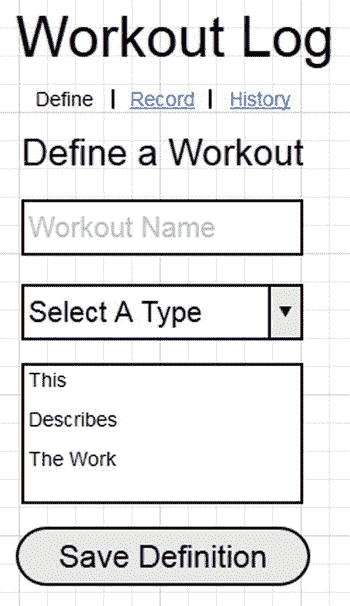
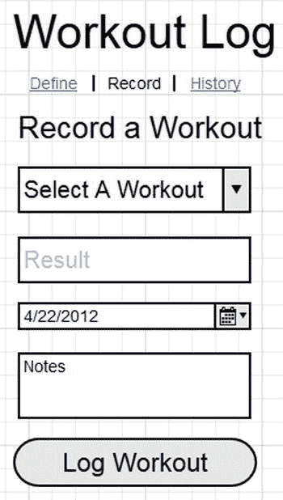
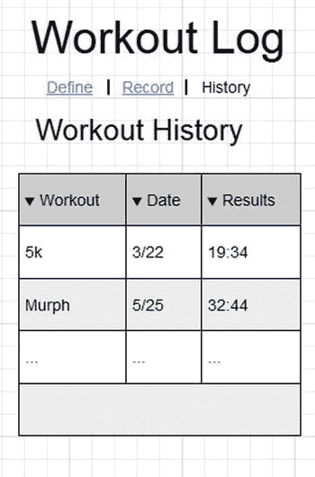

# 四、构建 React Web 应用

Electronic supplementary material The online version of this chapter (doi:[10.​1007/​978-1-4842-1245-5_​4](http://dx.doi.org/10.1007/978-1-4842-1245-5_4)) contains supplementary material, which is available to authorized users.

在前三章中，您已经获得了关于 React 的大量信息。从 React 是什么以及它与其他 JavaScript 和用户界面框架有何不同开始，您就为理解 React 的工作方式打下了坚实的基础。从那里，您了解了 React 的核心概念和它的特性。引入了组件创建和渲染生命周期之类的东西。在最后一章中，你被介绍给了 React 世界中一个强大的租户，JSX。通过 JSX，您看到了与普通的 JavaScript 实现相比，如何以一种更易接近、更易维护的方式简洁地创建 React 组件。

本章将展示如何通过考虑一个非 React 应用并将其分解成你需要的组件来构建一个 React 应用。然后，你就可以将它拆分到 React 应用中，你会看到 React 甚至可以为一个规模不及脸书或 Instagram 的应用带来的价值。

## 概述应用的基本功能

有几种方法可以概述应用的基本功能，这些功能将被转移到 React 应用中。一种方法是用线框设计。如果您没有一个活动的 web 应用，而是考虑用 React 从头开始创建应用结构，这将非常有用。这个线框化过程对于任何应用来说显然都是重要的，但是对于确定应该在哪里将应用拆分成不同的组件有很大的帮助。

在开始绘制线框之前，您需要一个应用的概念。我创建了一个锻炼日记/日志，在那里我可以存储各种锻炼并查看我的努力历史。这类项目是不同框架如何一起工作并集成到工作流中的一个很好的例子。您的示例应用可能有所不同，但出于本书的目的，您将遵循锻炼应用主题。接下来是头脑风暴和构建应用的思考过程。

现在，您对自己的应用有了一个想法。您需要确定代表该应用全貌的主要功能领域。对于这个锻炼应用，您需要一种方法让用户通过应用的身份验证，因为每个用户都希望记录自己的锻炼数据。一旦用户通过身份验证，还应该有一个页面或表单，用户可以定义和分类他们将记录的锻炼。这将是一些允许定义的名称和类型，如“时间”、“最大重量”、“重复次数”。这些不同的类型将在下一部分发挥作用，允许用户存储他们的锻炼。当他们存储健身程序且类型与时间相关时，您可以选择使用特定的表格字段来记录完成工作所需的时间。最大重量和重复次数的类似特定字段也是可用的，但仅针对特定工作类型显示。这种类型的特殊性允许用户在应用的历史记录部分对他们的锻炼进行不同的分类。也许他们甚至可以随着时间的推移为每次锻炼规划不同的努力。

现在你所拥有的是一个基本的、散文式的应用功能概述。现在，您可能在 React 思维中看到了这一点，但是您需要进入下一步，将该应用视为一个线框。

## 从组件的角度思考

基于上一节中创建的大纲，您现在将遇到如何构建应用的两个场景。如前所述，一种方法是创建遵循应用轮廓的线框。这给了您一个新的开始，以确定在哪里可以创建适合新 React 应用的组件。另一种方法是将结构建立在现有应用及其源代码的基础上，以便将功能分解成组件。您将首先看到应用的一组线框，然后您将看到一个现有应用的示例，该应用需要重写为 React 应用。

### 线框

创建线框时，您可以选择使用餐巾背面、MS Paint 或任何数量的工具来帮助您以描述体验的图像表达您的想法。下面是我决定分成 React 组件的应用部分。所有组件的根是应用，它将是以下所有嵌套组件的父组件。如果您选择不使用线框，而是更喜欢使用现有的代码来剖析您的应用，那么您可以浏览这一小节，并从“重写现有的应用”开始，来发现从组件的角度来思考的见解。

图 [4-1](#Fig1) 所示的登录界面是一个简单的认证组件。这实际上是一个完整的组件。实际上，您可以选择将该组件作为两部分身份验证组件之一。

图 4-1。

Sign In component wireframe

该登录组件可能不需要任何子组件，因为您可能会将该表单发送到您的身份验证服务器进行验证。可能构成该身份验证部分的另一个 React 组件是创建帐户屏幕。

在创建帐户组件中，如图 [4-2](#Fig2) 所示，您可以看到还有一个简单的表单，就像登录表单一样。这里的区别在于您需要一个密码验证组件。这将确保您拥有的任何密码规则都得到实施，并且还会检查第二个密码字段以确保值匹配。在您的应用中，您还可以选择包含一个 reCAPTCHA 或其他组件，以确保创建帐户的人不是机器人。

图 4-2。

Account creation component wireframe

与帐户创建组件中的密码验证子组件一起，您需要确保输入的用户名是惟一的，并且在您的系统中可用。因此，即使这个简单的形式也可以使用 React 分解成更多的原子组件。这将允许你维护一个特定的功能，并保持每个动作与应用的其他部分相分离(图 [4-2](#Fig2) )。

应用线框的下一部分是定义健身程序部分(图 [4-3](#Fig3) )。这可以分为至少两个决定性的部分。一旦通过身份验证，应用的每个视图都将包含一个导航菜单。这个菜单本身就是一个组件，它将控制应用的哪个部分被呈现。除了导航菜单组件，还有健身程序定义组件。这将保存允许您存储新健身程序定义的表单，当您决定记录您已完成的健身程序时，您将能够返回该表单。这个表单也是您想要为 React 应用创建的一个组件。

图 4-3。

Define a Workout component wireframe

在定义健身程序部分之后，下一部分(称为记录健身程序)将保留您在上一部分看到的相同导航组件(图 [4-4](#Fig4) )。除了导航组件之外，还有一个表格，用于控制您要记录的锻炼以及您要记录的运动量。这可能是一个单一的组成部分，但你可能会发现创建一个下拉菜单的可用锻炼更好。

图 4-4。

Store workout component wireframe

应用的最后一部分是“健身程序历史记录”部分(图 [4-5](#Fig5) )。此部分保留了导航组件，并显示了一个表格，或一个列表视图，如果你选择，所有你的锻炼。这个表本身就是一个组件，所以请记住，在将来的版本中，您可能希望用一个子组件来扩展这个组件。这个子组件可以对历史进行搜索或排序，因此它应该具有处理该功能的可用属性。

图 4-5。

Workout History component wireframe

### 重写现有的应用

在本节中，您将看到一个可以使用 React 重写的现有应用。同样，第一步是确定在应用中何处可以创建组件或子组件，就像您在线框示例中看到的那样。

第一部分是身份验证组件，由登录子组件和创建帐户组件组成。如果您研究清单 [4-1](#FPar1) 中显示基本 HTML 和 jQuery 应用的例子，您应该能够确定在哪里可以创建组件。

Listing 4-1\. Basic Markup for Authentication in Your Existing Application

`
`

`<label for="username">Username:</label>`

`<input type="text" id="username">`

`<label for="password">Password:</label>`

`<input type="text" id="password">`

`<button id="signIn">Sign In</button>`

`
`

`
`

`<label for="username">Username:</label>`

`<input type="text" id="username">`

`<label for="password">Password:</label>`

`<input type="text" id="password">`

`<label for="password">Confirm Password:</label>`

`<input type="text" id="confpassword">`

`<button id="signIn">Create Account</button>`

`
`

使用 jQuery 的认证机制

`$("#signIn").on("click", function() {`

`// do authentication`

`$(".notSignedIn").hide();`

`$(".signedIn").show();`

`});`

你可以看到，这显然有两个部分。也许您可以想象创建一个如下所示的组件。

`<Authentication>`

`<SignIn />`

`<CreateAccount />`

`</Authentication>`

这正是将在下一节中创建的组件。当然，还有实际执行身份验证的功能，这是您必须考虑的，但从基本意义上来说，这就是组件的样子。

下一部分是导航菜单，一旦认证完成，导航菜单将在整个应用中共享。

`<ul id="navMenu">`

`<li><a href="#defineWorkouts">Define Workouts</a></li>`

`<li><a href="#logWorkout">Log Workout</a></li>`

`<li><a href="#viewHistory">View History</a></li>`

`<li><a href="#logout" id="logout">Logout</a></li>`

`</ul>`

这个导航菜单将在 JSX 中被重写，这样它就可以在每个需要它的组件中被重用。应用的 jQuery/HTML 版本的下一部分是基本的可提交区域，它们从特定字段中获取值，并在单击时提交这些值。例如,“定义健身程序”部分类似于清单 [4-2](#FPar2) 。

Listing 4-2\. Save a Workout Definition in HTML/jQuery

`
`

`<label for="defineName">Define Name</label>`

`<input type="text" id="defineName">`

`<label for="defineType">Define Type</label>`

`<input id="defineType" type="text">`

`<label for="defineDesc">Description</label>`

`<textarea id="defineDesc" ></textarea>`

`<button id="saveDefinition">Save Definition</button>`

`
`

其他两个部分，记录锻炼和锻炼历史，遵循相同的形式，除了有一部分组件来自存储的锻炼(列表 [4-3](#FPar3) 和 [4-4](#FPar4) )。

Listing 4-3\. The Record a Workout Section—Different Workouts Are Available from Defined Workouts in #chooseWorkout and Pulled from a Data Store

`
`

`<label for="chooseWorkout">Workout:</label>`

`<select name="" id="chooseWorkout">`

`<!-- populated via script -->`

`</select>`

`<label for="workoutResult">Result:</label>`

`<!-- input based on the type of the workout chosen -->`

`<input id="workoutResult" type="text" />`

`<input id="workoutDate" type="date" />`

`<label for="notes">Notes:</label>`

`<textarea id="notes"></textarea>`

`
`

Listing 4-4\. Workout History Based on All the Work Recorded and Pulled from a Data Store

`
`

`<!-- dynamically populated -->`

`<ul id="history">`

`</ul>`

`
`

现在你可以看到，这些原子或亚原子的代码片段中的每一个都代表了生成用户界面组件的单一代码路径。这正是您想要的，以便将这些功能部分分割成它们自己的组件。这个例子是一个简单的锻炼日志应用。尝试检查您自己的源代码，并通过编目您需要创建哪些组件来为重写做准备。

## 为您的应用创建必要的组件

在前面的部分中，您检查了一个线框和一个现有的应用，以确定您希望将应用的哪些功能拆分为 React 组件，或者您至少可以直观地看到这样做有什么意义。在本节中，您将采取下一步，开始使用 React 代码隔离这些组件，以便开始构建您的应用。

首先，您将创建授权组件。从线框或代码示例中可以看出，这个组件由两个子组件组成— `SignIn`和`CreateAccount`。如果您愿意，整个应用可以放在一个文件中，但是出于可维护性的考虑，谨慎的做法是将组件分离到它们自己的文件中，并利用 browserify 或 webpack 之类的工具将这些文件模块化。首先是`signin.jsx`档，其次是`createaccount.jsx`(列表 [4-5](#FPar5) 和 [4-6](#FPar6) )。

Listing 4-5\. The signin.jsx File

`var React = require("react");`

`var SignIn = React.createClass({`

`render: function() {`

`return (`

`
`

`<label htmlFor="username">Username`

`<input type="text" id="username" />`

`</label>`

`<label htmlFor="password">Password`

`<input type="text" id="password" />`

`</label>`

`<button id="signIn" onClick={this.props.onAuthComplete.bind(null, this._doAuth)}>Sign In</button>`

`
`

`);`

`},`

`_doAuth: function() {`

`return true;`

`}`

`});`

`module.exports = SignIn;`

Listing 4-6\. The createaccount.jsx File

`var React = require("react");`

`var CreateAccount = React.createClass({`

`render: function() {`

`return (`

`
`

`<label htmlFor="username">Username:`

`<input type="text" id="username" />`

`</label>`

`<label htmlFor="password">Password:`

`<input type="text" id="password" />`

`</label>`

`<label htmlFor="password">Confirm Password:`

`<input type="text" id="confpassword" />`

`</label>`

`<button id="signIn" onClick={this.props.onAuthComplete.bind( null, this._createAccount)}>Create Account</button>`

`
`

`);`

`},`

`_createAccount: function() {`

`// do creation logic here`

`return true;`

`}`

`});`

`module.exports = CreateAccount;`

这两个组件都很简单，JSX 标记看起来类似于上一节中在 jQuery 和 HTML 应用中创建的标记。不同的是，您不再看到使用 jQuery 绑定到按钮。在它的位置，有一个`onClick`绑定，然后调用对`this.props.onAuthComplete`的引用。这可能看起来很奇怪，但是一旦您看到父应用组件，它将指示如何通过每个子组件处理授权状态。清单 [4-7](#FPar7) 提供了一个简单的组件——`Authentication`——它包含两个子认证组件。这些子组件是可用的，因为在它们被定义的文件中，我们通过利用`module.exports. module.exports`导出了组件对象，这是一种 CommonJS 机制，允许您导出您定义的对象。一旦在后续模块中使用`require()`加载了该对象，您就可以访问它了。

Listing 4-7\. The auth.jsx File

`var React = require("react");`

`var SignIn = require("./signin.jsx");`

`var CreateAccount = require("./createaccount.jsx");`

`var Authentication = React.createClass({`

`render: function() {`

`return (`

`
`

`<SignIn onAuthComplete={this.props.onAuthComplete}/>`

`<CreateAccount onAuthComplete={this.props.onAuthComplete}/>`

`
`

`);`

`}`

`})`

`module.exports = Authentication;`

现在您有了认证，它由两个子组件组成— `SignIn`和`CreateAccount`。从这里开始，您需要应用的下一个主要部分，这是在您对应用进行身份验证之后发生的所有事情。同样，这个过程将被分成适当的组件，每个组件都包含在自己的模块中(列表 [4-8](#FPar8) )。

Listing 4-8\. The navigation.jsx File

`var React = require("react");`

`var Navigation = React.createClass({`

`render: function() {`

`return (`

`<ul>`

`<li><a href="#" onClick={this.props.onNav.bind(null, this._nav("define"))}>Define A Workout</a></li>`

`<li><a href="#"onClick={this.props.onNav.bind(null, this._nav("store"))}>Record A Workout</a></li>`

`<li><a href="#"onClick={this.props.onNav.bind(null, this._nav("history"))}>View History</a></li>`

`<li><a href="#" onClick={this.props.onLogout}>Logout</a></li>`

`</ul>`

`);`

`},`

`_nav: function( view ) {`

`return view;`

`}`

`});`

`module.exports = Navigation;`

清单 [4-8](#FPar8) 显示了`Navigation`组件。您会注意到每个导航元素都有一个到`onClick`事件的绑定。对于`Logout`，这是一个对注销机制的简单调用，它作为属性传递给这个`Navigation`组件。对于其他导航部分，这个示例展示了如何在本地设置一个值并将其传递给父组件。这是通过在`_nav`功能中设置一个值来实现的。一旦我们编写了它，您将会看到它在父组件中被引用。现在，您需要创建用于定义、存储和查看锻炼历史的模块和组件。这些如清单 [4-9](#FPar9) 至 [4-11](#FPar11) 所示。

Listing 4-9\. The define.jsx File

`var React = require("react");`

`var DefineWorkout = React.createClass({`

`render: function() {`

`return  (`

`
`

`<h2>Define Workout</h2>`

`<label htmlFor="defineName">Define Name`

`<input type="text" id="defineName" />`

`</label>`

`<label htmlFor="defineType">Define Type`

`<input id="defineType" type="text" />`

`</label>`

`<label htmlFor="defineDesc">Description</label>`

`<textarea id="defineDesc" ></textarea>`

`<button id="saveDefinition">Save Definition</button>`

`
`

`);`

`}`

`});`

`module.exports = DefineWorkout;`

`DefineWorkout`组件只是简单的输入和一个保存定义按钮。如果您通过 API 将这个应用连接到一个数据存储中，那么您会希望向 Save Definition 按钮添加一个`onClick`函数，以便将数据存储在适当的位置。

Listing 4-10\. The store.jsx File

`var React = require("react");`

`var Option = React.createClass({`

`render: function() {`

`return <option>{this.props.value}</option>;`

`}`

`});`

`var StoreWorkout = React.createClass({`

`_mockWorkouts: [`

`{`

`"name": "Murph",`

`"type": "fortime",`

`"description": "Run 1 Mile \n 100 pull-ups \n 200 push-ups \n 300 squats \n Run 1 Mile"`

`},`

`{`

`"name": "Tabata Something Else",`

`"type": "reps",`

`"description": "4 x 20 seconds on 10 seconds off for 4 minutes \n pull-ups, push-ups, sit-ups, squats"`

`}`

`],`

`render: function() {`

`var opts = [];`

`for (var i = 0; i < this._mockWorkouts.length; i++ ) {`

`opts.push(<Option value={this._mockWorkouts[i].name} />);`

`}`

`return (`

`
`

`<h2>Record Workout</h2>`

`<label htmlFor="chooseWorkout">Workout:</label>`

`<select name="" id="chooseWorkout">`

`{opts}`

`</select>`

`<label htmlFor="workoutResult">Result:</label>`

`<input id="workoutResult" type="text" />`

`<input id="workoutDate" type="date" />`

`<label htmlFor="notes">Notes:</label>`

`<textarea id="notes"></textarea>`

`<button>Store</button>`

`
`

`);`

`}`

`});`

`module.exports = StoreWorkout;`

`StoreWorkout`是一个组件，同样包含简单的表单输入，帮助您记录锻炼情况。有趣的是，现有锻炼的模拟数据会动态填充`<select/>`标签。该标签包含您在`DefineWorkout`组件中定义的锻炼。

Listing 4-11\. The history.jsx File

`var React = require("react");`

`var ListItem = React.createClass({`

`render: function() {`

`return <li>{this.props.name} - {this.props.result}</li>;`

`}`

`});`

`var History = React.createClass({`

`_mockHistory: [`

`{`

`"name": "Murph",`

`"result": "32:18",`

`"notes": "painful, but fun"`

`},`

`{`

`"name": "Tabata Something Else",`

`"type": "reps",`

`"result": "421",`

`"notes": ""`

`}`

`],`

`render: function() {`

`var hist = this._mockHistory;`

`var formatedLi = [];`

`for (var i = 0; i < hist.length; i++) {`

`var histObj = { name: hist[i].name, result: hist[i].result };`

`formatedLi.push(<ListItem {...histObj} />);`

`}`

`return (`

`
`

`<h2>History</h2>`

`<ul>`

`{formatedLi}`

`</ul>`

`
`

`);`

`}`

`});`

`module.exports = History;`

`History`还获取模拟数据，并以`<ListItem />`组件的`formattedLi`数组的形式将其添加到应用的表示层。在将所有这些组件放在一起并运行它们之前，让我们停下来思考一下测试 React 应用需要什么。

## 测试应用

React 使得将测试框架集成到应用中变得容易。这是因为 React 附加组件在`React.addons.testUtils`被称为`testUtils`。本节概述了此附加组件中可用的测试实用程序。要使用附加组件，您必须通过拨打`require("react/addons")`等电话或在`<script src="` `https://fb.me/react-with-addons-0.13.3.js"></script` `>`从脸书 CDN 获取 React with add-ons 源来请求 React 附加组件。

### 模仿

Simulate 是一种利用模拟事件的方法，这样您就能够模拟 React 应用中的交互。利用 Simulate 的方法签名如下:

`React.addons.TestUtils.Simulate.{eventName}(DOMElement, eventData)`

`DOMElement`是元素，`eventData`是对象。一个例子是这样的:

`var node = React.findDOMNode(this.refs.input);`

`React.addons.TestUtils.Simulate.click(node);`

#### 渲染成文档

`renderIntoDocument`获取一个组件，并将其呈现在文档中一个分离的 DOM 节点中。由于该方法呈现为一个 DOM，因此该方法需要一个 DOM。因此，如果您在 DOM 之外进行测试，您将无法利用这种方法。

#### 模拟组件

这个方法允许您创建一个假的 React 组件。这将成为应用中的一个简单的`
`，除非您对该对象使用可选的`mockTagName`参数。当您想要在测试场景中创建一个组件并向其添加有用的方法时，这尤其有用。

#### 解决

这个函数只是返回一个布尔值，表明作为目标的 React 元素是否确实是一个元素:

`isElement` `(ReactElement element)`

#### iselemontoftype

该方法接受一个 React 元素和一个 component 类函数，如果您提供的元素属于`componentClass`的类型，它将返回`True`。

`isElementOfType` `( element, componentClass)`

#### isDOMComponent

该方法返回布尔值，该值确定 React 组件的实例是否是 DOM 元素，如`
`或`<h1>`。

#### isCompositeComponent

这是另一个布尔检查，如果提供的 React 组件是一个复合组件，将返回`True`，这意味着它是使用`React.createClass`或在 ES6 扩展`ReactComponent`中创建的。

#### isCompositeComponentWithType

类似于`isCompositeComponent`，该方法将检查`ReactComponent`实例，并将其与提供给该方法的`componentClass`进行比较。如果实例和提供的类类型匹配，这将返回`True`。

#### findAllInRenderedTree

该方法返回存在于树或基础组件中的组件数组，前提是提供给该方法的函数测试为`True`。

`findAllInRenderedTree` `( tree, test )`

#### scryrrendereddomcomponentswithsclass

这个方法在呈现的树中寻找 DOM 组件，比如带有匹配的`className`的``。

`scryRenderedDOMComponentsWithClass` `( tree, className)`

#### findrendeddomcomponentswithsclass

这个方法和`scryRenderedDOMComponentsWithClass`是一样的，唯一的区别是期望的结果是一个单一的组件而不是一个数组。这意味着如果返回多个组件，将会出现错误。

#### scrrendereddomcomponentswithtag

返回一个从树组件开始的数组，匹配所有共享相同`tagName`的实例。

`scryRenderedDOMComponentsWithTag( tree, tagName)`

#### findRenderedDOMComponentsWithTag

这与前面的方法相同，除了它预期只有一个结果而不是一个数组。如果返回多个结果，此方法将产生错误。

#### scryRenderedComponentsWithType

类似于前面的例子，但是基于`componentClass`进行比较，这是提供给该方法的一个函数。

`scryRenderedComponentsWithType( tree, componentClass )`

#### findRenderedComponentsWithType

与前一个方法相同，再次预测一个单一的结果，如果找到多个结果，则抛出一个错误。

您可以采用所有这些方法，并利用它们来扩充您选择的测试工具。对脸书来说，这个工具就是笑话。为了在您的机器上设置 Jest，只需如下使用`npm`:

`npm install jest-cli –save-dev`

一旦安装完毕，您就可以更新您的应用的`package.json`并命名测试框架。

`{`

`...`

`"scripts": {`

`"test": "jest"`

`}`

`...`

`}`

现在每次运行`npm test`时，位于`__tests__`文件夹中的测试都会被执行。测试可以以一种需要一个模块的方式来构建，然后你可以在这个模块上运行测试。对`SignIn`组件的测试可能如下所示:

`jest.dontMock("../src/signin.jsx");`

`describe("SignIn", function() {`

`it("will contain a Sign In button to submit", function() {`

`var React = require("react/addons");`

`var SignIn = require("../src/signin.jsx");`

`var TestUtils = React.addons.TestUtils;`

`var signin = TestUtils.renderIntoDocument(`

`<SignIn />;`

`);`

`var username = TestUtils.findRenderedDOMComponentWithTag( signin, "button" );`

`expect( username.getDOMNode().textContent).equalTo("Sign In");`

`});`

`});`

您可以看到，您可以利用 React 附加组件中包含的`TestUtils`来构建测试，这将允许您在构建应用的测试套件时断言测试。

## 运行您的应用

在本节中，您将把构建的组件拼凑成一个工作应用。现在，您将获得每个组件，并将其组装起来。在这种情况下，您将使用 browserify 来组合您的脚本，这些脚本是使用 CommonJS 模块模块化的。当然，您可以将它们合并成一个文件，或者您可以将它们编写在类似于清单 [4-12](#FPar12) 的 ES6 模块中。

Listing 4-12\. signin.jsx as an ES6 Module

`var React = require("react");`

`class SignIn extends React.Component {`

`constructor(props) {`

`super(props);`

`}`

`render() {`

`return (`

`
`

`<label htmlFor="username">Username`

`<input type="text" id="username" />`

`</label>`

`<label htmlFor="password">Password`

`<input type="text" id="password" />`

`</label>`

`<button id="signIn" onClick={this.props.onAuthComplete.bind( null, this._doAuth)}>Sign In</button>`

`
`

`);`

`}`

`_doAuth() {`

`return true;`

`}`

`}`

`module.exports = SignIn;`

因此，您也可以在 ES6 中创作您的应用，但是对于本例，应用将使用使用`React.createClass();`编写的现有源代码进行组装。

首先需要做的是，需要有一个包含代码的核心`app.jsx`文件，并成为应用的主要入口点。这个文件应该包括构建应用所必需的组件。在这种情况下，您需要主应用(您将在一秒钟内构建)和身份验证模块。

`var React = require("react");`

`var Authentication = require("./auth.jsx");`

`var WorkoutLog = require("./workoutlog.jsx");`

`var App = React.createClass({`

`getInitialState: function() {`

`return { signedIn: false }`

`},`

`render: function() {`

`return (`

`
{ this.state.signedIn ? <WorkoutLog onLogout={this._onLogout} /> : <Authentication onAuthComplete={this._onAuthComplete}/> }
`

`);`

`},`

`_onAuthComplete: function( result ) {`

`// let the child auth components control behavior here`

`if (result()) {`

`this.setState( { signedIn: true } );`

`}`

`},`

`_onLogout: function() {`

`this.setState( { signedIn: false } )`

`}`

`})`

`React.render(<App/>, document.getElementById("container"));`

这是实现`Authentication`和`WorkoutLog`组件的单个组件。有一个单一状态参数，指示用户是否登录。正如您之前看到的，这是通过传递属性从子组件传递的。`SignIn`组件绑定到按钮的点击，然后它将与 _ `onAuthComplete`函数共享点击的结果。这与`_onLogout`相同，在`WorkoutLog`组件的导航菜单中处理。

说到`WorkoutLog`组件——现在是时候看看它了，因为它是由所有剩余的组件组成的(清单 [4-13](#FPar13) )。

Listing 4-13\. The workoutlog.jsx File

`var React = require("react");`

`var Nav = require("./navigation.jsx");`

`var DefineWorkout = require("./define.jsx");`

`var StoreWorkout = require("./store.jsx");`

`var History = require("./history.jsx");`

`var WorkoutLog = React.createClass({`

`getInitialState: function() {`

`return { view: "define" };`

`},`

`render: function() {`

`return (`

`
`

`<h1>Workout Log</h1>`

`<Nav onLogout={this.props.onLogout} onNav={this._onNav}/>`

`{this.state.view === "define" ? <DefineWorkout /> : "" }`

`{this.state.view === "store" ? <StoreWorkout /> : "" }`

`{this.state.view === "history" ? <History /> : "" }`

`
`

`);`

`},`

`_onNav: function( theView ) {`

`this.setState( { view: theView });`

`}`

`});`

`module.exports = WorkoutLog;`

`WorkoutLog`是一个包含`Nav`的组件，然后通过属性`onLogout`来控制`<App>`组件的状态。`<DefineWorkout />, <StoreWorkout />`和`<History />`组件都可用，但是渲染机制中的可见性由`state.view`控制，这是在`WorkoutLog`组件级别维护的唯一状态参数。当点击`<Nav/>`组件中的链接时，设置该状态。只要您的所有路径都是正确的，并且您正在使用这样的命令:

`$ watchify -t babelify ./src/app.jsx -o ./dist/bundle.js –v`

结果将被捆绑到`bundle.js`中。您将能够导航到您的`index.html`(或者您命名的 HTML 文档)并查看您的工作 React 应用。恭喜你！

## 摘要

在本章中，您研究了 React web 应用从概念化到最终表示的过程。这包括利用线框化的思想来可视化应用的组件将被拆分的位置，或者剖析现有的应用以便为 React 重写做准备。

然后，您看到了如何利用 CommonJS 模块实际创建这些组件，以便保持组件的隔离和可维护性。最后，您将所有这些放在一个工作应用中。

在接下来的章节中，您将会遇到一些辅助工具，它们将会帮助您在 React 开发中走得更远。现在，您已经成功地构建了一个 React 应用，并且可能正在享受 React 所展示的 web 开发世界的新视图。