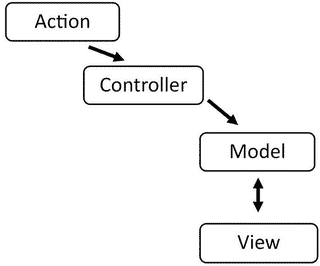
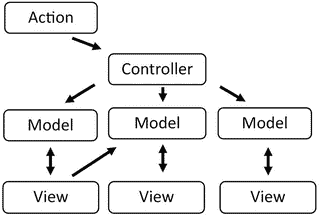
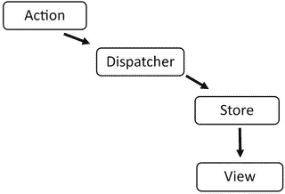
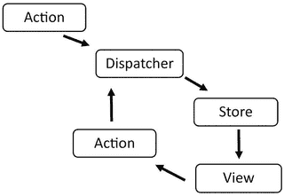
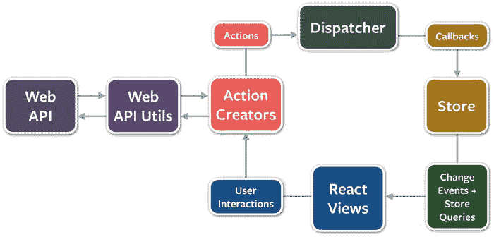

# 五、Flux 简介：React 的应用架构

Electronic supplementary material The online version of this chapter (doi:[10.​1007/​978-1-4842-1245-5_​5](http://dx.doi.org/10.1007/978-1-4842-1245-5_5)) contains supplementary material, which is available to authorized users.

本书的前四章介绍了 React，这是用于创建用户界面的 JavaScript 框架，是脸书工程团队的产品。到目前为止，您所看到的已经足以使用 React 创建健壮的用户界面，并将 React 实现到新的或现有的应用框架中。然而，React 生态系统不仅仅是 React。其中之一是 Flux，这是一个由脸书创建的应用框架，以取代标准的模型-视图-控制器(MVC)框架的方式来补充 React。这并不是因为 MVC 本身有什么问题，而是因为当您开始用 React 构建应用并将应用逻辑分解成组件时，您会发现一个类似于典型 MVC 的框架不如 Flux 那样高效或可维护，Flux 在设计时就考虑到了 React，并且还具有在不增加维护成本的情况下扩展应用的能力。

本章将概述什么是 Flux 以及如何开始使用 Flux，并探讨 Flux 和 React 如何配合使用。在下一章用 Flux 构建应用之前，你将熟悉 Flux 的概念。

## 什么是 Flux，为什么它不同于典型的 MVC 框架

Flux 是专门为 React 设计的。这是一个应用架构，旨在避免典型 MVC 框架中常见的多向数据流和绑定的概念。相反，它提供单向数据流，React 是中间的用户界面层。为了得到一个更好的例子，让我们研究一下典型的 MVC 框架，看看当试图将应用扩展到超出其设计容量时会出现什么问题。

在图 [5-1](#Fig1) 中，你可以看到方向从一个动作开始，通过控制器到达模型。

图 5-1。

Typical Model-View-Controller data flow model

模型和视图可以来回交换数据。这是相对直接的，但是如果您添加一些额外的模型和视图会发生什么呢？然后事情变得稍微复杂一点，但仍然是你可以处理的事情，如图 [5-2](#Fig2) 所示。

图 5-2。

Additional models and views added to the MVC data model

这显然更加复杂，因为有多个视图和模型，其中一些甚至在彼此之间共享数据。然而，这种结构不会变得完全笨拙，直到有如此多的模型和视图，以至于您甚至不能在一个简单的模型图中跟踪依赖关系，更不用说弄清楚模型和视图如何在代码本身中相互交互。

当它开始变得难以处理时，你看到的是最初导致我们做出 React 的相同场景。这些依赖关系的嵌套和耦合导致您有足够的机会失去对特定变量或关系的跟踪。这意味着更新单个模型或视图可能会对未知的相关视图产生不利影响。这既不有趣也不可维护。它会增加您的开发时间，或者以糟糕的用户体验甚至无限更新循环的形式导致严重的错误。这就是 Flux 的好处，尤其是当您有多个模型和视图时。

Flux 在最基本的层面上看起来如图 [5-3](#Fig3) 所示，有一个动作、调度、存储和视图层。

图 5-3。

Basic Flux data flow

这是数据流通过 Flux 应用的基本结构。数据流的初始状态来自一个动作。这个动作然后被转移到调度器。

Flux 应用中的调度员就像一名交通官员。这个调度程序将确保流经应用的数据不会导致任何级联效应，这种效应可能会在多模型和视图 MVC 设置中看到。调度程序还必须确保动作按照它们到达的顺序执行，以防止出现竞争情况。

商店接管每项活动的调度员。一旦一个动作进入存储区，在存储区完成当前动作的处理之前，不允许该动作进入存储区。一旦存储表明数据中的某些内容发生了变化，视图就会对存储做出响应。

视图本身可以通过实例化另一个动作来为这个数据流做出贡献，然后这个动作通过 dispatcher 传递到商店并返回到视图，如图 [5-4](#Fig4) 所示。

图 5-4。

Flux with a view creating its own action and passing that to the dispatcher

您可能想知道这个数据流的视图组件是否是 React 适合 Flux 的地方。这正是 React 符合 Flux 模型的地方。您可以将应用中的 React 组件视为基于从数据模型的存储部分传输的数据呈现的项目。

从视图本身创建的操作呢？React 如何创建一个发送给调度程序的动作？这可能只是用户交互的结果。例如，如果我有一个聊天应用，想要过滤朋友列表或类似的东西，React 将在我与组件的该部分交互时创建新的动作，这些动作将传递给 dispatcher 以启动另一个 Flux 流程，如图 [5-5](#Fig5) 所示。

图 5-5。

Full Flux architecture, including calls from data stores

图 [5-5](#Fig5) 显示了 Flux 架构的完整生命周期。这从某种数据 API 开始，然后将信息或数据发送给动作创建者。顾名思义，动作创建者创建传递给调度程序的动作。然后，调度程序控制这些操作，并将它们过滤到商店。存储处理动作并将它们推送到视图层，在本例中，视图层是 React 组件的集合。然后，这些 React 组件可以进行用户交互，将它们的事件或活动传递给动作创建者，以便继续流程。接下来，您将看到这些 Flux 组件的更详细的分解。

## 焊剂的基本成分

Flux 由四个主要部分组成，或者至少可以被认为是核心概念。这些是 dispatcher、stores、actions 和 views，正如您在上一节中所学的。在接下来的章节中会对它们进行更详细的描述。

### 分配器

调度程序是 Flux 应用中数据流的中心。这意味着它控制流入 Flux 应用的存储的内容。它这样做是因为存储创建了链接到调度程序的回调，所以调度程序充当这些回调的存放位置。应用中的每个存储都创建一个回调，并向调度程序注册它。当一个动作创建者向调度程序发送一个新的动作时，调度程序将确保所有注册的存储都获得该动作，因为提供了回调。

对于较大规模的应用来说，调度程序通过回调将操作实际调度到商店的能力是必不可少的，因为回调可以被管理到以特定顺序执行的程度。此外，存储可以在更新自己之前显式等待其他存储完成更新。

### 商店

存储包含 Flux 应用的逻辑和状态。您可能认为这些基本上是传统 MVC 应用的模型部分。区别在于，与传统模型表示单一数据结构不同，Flux 中的存储实际上可以表示许多对象的状态管理。这些对象代表了 Flux 应用中的一个特定的域子集。

如前一节所述，存储将向调度程序注册自己，并为其提供回调。传入的回调将有一个参数，该参数是通过 dispatcher 传递给它的动作。回调还将包含一个基于动作类型的`switch`语句，并允许适当地委托给存储内部包含的函数或方法。这允许存储通过调度程序提供的操作来更新状态。然后，商店必须广播一个指示状态已经改变的事件，以便视图可以获取新的状态并更新应用的呈现。

### 行动

动作实际上是已经发送到商店的任何形式的数据。在本章的后面，你会看到一个使用 Flux 架构的简单`TODO`应用的动作和动作创建者的基本例子。

### 视图

视图层是 React 适合这个架构的地方。React 具有呈现虚拟 DOM 和最小化复杂 DOM 更新的能力，在创建 Flux 应用时特别有用。React 不仅仅是视图本身。事实上，在视图层次结构的最高级别上的 React 可以成为一种控制器视图，它可以控制用户界面并呈现应用的任何特定子集。

当视图或控制器视图从存储层接收到一个事件时，它将首先通过访问存储的 getter 方法来确保它保存最新的数据。然后，它将使用`setState()`或`forceUpdate()`将`render()`正确地放入 DOM。一旦发生这种情况，控制器视图的渲染将传播到它所控制的所有子视图。

将应用的状态传递给控制器视图并随后传递给其子视图的常见范例是将整个状态作为单个对象传递。这为您提供了两个好处。首先，您可以看到将到达视图层次结构所有部分的状态，从而允许您作为一个整体来管理它；其次，它将减少您需要传递和维护的属性的数量，本质上使您的应用更容易维护。

## React 和 Flux 看起来如何

现在你已经对 Flux 和 React 如何协同工作以及如何使用它们有了基本的了解，本章的剩余部分将集中在一个简单的`TODO`应用上。正如前几章对 React 的介绍集中在`TodoMVC.com`上一样，本章将研究利用 Flux 的基本`TodoMVC`应用，然后在下一章讨论更复杂的聊天应用。

HTML 与您之前看到的类似，您将把所有的 JavaScript 资源构建到一个单独的`bundle.js`文件中。接下来，您可以在 [`https://github.com/facebook/flux.git`](https://github.com/facebook/flux.git) 克隆 Flux repository 并导航到`examples/flux-todomvc`目录。然后，您可以使用`npm install`和`npm start`命令，并在浏览器中导航到`index.html`文件来查看示例。这些命令的作用是利用`npm`来安装 Flux 示例的依赖项。这包括实际的 Flux `npm`包，它虽然不是一个框架，但包含了调度程序和其他允许 Flux 架构正常工作的模块。

Note

清单 [5-1](#FPar2) 到 [5-10](#FPar11) 中显示的代码是由脸书根据 BSD 许可证授权的。

Listing 5-1\. Index.html for TodoMVC with Flux

`<!doctype html>`

`<html lang="en">`

`<head>`

`<meta charset="utf-8">`

`<title>Flux • TodoMVC</title>`

`<link rel="stylesheet" href="todomvc-common/base.css">`

`<link rel="stylesheet" href="css/app.css">`

`</head>`

`<body>`

`<section id="todoapp"></section>`

`<footer id="info">`

`
Double-click to edit a todo
`

`
Created by <a href="``http://facebook.com/bill.fisher.771">Bill`T2】

`
Part of <a href="``http://todomvc.com">TodoMVC</a></p`T2】

`</footer>`

``

`</body>`

`</html>`

`bundle.js`文件所基于的主引导文件是清单 [5-2](#FPar3) 中所示的`app.js`文件。该文件需要 React 并包含对`TodoApp.react`模块的引用，该模块是`TODO`应用的主要组件。

Listing 5-2\. Main Entry app.js for the TodoMVC Flux Application

`var React = require('react');`

`var TodoApp = require('./components/TodoApp.react');`

`React.render(`

`<TodoApp />,`

`document.getElementById('todoapp')`

`);`

清单 [5-3](#FPar4) 中所示的`TodoApp.react.js`模块需要该 Flux 模块的`Footer`、`Header`和`MainSection`组件。另外，你看`stores` / `TodoStore`模块的介绍。

Listing 5-3\. Todoapp.js: A Controller-View for the TodoMVC Flux Application

`var Footer = require('./Footer.react');`

`var Header = require('./Header.react');`

`var MainSection = require('./MainSection.react');`

`var React = require('react');`

`var TodoStore = require('../stores/TodoStore');`

`/**`

`* Retrieve the current TODO data from the TodoStore`

`*/`

`function getTodoState() {`

`return {`

`allTodos: TodoStore.getAll(),`

`areAllComplete: TodoStore.areAllComplete()`

`};`

`}`

`var TodoApp = React.createClass({`

`getInitialState: function() {`

`return getTodoState();`

`},`

`componentDidMount: function() {`

`TodoStore.addChangeListener(this._onChange);`

`},`

`componentWillUnmount: function() {`

`TodoStore.removeChangeListener(this._onChange);`

`},`

`/**`

`* @return {object}`

`*/`

`render: function() {`

`return (`

`
`

`<Header />`

`<MainSection`

`allTodos={this.state.allTodos}`

`areAllComplete={this.state.areAllComplete}`

`/>`

`<Footer allTodos={this.state.allTodos} />`

`
`

`);:`

`},`

`/**`

`* Event handler for 'change' events coming from the TodoStore`

`*/`

`_onChange: function() {`

`this.setState(getTodoState());`

`}`

`});:`

`module.exports = TodoApp;`

清单 [5-4](#FPar5) 中的`MainSection`组件，正如标题所示——控制`TODO`应用主要部分的组件。注意，它还包含了对`TodoActions`模块的第一次引用，您将在本例的后面看到。除此之外，这是一个您期望看到的 React 组件；它渲染主要部分，处理一些 React 属性，并插入`TodoItems`，就像您在前面章节中看到的基于非 Flux 的 React `TodoMVC`应用一样。

Listing 5-4\. The MainSection.js Module

`var React = require('react');`

`var ReactPropTypes = React.PropTypes;`

`var TodoActions = require('../actions/TodoActions');`

`var TodoItem = require('./TodoItem.react');`

`var MainSection = React.createClass({`

`propTypes: {`

`allTodos: ReactPropTypes.object.isRequired,`

`areAllComplete: ReactPropTypes.bool.isRequired`

`},`

`/**`

`* @return {object}`

`*/`

`render: function() {`

`// This section should be hidden by default`

`// and shown when there are TODOs.`

`if (Object.keys(this.props.allTodos).length < 1) {`

`return null;`

`}`

`var allTodos = this.props.allTodos;`

`var todos = [];`

`for (var key in allTodos) {`

`todos.push(<TodoItem key={key} todo={allTodos[key]} />);`

`}`

`return (`

`<section id="main">`

`<input`

`id="toggle-all"`

`type="checkbox"`

`onChange={``this._onToggleCompleteAll`T2】

`checked={this.props.areAllComplete ? 'checked' : ''}`

`/>`

`<label htmlFor="toggle-all">Mark all as complete</label>`

`<ul id="todo-list">{todos}</ul>`

`</section>`

`);`

`},`

`/**`

`* Event handler to mark all TODOs as complete`

`*/`

`_onToggleCompleteAll: function() {`

`TodoActions.toggleCompleteAll();`

`}`

`});`

`module.exports = MainSection;`

`TodoItems`组件(清单 [5-5](#FPar6) )与该应用的非 Flux 版本非常相似。注意，绑定到 DOM 的事件，就像在`MainSection`中一样，现在链接到一个`TodoActions`函数(在示例中用粗体文本显示)。这允许将动作绑定到 Flux 数据流，并适当地从调度程序传播到存储，然后最终传播到视图。在`Header`(清单 [5-7](#FPar8) )和`Footer`(清单 [5-6](#FPar7) )组件中也可以找到与`TodoActions`类似的绑定。

Listing 5-5\. TodoItem.react.js

`var React = require('react');`

`var ReactPropTypes = React.PropTypes;`

`var TodoActions = require('../actions/TodoActions');`

`var TodoTextInput = require('./TodoTextInput.react');`

`var cx = require('react/lib/cx');`

`var TodoItem = React.createClass({`

`propTypes: {`

`todo: ReactPropTypes.object.isRequired`

`},`

`getInitialState: function() {`

`return {`

`isEditing: false`

`};`

`},`

`/**`

`* @return {object}`

`*/`

`render: function() {`

`var todo = this.props.todo;`

`var input;`

`if (this.state.isEditing) {`

`input =`

`<TodoTextInput`

`className="edit"`

`onSave={``this._onSave`T2】

`value={todo.text}`

`/>;`

`}`

`// List items should get the class 'editing' when editing`

`// and 'completed' when marked as completed.`

`// Note that 'completed' is a classification while 'complete' is a state.`

`// This differentiation between classification and state becomes important`

`// in the naming of view actions toggleComplete() vs. destroyCompleted().`

`return (`

`<li`

`className={cx({`

`'completed': todo.complete,`

`'editing': this.state.isEditing`

`})}`

`key={todo.id}>`

`
`

`<input`

`className="toggle"`

`type="checkbox"`

`checked={todo.complete}`

`onChange={``this._onToggleComplete`T2】

`/>`

`<label onDoubleClick={this._onDoubleClick}>`

`{todo.text}`

`</label>`

`<button className="destroy" onClick={``this._onDestroyClick`T2】

`
`

`{input}`

`</li>`

`);`

`},`

`_onToggleComplete: function() {`

`TodoActions.toggleComplete(this.props.todo);`

`},`

`_onDoubleClick: function() {`

`this.setState({isEditing: true});`

`},`

`/**`

`* Event handler called within TodoTextInput.`

`* Defining this here allows TodoTextInput to be used in multiple places`

`* in different ways.`

`* @param  {string} text`

`*/`

`_onSave: function(text) {`

`TodoActions.updateText(this.props.todo.id, text);`

`this.setState({isEditing: false});`

`},`

`_onDestroyClick: function() {`

`TodoActions.destroy(this.props.todo.id);`

`}`

`});`

`module.exports = TodoItem;`

Listing 5-6\. footer.react.js

`var React = require('react');`

`var ReactPropTypes = React.PropTypes;`

`var TodoActions = require('../actions/TodoActions');`

`var Footer = React.createClass({`

`propTypes: {`

`allTodos: ReactPropTypes.object.isRequired`

`},`

`/**`

`* @return {object}`

`*/`

`render: function() {`

`var allTodos = this.props.allTodos;`

`var total = Object.keys(allTodos).length;`

`if (total === 0) {`

`return null;`

`}`

`var completed = 0;`

`for (var key in allTodos) {`

`if (allTodos[key].complete) {`

`completed++;`

`}`

`}`

`var itemsLeft = total - completed;`

`var itemsLeftPhrase = itemsLeft === 1 ? ' item ' : ' items ';`

`itemsLeftPhrase += 'left';`

`// Undefined and thus not rendered if no completed items are left.`

`var clearCompletedButton;`

`if (completed) {`

`clearCompletedButton =`

`<button`

`id="clear-completed"`

`onClick={``this._onClearCompletedClick`T2】

`Clear completed ({completed})`

`</button>;`

`}`

`return (`

`<footer id="footer">`

``

`<strong>`

`{itemsLeft}`

`</strong>`

`{itemsLeftPhrase}`

``

`{clearCompletedButton}`

`</footer>`

`);`

`},`

`/**`

`* Event handler to delete all completed TODOs`

`*/`

`_onClearCompletedClick: function() {`

`TodoActions.destroyCompleted();`

`}`

`});`

`module.exports = Footer;`

Listing 5-7\. header.react.js

`var React = require('react');`

`var TodoActions = require('../actions/TodoActions');`

`var TodoTextInput = require('./TodoTextInput.react');`

`var Header = React.createClass({`

`/**`

`* @return {object}`

`*/`

`render: function() {`

`return (`

`<header id="header">`

`<h1>todos</h1>`

`<TodoTextInput`

`id="new-todo"`

`placeholder="What needs to be done?"`

`onSave={``this._onSave`T2】

`/>`

`</header>`

`);`

`},`

`/**`

`* Event handler called within TodoTextInput.`

`* Defining this here allows TodoTextInput to be used in multiple places`

`* in different ways.`

`* @param {string} text`

`*/`

`_onSave: function(text) {`

`if (text.trim()){`

`TodoActions.create(text);`

`}`

`}`

`});`

`module.exports = Header;`

既然您已经看到了 React 组件如何向`TodoActions`模块发送事件或动作，那么您可以在这个示例中检查一下`TodoActions`模块是什么样子的。它只是一个带有与`AppDispatcher`(清单 [5-8](#FPar9) )相关的方法的对象。

Listing 5-8\. appdispatcher.js

`var Dispatcher = require('flux').Dispatcher;`

`module.exports = new Dispatcher();`

正如您在前面的例子中看到的，`AppDispatcher`是基本 Flux 分配器的一个简单实例。您会看到清单 [5-9](#FPar10) 中所示的`TodoActions`函数，每一个都与`AppDispatcher`有关。他们调用了`dispatch`函数，该函数保存了一个对象，该对象描述了从调度器`AppDispatcher.dispatch( /* object describing dispatch */ );`发送的内容。您可以看到，根据所调用的动作，所发送的对象会有所不同。这意味着`create`函数将生成一个 dispatch，其中包含传递了`TodoItem`文本的`TodoConstants.TODO_CREATE actionType`。

Listing 5-9\. Todoactions.js

`var AppDispatcher = require('../dispatcher/AppDispatcher');`

`var TodoConstants = require('../constants/TodoConstants');`

`var TodoActions = {`

`/**`

`* @param  {string} text`

`*/`

`create: function(text) {`

`AppDispatcher.dispatch({`

`actionType: TodoConstants.TODO_CREATE,`

`text: text`

`});`

`},`

`/**`

`* @param  {string} id The ID of the TODO item`

`* @param  {string} text`

`*/`

`updateText: function(id, text) {`

`AppDispatcher.dispatch({`

`actionType: TodoConstants.TODO_UPDATE_TEXT,`

`id: id,`

`text: text`

`});`

`},`

`/**`

`* Toggle whether a single TODO is complete`

`* @param  {object} todo`

`*/`

`toggleComplete: function(todo) {`

`var id = todo.id;`

`var actionType = todo.complete ?`

`TodoConstants.TODO_UNDO_COMPLETE :`

`TodoConstants.TODO_COMPLETE;`

`AppDispatcher.dispatch({`

`actionType: actionType,`

`id: id`

`});`

`},`

`/**`

`* Mark all TODOs as complete`

`*/`

`toggleCompleteAll: function() {`

`AppDispatcher.dispatch({`

`actionType: TodoConstants.TODO_TOGGLE_COMPLETE_ALL`

`});`

`},`

`/**`

`* @param  {string} id`

`*/`

`destroy: function(id) {`

`AppDispatcher.dispatch({`

`actionType: TodoConstants.TODO_DESTROY,`

`id: id`

`});`

`},`

`/**`

`* Delete all the completed TODOs`

`*/`

`destroyCompleted: function() {`

`AppDispatcher.dispatch({`

`actionType: TodoConstants.TODO_DESTROY_COMPLETED`

`});`

`}`

`};`

`module.exports = TodoActions;`

最后，在清单 [5-10](#FPar11) 中，您会遇到`TodoStore.js file`，它是动作、调度程序和视图之间的中介。您看到的是，在这个模块的函数中处理的每个事件也是从回调注册表中调用的。这个注册表在下面的例子中被加粗，它为调度程序和视图之间的所有委托提供了动力。每个函数都将完成更新`TODOs`的值所需的工作，之后调用方法`TodoStore.emitChange()`。这个方法将告诉 React 视图，是时候协调视图并相应地更新 DOM 了。

Listing 5-10\. TodoStore.js

`var AppDispatcher = require('../dispatcher/AppDispatcher');`

`var EventEmitter = require('events').EventEmitter;`

`var TodoConstants = require('../constants/TodoConstants');`

`var assign = require('object-assign');`

`var CHANGE_EVENT = 'change';`

`var _todos = {};`

`/**`

`* Create a TODO item.`

`* @param  {string} text The content of the TODO`

`*/`

`function create(text) {`

`// Hand waving here -- not showing how this interacts with XHR or persistent`

`// server-side storage.`

`// Using the current timestamp + random number in place of a real id.`

`var id = (+new Date() + Math.floor(Math.random() * 999999)).toString(36);`

`_todos[id] = {`

`id: id,`

`complete: false,`

`text: text`

`};`

`}`

`/**`

`* Update a TODO item.`

`* @param  {string} id`

`* @param {object} updates An object literal containing only the data to be`

`*     updated.`

`*/`

`function update(id, updates) {`

`_todos[id] = assign({}, _todos[id], updates);`

`}`

`/**`

`* Update all of the TODO items with the same object.`

`*     the data to be updated.  Used to mark all TODOs as completed.`

`* @param  {object} updates An object literal containing only the data to be`

`*     updated.`

`*/`

`function updateAll(updates) {`

`for (var id in _todos) {`

`update(id, updates);`

`}`

`}`

`/**`

`* Delete a TODO item.`

`* @param  {string} id`

`*/`

`function destroy(id) {`

`delete _todos[id];`

`}`

`/**`

`* Delete all the completed TODO items.`

`*/`

`function destroyCompleted() {`

`for (var id in _todos) {`

`if (_todos[id].complete) {`

`destroy(id);`

`}`

`}`

`}`

`var TodoStore = assign({}, EventEmitter.prototype, {`

`/**`

`* Tests whether all the remaining TODO items are marked as completed.`

`* @return {boolean}`

`*/`

`areAllComplete: function() {`

`for (var id in _todos) {`

`if (!_todos[id].complete) {`

`return false;`

`}`

`}`

`return true;`

`},`

`/**`

`* Get the entire collection of TODOs.`

`* @return {object}`

`*/`

`getAll: function() {`

`return _todos;`

`},`

`emitChange: function() {`

`this.emit(CHANGE_EVENT);`

`},`

`/**`

`* @param {function} callback`

`*/`

`addChangeListener: function(callback) {`

`this.on(CHANGE_EVENT, callback);`

`},`

`/**`

`* @param {function} callback`

`*/`

`removeChangeListener: function(callback) {`

`this.removeListener(CHANGE_EVENT, callback);`

`}`

`});`

`// Register callback to handle all updates`

`AppDispatcher.register(function(action) {`

`var text;`

`switch(action.actionType) {`

`case TodoConstants.TODO_CREATE:`

`text = action.text.trim();`

`if (text !== '') {`

`create(text);`

`TodoStore.emitChange();`

`}`

`break;`

`case TodoConstants.TODO_TOGGLE_COMPLETE_ALL:`

`if (TodoStore.areAllComplete()) {`

`updateAll({complete: false});`

`} else {`

`updateAll({complete: true});`

`}`

`TodoStore.emitChange();`

`break;`

`case TodoConstants.TODO_UNDO_COMPLETE:`

`update(action.id, {complete: false});`

`TodoStore.emitChange();`

`break;`

`case TodoConstants.TODO_COMPLETE:`

`update(action.id, {complete: true});`

`TodoStore.emitChange();`

`break;`

`case TodoConstants.TODO_UPDATE_TEXT:`

`text = action.text.trim();`

`if (text !== '') {`

`update(action.id, {text: text});`

`TodoStore.emitChange();`

`}`

`break;`

`case TodoConstants.TODO_DESTROY:`

`destroy(action.id);`

`TodoStore.emitChange();`

`break;`

`case TodoConstants.TODO_DESTROY_COMPLETED:`

`destroyCompleted();`

`TodoStore.emitChange();`

`break;`

`default:`

`// no op`

`}`

`});`

`module.exports = TodoStore;`

## 摘要

这一章不同于纯粹的 React，它开始向你展示 React 生态系统作为一个整体是如何工作的。从描述 Flux 体系结构如何提供一种有意义和有用的机制来构建 React 应用，使其不仅可维护，而且可有效扩展开始，您看到了如何单向路由数据流，从而为 React 应用提供最佳的开发实践。然后，您快速浏览了一个简单 Flux `TodoMVC`应用的脸书版本，该版本展示了如何开始以 Flux 架构的方式构建 React 应用。

在下一章，React 入门书的最后一章，您将剖析一个用 React 和 Flux 构建的全功能聊天应用，这样您就可以全面理解如何以可维护和可伸缩的方式创建一个复杂的应用。