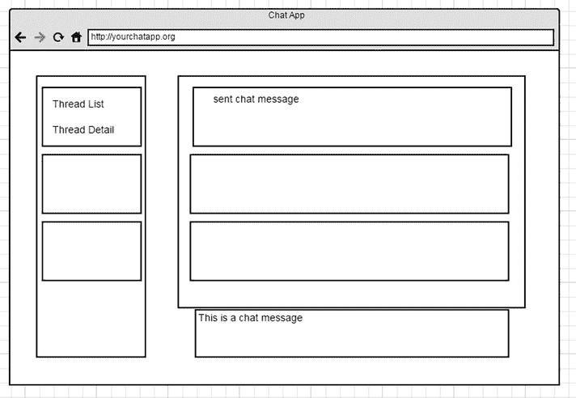

# 六、使用 Flux 构建 React 应用

Electronic supplementary material The online version of this chapter (doi:[10.​1007/​978-1-4842-1245-5_​6](http://dx.doi.org/10.1007/978-1-4842-1245-5_6)) contains supplementary material, which is available to authorized users.

前一章向您介绍了 Flux 项目。Flux 代表了 React 应用的高效应用架构。您了解了 Flux 如何使用 dispatcher 将动作发送到存储，然后使用 React 组件将这些动作呈现到 DOM 中。这一切都是通过查看一个利用 Flux 架构构建的普通`TodoMVC`应用来完成的。在本章中，您将创建一个比`TODO`应用更复杂的 React 应用，并根据 Flux 架构来构建它。

## 构建您的应用

在你开始为你要构建的应用创建组件和 Flux 架构之前，你需要定义你要做什么。在这个例子中，我们将展示当您使用 React 和 Flux 时，数据是如何单向流动的。一个很好的例子就是聊天应用。聊天应用可以有很多变化，但在这种情况下，你想要的聊天应用看起来就像脸书界面中的聊天功能。你有一个线索列表，显示你正在和一个朋友交流。通过消息窗格，您可以选择特定主题，跟踪该主题的历史记录，然后创建新消息。模拟起来，这个应用可能看起来类似于图 [6-1](#Fig1) 所示。

图 6-1。

Wireframe of your application

看一下这个线框，你可以理解在哪里你可以为你的应用创建 React 组件。整个应用将成为父组件。然后，您可以创建一个消息组件。

单一的消息组件不适合您熟悉的 React 的原子组件架构，因此您需要将消息部分分成三个 React 组件。一个用于创建消息，第二个用于管理列表中的单个消息项，第三个是这些消息项的容器。

当考虑线框左侧的消息线程时，可以看到类似的设计。在这里，您将拥有 threads 容器，该容器的子容器是 thread 项。

## 为应用创建 Dispatcher、Stores、Actions 和 React 组件

现在，您已经对将要创建的应用有了大致的了解，您可以构建 React 应用，并利用您选择的任何机制将数据加载到组件中，以便呈现它们。这是一个有效的方法，但是正如你在前一章中看到的，Flux 为 React 提供了一个架构，使得构建一个聊天应用比不使用 React 和 Flux 更容易。因此，现在您可以开始利用不断变化的思维来设计您的应用。

### 分配器

首先，您需要创建一个 dispatcher，正如您之前看到的，它只是 Flux dispatcher 模块的一个新实例，您可以在您的应用中共享它(清单 [6-1](#FPar1) )。

Listing 6-1\. Dispatcher for the Chat Application

`var Dispatcher = require('flux').Dispatcher;`

`module.exports = new Dispatcher();`

### 商店

如果你还记得，变化中的商店被认为是一种你可能在典型的 MVC 框架中发现的模型，只是更大一些。存储代表逻辑域中所有数据的位置，而不是特定元素的模型表示。因此，就聊天应用而言，您可以将所有的消息数据封装到一个单独的存储中，如清单 [6-2](#FPar2) 所示。

Listing 6-2\. The MessageStore Component

`var ChatAppDispatcher = require('../dispatcher/ChatAppDispatcher');`

`var ChatConstants = require('../constants/ChatConstants');`

`var ChatMessageUtils = require('../utils/ChatMessageUtils');`

`var EventEmitter = require('events').EventEmitter;`

`var ThreadStore = require('../stores/ThreadStore');`

`var assign = require('object-assign');`

`var ActionTypes = ChatConstants.ActionTypes;`

`var CHANGE_EVENT = 'change';`

`var _messages = {};`

`function _addMessages(rawMessages) {`

`rawMessages.forEach(function(message) {`

`if (!_messages[message.id]) {`

`_messages[message.id] = ChatMessageUtils.convertRawMessage(`

`message,`

`ThreadStore.getCurrentID()`

`);`

`}`

`});`

`}`

`function _markAllInThreadRead(threadID) {`

`for (var id in _messages) {`

`if (_messages[id].threadID === threadID) {`

`_messages[id].isRead = true;`

`}`

`}`

`}`

`var MessageStore = assign({}, EventEmitter.prototype, {`

`emitChange: function() {`

`this.emit(CHANGE_EVENT);`

`},`

`/**`

`* @param {function} callback`

`*/`

`addChangeListener: function(callback) {`

`this.on(CHANGE_EVENT, callback);`

`},`

`removeChangeListener: function(callback) {`

`this.removeListener(CHANGE_EVENT, callback);`

`},`

`get: function(id) {`

`return _messages[id];`

`},`

`getAll: function() {`

`return _messages;`

`},`

`/**`

`* @param {string} threadID`

`*/`

`getAllForThread: function(threadID) {`

`var threadMessages = [];`

`for (var id in _messages) {`

`if (_messages[id].threadID === threadID) {`

`threadMessages.push(_messages[id]);`

`}`

`}`

`threadMessages.sort(function(a, b) {`

`if (a.date < b.date) {`

`return -1;`

`} else if (a.date > b.date) {`

`return 1;`

`}`

`return 0;`

`});`

`return threadMessages;`

`},`

`getAllForCurrentThread: function() {`

`return this.getAllForThread(ThreadStore.getCurrentID());`

`}`

`});`

`MessageStore.dispatchToken = ChatAppDispatcher.register(function(action) {`

`switch(action.type) {`

`case ActionTypes.CLICK_THREAD:`

`ChatAppDispatcher.waitFor([ThreadStore.dispatchToken]);`

`_markAllInThreadRead(ThreadStore.getCurrentID());`

`MessageStore.emitChange();`

`break;`

`case ActionTypes.CREATE_MESSAGE:`

`var message = ChatMessageUtils.getCreatedMessageData(`

`action.text,`

`action.currentThreadID`

`);`

`_messages[message.id] = message;`

`MessageStore.emitChange();`

`break;`

`case ActionTypes.RECEIVE_RAW_MESSAGES:`

`_addMessages(action.rawMessages);`

`ChatAppDispatcher.waitFor([ThreadStore.dispatchToken]);`

`_markAllInThreadRead(ThreadStore.getCurrentID());`

`MessageStore.emitChange();`

`break;`

`default:`

`// do nothing`

`}`

`});`

`module.exports = MessageStore;`

`MessageStore`代表您将在聊天应用中创建或获取的消息的所有数据。商店必须做的第一件事是向调度程序注册一个回调，这是通过`ChatAppDispatcher.register()`完成的。该回调成为向存储区输入数据的唯一方法。您将看到回调包含一个大的`switch`语句，在这种情况下，该语句与发送给回调的不同动作类型无关。一旦遇到`switch`中的适用情况，商店将能够对该动作做些什么，然后可以发送`emitChange()`，它将与视图通信，然后它们可以从商店获取新数据。

值得注意的是，该存储不包含任何设置数据的公共方法，这意味着一切都是通过 getters 访问的。这意味着您不必担心数据从应用的另一部分泄漏到您的存储中。这使得存储成为数据的文字存储箱。它将能够处理您的消息，并通过 dispatcher 回调更新它们，然后通知您发生的变化。这可以从`MessageStore`中看出，这里的`actionType`就是`ActionTypes.RECEIVE_RAW_MESSAGES`。一旦收到这个消息，`MessageStore`将通过其私有的`_addMessages`函数添加消息，将该线程中的消息标记为已读，并最终通过`EventEmitter`发出更改。

现在您已经看到了`MessageStore`，您需要能够控制您的聊天应用中哪些线程可用。这是通过`ThreadStore`(列表 [6-3](#FPar3) )完成的。

Listing 6-3\. The ThreadStore Component

`var ChatAppDispatcher = require('../dispatcher/ChatAppDispatcher');`

`var ChatConstants = require('../constants/ChatConstants');`

`var ChatMessageUtils = require('../utils/ChatMessageUtils');`

`var EventEmitter = require('events').EventEmitter;`

`var assign = require('object-assign');`

`var ActionTypes = ChatConstants.ActionTypes;`

`var CHANGE_EVENT = 'change';`

`var _currentID = null;`

`var _threads = {};`

`var ThreadStore = assign({}, EventEmitter.prototype, {`

`init: function(rawMessages) {`

`rawMessages.forEach(function(message) {`

`var threadID = message.threadID;`

`var thread = _threads[threadID];`

`if (!(thread && thread.lastTimestamp > message.timestamp)) {`

`_threads[threadID] = {`

`id: threadID,`

`name: message.threadName,`

`lastMessage: ChatMessageUtils.convertRawMessage(message, _currentID)`

`};`

`}`

`}, this);`

`if (!_currentID) {`

`var allChrono = this.getAllChrono();`

`_currentID = allChrono[allChrono.length - 1].id;`

`}`

`_threads[_currentID].lastMessage.isRead = true;`

`},`

`emitChange: function() {`

`this.emit(CHANGE_EVENT);`

`},`

`/**`

`* @param {function} callback`

`*/`

`addChangeListener: function(callback) {`

`this.on(CHANGE_EVENT, callback);`

`},`

`/**`

`* @param {function} callback`

`*/`

`removeChangeListener: function(callback) {`

`this.removeListener(CHANGE_EVENT, callback);`

`},`

`/**`

`* @param {string} id`

`*/`

`get: function(id) {`

`return _threads[id];`

`},`

`getAll: function() {`

`return _threads;`

`},`

`getAllChrono: function() {`

`var orderedThreads = [];`

`for (var id in _threads) {`

`var thread = _threads[id];`

`orderedThreads.push(thread);`

`}`

`orderedThreads.sort(function(a, b) {`

`if (a.lastMessage.date < b.lastMessage.date) {`

`return -1;`

`} else if (a.lastMessage.date > b.lastMessage.date) {`

`return 1;`

`}`

`return 0;`

`});`

`return orderedThreads;`

`},`

`getCurrentID: function() {`

`return _currentID;`

`},`

`getCurrent: function() {`

`return this.get(this.getCurrentID());`

`}`

`});`

`ThreadStore.dispatchToken = ChatAppDispatcher.register(function(action) {`

`switch(action.type) {`

`case ActionTypes.CLICK_THREAD:`

`_currentID = action.threadID;`

`_threads[_currentID].lastMessage.isRead = true;`

`ThreadStore.emitChange();`

`break;`

`case ActionTypes.RECEIVE_RAW_MESSAGES:`

`ThreadStore.init(action.rawMessages);`

`ThreadStore.emitChange();`

`break;`

`default:`

`// do nothing`

`}`

`});`

`module.exports = ThreadStore;`

`ThreadStore`和`MessageStore`一样，只有公共的 getter 方法，没有 setter 方法。`ThreadStore`向调度程序注册一个回调，其中包含`switch`语句，该语句将控制存储如何对调度程序发送的动作做出 React。`switch`语句响应通过调度程序发送的特定`ActionTypes`，然后发送`emitChange()`事件。

与`ThreadStore`相关的是`UnreadThreadStore`(列表 [6-4](#FPar4) )。这个商店将在`ThreadSection`组件中被引用，并绑定到`_onChange`事件。这样，当线程被标记为未读时，组件可以更新状态。

Listing 6-4\. The UnreadThreadStore Component

`var ChatAppDispatcher = require('../dispatcher/ChatAppDispatcher');`

`var ChatConstants = require('../constants/ChatConstants');`

`var EventEmitter = require('events').EventEmitter;`

`var MessageStore = require('../stores/MessageStore');`

`var ThreadStore = require('../stores/ThreadStore');`

`var assign = require('object-assign');`

`var ActionTypes = ChatConstants.ActionTypes;`

`var CHANGE_EVENT = 'change';`

`var UnreadThreadStore = assign({}, EventEmitter.prototype, {`

`emitChange: function() {`

`this.emit(CHANGE_EVENT);`

`},`

`/**`

`* @param {function} callback`

`*/`

`addChangeListener: function(callback) {`

`this.on(CHANGE_EVENT, callback);`

`},`

`/**`

`* @param {function} callback`

`*/`

`removeChangeListener: function(callback) {`

`this.removeListener(CHANGE_EVENT, callback);`

`},`

`getCount: function() {`

`var threads = ThreadStore.getAll();`

`var unreadCount = 0;`

`for (var id in threads) {`

`if (!threads[id].lastMessage.isRead) {`

`unreadCount++;`

`}`

`}`

`return unreadCount;`

`}`

`});`

`UnreadThreadStore.dispatchToken = ChatAppDispatcher.register(function(action) {`

`ChatAppDispatcher.waitFor([`

`ThreadStore.dispatchToken,`

`MessageStore.dispatchToken`

`]);`

`switch (action.type) {`

`case ActionTypes.CLICK_THREAD:`

`UnreadThreadStore.emitChange();`

`break;`

`case ActionTypes.RECEIVE_RAW_MESSAGES:`

`UnreadThreadStore.emitChange();`

`break;`

`default:`

`// do nothing`

`}`

`});`

`module.exports = UnreadThreadStore;`

商店到此为止。它们通过注册的回调以对象文本的形式从调度程序获取数据，然后发出事件。接下来，您将检查将从 React 视图中调用的操作，或者在本例中是操作创建者。

### 行动

动作驱动 Flux Chat 应用的单向数据流。如果没有这些操作，视图将不会接收到来自商店的更新，因为没有向调度程序传递任何东西来调用商店的回调。这个例子中的动作以动作创建者的形式出现。这些创建者可以从 React 的视图中创建一个动作，或者您可以从服务器上的 WebAPI 中获得一条消息。在清单 [6-5](#FPar5) 中，您不需要创建一个服务器来服务聊天请求，但是下面的代码片段强调了如何创建一个`ServerAction`。这导出了一些方法，这些方法可以从你的服务器获取数据，然后通过`.` `dispatch()`函数将数据发送给 Flux 应用。

Listing 6-5\. This ServerActionCreator Can Receive Messages from an API and Dispatch to the Rest of the Flux Application

`var ChatAppDispatcher = require('../dispatcher/ChatAppDispatcher');`

`var ChatConstants = require('../constants/ChatConstants');`

`var ActionTypes = ChatConstants.ActionTypes;`

`module.exports = {`

`receiveAll: function(rawMessages) {`

`ChatAppDispatcher.dispatch({`

`type: ActionTypes.RECEIVE_RAW_MESSAGES,`

`rawMessages: rawMessages`

`});`

`},`

`receiveCreatedMessage: function(createdMessage) {`

`ChatAppDispatcher.dispatch({`

`type: ActionTypes.RECEIVE_RAW_CREATED_MESSAGE,`

`rawMessage: createdMessage`

`});`

`}`

`};`

动作创建者的另一个功能是，他们可以成为一个实用程序，将视图中的信息传递给服务器和调度程序。这正是这个 Flux 例子中的`MessageAction`所发生的事情(列表 [6-6](#FPar6) )。您将在下一节看到的`MessageComposer`组件调用`MessageAction`来创建消息。这将首先把消息数据发送给调度程序，并调用应用中的 API 实用程序来更新服务器上的数据，如清单 [6-6](#FPar6) 所示。

Listing 6-6\. The MessageActionCreator Will Dispatch Message Data via the Dispatcher and Update the Server via an API Method

`var ChatAppDispatcher = require('../dispatcher/ChatAppDispatcher');`

`var ChatConstants = require('../constants/ChatConstants');`

`var ChatWebAPIUtils = require('../utils/ChatWebAPIUtils');`

`var ChatMessageUtils = require('../utils/ChatMessageUtils');`

`var ActionTypes = ChatConstants.ActionTypes;`

`module.exports = {`

`createMessage: function(text, currentThreadID) {`

`ChatAppDispatcher.dispatch({`

`type: ActionTypes.CREATE_MESSAGE,`

`text: text,`

`currentThreadID: currentThreadID`

`});`

`var message = ChatMessageUtils.getCreatedMessageData(text, currentThreadID);`

`ChatWebAPIUtils.createMessage(message);`

`}`

`};`

在您的聊天应用中，唯一需要考虑的是当有人点击一个线程时会发生什么。这个动作由`ThreadActionCreator`处理，如清单 [6-7](#FPar7) 所示。

Listing 6-7\. ThreadActionCreator Verifies that the Thread of a Given ID Has Been Clicked in the Application

`var ChatAppDispatcher = require('../dispatcher/ChatAppDispatcher');`

`var ChatConstants = require('../constants/ChatConstants');`

`var ActionTypes = ChatConstants.ActionTypes;`

`module.exports = {`

`clickThread: function(threadID) {`

`ChatAppDispatcher.dispatch({`

`type: ActionTypes.CLICK_THREAD,`

`threadID: threadID`

`});`

`}`

`};`

### React 组分

React 组件与您之前在本书中看到的组件没有什么不同；然而，它们确实涉及到更积极地利用状态来解释聊天应用及其不断变化的体系结构。让我们从创建`ThreadSection`组件开始。为此，您需要创建`ThreadListItem`(清单 [6-8](#FPar8) ，它将在`ThreadSection`的`render()`过程中被添加。`ThreadListItem`还调用`ThreadAction`让`ThreadClick`将事件发送给调度程序。

Listing 6-8\. ThreadListItem—Note the _onClick Binding to the ThreadAction for clickThread

`var ChatThreadActionCreators = require('../actions/ChatThreadActionCreators');`

`var React = require('react');`

`// Note: cx will be obsolete soon so you can use`

`//`[`https://github.com/JedWatson/classnames`](https://github.com/JedWatson/classnames)T2】

`var cx = require('react/lib/cx');`

`var ReactPropTypes = React.PropTypes;`

`var ThreadListItem = React.createClass({`

`propTypes: {`

`thread: ReactPropTypes.object,`

`currentThreadID: ReactPropTypes.string`

`},`

`render: function() {`

`var thread = this.props.thread;`

`var lastMessage = thread.lastMessage;`

`return (`

`<li`

`className={cx({`

`'thread-list-item': true,`

`'active': thread.id === this.props.currentThreadID`

`})}`

`onClick={``this._onClick`T2】

`<h5 className="thread-name">{thread.name}</h5>`

`
`

`{lastMessage.date.toLocaleTimeString()}`

`
`

`
`

`{lastMessage.text}`

`
`

`</li>`

`);`

`},`

`_onClick: function() {`

`ChatThreadActionCreators.clickThread(this.props.thread.id);`

`}`

`});`

`module.exports = ThreadListItem;`

Note

组件`cx`已被弃用，但是可以在 [`https://github.com/JedWatson/classnames`](https://github.com/JedWatson/classnames) 找到一个用于类操作的独立组件。如果你选择利用这种类操作，你也可以在`http:// reactcss.com`找到解决方案。

现在您已经有了`ThreadListItems`，您可以将这些集合到您的`ThreadSection`中，如清单 [6-9](#FPar10) 所示。这个`ThreadSection`在组件的生命周期事件`getInitialState`期间从`ThreadStore`和`UnreadThreadStore`获取线程。这将设置状态来控制在`render`函数中创建多少个`ThreadListItem`。

Listing 6-9\. The ThreadSection Component

`var React = require('react');`

`var MessageStore = require('../stores/MessageStore');`

`var ThreadListItem = require('../components/ThreadListItem.react');`

`var ThreadStore = require('../stores/ThreadStore');`

`var UnreadThreadStore = require('../stores/UnreadThreadStore');`

`function``getStateFromStores`T2】

`return {`

`threads: ThreadStore.getAllChrono(),`

`currentThreadID: ThreadStore.getCurrentID(),`

`unreadCount: UnreadThreadStore.getCount()`

`};`

`}`

`var ThreadSection = React.createClass({`

`getInitialState: function() {`

`return``getStateFromStores()`T2】

`},`

`componentDidMount: function() {`

`ThreadStore.addChangeListener(this._onChange);`

`UnreadThreadStore.addChangeListener(this._onChange);`

`},`

`componentWillUnmount: function() {`

`ThreadStore.removeChangeListener(this._onChange);`

`UnreadThreadStore.removeChangeListener(this._onChange);`

`},`

`render: function() {`

`var threadListItems = this.state.threads.map(function(thread) {`

`return (`

`<ThreadListItem`

`key={thread.id}`

`thread={thread}`

`currentThreadID={this.state.currentThreadID}`

`/>`

`);`

`}, this);`

`var unread =`

`this.state.unreadCount === 0 ?`

`null :`

`Unread threads: {this.state.unreadCount};`

`return (`

`
`

`
`

`{unread}`

`
`

`<ul className="thread-list">`

`{``threadListItems`T2】

`</ul>`

`
`

`);`

`},`

`/**`

`* Event handler for 'change' events coming from the stores`

`*/`

`_onChange: function() {`

`this.setState(getStateFromStores());`

`}`

`});`

`module.exports = ThreadSection;`

现在，您已经使用 React 和 Flux 创建了应用的线程部分。接下来是`MessageSection`，它要求您创建一个`MessageListItem`组件和一个`MessageComposer`组件，如清单 [6-10](#FPar11) 所示。

Listing 6-10\. MessageComposer—Binds to the Textarea and Sends the Text to the MessageActionCreators

`var ChatMessageActionCreators = require('../actions/ChatMessageActionCreators');`

`var React = require('react');`

`var ENTER_KEY_CODE = 13;`

`var MessageComposer = React.createClass({`

`propTypes: {`

`threadID: React.PropTypes.string.isRequired`

`},`

`getInitialState: function() {`

`return {text: ''};`

`},`

`render: function() {`

`return (`

`<textarea`

`className="message-composer"`

`name="message"`

`value={this.state.text}`

`onChange={this._onChange}`

`onKeyDown={this._onKeyDown}`

`/>`

`);`

`},`

`_onChange: function(event, value) {`

`this.setState({text: event.target.value});`

`},`

`_onKeyDown: function(event) {`

`if (event.keyCode === ENTER_KEY_CODE) {`

`event.preventDefault();`

`var text = this.state.text.trim();`

`if (text) {`

`ChatMessageActionCreators.createMessage(text, this.props.threadID);`

`}`

`this.setState({text: ''});`

`}`

`}`

`});`

`module.exports = MessageComposer;`

`MessageComposer`组件是一个`textarea`，它将把它的变更事件绑定到`state.text`和`keydown`事件。`keydown`事件将寻找键盘上的回车键。如果已经按下，`MessageComposer`将调用`ChatMessageActionCreators.createMessage()`函数创建发送给 API 服务器和调度程序的动作。

`MessageListItems`(清单 [6-11](#FPar12) )只是一个 HTML 列表项，包含从`MessageSection`传递给它的消息数据。

Listing 6-11\. MessageListItems Contain Message Details

`var React = require('react');`

`var ReactPropTypes = React.PropTypes;`

`var MessageListItem = React.createClass({`

`propTypes: {`

`message: ReactPropTypes.object`

`},`

`render: function() {`

`var message = this.props.message;`

`return (`

`<li className="message-list-item">`

`<h5 className="message-author-name">{message.authorName}</h5>`

`
`

`{message.date.toLocaleTmeString()}`

`
`

`
{message.text}
`

`</li>`

`);`

`}`

`});`

`module.exports = MessageListItem;`

清单 [6-12](#FPar13) 中的`MessageSection`首先通过`getInitialState` React 生命周期从存储中获取状态。这将获取当前线程并得到它的消息。一旦组件挂载，在`componentDidMount`，`MessageStore`和`ThreadStore`都将监听器绑定到`_onChange`事件。这个改变事件`this.setState(getStateFromStores());`被再次调用，就像初始状态被设置一样。这是 React 和 Flux 的精髓。这是一个单向数据流，其中每次渲染都来自于从存储中获取状态，并且只有一种方法来更新存储。`MessageSection`还聚合添加到状态对象的消息，并为每个消息创建新的`MessageListItems`。

Listing 6-12\. The MessageSection Component

`var MessageComposer = require('./MessageComposer.react');`

`var MessageListItem = require('./MessageListItem.react');`

`var MessageStore = require('../stores/MessageStore');`

`var React = require('react');`

`var ThreadStore = require('../stores/ThreadStore');`

`function getStateFromStores() {`

`return {`

`messages: MessageStore.getAllForCurrentThread(),`

`thread: ThreadStore.getCurrent()`

`};`

`}`

`function getMessageListItem(message) {`

`return (`

`<MessageListItem`

`key={message.id}`

`message={message}`

`/>`

`);`

`}`

`var MessageSection = React.createClass({`

`getInitialState: function() {`

`return getStateFromStores();`

`},`

`componentDidMount: function() {`

`this._scrollToBottom();`

`MessageStore.addChangeListener(this._onChange);`

`ThreadStore.addChangeListener(this._onChange);`

`},`

`componentWillUnmount: function() {`

`MessageStore.removeChangeListener(this._onChange);`

`ThreadStore.removeChangeListener(this._onChange);`

`},`

`render: function() {`

`var messageListItems = this.state.messages.map(getMessageListItem);`

`return (`

`
`

`<h3 className="message-thread-heading">{this.state.thread.name}</h3>`

`<ul className="message-list" ref="messageList">`

`{messageListItems}`

`</ul>`

`<MessageComposer threadID={this.state.thread.id}/>`

`
`

`);`

`},`

`componentDidUpdate: function() {`

`this._scrollToBottom();`

`},`

`_scrollToBottom: function() {`

`var ul = this.refs.messageList.getDOMNode();`

`ul.scrollTop = ul.scrollHeight;`

`},`

`/**`

`* Event handler for 'change' events coming from the MessageStore`

`*/`

`_onChange: function() {`

`this.setState(getStateFromStores());`

`}`

`});`

`module.exports = MessageSection;`

您现在已经有了应用的完整 MessageSection 和 ThreadSection。剩下的唯一一项就是将这些全部放入清单 [6-13](#FPar14) 所示的`ChatApp`组件中。

Listing 6-13\. The ChatApp Component

`var MessageSection = require('./MessageSection.react');`

`var React = require('react');`

`var ThreadSection = require('./ThreadSection.react');`

`var ChatApp = React.createClass({`

`render: function() {`

`return (`

`
`

`<ThreadSection />`

`<MessageSection />`

`
`

`);`

`}`

`});`

`module.exports = ChatApp;`

## 写作测试

正如您在本书前面看到的，Jest 是编写测试的有用工具。清单 [6-14](#FPar15) 是一个简单的测试，您可以将其作为一个模型。这个测试是为`UnreadThreadStore`编写的，它确保了未读线程的正确计数。它还确保回调注册到调度程序。

Listing 6-14\. UnreadThreadCount Tests

`jest.dontMock('../UnreadThreadStore');`

`jest.dontMock('object-assign');`

`describe('UnreadThreadStore', function() {`

`var ChatAppDispatcher;`

`var UnreadThreadStore;`

`var callback;`

`beforeEach(function() {`

`ChatAppDispatcher = require('../../dispatcher/ChatAppDispatcher');`

`UnreadThreadStore = require('../UnreadThreadStore');`

`callback = ChatAppDispatcher.register.mock.calls[0][0];`

`});`

`it('registers a callback with the dispatcher', function() {`

`expect(ChatAppDispatcher.register.mock.calls.length).toBe(1);`

`});`

`it('provides the unread thread count', function() {`

`var ThreadStore = require('../ThreadStore');`

`ThreadStore.getAll.mockReturnValueOnce(`

`{`

`foo: {lastMessage: {isRead: false}},`

`bar: {lastMessage: {isRead: false}},`

`baz: {lastMessage: {isRead: true}}`

`}`

`);`

`expect(UnreadThreadStore.getCount()).toBe(2);`

`});`

`});`

## 运行应用

您可以从位于 [`https://github.com/cgack/flux/tree/master/examples/flux-chat`](https://github.com/cgack/flux/tree/master/examples/flux-chat) 的库的根目录运行这个应用。一旦你克隆了这个库，或者这个分支的父库，你就可以从`flux-chat`目录运行`npm install`。这将下拉所有需要的依赖项。之后，只需运行`npm test`来运行测试。

要最终运行应用，使用`npm start`命令。这样做将启动观察器，并将所有的`app.js`引导代码转换成`bundle.js`文件。然后，您只需要在浏览器中导航到`index.html`文件，就可以看到聊天应用的运行。

## 摘要

在这一章中，你看到了一个关于 React 和 Flux 如何一起工作的更加人为的例子。这个例子展示了更多的 React 组件和状态的使用，并说明了一个单向数据流。无论有没有 Flux，这个例子都是开始构建自己的 React 组件和应用的良好起点。

这本书旨在向您介绍 React，并让您习惯于通过 React 组件的视角来看待 web 开发。我希望你喜欢这本书，并发现它很有用。