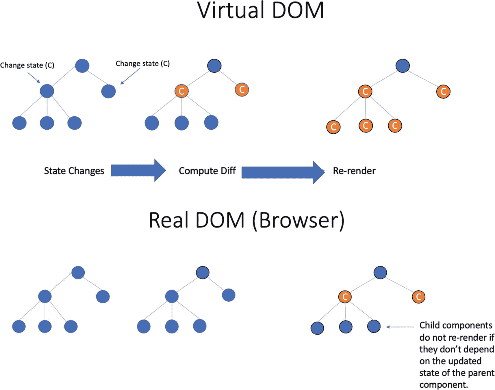
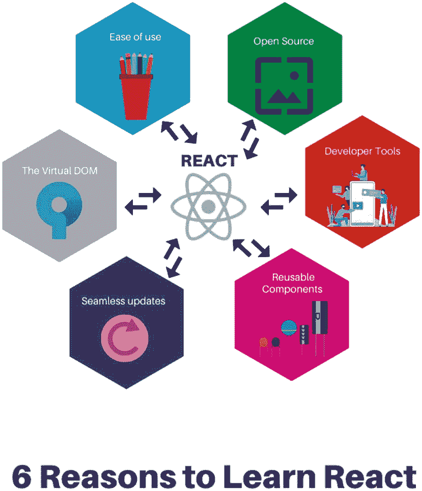

# 一、在 React 中领先

本章将简要概述一些关键的 React 概念，包括将 React 作为前端开发工具的优势和潜在好处。

## 第一 React

React 是一个开源 JavaScript 库，用于创建交互式用户界面(ui)和前端应用。它在世界各地不断增长的用户数量和强大的社区可能证明了这样一个事实，即 React 正在实现其存在的理由，开发用户界面，特别是更快的和交互式的用户界面。

您“声明”您希望您的 UI 看起来如何以及它应该如何表现，React 将按照您的指示并按照您的描述在您的浏览器中呈现它。

脸书于 2011 年创建了 React，并于 2013 年开源。从技术上讲，React 是一个库，但是由于它的行为和功能，许多用户称它为框架。也许，描述或比较 React 行为的一种方式是将其视为流行的架构模式模型-视图-控制器(MVC)中的视图。

### 基于组件的体系结构

React 应用的核心是由组件组成的。*可重用组件*更准确地说。它是用户界面的一部分，每个元素都有其特定的逻辑。

React 的模块化特性允许独立开发应用的功能，并在项目内外重用。例如，在图 [1-1](#Fig1) 中，我们可以将网页分解成各种组件，如导航条、英雄部分、页脚等。

图 1-1

典型网站截图。来源: [`www.reactjs.org`](http://www.reactjs.org)

一个导航栏组件，如图 [1-2](#Fig2) 所示，包含页面标题和导航元素。它通常位于屏幕的顶部。

图 1-2

导航栏组件的一个示例

如图 [1-3](#Fig3) 所示，hero section 组件包含图像，通常是大图像，旨在从页面的视野中脱颖而出并吸引注意力。

图 1-3

英雄部分组件的示例

因此，如果你仔细观察，React 组件是独立的、自包含的可重用代码块，我们可以将它们放在一起创建复杂的用户界面。

是的，React 应用由许多可重用的组件组成。在任何编程语言中，组件都可以被认为是简单的函数。每个 React 应用的根都是一个被恰当地称为根组件的元素，它将整个应用(包括它的所有子组件)结合在一起。

### 文档对象模型(DOM)

学习 React 时另一个值得理解的概念是它的虚拟文档对象模型，简称为虚拟 DOM。

简单地说，虚拟 DOM 仅仅是真实 DOM 的一种表示。

数据或状态的改变首先在虚拟 DOM 上完成。在计算出变化之后，真正的 DOM 就被更新了。结果呢？整体性能更快，用户体验更好。React 仅在状态元素发生变化时重新渲染组件及其子组件。

实质上，虚拟 DOM 的工作方式如下:

*   如果数据发生变化，虚拟 DOM 中的整个 UI 都会重新呈现。

*   重新渲染会创建一个具有相应更改的新虚拟 DOM。

*   接下来，对新旧虚拟 DOM 之间的差异进行比较或计算。

*   然后，真正的 DOM 只更新已经改变的元素或状态，而不是整个 DOM 树。

所以，是的，虚拟 DOM 的巧妙创建和使用是 React 快的原因之一。

下面是一些展示 React 的虚拟 DOM 如何工作的可视化表示。

图 1-4

仅当子组件的状态依赖于父组件时，子组件才会重新渲染

在图 [1-4](#Fig4) 中，如果子组件依赖于父组件的更新状态，改变父状态将重新呈现子组件。

图 1-5

如果子组件不依赖于父组件的更新状态，它们不会在真实的 DOM 中重新呈现

在图 [1-5](#Fig5) 中，如果子组件不依赖于父组件的更新状态，改变父状态不会重新呈现子组件。

就性能而言，访问或创建虚拟 DOM 比在真实 DOM 中构建或重新呈现要便宜。

图 [1-6](#Fig6) 提供了真实 DOM 和虚拟 DOM 之间的概要比较。

图 1-6

真实 DOM 和虚拟 DOM 的对照表

### 客户端渲染和服务器端渲染

您可以选择通过客户端呈现(CSR)或服务器端呈现(SSR)来实现 React 应用。开发人员可以在客户端和服务器端构建独立和自包含的应用组件。

客户端呈现(CSR)是一种相对较新的呈现网站的方式，它使用 JavaScript 在 UI 中显示内容。在客户端运行代码有一定的性能优势，包括在每次修改代码时使界面更具交互性。当数据改变时，React 将有效地更新和重新呈现我们的组件。

CSR 上的初始页面加载应该比较慢，但是页面重新加载可能会变得非常快，因为整个 UI 不是在服务器上调用的。

React 服务器端呈现(SSR)意味着组件在服务器上呈现，输出是 HTML 内容。做 SSR 的一个论据是，它有更好的应用性能，特别是对于内容密集型应用；另一个原因是，与做 CSR 相比，HTML 输出对 SEO 更友好。

### 单向流/单向数据绑定

React 更多地用于单向流或单向数据绑定。向下的数据流是 React 中允许更快和更有效(更不用说容易测试的代码)开发时间的事情之一。

单向数据绑定允许您更好地控制您的应用开发，因为组件应该是不可变的，并且其中的数据不能被更改。要直接编辑任何元素，必须使用回调函数。

## 为什么要 React？

与其他框架、库或编程语言相比，React 不仅学习速度快；它也是后端不可知的，允许用户使用它，无论他们的栈是什么。特别是 JavaScript 开发人员，可以很快精通 React 开发。

一个很大的加分点是在其官方网站上有一个写得很好的文档，易于遵循和理解。您可以将 React 视为 CMS(内容管理系统)世界的 WordPress，因为您的大多数问题都可以通过安装开源库来解决。

React 也被认为是 SEO 友好的，这意味着 React 组件对于 Google 索引来说更加简单。这对企业来说是件大事。

图 1-7

学习和使用 React 的理由

图 [1-7](#Fig7) 说明了 React 为何成为开发者和许多知名商业品牌的最爱。

学习和使用 React 的一些原因，以及为什么它将在许多年内保持相关性:

*   React 中虚拟 DOM 的威力。它只更新和呈现同样在 DOM 中更新和生成的元素。

*   快速渲染和可重用组件。创建可在项目内外重用的封装的独立组件。

*   React 可以使用 Next.js 在服务器上呈现。

*   要开发移动应用，可以使用 React Native，这是一个使用 React 的移动应用开发框架。此外，您可以在 React 本地移动应用中重用 React web 应用的业务逻辑部分。

*   React 相对于其他 JavaScript 框架，甚至是 Angular 或 Ember.js 等前端框架来说，还是比较容易学的。

*   大量的工具可供选择，包括 React DevTools、Redux DevTools 和 MobX DevTools。

*   React 是开源的，拥有一个由世界各地活跃的社区或团体组成的强大生态系统。

最后一个，巨大的 React 社区和支持，是一个重要的因素，不管你信不信。这个活跃的社区也转化为开发人员创建许多工具和第三方库来帮助您的开发体验。

基于个人经验，我们已经求助于许多 React 团体，如 Slack、Gitter、脸书团体、Discord、Spectrum 和 Twitter。或者，每当我们遇到困难或需要澄清时，我们会联系某个特定的人。

几乎总是有人给我们答复，根据我们的经验，通常不到一个小时，可能是因为活跃的成员来自全球不同的时区。

## React 中的职业机会

对 React 的兴趣高于 Vue.js、Angular 等其他流行的前端框架和库(图 [1-8](#Fig8) )。如果你快速搜索一个前端开发人员的工作，你会看到许多公司在寻找精通 React 的开发人员或有 React 经验的人。我们相信这种趋势将会持续数年。

图 1-8

对 React、Angular 和 Vue 的兴趣不断增加。来源: [`https://trends.google.com/trends/explore?date=2019-09-01`](https://trends.google.com/trends/explore%253Fdate%253D2019-09-01)

如果你想扩大你作为前端开发人员和全栈开发人员的招聘需求，掌握 React 是一条必由之路。

React 开发人员目前有很高的就业市场需求，在可预见的未来。是的，你可能有自己喜欢的语言、库或框架，这是可以理解的。尽管如此，坦率地说，学习一门新语言或一种新编程工具的标准之一应该是你有多容易被雇佣，无论是作为一名自由职业者还是作为一家公司的一部分。

## 摘要

本章概述了关键的 React 概念，包括学习 React 的优势和好处。我们了解到所有 React 应用的核心是其可重用组件，以及虚拟 DOM 如何实现整体快速性能和更好的用户体验。

React 变得如此流行的另一个原因是，它让开发人员有可能在客户端和服务器端构建和呈现独立和自包含的组件。最后，我们表明，随着兴趣和需求的持续增长，React 技能是一个很好的职业发展方向。

在下一章，我们将开始下载和安装构建 React 应用所需的软件包。