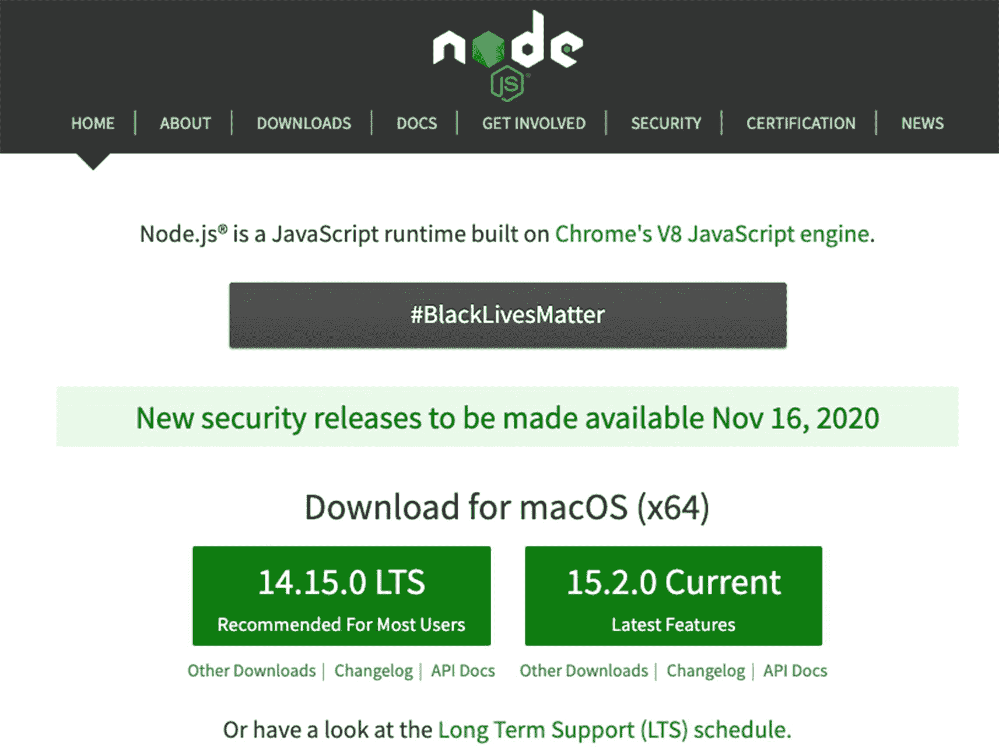

# 二、Node 包管理器入门

在我们启动和运行 React 之前，我们需要一个安装程序来下载和管理我们的 JavaScript 软件包。最流行的包管理器之一是 Node 包管理器(NPM)。另一个是纱，一个较新的包装经理，据说从 NPM 汲取了很多灵感。对于我们的项目，我们选择使用 NPM，而不是纱线。如果你喜欢，你可以用纱线。

我们的项目将使用 NPM，所以本章将介绍一些最相关的 NPM 命令和快捷方式，包括语义版本和 NPM 脚本。我们将简单讨论一下 Yarn，并浏览一些常用的 Yarn 命令。

现在不要担心遵循这里的命令，因为一旦我们开始构建我们的项目，我们将在后续章节中一步一步地做它。

## Node 包管理器概述

在开始之前，让我们回顾一下什么是 NPM，以及我们如何在我们的应用中使用它。NPM 类似于其他的包管理器，比如 Ruby on Rails 中的 RubyGems 或者 Python 中的 PIP。

NPM 于 2010 年发布，是 JavaScript 的包库管理器，通常预装 Node.js，这是一个用于构建服务器端应用的环境。如果你还没有安装 Node.js，去他们的网站 [`www.nodejs.org`](http://www.nodejs.org) (图 [2-1](#Fig1) )。



图 2-1

Node 的网站

确保安装长期支持(LTS)版本，因为它比当前版本更稳定。如果您已经安装了 Node，您可以检查版本:

```jsx
$ node –version

```

说到 Node 版本管理，让我向您介绍一下——如果您还不熟悉的话——Node 版本管理器，简称为`nvm`。

## Node 版本管理器

Node 版本管理器(NVM)是一个用于管理 Node.js 运行时的不同版本的工具。

您可以轻松地降级或升级 Node.js 版本，如果您面对的是只与特定范围的 Node.js 版本兼容的遗留应用或 JavaScript 库，这将非常方便。

用一个命令安装`nvm`:

```jsx
curl -o- https://raw.githubusercontent.com/nvm-sh/nvm/v0.34.0/install.sh | bash

#or

wget -qO- https://raw.githubusercontent.com/nvm-sh/nvm/v0.37.0/install.sh | bash

```

要在 Mac 和 Linux 上完整安装 NVM，请点击这里 [`https://github.com/nvm-sh/nvm`](https://github.com/nvm-sh/nvm) 。

不幸的是，`nvm`不支持 Windows，但是根据 WSL 版本的不同，它可以在 Windows Subsystem for Linux (WSL)中实现。

要在 Windows 中下载并安装 NVM，请点击此处 [`https://github.com/coreybutler/nvm-windows`](https://github.com/coreybutler/nvm-windows) 。

安装 NVM 后，您可以安装特定版本的 Node:

```jsx
$ nvm install 14
$ nvm use 14

```

前面的命令将安装并使用 Node v14 的最新次要版本。现在，如果有一个 JavaScript 项目或库只在 Node v12 中运行，您可以很容易地切换到那个版本:

```jsx
$ nvm install 12
$ nvm use 12

```

前面的命令将安装并使用 Node v12 的最新次要版本。

对于任何 JavaScript 开发人员来说，另一个不可或缺的资源是 npmjs 网站，在那里我们可以搜索需要为我们的项目安装的库或框架。

## 安装软件包

你可以使用 NPM 安装 NPM 注册表中任何可用的库或框架。你可以前往 [`www.npmjs.com`](http://www.npmjs.com) 查看更多。如果您已经有了旧版本，您可以按如下方式进行更新。

对于 Mac 和 Linux 用户:

```jsx
$ npm install -g npm@latest

```

### Node 封装模块

软件包以本地或全局模式安装。全局模式包可从命令行界面(CLI)获得，而本地模式包安装在父工作文件的`node_modules`文件夹中。

设置新的或现有的 NPM 软件包:

```jsx
$ npm init

$ npm init –-y

```

填写空白处或只按`Enter`接受默认值或添加标志`–-y`来快速生成 package.json 文件。

如果您想要克隆其他人的代码，请在项目根目录下运行以下命令:

```jsx
$ npm install or npm i

```

这将自动获取运行应用所需的所有已声明的包。声明的包位于 package.json 文件中。

### Package.json 和包锁. json

**Package.json** 是使用 NPM 和 Node 应用时的重要清单文件。它包含您的所有应用信息，尤其是您的应用正确运行所需的依赖项或模块。这个清单文件也是许多开发人员在运行项目的本地版本时首先要查看的。

**Package-lock.json** 是你的 package.json 文件的副本，版本依赖树。

清单 [2-1](#PC8) 中所示的 package.json 文件是我们在终端中执行 npm install 命令时自动创建的。这只是一个 package.json 文件的示例对象结构，包括依赖项和 devDependencies。我们将在第四章[开始为我们的应用安装软件包和库。](04.html)

```jsx
{ "name": "npmproject",
   "version": "1.0.0",
   "private"
   "description": "NPM commands",
   "main": "index.js",
   "scripts": {
        "start": "react-scripts start",
        "build": "react-scripts build",
        "test": "react-scripts test",
        "eject": "react-scripts eject",
   "backend": "json-server --watch db.json --port 5000 -- delay=500",
   "start:fullstack": "concurrently \"npm run backend\" \"npm run start\""
 },
    "author": "Devlin Duldulao",
    "license": "MIT",
    "dependencies": {
    "react": "^16.8.6",
               "react-dom": "^16.8.6",
},
"devDependencies": {
    "husky": "^4.3.0",
    "json-server": "^0.16.2",
    "lint-staged": "^10.4.0",
    "mobx-react-devtools": "^6.1.1",
    "prettier": "^2.1.2"
  },
 }

Listing 2-1A Sample of a package.json File

```

而 package.json 用于项目属性、作者、版本、描述、脚本、许可证等依赖项。，package-lock.json 同样会自动创建，以将依赖项锁定到特定的版本号。

如清单 [2-1](#PC8) 所示，脚本对象是我在已有项目中首先读到的，因为脚本告诉我们运行项目或构建项目需要运行什么命令。脚本对象还通过它的键和值对帮助我们运行更短的命令。你可以在脚本中做的另一件很酷的事情是定制它。

假设您想要同时使用脚本'`npm run backend`'和'`npm run start`'。然后你可以在你的脚本中添加一个快捷方式，比如“`npm start:fullstack`”，然后运行它:

```jsx
"start:fullstack": "concurrently \"npm run backend\" \"npm run start\""

```

如果您想亲自尝试使用`start:fullstack`命令，您可以并行安装 npm。Concurrently 是一个非常方便的工具，允许我们同时运行多个命令:

```jsx
$ npm i concurrently

```

在我们的例子中，依赖项最初只包含 react 和 react-dom 等最少的元素，它们是我们的应用在运行时需要的库。但是也请注意`devDependencies`对象。`devDependencies`对象包含 JavaScript 库，您希望只在本地开发和测试期间添加这些库，因为您在生产中不需要它们。一些很好的例子包括 Gulp、Prettier 和 ESLint。

### 语义版本化或 Semver

有几种类型的版本控制，但是语义版本控制或 semver 是最流行的一种。

在所谓的语义版本化中，有三个版本号需要考虑。在其官网上， [`www.semver.org/`](http://www.semver.org/) ，我们可以看到如下的总结:

> *给出了一个版本号专业。MINOR.PATCH，增量:*

> *当您进行不兼容的 API 更改时，增量为主要版本，*

> *当您以向后兼容的方式添加功能时，增量为次要版本，*

> *当您进行向后兼容的错误修复时，增量为修补版本。*

> *预发布和构建元数据的附加标签可作为主版本的扩展。小调。补丁格式。*T31

语义版本控制的一个例子是“^3.2.1".

第一个数字(3)是主要版本，(2)是次要版本，(1)是修补版本。

脱字符^告诉 NPM，我们将接受该方案的主要版本；次要版本和修补程序版本可能会有所不同。另一种写法是，例如，2.x，2 是主要版本。

在某些情况下，您会看到波浪号~(即“~3.2.1”)。这种特殊的版本化可以理解为“我们将主版本设为 3，次版本设为 2，但是补丁版本可以是任何数字。”你也可以把它写成 3.2.x。

如果您需要所有三个版本的特定数字，只需删除插入符号或波浪号字符。

## 故事

Yarn 是一个新的 JavaScript 包管理器。 Yarn 由脸书于 2016 年发布，旨在解决困扰 NPM 的一些性能和安全问题(当时！).如前所述，我们不会使用纱线，但你可以用它来代替 NPM。在下文中，我们强调了两者在语法上的一些相似之处和不同之处。

表格 [2-1](#Tab1) 和 [2-2](#Tab2) 强调了这两个包管理器之间的异同。

表 2-2

NPM 和纱线之间的不同命令

<colgroup><col class="tcol1 align-left"> <col class="tcol2 align-left"> <col class="tcol3 align-left"></colgroup> 
| 

命令

 | 

新公共管理理论

 | 

故事

 |
| --- | --- | --- |
| `To install dependencies` | `npm install` | `yarn install` |
| `To install packages` | `npm install[package-name]` | `yarn add [package-name]` |
| `To uninstall packages` | `npm uninstall [package-name]` | `yarn remove [package-name]` |
| `To install packages globally` | `npm install –global [package-name]` | `yarn global add [package-name]` |
| `To uninstall packages globally` | `npm uninstall –global [package-name]` | `yarn global remove [package-name]` |
| `To update packages * for updating minor and patch releases only` | `npm update [package-name]` | `yarn upgrade [package-name]` |
| `To install only regular dependencies` | `npm install --production` | `yarn --production` |
| `To show only the top-level dependencies` | `npm list -g --depth 0` | `yarn list --depth=0` |
| `To install and save packages in devDependencies` | `npm install --save-dev [package-name` | `yarn add [package-name] -D` |

表 2-1

NPM 和纱线之间的常用命令

<colgroup><col class="tcol1 align-left"> <col class="tcol2 align-left"> <col class="tcol3 align-left"></colgroup> 
| 

命令

 | 

新公共管理理论

 | 

故事

 |
| --- | --- | --- |
| `To initialize a project` | `npm init` | `yarn init` |
| `To set up the defaults` | `npm init –y` | `yarn init -y` |
| `To check if any package is outdated` | `npm outdated` | `yarn outdated` |
| `To clear local cache` | `npm cache clean` | `yarn cache clean` |
| `To run a script` | `npm run build` | `yarn run` |
| `To see a list of installed dependencies` | `npm list` | `yarn list` |

使用 NPM 的技巧:

1.  要快速生成 package.json 文件，可以使用`npm init –-y`。

2.  将`private: true`添加到 package.json 中，以防止意外发布任何私有回购。

3.  在 devDependencies 中添加用于开发目的的包(例如，传输代码或运行测试)。

4.  不要删除 package.json，但是可以在提交之前删除 package-lock.json。

5.  如果您遇到 yarn.lock 并希望使用 npm，只需删除 yarn.lock 并进行 NPM 安装，以在您的应用中自动创建 package-lock.json。

6.  从 Git 存储库克隆项目后，您需要运行 npm install。

7.  不建议将 node_modules 推送到您的源代码控制 repo(如 Git)中。

## 摘要

在这一章中，我们讨论了如何开始使用 NPM，包括您需要理解的各种关键命令。我们还研究了如何使用`nvm`轻松地从一个 Node 版本切换到另一个 Node 版本。在下一章，我们将讨论各种 React 组件，以及如何在我们的应用中使用它们。