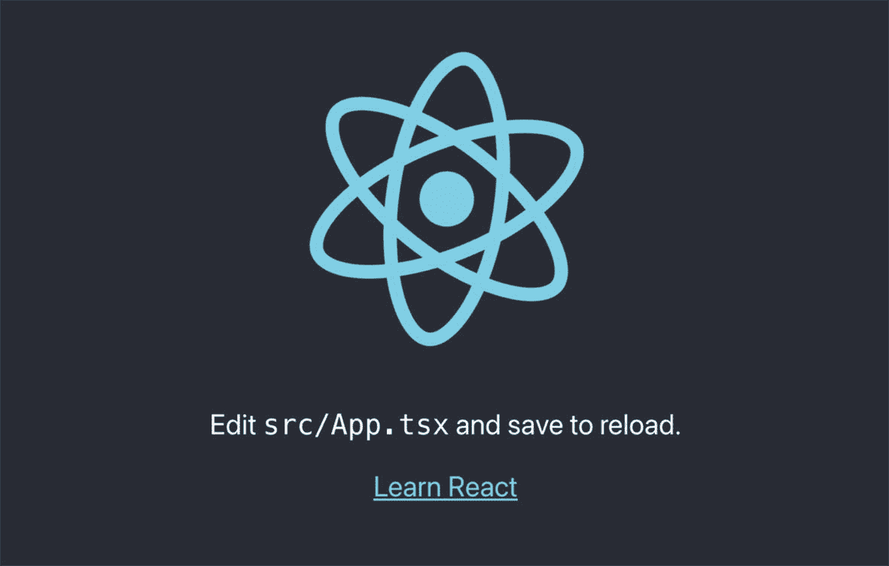
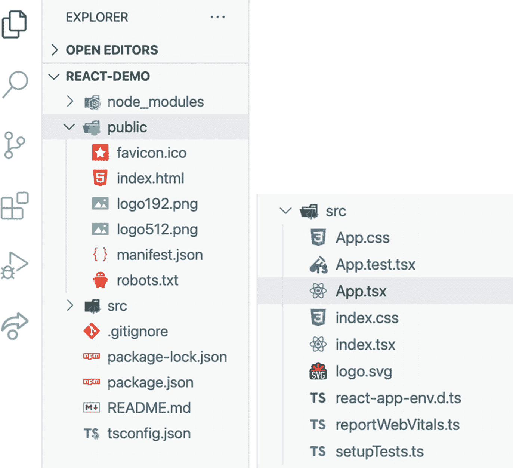
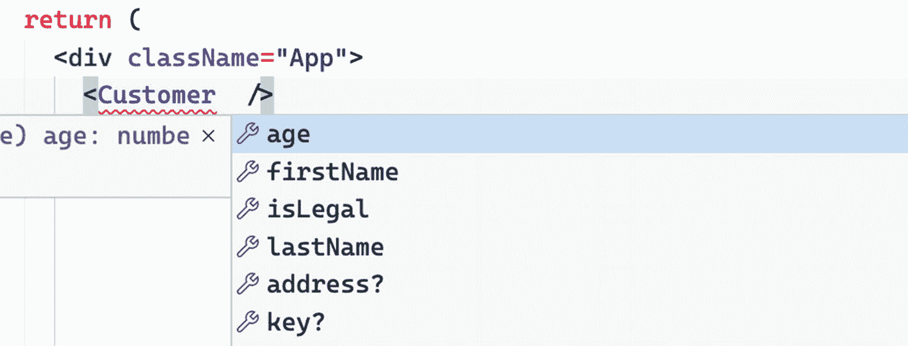
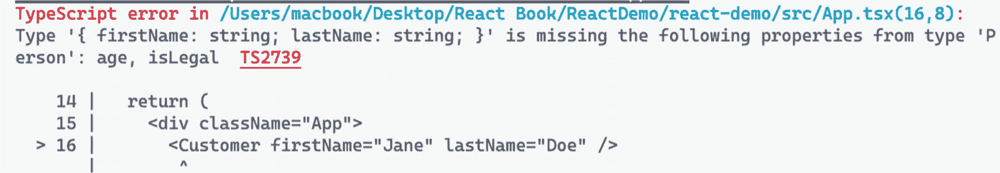
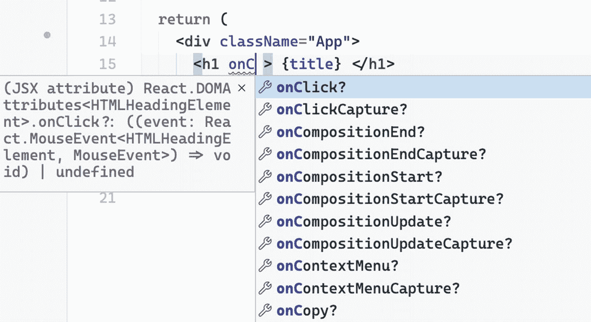
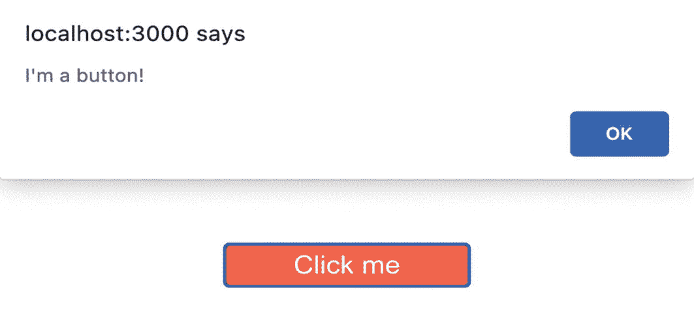
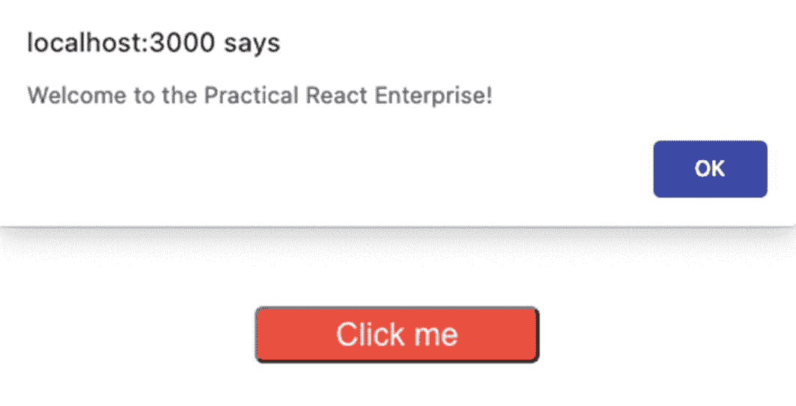

# 三、React 函数组件和 TypeScript 入门

在前一章中，我们学习了如何使用 Node 包管理器或 NPM，它是一个命令行工具，允许我们安装和更新应用包。

本章将研究 React 函数组件，这已经成为编写最新 React 应用的现状，以及使用 TypeScript 定义函数组件所用属性的语法。简单地说，React 函数组件本质上是返回 JSX 或 JavaScript XML 的 JavaScript 函数。

我们将使用 TypeScript 设置一个基本的 create-react-app (CRA)应用，并使用 CRA TypeScript 模板检查一些关键特性。TypeScript 是 JavaScript 的强类型超集，它带来了直观的特性，以强大的方式扩展了 JS，例如以多种方式定义对象的结构。

我们将讨论在 TypeScript 中使用类型化的明显好处，尤其是在构建大型企业级应用时。此外，我们将编写 React 函数组件，或 React。简称 FC，并触碰两个常用的 React 挂钩:`useState`和`useEffect`。

## 创建一个创建-React-应用应用

是开始构建单页面应用(SPA)的最流行也是最简单的方法。它也是脸书官方的样板文件生成器，用于创建一个简单的或入门的 React 应用。

CRA 使用预配置的 webpack 版本进行开发，使我们能够立即深入我们的代码并构建我们的 React 应用，而无需手动设置和配置我们的本地开发环境和生产版本。

最低要求是 Node> = 8.10，NPM >= 5.6。

首先，在您的终端中，检查您是否已经拥有 NPX:

```jsx
$ npx -v

```

或者您可以通过运行以下命令单独安装它

```jsx
$ npm install -g npx

```

NPX(Node 包执行)是 NPM 自带的。NPX 对于一次性软件包很有用，它从 NPM 注册表执行软件包，而不在本地安装它们。

Note

如果您之前已经通过 npm install -g create-react-app 全局安装了 create-react-app，则需要使用

```jsx
npm uninstall -g create-react-app

```

#或者

```jsx
yarn global remove create-react-app

```

这是为了确保 NPX 始终使用最新版本。不再支持 CRA 的全局安装。

现在，让我们用以下命令创建我们的第一个`create-react-app`应用:

```jsx
$npx create-react-app <name-of-your-app> --template
typescript

cd <name-of-your-app>

npm start

```

命名约定是使用所有小写字母，并用破折号分隔单词。- template TypeScript 标志告诉 CRA 使用 TS 作为默认语法并添加所需的配置。要启动开发服务器，运行<npm start="">或<yarn start="">。</yarn></npm>

您可以在 package.json 中的“脚本”下找到完整的命令脚本。

运行该命令后，在您的浏览器中检查您的应用—`http://localhost:3000`——并看到如图 [3-1](#Fig1) 所示的 CRA 初始加载页面。



图 3-1

带打字稿的 CRA 初始加载页

当您打开 IDE 或编辑器时，您应该能够看到如图 [3-2](#Fig2) 所示的目录。我们可以在下面看到 CRA 自动生成的项目或默认文件夹结构。



图 3-2

最初使用 create-react-app 创建的文件(CRA)

让我们回顾一下用 create-react-app 生成的一些文件。首先，让我们检查将要构建的项目的两个关键文件:

`public/index.html`是我们应用的主页面 HTML 模板，包括 React 代码和 React 渲染上下文。在这里，您可以找到让 JavaScript 运行应用的“根”。它也是 React 应用的挂载点:

```jsx
 <!DOCTYPE html>
<html lang="en">
  <head>
    <meta charset="utf-8" />
    <link rel="icon" href="%PUBLIC_URL%/favicon.ico" />
    <meta name="viewport" content="width=device-width,         initial-scale=1" />
    <link rel="manifest" href="%PUBLIC_URL%/manifest.json" />
    <title>React App</title>
  </head>
  <body>
    <section id="root"></section>
  </body>
</html>

```

持有来自 React DOM 的主渲染调用。它导入我们的 App.tsx 组件，该组件告诉 React 在哪里呈现它:

```jsx
import React from 'react';
import ReactDOM from 'react-dom';
import './index.css';
import App from './App';

ReactDOM.render(
  <React.StrictMode>
    <App />
  </React.StrictMode>,
  document.getElementById('root')
);

```

以下是 CRA 附带的一些文件和文件夹的简短定义和用法:

它包含了 JavaScript 库和一些我们已经安装的库的依赖项。我们通常不把这个文件夹包含在我们的 Git 库中，因为它很大，大约 100mb 到 500mb，这取决于我们在应用中安装了多少个包。

这是 CRA 附带的默认文件。当基于当前的 React 应用构建渐进式 Web 应用(PWA)时，需要配置文件。

对 PWA 的一个简单解释是，它允许您脱机或在没有互联网连接的情况下运行应用。它的作用是缓存你的应用的数据或内容，这样即使应用离线，你仍然可以看到你网站的内容。仅供参考，如果没有互联网连接，你将再也看不到霸王龙了。我相信我们都看过(你甚至可以播放它！)那只恐龙是吧？

`public/robots.txt`:又称**机器人**排除协议或标准。你可以在这里声明你想在谷歌搜索结果中隐藏的页面或 HTML。示例页面包括管理页面，因为您的用户不需要知道您的应用的管理页面。同样，你可以在这里指定你希望或者不希望哪个搜索引擎来索引你的站点。

`src`:包含 app UI 代码，包括组件和 CSS 样式。这是 React app 的核心。我们还可以看到`App.tsx`，我们应用的入口点，以及`index.tsx`，它引导我们的应用。

`gitignore`:位于根文件的文本文件；这是您放置希望 Git 忽略的文件的地方，比如您的`node_modules`和。`env files`。Git 已经跟踪的文件不受影响。使用命令`git rm –cached`停止索引一个已经被跟踪的文件。

如果你已经在你的机器上安装了 Yarn，默认情况下，CRA 会搜索 Yarn package manager，但是如果它不可用，它会返回到 NPM。如果您使用 Yarn，那么您将会看到`yarn-lock.json`文件。

`package.json`:我们已经在前一章中讨论过`package.json`，但是简单回顾一下，它管理我们项目应用的依赖、脚本、版本和其他元数据。

`tsconfig.json`:根目录下的这个文件表示该目录是 TypeScript 项目的根目录。

在`tsconfig.json`内部是`compilerOptions`对象，具有以下一些配置:

*   `"target"` : `"es5"`:现代浏览器支持所有 ES6 特性，但是您希望您的代码向后兼容 ECMAScript 2009 或更老的环境。

*   `"lib"`:类型检查过程中包含的标准类型定义。

*   `"strict"` : true:这是 TypeScript 中严格的编译器选项；这意味着您选择了默认严格的类型安全模式，而不必单独启用每个编译器选项。

*   `"module"` : `"esnext"`:指定代码生成。

*   `"noEmit"` : true:不要发布 JavaScript 源代码、源代码图或声明，而是使用 Babel。

*   是否支持 JSX。tsx 文件。

*   `"include"`:打字稿要检查的文件和文件夹。

## 使用 React 的 TypeScript 的声明文件

声明文件也称为。d `.ts`文件以`@types.`为前缀

使用声明文件——也称为定义文件——我们可以避免错误处理库，并在我们的编辑器中获得非常有用和强大的“智能感知”或自动完成功能。

让我们快速浏览一下我们的`package.json`文件，看看我们的 CRA 打字稿模板中包含的. d.ts 文件:

```jsx
    @testing-library/jest-dom":
    "@testing-library/react":
    "@testing-library/user-event":
    "@types/jest":
    "@types/node":
    "@types/react":
    "@types/react-dom":

```

为了确定我们最近安装的库是否需要声明文件(@types)，我们转到名为 DefinitelyTyped 的 GitHub 存储库，声明文件就存放在这里。另一种方法是直接进入 [`www.npmjs.com`](http://www.npmjs.com) ，在搜索框中给库名加上前缀`@types/`。幸运的是，许多人已经为最常见和最流行的 JavaScript 库编写了声明文件。

如果你使用一个需要类型声明文件的外部库，而你没有安装它，你会得到错误或者你的 IDE 会抱怨。

### 打字稿中的打字

打字稿中的打字本身就是文件。是的，一开始可能看起来有点额外的工作，但从长远来看，这是值得的。许多最初看不到它的价值的 React 开发人员说，他们现在无法想象不使用它。

考虑下面的例子。我们明确定义了每个变量的类型——名称是字符串，年龄是数字，等等:

```jsx
const name: string = "Jane Doe",
      age: number = "18",
      isStudent: boolean = true;

```

您会注意到，当您自己编写类型脚本时，代码的描述是代码本身的一部分。

如果你熟悉 JavaScript，你会知道它是无类型的。JavaScript 可能是唯一一种既爱又恨的编程语言，因为它的灵活性——有时可能有点过分——在于它的“规则”是按照我们想要的或我们想要的方式传递数据和对象。

现在，想象一下，在一个团队中有一群人，用成千上万的代码构建一个应用。代码会很快变得混乱和复杂。您可能会遇到在不存在的对象中调用的方法，或者从未声明的变量。

但是在 TypeScript 中，我们需要定义我们的对象和数据格式。这样，编译器就可以智能地搜索或检测我们的代码，并捕捉潜在的错误，比如用错误的参数调用函数，或者引用当前范围内不可用的变量。

使用 TypeScript 的显著好处包括拥有增强的工具选项，如自动完成、重构和在整个应用中查找用法。你可以在这里阅读更多关于打字稿的内容: [`www.typescriptlang.org/docs/handbook/basic-types.html`](https://www.typescriptlang.org/docs/handbook/basic-types.html) 。

## 了解 React 功能组件与 Props

React 功能组件(React。FC)是一个 JavaScript/ES6 函数，它接受参数作为组件的属性，并返回有效的 JavaScript XML (JSX)。如果需要，它还会将 props 作为参数。

下面是一个带有属性的简单功能组件:

```jsx
function Message(props) {
  return <div>{props.message}</div>
}

```

现在让我们创建一个 React 函数组件。在`src`文件夹中，创建一个名为`components,`的目录，在`components,`文件夹中创建一个名为`Customer.tsx`的文件。

在我们继续之前，让我们首先使用 TypeScript 的类型别名来定义我们的 props。另一种方法是使用`interface,`,但是我们更喜欢使用类型别名来确定我们的属性:

```jsx
import React from "react";

type Person = {
  firstName: string;
  lastName: string;
  age: number;
  isLegal: boolean;
};

```

请注意，我们定义了一个名为`Person`的类型，它指定了组件将采用的属性。`firstName`和`lastName`是必需的`strings,`，而`age`是必需的`number`和`isLegal`是必需的`boolean`。

通过创建一个`type,`,我们现在可以在项目中的任何地方使用它，就好像它是一个字符串、数字或者任何原语或引用类型。

在我们新创建的组件中，使用 Person 类型作为属性的模型或形状。请参见以下内容:

```jsx
const Customer = (props: Person) => {
  const { firstName, lastName, age, isLegal } = props;

  return (
    <div>
      <h1> Hello React</h1>
    </div>
  );
};

export default Customer;

```

我们可以看到，`Customer`是一个无状态的函数组件，它接受一个`props`对象，并析构< `Person` >所有需要的属性。

现在我们已经有了带有属性的函数组件，让我们进入 App.tsx 来渲染它。

首先，我们需要像这样导入组件:

```jsx
import Customer from "./components/Customer";

```

在我们的回访中:

```jsx
function App() {
  return (
    <div className="App">
      <Customer
        firstName="Jane"
         lastName="Doe"
         age={21}
         isLegal={true} />
    </div>
  );
}

export default App;

```

当我们在代码编辑器中使用代码智能感知功能时，创建类型定义也很有用。

## 代码编辑器中添加的智能感知

为我们的属性创建类型并声明组件的参数的另一个好处是我们在编辑器中得到的所谓的智能感知或代码建议。VS 代码中支持智能感知。



图 3-3

编辑器中的代码建议/智能感知

你猜怎么着？如果编写 Customer 组件时没有传递所有必需的值，就会出现 TypeScript 错误。甚至在你运行它之前，你已经可以在<customer>中看到红色的曲线来指示一个错误或者一个严重的警告。</customer>



图 3-4

编译器中的类型脚本错误

但是等等。如果不需要申报或者不用全部属性呢？你可以在属性类型中使用`?`来选择一些属性:

```jsx
type Person = {
  firstName: string;
  lastName: string;
  age: number;
  address?: string;     // the address is optional
  isLegal: boolean;
};

```

关键是您可以选择不在组件中定义所有的类型，以实现自动完成的优秀工具和类型脚本的类型安全特性。

是的，在开始时，可能需要一点努力来设置和习惯在变量和函数中使用类型化。尽管如此，从长远来看，它会给我们一个更好的开发者体验和一个可维护的应用。

在我们继续之前，让我们再多谈谈 React 钩子和两个流行的钩子，即`useState`和`useEffect`。

## React 钩

React 钩子本质上是 JavaScript 函数，是“React 16.8 中的新增功能”。它们让你不用写类就能使用状态和其他 React 特性。”

还要记住，钩子在类内部是不起作用的。钩子是一个很大的话题，但是我们会在开发应用的过程中学习基本的概念。但是现在，这里有三个钩子的重要规则需要记住:

1.  只在 React 函数的顶层调用钩子。

2.  仅从 React 函数组件调用挂钩，而不是从常规 JavaScript 函数调用挂钩。

3.  仅从自定义挂钩调用挂钩。

### React 钩子:使用状态

`useState`是一个钩子，它将允许函数组件中的状态变量。`useState`也是我们最有可能经常使用的一个。

假设我们想更新 JSX 的一个州。我们如何在我们的函数组件中做到这一点呢？嗯，我们用`useState`来表示！

在组件内部创建一个本地状态，并传递一个默认值。注意`useState`是 React 的一个命名导出:

```jsx
import React, { useState } from "react";
import "./App.css";

function App() {
  const [title, setTitle] = useState("Practical React Enterprise");

```

方括号中的状态变量是一种叫做数组析构的 JavaScript 语法。第一个变量`[title]`，也就是 getter，被定位为`useState`返回的第一个值，`[setTitle]`是 setter 或 set 函数，让我们更新它。

如何在我们的 JSX (HTML 元素)中使用状态变量或本地状态？在 React 中，由于我们的`useState`是在 JavaScript 中，我们需要用花括号{}将 getter 括起来，以便在 JSX 或 HTML div 中读取它的值:

```jsx
...
      <div className="App">
      <h1
        style={{
          color: "blue",
          marginBottom: "5rem",
        }}
      >
        {title}
      </h1>

```


图 3-5

使用本地状态呈现 UI 的屏幕截图

现在我们有了本地值，但是如何更新值`[title]?`是 setter 函数`[setTitle]`的工作。顺便说一下，如果你问的是 div 中的`className`，我们在 React 中使用`className`而不是`class`来防止名称冲突，因为后者是现代 JavaScript 和 TypeScript 中的保留关键字。

在我们继续之前，我们需要简单讨论一下什么是 JSX 或 JavaScript XML。在 React JSX 中，我们可以将 HTML 和 JavaScript 结合在一起编写。我们可以运行 JS 代码(逻辑、函数、变量等。)中，就像我们声明`{title}`或`{setTitle()}`时一样。

接下来，我们需要一个事件来触发 JSX 中的 setter 函数`setTitle`。那么我们如何找到一个事件呢？如果您在基本代码 `<h1> (`中使用前缀为“on”的<control>，见图 [3-6](#Fig6) ，将出现一个窗口，显示所有可用事件:</control>



图 3-6

IDE 中的代码建议

```jsx
return (
  <div className="App">
      <h1 onClick={() =>
   setTitle("Become an Effective React Developer from Day 1")
        }}</h1>
    </div>
  );
}

export default App;

```


图 3-7

使用本地状态更新用户界面

进入你的浏览器，点击标题“实际 React 企业”来更新本地状态标题。

例如，我们也可以将事件放在`<button>`或`<div>.`上。让我们创建一个`handleAlert`函数，并将它放在<按钮>上，以弹出一条警告消息:

```jsx
const handleAlert = () => {
  alert("I'm a button!");
};

return (
  <div className="App">
    <button
      style={{
        color: "#ffff",
        height: "5rem",
        width: "10rem",
        backgroundColor: "tomato",
        borderRadius: "5px",
        fontSize: "18px",
      }}
      onClick={handleAlert}
    >
      Click me
    </button>

  </div>
);

```



图 3-8

弹出警告消息

### React 挂接:useEffect

`useEffect`用于所有副作用，本质上取代了我们之前使用的生命周期方法(`componentDidUpdate, componentDidMount, componentWillUnmount`)。这个全面的钩子接受两个参数——第一个是必需的函数，第二个是特定状态的可选参数。

现在，假设我们想在用户登陆我们的应用时触发一个事件，或者在 UI 中的所有内容呈现之前触发一个事件。

是的，为此我们有`useEffect`。我们将做一个简单的 handleAlert 消息，当用户登陆浏览器时弹出，不需要在我们的 JSX 中调用它:

```jsx
import React, {useEffect, useState} from "react";
import "./App.css";

function App() {
  const [title, setTitle] = useState("Practical React Enterprise");

  const handleAlert = () => {
    alert("I'm a button!");
  };

  useEffect(() => {
    alert("Welcome to the Practical React Enterprise!");
  });

  return (
...

```



图 3-9

具有使用效果的警告消息

`useEffect`的一个用例是，当您想要向 web 服务发送一个请求，以获取您的用户数据或一系列值，如客户姓名、地址等。

也可以把 setter 放在`useEffect`里面，比如:

```jsx
  useEffect(() => {
    // handleAlert();
    setTitle("Updating the React Enterprise using useEffect");
  }, []);

```

注意到`useEffect`钩子中的方括号了吗？

1.  数组括号将防止`useEffect`在无限循环中连续运行。

2.  您还可以在数组中添加一个状态。并且状态值(即`title`)的任何变化将触发`useEffect`重新呈现:

```jsx
  useEffect(() => {
    //another state here
  }, [title]);

```

技巧

1.  不要使用`"eject": "react-scripts eject"`命令，除非你需要暴露 CRA 在应用开始时包含的管道，比如 Babel RC 和 Webpack。只有当您需要在 React 项目中进行一些定制时，才这样做。请记住，一旦弹出，您将无法回到 create-react-app 的原始样板结构。

2.  在运行时代码实现之前声明类型。当前模块中使用的类型必须在顶部可见。

3.  在命名约定中，组件应该用 PascalCase，而方法应该用 camelCase。

## 摘要

在本章中，我们使用了一个简单的 create-react-app 样板文件和 TypeScript 来展示构建 react 应用的最简单的方法。我们通过 TypeScript 学习了 CRA 的一些基本元素，以及它们如何一起正确运行我们的应用。

我们还看到了在 React 应用中使用 TypeScript 的一些好处，包括

*   代码建议和选项使我们更容易阅读他人的代码。这可以提高团队沟通的效率和代码库的一致性。

*   IntelliSense 和错误捕捉在运行代码的早期和之前

不知何故，我们设法用 TypeScript 解构了 React 函数组件。

但是我们在这里触及的只是冰山一角，特别是在理解使用 React 的 TypeScript 的全部功能以及 TS 可以给 JavaScript 代码带来什么方面。

由于这本书是关于构建一个*实用的*企业级应用，我们将在将它应用到我们的代码中时更深入地研究它。在下一章中，我将向您展示如何以一种有用而有效的方式建立我们项目应用的基础，这样您将从第一天起就成为一名高效的 React 开发人员。