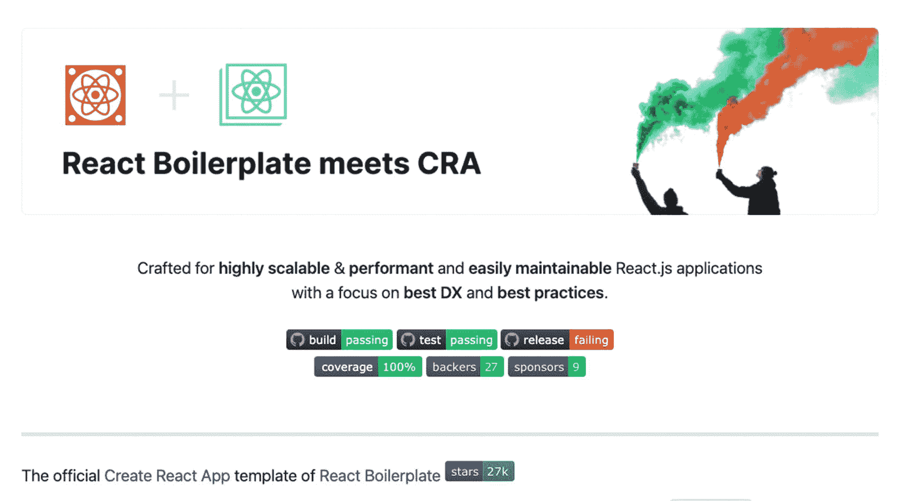

# 四、设置企业级应用

无论您是编程领域的新手还是专家，您一定想知道其他开发人员是如何设置和配置他们的项目应用的，对吗？

因此，这一章探讨了一种有效和智能的方法来建立一个生产就绪的样板文件。

我们将研究如何为我们的项目选择正确的*样板，使用工具、框架和模块，允许我们管理性能、样式、异步和构建实际应用所需的其他基本内容。*

是的，我们不仅仅是从无处不在的 ToDo list 应用开始学习新的框架或语言。这是一个你可以确信会在很多企业级 React 应用中看到的项目——尤其是配置甚至文件夹排列。更重要的是，它将具有良好的架构和高度的可伸缩性。

首先，我们将看看我用来为特定应用找到正确样板的标准。然后，让我们看看使用样板文件的利弊。

## 如何选择一个好的样板

像我认识的许多经验丰富的“聪明”的开发人员一样，我坚信应该使用样板文件，或者至少对此持开放态度，对吗？唯一的技巧——或者实际上可能是最难的部分——是为你的项目找到并选择正确的**样板文件。**

 **在决定了样板文件之后，您需要做的第一件事就是了解您在 package.json 中看到的每个 NPM 包

Tip

在决定样板文件是否适合您之前，请检查样板文件中包含的库和工具。

获得一个包或依赖项的简单定义的一个简单方法是进入 [`www.npmjs.com`](http://www.npmjs.com) 并在那里搜索它。

我有几个标准来决定什么是特定项目的正确样板，但以下是三个主要标准:

1.  **它包含了我需要的大部分(如果不是全部)核心功能**。这是最关键的过程。寻找一个样板文件，让*实际上*检查你需要的所有主要特性，这样你就不必做大量的定制工作，这会耗费你大量的时间。总是阅读样板的特征和描述。

2.  **有一定数量的投稿人或作者**。这是样板文件好的另一个关键部分。许多有经验的、活跃的开发人员正在为样板文件做贡献，并为更新和其他东西维护它。

3.  **它包含频繁的更新或提交**。在 GitHub 上检查最新的补丁或提交。一个维护良好的模板或样板文件会有来自贡献者的定期更新或提交。

请记住，每个项目甚至项目团队都可能意味着许多不同的样板应用。大多数时候，你决定的样板文件取决于项目本身，你的合作伙伴，甚至是客户。

但关键是，你会希望从一个标准的代码基础开始，快速启动并运行。

### 使用样板文件的好处

作为一名开发人员，我确信您已经经历了似乎永无止境的设置所有库、主题和一开始就需要的依赖项的折磨。光是将它们全部配置好而不出错就要花费数小时。

相信我。如果我们要自己实现全套的 React、TypeScript、Redux、Redux 工具包、测试和所有其他必要的东西，这将花费我们比我们愿意花费的时间长得多。这是假设当我们一个接一个地安装它们时，一切都顺利进行。没有错误，所有的库版本都很好地集成在一起。

以下是我为什么说使用正确的样板文件作为你应用的起点可以让你从第一天起就成为一个有能力并且*高效的*开发者的原因:

1.  **您可以减少设置和开发时间**。作为开发人员，我们都知道重用代码或模板非常有意义。使用样板文件可以减少使用相同代码模式的设置和开发时间，并避免从头开始重写。

2.  **你可以派生出一个样板文件，并根据你的需要进行定制**。当我还是初级开发人员时，快速学习一个新的库或框架的一个方法是查看两个或更多流行的应用。我会研究和比较它们，包括所有使用的依赖项。之后，我会根据自己的需求构建一些东西。

3.  **你可以研究这款应用的架构良好的结构**。样板文件立即向您介绍了一种设计 React 项目的优秀方法。这就像是首席架构师将构建应用的蓝图交给你。

4.  你可以受益于该领域专家的贡献。有一个样板就像有一个高级开发人员或前端架构师已经给了你开始项目的指导方针。这是无价的，尤其是如果你是团队或特定工具的新手。在确定对你有用的东西之前，你不必做研究和测试所有的东西。

### 使用样板文件的缺点

像任何其他好东西一样，总会有反对的声音。当然有，对吧？但是诀窍是认识和理解缺点，并根据清单中的优点来权衡它们。也就是说，让我们来看看反对在应用中使用样板文件而不是从头开始构建项目的一些原因。

让我们来看看使用样板文件的一些缺点:

1.  你可能会发现自己陷入了一个时间黑洞。你*实际上*仍然需要检查和了解事情是如何运行的。当然，在选择特定的样板文件之前，您需要了解其中包含的核心特性。有时，您可能会发现自己要么添加额外的基本功能，要么去掉多余的不需要的模块。

2.  你可能会陷入不必要的复杂之中。您可能会得到比您需要的更多的特性和比必要的更高的复杂性。

在考虑了前面所有的要点之后，现在是时候设置我们选择的样板文件了。

## 克隆样板文件

首先，如果你想随书一起编码，去 my GitHub 并克隆项目的起点。确保从第 4 章开始。

我分叉这个样板文件只是为了防止你在一年或两年后阅读这本书，所以你仍然有相同的代码库，以防你想跟随我。我建议您使用我的分叉样板文件，以确保获得相同的开发体验。

你会在图 [4-1](#Fig1) 中找到我的 GitHub 的链接，如果你想和我一起编码，你应该从那里开始。


图 4-1

实际企业 React 从源头: [https:// github。com/webmasterdevlin/practical-enterprise-react/tree/master/chapter-4/starter-boilerplate](https://github.com/webmasterdevlin/practical-enterprise-react/tree/master/chapter-4/starter-boilerplate)

然而，一旦你读完了这本书，并且很好地掌握了构建企业级 React 应用的过程，我强烈建议你在准备制作应用时使用图 [4-2](#Fig2) 中的原始样板文件。

您可以在图 [4-2](#Fig2) 中找到 React 样板 CRA 模板的主副本。



图 4-2

React 样板 CRA 模板来源: [https:// github。react-boilerplate/react-boilerplate-CRA-template](https://github.com/react-boilerplate/react-boilerplate-cra-template)

Note

不要忘记比较 package.json 中库的版本，以避免任何错误。

老实说，您甚至可以搜索另一个更适合您的项目规范的样板文件。

我的目标是为您提供构建生产就绪型应用的一步一步的过程，并通过武装您使用正确的工具，或至少如何选择它们，使您成为更自信的企业级应用开发人员。

## React 样板遇到 CRA

我们为这个项目选择的模板是 create-react-app (CRA)和 react 样板的完美结合，后者是最受欢迎和喜爱的入门模板，包括所有行业标准工具:Redux、Redux 工具包、TypeScript 等等。

以下是我为我们的项目选择这个特殊样板的原因**:**

*   *create-react-app* :内置 react 样板，可以弹出进行定制配置。

*   *Redux* :管理 React 应用全局状态的独立库。Redux 存储是应用的核心。Redux 是类似流量的单向数据流的更好的实现。

*   *TypeScript* :通过在点击刷新之前捕捉错误*，改善开发人员的体验。TS 还通过加强类型安全来防止代价高昂的错误。最后，由于参数和模型的类型化，TypeScript 是自文档化的。*

*   *Jest* :在 React 生态系统中相当受欢迎的一个测试跑者。

*   *Reselect* :用于切分 Redux 状态，并向 React 组件提供必要的子树。

*   *react-router* :用于该样板文件中的路由。

以下是需要安装在样板文件上的附加库。`npm install`我们将使用以下软件包:

*   `Material-UI`是 Google 在 2014 年开发的，它提供了一个可选的 CssBaseline 组件，用于更快的 web 开发。它使用基于网格的布局、动画、过渡、填充等等。

*   `clsx`是一个用于有条件地构造类名字符串的小工具。

*   `Formik`是一个非常流行的 React 和 React Native 开源表单库。

*   `Yup`是一个用于值解析和验证的 JavaScript 模式构建器。

*   `axios`是一个允许我们向外部资源发出 HTTP 请求的库。

对于依赖关系:

```jsx
$ npm i [package name]

 @material-ui/core
 @material-ui/icons
 @material-ui/lab
 @material-ui/pickers
 @material-ui/styles
 clsx
 formik
 @types/yup
 yup
 axios

```

对于 devDependencies:

```jsx
$ npm i -D [package name]

cypress
concurrently
json-server
json-server-auth

```

在我们继续之前，有必要了解汇聚在一起形成单一工作应用的不同工具和技术。

### 强壮的

在我看来，Husky 是添加到我们应用中的一个很好的工具。它本质上防止您提交或推送错误的提交或代码；它与 TypeScript 的打字功能一起增加了保护:

```jsx
"husky(remove-everything-in-these-parentheses.See-the-issue-#29)": {
    "hooks": {
      "pre-commit": "npm run checkTs && lint-staged"
    }
  },

```

### 属国

在 IDE 中打开项目并打开 package.json 文件，检查是否安装了所有的依赖库:

```jsx
"dependencies": {
  "@material-ui/core": "4.11.1",
  "@material-ui/icons": "4.9.1",
  "@material-ui/lab": "4.0.0-alpha.56",
  "@material-ui/pickers": "3.2.10",
  "@material-ui/styles": "4.11.1",
  "@reduxjs/toolkit": "1.4.0",
  "@testing-library/jest-dom": "5.11.6",
  "@testing-library/react": "10.0.1",
  "@types/fontfaceobserver": "0.0.6",
  "@types/jest": "25.1.4",
  "@types/node": "13.9.3",
  "@types/react": "16.9.25",
  "@types/react-dom": "16.9.3",
  "@types/react-helmet": "5.0.15",
  "@types/react-redux": "7.1.11",
  "@types/react-router-dom": "5.1.6",
  "@types/react-test-renderer": "16.9.2",
  "@types/styled-components": "5.1.4",
  "@types/testing-library__jest-dom": "5.9.5",
  "@types/webpack-env": "1.15.3",
  "@types/yup": "0.29.9",
  "axios": "0.21.0",
  "clsx": "1.1.1",
  "cross-env": "7.0.2",
  "eslint-config-prettier": "6.15.0",
  "eslint-plugin-prettier": "3.1.4",
  "fontfaceobserver": "2.1.0",
  "formik": "2.2.5",
  "husky": "4.3.0",
  "i18next": "19.8.4",
  "i18next-browser-languagedetector": "4.0.2",
  "jest-styled-components": "7.0.3",
  "lint-staged": "10.5.2",
  "node-plop": "0.26.2",
  "plop": "2.7.4",
  "prettier": "2.2.0",
  "react": "16.13.0",
  "react-app-polyfill": "1.0.6",
  "react-dom": "16.13.0",
  "react-helmet-async": "1.0.7",
  "react-i18next": "11.7.3",
  "react-redux": "7.2.2",
  "react-router-dom": "5.2.0",
  "react-scripts": "4.0.1",
  "react-test-renderer": "16.13.0",
  "redux-injectors": "1.3.0",
  "redux-saga": "1.1.3",
  "reselect": "4.0.0",
  "sanitize.css": "11.0.0",
  "serve": "11.3.2",
  "shelljs": "0.8.4",
  "styled-components": "5.2.1",
  "stylelint": "13.8.0",
  "stylelint-config-recommended": "3.0.0",
  "stylelint-config-styled-components": "0.1.1",
  "stylelint-processor-styled-components": "1.10.0",
  "ts-node": "8.8.2",
  "typescript": "3.9.7",
  "yup": "0.31.0"
},

```

### 仔细看看一些依赖关系

`"cross-env"`:运行在各种平台上设置和使用环境变量的脚本

`"eslint-config-prettier"`:关闭所有可能与更漂亮相冲突的规则

`"eslint-plugin-prettier"`:运行更漂亮，ESLint 规则和日志不同

`"fontfaceobserver"`:监控网页字体何时加载

`"husky"`:防止错误的提交或推送

`"i18next"`:适用于任何 JavaScript 环境或浏览器的国际化框架

`"i18next-browser-language detector"`:检测浏览器中的用户语言

`"jest-styled-components"`:改善测试体验

`"lint-staged"`:通过强制执行设定的代码风格，帮助确保没有错误进入存储库

`"node-plop"`:帮助自动生成代码，无需使用命令行

`"plop"`:便于在整个团队中统一创建文件

增强风格和代码的一致性

`"react-app-polyfill"`:多种浏览器填充，包括常用语言功能

`"react-dom"`:使用 DOM 的 React 包

`"react-helmet-async"`:React 头盔的叉子

`"react-i18next"`:React 的国际化

`"react-redux"`:Redux 官方 React 绑定

`"react-router-dom"`:React 路由的 DOM 绑定

CRA 使用的配置和脚本

`"react-test-renderer"` : React 包进行快照测试

`"redux-injectors"`:仅在必要时装载 Redux 减速器和 redux-saga，而不是一次全部装载

`"redux-saga"`:用于 Redux 处理副作用的 Saga 中间件

`"sanitize.css"`:确保 HTML 元素和其他默认样式的风格一致

`"serve"`:给出一个清晰的界面来列出目录的内容

`"shelljs"`:基于 Node.js API 的 Unix shell 命令的可移植(Windows/Linux/OS X)实现

帮助防止错误并确保风格的一致性

`"ts-node"`:node . js 的类型脚本执行环境和 REPL，支持源映射

`"Cypress"`:用于端到端测试

*在脚本里面插入:* `"cypress:open": "cypress open"`

```jsx
      $ npm run cypress:open

```

### 类型依赖关系

这些是类型脚本定义:

```jsx
    "@material-ui/core": "4.11.1",
    "@material-ui/icons": "4.9.1",
    "@material-ui/lab": "4.0.0-alpha.56",
    "@material-ui/pickers": "3.2.10",
    "@material-ui/styles": "4.11.1",
    "@reduxjs/toolkit": "1.3.2",
    "@testing-library/jest-dom": "5.1.1",
    "@testing-library/react": "10.0.1",
    "@types/fontfaceobserver": "0.0.6",
    "@types/jest": "25.1.4",
    "@types/node": "13.9.3",
    "@types/react": "16.9.25",
    "@types/react-dom": "16.9.3",
    "@types/react-helmet": "5.0.15",
    "@types/react-redux": "7.1.7",
    "@types/react-router-dom": "5.1.3",
    "@types/react-test-renderer": "16.9.2",
    "@types/styled-components": "5.0.1",
    "@types/testing-library__jest-dom": "5.0.2",
    "@types/webpack-env": "1.15.1",
    "@types/yup": "0.29.9",

```

查看这里的“脚本”。这非常令人惊讶，因为它们包含了许多脚本，所以您不必亲自动手:

```jsx
"scripts": {
    "start": "react-scripts start",
    "build": "react-scripts build",
    "test": "react-scripts test",
    "eject": "react-scripts eject",
    "test:generators": "ts-node --project=./internals/ts-node.tsconfig.json ./internals/testing/test-generators.ts",
    "cypress:open": "cypress open",
    "start:prod": "npm run build && serve -s build",
    "checkTs": "tsc --noEmit",
    "eslint": "eslint --ext js,ts,tsx",
    "lint": "npm run eslint -- src",
    "lint:fix": "npm run eslint -- --fix src",
    "lint:css": "stylelint src/**/*.css",
    "generate": "cross-env TS_NODE_PROJECT='./internals/ts-node.tsconfig.json' plop --plopfile internals/generators/plopfile.ts",
    "prettify": "prettier --write"
  },

"engines": {
    "npm": ">=6.4.1",
    "node": ">=10.13.0"
  },
  "lint-staged": {
    "*.{ts,tsx,js,jsx}": [
      "npm run eslint -- --fix"
    ],
    "*.{md,json}": [
      "prettier --write"
    ]
  },

  "husky": {
    "hooks": {
      "pre-commit": "npm run checkTs && lint-staged"
    }
  },

"jest": {
    "collectCoverageFrom": [
      "src/**/*.{js,jsx,ts,tsx}",
      "!src/**/*/*.d.ts",
      "!src/**/*/Loadable.{js,jsx,ts,tsx}",
      "!src/**/*/types.ts",
      "!src/index.tsx",
      "!s rc/serviceWorker.ts"
    ],

  "devDependencies": {
    "concurrently": "5.3.0",
    "cypress": "6.0.0",
    "json-server": "0.16.3",
    "json-server-auth": "2.0.2"
  }
}

```

前面的包不是我们的应用中需要的唯一的包。我们将安装一些第三方 JS 库。

Tip

你可以去我在 [`https://github.com/webmasterdevlin/practical-enterprise-react/`](https://github.com/webmasterdevlin/practical-enterprise-react/) 的 GitHub 查看我们是否在相同的安装包版本上工作。

现在让我们来设置您的 VS 代码，但是如果您愿意的话，也可以使用您喜欢的 IDE。

## 设置 Visual Studio 代码(混合文本编辑器)

我们需要熟悉我们的文本编辑器 VS 代码，以帮助我们获得最佳的开发者体验。

安装 VS 代码扩展市场中可用的扩展，根据您的喜好定制您的 IDE:

*   *vscode-icons* :灯光主题。

*   *材质图标主题*:为深色主题。

*   代码拼写检查器:帮助你发现常见的拼写错误。错误的主要原因之一是打字错误。

*   *导入成本*:这让你对你的库的文件大小有一个概念。

*   *Version lens* :给你一个简单的方法来更新你的软件包，并检查是否有可用的更新。在对主要版本进行更新时要小心，以免破坏您的代码。次要版本或补丁可能是安全的:
    *   单击向上箭头进行更新。进行更改后，再次运行 npm 安装。

*   *路径自动完成*:为 VS 代码提供路径自动完成。

*   *ES7 React/Redux/graph QL/React-Native snippets*:为您的语法提供信心，因为它在您编码时提供了 snippers。

*   *Live Share* :允许您与其他人实时协作编辑和调试，无论使用或开发的是什么编程语言或工具。

*   ESLint :一个优秀的 linter，它在你运行代码之前检测并警告你语法错误。

*   Chrome 调试器(Debugger for Chrome):VS 代码扩展，用于调试 Google Chrome 浏览器或任何支持 Chrome DevTools 协议的目标中的 JS 代码。

## 摘要

让我们总结一下到目前为止我们在本章中学到的东西。

我们为 VS 代码安装了各种扩展，以帮助我们在构建应用时获得更好的开发体验。

我们讨论了如何选择正确的样板，在开始构建您的应用时使用样板的优缺点，以及为什么我们选择在我们的应用中使用 React 样板 CRA 模板。

最后但同样重要的是，我们列出了所有已安装的软件包库及其相应的版本号，以确保您在随书一起编码时会使用相同的版本号。

在下一章，我们将继续 React Router，React 的标准路由库，并创建 SPAs，或具有动态路由功能的单页应用。**