# 五、React 路由的导航

本章使用 React Router 处理导航，React Router 是一个用于在 web 应用中处理和管理路线的特定库，我们将按如下方式处理:

1.  在根目录下创建一个 JavaScript 文件 router.js。对于 TS 文件，我们将使用 router.tsx。

2.  使用 react-router-dom 中的路由来定义路径和与路径相关联的组件，例如:

1.  从 react-router-dom 包装我们在交换机内部创建的所有路由，例如:

```jsx
<Route path={"/hello"} component={HelloComponent}/>

```

1.  使用 react-router-dom 中的链接成功导航到任何页面，例如:

```jsx
<Switch><Router .../> and more...</Switch>

```

```jsx
<Link to="/hello">Hello</Link>

```

在这个过程中，我们将学习如何在我们正在构建的应用中使用我们首选的设计库，即 Material-UI。

我们还将讨论组件的延迟加载或代码分割，以加快初始加载时间并改善用户体验。在许多相对较小的 React SPAs(单页应用)中，代码分割的概念可能是不必要的，或者可能对性能没有太大影响。然而，如果我们有一个很大的应用，比如说，有一个管理仪表板和一个客户门户，那么在初始加载时尝试加载整个应用并不是一个好主意。

## 为什么选择 React 路由？

React 路由是 React 的动态路由库。它由以下包组成:react-router、react-router-dom 和 react-router-native。核心是`react-router,`，而另外两个是特定于环境的。`React-router-dom`是针对 web 应用，r `eact-router-native`是针对使用 React Native 的移动应用。

每当我们需要通过我们的 React 应用在多个视图中导航时，路由都会管理 URL。React Router 使我们的应用 UI 和 URL 彼此保持同步。这些好处包括:

*   它是可堆肥的。

*   向网页添加链接很容易。

*   它可以将路由添加到 spa 上的几个不同页面。

*   它根据来自 URL 的路由有条件地呈现组件。

## 为什么是 Material-UI？

使用 UI 库的一个基本原因是它节省了我们设计应用的时间。我们不需要重新发明轮子，我们可以使用现成的东西，更重要的是，它已经经过了社区的考验。

当然，选择 UI 设计取决于您的项目规范。不过，通常情况下，我会先看看其他开发人员最推荐和最流行的，比如 Material-UI。同样，我会查看 GitHub 上的活跃贡献者，帮助维护项目的贡献者。在 [`npmjs.com`](http://npmjs.com) 中，Material-UI 的周下载量约为 140 万次。

您在应用中可能遇到的任何问题也很有可能已经得到解决，并记录在 Stack Overflow 或其他网站上。

其他值得一试的顶级 UI 设计包括 Ant Design 和 React-Bootstrap。我们将在后面的章节中更多地讨论 React 组件的样式。

## 入门指南

让我们开始为我们的应用构建 React 路由导航。首先，让我们对一些默认文件进行一些编辑，然后一步一步地重新构建它。

在你的`src/app/ folder`中，删除以下两个目录:`containers/HomePage`和`components/NotFoundPage.`见图 [5-1](#Fig1) 。

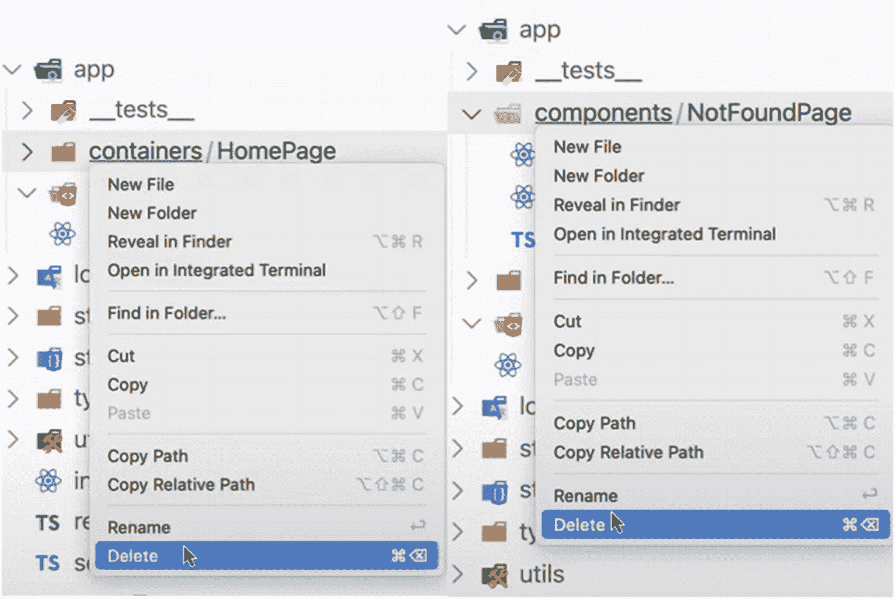

图 5-1

删除文件夹:容器和组件

它应该会破坏应用中的某些东西。因此，打开文件`src/app/index.tsx`，用下面的代码行更新文件:

```jsx
export function App() {
  return (
    <BrowserRouter>
      <Helmet
        titleTemplate="%s - React Boilerplate"
        defaultTitle="React Boilerplate"
      >
        <meta name="description" content="A React Boilerplate application" />
      </Helmet>

      <Switch>
        <Route exact path= '/' component={} />

      </Switch>
      <GlobalStyle />
    </BrowserRouter>
  );
}

Listing 5-1Updating index.tsx

```

接下来，在 app 目录下，创建另一个名为`views`的文件夹。在`views`下，创建另一个名为`pages`的文件夹。最后，在`pages`目录中，创建一个新文件，并将其命名为`Home.tsx`。文件夹结构见图 [5-2](#Fig2) 。

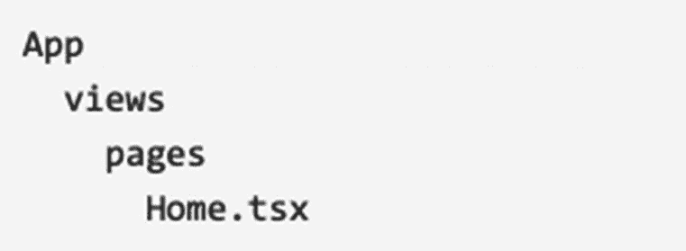

图 5-2

新文件夹结构

如果使用 VS 代码，打开文件`Home.tsx`并输入代码片段`rafce`(React 箭头函数导出组件的缩写)。在 WebStorm 中，片段是`rsc`(React 无状态组件的简称，没有 prop 类型和 ES6 模块系统)。

图 [5-3](#Fig3) 展示了如何在我们的代码编辑器中使用代码片段。确保您已经从 VS 代码市场安装了扩展 ES7 React/Redux/graph QL/React-Native snippets。

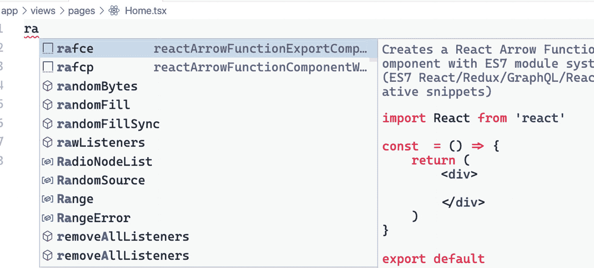

图 5-3

键入 rafce 片段，react arrow 函数导出组件的缩写

如清单 [5-2](#PC5) 所示，在返回声明`<h1>Home Page</h1>`中添加标题。

```jsx
import React from 'react';

const Main = () => {
  return (
    <div>
      <h1>Home Page</h1>
    </div>
  );
};

export default Main;

Listing 5-2Adding h1 Heading to the Home Page

```

在我们的`app/index.tsx`文件中，我们将 Home 组件添加到我们的 Route 路径中，如清单 [5-3](#PC6) 所示。

```jsx
export function App() {
  return (
    <BrowserRouter>
      <Helmet
        titleTemplate="%s - React Boilerplate"
        defaultTitle="React Boilerplate"
      >
        <meta name="description" content="A React Boilerplate application" />
      </Helmet>

      <Switch>
        <Route exact path="/" component={Home} />
      </Switch>
      <GlobalStyle />
    </BrowserRouter>
  );
}

Listing 5-3Adding the Home Component to routes.tsx

```

当您运行应用并转到默认的`localhost:3000`时，您应该会看到呈现的页面。

图 [5-4](#Fig4) 是在 UI 中呈现的主页。


图 5-4

将主页呈现给用户界面

我们在这里做了什么？我们已经展示了使用 React Router 导航应用的简单方法。

接下来，让我们创建另一个文件，并将其命名为`material-buttons.tsx,`，路径如下:`app/components/material-buttons.tsx.`

这里我们将在 UI 中呈现一些按钮。我们将使用来自我们之前导入的 Material-UI 的设计。去 Material-UI 的网站，具体是按钮组件。

图 [5-5](#Fig5) 显示了到 Material-UI 网站的链接。

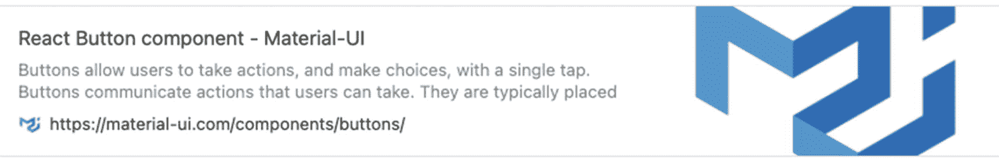

图 5-5

使用材质 UI 按钮组件

选择包含的按钮设计。确保选择 TypeScript 选项，复制完整的源代码并粘贴到我们的`material-buttons.tsx`文件中。

Important Note

将文件从`ContainedButtons`重命名为`MaterialButtons`。

之后，转到`Home.tsx`使用新创建的材质 UI 按钮组件，如清单 [5-4](#PC7) 所示。

```jsx
import React from "react";
import MaterialButtons from 'app/components/material-buttons’;

const Home = () => {
  return (
    <div>
          <h1>Main Page</h1>
          <MaterialButtons/>
    </div>
  );
};

export default Home;

Listing 5-4Copying the Material-UI Button Component

```

在您的本地主机中，您应该会看到以下变化，如图 [5-6](#Fig6) 所示。

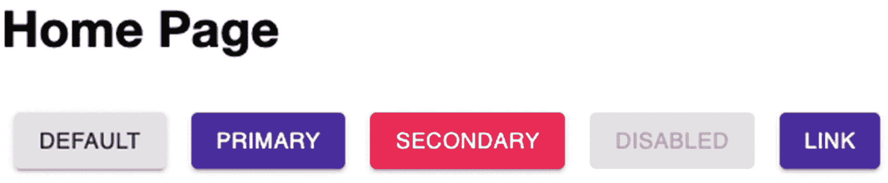

图 5-6

呈现材质-UI 按钮组件

既然我们已经有了可以在设计中使用 Material-UI 库的概念证明，我们就可以开始配置路由和导航了。

但是首先，让我们快速回顾一下 React 路由的安装。

### 基础概述

通过安装作为样板文件一部分的`react-router-dom`，我们可以访问`index.tsx`中的以下三个组件:`<BrowserRouter>, <Route>,`和`<Switch>.`

打开您的`index.tsx`文件，让我们逐一讨论:

`<BrowserRouter>`是基本配置。它包装了其他组件，并使它们与 URL 保持同步。

`<Switch>`是 web 应用的动态部分。顾名思义，它会根据 URL 进行更改或动态切换。Switch 组件确保将呈现匹配 URL 位置的第一个路由子组件。

`<Route>`需要一个“路径属性”,当它获得匹配的或精确的 URL 路径时被呈现。

现在让我们看看如何在应用中导航 URL 路径，从一个组件到达下一个组件。

`React-router-dom`允许我们改变路径的几种方式，包括最常见的一种叫做`<Link>`的标签，我们会在我们的应用中经常用到。为了更清晰的代码和关注点的分离，我们将在`the app directory and name it routes.tsx.`创建一个新文件

## 创建 routes.tsx

我们的路线路径可能会变得更长，因此我们将创建一个新文件，并将其命名为`routes.tsx` `.`，而不是在我们的`app/index.tsx`文件中构建所有路线

以下是文件路径:

```jsx
app ➤ routes.tsx

```

接下来，我们将把 index.tsx 中的`<Switch>`和<route>组件移动到我们新创建的</route>和`routes.tsx`中，如清单 [5-5](#PC9) 所示。

```jsx
import React, { lazy, Suspense } from 'react';
import { Switch, Route } from 'react-router-dom';
import Home from './views/pages/Home';

const Routes = () => {
  return (
      <Switch>
        <Route exact path="/" component={Home} />
       </Switch>
);
}
export default Routes;

Listing 5-5Moving Switch and Route Components to routes.tsx

```

现在我们需要使用我们在`index.tsx,`新创建的`<Routes />`，如清单 [5-6](#PC10) 所示。

```jsx
export function App() {
  return (
    <BrowserRouter>
      <Helmet
        titleTemplate="%s - React Boilerplate"
        defaultTitle="React Boilerplate"
      >
        <meta name="description" content="A React Boilerplate application" />
      </Helmet>
      <Routes/>
      <GlobalStyle/>
    </BrowserRouter>
  );
}

Listing 5-6Using the Routes in index.tsx

```

让我们创建另一个视图页面，并将其命名为路径 views/pages 下的`AboutPage.tsx`。添加一个

# 这是关于页面

。

清单 [5-7](#PC11) 是关于页面组件。

```jsx
import React from 'react';

const AboutPage = () => {

return (
  <div>
   <h1>This is the About Page</h1>
  </div>
);
 };
export default AboutPage;

Listing 5-7Creating AboutPage and Adding h1 Heading

```

不要忘记在 routes.tsx 中添加新组件，并在顶部导入 About Page 组件:

```jsx
<Route exact path="/about" component={AboutPage} />

```

检查你的`localhost:3000/about`看看它是否还在工作。

Note

当构建一个应用时，我通常在编写任何代码之前收集需求。我总是检查我是否需要为应用创建一个仪表板或一个管理仪表板。我们尽可能首先制定路由，并确定是否有嵌套路由。

现在，我们可以在应用中导航 URL 路径。第一项任务是构建一个仪表板。

## 构建仪表板

进入 Material-UI 的网站，搜索一个导航栏或应用栏。他们是一样的。抓取简单 App Bar 的 TS 源代码。见图 [5-7](#Fig7) 中简单 App 栏截图。

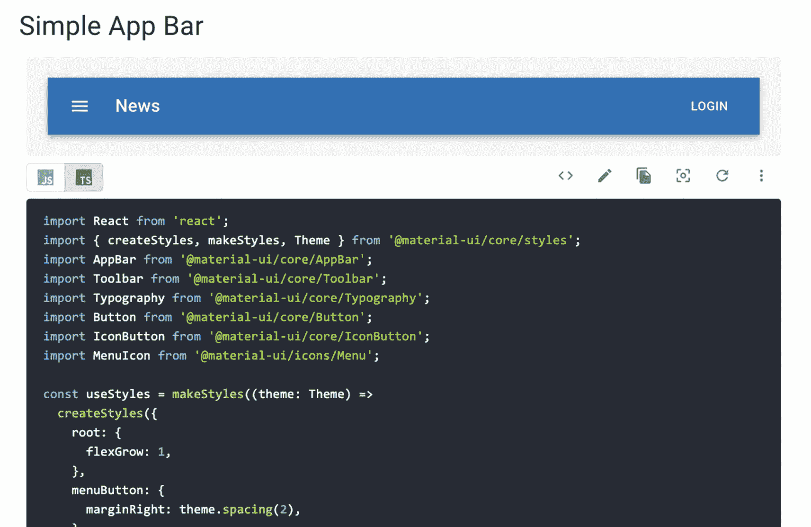

图 5-7

Material-UI 网站上的简单应用栏截图

### 导航栏

`navbar`组件是我们放在应用顶部的东西，它允许我们在不同的页面之间切换，比如`Home, About, Login,`等。

在文件夹 components 下创建一个新文件，并将其命名为`navigation-bar.tsx.`

粘贴从 Material-UI 简单应用栏抓取的源代码(见图 [5-8](#Fig8) )。不要忘记将默认文件名从`ButtonAppBar`更改为`NavigationBar.`

此时，让我们删除文件`material-buttons.tsx`，因为我们不再需要它了。我们创建它只是为了快速展示如何在组件页面中使用材质 UI 设计。

之后，再次打开`app/index.tsx`，渲染`NavigationBar`。确保将它放在`<Routes/>`组件的顶部或之前，以将导航栏永久定位在 web 应用的顶部区域，如清单 [5-8](#PC13) 所示。

```jsx
export function App() {
  return (
    <BrowserRouter>
      <Helmet
        titleTemplate="%s - React Boilerplate"
        defaultTitle="React Boilerplate"
      >
        <meta name="description" content="A React Boilerplate application" />
      </Helmet>
      <NavigationBar />
      <Routes/>
      <GlobalStyle/>
    </BrowserRouter>
  );
}

Listing 5-8Using the NavigationBar in index.tsx

```

检查您的`localhost:3000`以查看 UI 中的导航栏。

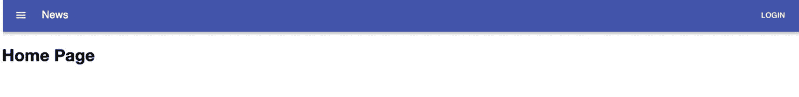

图 5-8

在浏览器中显示导航栏

我们将在接下来的几章中详细讨论各种 React 样式方法。但同时，我只想指出，Material-UI 的样式解决方案来自许多其他样式库，如 styled-components。

Material-UI 的核心是使用在运行时和服务器端工作的 CSS-in-JS。我们将在后面的章节中更多地讨论 CSS-in-JS。

看看 Material-UI 中的导航栏样式组件。我们使用 makeStyles，它基本上允许我们为每个样式表创建多个样式规则。然后，我们将在 NavigationBar 组件内部调用返回的函数 useStyles:

```jsx
const useStyles = makeStyles((theme: Theme) =>
  createStyles({
    root: {
      flexGrow: 1,
    },
    menuButton: {
      marginRight: theme.spacing(2),
    },
    title: {
      flexGrow: 1,
    },
  }),
);

```

在我看来，Material-UI 是最好的样式库之一，尤其是对于 React 应用。这些组件是可重用的、快速的和声明性的。在其 GitHub 上，它也有超过 63K 颗恒星，这意味着我并不孤单，在我看来。

#### 添加导航链接

让我们在导航栏中添加一些按钮和导航链接，并将它们命名如下——`<Home> <About> <Dashboard> – as shown in`列表 [5-9](#PC16) 。

不要忘记从“`react-router-dom`”导入命名组件:

```jsx
import { Link } from 'react-router-dom';

```

Note

我们将在本章后面详细讨论 React 应用可以使用的不同导航路径，但是现在，让我们先构建我们的组件。

```jsx
import React from 'react';
import { createStyles, makeStyles, Theme } from '@material-ui/core/styles';
import AppBar from '@material-ui/core/AppBar';
import Toolbar from '@material-ui/core/Toolbar';
import Button from '@material-ui/core/Button';
import { Link } from 'react-router-dom';
import { colors } from '@material-ui/core';

export default function NavigationBar() {
  const classes = useStyles();

  return (
    <div className={classes.root}>
      <AppBar position="static">
        <Toolbar>
          <Link className={`${classes.link} ${classes.title}`} to={'/'}>
            LOGO
          </Link>
          <Button color="inherit">
            <Link to={'/'}>
              Home
            </Link>
          </Button>
          <Button color="inherit">
              About
          </Button>
          <Button color="inherit">
              Dashboard
          </Button>
          <Button color="inherit">
              Login
          </Button>
        </Toolbar>
      </AppBar>
    </div>
  );
}

Listing 5-9Adding Navigation Links to the navbar

```

同时，用 logo 替换单词“News ”,因为那是我们稍后要放置图标 LOGO 的地方。

我们还添加了链接样式对象。参见清单 [5-10](#PC17) 中的编辑。

```jsx
const useStyles = makeStyles((theme: Theme) =>
  createStyles({
    root: {
      flexGrow: 1,
    },
    menuButton: {
      marginRight: theme.spacing(2),
    },
    link: {
     color: colors.lightBlue[50],
     textDecoration: 'none',
     },
    title: {
      flexGrow: 1,
    },
  }),
);

Listing 5-10Adding a link Style Object

```

正如你在清单 [5-11](#PC19) 中看到的，我们现在可以使用保留的 React 单词`<className>.`在我们的按钮导航链接中使用它

首先，我们通过调用`useStyles`钩子并将其存储在一个变量中来使用它。出于可读性的考虑，我们将变量命名为`classes`:

```jsx
  const classes = useStyles();

```

然后让我们将导航链接添加到其余的按钮上。

```jsx
export default function NavigationBar() {
  const classes = useStyles();

  return (
    <div className={classes.root}>
      <AppBar position="static">
        <Toolbar>
          <Link className={`${classes.link} ${classes.title}`} to={'/'}>
            LOGO

          </Link>
          <Button color="inherit">
            <Link className={classes.link} to={'/'}>
              Home
            </Link>
          </Button>
          <Button color="inherit">
            <Link className={classes.link} to={'/about'}>
              About
            </Link>
          </Button>
          <Button color="inherit">
            <Link className={classes.link} to={'/dashboard'}>
              Dashboard
            </Link>
          </Button>
          <Button color="inherit">
            <Link className={classes.link} to={'/login'}>
              Login
            </Link>
          </Button>
        </Toolbar>
      </AppBar>
    </div>
  );
}

Listing 5-11Adding the Navigation Links and CSS Class Objects in the NavigationBar

```

在我们的 LOGO 组件中，注意我们需要使用反勾号``来使用按钮组件中的两个 CSS 类对象。

```jsx
Link className={`${classes.link} ${classes.title}`} to={'/'}> LOGO </Link>

Listing 5-12Using Backticks for Two or More CSS Class Objects

```

请务必清理任何未使用或变灰的导入库。

接下来，让我们在 views/pages 下添加另一个组件，并将其命名为`NotFoundPage.tsx.`

再次键入代码片段“`rafce`”，以便为我们创建无状态箭头组件。并且还添加了标题

# 404 页面未找到

。

```jsx
import React from 'react';

const NotFoundPage = () => {
  return (
      <div>
         <h1>404 Page Not Found</h1>
      </div>
      )
 }
export default NotFoudPage;

Listing 5-13Creating a 404 Not Found Page

```

别忘了定义`NotFoundPage` `after importing it in routes.tsx`的路径:

```jsx
import NotFoundPage from './views/pages/NotFoundPage';
<Route exact path="/not-found"component={NotFoundPage} />

```

### 导航 React 路由:

在我们的`routes.tsx`中，让我们添加`<Redirect />,`，幸运的是它已经内置在 react-router-dom 中。

有许多将用户重定向到特定页面的用例。一般来说，如果我们需要改变 URL 路径而不需要用户点击该路径的链接，我们使用`<Redirect />`。

这里有几个条件:

*   当用户访问受限页面时。

*   当用户正在访问找不到或不再存在的页面时。

*   当用户在地址栏中键入错误的路径时(输入错误！).

*   登录成功，用户现在被定向到主页或仪表板。

现在，让我们为所有没有在 404 页面上定义的路径创建一个`<Redirect />`:

```jsx
<Route path={'/not-found'} component={NotFoundPage} exact />
        <Redirect from={'*'} to={'/not-found'} exact />

```

在我们结束这一部分之前，让我们在页面上做一些样式设计，尤其是填充和边距。

#### 添加容器样式的类组件

转到`app/index.tsx,`，我们将使用 Material-UI 将`<Routes/>`包装在一个容器中。从 Material-UI 导入命名组件，直接使用<container>包装 Routes 组件:</container>

```jsx
...
import { Container } from '@material-ui/core';

<Container>
    <Routes />
</Container>

```

检查浏览器，你会注意到，如图 [5-9](#Fig9) 所示，标题< h1 >不再被推到左上角。该样式适用于在`<Container> <Routes/> </Container>`中包装的所有页面。

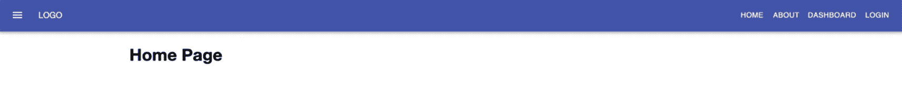

图 5-9

使用材质中的容器-用户界面

但是不要太担心这些页面的特定样式。我们只是向您展示使用 Material-UI 来设计我们的应用的简单方便。

请记住，本书的主要目标是指导您构建企业级应用，并让您了解开发人员如何类似地开发他们的应用。最后，你还是要根据你的具体需求来决定如何制作你的应用。

那么仪表盘呢？让我们现在就开始吧。

## 创建仪表板布局

在`app`文件夹中，创建一个名为`layouts,`的文件夹，然后创建一个子文件夹，命名为`dashboard-layout`。

在仪表板布局文件夹中，创建文件`dashboard-sidebar-navigation.tsx`。

路径是 **app** ➤ **布局** ➤ **仪表盘-布局** ➤ **仪表盘-工具条-导航. tsx** 。

让我们用下面的代码填充新创建的文件。首先，导入以下库。

```jsx
import React, { useEffect } from 'react';
import { Link } from 'react-router-dom';
import { createStyles, makeStyles } from '@material-ui/core/styles';
import Drawer from '@material-ui/core/Drawer';
import Toolbar from '@material-ui/core/Toolbar';
import { useRouteMatch } from 'react-router';

Listing 5-14Importing Libraries to dashboard-sidebar-navigation.tsx

```

好了，在我们继续之前，让我们简要解释一下我们在这里引入的几个不熟悉的库。我们将从`react-router-dom`中姗姗来迟的`<Link>`和应用中导航路径的其他方式开始。

### 导航路径:<link>

来自`react-router-dom`的`<Link>`允许用户导航应用，并在不刷新的情况下重新呈现页面。它为我们的应用提供了一个简单明了的导航路径。

我们可以使用它的一些常见方法:

*   to: string:通过连接位置的路径名、搜索和哈希属性创建。比如:`<Link to="/products/?sort=name" />`。

*   to: object:这可以是以下任何属性:路径名、搜索、散列和状态。

*   replace: bool:如果为 true，单击链接将替换历史栈中的当前条目，而不是添加新条目。比如:`<Link to="/products" replace />`。

*   to: function:当前位置作为参数传递，位置表示应该作为对象或字符串返回。例如:

```jsx
<Link to={location => ({ ...location, pathname: "/products" })} />
<Link to={location => `${location.pathname}?sort=name`} />

```

### React 钩子:使用者游戏

`useRouteMatch`是一个钩子，我们在使用`<Route>.`时通常需要它，useRouteMatch 允许我们访问一个`<match>`对象，并在组件内部使用它；所以不用渲染一个`<Route>,`，直接用`useRouteMatch.`

好了，现在我们已经讨论了我们在这里导入的一些库，现在让我们创建我们的`DashboardSidebarNavigation`组件。

```jsx
const DashboardSidebarNavigation = () => {
  const classes = useStyles();
  const { url } = useRouteMatch();

  useEffect(() => {}, []);

  return (

      <div className={classes.root}>
        <Drawer
          className={classes.drawer}
          variant="permanent"
          classes={{
            paper: classes.drawerPaper,
          }}
          anchor="left"
        >
          <Toolbar
            style={{ width: '6rem', height: 'auto' }}
            className={classes.toolbar}
          >
            <Link to={`${url}`} className={classes.logoWithLink}>
              Logo
            </Link>
          </Toolbar>

        </Drawer>
      </div>

  );
};

export default DashboardSidebarNavigation;

Listing 5-15Creating the DashboardSidebarNavigation Component

```

我们使用 Material-UI 抽屉和工具栏的样式，并使用<link>组件作为我们的导航路径。

样式组件来自 Material-UI。

```jsx
const drawerWidth = 240;

const useStyles = makeStyles(theme =>
  createStyles({
    root: {
      display: 'flex',
    },
    drawer: {
      width: drawerWidth,
      flexShrink: 0,
    },
    drawerPaper: {
      width: drawerWidth,
    },
    drawerContainer: {
      overflow: 'auto',
    },
    toolbar: theme.mixins.toolbar,
    content: {
      flexGrow: 1,
      padding: theme.spacing(3),
    },
    link: { textDecoration: 'none', color: 'inherit' },
    logoWithLink: {
      display: 'flex',
      alignItems: 'center',
      textDecoration: 'none',
      color: 'inherit',
    },
  }),
);

Listing 5-16Styling the dashboard-sidebar-navigation Using Material-UI

```

完成`dashboard-sidebar-navigation.tsx,`后，在`dashboard-layout`文件夹下创建一个`index.tsx`并复制下面的代码。

```jsx
import React from 'react';
import { Grid } from '@material-ui/core';

import DashboardSidebarNavigation from './dashboard-sidebar-navigation';

type Props = {
  children: React.ReactNode;
};

const Dashboard = ({ children }: Props) => {
  return (
    <Grid
      container
      direction="row"
      justify="flex-start"
      alignItems="flex-start"
    >
      <DashboardSidebarNavigation /> {children}
    </Grid>
  );
};

export default Dashboard;

Listing 5-17Creating the Dashboard Component

```

## 仪表板组件

这是怎么回事？我们有主仪表板组件及其子属性，它们是主要的内容页面。子属性为用户提供了从一个视图或页面成功导航到另一个视图或页面的路由。

请记住，仪表板中的 children 参数是 React 组件的入口点。例如，如果我们在仪表板中传递一个按钮组件，它将在 DashboardSidebarNavigation 组件旁边呈现。

我们现在有了一个包含 DashboardSidebarNavigation 的可重用仪表板布局。

至于`<Grid>,`，它用于布局的定位。基于 12 列网格布局的网格响应布局非常强大，因为它可以适应任何屏幕大小和方向。

现在我们已经有了布局，下一步是创建一个仪表板默认组件，这是用户在仪表板中看到的第一个东西。

在视图中，创建一个新的仪表板文件夹，并在其中创建两个新文件:`dashboard-default-content.tsx`和`settings-and-privacy.tsx`。

路径看起来像这样:

```jsx
 Views ➤ dashboard ➤ dashboard-default-content.tsx
 Views ➤ dashboard ➤ settings-and-privacy.tsx

```

键入代码片段“rafce”创建一个无状态箭头组件，并返回一个标题与组件名称相同的

# 。请参见下面的示例。

此外，请确保在组件名称中重命名并使用 Pascal 命名约定。

```jsx
import React from 'react';

const DashboardDefaultContent = () => {
  return (
    <div>
      <h1>Dashboard Default Content</h1>
    </div>
  );
};

export default DashboardDefaultContent;

Listing 5-18Creating the DashboardDefaultContent Component

```

对`settings-and-privacy.tsx`文件做同样的事情。

```jsx
import React from 'react';

const SettingsAndPrivacy = () => {
  return (
    <div>
      <h1>Settings and Privacy</h1>
    </div>
  );
};

export default SettingsAndPrivacy;

Listing 5-19Creating the SettingsAndPrivacy Component

```

目前，我们只是设置了没有样式的仪表板和导航，因为我们只是想展示一个概念证明，我们能够成功地从一个页面导航到下一个页面。

现在，让我们在`routes.tsx`中定义路径。但在这种情况下，我们将使用渲染属性。

### 渲染属性

在 [`www.reactjs.org`](http://www.reactjs.org) 网站上，术语*渲染* *属性*指的是“使用一个值为函数的属性在 React 组件之间共享代码的技术。”

好吧，简单地说，这意味着我们的路由组件有一个渲染属性，它将一个函数作为一个值。然后，路由组件使用该函数来呈现该函数提供的任何内容——在我们的例子中，就是仪表板。

实际上，我们只是以一种有效的方式重用代码。

```jsx
<Route path={'/dashboard'}
                render={({match: {path}}) => (
                    <Dashboard>
                        <Switch>
                            <Route exact path={path + '/'}
                                component={DashboardDefaultContent}/>

   <Route exact path={path + '/settings-and-privacy'}
                component={SettingsAndPrivacy}/>

                        </Switch>
                    </Dashboard>
                   )}>
 </Route>

Listing 5-20Using the Render Props in routes.tsx

```

在 React 路由库中，`<Route />`具有导航到不同视图或页面的行为。当路径匹配时，它呈现组件。

接下来，让我们更新`dashboard-sidebar-navigation.tsx`来添加设置和隐私按钮以及注销按钮。

为了有一点风格，首先，让我们导入组件，如清单 [5-21](#PC34) 所示，从 Material-UI 到我们的`dashboard-sidebar-navigation.tsx`。

```jsx
import { List, ListItem, ListItemIcon, ListItemText } from '@material-ui/core';
import ExitToAppIcon from '@material-ui/icons/ExitToApp';
import SettingsIcon from '@material-ui/icons/Settings';

Listing 5-21Importing the Material-UI Components to dashboard-sidebar-navigation.tsx

```

仪表板侧边栏导航的附加样式组件如清单 [5-22](#PC35) 所示。

紧接在之后且仍在<drawer>内，添加以下代码:</drawer>

```jsx
<return (

      <div className={classes.root}>
        <Drawer
          className={classes.drawer}
          variant="permanent"
          classes={{
            paper: classes.drawerPaper,
          }}
          anchor="left"
        >
          <Toolbar
            style={{ width: '6rem', height: 'auto' }}
            className={classes.toolbar}
          >
            <Link to={`${url}`} className={classes.logoWithLink}>
              Logo
            </Link>
          </Toolbar>
          <div className={classes.drawerContainer}>
            <List>
              <Link className={classes.link} to={`${url}/settings-and-privacy`}>
                <ListItem button>
                  <ListItemIcon>
                    <SettingsIcon />
                  </ListItemIcon>
                  <ListItemText primary={'settings and privacy'} />
                </ListItem>
              </Link>
              <a className={classes.link} href={'/'}>
                <ListItem button>
                  <ListItemIcon>
                    <ExitToAppIcon />
                  </ListItemIcon>
                  <ListItemText primary={'logout'} />
                </ListItem>
              </a>
            </List>
          </div>
        </Drawer>
      </div>

  );
};

Listing 5-22Additional Components and Styling for dashboard-sidebar-navigation.tsx

```

如果您在我们的 UI 中单击“Dashboard”按钮，您应该能够看到以下附加组件:

设置和隐私

注销

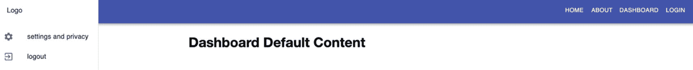

图 5-10

仪表板默认内容用户界面

如果您单击设置和隐私，您应该可以成功导航到该页面。当你点击主页、关于或登录时也是一样——最后一个页面目前只是一个 404 页面，因为我们还没有构建它。此外，注销，现在，只是基本上刷新页面。

## 进入 React.lazy()

但是等等。我们还没完呢。我们仍然可以改进我们的路线导航。我们可以在惰性加载的帮助下做到这一点，惰性加载是加速我们的包的加载时间的最有效的方法之一。

*那么什么是懒加载呢？*

惰性加载的概念很容易理解。它仅仅是首先呈现用户界面中最重要的部分，同时根据需要悄悄地加载不重要的部分或项目。

React 中的延迟加载是 16.6.0 版本中发布的一个相对较新的特性。随着应用变得越来越复杂、强大和庞大，导致加载时间增加，并对用户体验产生负面影响。

作为最佳实践，我们应该始终考虑用户，包括那些使用移动数据和慢速互联网连接的用户。

Note

`React.lazy()`，现在已经完全集成到核心的 React 库中，已经取代了一个第三方库 react-loadable。

但是使用 react-loadable 进行服务器端代码拆分，因为 React.lazy()和悬念还不能用于服务器端渲染。

React lazy loading 允许我们使用**代码分割**缓慢或逐渐加载组件，而无需安装额外的库。这种方法使我们能够在初始加载时呈现必要的或关键的界面项，同时根据需要懒散地、安静地展开其他部分。

根据 React 官方文档，在 React 应用中进行代码拆分的最佳方式是通过动态导入`()`语法。急切加载是我们的 web 应用的默认行为，这意味着如果你下载所有的页面资源，例如，主页，那么一切都将被一口气下载完。

这样做的潜在问题是，如果应用很大，它会产生一个瓶颈——因此，我们需要进行代码拆分。

让我们展示一些代码拆分前后的示例代码。

```jsx
import MyComponent from './MyComponent';

function OneComponent() {
     return (
          <div>
               <MyComponent />
          </div>
     );
}

Listing 5-23Showing Eager Loading vs. Lazy Loading

```

```jsx
const MyComponent = React.lazy(() => import('./MyComponent'));

function OneComponent() {
     return (
           <div>
                <MyComponent />
           </div>
     );
}

```

注意，使用`React.lazy()`创建的组件需要包装在 React 中。悬念，所以我们现在来回顾一下。

### React 悬念

当惰性组件被加载时，悬念就像占位符内容。请注意，我们可以用一个暂记组件在不同的层次级别包装几个惰性组件。

*一个小小的警告*:在 React 官方文档中，悬念仍然是一个实验性的 API，在 React 团队表示它已经完全可以投入生产之前，它仍然可能会发生一些变化。

然而，这个已经发布了几年的通知并没有阻止 React 开发者在大型应用或生产级应用中使用 React.lazy()和悬念。

提示:为了获得最佳的用户体验，如果你的懒惰组件加载失败，就将它封装在一个错误边界`<ErrorBoundary />`中。

让我们看看 DevTools，展示一下主页和 About Page 的急切加载。一切一气呵成，如图 [5-11](#Fig11) 所示。

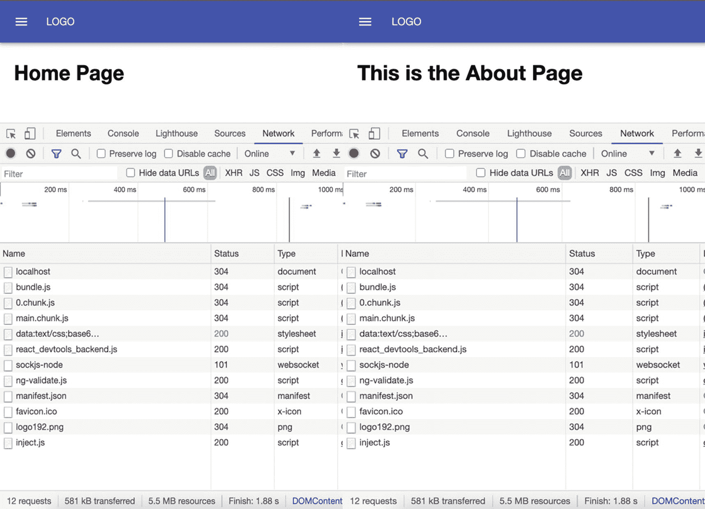

图 5-11

DevTools 中急切加载主页和 About 页面的截图

你会看到所有的组件甚至在应用初始加载时就已经加载了。这意味着，即使您从主页导航到“关于”页面，也不会添加任何新内容。

现在，让我们来看看一个急切加载的组件和一个延迟加载的组件之间的区别。

### 急切加载与缓慢加载

现在，让我们比较一个包装在延迟加载中的组件和一个渴望加载的组件。

在我们的`routes.tsx`中，导入命名的组件:

```jsx
import React, {lazy, Suspense}from 'react';

```

但是在我们比较这两个组件之前，我们需要用 React 悬念来包装我们的懒惰组件。所以让我们现在就开始吧。

接下来，为了便于比较，我们将延迟加载以下组件: **About 和 Dashboard** 。

```jsx
const Routes = () => {
  return (
    <Suspense>
    <Switch>
      {/*eager loading */}
      <Route exact path="/" component={Home} />

      {/*lazy loading */}
      <Route exact path="/about" component={AboutPage} />

      {/*lazy loadings*/}
        <Route
         exact path={'/about'}
          component={lazy(() => import('./views/pages/AboutPage'))}
           />

        <Route
           exact path={'/dashboard'}
          render={({ match: { path } }) => (
            <Dashboard>
              <Switch>
                <Route
                  path={path + '/'}
                  component={lazy(
                    () => import('./views/dashboard/dashboard-default-content'), )}
                />

              <Route
                exact
                path={path + '/settings-and-privacy'}
                component={SettingsAndPrivacy}
              />
            </Switch>
          </Dashboard>
        )}
      ></Route>

      <Route exact path="/not-found" component={NotFoundPage} />
      <Redirect from={'*'} to={'/not-found'} exact />
    </Switch>

    </Suspense>
  );
};

Listing 5-24Lazy Loading the Components About and Dashboard for Comparison

```

但是等等。如果您查看浏览器，您会看到以下错误。

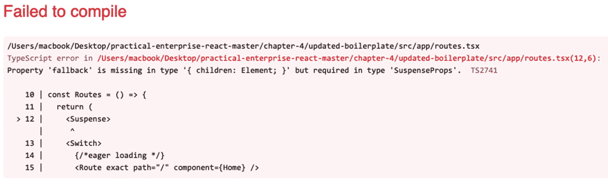

图 5-12

未能编译 React 悬念

这是因为悬念需要属性“回退”

React 查找树，遇到第一个<`Suspense>`组件，并呈现其回退。

使用所需的暂记属性 fallback，并且不要忘记导入命名的组件。线性进度条来自 Material-UI。

```jsx
...
import { LinearProgress } from '@material-ui/core';

export const Routes = () => {
  return (
    <Suspense fallback={<LinearProgress style={{ margin: '10rem' }} />}>

Listing 5-25Using the Suspense Prop fallback

```

好了，这应该让我们的悬念部分工作了。你也可以延迟加载设置和隐私，但是一定要让主页保持即时加载，这样我们就可以看到比较了。

刷新浏览器。刷新主页的同时打开 DevTools，如图 [5-13](#Fig13) 所示。

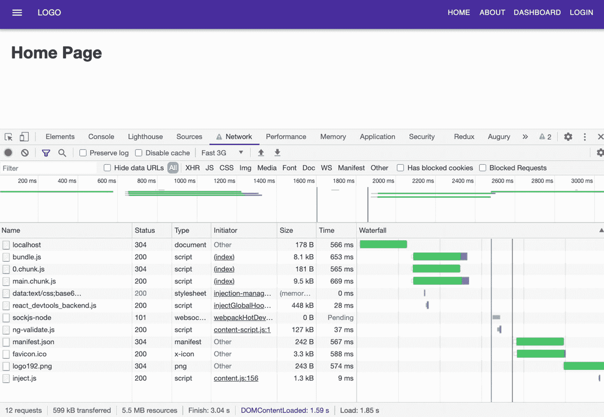

图 5-13

在初始加载时急切加载主页

但是，当您单击延迟加载的 About 页面时，您可以看到突出显示的部分只是添加的部分。突出显示的部分最初没有呈现在主页上，因为还不需要它们。参见图 [5-14](#Fig14) 。

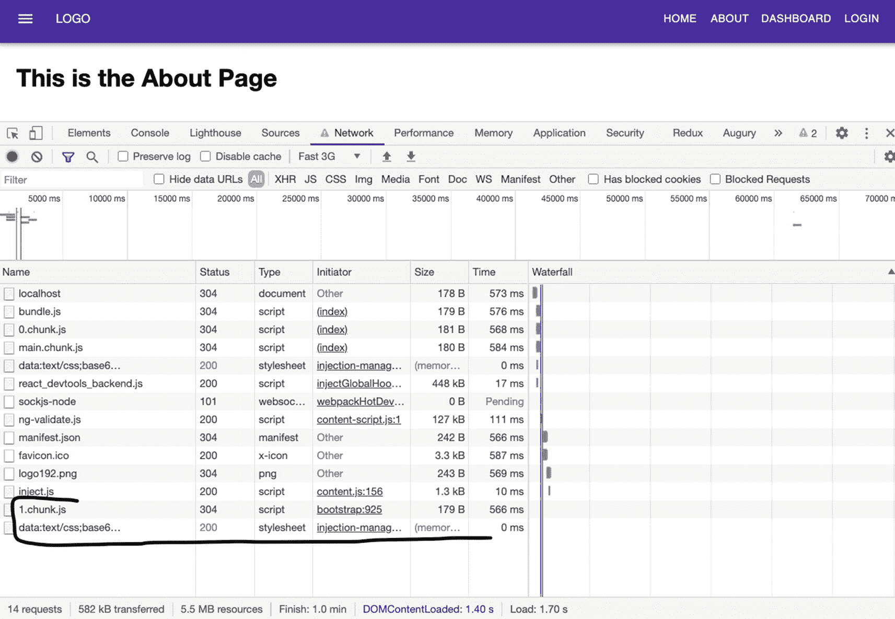

图 5-14

延迟加载关于页面

当您单击延迟加载的仪表板时，您会注意到同样的情况。参见图 [5-15](#Fig15) 。

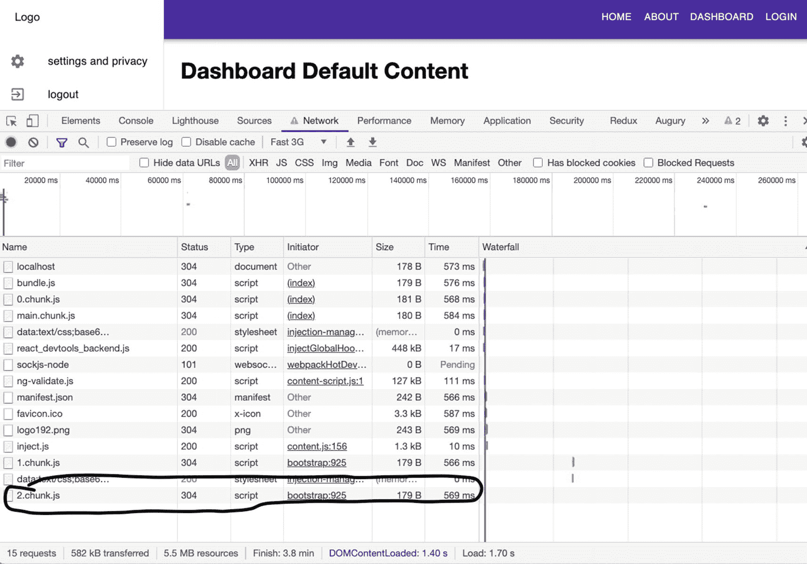

图 5-15

延迟加载仪表板

当我们从 About 页面导航到 Dashboard 页面时，突出显示的部分是唯一加载的内容。

你可能认为文件和加载时间可能无关紧要或很少，但是想象一下如果你的应用已经有了大量的代码，你有 50 页或更多。你的用户，尤其是使用移动应用或网速较慢的用户，会感觉到这一点。

## 摘要

我希望到目前为止，您已经对客户端路由的一般工作原理以及如何使用 React 路由库在 React 中实现路由有了一个大致的了解。我们还谈到了如何在我们的应用中使用延迟加载来加速我们的初始加载时间，最终目标是改善用户体验。

在下一章，我们将处理写本地状态、发送 HTTP 请求和使用 ApexCharts。