# 六、编写本地状态、发送 HTTP 请求和 ApexCharts

在前一章中，我们用`react-router`解决了导航问题。现在，我们将编写本地状态，使用 Axios 发送 HTTP 请求，并安装 ApexCharts 来帮助我们在应用中创建交互式图表。

HTTP 请求是任何与后端服务器通信的 web 应用的基本部分；与此同时，顾名思义，React 中的本地状态是在本地处理的，或者是在一个组件中独立处理的。必须设置状态中的任何更改，否则将使用 setState 函数重新呈现状态。

Axios 和 Fetch API 是我们如何使用 REST APIs 的两种最流行的方法。Axios 是基于 promise 的 HTTP 客户端，而 Fetch API 是 JavaScript 原生的，是现代浏览器内置的 HTTP 客户端。

在这一章中，我们将尽最大努力使用 Axios 进行 API 请求，以保持条理和干爽。编程中的 DRY 概念是抽象的过程，以避免代码的重复。由于从技术上来说，我们没有后端服务器，我们还将使用 JSON 服务器创建一个假的 Rest API。

ApexCharts 是一个开源图表库，我们将使用它来为我们的网页创建现代外观和交互式可视化。

但是在我们开始编写本地状态和发送 HTTP 请求之前，我们将在 TypeScript 的编译器选项中进行一些重构。

这更多是为了我们在应用中使用 TypeScript 时的个人喜好。是的，我们喜欢 TypeScript 给我们的类型安全特性，而 JavaScript 不能；然而，我们也不想失去 JavaScript 在开发应用时提供的灵活性。简而言之，我们希望两全其美。

您可以决定是否退出 TypeScript 中默认的严格类型检查选项。有两种方法可以解决这件事。

## TypeScript 中的严格类型检查选项

如前所述，在我们的应用中，有两种方式可以让我们个人使用或设置 TypeScript 中的类型检查选项。

第一个是将值设置或更改为“false”为此，在您的项目应用中，打开 tsconfig.json 文件并在“compilerOptions”下查看。将严格值标志设置为 false。

```jsx
{
  "compilerOptions": {
    "target": "es5",
    "lib": ["dom", "dom.iterable", "esnext"],
    "allowJs": true,
    "skipLibCheck": true,
    "esModuleInterop": true,
    "allowSyntheticDefaultImports": true,
    "strict": false,
    "forceConsistentCasingInFileNames": true,
    "module": "esnext",
    "moduleResolution": "node",
    "resolveJsonModule": true,
    "isolatedModules": true,
    "noEmit": true,
    "noFallthroughCasesInSwitch": true,
    "jsx": "react",
    "baseUrl": "./src"
  },
  "include": ["src"]
}

Listing 6-1tsconfig.json File

```

默认情况下，tsconfig.json 中 compilerOptions 的 strict 模式设置为`true`。这意味着应用中的所有代码或文件都将使用严格模式进行验证或类型检查。

更多 tsconfig 参考可以查看 [`www.typescriptlang.org/tsconfig`](http://www.typescriptlang.org/tsconfig) 。

但是图 [6-1](#Fig1) 是类型检查标志的简要描述。

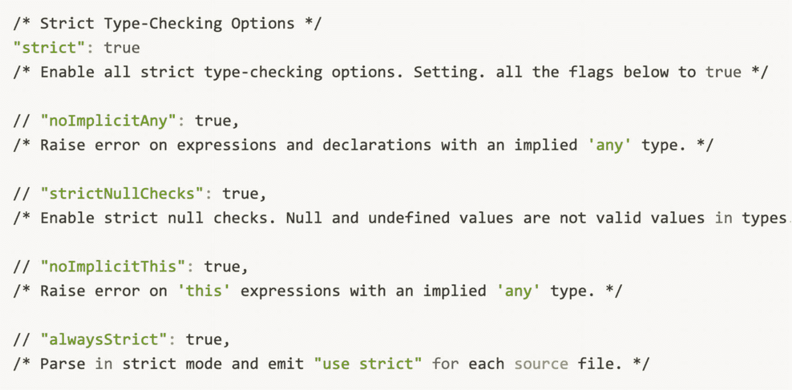

图 6-1

类型检查选项标志

第二种方法是有时选择退出 TypeScript 中的类型检查选项，并允许默认值 strict，这是正确的，但是要在`compilerOptions` `:`中添加以下内容

```jsx
"noImplicitAny": false,
"strictNullChecks": false,
    ...
    "strict": true

```

TypeScript Tips

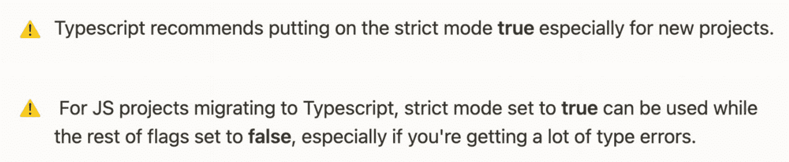

## 使用 json-server 添加虚假数据

使用我们自己的假 REST API 的主要好处是前端和后端开发工作的解耦。如果不同的团队在前端和后端工作，那么团队只需要讨论并同意 JSON 结构，然后就可以独立工作了。

在前端，使用假数据可以加快开发进程；不需要等待后端完成构建真正的 API。

设置呢？它允许我们通过本地服务器从文件系统中提供 JSON。

让我们转到我们的`package.json`文件来检查我们的`json-server`作为一个 devDependency:

```jsx
"devDependencies":{
"concurrently": "5.3.0",
"cypress": "6.0.0",
"json-server": "0.16.3",
"json-server-auth": "2.0.2" } }

```

`Json-server`是一个假的 Node.js 服务器，仅仅通过运行 [`npmjs.com`](http://npmjs.com/) `, json-server`中的`json-server.`就被搭建了起来，被描述为“在不到 30 秒的时间内获得零编码的完整假 REST API”是的，根据经验，它做得很好。

让我们运行它来测试。将以下代码添加到您的脚本中:

```jsx
"backend": "json-server --watch db.json --port 5000 --delay=1000"

```

在终端中，运行$ npm run backend。

您将看到以下资源端点。

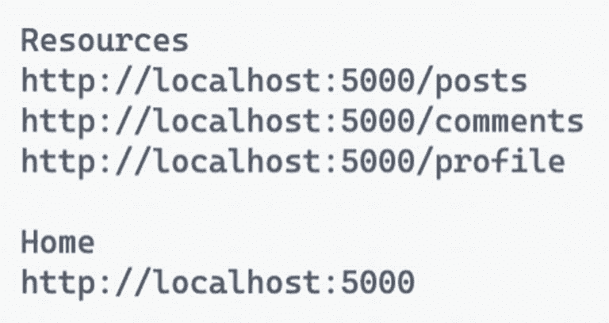

图 6-2

默认端点

让我们检查一下`http://localhost:5000/posts`。这是因为安装了 JSONView Chrome 扩展。它在浏览器中重新格式化 JSON 响应，而不是一长串字符串，就像我们编辑器中更漂亮的一样。Firefox 浏览器中也有这个扩展。

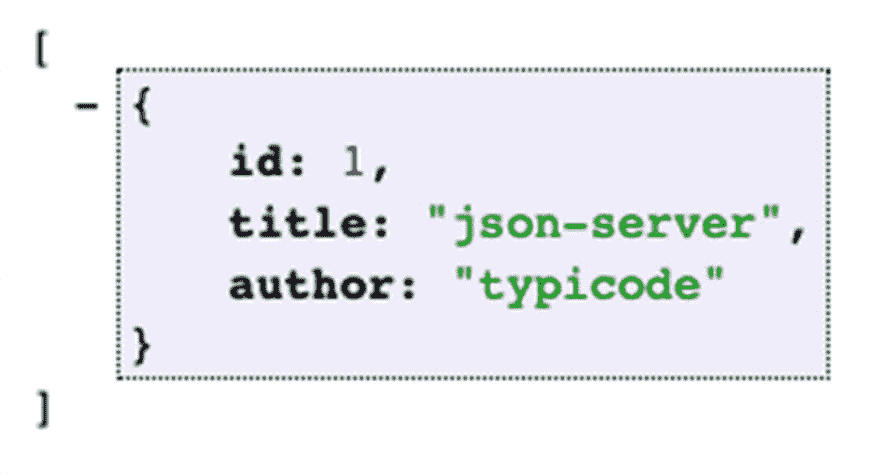

图 6-3

渲染本地主机:5000/post

现在，让我们回到我们的项目；您会注意到在根目录中已经为我们自动生成了一个名为`db.json`的新文件。打开它，您将看到示例端点。

现在我们已经看到它正在工作，让我们用我们自己的假数据替换自动生成的端点。复制以下数据。

```jsx
{
  "sales": [
    {
      "id": "sgacus86fov",
      "name": "This week",
      "data": [30, 40, 25, 50, 49, 21, 70, 51]
    },
    {
      "id": "saftyaf56",
      "name": "Last week",
      "data": [23, 12, 54, 61, 32, 56, 81, 19]
    }
  ]
}

Listing 6-2db.json Server Fake Data

```

清单 [6-2](#PC5) 有端点“销售”，它有两个对象，分别是`"This week"`和`"Last week"`。它有唯一的数据让我们从数组中获取特定的对象。让我们试试 localhost:5000/sales 是否可行。在我们的本地浏览器中，您应该会看到如图 [6-4](#Fig4) 所示的响应。

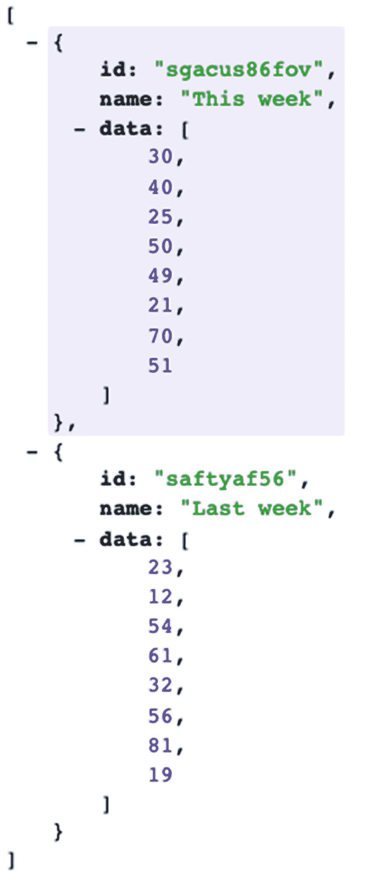

图 6-4

渲染数据

## 使用 Axios 发送 HTTP 请求

在构建复杂或大型应用时，创建 axios 实例非常有用，尤其是当我们需要集成多个 API 时。实现默认的 Axios 实例有时会很麻烦，或者意味着在整个应用中重复代码。

您何时可以实现实例的一些示例:

*   从路径构建完整的 URL

*   分配默认标题

*   贮藏

*   网络错误的全局处理

*   自动设置请求的授权头

*   规范化和管理错误响应

*   转换请求和响应正文

*   刷新访问令牌并重试请求

*   设置自定义实例

现在我们已经有了，让我们创建我们的 axios 配置。创建一个名为`axios.ts`的新文件。文件路径为`src/api/axios.ts`。

```jsx
import axios from 'axios';

/*create an instance of axios with a default base URI when sending HTTP requests*/
/*JSON Server has CORS Policy by default*/

const api = axios.create({ baseURL: 'http://localhost:5000/', });

 export default api;

 export const EndPoints = { sales: 'sales', };

Listing 6-3axios.ts

```

我们从 axios 导入 axios，并且我们正在使用 axios 的 create 函数，该函数将创建 axios 的一个实例，并放入名为 api 的变量。

在实例 api 中，有一个选项可以传递我们配置的对象。

目前，我们的默认配置是`localhost:5000``/.``localhost:5000`，因为`baseURL`是 axios 中任何 HTTP 请求的默认 URL。基本上，它是网址的一致或永久的部分。

在一个位置创建一个`baseURL`让我们能够根据需要轻松地编辑它，并在我们的应用开发中保持干燥。我们不需要在每次创建 HTTP 请求时重复输入 API 的`baseURL`。

我们只需要通过 api 的端点(即销售)。见图 [6-5](#Fig5) 中的样品。这也将有助于我们避免在输入端点时出现输入错误。

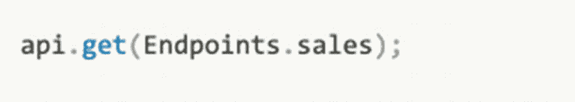

图 6-5

如何使用 api 端点

在我们的 axios 对象中有很多选项可以使用。我们获得了这种内置的智能感知，因为 axios 是使用 TypeScript 构建的。

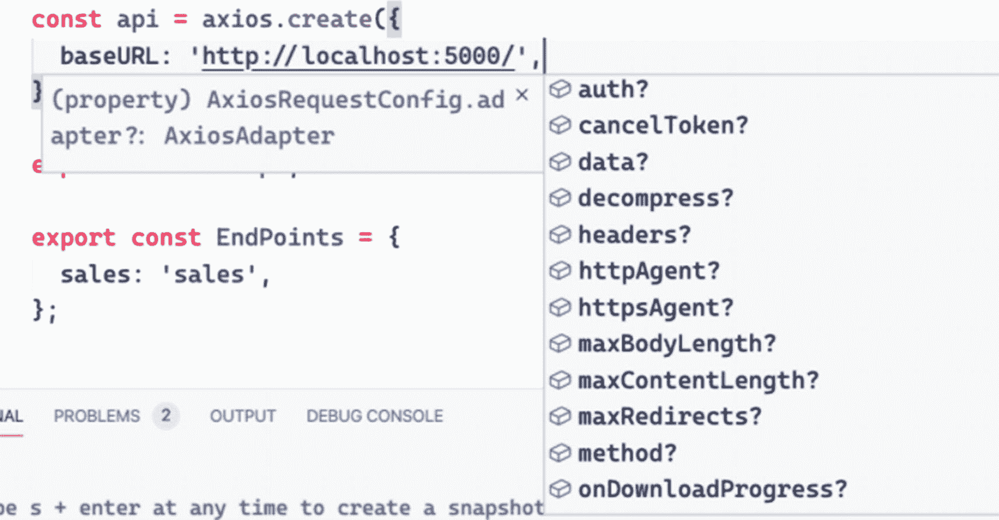

图 6-6

axios 对象的选项配置

好了，我们暂时结束了。随着我们创建更多端点，我们将不断更新 axios 文件。

### 塑造物体

在 TypeScript 中，我们通过*对象类型*传递数据，而在 JavaScript 中，我们通过*对象*分组和表示数据。简单来说，*类型*让我们知道一个条目是什么样子:**字符串、数字、布尔、数组、函数**等。

回想一下在 TypeScript 中塑造我们的对象的两种方法:**接口**和**类型别名**。他们或多或少是一样的；你选择什么只是个人喜好的问题。

因为我们使用 TypeScript，所以我们需要定义对象的形状或类型。首先，创建一个新文件，并将其命名为`sale-type.ts.`

```jsx
src/models/sale-type.ts

Listing 6-4Creating the Shape or Model of Our Object

```

我们销售对象的形状或模型具有字符串类型和数字数组类型的数据:

```jsx
//type alias

type SaleType = {
  name: string;
  data: number[];
}

```

### 使用 Axios 发出请求

在我们继续之前，让我们回顾一下 axios 是什么。Axios 是一个基于 promise 的 HTTP 客户端，用于浏览器和 Node.js。它允许我们拦截和取消请求，并提供一个内置的功能，称为客户端保护，防止跨站点请求伪造。

让我们创建一个新文件，并将其命名为 saleService.ts:

```jsx
src/services/saleService.ts

```

我们将导入我们最近创建的文件 api/axios、来自 TypeScript 配置的端点以及模型 sale-type。

```jsx
import api, { EndPoints } from 'api/axios';
import { SaleType } from 'models/sale-type';

export async function getSalesAxios() {
  return await api.get<SaleType[]>(EndPoints.sales);
}

/* Other commonly-used api methods:
  api.post
  api.put
  api.delete
  api.patch
*/

/* The < > bracket here is a Generic type that Typescript adapted from OOP.
   It means that the return value of the getSalesAxios is an array of SaleType.
   This would likewise help us with the TypeScript intell-sense when using it.
*/

Listing 6-5Sending Http Requests

```

async-await 仅仅意味着 axios 函数是基于承诺的。

现在，让我们测试我们的`api.get`请求。

转到`src/app/views/dashboard/dashboard-default-content.tsx`。

我们将在这里使用额外的魔法，为此，我们将使用来自`React`的生命周期钩子`useEffect`。

从 React 导入命名组件。

同样，`useEffect`是一个生命周期挂钩，它在 React 组件呈现后运行。在这个钩子中，我们将调用`getSalesAxios().`

确保从`services/saleService.`导入组件

```jsx
import React, {useEffect} from 'react';
import { getSalesAxios } from 'services/saleService';

const DashboardDefaultContent = () => {

  useEffect(() => {
  //code to run after render goes here

    getSalesAxios();
  }, []);  //ß empty array means to ‘run once’

  return (
    <div>
      <h1>Dashboard Default Content</h1>
    </div>
  );
};

export default DashboardDefaultContent;

Listing 6-6Calling the getSalesAxios in DashboardDefaultContent

```

Tips

在 useEffect 中传递一个空数组[ ]作为第二个参数，以限制其运行或在第一次渲染后仅运行一次 useEffect。

接下来，打开两个终端并执行以下操作:

```jsx
$ npm run start
$ npm run backend

```

在`localhost:3000/`刷新我们的浏览器，打开 Chrome DevTools，确保你在网络选项卡和 XHR。我们正在做所有这些所谓的我如何构建一个应用的一小步一小步的过程。

尝试先执行低层次的悬挂果实，也许写很多概念证明，或者在 DevTools 上检查是否一切都按预期方式运行。

无论如何，在你的浏览器中，点击菜单选项卡➤仪表板。

观察你的 Chrome DevTools 您应该看到响应方法:Get 和状态代码:`200 OK.`

点击响应选项卡，查看来自`json-server.`的销售对象数据

所以现在我们确信 UI 正在接收来自`json-server`的数据。我们发送了 HTTP 请求，并收到了来自 json-server 的 JSON 响应。

但是由于我们可能需要将 getSalesAxios 包装在一个 async-await 中，我们将在`useEffect.`之外调用它

我们一会儿会处理`useEffect()`的。

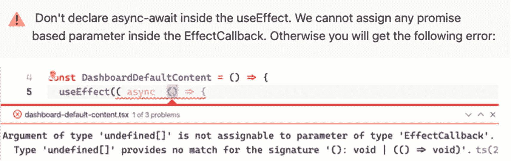

图 6-7

在 EffectCallback 中使用 async 时显示错误

因此，让我们在 useEffect 之外创建一个可用的函数，并将其命名为`fetchSales.`

```jsx
const fetchSales = async () => {

    const data = await getSalesAxios();
    console.log(data);
  }

Listing 6-7Creating the fetchSales Function

```

我们解构了响应，只得到数据属性，并将其命名为“数据”

接下来，确保在`useEffect.`中调用新创建的函数，这就是我说我们稍后将使用`useEffect()`的意思。

```jsx
const DashboardDefaultContent = () => {
  useEffect(() => {
    fetchSales();
  }, []);

Listing 6-8Calling fetchSales in useEffect

```

刷新浏览器并确保再次打开 Chrome DevTools，您应该会成功地从 json-server 获得响应。

既然我们知道可以从 json-server 中检索数据，接下来要做的就是使用 DashboardDefaultContent 中的`useState`创建一个本地状态。

添加 React 中的组件`useState`。

不要忘记从文件夹`services/saleService.`中导入`getSalesAxios`

```jsx
import { SaleType } from 'models/sale-type';
import React, { useEffect, useState } from 'react';
import { getSalesAxios } from 'services/saleService';

const DashboardDefaultContent = () => {

const [sales, setSales] = useState<SaleType[]>([]);

Listing 6-9Creating a Local State

```

我们如何更新`setSales`的值或数据？

在我们的`fetchSales`组件中，让我们调用`setSales`并用我们的`useState.`中相同类型的对象传递数据

```jsx
const fetchSales = async () => {
    const { data } = await getSalesAxios();
    console.log(data);  // ← to check in the console if we are successfully getting the data
    setSales(data);
  };

Listing 6-10Updating the Data of setSales

```

好的，就像我之前说的，在我继续之前，我会经常做这个小小的概念证明。

让我们检查一下我们是否真的将数据传递给了 HTML 中的`setSales.`,键入 h2 头并呈现销售数组的长度。

```jsx
return (
    <div>
      <h1>Dashboard Default Content</h1>
      <h2>{sales.length}</h2>
    </div>
  );
};

Listing 6-11Rendering the setSales

```

当您检查浏览器时，您应该看到 **2** ，因为我们的销售数组包含两个对象。去`Chrome DevTools` ➤ `Network`看实物。

现在我们知道它正在工作，下一个计划是改进仪表板的默认内容。

在 components 文件夹中，让我们为网页创建一个模板。模板页面将包含应用于我们应用中每个页面的填充、间距和其他样式。

文件路径为 src ➤ app ➤组件➤页面. tsx

导入以下组件:

```jsx
import React,{ forwardRef, HTMLProps, ReactNode }from 'react'
import { Helmet } from 'react-helmet-async';

```

让我们在这里回顾一些组件。

*转发引用*:这是添加一个对 HTML 的引用。在 [`reactjs.org`](http://reactjs.org) 中，说的是通过一个组件自动传递一个 ref 给它的一个子组件的技术，比如转发 refs 给 DOM 组件或者转发 refs 给高阶组件(hoc)。

头盔:添加一些标签，并允许我们建立一个 SEO 友好的应用。

接下来，我们将在清单 [6-12](#PC19) 中定义我们的类型或类型定义。

```jsx
type Props = {
  children?: ReactNode;
  title?: string;
} & HTMLProps<HTMLDivElement>;

Listing 6-12Defining the Type Alias

```

我们正在创建 ReactNode 类型的 prop children 和 string 类型的 prop title，两者都可以通过追加`?`来空化。我们还使用了`HTMLDivElement.`类型的`HTMLProps`

这是我们的页面组件，它将成为我们所有网页的可重用模板。

```jsx
const Page = forwardRef<HTMLDivElement, Props>(
  ({ children, title = '', ...rest }, ref) => {
    return (
      <div ref={ref as any} {...rest}>
        <Helmet>
          <title>{title}</title>
        </Helmet>
        {children}
      </div>
    );
  },
);
export default Page;

Listing 6-13Creating a Reusable Page Component

```

暂时就这样了。

让我们回到我们的`DashboardDefaultContent`组件，给仪表板添加更多样式。

将以下样式组件添加到`DashboardDefaultContent.`

样式包括图表样式主题、背景颜色、数据表、图例、描边工具提示、x 轴和 y 轴等。你可以在 Material-UI 网站上了解更多相关信息。这有点长，所以请耐心听我说:

```jsx
const useStyles = makeStyles(() => ({
  root: {
    minHeight: '100%',
  },
}));

const getChartStyling = (theme: Theme) => ({
  chart: {
    background: theme.palette.background.paper,
    toolbar: {
      show: false,
    },
  },
  colors: ['#13affe', '#fbab49'],
  dataLabels: {
    enabled: false,
  },
  grid: {
    borderColor: theme.palette.divider,
    yaxis: {
      lines: {
        show: false,
      },
    },
  },
  legend: {
    show: true,
    labels: {
      colors: theme.palette.text.secondary,
    },
  },
  plotOptions: {
    bar: {

      columnWidth: '40%',
    },
  },
  stroke: {
    show: true,
    width: 2,
    colors: ['transparent'],
  },
  theme: {
    mode: theme.palette.type,
  },
  tooltip: {
    theme: theme.palette.type,
  },
  xaxis: {
    axisBorder: {
      show: true,
      color: theme.palette.divider,
    },
    axisTicks: {
      show: true,
      color: theme.palette.divider,
    },
    categories: ['Sun', 'Mon', 'Tue', 'Wed', 'Thu', 'Fri', 'Sat', 'Sun'],
    labels: {
      style: {
        colors: theme.palette.text.secondary,
      },
    },
  },
  yaxis: {
    axisBorder: {
      show: true,
      color: theme.palette.divider,
    },
    axisTicks: {
      show: true,
      color: theme.palette.divider,
    },
    labels: {
      style: {
        colors: theme.palette.text.secondary,
      },
    },
  },
});

```

为了在 React 组件中使用它，我们需要从 Material-UI 导入主题和`makeStyles`:

```jsx
import { Theme } from '@material-ui/core/styles';
import { makeStyles } from '@material-ui/styles';

```

然后，让我们在 DashboardDefaultContent 中创建两个变量——类和主题——并分别分配`useStyles`和`useTheme`样式。

```jsx
const DashboardDefaultContent = () => {
  const classes = useStyles();
  const theme = useTheme();

  const [sales, setSales] = useState<SaleType[]>([]);

  useEffect(() => {
    fetchSales();
  }, []);

  const fetchSales = async () => {
    const { data } = await getSalesAxios();
    setSales(data);
  };

Listing 6-14Adding useStyles and useTheme

```

设置好所有这些之后，我们需要做的下一件事是安装 ApexCharts。

## 安装 ApexCharts

ApexCharts 是一个开源的现代 JS 图表库，用于使用 API 构建交互式图表和可视化。各种现代浏览器都支持它。让我们安装:

```jsx
npm install react-apexcharts apexcharts

```

回到 DashboardDefaultContent，从 Material-UI 核心库中导入 ApexCharts 和其他一些样式组件。

```jsx
import chart from 'react-apexcharts';
import {
  Box,
  Card,
  CardContent,
  Container,
  Grid,
  Typography,
  useTheme,
} from '@material-ui/core';

Listing 6-15Importing Additional Material-UI Components

```

至此，我们将添加之前创建的页面组件:

```jsx
import Page from 'app/components/page';

```

使用页面组件和我们创建的图表。用下面的代码替换页面组件中的返回标题。

```jsx
<Page className={classes.root} title="Dashboard">
      <Container maxWidth={'sm'}>
        <Typography variant="h4" color="textPrimary">
          Dashboard
        </Typography>
        <Box my={5}>
          <Grid container spacing={3}>
            <Grid item xs={12}>
              <Card>
                <CardContent>
        <Typography variant="h5"  color="textPrimary">
                    Sales
                  </Typography>
                  <Chart
                    options={getChartStyling(theme)}
                    series={sales}
                    type="bar"
                    height={'100%'}
                  />
                </CardContent>
              </Card>
            </Grid>
          </Grid>
        </Box>
      </Container>

Listing 6-16Updating the Page Component

```

所以我们重用了页面组件，并将其命名为“仪表板”容器和其他样式组件一起设置了`DashboardDefaultContent`页面的外观。

运行应用，您应该会在浏览器中看到这些变化。


图 6-8

呈现更新的页面组件

虽然还有很长的路要走，但我们正在努力完成我们的仪表板页面。

在此之前，转到`src` ➤ `index.ts,`并删除`<React.StrictMode>`，这样我们就不会在开发应用时收到不必要的警告和错误:

```jsx
const ConnectedApp = ({ Component }: Props) => (
  <Provider store={store}>
    <HelmetProvider>
        <Component />
    </HelmetProvider>
  </Provider>
);

```

接下来，打开文件`src/app/index.tsx`并删除`<NavigationBar/>`，因为我们将用一个新的布局组件替换它:

```jsx
export function App() {
  return (
    <BrowserRouter>
      <Helmet
        titleTemplate="%s - React Boilerplate"
        defaultTitle="React Boilerplate"
      >
        <meta name="description" content="A React Boilerplate application" />
      </Helmet>
      <NavigationBar />
      <Container>
        <Routes />
      </Container>
      <GlobalStyle />
    </BrowserRouter>
  );
}

```

### 创建主布局

在 layouts 目录中，让我们在 main-layout 目录下创建一个新文件夹并命名为`main-layout.`,创建它的 index.tsx 文件。以下是文件路径。

```jsx
src ➤ app ➤ layouts ➤ main-layout ➤ index.tsx

Listing 6-17Creating a New Main-Layout Component Page

```

将下面的代码复制到`index.tsx` `:`

```jsx
import React, { ReactNode } from 'react';
import { makeStyles } from '@material-ui/core';

import NavigationBar from './navigation-bar';

type Props = {

  children?: ReactNode;
};

const MainLayout = ({ children }: Props) => {
  const classes = useStyles();

  return (

      <NavigationBar />
      <div className={classes.root}>
        <div className={classes.wrapper}>
          <div className={classes.contentContainer}>
            <div className={classes.content}>{children}</div>
          </div>
        </div>
      </div>

  );
};

const useStyles = makeStyles(theme => ({
  root: {
    backgroundColor: theme.palette.background.default,
    display: 'flex',
    height: '100%',
    overflow: 'hidden',
    width: '100%',
  },
  wrapper: {
    display: 'flex',
    flex: '1 1 auto',
    overflow: 'hidden',
    paddingTop: 64,
  },
  contentContainer: {
    display: 'flex',
    flex: '1 1 auto',
    overflow: 'hidden',
  },

  content: {
    flex: '1 1 auto',
    height: '100%',
    overflow: 'auto',
  },
}));

export default MainLayout;

```

在我们再次运行或检查浏览器是否一切正常之前，我们将做一个小的文件夹重组。

将组件文件夹中的导航栏. tsx 放在新创建的 main-layout 文件夹下。

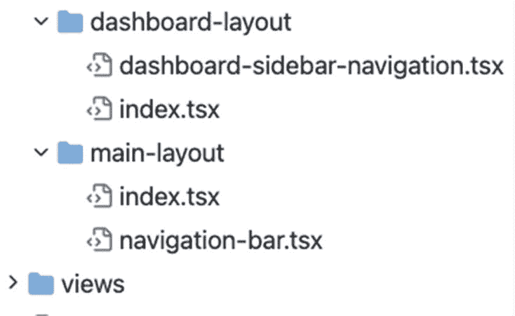

图 6-9

将 navigation-bar.tsx 移动到主布局文件夹中

完成后，转到应用根文件夹的 index.tsx:

```jsx
Src ➤ app ➤ index.tsx

```

我们将用刚刚创建的`<MainLayout>`替换`<Container>`。不要忘记导入命名的组件。

```jsx
...
import MainLayout from './layouts/main-layout';
...

      <MainLayout>
        <Routes />
      </MainLayout>

Listing 6-18Using the MainLayout in the index.tsx of app

```

在`http://localhost:3000/dashboard,`刷新你的浏览器，你会注意到样式和间距的一些变化。

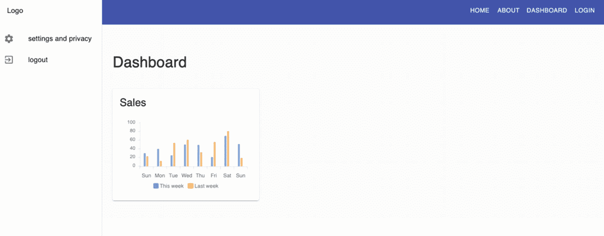

图 6-10

呈现更新的主布局

接下来，让我们回到仪表板布局文件夹的`index.tsx`文件。我们将添加一些样式，包括间距和布局。让我们从 Material-UI 核心样式中导入`makeStyles`:

```jsx
import {makeStyles} from '@material-ui/core/styles';

```

然后，为样式添加以下代码。

```jsx
const useStyles = makeStyles(theme => ({
  root: {
    display: 'flex',
    height: '100%',
    overflow: 'hidden',
    width: '100%',
  },
  wrapper: {
    display: 'flex',
    flex: '1 1 auto',
    overflow: 'hidden',
    paddingTop: 64,
    [theme.breakpoints.up('lg')]: {
      paddingLeft: 256,
    },
  },
  contentContainer: {
    display: 'flex',
    flex: '1 1 auto',
    overflow: 'hidden',
  },

  content: {
    flex: '1 1 auto',
    height: '100%',
    overflow: 'auto',
  },
}));

Listing 6-19Adding Styling to the index.tsx of dashboard-layout

```

接下来，添加`useStyles`并将`{children}`包裹在`<div>.`中

```jsx
const classes = useStyles()

...

<DashboardSidebarNavigation />{' '}
      <div className={classes.wrapper}>
        <div className={classes.contentContainer}>
          <div className={classes.content}>{children}</div>
        </div>
      </div>

Listing 6-20Adding the useStyles Component to the index.tsx of the dashboard-layout

```

检查仪表板，您应该会看到一个更好的、响应更快的布局。

### 使用 React 羽化图标

最后但同样重要的是，我们将在侧边栏仪表板中添加一个菜单。我们将使用 React 羽毛图标。

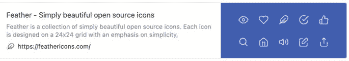

安装 React 羽毛库:

```jsx
npm i react-feather

```

安装完成后，打开`dashboard-sidebar-navigation.tsx`，从 react-feather 导入 PieChart 组件。我们只是将它重命名为`PieChartIcon.`另一个我们需要导入的东西是来自 Material-UI 核心的`Divider`和`ListSubheader`:

```jsx
import { PieChart as PieChartIcon } from 'react-feather';
import { Divider, ListSubheader } from '@material-ui/core';

```

在`Logo`之后和`settings-and-privacy`之前，添加以下代码。

```jsx
<Link to={`${url}`} className={classes.logoWithLink}>
              Logo
            </Link>
          </Toolbar>
          <div className={classes.drawerContainer}>
            <List>

...

<ListSubheader>Reports</ListSubheader>
              <Link className={classes.link} to={`${url}`}>
                <ListItem button>
                  <ListItemIcon>
                    <PieChartIcon />
                  </ListItemIcon>
                  <ListItemText primary={'Dashboard'} />
                </ListItem>
              </Link>

...
<Link className={classes.link} to={`${url}/settings-and-privacy`}>

Listing 6-21Updating the dashboard-sidebar-navigation.tsx

```

刷新浏览器以查看更改，应如图 [6-11](#Fig11) 所示。点击按钮，查看一切是否正常。

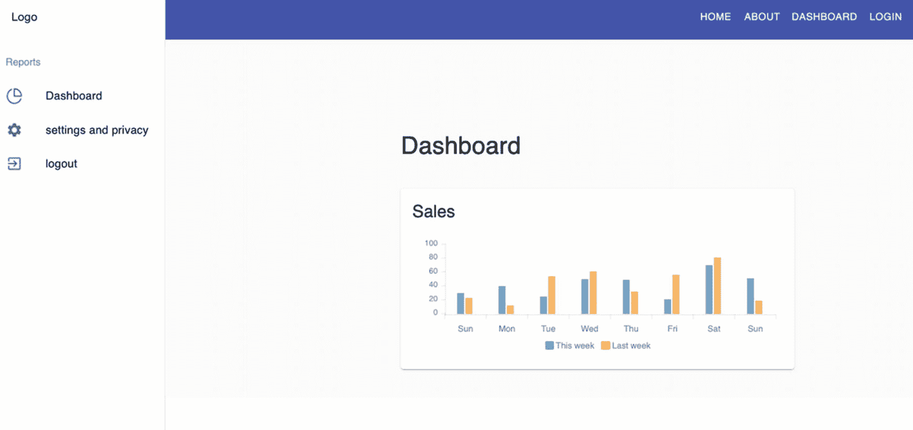

图 6-11

更新仪表板后的用户界面-侧栏-导航

## 摘要

我们学习了如何使用本地状态，在考虑 DRY(不要重复自己)原则的同时发送 HTTP 请求，以及使用名为 ApexCharts 的开源图表库为我们的应用创建交互式可视化。

在下一章中，我们将更深入地研究我们的应用，因为我们开始在 Material-UI 的数据表上使用 Formik 和 Yup 验证来编写输入表单。希望我们能把所有这些组件放在一起，并在浏览器上呈现出来，看看一切是如何工作的。