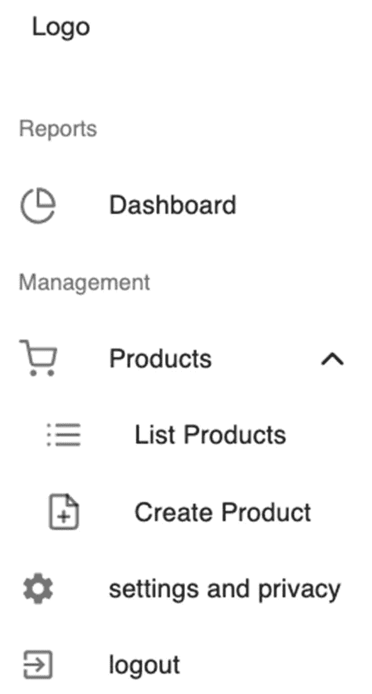
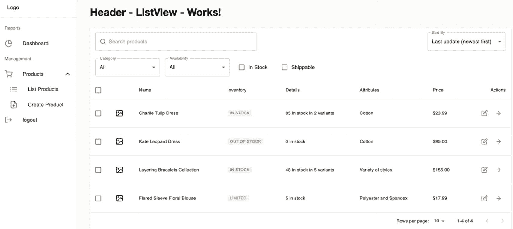

# 七、编写数据表、表单和验证

在前一章中，我们学习了如何写本地状态和发送 HTTP 请求。我们还安装了 ApexCharts 来创建我们的可视化图表。

我们现在将继续构建我们的应用，添加新的组件为我们的数据表打下基础，并开始使用 Formik 编写表单，使用 Yup 进行输入验证。这一章是两部分系列的第一部分，因为它是一个相当长的主题。第一部分是创建数据表和其他样式组件，这将是第二部分(下一章)的基础，重点是编写表单和输入验证。

本章的最终存储库在这里:


来源: [`https://github.com/webmasterdevlin/practical-enterprise-react/tree/master/chapter-7`](https://github.com/webmasterdevlin/practical-enterprise-react/tree/master/chapter-7)

## 组件概述

在我们继续我们的项目应用之前，让我们回顾一下我们将在本章中使用的一些库或组件。

### 表单处理

表单允许应用用户通过我们的组件直接输入和提交数据，从个人资料页面或登录屏幕到购物结账页面等。这也是为什么它是任何 web 应用的关键部分的主要原因。

根据我自己的经验和许多其他 React 开发人员的经验，在 React 应用中创建表单可能会非常乏味。更重要的是，我们从头开始创建的表单可能容易出错，因为我们需要自己处理所有的 React。

这就是我选择使用 Formik 构建表单的原因。您可以使用许多其他优秀的表单库，包括 Redux Form、Formsy 和 React Forms。

### 很好

这为我们提供了表单、字段和错误消息组件来创建表单、添加表单字段和显示错误消息。福米克给了我们三个支柱:

*   `initialValue`:表格字段的初始值。

*   `validate`:用于表单字段中的验证规则。

*   当我们点击提交的时候，这个函数就会起作用。

当我们开始构建表单时会有更多的介绍。我觉得还是用代码展示比较好。

### 是的

Yup 是 JavaScript 中的对象模式验证器(清单 [7-1](#PC1) )。有了 Yep，我们可以

*   定义对象模式及其验证。

*   使用所需的模式和验证创建验证器对象。

*   使用 Yup 实用函数验证对象是否有效(满足模式和验证)。如果它不满足验证，将返回一条错误消息。

```jsx
//define the object schema and its validation 

const book = {
        published: 1951,
  author: "JD Salinger",
  title: "The Catcher in the Rye",
  pages: 234
};

//create a validator object with the required schema and validation

const yup = require("yup");

const yupObject = yup.object().shape({
  published: yup.number.required(),
  author: yup.string.required(),
  title: yup.string.required(),
  pages: yup.number()

});

Listing 7-1An Example of Creating the Validations with Yup

```

为了演示我们如何将所有这些结合在一起使用，我们将构建一个产品仪表板，列出所有产品并将新产品添加到我们的应用中。

首先，我们将使用 Material-UI 中的数据表组件来显示数据集。

## 数据表

### 产品创建视图

转到`views ➤ dashboard,`新建一个文件夹，命名为`product`。在产品文件夹下，创建另一个文件夹，命名为`ProductCreateView.`

在`ProductCreateView`文件夹中，创建一个新文件并命名为`Header.tsx.`

以下是文件路径:

```jsx
views ➤ dashboard ➤ product ➤ ProductCreateView ➤ Header.tsx

```

打开`Header.tsx,`，输入 VS 代码的片段`rafce`或 WebStorm 的片段`rsc`后，暂时添加头`<h1>Header - CreativeView Works!</h1>`。

参见清单 [7-2](#PC3) 关于创建 ProductCreateView 的 Header 组件。

```jsx
import React from 'react'.

const Header = () => {
  return (
    <div>
      <h1>Header - CreativeView Works!</h1>
    </div>
  )
}

export default Header;

Listing 7-2Creating the Header Component of ProductCreateView

```

仍然在`ProductCreateView`文件夹中，我们将添加另一个文件，并将其命名为`ProductCreateForm.tsx.`

### 产品创建表单

以下是文件路径:

```jsx
views ➤ dashboard ➤ product ➤ ProductCreateView ➤ ProductCreateForm.tsx

```

给`ProductCreateForm.tsx`添加一个

# 标签。参见清单 [7-3](#PC5) 关于创建 ProductCreateForm.tsx.

```jsx
import React from 'react'

const ProductCreateForm = () => {
  return (
    <div>
      <h1>ProductCreateForm Works! h1>
    </div>
  )
}

export default ProductCreateForm;

Listing 7-3Creating the ProductCreateForm.tsx

```

接下来，在`ProductCreateView`目录下，添加一个`index.tsx`文件，该文件将导入我们刚刚创建的两个组件:`Header.tsx`和`ProductCreateForm.tsx.`

清单 [7-4](#PC6) 创建`index.tsx`T1】

```jsx
import React from 'react';
import { Container, makeStyles } from '@material-ui/core';

import Header from './Header';
import ProductCreateForm from './ProductCreateForm';

const ProductCreateView = () => {
  const classes = useStyles();

  return (

      <Container>
        <Header />
        <ProductCreateForm />
      </Container>

  );
};

const useStyles = makeStyles(theme => ({}));

export default ProductCreateView;

Listing 7-4Creating the index.tsx of ProductCreateView

```

所以我们现在已经完成了。我们稍后将回头讨论这些组件。我们要做的下一件事是创建产品列表视图。

### 产品列表视图

我们将在产品中创建另一个文件夹，并将其命名为`ProductListView`，并在该文件夹下添加两个新文件，分别命名为`Header.tsx`和`Results.tsx,`:

```jsx
views ➤ dashboard ➤ product ➤ ProductListView ➤ Header.tsx
Views ➤ dashboard ➤ product ➤ ProductListView ➤ Results.tsx

```

打开`Header.tsx`并复制如下代码。

```jsx
import React from 'react';
import { makeStyles } from '@material-ui/core';

const Header = () => {
  const classes = useStyles();
  return (
    <div>
      <h1>Header - ListView - Works!</h1>
    </div>
  );
};
const useStyles = makeStyles(theme => ({
        root: {},
        action: {
          marginBottom: theme.spacing(1),
          '& + &': {
             marginLeft: theme.spacing(1),
           },
        },
     }));

export default Header;

Listing 7-5Creating the Header.tsx of ProductListView

```

您可以在`Results.tsx.`上自己做同样的事情，但是，将

# 标题改为

`"Results - Works!"`

完成`Results.tsx,`之后，我们将为`ProductListView`添加`index.tsx`。

```jsx
import React from 'react';
import {Container, makeStyles} from '@material-ui/core';
import Header from './Header';
import Results from './Results';

const ProductListView = () => {
  const classes = useStyles();

  return (
    <Container>
      <Header/>
      <Results/>
    </Container>
  );
};

const useStyles = makeStyles(theme =>
  createStyles({
    backdrop: {
      zIndex: theme.zIndex.drawer + 1,
      color: '#fff',
    },
    root: {
      minHeight: '100%',
      paddingTop: theme.spacing(3),
      paddingBottom: 100,
    },
  }),
);

export default ProductListView;

Listing 7-6Creating the index.tsx of ProductListView

```

当我们需要做一些更改时，我们将在后面讨论所有这些组件。

## 更新路线

现在，我们需要更新我们的`routes`——为每个新创建的组件更新一个路由路径:`ProductCreateView`和`ProductListView.`

我们将在路径中注册这两个索引。打开文件

```jsx
src/app/routes.tsx

```

在`routes.tsx`文件中，定位`Dashboard`和`settings and privacy. W` e 将在它们之间添加新的路由路径，如清单 [7-7](#PC11) 所示。

```jsx
export const Routes = () => {
  return (
    <Suspense fallback={<LinearProgress style={{ margin: '10rem' }} />}>
      <Switch>
        {/*eager loading*/}
        <Route path={'/'} component={HomePage} exact />
        {/*lazy loadings*/}
        <Route
          path={'/about'}
     component={lazy(() => import('./views/pages/AboutPage'))}
          exact
        />

        <Route
          path={'/dashboard'}
          render={({ match: { path } }) => (
            <Dashboard>
              <Switch>
                <Route
                  path={path + '/'}
                  component={lazy(
                    () => import('./views/dashboard/dashboard-default-content'),
                  )}
                  exact
                />
                <Route
                  path={path + '/list-products'}
                  component={lazy(
                    () =>       import('./views/dashboard/product/ProductListView'),
                  )}
                  exact
                />

                 <Route
                  path={path + '/create-product'}
                  component={lazy(
                    () => import('./views/dashboard/product/ProductCreateView'),
                  )}
                  exact
                />
              </Switch>
            </Dashboard>

Listing 7-7Registering the Route Paths of ProductCreateView and ProductListView

```

注册路线后，我们将更新侧栏仪表板。

## 更新侧栏仪表板

我们将在侧栏仪表板中创建两个新菜单，即**列出产品**和**创建产品**。

转到`dashboard-sidebar-navigation.tsx`:

```jsx
app ➤ layouts ➤ dashboard-layout ➤ dashboard-sidebar-navigation.tsx

```

我们将在上述文件中从 Feather 导入一些图标。

```jsx
import {PieChart as PieChartIcon,
        ShoppingCart as ShoppingCartIcon,
        ChevronUp as ChevronUpIcon,
        ChevronDown as ChevronDownIcon,
        List as ListIcon,
        FilePlus as FilePlusIcon,
        LogOut as LogOutIcon,} from 'react-feather';

Listing 7-8Updating the Named Imports for the dashboard-sidebar-navigation

```

请注意，我们已经对导入的图标进行了重命名，以便它们更具可读性，或者团队中的其他开发人员一眼就能理解它们的用途。

接下来，我们将添加一个本地状态`(useState)`并创建一个事件处理程序`handleClick`来更新本地状态。但是首先，不要忘记从`React.`导入`useState`组件

```jsx
import React, { useEffect, useState } from 'react';
...
const [open, setOpen] = useState(false)

  useEffect(() => {}, []);

  const handleClick =() => {
    setOpen(!open)
  };

Listing 7-9Adding useState and an Event Handler to dashboard-sidebar-navigation

```

之后，我们将在浏览器中呈现一个可折叠的菜单。

## 创建可折叠的侧边栏菜单

让我们在仪表板和设置和隐私之间添加一个可折叠的菜单。

首先，让我们从 Material-UI Core 导入组件塌陷:

```jsx
import { Collapse, Divider, ListSubheader } from '@material-ui/core';

```

然后，让我们将下面的代码添加到可折叠菜单中。我们将使用本地状态`open`和事件处理器`handleClick`以及 Material-UI 核心的样式图标组件。

```jsx
<List>
              <ListSubheader>Reports</ListSubheader>
              <Link className={classes.link} to={`${url}`}>
                <ListItem button>
                  <ListItemIcon>
                    <PieChartIcon />
                  </ListItemIcon>
                  <ListItemText primary={'Dashboard'} />
                </ListItem>
              </Link>

              <ListSubheader>Management</ListSubheader>
              <ListItem button onClick={handleClick}>
                <ListItemIcon>
                  <ShoppingCartIcon />
                </ListItemIcon>
                <ListItemText primary="Products" />
                {open ? <ChevronUpIcon /> : <ChevronDownIcon />}
              </ListItem>
              <Collapse in={open} timeout="auto" unmountOnExit>
                <List component="div" disablePadding>
        <Link className={classes.link} to={`${url}/list-products`}>
         <ListItem button className={classes.nested}>
                      <ListItemIcon>
                        <ListIcon />
                      </ListItemIcon>
                      <ListItemText primary="List Products" />
                    </ListItem>
                  </Link>
        <Link className={classes.link} to={`${url}/create-product`}>
                    <ListItem button className={classes.nested}>
                      <ListItemIcon>
                        <FilePlusIcon />
                      </ListItemIcon>
                      <ListItemText primary="Create Product" />
                    </ListItem>
                  </Link>
                </List>
              </Collapse>

              <a className={classes.link} href={'/'}>
                <ListItem button>
                  <ListItemIcon>
                    <LogOutIcon />
                  </ListItemIcon>
                  <ListItemText primary={'logout'} />
                </ListItem>
              </a>
            </List>
          </div>
        </Drawer>
      </div>

Listing 7-10Creating a Collapsible Menu (Material-UI) for dashboard-sidebar-navigation

```

***那么我们的可折叠菜单是怎么回事呢？*** 我们添加了管理作为列表子标题，在它下面，我们使用可折叠产品菜单的`<ShoppingCartIcon />`来显示菜单`List Products`和`Create Product.`

当用户点击时，`<ChevronUpIcon />`和`<ChevronDownIcon />`将打开和折叠菜单。

在您的编辑器中，您可能会也可能不会注意到`{classes.nested}.`上的一条红色曲线

无论如何，我们需要在这里做更多的事情。这是因为我们需要将它添加到我们的`useStyle`组件中。加在最下面就行了。

```jsx
nested: {
      paddingLeft: theme.spacing(4),
    },

Listing 7-11Updating the useStyle Component of dashboard-sidebar-navigation

```

现在运行应用，检查一切是否仍然正常。您应该会看到更新后的侧边栏导航，如下所示。



图 7-1

更新了仪表板的用户界面-侧栏-导航

单击“列出产品”和“创建产品”来检查您是否可以在页面之间成功导航。您应该能够看到我们编写的 h1 头:

```jsx
(Shown when clicking the List Products tab)

Header - ListView Works!
Results - Works!

(Showing when clicking the Create Product tab)

Header - CreativeView Works!
ProductCreateForm Works!

```

既然我们已经完成了可以导航到新页面的概念验证，我认为是时候做一些清理并删除设置和隐私选项卡了。我们不再需要它了；稍后我们会添加更多的菜单。

## 清理一下…

从`routes.tsx`中删除`settings-and-privacy`。

删除文件`settings-and-privacy.tsx`。

接下来，进行`dashboard-sidebar-navigation.tsx`。

我们将在这里进行两处编辑:

1.删除设置和隐私。

2.然后用我们自己的`<LogoutIcon />`替换默认的`<ExitToAppIcon />`。

```jsx
           <a className={classes.link} href={'/'}>
                <ListItem button>
                  <ListItemIcon>

<LogOutIcon/>
                  </ListItemIcon>
                  <ListItemText primary={'logout'} />
                </ListItem>
              </a>

Listing 7-12Logout Icon in dashboard-sidebar-navigation

```

我可能忘记使用 Material-UI 中的`<Divider />`了，所以我们现在就把它放上去。把它放在`</Toolbar>.`之后

```jsx
<<Toolbar
            style={{ width: '6rem', height: 'auto' }}
            className={classes.toolbar}
          >
            <Link to={`${url}`} className={classes.logoWithLink}>
              Logo
            </Link>
          </Toolbar>
          <Divider />

Listing 7-13Adding the Divider Component in dashboard-sidebar-navigation

```

现在运行或刷新浏览器，如果设置和隐私已被删除，看看是否一切仍然工作。

## 定义产品类型的类型别名

之后，我们将继续在数据表中实现产品。由于我们使用 TypeScript，我们将首先开始构建我们的模型类型或接口。在这种情况下，我更喜欢使用类型。

在 models 目录中，创建一个新文件，并将其命名为`product-type.ts.`。我们的`ProductType`对象的形状如下所示。

这就像一个枚举字符串。这里的管道|基本上是一个联合，允许我们选择三个选项中的任何一个。`*/`

```jsx
export type InventoryType = 'in_stock' | 'limited' | 'out_of_stock';

export type ProductType = {
  id: string;
  attributes: string[];
  category: string;
  //union means can be string or number
  createdAt: string | number;
  currency: string;
  // the ? means nullable
  image?: string;
  inventoryType: InventoryType;
  isAvailable: boolean;
  isShippable: boolean;
  name: string;
  price: number;
  quantity: number;
  updatedAt: string | number;
  variants: number;
  description: string;
  images: string[];
  includesTaxes: boolean;
  isTaxable: boolean;
  productCode: string;
  productSku: string;
  salePrice: string;
};

Listing 7-14Creating the Shape of the ProductType Object

```

形状或类型在这里是不言自明的。为了代码的可维护性和在编辑器中获得智能感知，我们现在需要付出额外的努力。从长远来看，现在这样做可以省去我们很多痛苦。

## 创建产品端点

在我们进入服务之前，让我们更新 axios 配置中的端点。打开`axios.ts`并添加产品端点。

```jsx
export const EndPoints = {
  sales: 'sales',
  products: 'products'
};

Listing 7-15Adding the Products Endpoint in axios.ts

```

现在我们已经为我们的销售和产品设置了端点，是时候设置他们的 HTTP 服务了。

## 创建产品服务

我们将在名为`productService.ts`的新文件中使用该端点，我们将在 services 目录下创建该文件:

```jsx
services ➤ productService.ts

```

打开新文件并添加函数来创建产品服务，如清单 [7-16](#PC24) 所示。

```jsx
import api, {EndPoints} from '../api/axios';
import {ProductType} from '../models/product-type';

export async function getProductAxios() {
  return await api.get<ProductType[]>(EndPoints.products);
}

export async function postProductAxios(product: ProductType) {
  return await api.post<ProductType>(EndPoints.products, product);
}

Listing 7-16Creating productService.ts

```

在清单 [7-16](#PC24) 中，我们创建了两个函数:

`getProductAxios`和`postProductAxios`

两者都使用 Axios 向 JSON 服务器发送请求，返回类型分别是 ProductType: `<ProductType[ ]>`和`<ProductType>,`的数组。

两个函数都是异步等待类型。

在这之后，让我们用一个产品样本或四个对象的数组来更新我们的`db.json`。

### 更新 db.json 数据

转到 db.json 文件并添加以下数据，如清单 [7-17](#PC25) 所示。

```jsx
"products": [
    {
      "id": "5ece2c077e39da27658aa8a9",
      "attributes": ["Cotton"],
      "category": "dress",
      "currency": "$",
      "createdAt": "2021-01-01T12:00:27.87+00:20",
      "image": null,
      "inventoryType": "in_stock",
      "isAvailable": true,
      "isShippable": false,
      "name": "Charlie Tulip Dress",
      "price": 23.99,
      "quantity": 85,
      "updatedAt": "2021-01-01T12:00:27.87+00:20",
      "variants": 2
    },
    {
      "id": "5ece2c0d16f70bff2cf86cd8",
      "attributes": ["Cotton"],
      "category": "dress",
      "currency": "$",
      "createdAt": "2021-01-01T12:00:27.87+00:20",
      "image": null,
      "inventoryType": "out_of_stock",
      "isAvailable": false,
      "isShippable": true,
      "name": "Kate Leopard Dress",
      "price": 95,
      "quantity": 0,
      "updatedAt": "2021-01-01T12:00:27.87+00:20",
      "variants": 1
    },
    {
      "id": "5ece2c123fad30cbbff8d060",
      "attributes": ["Variety of styles"],
      "category": "jewelry",
      "currency": "$",
      "createdAt": 345354345,
      "image": null,
      "inventoryType": "in_stock",
      "isAvailable": true,
      "isShippable": false,
      "name": "Layering Bracelets Collection",
      "price": 155,
      "quantity": 48,
      "updatedAt": "2021-01-01T12:00:27.87+00:20",
      "variants": 5
    },
    {
      "id": "5ece2c1be7996d1549d94e34",
      "attributes": ["Polyester and Spandex"],
      "category": "blouse",
      "currency": "$",
      "createdAt": "2021-01-01T12:00:27.87+00:20",
      "image": null,
      "inventoryType": "limited",
      "isAvailable": false,
      "isShippable": true,
      "name": "Flared Sleeve Floral Blouse",
      "price": 17.99,
      "quantity": 5,
      "updatedAt": "2021-01-01T12:00:27.87+00:20",
      "variants": 1
    }
  ]

Listing 7-17Adding the db.json Data with Product Objects

```

您会注意到我们已经创建了四个产品对象。这里为了简单起见，对象的名称如下:

```jsx
"name": "Charlie Tulip Dress",
 "name": "Kate Leopard Dress",
 "name": "Layering Bracelets Collection",
 "name": "Flared Sleeve Floral Blouse",

```

现在我们已经在 axios 中添加了`productService`并更新了 db.json，让我们通过发送一个 HTTP 请求来测试它。

### 发送 HTTP 请求

前往`ProductListView`的`index.tsx`文件。

我们需要 React 的`useEffect`。在`useEffect,`里面我们称之为从`services/productService`T4 进口的`getProductAxios,`

```jsx
...
import { getProductsAxios } from 'services/productService';

const ProductListView = () => {
  const classes = useStyles();

  useEffect(() => {
    getProductAxios();
  }, []);

Listing 7-18Using the getProductAxios in ProductListView.tsx

```

进入 Chrome DevTools，点击网络选项卡，选择 XHR。确保您的 JSON 服务器在`localhost:5000/products.`运行

单击浏览器中的 List Products，在标题中，您应该会看到 Status **Code: 200 OK** 来表示来自 JSON 服务器的一个成功的 get 响应。

接下来，单击 Response 选项卡检查 JSON 对象。您应该能够看到我们在`db.json.`中添加的一系列产品

### 重构产品列表视图

好了，现在我们知道它正在工作，我们将在 ProductListView 中进行一些代码重构，以反映最佳实践。

转到`ProductListView`的`index.tsx`并执行以下操作:

*   创建一个本地状态`(useState)`来更新产品数据的数组。

*   添加一个名为`fetchProducts`的 async-await 函数，在这里我们可以调用`getProductAxios().`

*   最佳实践是将`fetchProducts()`放在一个 try-catch 块中。

*   从 Material-UI 中添加一个背景组件，其工作方式很像加载器微调器。

/*局部状态使用泛型类型的类型数组，所以我们一眼就能知道它的形状。将鼠标悬停在<producttype>上，您将看到它的型号。如果你去掉这里的泛型，你将失去在悬停时看到物体模型形状的能力。你会得到类型‘any’*/</producttype>

```jsx
  const [products, setProducts] = useState<ProductType[]>([])

```

/*不需要在这里声明类型 boolean，因为我们已经可以看到它的类型。

通常是原语——不需要显式声明类型。TS 可以推断出来。*/

```jsx
  const [open, setOpen] = useState(false);

  useEffect(() => {
  fetchProduct()
  }, []);

  const fetchProduct = async () => {
    handleToggle();
    try {
      const { data } = await getProductAxios();
      setProducts(data);
    } catch (e) {
      alert('Something is wrong.');
    }
    handleClose();
  };

  const handleClose = () => {
    setOpen(false);
  };
  const handleToggle = () => {
    setOpen(!open);
  }

Listing 7-19Updating the index.tsx of ProductListView.tsx

```

我们将使用当地的州作为背景。我们会用一点，但我们需要首先创建一些额外的 UI 样式。

### 创建附加的用户界面样式

首先，让我们在 UI 中呈现表格，为此，我们将在`components`文件夹下创建一个新文件，并将其命名为`label.tsx`。

列表 [7-20](#PC30) 为桌子的美学设计或造型创建`label.tsx`。

```jsx
import React, { ReactNode } from 'react';
import clsx from 'clsx';
import { fade, makeStyles } from '@material-ui/core';

//defining the shape or type of our label model

type Props = {
  className?: string;
  color?: 'primary' | 'secondary' | 'error' | 'warning' | 'success';
  children?: ReactNode;
  style?: {};
};

const Label = ({
                 className = '',
                 color = 'secondary',
                 children,
                 style,
                 ...rest
               }: Props) => {
  const classes = useStyles();

  return (
    <span
      className={clsx(
        classes.root,
        {
          [classes[color]]: color,
        },
        className,
      )}
      {...rest}
    >
      {children}
    </span>
  );
};

const useStyles = makeStyles(theme => ({
  root: {
    fontFamily: theme.typography.fontFamily,
    alignItems: 'center',
    borderRadius: 2,
    display: 'inline-flex',
    flexGrow: 0,
    whiteSpace: 'nowrap',
    cursor: 'default',
    flexShrink: 0,
    fontSize: theme.typography.pxToRem(12),
    fontWeight: theme.typography.fontWeightMedium,
    height: 20,
    justifyContent: 'center',
    letterSpacing: 0.5,
    minWidth: 20,
    padding: theme.spacing(0.5, 1),
    textTransform: 'uppercase',
  },
  primary: {
    color: theme.palette.primary.main,
    backgroundColor: fade(theme.palette.primary.main, 0.08),
  },
  secondary: {
    color: theme.palette.secondary.main,
    backgroundColor: fade(theme.palette.secondary.main, 0.08),
  },
  error: {
    color: theme.palette.error.main,
    backgroundColor: fade(theme.palette.error.main, 0.08),
  },
  success: {
    color: theme.palette.success.main,
    backgroundColor: fade(theme.palette.success.main, 0.08),
  },
  warning: {
    color: theme.palette.warning.main,
    backgroundColor: fade(theme.palette.warning.main, 0.08),
  },
}));

export default Label;

Listing 7-20 Creating the label.tsx

```

接下来，我们需要另一个组件来帮助我们呈现数据表。转到文件夹`ProductListView`，创建一个新文件，命名为`TableResultsHelpers.tsx`。

让我们导入命名组件并定义对象的类型别名，如清单 [7-21](#PC31) 所示。

```jsx
import React from 'react';
import { InventoryType, ProductType } from 'models/product-type';
import Label from 'app/components/label';

export type TableResultsHelpers = {
  availability?: 'available' | 'unavailable';
  category?: string;
  inStock?: boolean;
  isShippable?: boolean;
};

Listing 7-21Importing the component and adding the type alias for TableResultsHelpers

```

接下来，让我们将产品渲染的过滤条件应用于用户；参见清单 [7-22](#PC32) 。

```jsx
export const applyFilters = (
  products: ProductType[],
  query: string,
  filters: TableResultsHelpers,
): ProductType[] => {
  return products.filter(product => {
    let matches = true;

    /* the product here comes from the parent component.  */

if (query && !product.name.toLowerCase().includes(query.toLowerCase())) {
      matches = false;
    }
if (filters.category && product.category !== filters.category) {
      matches = false;
    }
if (filters.availability) {
      if (filters.availability === 'available' && !product.isAvailable) {
        matches = false;
      }
      if (filters.availability === 'unavailable' && product.isAvailable) {
        matches = false;
      }}
    if (
      filters.inStock &&
      !['in_stock', 'limited'].includes(product.inventoryType)
    ) {
      matches = false;
    }
    if (filters.isShippable && !product.isShippable) {
      matches = false;
    }
    return matches;
  });
};

/* to limit the products or the number of search results shown*/

export const applyPagination = (
  products: ProductType[],
  page: number,
  limit: number,
): ProductType[] => {
  return products.slice(page * limit, page * limit + limit);
};

export const getInventoryLabel = (
  inventoryType: InventoryType,
): JSX.Element => {
  const map = {
    in_stock: {
      text: 'In Stock',
      color: 'success',
    },
    limited: {
      text: 'Limited',
      color: 'warning',
    },
    out_of_stock: {
      text: 'Out of Stock',
      color: 'error',
    },
  };

  const { text, color }: any = map[inventoryType];
  return <Label color={color}>{text}</Label>;
};

Listing 7-22Creating the TableResultsHelpers

```

`TableResultsHelpers`正在使用我们刚刚创建的标签组件。

我们还从`models/product-type`进口`InventoryType`和`ProductType`。

表助手是用于 UI 的，所以我们可以在过滤器框中查询或输入，并查看结果列表。

之后，在`src`下新建一个文件夹，命名为`helpers`。在 helpers 文件夹下，添加一个新文件，命名为`inputProductOptions.ts.`这个文件只是用来标记表格的，最好把它放在一个单独的文件里，而不是和组件本身堆在一起。

```jsx
export const categoryOptions = [
  {
    id: 'all',
    name: 'All',
  },
  {
    id: 'dress',
    name: 'Dress',
  },
  {
    id: 'jewelry',
    name: 'Jewelry',
  },
  {
    id: 'blouse',
    name: 'Blouse',
  },
  {
    id: 'beauty',
    name: 'Beauty',
  },
];

export const availabilityOptions = [
  {
    id: 'all',
    name: 'All',
  },
  {
    id: 'available',
    name: 'Available',
  },
  {
    id: 'unavailable',
    name: 'Unavailable',
  },
];

export const sortOptions = [
  {
    value: 'updatedAt|desc',
    label: 'Last update (newest first)',
  },
  {
    value: 'updatedAt|asc',
    label: 'Last update (oldest first)',
  },
  {
    value: 'createdAt|desc',
    label: 'Creation date (newest first)',
  },
  {
    value: 'createdAt|asc',
    label: 'Creation date (oldest first)',
  },
];

Listing 7-23Creating the Helpers for inputProductOptions

```

暂时就这样了。现在，我们将安装三个 NPM 库:

1.  `numeral.js`:一个用于格式化和操作数字的 JavaScript 库。

2.  `@types/numeral`:numeric . js 是用 JavaScript 构建的，所以我们需要为这个库添加类型。

3.  这让我们可以很容易地为数据表制作滚动条。

```jsx
$ npm i numeral
$ npm i @types/numeral
$ npm i react-perfect-scrollbar

```

成功安装库后，打开文件`results.tsx`进行一些编辑。我前面提到过，我们将回到这个文件来构建它。

让我们添加以下命名的导入组件，如清单 [7-24](#PC35) 所示。除了我们将要安装的来自 Material-UI 核心的几个样式组件之外，我们正在从`inputProductOptions`、`TableResultsHelpers`和`models`文件夹中的`product-type`导入组件。

```jsx
import React, { useState, ChangeEvent } from 'react';
import clsx from 'clsx';
import numeral from 'numeral';
import PerfectScrollbar from 'react-perfect-scrollbar';
import {
  Image as ImageIcon,
  Edit as EditIcon,
  ArrowRight as ArrowRightIcon,
  Search as SearchIcon,
} from 'react-feather';
import {
  Box,
  Button,
  Card,
  Checkbox,
  InputAdornment,
  FormControlLabel,
  IconButton,
  SvgIcon,
  Table,
  TableBody,
  TableCell,
  TableHead,
  TablePagination,
  TableRow,
  TextField,
  makeStyles,
} from '@material-ui/core';

import {
  availabilityOptions,
  categoryOptions,
  sortOptions,
} from 'helpers/inputProductOptions';
import {
  applyFilters,
  applyPagination,
  TableResultsHelpers,
  getInventoryLabel,
} from './tableResultsHelpers';
import { ProductType } from 'models/product-type';

Listing 7-24Adding the Named Import Components to results.tsx

```

接下来，我们将定义清单 [7-25](#PC36) 中对象的类型或形状。

```jsx
type Props = {
  className?: string;
  products?: ProductType[];
};

Listing 7-25Creating the Shape or Type of the Object in results.tsx

```

根据类型的定义，我们将创建一些本地状态，如清单 [7-26](#PC37) 所示。

```jsx
const Results = ({ className, products, ...rest }: Props) => {
  const classes = useStyles();

  //Explicitly stating that selectedProducts is an array of type string

const [selectedProducts, setSelectedProducts] = useState<string[]>([]);

  const [page, setPage] = useState(0);
  const [limit, setLimit] = useState(10);
  const [query, setQuery] = useState('');

  /* Explicitly stating that sort is an array of type string so we'll know on mouser hover that value is of type string. */

  const [sort, setSort] = useState<string>(sortOptions[0].value);
  const [filters, setFilters] = useState<TableResultsHelpers | any>({
    category: null,
    availability: null,
    inStock: null,
    isShippable: null,
  });

Listing 7-26Creating the results.tsx Component

```

接下来，我们将创建以下事件处理程序，如清单 [7-27](#PC38) 所示。

```jsx
/*Updates the query every time the user types on the keyboard  */

const handleQueryChange = (event: ChangeEvent<HTMLInputElement>): void => {
    event.persist();
    setQuery(event.target.value);
  };

  const handleCategoryChange = (event: ChangeEvent<HTMLInputElement>): void => {
    event.persist();

    let value: any = null;

    if (event.target.value !== 'all') {
      value = event.target.value;
    }

    setFilters(prevFilters => ({
      ...prevFilters,
      category: value,
    }));
  };

  const handleAvailabilityChange = (
    event: ChangeEvent<HTMLInputElement>,
  ): void => {
    event.persist();

    let value: any = null;

    if (event.target.value !== 'all') {
      value = event.target.value;
    }

    setFilters(prevFilters => ({
      ...prevFilters,
      availability: value,
    }));
  };

  const handleStockChange = (event: ChangeEvent<HTMLInputElement>): void => {
    event.persist();

    let value: any = null;

    if (event.target.checked) {
      value = true;
    }

    setFilters(prevFilters => ({
      ...prevFilters,
      inStock: value,
    }));
  };

  const handleShippableChange = (
    event: ChangeEvent<HTMLInputElement>,
  ): void => {
    event.persist();

    let value: any = null;

    if (event.target.checked) {
      value = true;
    }

    setFilters(prevFilters => ({
      ...prevFilters,
      isShippable: value,
    }));
  };

  const handleSortChange = (event: ChangeEvent<HTMLInputElement>): void => {
    event.persist();
    setSort(event.target.value);
  };

 /*Updating all selected products */

  const handleSelectAllProducts = (
    event: ChangeEvent<HTMLInputElement>,
  ): void => {
    setSelectedProducts(
      event.target.checked ? products.map(product => product.id) : [],
    );
  };

 /*Updating one selected product */

  const handleSelectOneProduct = (
    event: ChangeEvent<HTMLInputElement>,
    productId: string,
  ): void => {
    if (!selectedProducts.includes(productId)) {
      setSelectedProducts(prevSelected => [...prevSelected, productId]);
    } else {
      setSelectedProducts(prevSelected =>
        prevSelected.filter(id => id !== productId),
      );
    }
  };

 /*This is for the pagination*/

  const handlePageChange = (event: any, newPage: number): void => {
    setPage(newPage);
  };

  const handleLimitChange = (event: ChangeEvent<HTMLInputElement>): void => {
    setLimit(parseInt(event.target.value));
  };

  /* Usually query is done on the backend with indexing solutions, but we're doing it  here just to simulate it */

  const filteredProducts = applyFilters(products, query, filters);
  const paginatedProducts = applyPagination(filteredProducts, page, limit);
  const enableBulkOperations = selectedProducts.length > 0;
  const selectedSomeProducts =
    selectedProducts.length > 0 && selectedProducts.length < products.length;
  const selectedAllProducts = selectedProducts.length === products.length;

Listing 7-27Creating Event Handlers in results.tsx

```

继续 HTML，我们把 Material-UI 核心中的所有东西都包装在卡片中。我们还添加了`Box, TextField, Checkbox`和各种表格样式，如清单 [7-28](#PC39) 所示。

请记住，所有这些风格都不是你需要从头开始创造的。比方说，你只需进入 Material-UI 网站，搜索“表格”，你就可以根据应用的要求使用那里的任何东西。我们在这里使用的所有 API 都可以在 Material-UI 中找到。

我只是再次向您展示了使用编写良好且受支持的库来使您的编码开发变得更加容易的可能性。当然，正如我之前提到的，有很多 UI 组件库可以使用，Material-UI 只是其中之一。

如果您正在编写代码，从 Material UI 复制粘贴卡片组件，如清单 [7-28](#PC39) 所示。必要的时候我们会重构或者做一些改变。

```jsx
return (
    <Card className={clsx(classes.root, className)} {...rest}>
      <Box p={2}>
        <Box display="flex" alignItems="center">
          <TextField
            className={classes.queryField}
            InputProps={{
              startAdornment: (
                <InputAdornment position="start">
                  <SvgIcon fontSize="small" color="action">
                    <SearchIcon />
                  </SvgIcon>
                </InputAdornment>
              ),
            }}
            onChange={handleQueryChange}
            placeholder="Search products"
            value={query}
            variant="outlined"
          />
          <Box flexGrow={1} />
          <TextField
            label="Sort By"
            name="sort"
            onChange={handleSortChange}
            select
            SelectProps={{ native: true }}
            value={sort}
            variant="outlined"
          >
            {sortOptions.map(option => (
              <option key={option.value} value={option.value}>
                {option.label}
              </option>
            ))}
          </TextField>
        </Box>

        <Box mt={3} display="flex" alignItems="center">
          <TextField
            className={classes.categoryField}
            label="Category"
            name="category"
            onChange={handleCategoryChange}
            select
            SelectProps={{ native: true }}
            value={filters.category || 'all'}
            variant="outlined"
          >
            {categoryOptions.map(categoryOption => (
              <option key={categoryOption.id} value={categoryOption.id}>
                {categoryOption.name}
              </option>
            ))}
          </TextField>
          <TextField
            className={classes.availabilityField}
            label="Availability"
            name="availability"
            onChange={handleAvailabilityChange}
            select
            SelectProps={{ native: true }}
            value={filters.availability || 'all'}
            variant="outlined"
          >
            {availabilityOptions.map(avalabilityOption => (
              <option key={avalabilityOption.id} value={avalabilityOption.id}>
                {avalabilityOption.name}
              </option>
            ))}
          </TextField>

          <FormControlLabel
            className={classes.stockField}
            control={
              <Checkbox
                checked={!!filters.inStock}
                onChange={handleStockChange}
                name="inStock"
              />
            }
            label="In Stock"
          />
          <FormControlLabel
            className={classes.shippableField}
            control={
              <Checkbox
                checked={!!filters.isShippable}
                onChange={handleShippableChange}
                name="Shippable"
              />
            }
            label="Shippable"
          />
        </Box>
      </Box>

      {enableBulkOperations && (
        <div className={classes.bulkOperations}>
          <div className={classes.bulkActions}>
            <Checkbox
              checked={selectedAllProducts}
              indeterminate={selectedSomeProducts}
              onChange={handleSelectAllProducts}
            />
            <Button variant="outlined" className={classes.bulkAction}>
              Delete
            </Button>
            <Button variant="outlined" className={classes.bulkAction}>
              Edit
            </Button>
          </div>
        </div>
      )}
      <PerfectScrollbar>
        <Box minWidth={1200}>
          <Table>
            <TableHead>
              <TableRow>
                <TableCell padding="checkbox">
                  <Checkbox
                    checked={selectedAllProducts}
                    indeterminate={selectedSomeProducts}
                    onChange={handleSelectAllProducts}
                  />
                </TableCell>
                <TableCell />
                <TableCell>Name</TableCell>
                <TableCell>Inventory</TableCell>
                <TableCell>Details</TableCell>
                <TableCell>Attributes</TableCell>
                <TableCell>Price</TableCell>
                <TableCell align="right">Actions</TableCell>
              </TableRow>
            </TableHead>
            <TableBody>
              {paginatedProducts.map(product => {
                const isProductSelected = selectedProducts.includes(product.id);

                return (
                  <TableRow hover key={product.id} selected={isProductSelected}>
                    <TableCell padding="checkbox">
                      <Checkbox
                        checked={isProductSelected}
                        onChange={event =>
                          handleSelectOneProduct(event, product.id)
                        }
                        value={isProductSelected}
                      />
                    </TableCell>
                    <TableCell className={classes.imageCell}>
                      {product.image ? (
                        
                      ) : (
                        <Box p={2} bgcolor="background.dark">
                          <SvgIcon>
                            <ImageIcon />
                          </SvgIcon>
                        </Box>
                      )}
                    </TableCell>
                    <TableCell>{product.name}</TableCell>
                    <TableCell>
                      {getInventoryLabel(product.inventoryType)}
                    </TableCell>

                    <TableCell>
                      {product.quantity} in stock
                      {product.variants > 1 &&
                      ` in ${product.variants} variants`}
                    </TableCell>
                    <TableCell>
                      {product.attributes.map(attr => attr)}
                    </TableCell>
                    <TableCell>
                      {numeral(product.price).format(
                        `${product.currency}0,0.00`,
                      )}
                    </TableCell>
                    <TableCell align="right">
                      <IconButton>
                        <SvgIcon fontSize="small">
                          <EditIcon />
                        </SvgIcon>
                      </IconButton>
                      <IconButton>
                        <SvgIcon fontSize="small">
                          <ArrowRightIcon />
                        </SvgIcon>
                      </IconButton>
                    </TableCell>
                  </TableRow>
                );
              })}
            </TableBody>
          </Table>
          <TablePagination
            component="div"
            count={filteredProducts.length}
            onChangePage={handlePageChange}
            onChangeRowsPerPage={handleLimitChange}
            page={page}
            rowsPerPage={limit}
            rowsPerPageOptions={[5, 10, 25]}
          />
        </Box>
      </PerfectScrollbar>
    </Card>
  );
};

Listing 7-28Creating Event Handlers in results.tsx

```

之后，我们只需要将`makeStyles`中的`useStyles`放到`results.tsx`中。

```jsx
const useStyles = makeStyles(theme => ({
  availabilityField: {
    marginLeft: theme.spacing(2),
    flexBasis: 200,
  },
  bulkOperations: {
    position: 'relative',
  },
  bulkActions: {
    paddingLeft: 4,
    paddingRight: 4,
    marginTop: 6,
    position: 'absolute',
    width: '100%',
    zIndex: 2,
    backgroundColor: theme.palette.background.default,
  },
  bulkAction: {
    marginLeft: theme.spacing(2),
  },
  categoryField: {
    flexBasis: 200,
  },
  imageCell: {
    fontSize: 0,
    width: 68,
    flexBasis: 68,
    flexGrow: 0,
    flexShrink: 0,
  },

  image: {
    height: 68,
    width: 68,
  },
  root: {},
  queryField: {
    width: 500,
  },
  stockField: {
    marginLeft: theme.spacing(2),
  },
  shippableField: {
    marginLeft: theme.spacing(2),
  },
}));

export default Results;

Listing 7-29Adding the useStyles to results.tsx

```

我们现在完成了 results.tsx。让我们对`ProductListView.`的`index.tsx`做一些更新

我们将从 Material-UI 核心导入一些组件，包括页面模板组件，如清单 [7-30](#PC41) 所示。

```jsx
import {
  Backdrop,
  Box,
  CircularProgress,
  Container,
  makeStyles,
} from '@material-ui/core';

import Page from 'app/components/page';

Listing 7-30Adding Named Components to the index.tsx of ProductListView

```

然后让我们从`makeStyles`组件中添加`useStyles`，如清单 [7-31](#PC42) 所示。

```jsx
import { createStyles } from '@material-ui/core/styles';

...

const useStyles = makeStyles(theme =>
  createStyles({
    backdrop: {
      zIndex: theme.zIndex.drawer + 1,
      color: '#fff',
    },
    root: {
      minHeight: '100%',
      paddingTop: theme.spacing(3),
      paddingBottom: 100,
    },
  }),
);

Listing 7-31Adding useStyles to the index.tsx of ProductListView

```

好了，现在我们已经在 ProductListView 上设置了这些，我们将在 JSX 中使用页面模板、容器和背景，如清单 [7-32](#PC43) 所示。

```jsx
return (
    <Page className={classes.root} title="Product List">
      <Container maxWidth={false}>
        <Header />
        {products && (
          <Box mt={3}>
            <Results products={products} />
          </Box>
        )}
        <Backdrop
          className={classes.backdrop}
          open={open}
          onClick={handleClose}
        >
          <CircularProgress color="inherit" />
        </Backdrop>
      </Container>
    </Page>
  );
};

Listing 7-32Adding Material-UI Components to the index.tsx of ProductListView

```

确保您的 JSON 服务器在`localhost:5000/product` s 运行，然后通过单击侧边栏仪表板中的 List Products 来刷新您的 UI。



图 7-2

呈现列表产品的用户界面

摆弄搜索框**(搜索产品)、类别、**和**可用性**，检查是否可以成功搜索，并根据您键入的关键字获得正确的结果。单击刷新按钮也可以检查带有微调器的背景是否工作。

## 摘要

我们看到产品菜单到目前为止是有效的，至少有一半——列出产品——但是我们还有很长的路要走，以完成产品侧边栏菜单。你可以说，在我们能够触及事物的本质之前，我们已经奠定了框架基础。

在下一章的第二部分，我们将对 ProductListView 做一些收尾工作，然后直接跳到使用 Formik 和 Yup 验证表单。