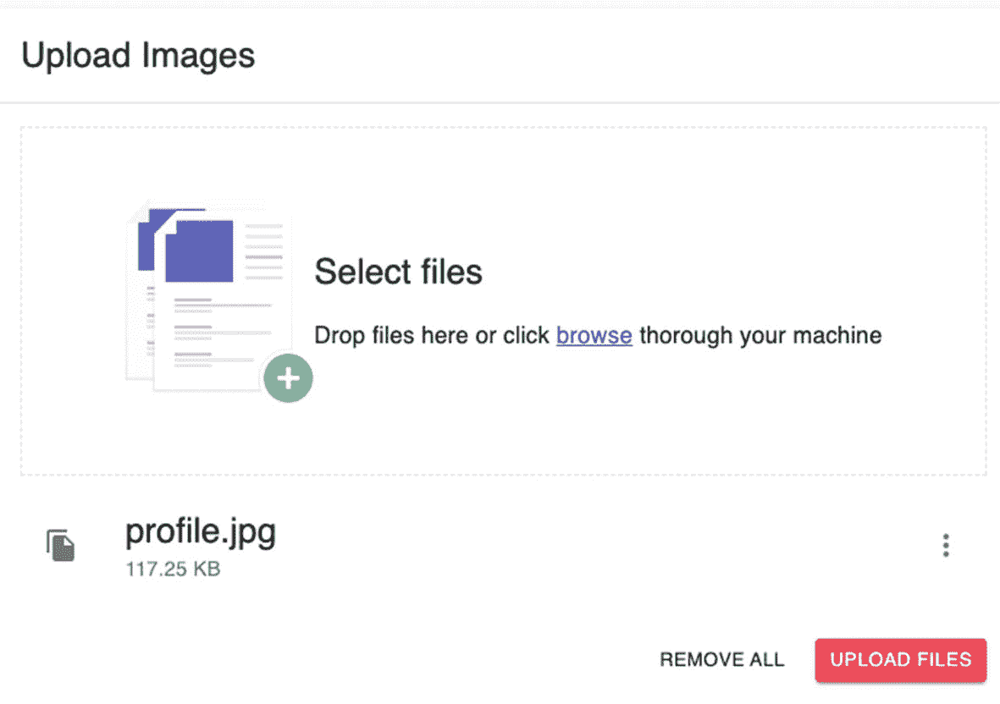
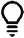
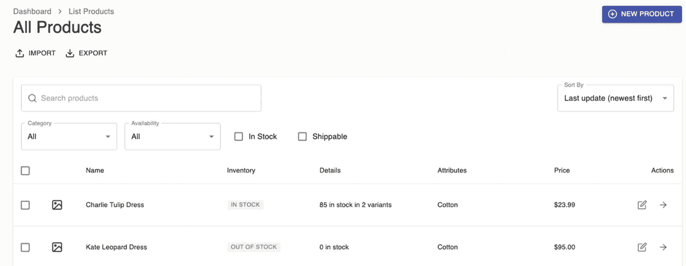

# 八、编写数据表、Formik 表单和 Yup 验证：第二部分

在这个由两部分组成的章节系列的第一部分中，我们开始设置产品菜单，包括使用数据表和其他样式组件的`ProductListView,`。第二部分将继续使用 Formik 和 Yup 输入验证构建产品菜单。

现在我们有了可以在 UI 中呈现列表产品的概念证明，如清单 [8-1](#PC1) 所示，我们现在可以更新`ProductListView.`的`Header`组件

首先，导入以下命名组件。

```jsx
import { Link as RouterLink } from 'react-router-dom';
import clsx from 'clsx';
import NavigateNextIcon from '@material-ui/icons/NavigateNext';
import {
  Box,
  Breadcrumbs,
  Button,
  Grid,
  Link,
  SvgIcon,
  Typography,
  makeStyles,
} from '@material-ui/core';
import {
  PlusCircle as PlusCircleIcon,
  Download as DownloadIcon,
  Upload as UploadIcon,
} from 'react-feather';

Listing 8-1Adding Import Components to Header.tsx of ProductListView

```

接下来，我们将在 Header 组件本身上创建类型定义和其他更改。

我们把所有东西都包装在一个`<Grid/>,`里面，我们还做了三个按钮:**进口**、**出口、**和**新产品。**复制粘贴 ProductListView 的 Header 组件；参见清单 [8-2](#PC2) 。

```jsx
/*types definition */

type Props = {
  className?: string;
};

const Header = ({ className, ...rest }: Props) => {
  const classes = useStyles();

  return (
    <Grid
      container
      spacing={3}
      justify="space-between"
      className={clsx(classes.root, className)}
      {...rest}
    >
      <Grid item>
        <Breadcrumbs
          separator={<NavigateNextIcon fontSize="small" />}
          aria-label="breadcrumb"
        >
          <Link
            variant="body1"
            color="inherit"
            to="/dashboard"
            component={RouterLink}
          >
            Dashboard
          </Link>

          <Box>
            <Typography variant="body1" color="inherit">
              List Products
            </Typography>
          </Box>
        </Breadcrumbs>
        <Typography variant="h4" color="textPrimary">
          All Products
        </Typography>
        <Box mt={2}>
          <Button

            className={classes.action}
            startIcon={
              <SvgIcon fontSize="small">
                <UploadIcon />
              </SvgIcon>
            }
          >
            Import
          </Button>
          <Button
            className={classes.action}
            startIcon={
              <SvgIcon fontSize="small">
                <DownloadIcon />
              </SvgIcon>
            }
          >
            Export
          </Button>
        </Box>
      </Grid>

      <Grid item>

         <Button
          color="primary"
          variant="contained"
          className={classes.action}
          component={RouterLink}
          to="/dashboard/create-product"
          startIcon={
            <SvgIcon fontSize="small">
              <PlusCircleIcon />
            </SvgIcon>
          }
        >

          New Product
        </Button>
      </Grid>
    </Grid>
  );
};

Listing 8-2Updating the Header Component of ProductListView

```

最后，将样式边距添加到`ProductListView.`的标题组件中

```jsx
const useStyles = makeStyles(theme => ({
  root: {},
  action: {
    marginBottom: theme.spacing(1),
    '& + &': {
      marginLeft: theme.spacing(1),
    },
  },
}));

export default Header;

Listing 8-3Adding the Styling Component to the Header Component

```

我们现在已经完成了 ProductListView 让我们开始构建 ProductCreateView。

## 更新 ProductCreateView

ProductCreateView 是我们为应用添加输入表单的地方。

打开 ProductCreateView 的 Header.tsx:

```jsx
ProductCreateView ➤ Header.tsx.

```

我们将从命名的导入组件开始，如清单 [8-4](#PC5) 所示。

```jsx
import { Link as RouterLink } from 'react-router-dom';
import clsx from 'clsx';
import NavigateNextIcon from '@material-ui/icons/NavigateNext';
import {
  Breadcrumbs,
  Button,
  Grid,
  Link,
  Typography,
  makeStyles,
  Box,
} from '@material-ui/core';

Listing 8-4Adding Named Components to the Header.tsx of ProductCreateView

```

还要创建类型定义，这只是一个 string 类型的可空类名:

```jsx
type Props = {
  className?: string;
};

```

然后将下面的更新复制到我们的`ProductCreateView`的 Header 组件中，如清单 [8-5](#PC7) 所示。

```jsx
const Header = ({ className, ...rest }: Props) => {
  const classes = useStyles();

  return (
    <Grid
      className={clsx(classes.root, className)}
      container
      justify="space-between"
      spacing={3}
      {...rest}
    >
      <Grid item>
        <Breadcrumbs
          separator={<NavigateNextIcon fontSize="small" />}
          aria-label="breadcrumb"
        >
          <Link
            variant="body1"
            color="inherit"
            to="/dashboard"
            component={RouterLink}
          >
            Dashboard
          </Link>
          <Box mb={3}>
            <Typography variant="body1" color="inherit">
              Create Product
            </Typography>
          </Box>
        </Breadcrumbs>
        <Typography variant="h4" color="textPrimary">
          Create a new product
        </Typography>
      </Grid>
      <Grid item>
        <Button component={RouterLink} to="/dashboard/list-products">
          Cancel
        </Button>
      </Grid>
    </Grid>
  );
};

Listing 8-5Updating the Header.tsx of ProductCreateView

```

最后，让我们添加`useStyle`组件。

```jsx
const useStyles = makeStyles(() => ({
  root: {},
}));

Listing 8-6Adding the Style Component to the Header.tsx of ProductCreateView

```

我们现在可以在`ProductCreateView`的`index.tsx`中使用这个头组件。

```jsx
import React from 'react';
import { Container, makeStyles } from '@material-ui/core';

import Header from './Header';
import ProductCreateForm from './ProductCreateForm';
import Page from 'app/components/page';

const ProductCreateView = () => {
  const classes = useStyles();

  return (
    <Page className={classes.root} title="Product Create">
      <Container>
        <Header />
        <ProductCreateForm />
      </Container>
    </Page>
  );
};

const useStyles = makeStyles(theme => ({
  root: {
    minHeight: '100%',
    paddingTop: theme.spacing(3),
    paddingBottom: 100,
  },
}));

export default ProductCreateView;

Listing 8-7Updating the index.tsx of ProductCreateView

```

所以目前来说这很好。我们出发去更新`ProductCreateForm`。

## 更新 ProductCreateForm

首先，我们需要添加一些额外的 TypeScript 文件。

在文件夹`ProductCreateView`下，创建一个名为`schema`的文件夹。在`schema,`下，我们将为我们的 Yup 产品验证添加一个新文件。

文件路径是

```jsx
ProductCreateView ➤ schema ➤ yupProductValidation.ts

```

清单 [8-8](#PC11) 显示了 Yup 产品验证模式。

```jsx
// the * means all

import * as Yup from 'yup';

export const yupProductValidation = Yup.object().shape({
  category: Yup.string().max(255),
  description: Yup.string().max(5000),
  images: Yup.array(),
  includesTaxes: Yup.bool().required(),
  isTaxable: Yup.bool().required(),
  name: Yup.string().max(255).required(),
  price: Yup.number().min(0).required(),
  productCode: Yup.string().max(255),
  productSku: Yup.string().max(255),
  salePrice: Yup.number().min(0),
});

Listing 8-8Creating the yupProductValidation Schema

```

之后，我们需要为 Formik 创建产品默认值或初始值。最好在一个单独的文件中定义，这样更干净一点。

在`schema`下创建一个新文件，命名为`productDefaultValue.ts,`，如清单 [8-9](#PC13) 所示。

文件路径是

```jsx
ProductCreateView ➤ schema ➤ productDefaultValue.ts

```

注意，我们从 models 文件夹中导入了`ProductType`组件。

```jsx
import { ProductType } from 'models/product-type';

export const productDefaultValue: ProductType = {
  attributes: [],
  category: '',
  createdAt: '',
  currency: '',
  id: '',
  image: '',
  inventoryType: 'in_stock',
  isAvailable: false,
  isShippable: false,
  name: '',
  quantity: 0,
  updatedAt: '',
  variants: 0,
  description: '',
  images: [],
  includesTaxes: false,
  isTaxable: false,
  productCode: '',
  productSku: '',
  salePrice: '',
  price: 0,
};

Listing 8-9Creating Initial Values in the productDefaultValue.tsx

```

好了，我们完成了`ProductDefaultValue.tsx.`现在让我们安装一个名为 Quill 的富文本编辑器库。

## 安装 React 管

让我们安装名为`react-quill.`的 React 版本。回想一下，Quill 是现代网络的开源 WYSIWYG 编辑器。React-quill 是包装 Quill.js 的 React 组件:

```jsx
npm install react-quill

```

安装完成后，我们需要将组件导入到`src`目录的`index.tsx`中。

```jsx
import 'react-app-polyfill/ie11';
import 'react-app-polyfill/stable';
import 'react-quill/dist/quill.snow.css';
import * as React from 'react';
import * as ReactDOM from 'react-dom';
import { Provider } from 'react-redux';
import * as serviceWorker from 'serviceWorker';
import 'sanitize.css/sanitize.css';

Listing 8-10Adding react-quill to the index.tsx of the src Directory

```

在 components 文件夹下，创建一个单独的新文件，并将其命名为`quill-editor.tsx` `. The file path is as follows:`

```jsx
app ➤ components ➤ quill-editor.tsx

```

打开新创建的文件，导入所有必需的命名组件。

```jsx
import React from 'react';
import clsx from 'clsx';
import ReactQuill from 'react-quill';
import { makeStyles } from '@material-ui/core';

Listing 8-11Importing Named Components to quill-editor.tsx

```

然后，我们需要类型定义和`QuillEditor`组件。

```jsx
type Props = {
  className?: string;
  [key: string]: any;
};

const QuillEditor = ({ className, ...rest }: Props) => {
  const classes = useStyles();

  return <ReactQuill className={clsx(classes.root, className)} {...rest} />;
};

Listing 8-12Adding the QuillEditor Component

```

在清单 [8-12](#PC18) 中，我们还返回了 Quill 并使用了 rest/spread 操作符，这意味着我们将`QuillEditor`拥有的任何东西传递给`ReactQuill`。

接下来，我们将添加来自 Material-UI Core 的`makeStyles`，如清单 [8-13](#PC19) 所示。

```jsx
const useStyles = makeStyles(theme => ({
  root: {
    '& .ql-toolbar': {
      borderLeft: 'none',
      borderTop: 'none',
      borderRight: 'none',
      borderBottom: `1px solid ${theme.palette.divider}`,
      '& .ql-picker-label:hover': {
        color: theme.palette.secondary.main,
      },
      '& .ql-picker-label.ql-active': {
        color: theme.palette.secondary.main,
      },
      '& .ql-picker-item:hover': {
        color: theme.palette.secondary.main,
      },
      '& .ql-picker-item.ql-selected': {
        color: theme.palette.secondary.main,
      },
      '& button:hover': {
        color: theme.palette.secondary.main,
        '& .ql-stroke': {
          stroke: theme.palette.secondary.main,
        },
      },

      '& button:focus': {
        color: theme.palette.secondary.main,
        '& .ql-stroke': {
          stroke: theme.palette.secondary.main,
        },
      },
      '& button.ql-active': {
        '& .ql-stroke': {
          stroke: theme.palette.secondary.main,
        },

      },
      '& .ql-stroke': {
        stroke: theme.palette.text.primary,
      },
      '& .ql-picker': {
        color: theme.palette.text.primary,
      },
      '& .ql-picker-options': {
        padding: theme.spacing(2),
        backgroundColor: theme.palette.background.default,
        border: 'none',
        boxShadow: theme.shadows[10],
        borderRadius: theme.shape.borderRadius,
      },
    },
    '& .ql-container': {
      border: 'none',
      '& .ql-editor': {
        fontFamily: theme.typography.fontFamily,
        fontSize: 16,
        color: theme.palette.text.primary,
        '&.ql-blank::before': {
          color: theme.palette.text.secondary,
        },
      },
    },
  },
}));

export default QuillEditor;

Listing 8-13Adding the Styling Components to the QuillEditor Component

```

这就是羽毛笔编辑器。我们需要创建一个组件，将字节的值转换成人类可读的字符串。

在 utils 文件夹下，创建一个新文件，命名为`bytes-to-size.ts; see`列表 [8-14](#PC20) 。

```jsx
const bytesToSize = (bytes: number, decimals: number = 2) => {
  if (bytes === 0) return '0 Bytes';

  const k = 1024;
  const dm = decimals < 0 ? 0 : decimals;
  const sizes = ['Bytes', 'KB', 'MB', 'GB', 'TB', 'PB', 'EB', 'ZB', 'YB'];
  const i = Math.floor(Math.log(bytes) / Math.log(k));

  return `${parseFloat((bytes / Math.pow(k, i)).toFixed(dm))} ${sizes[i]}`;
};

export default bytesToSize;

Listing 8-14Creating the bytes-to-size.tsx

```

bytes-to-size 组件检查字节值，并将其转换为用户在上传文件时易于理解的字符串(即 KB、MB、GB、TB)。

下一个任务是创建一个名为 images 的文件夹。

在文件夹`public,`下创建子文件夹`images` ➤ `products;`并在`products`文件夹下添加一个。名为`add_file.svg.`的 svg 文件

文件路径如下:

```jsx
public ➤ images ➤ products ➤ add_file.svg

```

你可以在下面我的 GitHub 链接中找到第 [7](07.html) 章相同文件路径下的图片(见图 [8-1](#Fig1) )。下载图像并将其复制或拖动到新创建的。svg 文件。


图 8-1

add_file.svg 的屏幕截图

转到`github.com/webmasterdevlin/practical-enterprise-react/blob/master/chapter-7/publimg/add_file.svg`。

现在，让我们为拖放功能导入另一个库。

## 安装 React Dropzone

```jsx
npm i react-dropzone

```

然后，让我们在文件夹组件中创建另一个文件，并将其命名为`files-dropzone.tsx.`

文件路径如下:

```jsx
app ➤ components ➤ files-dropzone.tsx

```

让我们首先添加命名的导入组件，如清单 [8-15](#PC24) 所示。

```jsx
import React, { useState, useCallback } from 'react';
import clsx from 'clsx';
import { useDropzone } from 'react-dropzone';
import PerfectScrollbar from 'react-perfect-scrollbar';
import FileCopyIcon from '@material-ui/icons/FileCopy';
import MoreIcon from '@material-ui/icons/MoreVert';
import {
  Box,
  Button,
  IconButton,

  Link,
  List,
  ListItem,
  ListItemIcon,
  ListItemText,
  Tooltip,
  Typography,
  makeStyles,
} from '@material-ui/core';

import bytesToSize from 'utils/bytes-to-size';

Listing 8-15Adding the Named Import Components to FilesDropzone

```

清单 [8-15](#PC24) 从`React Dropzone`导入了`useDropzone`，从`React Perfect Scrollbar`库中导入了`PerfectScrollbar`。

我们还包括了来自材质 UI 图标的附加图标。最后，我们导入了`bytesToSize`文件。

接下来，让我们定义组件的类型并创建一些本地状态。

```jsx
type Props = {
  className?: string;
};

const FilesDropzone = ({ className, ...rest }: Props) => {
  const classes = useStyles();
  const [files, setFiles] = useState<any[]>([]);

  //this will be triggered when we drop a file in our component

  const handleDrop = useCallback(acceptedFiles => {
    setFiles(prevFiles => [...prevFiles].concat(acceptedFiles));
  }, []);

  const handleRemoveAll = () => {
    setFiles([]);
  };

  //useDropzone - we're deconstructing it to get the properties of the object it returns
 //we're assigning handleDrop on onDrop

  const { getRootProps, getInputProps, isDragActive } = useDropzone({
    onDrop: handleDrop,
  });

  return (
    <div className={clsx(classes.root, className)} {...rest}>
      <div

        className={clsx({
          [classes.dropZone]: true,
          [classes.dragActive]: isDragActive,
        })}
        {...getRootProps()}
      >
        <input {...getInputProps()} />
        <div>
           here we added the svg file
          />
        </div>
        <div>
          <Typography gutterBottom variant="h5">
            Select files
          </Typography>
          <Box mt={2}>
            <Typography color="textPrimary" variant="body1">
              Drop files here or click <Link underline="always">browse</Link>{' '}
              thorough your machine
            </Typography>
          </Box>
        </div>
      </div>

      {files.length > 0 && (

          <PerfectScrollbar options={{ suppressScrollX: true }}>
            <List className={classes.list}>
              {files.map((file, i) => (
                <ListItem divider={i < files.length - 1} key={i}>
                  <ListItemIcon>
                    <FileCopyIcon />
                  </ListItemIcon>
                  <ListItemText
                    primary={file.name}
                    primaryTypographyProps={{ variant: 'h5' }}
                    secondary={bytesToSize(file.size)}
                  />

                  <Tooltip title="More options">
                    <IconButton edge="end">
                      <MoreIcon />
                    </IconButton>
                  </Tooltip>
                </ListItem>
              ))}
            </List>
          </PerfectScrollbar>
          <div className={classes.actions}>
            <Button onClick={handleRemoveAll} size="small">
              Remove all
            </Button>
            <Button color="secondary" size="small" variant="contained">
              Upload files
            </Button>
          </div>

      )}
    </div>
  );
};

Listing 8-16Creating the FilesDropzone Component

```

接下来，我们为`FilesDropzone`添加样式组件，如清单 [8-17](#PC26) 所示。

```jsx
const useStyles = makeStyles(theme => ({
  root: {},
  dropZone: {
    border: `1px dashed ${theme.palette.divider}`,
    padding: theme.spacing(6),
    outline: 'none',
    display: 'flex',
    justifyContent: 'center',
    flexWrap: 'wrap',
    alignItems: 'center',
    '&:hover': {
      backgroundColor: theme.palette.action.hover,
      opacity: 0.5,
      cursor: 'pointer',
    },
  },
  dragActive: {
    backgroundColor: theme.palette.action.active,
    opacity: 0.5,
  },
  image: {
    width: 130,
  },
  info: {
    marginTop: theme.spacing(1),
  },
  list: {
    maxHeight: 320,
  },
  actions: {
    marginTop: theme.spacing(2),
    display: 'flex',
    justifyContent: 'flex-end',
    '& > * + *': {
      marginLeft: theme.spacing(2),
    },
  },

}));

export default FilesDropzone;

Listing 8-17Adding the Styling Components for the FilesDropzone

```

重新运行浏览器，导航到“创建产品”菜单，向下滚动以上传图像。您应该会看到与图 [8-2](#Fig2) 所示相同的内容。



图 8-2

上传图片的应用用户界面

接下来，我们将导入一个通知库来显示通知消息。

## 安装通知库

`Notistack`是一个 React 通知库，可以很容易地显示通知。它还允许用户将`snackbars`和`toasts`堆叠在一起:

```jsx
npm i notistack

```

我们需要在 app 文件夹或根组件的`index.tsx`中有一个`notistack`提供者。

添加 snackbar 提供程序并导入命名组件，如清单 [8-18](#PC28) 所示。

```jsx
import * as React from 'react';
import { Helmet } from 'react-helmet-async';
import { BrowserRouter } from 'react-router-dom';
import { SnackbarProvider } from 'notistack';
import { GlobalStyle } from 'styles/global-styles';
import MainLayout from './layouts/main-layout';
import { Routes } from './routes';

export function App() {
  return (
    <BrowserRouter>
      <SnackbarProvider dense maxSnack={3}>
        <Helmet
          titleTemplate="%s - React Boilerplate"
          defaultTitle="React Boilerplate"
        >
          <meta name="description" content="A React Boilerplate application" />
        </Helmet>
        <MainLayout>
          <Routes />
        </MainLayout>
        <GlobalStyle />
      </SnackbarProvider>
    </BrowserRouter>
  );
}

Listing 8-18Wrapping the App Component with SnackbarProvider

```

完成之后，让我们构建 ProductCreateForm。

## 更新产品创建表单

让我们通过添加命名的导入组件来开始更新 ProductCreateForm，如清单 [8-19](#PC29) 所示。

```jsx
import React, { useState } from 'react';
import { useHistory } from 'react-router-dom';
import clsx from 'clsx';
import { Formik } from 'formik';
import { useSnackbar } from 'notistack';
import {
  Box,
  Button,
  Card,
  CardContent,
  CardHeader,
  Checkbox,
  Divider,
  FormControlLabel,
  FormHelperText,
  Grid,
  Paper,
  TextField,
  Typography,
  makeStyles,
} from '@material-ui/core';

import FilesDropzone from 'app/components/files-dropzone';
import QuillEditor from 'app/components/quill-editor';
import { postProductAxios } from 'services/productService';
import { yupProductValidation } from'./schema/yupProductValidation';
import { productDefaultValue } from './schema/productDefaultValue';

Listing 8-19Adding the Named Import Components to ProductCreateForm

```

你会注意到我们已经从`react-router-dom`添加了`useHistory`。我们将需要`useHistory`来允许用户在创建新产品后浏览产品列表。我们需要`Formik`和`notistack.`的`snackbar`

除此之外，我们还导入了`FilesDropzone`和`QuillEditor`以及服务`{postProductAxios},`，这允许我们在数据库中创建或添加新产品。

我们将使用由我们的产品对象的初始值组成的`productDefaultValue`和`yupProductValidation`来验证创建新产品的需求。

接下来，让我们创建类型定义和一些本地状态；参见清单 [8-20](#PC30) 。

```jsx
const categories = [
  {
    id: 'shirts',
    name: 'Shirts',
  },
  {
    id: 'phones',
    name: 'Phones',
  },
  {
    id: 'cars',
    name: 'Cars',
  },
];

type Props = {
  className?: string;
};

const ProductCreateForm = ({ className, ...rest }: Props) => {
  const classes = useStyles();
  const history = useHistory();

  //we've deconstructed the snackbar to get just the enqueueSnackbar

  const { enqueueSnackbar } = useSnackbar();
  const [error, setError] = useState('');

Listing 8-20Creating the Type Alias and Local States of ProductCreateForm

```

接下来，让我们使用`Formik`属性，即`initialValues, validationSchema,`和`onSubmit`事件处理程序，如清单 [8-21](#PC31) 所示。

```jsx
return (

    /*the required attributes or properties of Formik need to be initialized.
      initialValues, validationSchema, onSubmit.
    */
    <Formik
      initialValues={productDefaultValue}
      validationSchema={yupProductValidation}

      /*   The onSubmit, you can just initially write a function without anything inside.
Usually, I'd write an alert message first to trigger it as a proof of concept. */

      onSubmit={async (values, formikHelpers) => {
        try {
          await postProductAxios(values);

          formikHelpers.setStatus({ success: true });
          formikHelpers.setSubmitting(false);
          enqueueSnackbar('Product Created', {
            variant: 'success',
          });
          history.push('/dashboard/list-products');
        } catch (err) {
          alert('Something happened. Please try again.');
          setError(err.message);
          formikHelpers.setStatus({ success: false });
          formikHelpers.setSubmitting(false);
        }
      }}
    >

      {formikProps => (
        <form
          onSubmit={formikProps.handleSubmit}
          className={clsx(classes.root, className)}
          {...rest}
        >
          <Grid container spacing={3}>
            <Grid item xs={12} lg={8}>
              <Card>
                <CardContent>
                  <TextField
                    error={Boolean(
                      formikProps.touched.name && formikProps.errors.name,
                    )}
                    fullWidth
                    helperText={
                      formikProps.touched.name && formikProps.errors.name
                    }
                    label="Product Name"
                    name="name"
                    onBlur={formikProps.handleBlur}
                    onChange={formikProps.handleChange}
                    value={formikProps.values.name}
                    variant="outlined"
                  />
                  <Box mt={3} mb={1}>
                    <Typography variant="subtitle2" color="textSecondary">
                      Description
                    </Typography>
                  </Box>
                  <Paper variant="outlined">
                    <QuillEditor
                      className={classes.editor}
                      value={formikProps.values.description}
                      onChange={(value: string) =>
                        formikProps.setFieldValue('description', value)
                      }
                    />
                  </Paper>

                  {formikProps.touched.description &&
                    formikProps.errors.description && (
                      <Box mt={2}>
                        <FormHelperText error>
                          {formikProps.errors.description}
                        </FormHelperText>
                      </Box>
                    )}
                </CardContent>
              </Card>
              <Box mt={3}>
                <Card>
                  <CardHeader title="Upload Images" />
                  <Divider />
                  <CardContent>
                    <FilesDropzone />
                  </CardContent>
                </Card>
              </Box>
              <Box mt={3}>
                <Card>
                  <CardHeader title="Prices" />
                  <Divider />

                  <CardContent>
                    <Grid container spacing={3}>
                      <Grid item xs={12} md={6}>
                        <TextField
                          error={Boolean(
                            formikProps.touched.price &&
                              formikProps.errors.price,
                          )}
                          fullWidth
                          helperText={
                            formikProps.touched.price &&
                            formikProps.errors.price
                              ? formikProps.errors.price
                              : 'If you have a sale price this will be shown as old price'
                          }
                          label="Price"
                          name="price"
                          type="number"
                          onBlur={formikProps.handleBlur}
                          onChange={formikProps.handleChange}
                          value={formikProps.values.price}
                          variant="outlined"
                        />
                      </Grid>

                      <Grid item xs={12} md={6}>
                        <TextField
                          error={Boolean(
                            formikProps.touched.salePrice &&
                              formikProps.errors.salePrice,
                          )}
                          fullWidth
                          helperText={
                            formikProps.touched.salePrice &&
                            formikProps.errors.salePrice
                          }
                          label="Sale price"
                          name="salePrice"
                          type="number"
                          onBlur={formikProps.handleBlur}
                          onChange={formikProps.handleChange}
                          value={formikProps.values.salePrice}
                          variant="outlined"
                        />
                      </Grid>
                    </Grid>
                    <Box mt={2}>
                      <FormControlLabel
                        control={
                          <Checkbox
                            checked={formikProps.values.isTaxable}
                            onChange={formikProps.handleChange}
                            value={formikProps.values.isTaxable}
                            name="isTaxable"
                          />
                        }
                        label="Product is taxable"
                      />
                    </Box>

                    <Box mt={2}>
                      <FormControlLabel
                        control={
                          <Checkbox
                            checked={formikProps.values.includesTaxes}
                            onChange={formikProps.handleChange}
                            value={formikProps.values.includesTaxes}
                            name="includesTaxes"
                          />
                        }
                        label="Price includes taxes"
                      />
                    </Box>
                  </CardContent>
                </Card>
              </Box>
            </Grid>
            <Grid item xs={12} lg={4}>
              <Card>
                <CardHeader title="Organize" />
                <Divider />
                <CardContent>
                  <TextField
                    fullWidth
                    label="Category"
                    name="category"
                    onChange={formikProps.handleChange}
                    select
                    SelectProps={{ native: true }}
                    value={formikProps.values.category}
                    variant="outlined"
                  >
                    {categories.map(category => (
                      <option key={category.id} value={category.id}>
                        {category.name}
                      </option>
                    ))}
                  </TextField>

                  <Box mt={2}>
                    <TextField
                      error={Boolean(
                        formikProps.touched.productCode &&
                          formikProps.errors.productCode,
                      )}
                      fullWidth
                      helperText={
                        formikProps.touched.productCode &&.
                        formikProps.errors.productCode
                      }
                      label="Product Code"
                      name="productCode"
                      onBlur={formikProps.handleBlur}
                      onChange={formikProps.handleChange}
                      value={formikProps.values.productCode}
                      variant="outlined"
                    />
                  </Box>
                  <Box mt={2}>
                    <TextField
                      error={Boolean(
                        formikProps.touched.productSku &&
                          formikProps.errors.productSku,
                      )}
                      fullWidth
                      helperText={
                        formikProps.touched.productSku &&
                        formikProps.errors.productSku
                      }
                      label="Product Sku"
                      name="productSku"
                      onBlur={formikProps.handleBlur}
                      onChange={formikProps.handleChange}
                      value={formikProps.values.productSku}
                      variant="outlined"
                    />
                  </Box>
                </CardContent>
              </Card>
            </Grid>
          </Grid>

          {error && (
            <Box mt={3}>
              <FormHelperText error>{error}</FormHelperText>
            </Box>
          )}
          <Box mt={2}>
            <Button
              color="primary"
              variant="contained"
              type="submit"
              disabled={formikProps.isSubmitting}
            >
              Create product
            </Button>
          </Box>
        </form>
      )}
    </Formik>
  );
};

Listing 8-21Adding the Return Component of the ProductCreateForm

```

好的，那么清单 [8-21](#PC31) 中发生了什么？我们已经把一切都包在`Formik.`下了

因为我们这样做了`,`,所以我们需要使用它的默认属性，即:

`initialValues`:我们正在通过`productDefaultValues.`

`validationSchema`:我们正在通过`yupProductValidation.`

一开始，我只是写一个函数，里面什么都没有。我只是设置了一个警报来触发它，并检查它是否正在发射。

`Formik`:这个组件发出`formikProps`(您可以随意命名它，但是我更喜欢这样命名，这样它的来源就一目了然了)。

在`formikProps,`中，我们找到了 HTML 表单的`Form`和`onSubmit`，这将触发`Formik.`的`onSubmit`

这里，我们绑定了对象的名字。`TextField`来自于 Material-UI 核心。

先简单解释一下`TextField`里面的必备零件。如果您再次查看它，您会看到以下属性:

```jsx
formikProps.touched.name && formikProps.errors.name,

label="Product Name"
name="name"
onBlur={formikProps.handleBlur}
onChange={formikProps.handleChange}
value={formikProps.values.name}

```

`formikProps.touched.name`:此时点击`TextField of name.`

当出现错误时，例如，您超出了允许的字符数或将其留空。

`formikProps.handleBlur`:当你离开`TextField`时触发，例如，点击后，你离开它去另一个字段。

`formikProps.handleChange`:每当你在键盘上敲击或输入什么的时候，这个就会更新**名字**的值。这将覆盖`formikProps.values.name` `.`中现有的**值**。**值**将是我们将在现场看到的数据。

这看起来很复杂，但实际上，如果我们自己去做，事情会更复杂。Formik 在其网站 [`formik.org`](http://formik.org) 上的行动号召是“在无泪的 React 中构建形式”，这是有原因的

如果你已经体验过编写带有验证和绑定的表单——在这种情况下你会看到输入的变化——那么你就会知道从头开始是一件相当痛苦且不好玩的事情。这是因为我们本质上需要做的是创建一个双向绑定。

然而，React 的主要问题是它是用单向数据流设计的。React 不同于 Svelte、Vue.js 和 Angular 等其他框架，在这些框架中，双向数据绑定很容易实现。

简单地说，在双向数据绑定中，当您将模型绑定到视图时，您会知道当您更改视图中的某些内容时，它会反映在模型中。所以基本上，在模型和视图之间有一个双向的数据流。

一个合理的用例是当用户更新或编辑他们的个人资料时，我们知道已经有来自 web 服务的数据输入。

*当用户在轮廓输入表单中输入时，对象模型的值也被编辑。在 React 中，不编写大量代码很难做到这一点。*

这就是为什么有 React 库可以用来创建表单，比如 React Forms、Formsy 和 Redux Form，但最流行的是 Formik，因为它非常容易使用和理解。

我强烈建议您使用 Formik 或任何这些表单库。尽可能不要实现或者从头开始写。

独自做这件事的另一个缺点是很难长期维护它，包括当你不得不把项目交给新的开发人员时。

大多数时候，最好使用流行的库，因为开发者可能已经知道如何使用或熟悉这些库，或者很容易从文档中理解或从在线社区团体获得帮助。

好了，独白到此为止。让我们回到`TextField`中的`onChange`，因为我想指出这里正在发生的另一件事。

您会注意到，我们只是将`formikProps.handleChange`放在`onChange`上，更改就会被触发。这是因为`formikProps.handleChange`签名与`onChange`期望的功能相匹配。

在这种情况下，这里的`onChange`发出一个事件。把你的鼠标悬停在它上面，你就会看到它。

但是寻找`QuillEditor.`下面的`onChange`，它发出一个字符串。所以它是不同的，这就是为什么`handleChange`在这里不工作:

```jsx
            <QuillEditor
                      className={classes.editor}
                      value={formikProps.values.description}
                      onChange={(value: string) =>
                   formikProps.setFieldValue('description', value)
                      }
                    />

```

现在的问题是，我们怎么知道它不会起作用？当我们尝试它时，我们会知道，期待它工作，并得到一个错误。 ***是啊，我知道。但那是我的经验，意思是*** `handleChange,` ***在这种情况下不起作用。***

但是如果你遇到这种问题，你正在使用的 onChange 可能会发出不同的类型。你需要做的是使用**formik props . setfield value .**这里我们需要传递两个参数:

string:哪一个是您的属性的名称

原始类型:描述的**值**

你可以登记你的`models` ➤ `product-type.ts.`

每当你遇到`onChange,`时，首先做一个控制台日志，看看它发出的是什么类型或对象，尤其是使用 JavaScript 时。对于 TypeScript，您可以将鼠标悬停在上面查看。

在`TextField`中需要注意的另一件事是，我们编写它的方式有一个模式，我们可以从`TextField`中创建一个抽象，并把它放在一个单独的文件中，以整理我们的`ProductCreateForm.`

运行或刷新您的应用。创建或添加新产品，并检查它是否显示在所有产品页面上。



### 为了你的活动

1.  创建一个删除一个或多个产品的新函数。

2.  使用在`selectedProducts`中存储一个或多个产品 id 的`handleSelectOneProduct`功能。

3.  通过创建一个接受 string 类型 id 的`deleteProductAxios`来更新`postService.ts`。

4.  这个新函数应该使用一个`array.map`进行循环，同时向`json-server.`发送一个删除请求，确保不仅在服务器中删除它，而且在 UI 中也删除它。

## 摘要

这一章我们已经学完了，我们在这里涉及了很多内容，特别是学习如何在 React 中使用 Formik 构建输入表单，以及表单上的 Yup 验证。最后，我们谈到了如何在 Material-UI 组件和其他库(如 Quill editor)的帮助下以智能的方式创建复杂的数据表。

在下一章，我们将学习一项重要的技能:状态管理，或者说如何使用 Redux 工具包 管理我们的状态。