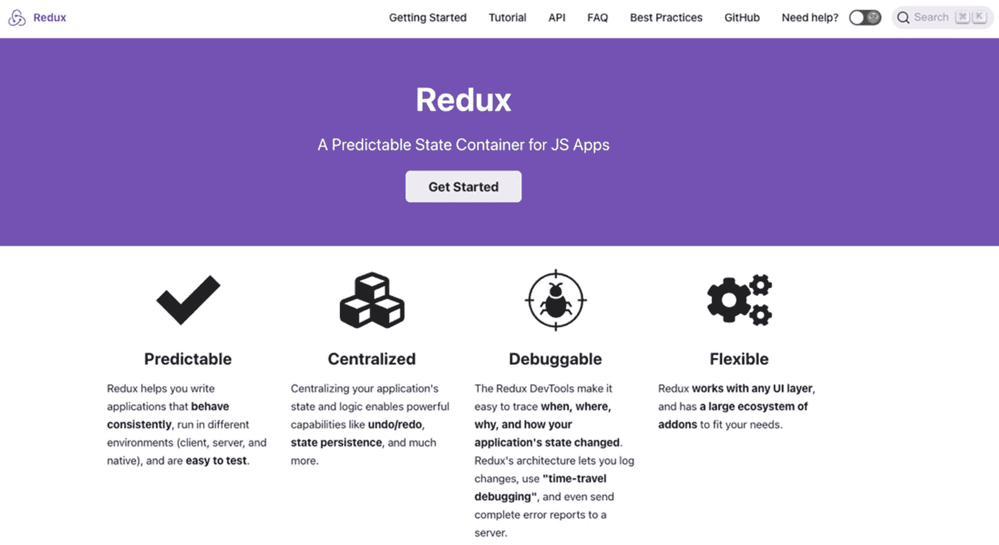
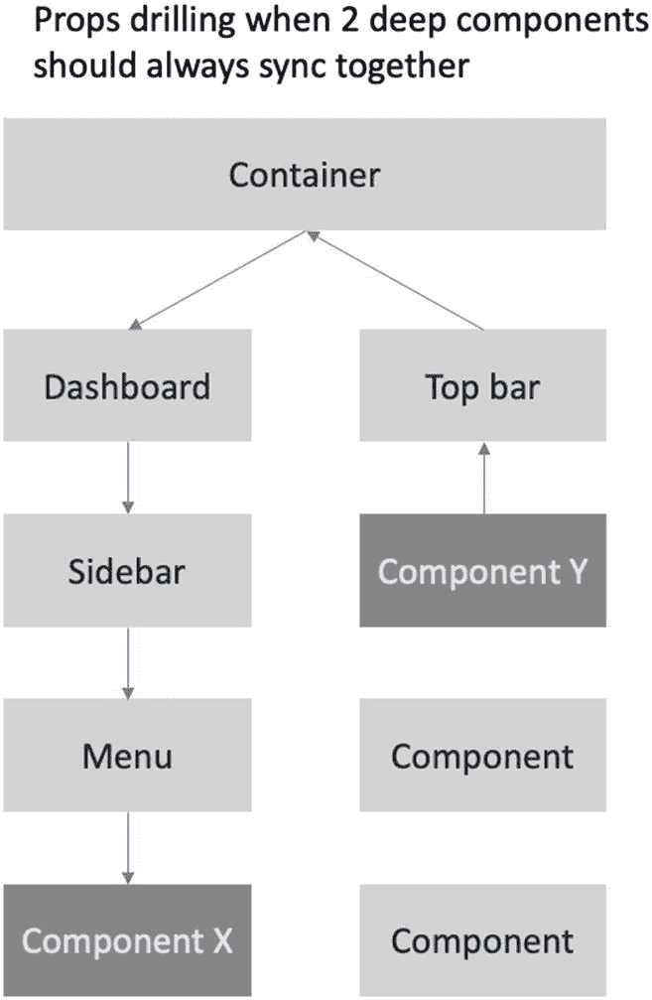
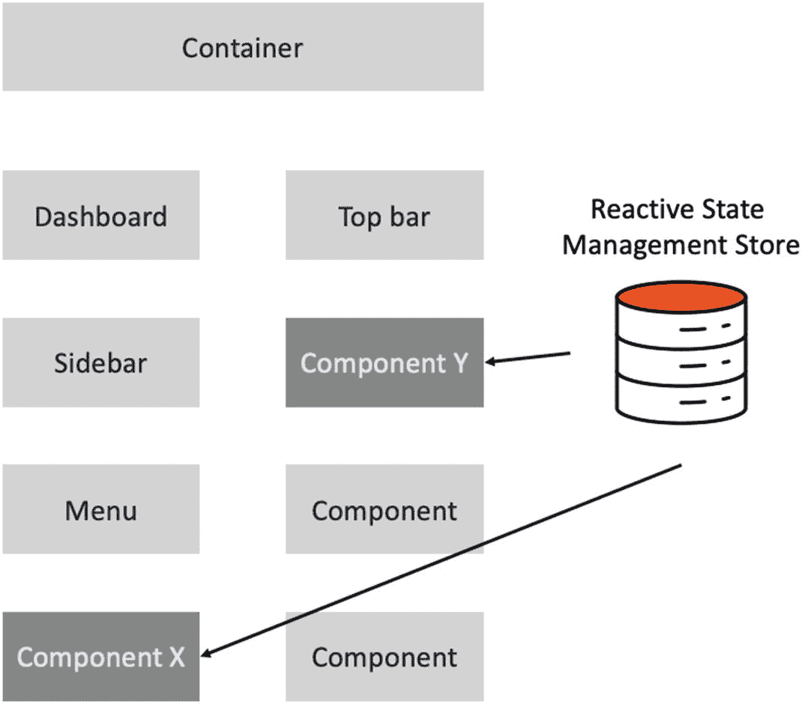
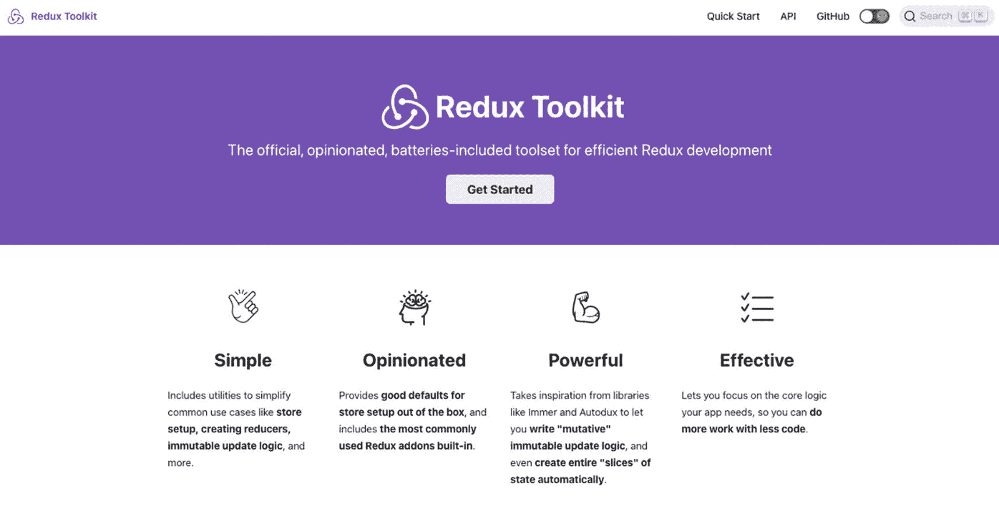
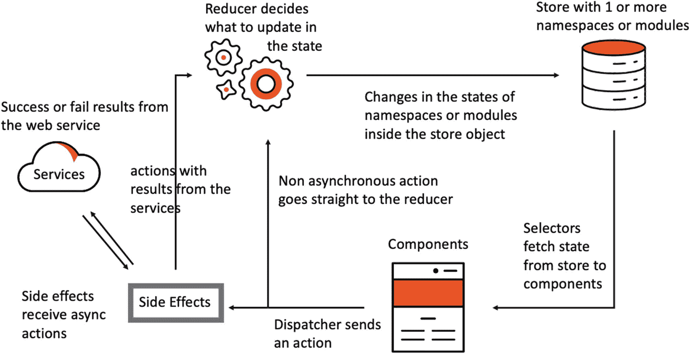
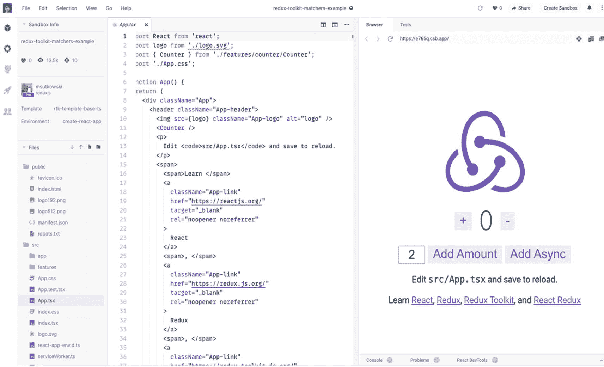
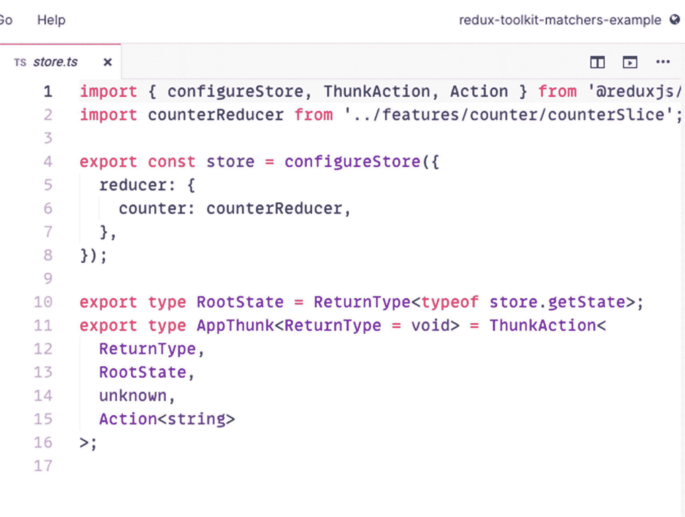

# 九、通过 Redux 工具包使用 Redux 管理状态

在前一章中，我们构建了一个产品仪表板，并使用 Formik 作为输入表单，使用 Yup 库来验证用户的输入。创建和验证表单是任何前端开发人员都必须具备的基本和常见技能，但是现在，我们将继续学习更复杂的开发人员技能，即使用 Redux with Redux 工具包 管理应用的全局状态。

React 和 Redux 是状态管理的绝佳组合，尤其是在构建企业级应用时。但是配置 Redux 的复杂过程成了很多开发者的绊脚石。许多开发人员讨厌在 React 应用中设置 Redux 的复杂性。

于是，Redux 工具包 就诞生了。

正如其网站 redux-toolkit.js.org 所定义的，Redux 工具包 是“用于高效 Redux 开发的官方的、固执己见的、包含电池的工具集”以前称为 Redux Starter Kit，Redux 工具包 附带了有用的库，使 React 开发人员的生活更加轻松。

简而言之，Redux 工具包 现在是推荐使用 Redux 的方式。

在我们继续学习如何使用 Redux 工具包 所需的基本概念之前，我们先来谈谈 Redux。我们还将看看快速使用 Redux 工具包 所需的一些重要的 Redux 术语。最后，我们将通过使用 CodeSandbox 的快速 Redux 实现来完成本章。

## Redux 概述

根据其官方网站，Redux 是“JavaScript 应用的可预测状态容器。”它主要用于管理单个不可变状态树(对象)中整个应用的状态。状态的任何变化都会创建一个新对象(使用操作和减速器)。我们将在本章后面详细讨论核心概念。

在 [`https://redux.js.org/`](https://redux.js.org/) 的 Redux 网站如图 [9-1](#Fig1) 所示。



图 9-1

Redux 网站位于 [https:// redux. js. org/](https://redux.js.org/)

如果我们正在构建一个大的 React 项目，我们通常会使用 Redux。对于较小的应用，我不认为你需要 Redux。现在让我们讨论一下为什么我们要在应用中使用 Redux。

### 为什么要用 Redux？

首先，我们的应用将有一个单独的状态存储。想象一下，商店拥有我们的组件需要到达的所有数据或状态。这非常方便，特别是对于大型应用，因为我们可以将大部分——不一定是全部——数据保存在一个位置，而不必担心必须将 props 发送到组件树的多个层次。

将数据从 React 组件树中的一个组件传递到另一个组件的过程通常有多层深，这种过程称为适当的钻取。是的，对于许多开发人员来说，这可能是一个相当头疼的问题。

这是一个常见的问题，您需要将数据从一个 React 组件传递到另一个组件，但是您必须通过许多其他不需要数据的组件才能到达您想要的目的地或组件。

是的，有大量的数据传递给各种组件，这些组件并不真正需要呈现数据，而只是将数据传递给下一个组件，直到数据到达需要它的组件。

假设您有这个 web 应用，并且有一个大的`<div>`或组件。

这个组件是许多组件的父组件，这些组件是子组件。这在图 [9-2](#Fig2) 中进行了说明，其中我们将容器作为父组件，并将两个组件(仪表板和顶栏)作为下一级组件。



图 9-2

React 中的适当钻孔

在仪表板下，我们有以下组件:

```jsx
Sidebar ➤ Menu ➤ Component X.

```

在顶栏下，我们按级别深度顺序排列了以下组件:

```jsx
Component Y ➤ Component ➤ Component

```

同步仪表板和顶栏组件可以很快完成——您只需要传递或发出一个事件，例如，从仪表板到容器，然后从容器到顶栏，反之亦然。

图 [9-2](#Fig2) 是 React 中支柱钻孔的图示。

公平地说，如果我们只是向下传递两层甚至三层数据，适当的钻探并不是那么糟糕。追踪数据流是容易做到的。但是，如果我们已经钻得太频繁，达到十层或更多层，问题就可能出现。

***案例场景*** *:*

如果您有一个四层深度的组件，并且您需要将数据共享或传递给另一个三层或四层深度的元素，该怎么办？

***要解决的问题*** *:* 你需要向组件 X 和组件 y 渲染或传递相同类型的数据，换句话说，生成的数据应该总是相同或同步的。如果组件 X 中有变化，它们也应该反映在组件 y 中。

这有点复杂，因为组件 X 和 Y 与它们的父组件(容器)是不同级别的。此外，随着应用的增长，还有一个可维护性的问题，因为最终，跟踪我们的应用发生的事情会变得更加困难。

在我们的应用中有一个解决这类问题或需求的方法。通常，这是状态管理的工作。

状态管理库通常允许组件访问存储。存储是状态的内存存储，任何组件都可以全局访问它。

存储还允许数据对其他组件进行 React。假设这个州有任何变化。在这种情况下，任何使用 ***即*** 状态的组件都会重新呈现 DOM 差异，或者无论组件的级别有多深，状态发生了什么变化都会反映在 UI 中，如图 [9-3](#Fig3) 所示，一个 React 式状态管理库。



图 9-3

React 状态管理存储

每个组件 ***都可以*** 直接访问商店；无需担心向上传递或返回到父组件并再次向下钻取以将数据或状态分配给另一个更深层次的组件。

可以将存储看作是内存中的本地存储，您可以使用它来访问状态。

状态管理本质上是一个大型 JavaScript 对象存储，是大型企业和现代 JavaScript 应用(如 Angular、Vue.js、React 和其他 JavaScript 框架)的流行解决方案，用于快速呈现不同组件中的状态。

为了更好地理解 Redux 中的状态管理，让我们看看 Redux 中使用的术语。

**Redux**的核心部件:

*调度*:触发动作的调度。对于接收方来说，接收一个动作，不能只是用一个普通的函数，然后把动作发送给 reducer。

您需要一个 dispatcher 函数将动作发送给 reducer。想象一下，调度员是你友好的 UPS 或 FedEx 快递员，负责给你送包裹。另一种思考调度员的方式是枪，而行动是子弹。枪需要击发，子弹才能释放到它的目标，也就是减速器。

*Reducers* : Reducers 的工作是修改店铺，也是唯一可以修改店铺的人。React-Redux 应用中可以有任意多的 reducers 来更新商店的状态。

*存储*:同步不同组件中所有状态的应用的全局状态。它是 React 式的；这就是为什么它可以同步各种组件中的所有状态。

*选择器*:选择器取一段状态呈现在 UI 中。本质上，选择器是从存储中获取状态的一部分或从存储中访问状态的函数。您不能只将整个商店导入组件中；您需要使用选择器从存储中获取状态。

现在我们已经对 Redux 有了一个大概的了解，也知道了为什么要在我们的应用中使用它，让我们从 Redux 工具包 (RTK)开始。

## Redux 工具包

Redux 工具包 是一种自以为是的编写 Redux 的方式，因为社区意识到开发人员都有自己的 React-Redux 应用实现。

在创建 Redux 工具包(简称 RTK)之前，没有在 React 应用中实现或配置 Redux 的标准指南。它已经预装了有用的库，如 Redux、Immer、Redux Thunk 和 Reselect。

以下是每个库的简短描述:

*Immer* :处理店内不变性。

*Redux* :用于状态管理。

Redux Thunk :处理异步动作的中间件。RTK 提供默认选项，但如果您愿意，也可以使用 Redux-Saga。

*重新选择*:简化减速器功能。让我们能从全球商店中分得一杯羹。

图 [9-4](#Fig4) 如果想详细了解 RTK 的更多信息，是 Redux 工具包 的网站。



图 9-4

Redux 工具包网站

*动作类型*:避免我们的动作名称出现打字错误。

*动作*:携带修改店铺的说明。一个动作给 reducer 带来了关于如何处理存储内部状态的指令。

两种类型的操作:

*   *非异步动作、同步动作或没有副作用的动作*:一个很好的例子是，如果你想在商店中保存一组使用复选框选择的项目。此操作不需要 HTTP 请求，因为您要保存在存储中的数据来自复选框的详细信息。

*   *异步动作或者有副作用的动作*:这种动作通常需要一个 axios 函数来发送 HTTP 请求，例如，将 web 服务的响应保存在存储中，然后在 UI 中呈现。

*   *副作用*:是响应一个 Redux 动作可能发生也可能不发生的过程。把它想象成一个行动，在你的行动得到回应之前，你不太确定接下来会发生什么。

例如，当你向 web 服务器发送一个请求时，你还不知道你将得到一个 200 OK 还是一个 404 还是一个错误 500。这种“走出去”并等待行动回应的过程被称为副作用，因为它本质上是我们无法“控制”或直到我们得到它才知道的东西。

为了更好或更全面地了解 Redux 状态管理是如何工作的，让我们看一下图[9-5](#Fig5)——React 应用中 Redux 状态管理的流程。

## 冗余状态管理流程



图 9-5

React 应用内部的 Redux 状态管理流程

我们有从商店获取数据的组件。商店在初始设置时有一些默认属性，每个值都必须初始化，以免得到未定义的返回。

*选择器*:您会注意到选择器正在从存储中获取或选择一个状态。它是否是一个空的初始值并不重要，因为一旦存储加载了数据或状态，我们的组件就会被重新呈现，我们会在 UI 中看到新的值。

*Dispatcher——异步和同步动作*:组件可以通过 Dispatcher 发送一个动作。动作可以是异步的，也可以是同步的。

*同步*:有时也叫 ***非异步或非异步*** ，意为同时发生。

*异步*:不同时发生。简单来说，两者的主要区别在于*和**的等待时间。*** 在同步(非异步)代码过程中，有一个分步操作。

同时，异步代码通常是我们自己不处理的操作，比如发出 API 请求。我们提出一个请求；我们等待回应。但是在等待回复的同时，我们可以做另一个代码。当我们最终得到 API 响应时，就是我们处理它的时候。

*减速器*:同步或“非异步”动作将直接作用于减速器。缩减器然后将基于它们的动作修改或改变存储。

改变或修改可以意味着存储对象内的名字空间或模块的状态的改变。

***那么什么是名称空间或者模块呢？*** 这些是彼此逻辑分离或状态分组。例如，您有一个配置文件的状态、一个付款状态、另一组对象的状态等。当我们开始实现 Redux 时，我们将在应用本身中讨论这一点。

*异步*:那么调度器发送一个异步动作呢？然后这个异步动作直接进入**副作用**。副作用会向服务发送请求。

副作用从 web 服务获得成功(例如，200 OK)或失败响应(例如，4xx 或 5xx)。无论我们从服务中得到什么样的 React 或行动，副作用都会把它发送给减少者。缩减者将再次决定如何处理他们收到的动作。

另一件要注意的事情是，副作用的动作可以根据服务的响应而改变。在操作中，我们需要使用 try-catch 块。例如，在 try 中，如果是 200，就这样做，如果是 400，就这样做，等等。

### 在 CodeSandbox 中使用 RTK

如果你想在应用中实现 RTK 之前先体验一下，请访问这个神奇的网站 [`https://codesandbox.io/s/redux-toolkit-matchers-example-e765q`](https://codesandbox.io/s/redux-toolkit-matchers-example-e765q) 来看看 Redux 的快速实现。

图 [9-6](#Fig6) 是 CodeSandbox 网站上 Redux 工具包 Matchers 示例的截图。



图 9-6

codesandbox.io/redux-toolkit-matchers-example-e765q 截图

在侧边栏菜单中，注意两个文件夹:应用和功能。这些是 Redux 实现，根据 Redux 工具包 的创建者，这就是我们应该如何构建 React-Redux 应用。

例如，创建放置名称空间的文件夹功能，并在 app 文件夹中设置您的商店。商店和减压器不同，但是在商店里你可以找到所有的减压器。



图 9-7

codesandbox.io 上的存储和 reducers 的屏幕截图

每个名称空间或模块都有它的缩减器。在流程的末端，也就是商店，是你组合所有减压器的地方。

在下一章，我们将使用 Redux DevTools。您将看到 React 以及 Angular 开发人员喜欢 Redux 的一些原因:

*   时间旅行调试工具

*   状态是可预测的，所以很容易测试

*   集中式状态和逻辑

*   灵活的用户界面适应性

顺便说一下，Angular 中还有一个 Redux 实现，叫做 NgRx。是 Redux 加 RxJS。还有一些其他的 Angular 应用的状态管理库，但我相信 NgRx 是目前最流行的一个。

## 摘要

在本章中，我们讨论了使用 Redux 和 Redux 工具包 进行状态管理。我们了解到 Redux 工具包 是为了简化 Redux 的设置而开发的，尤其是在大型 React 应用中。

我们还了解到，当我们需要将数据传递给几层深的组件和另一个组件树中的组件时，Redux 可能是一种有效而方便的方法来解决我们的正确钻取问题。最后，我们展示了 [`https://codesandbox.io/`](https://codesandbox.io/) 网站，在那里我们可以进行快速的网络开发，并在学习 RTK 时获得即时反馈。

在下一章中，我们将开始在项目应用中实现我们在这里讨论的内容。