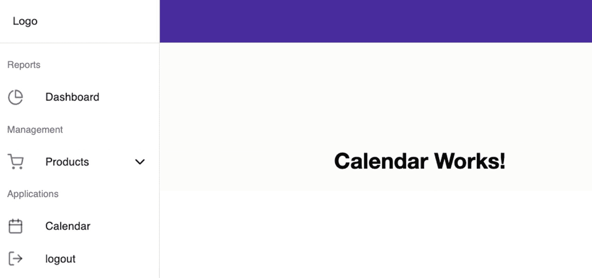
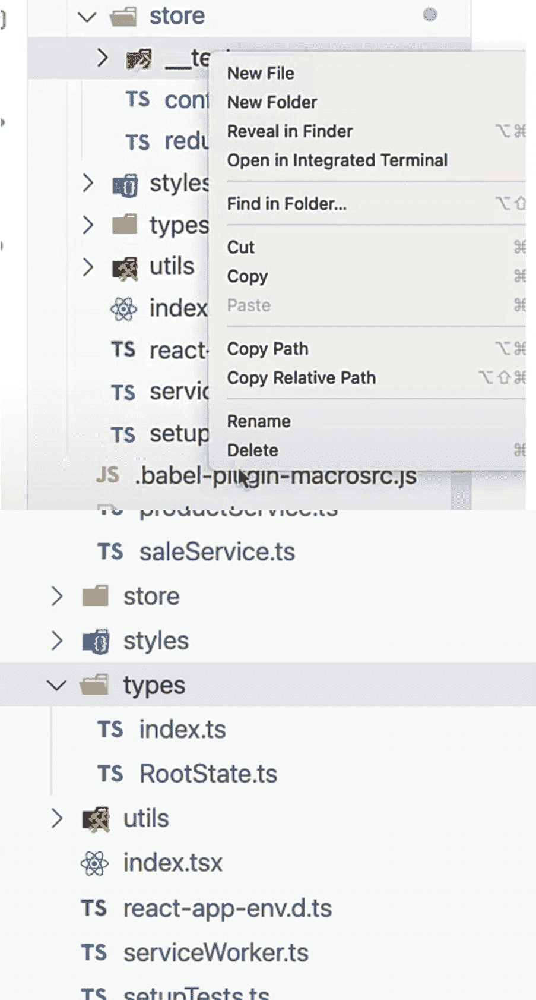
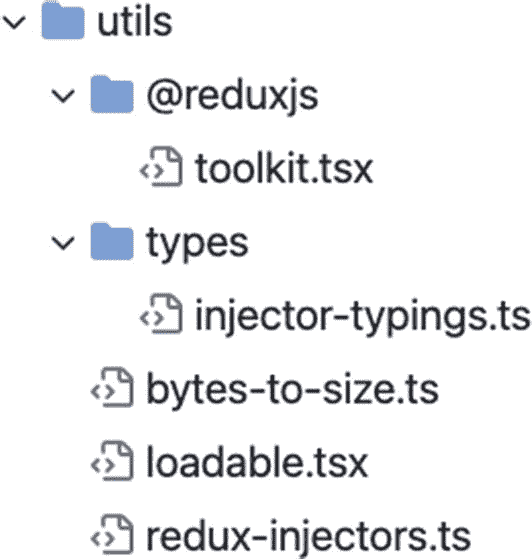
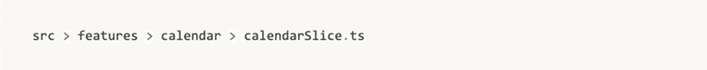
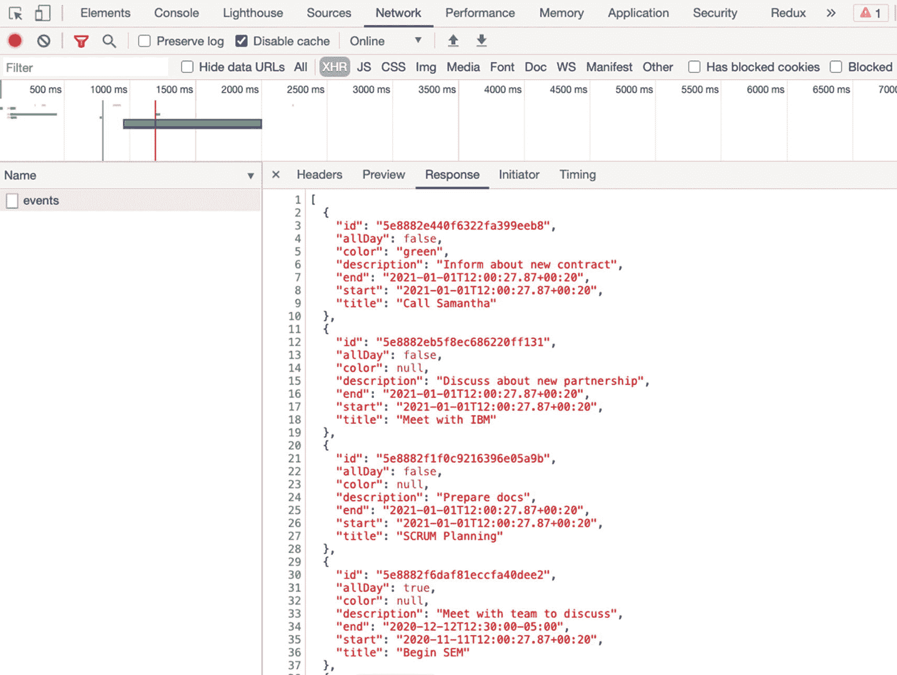
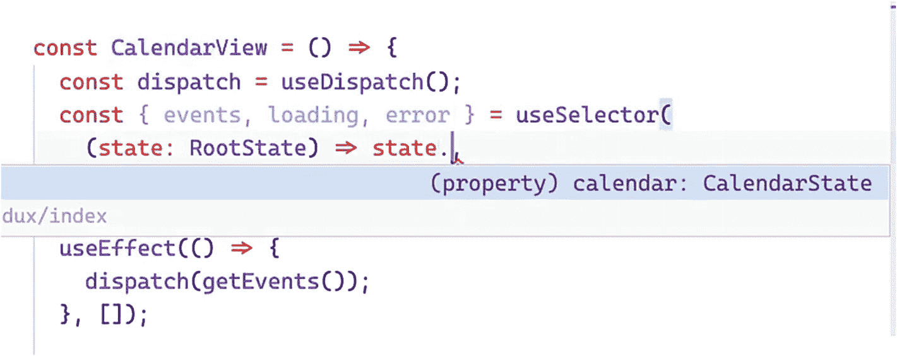
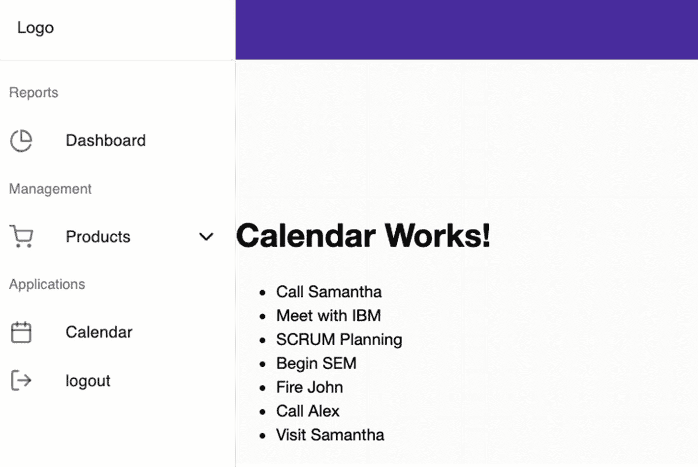

# 十、设置 Redux 工具包并调度一个异步动作

在前一章中，我们学习了使用 Redux 工具包 管理状态的概念。我们讨论了 React 应用中的 prop drilling，并展示了在 React 中编写 Redux 时的模式。

现在，正如承诺的那样，在这一章中，我们在这里开始变脏:

*   设置 Redux 工具包

*   向缩减器分派异步动作

*   将商店的状态呈现给我们的用户界面，特别是日历视图

## 创建日历视图组件

为此，我们现在将创建日历视图组件。

打开仪表板目录，我们将创建两个文件夹，`calendar`和`CalendarView,`以及`index.tsx`文件:

```jsx
dashboard ➤ calendar ➤ CalendarView ➤ index.tsx

```

打开`index.tsx file`，现在只添加一个 h1 标签<calendar works="">，如清单</calendar> [10-1](#PC2) 所示。

```jsx
import React from 'react';

const Index = () => {
  return (
    <div>
      <h1>Calendar Works!</h1>
    </div>
  );
};

export default Index;

Listing 10-1Creating index.tsx of CalendarView

```

我们的下一个练习是更新路线，因为我们需要在 routes.tsx 中注册日历组件。

### 更新路线

转到`routes.tsx,`并注册`CalendarView.`我们可以把它放在`ProductCreateView`之后，如清单 [10-2](#PC3) 所示。

```jsx
<Route exact path={path + '/calendar'}
                  component={lazy(
                  () => import('./views/dashboard/calendar/CalendarView'),
                  )} />

Listing 10-2Registering the CalendarView in routes.tsx

```

### 更新仪表板边栏导航

在 routes 文件夹中注册日历后，我们将向仪表板侧栏导航添加一个日历图标。

转到`dashboard-sidebar-navigation`进行更新。首先，从 React Feather 添加日历图标。同样，我们将其重命名为`CalendarIcon.`

```jsx
import { PieChart as PieChartIcon,
        ShoppingCart as ShoppingCartIcon,
        ChevronUp as ChevronUpIcon,
        ChevronDown as ChevronDownIcon,
        Calendar as CalendarIcon,
        List as ListIcon,
        FilePlus as FilePlusIcon,
        LogOut as LogOutIcon,
} from 'react-feather';

Listing 10-3Importing the Calendar Component to the dashboard-sidebar-navigation

```

既然我们已经将它添加到了`DashboardSidebarNavigation`组件中，让我们将另一个菜单放在 Create Product 下面，如清单 [10-4](#PC5) 所示。

```jsx
<ListSubheader>Applications</ListSubheader>
              <Link className={classes.link} to={`${url}/calendar`}>
              <ListItem button>
                <ListItemIcon>
                  <CalendarIcon/>
                </ListItemIcon>
                <ListItemText primary={'Calendar'} />
              </ListItem>
              </Link>

Listing 10-4Creating a Calendar Icon Menu in the dashboard-sidebar-navigation

```

刷新浏览器看到如图 [10-1](#Fig1) 所示的日历菜单。



图 10-1

在用户界面中显示日历

既然我们已经看到它正在工作，让我们为我们的日历建立模型。在 models 文件夹中，添加一个文件并将其命名为`calendar-type.ts.`我们将创建 CalendarView 的形状或模型类型，如清单 [10-5](#PC6) 所示。

```jsx
export type EventType = {
  id: string;
  allDay: boolean;
  color?: string;
  description: string;
  end: Date;
  start: Date;
  title: string;
};

//union type 

export type ViewType =
  | 'dayGridMonth'
  | 'timeGridWeek'
  | 'timeGridDay'
  | 'listWeek';

Listing 10-5Creating the Shape or Model Type of the CalendarView

```

好了，是时候让减压器进入商店了。记住 Redux 中的 reducers 是我们用来管理应用状态的。

### 还原剂

我们将首先进行一些重构，但我们将确保不会丢失 Redux 的任何核心功能。

打开`reducers.tsx`并用清单 [10-6](#PC7) 所示的代码替换它。插入的注释是对每个问题的简要解释。

```jsx
/* Combine all reducers in this file and export the combined reducers.
combineReducers - turns an object whose values are different reducer functions into a single reducer function. */

import { combineReducers } from '@reduxjs/toolkit';

/*  injectedReducers - an easier way of registering a reducer */
const injectedReducers = {
  //reducers here to be added one by one.
};

/* combineReducers requires an object.we're using the spread operator (...injectedReducers) to spread out all the Reducers */

const rootReducer = combineReducers({
  ...injectedReducers,
});

/* RooState is the type or shape of the combinedReducer easier way of getting all the types from this rootReduder instead of mapping it one by one. RootState - we can use the Selector to give us intelli-sense in building our components. */

export type RootState = ReturnType<typeof rootReducer>;
export const createReducer = () => rootReducer;

Listing 10-6Refactoring the reducers.ts

```

接下来，我们还需要更新商店并简化它。目前有 Saga 实现，但我们不需要它。我们将使用一个更简单的副作用 Thunk。

打开`configureStore.ts`并用下面的代码重构，如清单 [10-7](#PC8) 所示。

```jsx
/*Create the store with dynamic reducers */

import { configureStore, getDefaultMiddleware } from '@reduxjs/toolkit';
import { forceReducerReload } from 'redux-injectors';

import { createReducer } from './reducers';

export function configureAppStore() {
  const store = configureStore({

    /*reducer is required. middleware, devTools, and the rest are optional */
    reducer: createReducer(),
    middleware: [
      ...getDefaultMiddleware({
        serializableCheck: false,
      }),
    ],
    devTools: process.env.NODE_ENV !== 'production',
  });

  /* Make reducers hot reloadable, see http://mxs.is/googmo istanbul ignore next */

  if (module.hot) {
    module.hot.accept('./reducers', () => {
      forceReducerReload(store);
    });
  }

  return store;
}

Listing 10-7Refactoring the configureStore.ts

```

让我们进一步检查清单 [10-8](#PC10) 中发生了什么。

在商店设置中，我们使用来自`Redux 工具包`的`configureStore`和`getDefaultMiddleware`。

如果您将光标悬停在 getDefaultMiddleware **，**上，您将看到这条消息:“它返回一个包含 ConfigureStore()安装的默认中间件的数组。如果您希望使用自定义中间件阵列配置您的商店，但仍保持默认设置，这将非常有用。”

来自 redux-injectors 的是我们的热重装。

从 rootReducer 返回 combinedReducers 的函数。

是一组插件或中间件。

我们需要通过一个提供者将它注入到我们的组件中。

在那之后，我们去

```jsx
 src ➤ index.tsx

```

在 React 中，如果您看到一个名称提供者作为后缀的组件，这意味着您必须将它包装在根组件中。

提供者组件提供对整个应用的访问。在清单 [10-8](#PC10) 中，我们将根组件(index.tsx)包装在提供者组件中。

```jsx
/*wrapping the root component inside a provider gives all the component an access
 to the provider component or the whole application */

const ConnectedApp = ({ Component }: Props) => (
  <Provider store={store}>
    <HelmetProvider>
      <Component />
    </HelmetProvider>
  </Provider>
);

Listing 10-8Wrapping the Root Component (index.tsx) Inside a Provider Component

```

该提供程序是从 React-Redux 派生的。这是样板文件为我们设置的。

注意，提供者有一个必需的属性商店，我们将在`configureStore.ts.`中创建的商店传递给它，这就是为什么我们从`store/configureStore.`中导入了`configureAppStore`

这使得`store`成为事实的单一来源——可用于我们应用中的所有组件。

接下来，我们需要更新根组件的 index.tsx，如清单 [10-9](#PC11) 所示。请记住，这个 index.tsx 是应用的入口文件——仅用于设置和样板代码。

```jsx
import 'react-app-polyfill/ie11';
import 'react-app-polyfill/stable';
import 'react-quill/dist/quill.snow.css';
import * as React from 'react';
import * as ReactDOM from 'react-dom';
import { Provider } from 'react-redux';
import * as serviceWorker from 'serviceWorker';
import 'sanitize.css/sanitize.css';

// Import root app
import { App } from 'app';
import { HelmetProvider } from 'react-helmet-async';
import { configureAppStore } from 'store/configureStore';

// Initialize languages
import './locales/i18n';

const store = configureAppStore();
const MOUNT_NODE = document.getElementById('root') as HTMLElement;

interface Props {
  Component: typeof App;
}

/*wrapping the root component inside a provider gives all the component an access
 to the provider component or the whole application */

const ConnectedApp = ({ Component }: Props) => (
  <Provider store={store}>
    <HelmetProvider>
      <Component />
    </HelmetProvider>
  </Provider>
);
const render = (Component: typeof App) => {
  ReactDOM.render(<ConnectedApp Component={Component} />, MOUNT_NODE);
};

if (module.hot) {

  // Hot reloadable translation json files and app
  // modules.hot.accept does not accept dynamic dependencies,
  // have to be constants at compile-time

  module.hot.accept(['./app', './locales/i18n'], () => {
    ReactDOM.unmountComponentAtNode(MOUNT_NODE);
    const App = require('./app').App;
    render(App);
  });
}

render(App);

// If you want your app to work offline and load faster, you can change
// unregister() to register() below. Note this comes with some pitfalls.
// Learn more about service workers: https://bit.ly/CRA-PWA
serviceWorker.unregister();

Listing 10-9Updating the index.tsx of the Root Component

```

在这之后，让我们只是做一点清理。

## 清理时间

删除存储文件夹中的文件夹`_tests_`。我们还将取出`types`文件夹，因为我们已经有了一个`RootState.`



图 10-2

删除存储和类型文件夹中的 _tests_ 文件夹

接下来，找到 utils 文件夹并删除除了`bytes-to-size.ts`文件之外的所有内容。



图 10-3

删除 utils 文件夹

## 更新 Axios

就这么定了。我们现在去 axios 更新端点，如清单 [10-10](#PC12) 所示。

```jsx
Open src ➤ api ➤ axios.ts

export default api;

export const EndPoints = {
  sales: 'sales',
  products: 'products',
  events: 'event',
};

Listing 10-10Updating the Endpoints in axios.ts

```

然后让我们添加另一组假数据，在`db.json.`产品后添加以下事件数据。事件数组包含七个事件对象。

复制清单 [10-11](#PC13) 中的代码，并将其添加到 db.json 文件中。

```jsx
"events": [
    {
      "id": "5e8882e440f6322fa399eeb8",
      "allDay": false,
      "color": "green",
      "description": "Inform about new contract",
      "end": "2021-01-01T12:00:27.87+00:20",
      "start": "2021-01-01T12:00:27.87+00:20",
      "title": "Call Samantha"
    },
    {
      "id": "5e8882eb5f8ec686220ff131",
      "allDay": false,
      "color": null,
      "description": "Discuss about new partnership",
      "end": "2021-01-01T12:00:27.87+00:20",
      "start": "2021-01-01T12:00:27.87+00:20",
      "title": "Meet with IBM"
    },

    {
      "id": "5e8882f1f0c9216396e05a9b",
      "allDay": false,
      "color": null,
      "description": "Prepare docs",
      "end": "2021-01-01T12:00:27.87+00:20",
      "start": "2021-01-01T12:00:27.87+00:20",
      "title": "SCRUM Planning"
    },
    {
      "id": "5e8882f6daf81eccfa40dee2",
      "allDay": true,
      "color": null,
      "description": "Meet with team to discuss",
      "end": "2020-12-12T12:30:00-05:00",
      "start": "2020-11-11T12:00:27.87+00:20",
      "title": "Begin SEM"
    },

    {
      "id": "5e8882fcd525e076b3c1542c",
      "allDay": false,
      "color": "green",
      "description": "Sorry, John!",
      "end": "2021-01-01T12:00:27.87+00:20",
      "start": "2021-01-01T12:00:27.87+00:20",
      "title": "Fire John"
    },
    {
      "id": "5e888302e62149e4b49aa609",
      "allDay": false,
      "color": null,
      "description": "Discuss about the new project",
      "end": "2021-01-01T12:00:27.87+00:20",
      "start": "2021-01-01T12:00:27.87+00:20",
      "title": "Call Alex"
    },

    {
      "id": "5e88830672d089c53c46ece3",
      "allDay": false,
      "color": "green",
      "description": "Get a new quote for the payment processor",
      "end": "2021-01-01T12:00:27.87+00:20",
      "start": "2021-01-01T12:00:27.87+00:20",
      "title": "Visit Samantha"
    }
  ]

Listing 10-11Adding the Events Object in db.json

```

## 实现 Redux 工具包

好了，现在让我们来做实现 Redux 工具包的有趣部分。

我们将在这个应用中使用两种实现，这样您将了解两者是如何工作的，并且您可以更容易地使用现有的 React–Redux 工具包 项目。

在您很快会遇到的许多不同的项目中，实现几乎是相同的；有时，这只是文件夹结构和创建的文件数量的问题。

在这里，我们将把所有的动作和 reducers 写在一个文件中，我们将把它命名为 calendarSlice.ts。

在`src`目录中，创建一个新文件夹，并将其命名为`features; this`,这是我们将实现 Redux 的地方。

在`features,`里面新建一个文件夹并命名为`calendar.`在`calendar`里面新建一个文件名为`calendarSlice.ts.`

Redux 工具包 建议在名称空间中添加后缀 Slice。



打开`calendarSlice`文件，让我们添加一些命名的导入(清单 [10-12](#PC14) )。

```jsx
/*PayloadAction is for typings  */
import {
  createSlice,
  ThunkAction,
  Action,
  PayloadAction,
} from '@reduxjs/toolkit';

import { RootState } from 'store/reducers';
import { EventType } from 'models/calendar-type';
import axios, { EndPoints } from 'api/axios';

Listing 10-12Adding the Named Import Components in calendarSlice

```

接下来，让我们在 calendarSlice 中进行键入，如清单 [10-13](#PC15) 所示。

```jsx
/*typings for the Thunk actions to give us intlelli-sense */
export type AppThunk = ThunkAction<void, RootState, null, Action<string>>;

/*Shape or types of our CalendarState  */

interface CalendarState {
  events: EventType[];
  isModalOpen: boolean;
  selectedEventId?: string;     //nullable
  selectedRange?: {                       //nullable
    start: number;
    end: number;
  };

  loading: boolean;  //useful for showing spinner or loading screen

  error: string;
}

Listing 10-13Creating the Typings/Shapes in calendarSlice

```

仍然在我们的 calendarSlice 文件中，我们将在 initialState 中初始化一些值，如清单 [10-14](#PC16) 所示。

```jsx
/*initialState is type-safe, and it must be of a calendar state type.
  It also means that you can't add any other types here that are not part of the calendar state we’ve already defined.  */

const initialState: CalendarState = {
  events: [],
  isModalOpen: false,
  selectedEventId: null,
  selectedRange: null,
  loading: false,
  error: '',
};

Listing 10-14Adding the Default Values of the initialState

```

然后，我们继续创建`namespace`和`createSlice,`，如清单 [10-15](#PC17) 所示。我们将命名空间和 createSlice 添加到 calendarSlice。

```jsx
const calendarNamespace = 'calendar';

/*Single-File implementation of Redux-Toolkit*/

const slice = createSlice({

  /*namespace for separating related states. Namespaces are like modules*/
  name: calendarNamespace,

  /*initialState is the default value of this namespace/module and it is required.*/

  initialState, // same as initialState: initialState

  /*reducers --  for non asynchronous actions. It does not require Axios.*/
  /* the state here refers to the CalendarState */

  reducers: {
    setLoading(state, action: PayloadAction<boolean>) {
      state.loading = action.payload;
    },
    setError(state, action: PayloadAction<string>) {
      state.error = action.payload;
    },
    getEvents(state, action: PayloadAction<EventType[]>) {
      state.events = action.payload;
    },
  },
});

/* Asynchronous actions. Actions that require Axios (HTTP client)
 or any APIs of a library or function that returns a promise. */

export const getEvents = (): AppThunk => async dispatch => {
  dispatch(slice.actions.setLoading(true));
  dispatch(slice.actions.setError(''));
  try {
    const response = await axios.get<EventType[]>(EndPoints.events);
    dispatch(slice.actions.getEvents(response.data));
  } catch (error) {
    console.log(error.message);
    dispatch(slice.actions.setError(error.message));
  } finally {
    dispatch(slice.actions.setLoading(false));
  }
};

export default slice.reducer;

Listing 10-15Adding the Namespace and createSlice

```

`createSlice`是一个大对象，要求我们在`name`、`initialState`和`reducers`中放置一些东西。

这里的`reducers`是不需要 axios 或者不基于承诺的非异步动作(也称为同步动作)的对象。

## 非异步动作/同步动作

让我们检查一下我们在 calendarSlice 中的非异步操作或同步操作中写了什么:

有两个参数(状态和动作)，但是你只需要传递一个布尔值 PayloadAction。

`setError in reducers`:同第一个参数状态；不需要传递任何东西，因为 Thunk 会在引擎盖下处理它。我们只需要传递一些东西或者更新一个字符串`PayloadAction,`。

`getEvents in reducers`:payload action 是 EventType 的数组。

## 异步操作

下面是我们的异步操作:

`getEvents` `:`返回 AppThunk 的函数和调度函数。

`dispatch(slice.actions.setLoading(true))` `:`将加载从默认假更新为真。

我们传递的只是一个空字符串，所以基本上，每当我们有一个成功的请求时，我们就将这里的错误重置为空。

在 try-catch 块中，我们使用了一个`axios.get,`，它从`Endpoints.events.`返回一个数组`EventType`

我们得到的`response.data`将被发送到商店，以便更新状态。

在创建了`calendarSlice`之后，我们现在将更新根 reducers。

## 更新根缩减器

再次打开`reducers.ts`文件，更新`injectedReducers.`

首先，我们需要从 features/calendar/calendar slice 导入 calendarReducer，如清单 [10-16](#PC18) 所示。

```jsx
import { combineReducers } from '@reduxjs/toolkit';
import calendarReducer from 'features/calendar/calendarSlice'

Listing 10-16Adding the Named Component in reducers.ts

```

然后，在同一个文件中，注入我们的第一个缩减器，如清单 [10-17](#PC19) 所示。

```jsx
const injectedReducers = {
  calendar: calendarReducer,
};

Listing 10-17Injecting the calendarReducer in injectedReducers

```

我们现在可以使用这个名称空间`calendar`从这个日历中获取所需的状态。但是我们稍后会在组件中这样做。

现在，我们准备在日历视图或页面的 UI 组件中编写我们的`selectors`和`dispatchers`。

### 更新日历视图

但是首先，让我们通过进入日历视图组件来测试`dispatch`。打开`CalendarView`的`index.tsx`进入`.`

首先，我们将更新 CalendarView 的 index.tsx，如清单 [10-18](#PC20) 所示。

```jsx
import React, { useEffect } from 'react';
import { getEvents } from 'features/calendar/calendarSlice';
import { useDispatch, useSelector } from 'react-redux';
import { RootState } from 'store/reducers';

const CalendarView = () => {
  const dispatch = useDispatch();

  useEffect(() => {
    dispatch(getEvents());
  }, []);

Listing 10-18Updating index.tsx of CalendarView

```

现在，我们将在控制台中检查`getEvents`和`useDispatch`以查看我们是否成功获取了数据。

确保您的服务器正在运行`http://localhost:5000/events`，并单击浏览器`http://localhost:3000/dashboard/calendar`中的刷新按钮。

打开`Chrome DevTools` ➤ `Network` ➤ `Response`查看事件数据，如图 [10-4](#Fig4) 所示。



图 10-4

在 Chrome DevTools 上显示了事件数据的截图

我们的 Redux 正在工作的概念证明！状态在浏览器中，我们可以使用它。让我们回到我们的`CalendarView`组件，我们将添加`useSelector.`

`useSelector`需要一个带有发送和返回`RootState`的签名的函数，现在我们可以访问`reducer`。现在，我们只能访问或获取日历，因为这是我们到目前为止添加的内容，如图 [10-5](#Fig5) 所示。



图 10-5

通过根状态演示智能感知

我们通过使用`RootState`获得智能感知。如果您使用的是 JavaScript 而不是 TypeScript，那么您必须猜测或搜索您的 reducer 文件。想象一下，如果您有一个包含几十甚至几百个文件的大型应用。寻找它会很快变得令人厌倦。

这个智能特性是 TypeScript 的亮点之一。你可以只输入点(。)，然后它会显示您可以使用的所有可用减速器。

好的，现在让我们在`CalendarView.`做一些映射

```jsx
return (
    <div>
      <h1>Calendar Works!</h1>

      {loading && <h2>Loading... </h2>}
      {error && <h2>Something happened </h2>}
      <ul>

                 /*conditional nullable chain */

        {events?.map(e => (
          <li key={e.id}>{e.title} </li>
        ))}
      </ul>
    </div>
  );
};

export default CalendarView;

Listing 10-19Mapping the CalendarView in the UI

```

好了，让我们检查一下我们在清单 [10-19](#PC21) 中做了什么。

`loading &&`:如果条件为真，& &之后的元素运行；否则，如果状态为 false，则忽略它。同样的逻辑也适用于`error &&`。

刷新浏览器，检查是否可以在数据呈现之前看到加载。



图 10-6

在 UI 中呈现 CalendarView

## 摘要

在这一章中，我希望你已经对 React 应用中的 Redux 实现流程有了更好的理解，包括如何将一个异步动作分派给 reducer，以及如何将状态从存储渲染到 UI。

我们还使用了状态管理库 Redux 工具包，并实现了它的助手函数 createSlice。我们还扩展了样式组件，以包括 Material-UI 中的日历视图组件。

在下一章，我们将继续我们的 Redux 课程，使用 Redux 创建、删除和更新事件。