# 十一、使用 RTK 在 FullCalendar 上创建、删除和更新事件

在上一章中，我们设置了 Redux 工具包，并学习了如何将异步动作分派到存储中。我们还开始构建我们的日历组件。

我们将继续我们停止的地方——使用 Redux 工具包 在日历组件上创建、删除和更新事件。为此，我们将使用 FullCalendar 库添加用户表单来创建、删除和更新事件。

为了让您先睹为快应用的最终外观，图 [11-1](#Fig1) 和 [11-2](#Fig2) ，以及清单 [11-1](#PC1) ，在本章末尾提供了我们应用的用户界面。

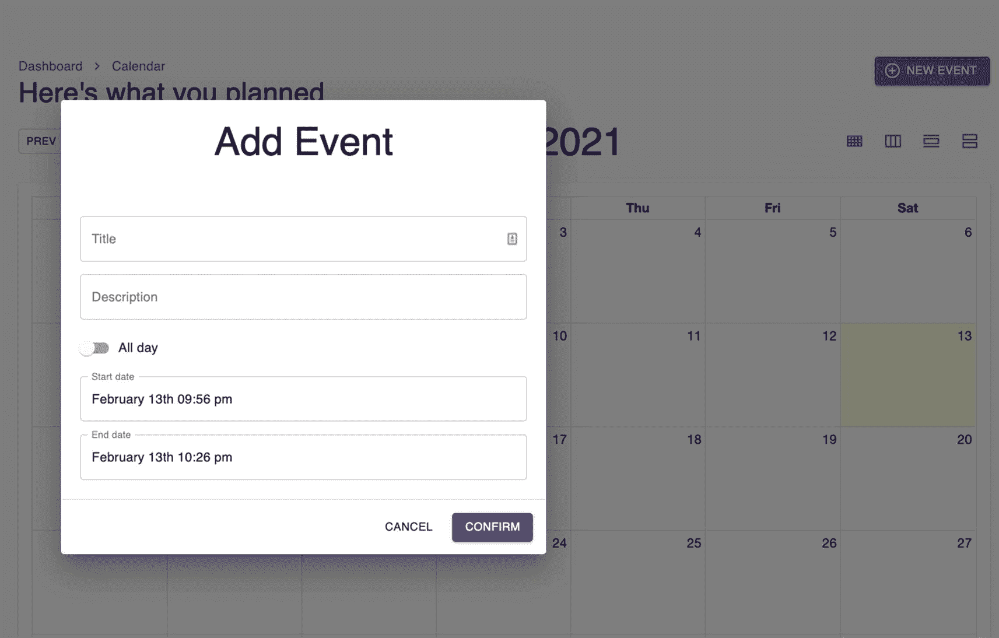

图 11-2

第 [11 章](11.html)末尾添加事件截图

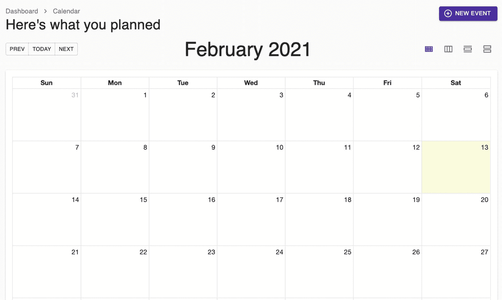

图 11-1

第 [11 章](11.html)末尾完整日历截图

## 安装时刻和完整日历

让我们开始安装一些第三方库，我们将需要这些库来构建完整的日历组件。

打开您的终端并安装下面的包，如清单 [11-1](#PC1) 所示。

```jsx
npm i moment @date-io/moment@1 @fullcalendar/core
npm i @fullcalendar/daygrid @fullcalendar/interaction
npm i @fullcalendar/list @fullcalendar/react
npm i @fullcalendar/timegrid @fullcalendar/timeline

Listing 11-1Importing Additional Libraries

```

让我们快速回顾一下我们已经安装的每个库:

**moment.js** :一个 JavaScript 日期库，用于解析、验证、操作和格式化日期。关于这个著名的库的项目状态的说明:即使它现在处于维护代码中——这意味着创建者不打算向库添加更多的功能——补丁和错误修复将继续。它拥有超过 1800 万次下载，截至 2021 年初仍处于上升趋势。

还有很多 JavaScript 库可以用来操作日期。但是学习 moment.js 同样可以帮助您理解其他 React 应用，因为许多 React 库可能都在使用这个流行的日期库。

如果你去*npmjs.org*找这些库，你会看到它们的如下定义:

**@ date-io/moment**:date-io-mono repo 的一部分，包含了 moment 的统一接口。我们将需要版本 1。

**@fullcalendar/core** :提供核心功能，包括日历类。

**@fullcalendar/daygrid** :在月视图或日网格视图上显示事件。

**@ full calendar/interaction**:提供事件拖放、调整大小、日期点击和可选动作的功能。

**@fullcalendar/list** :以项目列表的形式查看您的活动。

**@fullcalendar/react** :是个连接器。它告诉核心 FullCalendar 包开始使用 react 虚拟 DOM Node 而不是它通常使用的 Preact Node 进行渲染，将 FullCalendar 转换为“真正的”React 组件。

**@fullcalendar/timegrid** :在时间段网格上显示你的事件。

**@fullcalendar/timeline** :在水平时间轴上显示事件(无资源)。

成功导入所有库和模块后，让我们更新根组件。

### 更新根组件

首先，让我们在`index.tsx,`中添加这些模块，如清单 [11-2](#PC2) 所示。

```jsx
import MomentUtils from '@date-io/moment';
import {MuiPickersUtilsProvider} from '@material-ui/pickers';

Listing 11-2Importing Modules in the Root Component index.tsx

```

在同一个根文件中，我们将使用`MuiPickersUtils`包装从`SnackbarProvide` r 开始的所有内容，如清单 [11-3](#PC3) 所示。

```jsx
export function App() {
  return (
    <BrowserRouter>

             /*required props called utils and we're passing the MomentUtils */
      <MuiPickersUtilsProvider utils={MomentUtils}>
      <SnackbarProvider dense maxSnack={3}>
        <Helmet
          titleTemplate="%s - React Boilerplate"
          defaultTitle="React Boilerplate"
        >
          <meta name="description" content="A React Boilerplate application" />
        </Helmet>

        <MainLayout>
          <Routes />
        </MainLayout>

        <GlobalStyle />
      </SnackbarProvider>
      </MuiPickersUtilsProvider>
    </BrowserRouter>
  );
}

Listing 11-3Adding MuiPickersUtilsProvider to the Root Component

```

### 更新日历切片

接下来让我们看看组件`calendarSlice` `.`我们将添加新的非异步或同步动作以及异步动作。

#### 创建事件操作

我们将首先创建事件动作，如清单 [11-4](#PC4) 所示。

```jsx
createEvent(state, action: PayloadAction<EventType>) {
      state.events.push(action.payload);
    },
    selectEvent(state, action: PayloadAction<string>) {
      state.isModalOpen = true;
      state.selectedEventId = action.payload;
    },
    updateEvent(state, action: PayloadAction<EventType>) {
      const index = state.events.findIndex(e => e.id === action.payload.id);
      state.events[index] = action.payload;
    },
    deleteEvent(state, action: PayloadAction<string>) {
      state.events = state.events.filter(e => e.id !== action.payload);
    },

    /*{start: number; end: number} - this is the shape of the model that we can define here right away, although we can also write it separately in the models' folder. */

    selectRange(state, action: PayloadAction<{ start: number; end: number }>) {

              /*deconstructing the payload */
      const { start, end } = action.payload;

      state.isModalOpen = true;
      state.selectedRange = {
        start,
        end,
      };
    },

    openModal(state) {
      state.isModalOpen = true;
    },
    closeModal(state) {
      state.isModalOpen = false;
      state.selectedEventId = null;
      state.selectedRange = null;
    },

Listing 11-4Creating the Event Actions in calendarSlice.ts

```

让我们回顾一下清单 [11-4](#PC4) 中发生了什么。

`createEvent`:`createEvent`的参数是`EventType`的一个对象，为了产生一个新的事件，我们将把它放入一个现有的数组中。这将在`EvenType`的数组中生成一个新对象。

获取一个字符串，我们在这里修改两个状态。

`updateEvent`:获取一个事件类型，然后我们需要得到我们正在经过的这个`EventType`的位置`(findIndex)`。这是更新现有对象。

我们正在传递一个字符串，然后我们正在做一个过滤器。过滤器返回一个没有我们选择的 id(字符串)的新数组。

`selectRange`:接受一个有开始和结束的对象——都是 number 类型。

`openModal`:不需要任何参数；它只是将状态更新为 true。

`closeModel`:不需要任何参数；它只是将状态更新回 false，`selectedEventId,`和`selectedRange`更新回 null。

接下来，我们将在同一个文件 calendarSlice.ts 中导出一些非异步动作，如清单 [11-5](#PC5) 所示

#### 添加非异步操作

```jsx
/* Export these actions so components can use them.  Non-asynchronous actions. HTTP client is not needed. */

export const selectEvent = (id?: string): AppThunk => dispatch => {
  dispatch(slice.actions.selectEvent(id));
};

export const selectRange = (start: Date, end: Date): AppThunk => dispatch => {
  dispatch(
    slice.actions.selectRange({
      start: start.getTime(),
      end: end.getTime(),
    }),
  );
};

export const openModal = (): AppThunk => dispatch => {
  dispatch(slice.actions.openModal());
};

export const closeModal = (): AppThunk => dispatch => {
  dispatch(slice.actions.closeModal());
};

Listing 11-5Adding non-async actions in calendarSlice.ts

```

同样，让我们看看清单 [11-5](#PC5) 中发生了什么。

`selectEvent`:这是一个高阶函数，它接受一个 id 并返回一个 dispatch 以供执行。

id 来自于`selectEvent.`。函数`selectEvent`的名称与调度`selectEvent`相同，以避免在导入组件时产生混淆。

`selectRange`:该功能也与动作`selectRange.`同名

让我们继续在 calendarSlice.ts 中添加我们的异步事件动作，如清单 [11-6](#PC6) 所示。

```jsx
export const createEvent = (event: EventType): AppThunk => async dispatch => {

/* data – we deconstructed the response object */

const { data } = await axios.post<EventType>(EndPoints.events, event);

  dispatch(slice.actions.createEvent(data));
};

export const updateEvent = (update: EventType): AppThunk => async dispatch => {

  /*updating the state in the database */

  const { data } = await axios.put<EventType>(
    `${EndPoints.events}/${update.id}`,
    update,
  );

  /*updating the state in the UI */

  dispatch(slice.actions.updateEvent(data));
};

export const deleteEvent = (id: string): AppThunk => async dispatch => {
  /*deleting from the database */

  await axios.delete(`${EndPoints.events}/${id}`);

  /*deleting it from the UI */
  dispatch(slice.actions.deleteEvent(id));
};

Listing 11-6Adding Asynchronous Event Actions in calendarSlice.ts

```

在清单 [11-6](#PC6) 中，我们添加了另外三个事件——create event、updateEvent 和 deleteEvent:

`createEvent`:我们正在导出和使用`createEvent`函数，它接受一个`EventType`对象。我们异步运行`dispatch`，因为我们*等待*[`axios.post`](http://axios.post)`,`，它从 [`Endpoints.events`](http://endpoints.events) 中获取`EventType,`。必需的 body 参数是一个`event`。

我们解构了响应对象，因为我们只需要一个属性，即`data`。

我们在`createEvent`动作中传递`data`并分派它。

`updateEvent`:它也更新`EventType`，异步运行`dispatch`，等待`axios.put,`，并返回一个`EventType`。

在这里，我们只需要一个 id。在运行异步调度并将其从数据库中删除后，我们还将它从 UI 中过滤出来。

FOR YOUR ACTIVITY

如果您注意到，在 **createEven** t、 **updateEvent** 和 **deleteEvent** 中没有 try-catch 块。

例如，在`deleteEvent`中，如果没有 try-catch 并且`axios.delete`失败，调度将继续运行并删除 UI 中的对象，即使数据库中的对象没有被删除。所以现在，UI 中的状态和数据库中的状态会不匹配。

对于您的活动，在三个异步事件中实现一个 try-catch。看看我们对`getEvents`做了什么。不要忘记实现 setLoading 和 setError 操作。

完成活动后，我们将更新`CalendarView`的`index.tsx`。

### 更新日历视图

我们将从 Material-UI Core 导入页面组件模板以及`Container`和`makeStyles`模块，如清单 [11-7](#PC7) 所示。

```jsx
import { Container, makeStyles} from '@material-ui/core';
import Page from 'app/components/page';

Listing 11-7Importing Named Components in CalendarView

```

然后让我们用新导入的页面和容器替换 return。我们还将在高度和填充上添加一些样式，如清单 [11-8](#PC8) 所示。

```jsx
  const CalendarView = () => {
  const classes = useStyles();
  const dispatch = useDispatch();

  /* destructuring it because we only need the events, loading, error */

  const { events, loading, error } = useSelector(
    (state: RootState) => state.calendar,
  );

  useEffect(() => {
    dispatch(getEvents());
  }, []);

  return (
    <Page className={classes.root} title="Calendar">
      <Container maxWidth={false}>
        <h1>Calendar Works!</h1>
        {loading && <h2>Loading... </h2>}
        {error && <h2>Something happened </h2>}
        <ul>
          {events?.map(e => (
            <li key={e.id}>{e.title} </li>
          ))}
        </ul>
      </Container>
    </Page>
  );
};

export default CalendarView;

const useStyles = makeStyles(theme => ({
  root: {
    minHeight: '100%',
    paddingTop: theme.spacing(3),
    paddingBottom: theme.spacing(3),
  },
}));

Listing 11-8Updating the Styling of the CalendarView Component

```

之后，让我们为`CalendarView`添加一个 Header 组件。创建一个新文件`Header.tsx:`

```jsx
calendar ➤ CalendarView ➤ Header.tsx

```

### 创建标题组件

在清单 [11-9](#PC10) 中，我们导入了`Header.tsx.`的命名组件

```jsx
import React from 'react';
import { Link as RouterLink } from 'react-router-dom';
import clsx from 'clsx';
import { PlusCircle as PlusCircleIcon } from 'react-feather';
import NavigateNextIcon from '@material-ui/icons/NavigateNext';
import {
  Button,
  Breadcrumbs,
  Grid,
  Link,
  SvgIcon,
  Typography,
  makeStyles,
  Box,
} from '@material-ui/core';

Listing 11-9Importing the Named Components in Header.tsx

```

我们将立即使用我们的 Header 函数组件来跟进，如清单 [11-10](#PC11) 所示。

```jsx
/*nullable className string and nullable onAddClick function

  */

type Props = {
  className?: string;
  onAddClick?: () => void;
};

/* using the Props here and ...rest operator  */

const Header = ({ className, onAddClick, ...rest }: Props) => {
  const classes = useStyles();

  return (
    <Grid
      className={clsx(classes.root, className)}
      container
      justify="space-between"
      spacing={3}
      {...rest}
    >
      <Grid item>
        <Breadcrumbs
          separator={<NavigateNextIcon fontSize="small" />}
          aria-label="breadcrumb"
        >
          <Link
            variant="body1"
            color="inherit"
            to="/app"
            component={RouterLink}
          >
            Dashboard
          </Link>
          <Box>
            <Typography variant="body1" color="inherit">
              Calendar
            </Typography>
          </Box>
        </Breadcrumbs>
        <Typography variant="h4" color="textPrimary">
          Here's what you planned
        </Typography>
      </Grid>

      <Grid item>
        <Button
          color="primary"
          variant="contained"
          onClick={onAddClick}
          className={classes.action}
          startIcon={
            <SvgIcon fontSize="small">
              <PlusCircleIcon />
            </SvgIcon>
          }
        >
          New Event
        </Button>
      </Grid>
    </Grid>
  );
};

Listing 11-10Creating the Header Component

```

最后是 Material-UI Core 的`makeStyles`中的`useStyles`，如清单 [11-11](#PC12) 所示。

```jsx
const useStyles = makeStyles(theme => ({
  root: {},
  action: {
    marginBottom: theme.spacing(1),
    '& + &': {
      marginLeft: theme.spacing(1),
    },
  },
}));

export default Header;

Listing 11-11Adding the Styling Margin for the Header Component

```

接下来，我们将在 CalendarView 的`index.tsx`中使用新创建的 Header 组件，如清单 [11-12](#PC13) 所示。

```jsx
import Header from './Header';
...
return (
    <Page className={classes.root} title="Calendar">
      <Container maxWidth={false}>
        <Header />
        <h1>Calendar Works!</h1>

Listing 11-12Using the Header Component in the index.tsx of the CalendarView

```

刷新浏览器，您应该会看到相同的内容。

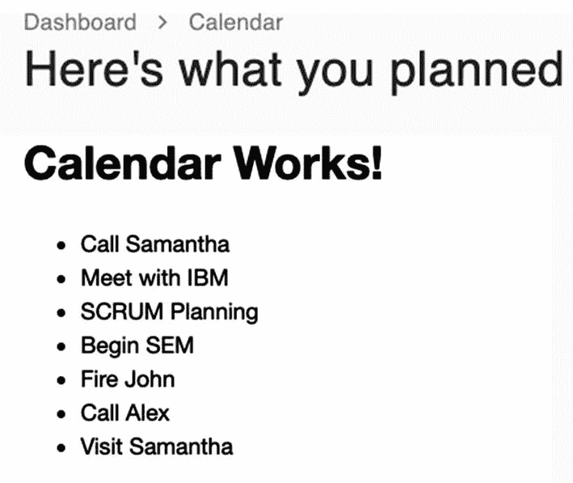

图 11-3

使用 index.tsx 中的 Header 组件后的 UI 截图

所以婴儿再次迈步。我们可以看到它正在工作。我们现在可以继续添加编辑事件表单。在`CalendarView`文件夹中，创建另一个组件并将其命名为`AddEditEventForm.tsx`。

#### 使用 Formik 创建添加编辑事件表单

在`AddEditEventForm,`中，我们将使用`moment.js,` `Formik` `,`和`yup validation`。在这种情况下，我们不需要为 Yup 验证创建单独的文件。

打开文件`AddEditEventForm`并添加以下命名组件，如清单 [11-13](#PC14) 所示。

```jsx
import React from 'react';
import moment from 'moment';
import * as Yup from 'yup';
import { Formik } from 'formik';
import { useSnackbar } from 'notistack';
import { DateTimePicker } from '@material-ui/pickers';
import { Trash as TrashIcon } from 'react-feather';
import { useDispatch } from 'react-redux';
import {
  Box,
  Button,
  Divider,
  FormControlLabel,
  FormHelperText,
  IconButton,
  makeStyles,
  SvgIcon,
  Switch,
  TextField,
  Typography,
} from '@material-ui/core';

/*the async actions we created earlier in the calendarSlice */

import {
  createEvent,
  deleteEvent,
  updateEvent,
} from 'features/calendar/calendarSlice';
import { EventType } from 'models/calendar-type';

Listing 11-13Adding the Named Components in AddEditEventForm

```

Material-UI 中新增加的是`DateTimePicker`。如果你去看看 Material-UI 网站，你会看到很多可以重用的日期时间选择器组件，你不必从头开始创建自己的组件。

接下来，让我们为我们的组件 AddEditEventForm 编写类型定义，如清单 [11-14](#PC15) 所示。

```jsx
/* the ? indicates it is a nullable type */

type Props = {
  event?: EventType;
  onAddComplete?: () => void;
  onCancel?: () => void;
  onDeleteComplete?: () => void;
  onEditComplete?: () => void;
  range?: { start: number; end: number };
};

Listing 11-14Creating the Type or Shape of the AddEditEventForm

```

在清单 [11-14](#PC15) 中，我们有`Props,`并且我们在`AddEditEventForm`组件中使用它，如清单 [11-15](#PC16) 所示。

```jsx
const AddEditEventForm = ({
  event,
  onAddComplete,
  onCancel,
  onDeleteComplete,
  onEditComplete,
  range,
}: Props) => {
  const classes = useStyles();
  const dispatch = useDispatch();
  const { enqueueSnackbar } = useSnackbar();

 /*event is coming from the parent of the AddEditEventForm */

  const isCreating = !event;

  const handleDelete = async (): Promise<void> => {
    try {
      await dispatch(deleteEvent(event?.id));
      onDeleteComplete();
    } catch (err) {
      console.error(err);
    }
  };

Listing 11-15Creating the AddEditEventForm Component

```

正如您在清单 [11-15](#PC16) 中注意到的，`AddEditEventForm`使用 Props，以及 dispatch Snackbar，而`handleDelete`是一个异步 fun **c** 操作，它调度`deleteEvent`动作并传递 [`event.id`](http://event.id/) `.`

当然，我们还没有完成。接下来，让我们使用 Formik 创建我们的表单。因为我们使用的是 TypeScript，所以必须初始化以下三个 Formik 属性:initialValues、validationSchema 和 onSubmit。

我们将首先从清单 [11-16](#PC17) 所示的`initialValues`和使用 Yup 的 ValidationSchema 开始。

```jsx
return (
    <Formik
      initialValues={getInitialValues(event, range)}
      validationSchema={Yup.object().shape({
        allDay: Yup.bool(),
        description: Yup.string().max(5000),
        end: Yup.date().when(
          'start',
          (start: Date, schema: any) =>
            start &&
            schema.min(start, 'End date must be later than start date'),
        ),
        start: Yup.date(),
        title: Yup.string().max(255).required('Title is required'),
      })}

Listing 11-16Creating the Two Formik Props: initialValues and validationSchema

```

让我们看看我们在清单 [11-16](#PC17) 中做了什么:

`initialValues`:清单 [11-17](#PC18) 中增加了`getInitialValues`。

通常，验证模式保存在另一个文件中，特别是如果它很长的话，但是在这个例子中，我们已经在这里编写了它，因为它只是一个小的验证对象。

简而言之，通常将 initialValues 和 validationSchema 放在一个单独的文件中，只在需要它们的组件中使用它们。

好，接下来，让我们添加另一个必需的 Formik 属性`: onSubmit.`

```jsx
onSubmit={async (
        /*  where the input values (i.e. from TextField)  are being combined. */

        values,

         /* Formik helper deconstructed.*/

        { resetForm, setErrors, setStatus, setSubmitting },

      ) => {
        try {
          const data = {
            allDay: values.allDay,
            description: values.description,
            end: values.end,
            start: values.start,
            title: values.title,
            id: '',
          };

          if (event) {
            data.id = event.id;
            await dispatch(updateEvent(data));
          } else {
            await dispatch(createEvent(data));
          }

          resetForm();
          setStatus({ success: true });
          setSubmitting(false);
          enqueueSnackbar('Calendar updated', {
            variant: 'success',
          });

          if (isCreating) {
            onAddComplete();
          } else {
            onEditComplete();
          }
        } catch (err) {
          console.error(err);
          setStatus({ success: false });
          setErrors({ submit: err.message });
          setSubmitting(false);
        }
      }}
    >

      /*deconstructing here the Formik props  */

      {({
        errors,
        handleBlur,
        handleChange,
        handleSubmit,
        isSubmitting,
        setFieldTouched,
        setFieldValue,
        touched,
        values,
      }) => (

        /*this will trigger the onSubmit of Formik */

        <form onSubmit={handleSubmit}>
          <Box p={3}>
            <Typography
              align="center"
              gutterBottom
              variant="h3"
              color="textPrimary"
            >
              {isCreating ? 'Add Event' : 'Edit Event'}
            </Typography>
          </Box>

        /*TextField -- make sure to map everything to title */

          <Box p={3}>
            <TextField
              error={Boolean(touched.title && errors.title)}
              fullWidth
              helperText={touched.title && errors.title}
              label="Title"
              name="title"
              onBlur={handleBlur}
              onChange={handleChange}
              value={values.title}
              variant="outlined"
            />
            <Box mt={2}>

           /*TextFields -- make sure to map everything to description */

              <TextField
                error={Boolean(touched.description && errors.description)}
                fullWidth
                helperText={touched.description && errors.description}
                label="Description"
                name="description"
                onBlur={handleBlur}
                onChange={handleChange}
                value={values.description}
                variant="outlined"
              />
            </Box>

            /*Form Control Label  */

            <Box mt={2}>
              <FormControlLabel
                control={
                  <Switch
                    checked={values.allDay}
                    name="allDay"
                    onChange={handleChange}
                  />
                }
                label="All day"
              />
            </Box>

            /*DateTimePicker for Start date.
         onChange - we're using the setFieldValue because the onChange emits a date, not an event.
             */

            <Box mt={2}>
              <DateTimePicker
                fullWidth
                inputVariant="outlined"
                label="Start date"
                name="start"
                onClick={() => setFieldTouched('end')} // install the @date-io/moment@1.x
                onChange={date => setFieldValue('start', date)} // and use it in MuiPickersUtilsProvider
                value={values.start}
              />
            </Box>

             /*DateTimePicker for End date*/

            <Box mt={2}>
              <DateTimePicker
                fullWidth
                inputVariant="outlined"
                label="End date"
                name="end"

onClick={() => setFieldTouched('end')}
onChange={date => setFieldValue('end', date)}
                value={values.end}
              />
            </Box>

          /*FormHelperText - to show an error message */

            {Boolean(touched.end && errors.end) && (
              <Box mt={2}>
                <FormHelperText error>{errors.end}</FormHelperText>
              </Box>

            )}
          </Box>
          <Divider />
          <Box p={2} display="flex" alignItems="center">
            {!isCreating && (
              <IconButton onClick={() => handleDelete()}>
                <SvgIcon>
                  <TrashIcon />
                </SvgIcon>
              </IconButton>
            )}
            <Box flexGrow={1} />
            <Button onClick={onCancel}>Cancel</Button>
            <Button
              variant="contained"
              type="submit"

              disabled={isSubmitting}    ➤  /* this is to prevent double clicking */

              color="primary"
              className={classes.confirmButton}
            >
              Confirm
            </Button>
          </Box>
        </form>
      )}
    </Formik>
  );
};

export default AddEditEventForm;

Listing 11-17Creating the onSubmit on the AddEditEventForm

```

这里是列表 [11-18](#PC19) ，Formik 属性初始值的`getInitialValues`。

```jsx
const getInitialValues = (
  event?: EventType,
  range?: { start: number; end: number },
) => {
  if (event) {
    const defaultEvent = {
      allDay: false,
      color: '',
      description: '',
      end: moment().add(30, 'minutes').toDate(),
      start: moment().toDate(),
      title: '',
      submit: null,
    };
    return { ...defaultEvent, event };
  }

  if (range) {
    const defaultEvent = {
      allDay: false,
      color: '',
      description: '',
      end: new Date(range.end),
      start: new Date(range.start),
      title: '',
      submit: null,
    };
    return { ...defaultEvent, event };
  }

  return {
    allDay: false,
    color: '',
    description: '',
    end: moment().add(30, 'minutes').toDate(),
    start: moment().toDate(),
    title: '',
    submit: null,
  };
};

Listing 11-18Creating the getInitialValues of Formik 

```

在清单 [11-18](#PC19) 中，我们有`getInitialValues`——一个接受事件和取值范围的函数。该函数显示一个默认事件或一系列事件。

在创建了 Formik 属性`,`之后，我们回到`CalendarView`的`index.tsx`来做一些更新。

### 更新日历视图

让我们在`calendarSlice,`中导入`closeModal`和`openModal`，如清单 [11-19](#PC20) 所示。

```jsx
import {
  getEvents,
  openModal,
  closeModal,
} from 'features/calendar/calendarSlice';

Listing 11-19Importing Modules in calendarSlice

```

在 CalendarView 的同一个索引文件中，我们使用了下面的:`useSelector.`中的`isModalOpen`和`selectedRange`我们还将创建一个`handleAddClick`和一个`handleModalClose,`，如清单 [11-20](#PC21) 所示。

```jsx
const { events, loading, error, isModalOpen, selectedRange } = useSelector(
    (state: RootState) => state.calendar,
  );

useEffect(() => {
    dispatch(getEvents());
  }, []);

  const handleAddClick = (): void => {
    dispatch(openModal());
  };

  const handleModalClose = (): void => {
    dispatch(closeModal());
  };

Listing 11-20Adding States and Handles in calendarSlice

```

### 更新标题

所以现在我们可以用`handleClick`函数更新`Header`，如清单 [11-21](#PC22) 所示。

```jsx
<Page className={classes.root} title="Calendar">
      <Container maxWidth={false}>
        <Header onAddClick={handleAddClick} />
        <h1>Calendar Works!</h1>

Listing 11-21Using the handleAddClick in the Header

```

### 更新日历视图

让我们在 CalendarView 的 index.tsx 中添加样式组件。我们将从 Material-UI 核心导入这些样式组件，如清单 [11-22](#PC23) 所示。

```jsx
import {
  Container,
  makeStyles,
     Dialog,   //a modal popup
     Paper,     //in Material Design, the physical properties of paper are translated to the screen.
  useMediaQuery,    // a CSS media query hook for React. Detects when its media queries change
} from '@material-ui/core';

Listing 11-22Adding Styling Components to the index.tsx of CalendarView

```

在同一个索引文件中，我们需要一个小函数来选择一个事件。

我们还将从`models/calendar-type`和`AddEditEventForm`中导入`EventType`和`ViewType`组件，如清单 [11-23](#PC24) 所示。

```jsx
import Header from './Header';
import { EventType, ViewType } from 'models/calendar-type';
import AddEditEventForm from './AddEditEventForm';

...
export default CalendarView;

const selectedEventSelector = (state: RootState): EventType | null => {
  const { events, selectedEventId } = state.calendar;

  if (selectedEventId) {
    return events?.find(_event => _event.id === selectedEventId);
  } else {
    return null;
  }
};

const useStyles = makeStyles(theme => ({
...

Listing 11-23Creating an Event Selector in the index.tsx of CalendarView

```

在清单 [11-23](#PC24) 中，我们有`selectedEventSelector`——一个带`state`、`RootState`和`calendar`的函数，我们从`calendar`传递的是变量`events`和`selectedEventId.`

现在我们将调用`useSelector`并传递`selectedEventSelector`，如清单 [11-24](#PC25) 所示

```jsx
const selectedEvent = useSelector(selectedEventSelector);

Listing 11-24Using the useSelector in the index.tsx of CalendarView

```

还是在同一个索引文件中，我们将在`Container.`中做一些重构

我们将用`Dialog, isModalOpen,`和`AddEditEventForm`替换当前的 h1 标签，如清单 [11-25](#PC26) 所示。

```jsx
<Container maxWidth={false}>
        <Header onAddClick={handleAddClick} />
        <Dialog
          maxWidth="sm"
          fullWidth
          onClose={handleModalClose}
          open={isModalOpen}
        >

          {isModalOpen && (
            <AddEditEventForm
              event={selectedEvent}
              range={selectedRange}
              onAddComplete={handleModalClose}
              onCancel={handleModalClose}
              onDeleteComplete={handleModalClose}
              onEditComplete={handleModalClose}
            />
          )}
        </Dialog>
      </Container>

Listing 11-25Adding Dialog and AddEditEventForm in index.tsx of CalendarView

```

在清单 [11-25](#PC26) 中，我们有`Dialog`——一个材质-UI 模态组件——我们在这里定义大小并使用事件`onClose`和`open`对话框。还有`isModalOpen`，如果为真，显示 AddEditEventForm。在 AddEditEventForm 属性中，我们传递 selectedEvent、selectedRange 和 handleModalClose **。**

#### 检查 CalendarView 的用户界面

让我们看看它在 UI 中是如何工作的。刷新浏览器，打开 Chrome DevTools。单击新建事件。您应该会看到名为“添加事件”的弹出模式对话框。

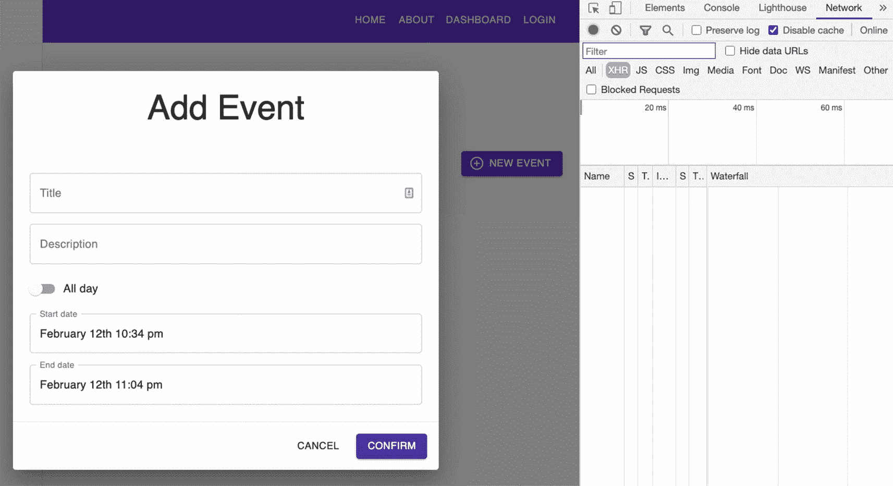

图 11-4

浏览器中模式对话框添加事件的屏幕截图

尝试创建一个事件，然后单击确认按钮。你会在 Chrome DevTools 中看到数据事件被成功返回，如图 [11-5](#Fig5) 所示。

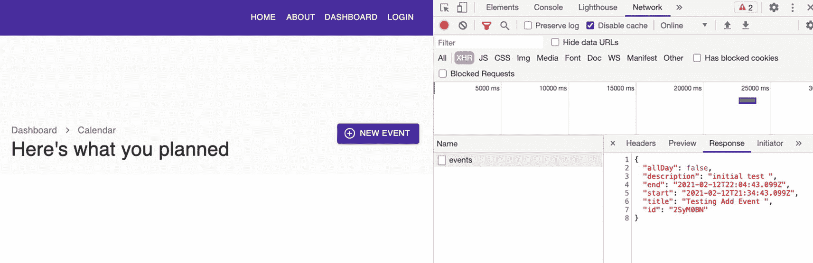

图 11-5

Chrome DevTools 中的事件请求截图

#### 检查 Chrome 开发工具

另请注意，模式对话框会自动关闭。在 Chrome DevTools 中，检查标题，您会看到创建了状态代码 201。这意味着我们能够创建一个对象并将其保存在数据库中。

#### 检查 Redux 开发工具

接下来，打开 Redux DevTools。确保选择顶部下拉箭头上的日历–React 样本。

Redux DevTools 记录分派的动作和存储的状态。我们可以通过应用的时间旅行调试功能在每个时间点检查应用的状态，而无需重新加载或重启应用。

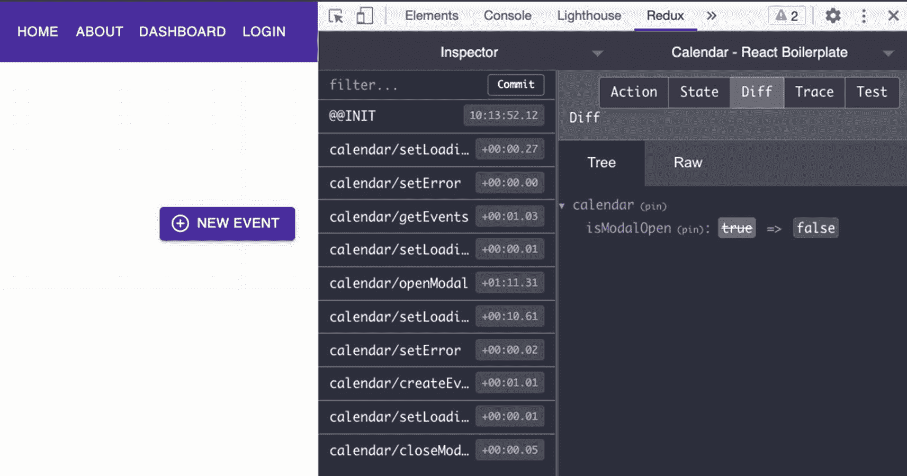

图 11-6

Redux DevTools 中事件请求的屏幕截图

我们对观察差异很感兴趣，你可以看到状态从`setLoading`到`createEvents`再到`closeModal`等等。

您可以看到可以从存储中访问的事件或事件数组，还可以查找任何错误消息等。所有的动作都被记录下来，我们可以通过 Redux DevTools 的时间旅行调试功能来回放。

### 创建工具栏

我们将在`CalendarView`文件夹下创建一个工具栏组件`Toolbar.tsx,`。

首先，我们导入命名的组件，如清单 [11-26](#PC27) 所示。

```jsx
import React, { ElementType, ReactNode } from 'react';
import clsx from 'clsx';
import moment from 'moment';
import {
  Button,
  ButtonGroup,
  Grid,
  Hidden,
  IconButton,
  Tooltip,
  Typography,
  makeStyles,
} from '@material-ui/core';
import ViewConfigIcon from '@material-ui/icons/ViewComfyOutlined';
import ViewWeekIcon from '@material-ui/icons/ViewWeekOutlined';
import ViewDayIcon from '@material-ui/icons/ViewDayOutlined';
import ViewAgendaIcon from '@material-ui/icons/ViewAgendaOutlined';

import { ViewType } from 'models/calendar-type';

Listing 11-26Adding Named Components in Toolbar.tsx

```

在清单 [11-26](#PC27) 中，我们从 Material-UI 核心导入了 moment 和标准样式模块。新的图标与材质界面图标不同。

我们还从模型/日历类型中导入了视图类型。

在同一个 Toolbar.tsx 文件中，我们将为模型`Toolbar`和`ViewOption`创建类型或模式，如清单 [11-27](#PC28) 所示。

```jsx
type ViewOption = {
  label: string;
  value: ViewType;
  icon: ElementType;
};

type Props = {
  children?: ReactNode;
  className?: string;
  date: Date;

   /* the ? means it's a nullable void function

  onDateNext?: () => void;
  onDatePrev?: () => void;
  onDateToday?: () => void;
  onAddClick?: () => void;

  /* takes a view object and returns nothing or void */

  onViewChange?: (view: ViewType) => void;
  view: ViewType;
};

Listing 11-27Creating the Type or Schema of Toolbar

```

在清单 [11-27](#PC28) 中，我们有类型`Props,`，它有`date`和`view`作为必需的类型属性，而其余的都是可空类型。`ViewOption`型需要三个属性:`label, value,`和`icon.`我们一会儿会用到`ViewPoint`。我们现在正在这里准备。

因此，我们现在将使用我们在工具栏组件中定义的`Props`，如清单 [11-28](#PC29) 所示。

```jsx
const Toolbar = ({
  className,
  date,
  onDateNext,
  onDatePrev,
  onDateToday,
  onAddClick,
  onViewChange,
  view,
  ...rest       // the rest parameter
}: Props) => {
  const classes = useStyles();

Listing 11-28Using the Props in the Toolbar Component

```

在清单 [11-28](#PC29) 中，您会注意到**静止参数**。这允许我们在函数中接受多个参数，并将它们作为一个数组。

 Rest 参数可用于函数、箭头函数或类中。但在函数定义中，rest 参数必须出现在参数表的最后；否则，TypeScript 编译器将会报错并显示错误。

接下来，我们将在同一个工具栏组件文件中创建 return 语句。

我们把所有东西都放在一个`Grid`中，并添加了`ButtonGroup.`

我们使用`moment,`格式化`date`，我们还映射了`viewOptions`中的四个对象，如清单 [11-29](#PC30) 所示，并返回`Tooltip key` `title`和`IconButton`。

```jsx
return (
    <Grid
      className={clsx(classes.root, className)}
      alignItems="center"
      container
      justify="space-between"
      spacing={3}
      {...rest}
    >
      <Grid item>
        <ButtonGroup size="small">
          <Button onClick={onDatePrev}>Prev</Button>
          <Button onClick={onDateToday}>Today</Button>
          <Button onClick={onDateNext}>Next</Button>
        </ButtonGroup>
      </Grid>
      <Hidden smDown>
        <Grid item>
          <Typography variant="h3" color="textPrimary">
            {moment(date).format('MMMM YYYY')}
          </Typography>
        </Grid>

        <Grid item>
          {viewOptions.map(viewOption => {
            const Icon = viewOption.icon;

            return (
              <Tooltip key={viewOption.value} title={viewOption.label}>
                <IconButton
                  color={viewOption.value === view ? 'primary' : 'default'}
                  onClick={() => {
                    if (onViewChange) {
                      onViewChange(viewOption.value);
                    }
                  }}
                >
                  <Icon />
                </IconButton>
              </Tooltip>
            );
          })}
        </Grid>
      </Hidden>
    </Grid>
  );
};

export default Toolbar;

Listing 11-29Adding the Return Statement of the Toolbar Component

```

接下来，我们添加`ViewOption`和`makeStyles`组件，如清单 [11-30](#PC31) 所示。

```jsx
const viewOptions: ViewOption[] = [
  {
    label: 'Month',
    value: 'dayGridMonth',
    icon: ViewConfigIcon,
  },
  {
    label: 'Week',
    value: 'timeGridWeek',
    icon: ViewWeekIcon,
  },
  {
    label: 'Day',
    value: 'timeGridDay',
    icon: ViewDayIcon,
  },
  {
    label: 'Agenda',
    value: 'listWeek',
    icon: ViewAgendaIcon,
  },
];

const useStyles = makeStyles(() => ({
  root: {},
}));

Listing 11-30Creating ViewOption and makeStyles components in Toolbar.tsx

```

又该更新 CalendarView 的 index.tsx 了。

### 设置日历视图的样式

我们将开始在 CalendarView 的 index.tsx 中添加新的样式组件，如清单 [11-31](#PC32) 所示。

```jsx
calendar: {
    marginTop: theme.spacing(3),
    padding: theme.spacing(2),
    '& .fc-unthemed .fc-head': {},
    '& .fc-unthemed .fc-body': {
      backgroundColor: theme.palette.background.default,
    },
    '& .fc-unthemed .fc-row': {
      borderColor: theme.palette.divider,
    },
    '& .fc-unthemed .fc-axis': {
      ...theme.typography.body2,
    },
    '& .fc-unthemed .fc-divider': {
      borderColor: theme.palette.divider,
    },
    '& .fc-unthemed th': {
      borderColor: theme.palette.divider,
    },
    '& .fc-unthemed td': {
      borderColor: theme.palette.divider,
    },
    '& .fc-unthemed td.fc-today': {},
    '& .fc-unthemed .fc-highlight': {},
    '& .fc-unthemed .fc-event': {
      backgroundColor: theme.palette.secondary.main,
      color: theme.palette.secondary.contrastText,
      borderWidth: 2,
      opacity: 0.9,
      '& .fc-time': {
        ...theme.typography.h6,
        color: 'inherit',
      },

      '& .fc-title': {
        ...theme.typography.body1,
        color: 'inherit',
      },
    },
    '& .fc-unthemed .fc-day-top': {
      ...theme.typography.body2,
    },
    '& .fc-unthemed .fc-day-header': {
      ...theme.typography.subtitle2,
      fontWeight: theme.typography.fontWeightMedium,
      color: theme.palette.text.secondary,
      padding: theme.spacing(1),
    },
    '& .fc-unthemed .fc-list-view': {
      borderColor: theme.palette.divider,
    },
    '& .fc-unthemed .fc-list-empty': {
      ...theme.typography.subtitle1,
    },
    '& .fc-unthemed .fc-list-heading td': {
      borderColor: theme.palette.divider,
    },
    '& .fc-unthemed .fc-list-heading-main': {
      ...theme.typography.h6,
    },
    '& .fc-unthemed .fc-list-heading-alt': {
      ...theme.typography.h6,
    },
    '& .fc-unthemed .fc-list-item:hover td': {},
    '& .fc-unthemed .fc-list-item-title': {
      ...theme.typography.body1,
    },
    '& .fc-unthemed .fc-list-item-time': {
      ...theme.typography.body2,
    },
  },

Listing 11-31Adding Styling Components in the index.tsx of CalendarView

```

清单 [11-31](#PC32) 中的附加样式组件只是日历的几种边框颜色，以及一些边距和填充。

现在，在 CalendarView 的同一个索引文件中，我们将从 FullCalendar 库中导入 moment 库和模块，如清单 [11-32](#PC33) 所示。

```jsx
import moment from 'moment';
import FullCalendar from '@fullcalendar/react';
import dayGridPlugin from '@fullcalendar/daygrid';
import timeGridPlugin from '@fullcalendar/timegrid';
import interactionPlugin from '@fullcalendar/interaction';
import listPlugin from '@fullcalendar/list';
import timelinePlugin from '@fullcalendar/timeline';

Listing 11-32Importing Named Components in index.tsx of CalendarView

```

然后让我们添加并使用来自`calendarSlice`和 React 钩子的一些模块，如清单 [11-33](#PC34) 所示。

```jsx
import React, { useEffect, useState, useRef } from 'react';

import {
  getEvents,
  openModal,
  closeModal,
  selectRange,
  selectEvent,
  updateEvent
} from 'features/calendar/calendarSlice';

Listing 11-33Importing Additional Modules from calendarSlice and React Hooks

```

同样，在同一个索引文件中，我们将创建一些本地状态，如清单 [11-34](#PC35) 所示。

```jsx
const selectedEvent = useSelector(selectedEventSelector);

  const mobileDevice = useMediaQuery('(max-width:600px)');
  const [date, setDate] = useState<Date>(moment().toDate());
  const [view, setView] = useState<ViewType>(
    mobileDevice ? 'listWeek' : 'dayGridMonth',
  );

  const calendarRef = useRef<FullCalendar | null>(null);

  useEffect(() => {
    dispatch(getEvents());
  },

Listing 11-34Creating local states in index.tsx of CalendarView

```

让我们看看清单 [11-34](#PC35) 中发生了什么。我们有`useRef`来访问 DOM 元素，并在后续或下一次渲染中保存值或状态。将鼠标悬停在`useRef,`上，您会看到这是一个`React.MutableRefObject<FullCalendar>.`，这意味着我们可以访问这个完整日历的 API 或接口。

我们用它来检测小的浏览器屏幕，比如移动设备的屏幕。

之后，我们将在`handleModalClose,`下面创建额外的句柄函数，如清单 [11-35](#PC36) 所示。

```jsx
/* calendarRef is a reference to the element FullCalendar*/

const handleDateNext = (): void => {
    const calendarEl = calendarRef.current;

/*the getApi here is part of FullCalendar. If you 'dot space' the  'calendarEl,' you'll see the interfaces or APIs available.  */

    if (calendarEl) {
      const calendarApi = calendarEl.getApi();

      calendarApi.next();
      setDate(calendarApi.getDate());
    }
  };

  const handleDatePrev = (): void => {
    const calendarEl = calendarRef.current;

    if (calendarEl) {
      const calendarApi = calendarEl.getApi();

      calendarApi.prev();
      setDate(calendarApi.getDate());
    }
  };

  const handleDateToday = (): void => {
    const calendarEl = calendarRef.current;

    if (calendarEl) {
      const calendarApi = calendarEl.getApi();

      calendarApi.today();
      setDate(calendarApi.getDate());
    }
  };

  const handleViewChange = (newView: ViewType): void => {
    const calendarEl = calendarRef.current;

    if (calendarEl) {
      const calendarApi = calendarEl.getApi();

      calendarApi.changeView(newView);
      setView(newView);
    }
  };

  /*the arg: any - could be a string or a number */

  const handleEventSelect = (arg: any): void => {
    dispatch(selectEvent(arg.event.id));
  };

  /*We have here a try-catch block because handleEventDrop is an async function */

  const handleEventDrop = async ({ event }: any): Promise<void> => {
    try {
      await dispatch(
        updateEvent({
          allDay: event.allDay,
          start: event.start,
          end: event.end,
          id: event.id,
        } as any),
      );
    } catch (err) {
      console.error(err);
    }
  };

  const handleEventResize = async ({ event }: any): Promise<void> => {
    try {
      await dispatch(
        updateEvent({
          allDay: event.allDay,
          start: event.start,
          end: event.end,
          id: event.id,
        } as any),
      );
    } catch (err) {
      console.error(err);
    }
  };

  const handleRangeSelect = (arg: any): void => {
    const calendarEl = calendarRef.current;

    if (calendarEl) {
      const calendarApi = calendarEl.getApi();

      calendarApi.unselect();
    }

    dispatch(selectRange(arg.start, arg.end));
  };

Listing 11-35Creating Additional Handle Events in the index.tsx of CalendarView

```

我们还没说完呢。我们需要添加来自 Material-UI 的纸张模块和 UI 样式的完整日历。

在 return 语句中找到`Dialog`标签；我们已经写了只有当`isModalOpen`为真时`Dialog`才可见。所以在 Header 组件之后和对话框之前，我们将放置 FullCalendar，如清单 [11-36](#PC37) 所示。

```jsx
return (
    <Page className={classes.root} title="Calendar">
      <Container maxWidth={false}>
        <Header onAddClick={handleAddClick} />
        <Toolbar
          date={date}
          onDateNext={handleDateNext}
          onDatePrev={handleDatePrev}
          onDateToday={handleDateToday}
          onViewChange={handleViewChange}
          view={view}
        />
        <Paper className={classes.calendar}>
          <FullCalendar
            allDayMaintainDuration
            droppable
            editable
            selectable
            weekends
            dayMaxEventRows
            eventResizableFromStart
            headerToolbar={false}
            select={handleRangeSelect}
            eventClick={handleEventSelect}
            eventDrop={handleEventDrop}
            eventResize={handleEventResize}
            initialDate={date}
            initialView={view}
            events={events}
            height={800}
            ref={calendarRef}
            rerenderDelay={10}
            plugins={[
              dayGridPlugin,
              timeGridPlugin,
              interactionPlugin,
              listPlugin,

              timelinePlugin,
            ]}
          />
        </Paper>
        <Dialog
          maxWidth="sm"
          fullWidth
          onClose={handleModalClose}
          open={isModalOpen}
        >

Listing 11-36Rendering the FullCalendar in the UI of the index.tsx of CalendarView

```

如果你注意到清单 [11-36](#PC37) 中的一些属性(即`allDayMaintainDuration, droppable` **、** `editable`、**、**等)。)没有等号=号；这意味着它们默认设置为真。

这是书写`allDayMaintainDuration={true},`的速记，这也意味着它们都是布尔型的。

但是对于`headerToolbar`，我们必须显式地声明 false 值。我们将它设置为 false，因为我们有工具栏组件，我们将很快添加。

#### 在 UI 中检查完整日历

让我们在浏览器中测试一切。刷新它，您应该能够看到完整的日历和我们之前创建的测试事件。

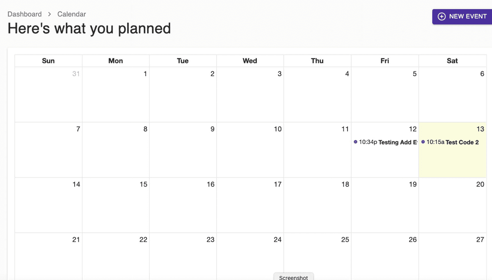

图 11-7

完整日历的屏幕截图

点按显示的事件并尝试编辑它。您应该可以成功地进行更改，如图 [11-8](#Fig8) 所示。

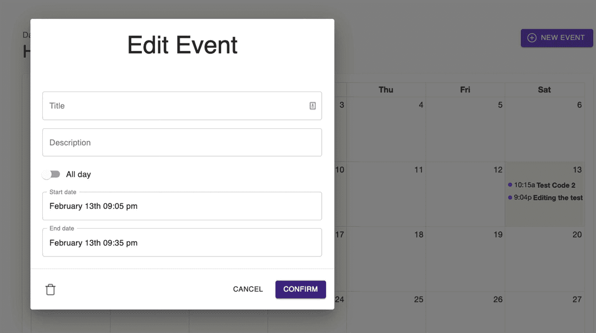

图 11-8

编辑完整日历的事件表单

#### 检查 Chrome 开发工具和 Redux 开发工具

看一眼 Redux DevTools，你会看到它也在更新，并在 Chrome DevTools 中看到 200 OK 状态码。

还要测试编辑事件表单左下方的删除图标，您应该能够删除所选择的事件。

一旦你删除了它，在 Chrome DevTools 中再次检查网络，查看请求方法:DELETE 和状态代码:200 OK。

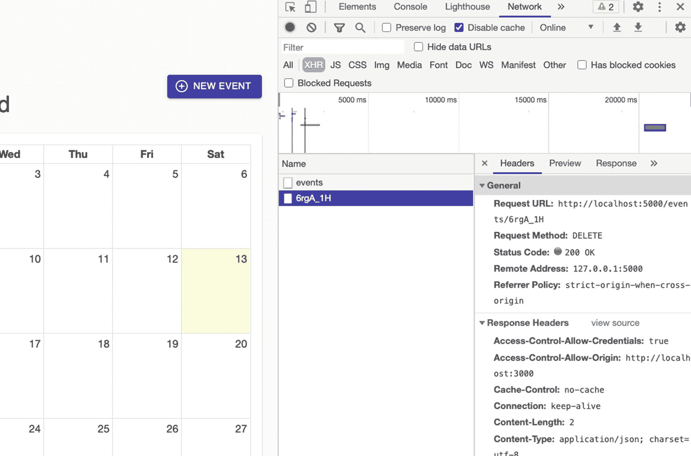

图 11-9

删除事件

创建一个在连续两个月中有大约两周时间范围的事件怎么样？在图 [11-10](#Fig10) 中，我们可以看到我们已经成功地为多月日历添加了一个事件。

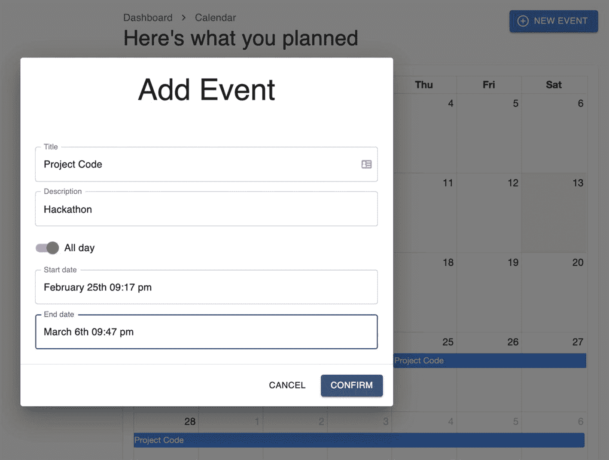

图 11-10

在多月日历中创建事件

我们能够创建从 2 月到 3 月的多月活动。但是，您会注意到我们无法导航到下个月。

这是因为我们还需要增加一个东西，就是工具栏。所以现在让我们在`CalendarView.`的`index.tsx`中导入它

我们将导入工具栏组件，并在标题组件下使用它，如清单 [11-37](#PC38) 所示。

```jsx
import Toolbar from './Toolbar';

...

<Header onAddClick={handleAddClick} />
        <Toolbar
          date={date}
          onDateNext={handleDateNext}
          onDatePrev={handleDatePrev}
          onDateToday={handleDateToday}
          onViewChange={handleViewChange}
          view={view}
        />

Listing 11-37Adding the Toolbar Component in the index.tsx of CalendarView

```

检查 UI，您应该会看到如图 [11-11](#Fig11) 所示的变化。现在，您应该能够导航到之前或之后的月份。

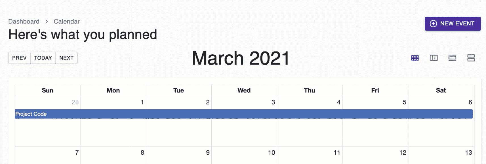

图 11-11

添加工具栏后更新的 UI 的屏幕截图

## 摘要

在这一章中，我们继续构建我们的应用。我们安装了 FullCalendar 库，并学习了如何使用 Redux 工具包 在日历组件上创建、删除和更新事件。希望您现在对 Redux 工具包 的实现流程有了更好的理解。

在下一章，我们将构建登录和注册表单。我们将需要假 Node json-server 和 json-server-auth 的帮助，以及来自优秀 Material-UI 的更多样式组件。