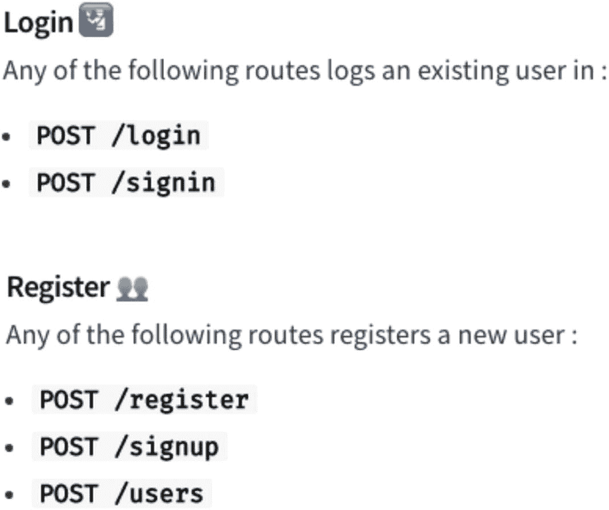
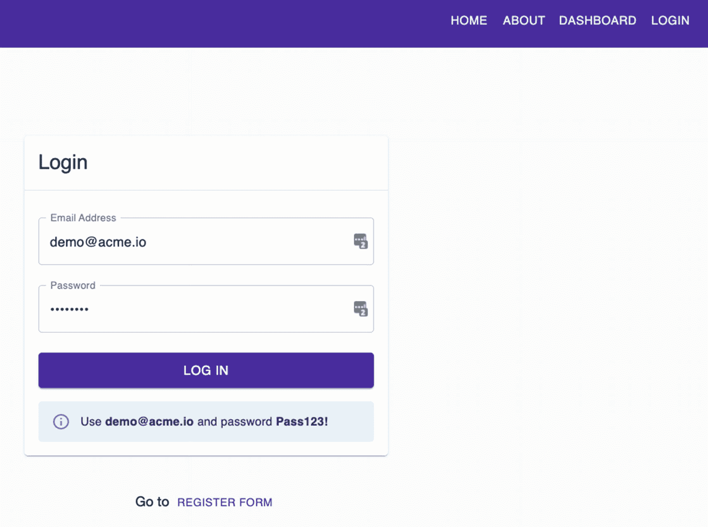
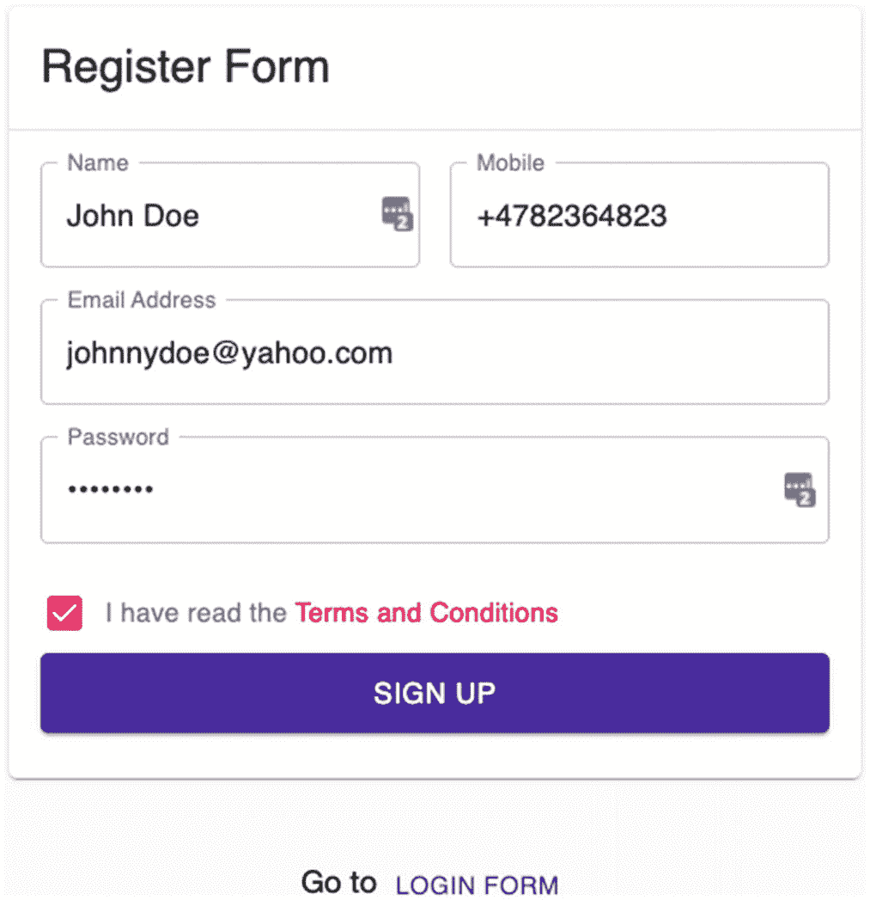
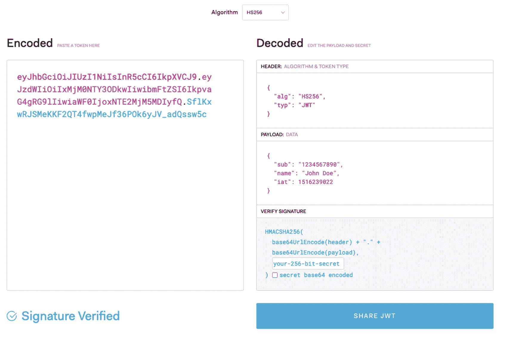
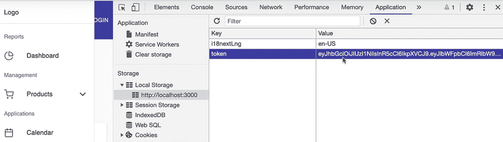
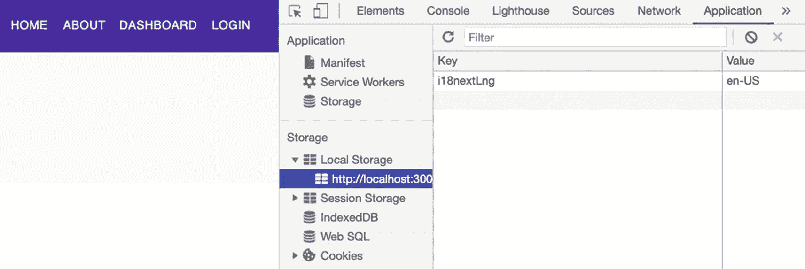

# 十二、React 中的保护路由和认证

在上一章中，我们已经展示了如何使用 Redux 工具包 创建、删除和更新应用的事件。我们已经知道用我们的存储库进行 CRUD 是多么的高效和方便，它保存了我们应用的所有全局状态。

在这一章中，我们将为我们的应用建立一个登录和注册表单。我们将从伪 Node json-server 开始，我们已经在前一章中安装了它。json-server 允许我们发送 HTTP 方法或 HTTP 请求。

## 设置假服务器

设置假服务器只需要我们几分钟的时间，对构建我们的 UI 帮助很大；我们不需要等待我们的后端开发团队给我们 API。我们可以创建一个假的 API，并用它来测试 UI。

这就是我们在 json 服务器上所做的。我们还将使用`json-server-auth`，一个插件或模块，在 json-server 内部创建一个认证服务。

除了`json-server-auth,`之外，我们还使用了`concurrently.`

允许我们在一次运行中同时运行两个 npm 命令。

所以我们需要修改我们的脚本。

转到`package.json` `,`编辑后端脚本并添加一个`start:fullstack`脚本，如清单 [12-1](#PC1) 所示。

```jsx
"backend": "json-server --watch db.json --port 5000 --delay=1000 -m ./node_modules/json-server-auth",
  "start:fullstack": "concurrently \"npm run backend\" \"npm run start\""

Listing 12-1Modifying the Scripts in package.json

```

同时运行多个命令。

现在我们已经设置好了，让我们试一试。取消所有正在运行的应用，然后在终端中键入以下命令:

```jsx
npm run start:fullstack

```

### db.json

一旦完成，让我们更新事件下面的 [`db.`](http://db.sm) `json` `.`，我们将添加一个用户对象数组，如清单 [12-2](#PC3) 所示。

```jsx
  "users": [
    {
      "id": "7fguyfte5",
      "email": "demo@acme.io",
      "password": "$2a$10$Pmk32D/fgkig8pU.r1rGrOpYYJSrnqqpLO6dRdo88iYxxIsl1sstC",
      "name": "Mok Kuh",
      "mobile": "+34782364823",
      "policy": true
    }
  ],

Listing 12-2Adding the users Object in the db.json

```

我们稍后将使用它登录。用户的端点是用户对象的数组。它包含登录详细信息，包括哈希密码。

### API:登录和注册

接下来，在 axios.ts 文件中，让我们更新端点，如清单 [12-3](#PC4) 所示。

```jsx
export const EndPoints = {
  sales: 'sales',
  products: 'products',
  events: 'events',
  login: 'login',
  register: 'register',
};

Listing 12-3Updating the Endpoints in axios.ts

```

“登录”和“注册”都是 json-server-auth 的一部分。如果您转到 [`npmjs.org`](http://npmjs.org/) 并搜索 json-server-auth，您会看到我们可以在认证流程中使用以下任何一条路线。

在这种情况下，我们使用登录和注册，如图 [12-1](#Fig1) 所示。



图 12-1

json-server-auth 中的认证流程

### authService(认证服务)

我们现在可以更新服务了。在 services 文件夹中，创建一个名为`authService.ts`的新文件。

`authService`是一个包含我们使用 axios 的日志和注册服务的文件。

```jsx
import axios, { EndPoints } from 'api/axios';

export type UserModel = {
  email: string;
  password: string;
};

/*The return object will be an object with an access token of type string. We're expecting an access token from the json-server-auth */

export async function loginAxios(userModel: UserModel) {
  return await axios.post<{ accessToken: string }>(EndPoints.login, userModel);
}

export type RegisterModel = {
  email: string;
  password: string;
  name: string;
  mobile: string;
  policy: boolean;
};

export async function registerAxios(registerModel: RegisterModel) {
  return await axios.post<{ accessToken: string }>(
    EndPoints.register,
    registerModel,
  );
}

Listing 12-4Creating the authService.ts

```

在清单 [12-4](#PC5) 中，我们有**登录信息**——请求一个用户模型——我们在用户模型类型中定义它，它需要一个电子邮件和字符串类型的密码。我们还有**registerAxios**——请求 registerModel——我们在 register model 中描述它，它需要电子邮件、密码、姓名、手机和策略。

现在让我们继续创建登录页面。

在 views ➤页面文件夹中，创建一个新文件夹并将其命名为 auth，在 auth 中，添加另一个文件夹并将其命名为 components。

在 auth 文件夹中，创建一个新文件，并将其命名为 **LoginPage.tsx** :

```jsx
app ➤ views ➤ pages ➤ auth ➤ LoginPage.tsx

```

在 components 文件夹中，创建一个新文件，并将其命名为 **LoginForm.tsx** :

```jsx
app ➤ views ➤ pages ➤ auth ➤ components ➤ LoginForm.tsx

```

## 设置登录表单

让我们先建立逻辑关系。导入命名的组件，如清单 [12-5](#PC8) 所示。

```jsx
import React, { useState } from 'react';
import * as Yup from 'yup';
import { Formik } from 'formik';
import { Alert } from '@material-ui/lab';
import { useHistory } from 'react-router-dom';
import {
  Box,
  Button,
  FormHelperText,
  TextField,
  CardHeader,
  Divider,
  Card,
} from '@material-ui/core';

import { loginAxios } from 'services/authService';

Listing 12-5Importing Named Components of LoginForm.tsx

```

在清单 [12-5](#PC8) 中，我们通常会怀疑命名导入。让我们看看这里还有什么新的东西:

`Alert`:我们这里是第一次从物料界面导入预警。Alert 用于显示简短而重要的消息，以便在不中断用户任务的情况下引起用户的注意。

这是我们从 React-Router-DOM 导入的一个钩子；这允许我们访问历史实例，并让我们向后导航。

我们还从`the authService.`中导入了`loginAxios`

然后让我们为`LoginForm`创建一个函数，并创建另一个函数来保存用户的身份验证细节。当然，我们将这样命名它，如清单 [12-6](#PC9) 所示。

作为一种最佳实践，我们应该尽可能描述性地命名我们的函数和方法，以便于我们自己和其他开发人员阅读我们的代码。

```jsx
const LoginForm = () => {
  const key = 'token';
  const history = useHistory();
  const [error, setError] = useState('');

  const saveUserAuthDetails = (data: { accessToken: string }) => {
    localStorage.setItem(key, data.accessToken);
  };

Listing 12-6Creating the Function for LoginForm.tsx

```

`LoginForm`:在这里，我们将“令牌”定义为密钥，并将`useHistory`和`useState`用于错误。

`saveUserAuthDetails`:将用户资料保存在本地存储器的功能。`local storage`是浏览器的本地部分，所以我们可以访问它。它是一等公民支持的，所以我们不需要再进口它了。

接下来，让我们添加我们的`LoginForm,`的返回语句，它包含 Formik 及其所需的属性，如清单 [12-7](#PC10) 所示。

```jsx
return (
    <Formik
      initialValues={{
        email: 'demo@acme.io',
        password: 'Pass123!',
      }}
      validationSchema={Yup.object().shape({
        email: Yup.string()
          .email('Must be a valid email')
          .max(255)
          .required('Email is required'),
        password: Yup.string().max(255).required('Password is required'),
      })}

      onSubmit={async (values, formikHelpers) => {
        try {
          const { data } = await loginAxios(values);
          saveUserAuthDetails(data);
          formikHelpers.resetForm();
          formikHelpers.setStatus({ success: true });
          formikHelpers.setSubmitting(false);
          history.push('dashboard');
        } catch (e) {
          setError('Failed. Please try again.');
          console.log(e.message);
          formikHelpers.setStatus({ success: false });
          formikHelpers.setSubmitting(false);
        }
      }}
    >

      {/* deconstructed Formik props */}

      {({
        errors,
        handleBlur,
        handleChange,
        handleSubmit,
        isSubmitting,
        touched,
        values,
      }) => (
        <Card>
          <form noValidate onSubmit={handleSubmit}>
            <CardHeader title="Login" />
            <Divider />
            <Box m={2}>
              <TextField
                error={Boolean(touched.email && errors.email)}
                fullWidth
                autoFocus
                helperText={touched.email && errors.email}
                label="Email Address"
                margin="normal"
                name="email"
                onBlur={handleBlur}
                onChange={handleChange}
                type="email"
                value={values.email}
                variant="outlined"
              />

              <TextField
                error={Boolean(touched.password && errors.password)}
                fullWidth
                helperText={touched.password && errors.password}
                label="Password"
                margin="normal"
                name="password"
                onBlur={handleBlur}
                onChange={handleChange}
                type="password"
                value={values.password}
                variant="outlined"
              />
              <Box mt={2}>
                <Button
                  color="primary"
                  disabled={isSubmitting}
                  fullWidth
                  size="large"
                  type="submit"
                  variant="contained"
                >

                  Log In
                </Button>
              </Box>
              {error && (
                <Box mt={3}>
                  <FormHelperText error>{error}</FormHelperText>
                </Box>
              )}
              <Box mt={2}
                <Alert severity="info">
                  <div>
                    Use <b>demo@acme.io</b> and password <b>Pass123!</b>
                  </div>
                </Alert>
              </Box>
            </Box>
          </form>

        </Card>
      )}
    </Formik>
  );
};

export default LoginForm;

Listing 12-7Creating Formik in the LoginForm

```

让我们回顾一下我们在清单 [12-7](#PC10) 中所做的一些事情:

`initialValues`:福米克必备属性。我们用电子邮件和密码的值初始化它。

一个有效的验证模式。我们将电子邮件定义为一个字符串，其中有效电子邮件地址的最大字符数为 255，密码的最大字符数为 255。

`onSubmit`:一个接受`values`和`formikHelpers.`的异步函数，因为它是一个异步函数，我们把它包装在一个 try-catch 块中。

在尝试中，我们使用`loginAxios`来看看我们是否可以登录。我们需要的结果就是这个`data`，是一个大对象结果的析构。我们不需要获得这个巨大物体的所有属性。

然后，我们将`data`保存到`saveUserAuthDetails`，这意味着将它保存在我们的本地存储中。

然后我们有一组正在使用的`formikHelpers`，比如`resetForm, setStatus`和`setSubmitting`。

对于 catch，我们放置了`setError`以防登录失败。

我们使用 Material-UI 中的 Card 组件来设计登录 UI 的样式，并使用两个文本字段，分别用于电子邮件和密码。

## 创建注册表单

之后，我们需要在授权➤组件文件夹下创建另一个组件。姑且称之为`RegisterForm` `.tsx.`

同样，让我们先做命名的组件，如清单 [12-8](#PC11) 所示。

```jsx
import React, { useState } from 'react';
import * as Yup from 'yup';
import { Formik } from 'formik';
import { Alert } from '@material-ui/lab';
import {
  Box,
  Button,
  Card,
  CardContent,
  CardHeader,
  Checkbox,
  CircularProgress,
  Divider,
  FormHelperText,
  Grid,
  Link,
  TextField,
  Typography,
} from '@material-ui/core';
import { useHistory } from 'react-router-dom';
import { registerAxios } from 'services/authService';

Listing 12-8Importing Named Components in RegisterForm.tsx

```

除了 Material-UI 中的几个模块之外，注册表单需要与登录表单相同。我们还添加了来自`authService`的`registerAxios`。

接下来，让我们创建函数来注册用户并在本地存储中保存他们的身份验证细节，如清单 [12-9](#PC12) 所示。

```jsx
const RegisterForm = () => {
  const key = 'token';
  const history = useHistory();
  const [error, setError] = useState('');
  const [isAlertVisible, setAlertVisible] = useState(false);

  const saveUserAuthDetails = (data: { accessToken: string }) => {
    localStorage.setItem(key, data.accessToken);
  };

Listing 12-9Adding the RegisterForm Function

```

以及用 Formik 包装的 return 语句，如清单 [12-10](#PC13) 所示。

```jsx
return
    <Formik
      initialValues={{
        email: 'johnnydoe@yahoo.com',
        name: 'John',
        mobile: '+34782364823',
        password: 'Pass123!',
        policy: false,
      }}
      validationSchema={Yup.object().shape({
        email: Yup.string().email().required('Required'),
        name: Yup.string().required('Required'),
        mobile: Yup.string().min(10).required('Required'),
        password: Yup.string()
          .min(7, 'Must be at least 7 characters')
          .max(255)
          .required('Required'),policy: Yup.boolean().oneOf([true], 'This field must be checked'),
      })}

      onSubmit={async (values, formikHelpers) => {
        try {
          const { data } = await registerAxios(values);
          saveUserAuthDetails(data);
          formikHelpers.resetForm();
          formikHelpers.setStatus({ success: true });
          formikHelpers.setSubmitting(false);
          history.push('dashboard');
        } catch (e) {
          setError(e);
          setAlertVisible(true);
          formikHelpers.setStatus({ success: false });
          formikHelpers.setSubmitting(false);
        }
      }}
    >
      {({

          errors,
          handleBlur,
          handleChange,
          handleSubmit,
          isSubmitting,
          touched,
          values,
        }) => (
        <Card>
          <CardHeader title="Register Form" />
          <Divider />
          <CardContent>
            {isAlertVisible && (
              <Box mb={3}>
 <Alert onClose={() => setAlertVisible(false)} severity="info">{error}!
 </Alert>
              </Box>
            )}

            {isSubmitting ? (
     <Box display="flex" justifyContent="center" my={5}>
          <CircularProgress />

       {/*for the loading spinner*/}

              </Box>
            ) : (
              <Box>
                <Grid container spacing={2}>
                  <Grid item md={6} xs={12}>
                    <TextField
            error={Boolean(touched.name && errors.name)}
                      fullWidth
            helperText={touched.name && errors.name}
                      label="Name"
                      name="name"
                      onBlur={handleBlur}
                      onChange={handleChange}
                      value={values.name}
                      variant="outlined"
                    />
                  </Grid>
                  <Grid item md={6} xs={12}>
                    <TextField
        error={Boolean(touched.mobile && errors.mobile)}
                      fullWidth
         helperText={touched.mobile && errors.mobile}
                      label="Mobile"
                      name="mobile"
                      onBlur={handleBlur}
                      onChange={handleChange}
                      value={values.mobile}
                      variant="outlined"
                    />
                  </Grid>
                </Grid>

                <Box mt={2}>
                  <TextField
          error={Boolean(touched.email && errors.email)}
                    fullWidth
              helperText={touched.email && errors.email}
                    label="Email Address"
                    name="email"
                    onBlur={handleBlur}
                    onChange={handleChange}
                    type="email"
                    value={values.email}
                    variant="outlined"
                  />
                </Box>
                <Box mt={2}>
                  <TextField
    error={Boolean(touched.password && errors.password)}
                    fullWidth
     helperText={touched.password && errors.password}
                    label="Password"
                    name="password"
                    onBlur={handleBlur}
                    onChange={handleChange}
                    type="password"
                    value={values.password}
                    variant="outlined"
                  />
                </Box>

 <Box alignItems="center" display="flex" mt={2} ml={-1}>
                  <Checkbox
                    checked={values.policy}
                    name="policy"
                    onChange={handleChange}
                  />
      <Typography variant="body2" color="textSecondary">
                    I have read the{' '}
         <Link component="a" href="#" color="secondary">
                      Terms and Conditions
                    </Link>
                  </Typography>
                </Box>
           {Boolean(touched.policy && errors.policy) && (
                  <FormHelperText error>{errors.policy}</FormHelperText>
                )}
                <form onSubmit={handleSubmit}>
                  <Button
                    color="primary"
                    disabled={isSubmitting}
                    fullWidth
                    size="large"
                    type="submit"
                    variant="contained"
                  >
                    Sign up
                  </Button>
                </form>
              </Box>
            )}
          </CardContent>
        </Card>
      )}
    </Formik>
  );

};

export default RegisterForm;

Listing 12-10Creating Formik in the RegisterForm.tsx

```

在 initialValues 中，您可以将其保留为空字符串或传递一个示例值。请注意，我们不在这里保存或存储密码。我们这样做只是为了演示的目的。

此外，initialValues 和 validationSchema 通常保存在一个单独的文件中，以获得更清晰的代码，尤其是一个长文件。

这就是注册表中的内容。我们稍后会测试它。让我们现在建立登录页面。

## 添加登录页面

现在让我们创建 LoginPage，我们将从导入我们需要的命名组件开始，如清单 [12-11](#PC14) 所示。

```jsx
import React, { useState } from 'react';
import { makeStyles } from '@material-ui/styles';
import { Box, Button, Container, Divider } from '@material-ui/core';

import LoginForm from './components/LoginForm';
import RegisterForm from './components/RegisterForm';
import Page from 'app/components/page';

Listing 12-11Importing the Named Components in LoginPage.tsx

```

我们导入了刚刚创建的`LoginForm`和`RegisterForm`。我们也有页面模板。

所以，接下来，让我们创建`LoginPage`组件函数，如清单 [12-12](#PC15) 所示。

```jsx
  const LoginPage = () => {
  const classes = useStyles();
  const [isLogin, setIsLogin] = useState(true);

Listing 12-12Creating the LoginPage Function

```

本地状态，它是一个布尔值，默认情况下设置为 true，因为我们正在登录。如果这是假的，我们显示注册表。我们如何做到这一点？这样做:`{isLogin ? <LoginForm /> : <RegisterForm />}`。

所以现在，让我们接下来制作那个返回语句，如清单 [12-13](#PC16) 所示。

```jsx
return (
    <Page className={classes.root} title="Authentication">
      <Container>
        <Box
          my={5}
          display={'flex'}
          flexDirection={'column'}
          justifyContent={'center'}
          alignItems={'center'}
        >

          {/*if isLogin is true - show LoginForm, otherwise show RegisterForm */}

          {isLogin ? <LoginForm /> : <RegisterForm />}
          <Divider />
          <Box mt={5}>
            Go to{' '}
            {isLogin ? (
              <Button
                size={'small'}
                color={'primary'}
                variant={'text'}
                onClick={() => setIsLogin(false)}
              >
                Register Form
              </Button>

            ) : (
              <Button
                size={'small'}
                color={'primary'}
                variant={'text'}
                onClick={() => setIsLogin(true)}
              >
                Login Form
              </Button>
            )}
          </Box>
        </Box>
      </Container>
    </Page>
  );
};

const useStyles = makeStyles(() => ({root: {},}));

export default LoginPage;

Listing 12-13Adding the Return Statement of the LoginPage.tsx

```

好了，暂时就这样了。`routes.tsx.`更新时间到了

## 更新路线

在`AboutPage`路线下方插入`LoginPage`路线，如清单 [12-14](#PC17) 所示。

```jsx
<Route
     exact
     path={'/login'}
     component={lazy(() => import('./views/pages/auth/LoginPage'))}
        />

Listing 12-14Adding the LoginPage Routes

```

让我们在浏览器中测试一下。点击刷新按钮或者转到你的`localhost:3000/login`，应该会看到登录页面，如图 [12-2](#Fig2) 所示。



图 12-2

登录页面的屏幕截图

点击注册表单，创建您的账户，如图 [12-3](#Fig3) 所示。



图 12-3

注册表单的屏幕截图

要检查成功的登录或注册，进入 Chrome DevTools 的网络，你应该在标题下看到状态代码 OK，在响应中，你会看到访问令牌。

复制访问令牌，让我们看看里面有什么。为此，我们将访问这个优秀的网站 [`jwt.io`](http://jwt.io) ，并在那里粘贴我们的访问令牌。

## JSON Web 令牌(JWT)

JWT 有报头、有效载荷和签名。在标题中，您会看到`alg`或算法和`typ`或类型。在有效负载中，数据是访问令牌或 JWT 的解码值。解码后的值是我们在下一章的 React 应用中需要的。



图 12-4

检查来自服务器的访问令牌响应

点击 [`jwt.io/introduction`](http://jwt.io/introduction) 了解更多关于 JSON Web Token 结构的信息。

简单地说，JSON Web 令牌或 jwt 是用于访问资源的基于令牌的认证。基于令牌的身份验证是无状态的，不同于基于会话的身份验证，基于会话的身份验证是有状态的，需要一个 cookie，并将会话 ID 放在用户的浏览器中。

这是一个很大的话题，所以我建议你多读一些。

让我们回到应用的 Chrome DevTools，点击应用➤本地存储和本地主机。



图 12-5

存储在本地存储中的令牌的屏幕截图

**令牌**表示我们已经成功地在本地存储中存储了 JWT 或 JSON Web 令牌。

## 创建受保护的路由组件

接下来，我们需要保护我们的路由，以便未经身份验证的用户无法访问或看到仪表板。为此，让我们创建一个受保护的路由。

在应用目录中，转到 components，在其中创建一个新组件，并将其命名为`protected-route.tsx:`

```jsx
app ➤ components ➤ protected-route.tsx

```

打开`protected-route.tsx`文件，复制下面的代码，如清单 [12-15](#PC19) 所示。

```jsx
import React from 'react';
import { Redirect, Route } from 'react-router-dom';

const ProtectedRoute = props => {
  const token = localStorage.getItem('token');

  return token ? (
    <Route {...props} />
  ) : (
    <Redirect to={{ pathname: '/login' }} />
  );
};

export default ProtectedRoute;

Listing 12-15Creating the protected-route.tsx

```

在清单 [12-15](#PC19) 中，我们暂时保持它的简单，但是随着认证变得更加复杂，我们将在以后更新它。

我们从 React-Router-DOM 导入了重定向和路由。我们还有`ProtectedRoute`——一个接受属性并从`localStorage`中检索用户令牌的函数。

在 return 语句中，我们检查是否存在一个现有的**令牌？**如果这是真的，用户被定向到仪表板内的特定路径；否则，用户将被重定向到登录页面。

完成之后，我们现在可以使用`ProtectedRoute`组件来包装仪表板路线。

## 更新 Routes.tsx

转到 routes.tsx，我们将使用 ProtectedRoute 组件，如清单 [12-16](#PC20) 所示。

```jsx
import ProtectedRoute from './components/protected-route';
...
<ProtectedRoute
          path={'/dashboard'}
          render={({ match: { path } }) => (
            <Dashboard>
              <Switch>
                <Route
                  exact
                  path={path + '/'}
                  component={lazy(() => import('./views/dashboard/dashboard-default-content'),)/>

Listing 12-16Adding the ProtectedRoute in the routes.tsx

```

检查它是否工作。打开一个新窗口并转到`localhost:3000/dashboard`。由于令牌已经在我们的本地存储中，我们可以立即访问仪表板，而无需重定向到登录页面。

## 更新仪表板侧栏导航

在此之后，我们将需要更新注销。

去`dashboard-layout`➤`dashboard-sidebar-navigation`T2。

我们将为注销创建一个新的句柄事件函数。把它放在`handleClick`函数的正下方，如清单 [12-17](#PC21) 所示。

```jsx
const handleLogout = () => {
    localStorage.clear();
  };

Listing 12-17Updating the dashboard-sidebar-navigation.tsx

```

`handleLogout`:通过删除所有存储值来清除`localStorage`的功能

在同一个文件中，转到注销，让我们在按钮上添加一个`onClick`事件，这样我们就可以触发它，如清单 [12-18](#PC22) 所示。

```jsx
<ListItem button onClick={handleLogout}>
                  <ListItemIcon>
                    <LogOutIcon />
                  </ListItemIcon>
                  <ListItemText primary={'logout'} />
                </ListItem>

Listing 12-18Adding an onClick Event for the handleLogout

```

我们来测试一下。

## 测试时间到了

转到仪表板，也打开你的 Chrome DevTools，点击应用。

单击 logout 按钮，浏览器应该会刷新，您会被定向到主页面；如果你看看 Chrome DevTools，这个令牌应该会被删除。



图 12-6

注销后删除令牌后本地存储的屏幕截图

这就是我们如何创建一个简单的认证。

随着我们的应用变得越来越复杂，我们将在接下来的章节中对此进行改进。

我想强调的是，我们了解身份认证的基础知识及其工作原理是至关重要的。但是现在，老实说，我强烈建议将身份验证作为一种服务或身份提供者。

我推荐第三方身份即服务的一些原因:

1.  从应用中分散身份。用户的身份信息不会存储在您的数据库中。

2.  允许开发人员专注于开发应用的业务价值，而不是花费数周时间构建身份验证和授权服务。

3.  大部分第三方身份即服务公司比如 Auth0，我也是个人使用和推荐的，都是非常安全可靠的。Auth0 也有很好的文档、大量可以构建的开源项目和强大的社区支持。

    我尝试过的其他优秀的身份即服务提供商有 AWS Cognito、Azure AD 和 Okta。他们中的许多人提供了一个免费层程序，这是最适合小项目，所以你可以了解它是如何工作的。

(完全披露:我目前是一名授权大使。不，我不是公司的员工，也没有任何金钱报酬。每当我在会议上发言并提到它们时，我偶尔会得到一些奖品和其他极好的额外津贴。但我之所以成为认证大使，正是因为我以前就一直在使用它并推荐它们。)

1.  最后，这些第三方身份提供者是由安全工程师或安全专家开发和维护的。他们更了解网络安全领域的最新动态，包括最佳实践、趋势和问题。

## 摘要

本章利用 Material-UI 组件的样式帮助构建了登录和注册表单。我们使用伪 Node json-server 中的 json-server-auth 库来模拟认证和保护我们的路由的实现流程。当我们在脚本中添加并发内容时，我们还使自己运行和构建应用变得更加容易。

在下一章中，我们将在 React 应用中构建更多的组件和功能。我们首先创建一个个人资料表单，然后将其同步到我们应用中的不同深层组件——所有这些都有 Redux 的强大帮助。

最后，我们将展示并非所有组件都需要绑定到 Redux。如果我们不需要增加复杂性，那么使用它就没有意义。有些人有这种错误的观念，认为一旦我们将 Redux 添加到我们的应用中，我们所有的组件都必须包含它。有需要就用；不然就不用了。