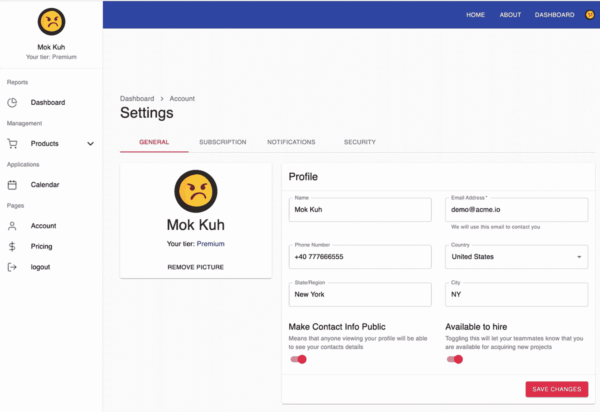
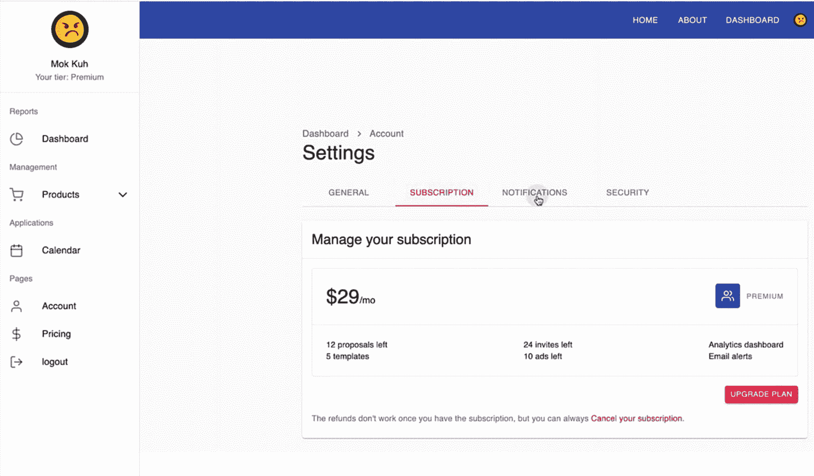
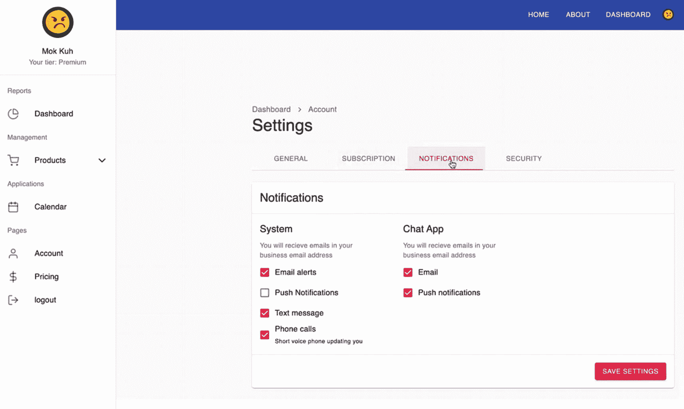
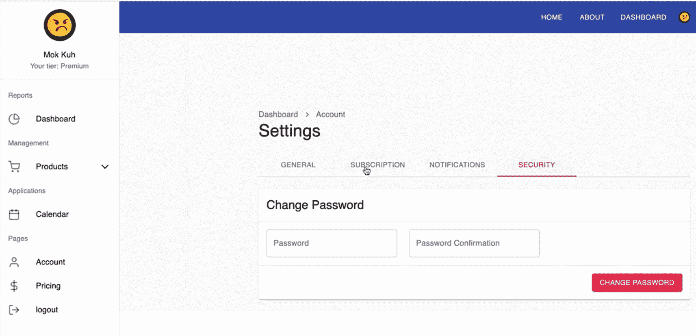
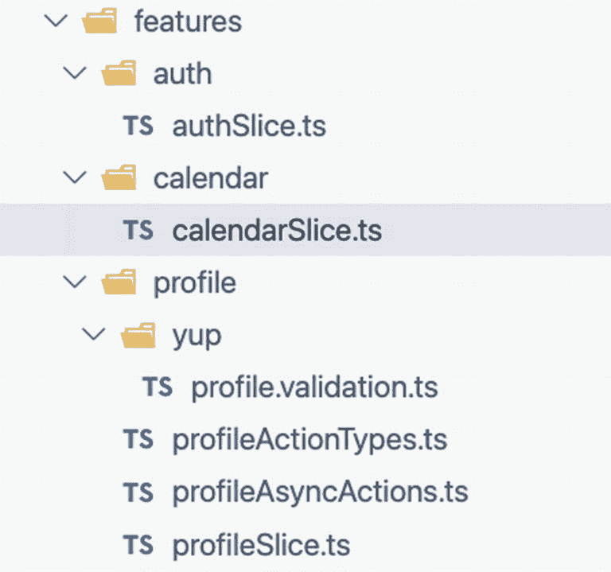
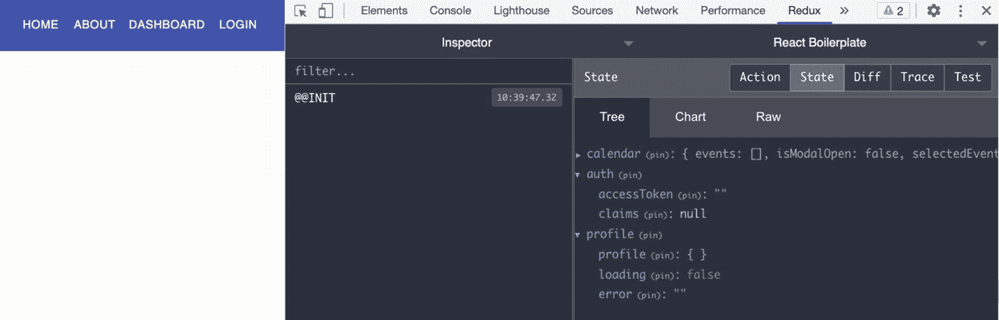
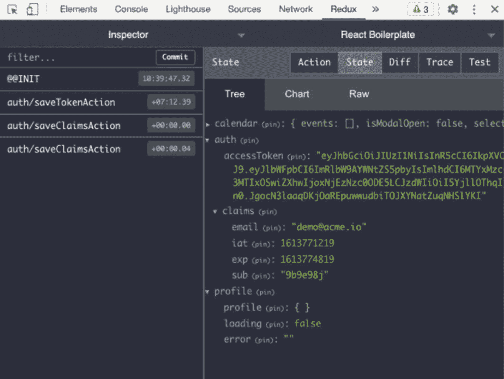
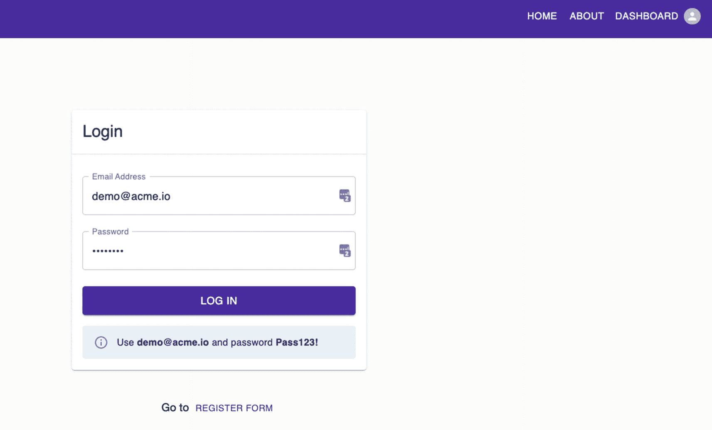
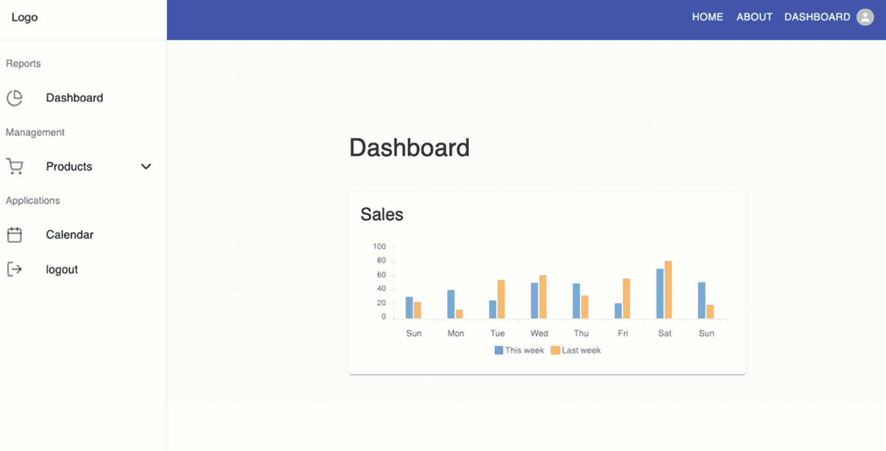

# 十三、编写配置文件表单并将其同步到组件

之前，我们展示了如何保护应用的某些部分免受未经身份验证或授权的人的攻击。本章将开始编写一个概要文件表单，并将该概要文件同步到各个组件。

由于这一部分相当长，我们将把它分成三个章节系列。在第一部分中，我们将更多地关注使用 Formik 和 JWT 进行身份验证来创建配置文件表单、注册表单和登录表单。在这里，我们将学习如何将配置文件表单同步到应用中的各个组件。

在第二部分中，我们将更新仪表板导航，并同步侧边栏导航和顶部导航栏之间的数据。在 Redux、Formik 和 Yup 验证模式的帮助下，我们将为应用添加更多的功能。

在本章系列的最后一部分，我们将继续巩固我们对 Redux 的了解，因为我们构建了完成应用 UI 所需的少数剩余组件。

这里的总体目标是从应用的不同层创建几个组件，并使用 Redux 将数据从一个组件无缝地传递到另一个组件——例如，使用 Redux 将个人资料数据同步到导航栏、侧栏和顶部导航栏。

在我们继续之前，让我在本章系列的最后向您展示完成的 UI。

图 [13-1](#Fig1) 到 [13-4](#Fig4) 显示了我们应用的完整 UI。

图 [13-1](#Fig1) 是设置页面。



图 13-1

设置页面

图 [13-2](#Fig2) 是订阅页面。



图 13-2

订阅表

图 [13-3](#Fig3) 是通知页面。



图 13-3

通知页面

图 [13-4](#Fig4) 为安全页面。



图 13-4

章节系列末尾的安全页面

## 创建索赔类型

好了，我们开始吧。首先，让我们为索赔创建一个模型或类型。

打开 models 文件夹，新建一个名为 **claims-type.ts** 的文件，复制清单 [13-1](#PC1) 所示的代码。

```jsx
export type ClaimsType = {
  readonly email: string;
  readonly iat: number;
  readonly exp: number;
  readonly sub: string;
};

Listing 13-1Creating the ClaimsType

```

`ClaimsType`:包含`read-only email, iat, exp, and sub`。这里的形状是根据解码后的访问令牌或 JWT 的有效载荷设计的。

`iat - (issued at claim)` `:`标识 JWT 的发行时间。

`exp - (expiration time claim)` `:`设置过期时间，在该时间或之后不得接受访问令牌进行处理。

`sub - (subject claim)`:标识访问令牌或 JWT 的主题。

仍然有很多保留的 JSON Web Token 声明，如果你想了解更多，可以访问类似 [`iana.org`](http://iana.org) 或 [`https://tools.ietf.org/`](https://tools.ietf.org/) 的网站。

接下来，让我们添加用户的形状。在 models 文件夹中，添加 user-type.ts 并复制代码，如清单 [13-2](#PC2) 所示。

### 创建用户类型

```jsx
export type Subscription = {
  name: string;
  price: number;
  currency: string;
  proposalsLeft: number;
  templatesLeft: number;
  invitesLeft: number;
  adsLeft: number;
  hasAnalytics: boolean;
  hasEmailAlerts: boolean;
};

export type UserType = {
  id: string;
  email: string;
  password: string;
  country: string;
  isPublic: boolean;
  phone: string;
  role: string;
  state: string;
  tier: string;
  name: string;
  avatar: string;
  city: string;
  canHire: boolean;
  subscription?: Subscription;
};

Listing 13-2Creating the UserType

```

## 添加 API:用户和用户数据库

然后我们需要再次更新我们的端点。所以转到 **axios.ts** 并再添加两个端点，如清单 [13-3](#PC3) 所示。

```jsx
export const EndPoints = {
  sales: 'sales',
  products: 'products',
  events: 'events',
  login: 'login',
  register: 'register',
  users: 'users',
  usersDb: 'users-db',
};

Listing 13-3Updating the Endpoints for Users and UsersDb

```

`Users`:用于编辑或更新用户密码。我们将允许用户更新或编辑他们的密码。

`UsersDb`:这是为了在我们的 models 文件夹中存储用户类型和订阅类型的详细信息。理想情况下，这应该放在一个单独的数据库中，就像在现实世界中，我们将用于用户身份验证的数据库与用户的配置文件或订阅分开一样。

### 创建 userDbService

让我们创建一个新的服务文件。转到 services 文件夹，添加一个名为 userDbService.ts 的新文件，如清单 [13-4](#PC4) 所示。

```jsx
import api, { EndPoints } from 'api/axios';
import { UserType } from 'models/user-type';

export async function getUserByIdFromDbAxios(id: string) {
  return await api.get<UserType>(`${EndPoints.usersDb}/${id}`);
}

export async function putUserFromDbAxios(user: UserType) {
  return await api.put<UserType>(`${EndPoints.usersDb}/${user.id}`, user);
}

Listing 13-4Creating UserDbService

```

`userDbService`有两个 HTTP 方法或函数。我们从模型中导入了`UserType`，我们将我们的第一个函数命名为尽可能具体和描述性的`getUserByIdFromDbAxios,`，返回类型是`UserType.`

另一个 axios 函数我们命名为`putUserFromDbAxios,`，它接受`UserType`，我们正在用`UserType`的预期响应进行更新。

### 更新授权服务

之后，我们将需要更新`authService.`打开`authService` `.ts`并添加以下函数，如清单 [13-5](#PC5) 所示。

```jsx
export type ChangePasswordModel = {
  email: string;
  password: string;
  id: string;
};

export async function changePassWordAxios(
  changePasswordModel: ChangePasswordModel,
) {
  return await axios.put<void>(
    `${EndPoints.users}/${changePasswordModel.id}`,
    changePasswordModel,
  );
}

Listing 13-5Adding changePasswordAxios in authService

```

`changePasswordAxios`是一个异步服务函数，它使用类型`changePasswordModel`来更改密码。我们使用 axios 发送一个 put 请求，用这个 id 更新特定用户的密码。

## Redux 的另一种用法

接下来，我们将创建一个`profileActionTypes,`，我们将在这里使用 Redux。

这是 Redux 的另一种写法。在前面的章节中，我们把所有的东西都放在一个文件中的`calendarSlice,`中，但是这次我们将为动作和片做单独的文件。这样做的主要原因是关注点的分离和代码的可读性。

这是图 [13-5](#Fig5) 中文件夹结构的一个快照，我们计划将配置文件文件夹作为构建 React-Redux 应用的一种方式。



图 13-5

配置文件的文件夹结构

### 创建 profileactioinotys

在 features 文件夹中，我们创建一个新目录，并将其命名为 profile。

在配置文件文件夹中，添加一个文件并将其命名为`profileActionTypes.ts`:

```jsx
features ➤ profile ➤ profileActionTypes.ts

```

在清单 [13-6](#PC7) 中，我们正在创建 profileActionTypes。

```jsx
import { UserType } from 'models/user-type';

export type ProfileStateType = {
  readonly profile: UserType;
  readonly loading: boolean;
  readonly error: string;
};

export const profileNamespace = 'profile';

/* action types */

export const ProfileActionTypes = {
  FETCH_AND_SAVE_PROFILE: `${profileNamespace}/FETCH_AND_SAVE_PROFILE`,
  UPDATE_PROFILE: `${profileNamespace}/UPDATE_PROFILE`,
};

Listing 13-6Creating the profileActionTypes.ts

```

### 创建配置文件操作

接下来，我们需要在概要文件文件夹中添加一个新文件。我们将其命名为`profileAsyncActions.ts`，如清单 [13-7](#PC8) 所示。

```jsx
import { createAsyncThunk } from '@reduxjs/toolkit';
import { UserType } from 'models/user-type';

import { ProfileActionTypes } from './profileActionTypes';
import {
  getUserByIdFromDbAxios,
  putUserFromDbAxios,
} from 'services/userDbService';

export const getProfileAction = createAsyncThunk(
  ProfileActionTypes.FETCH_AND_SAVE_PROFILE,
  async (id: string) => {
    return (await getUserByIdFromDbAxios(id)).data;
  },
);

export const putProfileAction = createAsyncThunk(
  ProfileActionTypes.UPDATE_PROFILE,
  async (user: UserType) => {
    return (await putUserFromDbAxios(user)).data;
  },
);

Listing 13-7Creating the profileAsyncActions

```

我们从 Redux 工具包 中导入模块`createAsyncThunk`来处理副作用。我们还有来自模型的`UserType`，动作类型`profileActionTypes`，以及来自`userDbService.`的两个 axios 函数

这是我们第一次异步操作。它来自于`createAsyncThunk,`的一个实例，我们需要传递一个字符串`(FETCH_AND_SAVE_PROFILE)`作为第一个参数，第二个参数是一个异步和等待函数。

string 类型的`id`参数与`getProfileAction,`相连，所以每当我们使用这个`getProfileAction,`时，我们都需要传递一个参数字符串。

然后我们将在`getUserByIdFromDbAxios`**中使用那个`id`，用开-闭括号把它括起来，这样我们就可以用点(.)批注然后`data.`**

 **`putProfileAction`:用于更新个人资料。我们还有`createAsyncThunk`实例，然后将字符串指令传递给 reducers 来更新概要文件。第二个参数是基于承诺的匿名函数或异步和等待函数。

这是实现 Redux 工具包 的模式，即使在未来的 Redux 项目中，您也可以将它作为指导方针。

### 创建配置文件目录

之后，我们需要创建切片。在配置文件文件夹中，创建一个名为`profileSlice` `.ts.`的新文件

我们在下面有导入命名的组件，包括 profile state type`profileNamespace,``profileActionTypes,`和来自`profileAsyncActions`的`getProfileAction`和`putProfileAction`，如清单 [13-8](#PC9) 所示。

```jsx
import { createSlice, PayloadAction } from '@reduxjs/toolkit';
import { UserType } from 'models/user-type';

import { profileNamespace, ProfileStateType } from './profileActionTypes';
import { getProfileAction, putProfileAction } from './profileAsyncActions';

/* profile state */
/* initial state or default state or initial values, it's up to you */
export const initialState: ProfileStateType = {
  profile: {} as UserType,
  loading: false,
  error: '',
};

/* profile store */

export const profileSlice = createSlice({

  /*
   name: is your feature or also called module, or namespace,
   or context, etc. The terminologies here can be interchangeable.
   This is required.
  */
  name: profileNamespace,

  /*initialState is the default value of this namespace/module and it is required.*/

  initialState,

  /*Non asynchronous actions. Does not require Axios.*/

  reducers: {},

  /*Asynchronous actions. Actions that require Axios.
    extraReducers - allows createSlice to respond not only to its own
     action type but other action types also*/

 /*state - is coming from the initialState; no need to define it because the Redux 工具包 can already infer what particular state it is.  */

  extraReducers: builder => {
    builder.addCase(
      getProfileAction.fulfilled,
      (state, action: PayloadAction<UserType>) => {
        state.profile = action.payload;
      },
    );

    builder.addCase(
      putProfileAction.pending,
      (state, action: PayloadAction) => {
        state.loading = true;
        state.error = '';
      },
    );
    builder.addCase(
      putProfileAction.fulfilled,
      (state, action: PayloadAction<UserType>) => {
        state.loading = false;
        state.profile = action.payload;
      },
    );
    builder.addCase(
      putProfileAction.rejected,
      (state, action: PayloadAction<any>) => {
        state.loading = false;
        state.error = 'Something wrong happened';
        console.log(action?.payload);
      },
    );
  },
});

export default profileSlice.reducer;

Listing 13-8Creating profileSlice.ts

```

这里我们没有使用任何非异步或同步动作。对于 Redux 中的异步动作，我们需要`extraReducers,`，它也是切片的一部分。

要使用`extraReducers,`，我们需要设置或添加一个名为`builder.`的函数签名

`builder`:返回我们将要构建的`addCase`。

`addCase`:需要一个字符串，是动作类型。

如果你看看各种各样的`addCases`，你会发现它似乎只是一个大的 try-catch 块函数。

`getProfileAction.fulfilled`:例如，如果我们收到一个 2xx 状态代码，前面的代码块就会运行。

`putProfileAction.pending`:在被拒绝和被执行的功能之前运行。这是我们向任何 web 服务发送请求的时间。我们通过将 pending 设置为 true 来启用 spinner 或 loader。我们不需要挂起的有效负载，因为我们直接将 loading 从 false 改为 true。

在这里，我们得到状态代码 2xx，然后我们更新减速器。

`putProfileAction.rejected`:每当我们得到除 2xx 之外的状态码时就会运行，例如，4xx，表示未经授权，或 5xx，表示服务器有问题。如果发生这种情况，我们将 loading 设置为 false 并运行错误消息。

在底部，我们导出了缩减器: **profileSlice.reducer** 。

FOR YOUR ACTIVITY

在`getProfileAction.`中再添加两个`addCases`添加待定和拒绝。按照`putProfileAction.`里的模式就行了

清单 [13-9](#PC10) 是一个 ToDo 活动:在 getProfileAction 中创建 addCase pending 和 addCase rejected。

```jsx
extraReducers: builder => {

   // todo activity: create addCase pending

    builder.addCase(
      getProfileAction.fulfilled,
      (state, action: PayloadAction<UserType>) => {
        state.profile = action.payload;
      },
    );

     // todo activity: create addCase rejected

Listing 13-9Activity for Chapter 13

```

一旦您完成了活动，现在让我们来更新根缩减器。去商店➤ `reducers.ts`。

## 将 profileReducer 添加到异径管

我们需要从`profileSlice a`中导入`profileReducer`并将其添加到根减速器的`injectedReducers`中，如清单 [13-10](#PC11) 所示。

```jsx
import { combineReducers } from '@reduxjs/toolkit';
import calendarReducer from 'features/calendar/calendarSlice';
import profileReducer from'features/profile/profileSlice';

/* easier way of registering a reducer */

const injectedReducers = {
  calendar: calendarReducer,
  profile: profileReducer,
};

Listing 13-10Adding the profileReducer in the reducers.ts

```

我们店里有`profileReducer`；现在在每个应用组件中都可以访问到`profileReducer`。

## 创建 authSlice

接下来，我们将创建另一个切片。我们需要`authSlice`将访问令牌和声明保存到全局存储中。

因此，在文件夹特性中，添加一个新文件夹并将其命名为 auth，并在其中创建一个名为`d authSlice.ts:`的新文件

```jsx
features ➤ auth ➤ authSlice.ts

```

打开它，从 Redux 工具包 中导入`createSlice`和`PayloadAction`，并从模型中导入`ClaimsType`。首先导入命名的组件，如清单 [13-11](#PC13) 所示。

```jsx
import { createSlice, PayloadAction } from '@reduxjs/toolkit';
import { ClaimsType } from 'models/claims-type';

Listing 13-11Importing Modules in the authSlice.ts

```

然后我们添加名称空间、AuthStateType 的形状和初始状态，如清单 [13-12](#PC14) 所示。

```jsx
const authNamespace = 'auth';

export type AuthStateType = {
  readonly accessToken: string;
  readonly claims: ClaimsType;
};

/*we are using the AuthStateType to type safe our initial state */

export const initialState: AuthStateType = {
  accessToken: '',
  claims: null,
};

Listing 13-12Adding the Namespace, Type, and initialState in authSlice.ts

```

接下来，让我们使用`createSlice`来接受`namespace, initialState`、充满了`reducer`函数的对象以及我们创建的片名，如清单 [13-13](#PC15) 所示。

```jsx
export const authSlice = createSlice({

  /*namespace for separating related states. Namespaces are like modules*/

  name: authNamespace,

  /* initialState is the default value of this namespace/module and it is required */

  initialState,

  /*Non asynchronous actions. Does not require Axios.*/

  reducers: {
    saveTokenAction: (state, action: PayloadAction<string>) => {
      state.accessToken = action?.payload;
    },
    saveClaimsAction: (state, action: PayloadAction<ClaimsType>) => {
      state.claims = action?.payload;
    },
  },

  /*Asynchronous actions. Actions that require Axios.*/

  extraReducers: builder => {},
});

/* export all non-async actions */

export const { saveClaimsAction, saveTokenAction } = authSlice.actions;

export default authSlice.reducer;

Listing 13-13Passing createSlice in our authSlice

```

在清单 [13-13](#PC15) 中，我们有两个非异步动作，这意味着它们不需要使用 axios。

两个非异步动作—`saveTokenAction`和`saveClaimsAction`—不需要 axios 的帮助。

接下来，我们通过从 authSlice.actions 中提取这些非异步操作来导出它们。

最后，我们导出 authSlice.reducer，这样我们可以在根 reducer 中调用它。

## 将 authSlice 添加到 Reducers

转到`reducers.ts`，我们将`authReducer`注入到`injectedReducers`中，并导入命名组件`,`，如清单 [13-14](#PC16) 所示。

```jsx
import authReducer from '../features/auth/authSlice';

const injectedReducers = {
  calendar: calendarReducer,
  auth: authReducer,
  profile: profileReducer,
};

Listing 13-14Adding the authReducer in the reducers.ts

```

`authReducer`现在是组合减速器和存储的一部分。

### 安装 JWT 解码

接下来，我们需要安装一个流行的 JavaScript 库 jwt-decode。它解码 JWT 令牌，对浏览器应用很有用:

```jsx
npm i jwt-decode

```

安装 jwt-decode 之后，让我们前往受保护的路由并对其进行改进:组件➤受保护的路由

### 更新受保护的路由

首先，让我们在 protected-route.tsx 中导入额外的命名组件，如清单 [13-15](#PC18) 所示。

```jsx
import { useDispatch } from 'react-redux';
import jwt_decode from 'jwt-decode';

import { saveClaimsAction } from 'features/auth/authSlice';
import { ClaimsType } from 'models/claims-type';

Listing 13-15Adding Named Components in protected-route.tsx

```

接下来，让我们更新 ProtectedRoute 组件，如清单 [13-16](#PC19) 所示。

```jsx
const ProtectedRoute = props => {
  const dispatch = useDispatch();
  const token = localStorage.getItem('token');

  /* this is cleaning up the localStorage and redirecting user to login */
  if (!token) {
    localStorage.clear();
    return <Redirect to={{ pathname: '/login' }} />;
  }

  const decoded: ClaimsType = jwt_decode(token);
  const expiresAt = decoded.exp * 1000;
  const dateNow = Date.now();
  const isValid = dateNow <= expiresAt;

  dispatch(saveClaimsAction(decoded));

  return isValid ? (
    <Route {...props} />
  ) : (
    <Redirect to={{ pathname: '/login' }} />
  );
};

export default ProtectedRoute;

Listing 13-16Updating the ProtectedRoute Component

```

我们需要`useDispatch`和来自`localStorage`的令牌。我们正在清理`localStorage`，如果它是假的或者没有令牌，我们会将用户重定向到登录页面。

我们将把 **toke** n 传递给`jwt_decode`来解码它。相对于`dateNow`或当前日期，解码的**令牌**将与`expiresAt`或令牌的到期日期进行比较。

`dateNow`应等于或小于`expiresAt`。

接下来，我们将通过`saveClaimsAction`中的**解码后的** `token`进行调度。

在 return 语句中，如果令牌`isValid,`则转到用户正在导航的地方；否则，将用户重定向到登录页面。

## 更新登录表单

我们现在将更新登录表单。首先，我们将添加一些命名的组件，如清单 [13-17](#PC20) 所示。

```jsx
import jwt_decode from 'jwt-decode';
import { useDispatch } from 'react-redux';

import { saveClaimsAction, saveTokenAction } from 'features/auth/authSlice';
import { loginAxios } from 'services/authService';
import { ClaimsType } from 'models/claims-type';

Listing 13-17Updating the Named Components in LoginForm

```

我们添加了来自 React Redux 的 useDispatch 和 jwt_decode。我们还需要 saveClaimsAction、saveTokenAction 和 ClaimsType。

接下来，我们需要更新 LoginForm 函数，如清单 [13-18](#PC21) 所示。

```jsx
const LoginForm = () => {
  const key = 'token';
  const history = useHistory();
  const dispatch = useDispatch();
  const [error, setError] = useState('');

Listing 13-18Hooks in Login Form

```

我们使用清单 [13-18](#PC21) 中的`useDispatch`来调度一个动作，以保存对商店的访问令牌和声明，如清单 [13-19](#PC22) 所示。

```jsx
const saveUserAuthDetails = (data: { accessToken: string }) => {
    localStorage.setItem(key, data.accessToken);
    const claims: ClaimsType = jwt_decode(data.accessToken);
    console.log('Claims::', claims);    /*just to check it  */
    dispatch(saveTokenAction(data.accessToken));
    dispatch(saveClaimsAction(claims));
  };

Listing 13-19Updating the saveUserAuthDetails Function in the LoginForm

```

## 更新登记表

我们将对注册表进行类似的更新。我们开始导入命名的组件，如清单 [13-20](#PC23) 所示。

```jsx
import { useDispatch } from 'react-redux';

import { saveClaimsAction, saveTokenAction } from 'features/auth/authSlice';
import jwt_decode from 'jwt-decode';

import { ClaimsType } from 'models/claims-type';

Listing 13-20Updating the Named Components in the Register Form

```

在清单 [13-20](#PC23) 中，我们添加了 useDispatch、saveClaimsAction、saveTokenAction、jwt_decode 和 ClaimsType。

接下来，我们更新 RegisterForm，如清单 [13-21](#PC24) 所示。

```jsx
const RegisterForm = () => {
  const key = 'token';
  const history = useHistory();
  const dispatch = useDispatch();
  const [error, setError] = useState('');
  const [isAlertVisible, setAlertVisible] = useState(false);

Listing 13-21Hooks in the Registration Form

```

在清单 [13-21](#PC24) 中，我们还使用了 useDispatch 来调度或发送一个动作，以保存对商店的访问令牌和声明，如清单 [13-22](#PC25) 所示。

```jsx
const saveUserAuthDetails = (data: { accessToken: string }) => {
  localStorage.setItem(key, data.accessToken);
  const claims: ClaimsType = jwt_decode(data.accessToken);
  console.log('Claims::', claims);
  dispatch(saveTokenAction(data.accessToken));
  dispatch(saveClaimsAction(claims));
};

Listing 13-22saveUserAuthDetails Function

```

一旦保存在存储中，现在就可以在应用的任何地方访问访问令牌和声明。

让我们运行我们的应用:

```jsx
npm run start:fullstack

```

刷新浏览器，打开 Redux DevTools，如图 [13-6](#Fig6) 所示。



图 13-6

Redux DevTools 的屏幕截图，没有本地存储中的数据

注意，在 auth 和 profile 状态下还没有数据。都是默认值。

接下来，让我们进入登录页面，让我们登录。当我们登录时，这将保存商店中的状态，如图 [13-7](#Fig7) 所示。



图 13-7

Redux DevTools 登录后的截图

在 Redux DevTools 中，我们可以看到`saveClaimsAction`和`saveTokenAction.`，我们有`accessToken`的数据和`claims`中的值。

我们现在已经验证了可以从服务器接收 accessToken 和声明。

配置文件仍然是空的，因为我们将使用声明 id (sub)来获取特定用户的数据。

### 创建标题配置文件

接下来，我们继续创建一个新的 React 组件，并将其命名为`header-profile.tsx:`

```jsx
app ➤ components ➤ header-profile.tsx

```

让我们导入我们需要的命名组件，如清单 [13-23](#PC28) 所示。

```jsx
import React, { useState, MouseEvent } from 'react';
import clsx from 'clsx';
import { Theme, withStyles } from '@material-ui/core/styles';
import Menu, { MenuProps } from '@material-ui/core/Menu';
import { LogOut as LogOutIcon, Hexagon as HexagonIcon } from 'react-feather';
import { useSelector } from 'react-redux';
import { RootState } from 'store/reducers';
import { createStyles } from '@material-ui/styles';
import {

  Avatar,
  Box,
  Divider,
  ListItemIcon,
  ListItemText,
  makeStyles,
  MenuItem,
} from '@material-ui/core';

Listing 13-23Adding the Named Components of the HeaderProfile

```

好吧，有什么新鲜事吗？从 Material-UI 核心样式中，我们已经从 React Feather 中导入了菜单和 MenuProps 以及六边形。

我们还使用 Redux 中的 useSelector 和 RootState 进行类型化。

然后让我们添加 HeaderProfile 函数，如清单 [13-24](#PC29) 所示。

```jsx
const HeaderProfile = () => {
  const classes = useStyles();

  /*using the profile to render an avatar */
  const { profile } = useSelector((state: RootState) => state.profile);

  const [anchorEl, setAnchorEl] = useState<null | HTMLElement>(null);

  const handleClick = (event: MouseEvent<HTMLElement>) => {
    setAnchorEl(event.currentTarget);
  };

  const handleClose = () => {
    setAnchorEl(null);
  };

  const handleLogout = () => {
    localStorage.clear();
  };

Listing 13-24Creating the HeaderProfile Function Component 

```

在清单 [13-24](#PC29) 中，我们使用 useSelector 来获取配置文件，并使用 profile.avatar 来呈现头像组件。参见清单 [13-25](#PC30) 添加 HeaderProfile React 组件的返回语句。

```jsx
return (
    <div>
      <Box display="flex" justifyContent="center" onClick={handleClick}>
        <Avatar
          variant={'circle'}
          alt="User"
          className={clsx(classes.avatar, classes.small)}
          src={profile.avatar}
        />
      </Box>
      <StyledMenu
        id="customized-menu"
        anchorEl={anchorEl}
        keepMounted
        open={Boolean(anchorEl)}
        onClose={handleClose}
      >

        <MenuItem>
          <ListItemText primary={profile.email} />
        </MenuItem>
        <Divider />
        <MenuItem>
          <ListItemIcon>
            <HexagonIcon />
          </ListItemIcon>
          <ListItemText primary="Partners" />
        </MenuItem>
        <a className={classes.link} href={'/'}>
          <MenuItem onClick={handleLogout}>
            <ListItemIcon>
              <LogOutIcon />
            </ListItemIcon>
            <ListItemText primary="Logout" />
          </MenuItem>
        </a>
      </StyledMenu>
    </div>
  );
};

export default HeaderProfile;

Listing 13-25Adding the Return Statement of the HeaderProfile

```

最后，添加样式组件，如清单 [13-26](#PC31) 所示。

```jsx
const useStyles = makeStyles((theme: Theme) =>
  createStyles({
    avatar: {
      cursor: 'pointer',
      width: 64,
      height: 64,
    },
    link: { textDecoration: 'none', color: 'inherit' },
    small: {
      width: theme.spacing(3),
      height: theme.spacing(3),
    },
  }),
);

const StyledMenu = withStyles({
  paper: {
    border: '1px solid #d3d4d5',
  },
})((props: MenuProps) => (
  <Menu
    elevation={0}
    getContentAnchorEl={null}
    anchorOrigin={{
      vertical: 'bottom',
      horizontal: 'center',
    }}
    transformOrigin={{
      vertical: 'top',
      horizontal: 'center',
    }}
    {...props}
  />
));

Listing 13-26Styling Components for the HeaderProfile

```

我们在这里使用的所有样式组件都来自 Material- [UI。](http://ui.fo)比如去网站 [material-ui。并搜索菜单。](http://material-ui.com)

搜索您需要的特定菜单，复制代码，并根据您的喜好进行调整。你通常可以在网页底部看到 API。

## 更新导航栏

让我们前往导航栏。转到`layouts` ➤ `main-layout` ➤ `navigation-bar.tsx`，我们将对其进行更新。

当用户登录时，我们需要隐藏或删除菜单中的登录按钮。

首先，我们需要添加`the useSelector, RootState`，和`HeaderProfile,`，`useSelector`用于访问或获取声明，如清单 [13-27](#PC32) 所示。

```jsx
import {useSelector} from 'react-redux';
import {RootState} from 'store/reducers';
import HeaderProfile from 'app/components/header-profile';

export default function NavigationBar() {
  const classes = useStyles();
  const { claims } = useSelector((state: RootState) => state.auth);

Listing 13-27Adding Import Components and Using useSelector

```

接下来，我们从 Auth 获取声明，并将使用这些声明来更新仪表板和登录。

我们将把仪表板按钮和登录按钮放在一些花括号内，然后添加声明，并在按钮仪表板下添加 HeaderProfile。

```jsx
{claims ? (

              <Button color="inherit">
                <Link className={classes.link} to={'/dashboard'}>
                  Dashboard
                </Link>
              </Button>
              <HeaderProfile/>

          ) : (
            <Button color="inherit">
              <Link className={classes.link} to={'/login'}>
                Login
              </Link>
            </Button>
          )
          }

Listing 13-28Using the Claims to Wrap the Dashboard and Login Buttons in the Navigation Bar

```

因此，如果声明有效，就会呈现仪表板链接。否则，将呈现登录链接。

刷新浏览器，应该会在登录页面的右上角看到头像，如图 [13-8](#Fig8) 所示。



图 13-8

显示登录页面的仪表板头像

并且登录后看到仪表盘头像，如图 [13-9](#Fig9) 。



图 13-9

登录后显示仪表板头像

## 创建帐户视图

现在我们转到 views 文件夹，创建一个名为`account`的新文件夹，并在其中创建另一个名为`AccountView`的文件夹。在`AccountView,`里面加上`index.tsx:`

```jsx
views ➤ account ➤ AccountView ➤ index.tsx

```

现在，我们将添加带有标签`<h1> AccountView Page Works</h1>`的标准页面模板。参见清单 [13-29](#PC35) 。

```jsx
import React from 'react';
import { Container, makeStyles } from '@material-ui/core';
import Page from 'app/components/page';

const AccountView = () => {
  const classes = useStyles();

  return (
    <Page className={classes.root} title="Settings">
      <Container maxWidth="lg">
        <h1>AccountView Page Works</h1>
      </Container>
    </Page>
  );
};

export default AccountView;

const useStyles = makeStyles(theme => ({
  root: {
    minHeight: '100%',
    paddingTop: theme.spacing(3),
    paddingBottom: theme.spacing(3),
  },
}));

Listing 13-29Creating the Standard Page for the AccountView

```

目前，帐户页面只是为了显示我们可以在这里导航；我们稍后将回到这一点来更新它。

### 添加图像

让我们在应用中添加更多的图像。转到图像➤产品。

你可以在我的 GitHub 中抓取这些图片:

来源: [`https://github.com/webmasterdevlin/practical-enterprise-react/tree/master/chapter-12/publimg/products`](https://github.com/webmasterdevlin/practical-enterprise-react/tree/master/chapter-12/publimg/products)

将这四张图片放在产品中:

```jsx
product_extended.svg,
product_premium.svg,
product_premium—outlined.svg,
product_standard.svg.

```

最后，将这个头像添加到图片目录:

阿凡达 _6.png

你可以从这里抓取图像:

[T2`https://github.com/webmasterdevlin/practical-enterprise-react/blob/master/chapter-12/publimg/avatar_6.png`](https://github.com/webmasterdevlin/practical-enterprise-react/blob/master/chapter-12/publimg/avatar_6.png)

### 创建定价页面

接下来，让我们创建一个新组件，并将其命名为定价页面:

```jsx
views ➤ pages ➤ pricing ➤ PricingPage.tsx

```

这个页面纯粹是为了美观或者设计。我们将从 Material-UI 导入标准的样式组件，如清单 [13-30](#PC38) 所示。

```jsx
import React from 'react';
import clsx from 'clsx';
import {

  Box,
  Button,
  Container,
  Divider,
  Grid,
  Paper,
  Typography,
  makeStyles,
} from '@material-ui/core';

import Page from 'app/components/page';

Listing 13-30Adding the Named Components of the PricingPage

```

然后我们添加将从 Material-UI 中重用的 PricingPage 组件。我们展示了我们通常在网站上看到的不同价格产品或定价选项，例如，标准选项、高级选项和扩展选项。参见清单 [13-31](#PC39) 。

```jsx
const PricingPage = () => {
  const classes = useStyles();

  return (
    <Page className={classes.root} title="Pricing">
      <Container maxWidth="sm">
        <Typography align="center"
         variant="h2" color="textPrimary">
          Start Selling!
        </Typography>
        <Box mt={3}>
          <Typography align="center"
         variant="subtitle1" color="textSecondary">
            Welcome to the best platform for selling products
          </Typography>
        </Box>
      </Container>
      <Box mt="160px">
        <Container maxWidth="lg">
          <Grid container spacing={4}>
            <Grid item md={4} xs={12}>
              <Paper className={classes.product}
               elevation={1}>
                

                <Typography
                  component="h4"
                  gutterBottom
                  variant="overline"
                  color="textSecondary"
                >

                  Standard
                </Typography>
                <div>
                  <Typography
                    component="span"
                    display="inline"
                    variant="h4"
                    color="textPrimary"
                  >
                    $5
                  </Typography>
                  <Typography
                    component="span"
                    display="inline"
                    variant="subtitle2"
                    color="textSecondary"
                  >
                    /month
                  </Typography>
                </div>

                <Typography variant="overline"
                            color="textSecondary">
                  Max 1 user
                </Typography>
                <Box my={2}>
                  <Divider />
                </Box>
                <Typography variant="body2"
                            color="textPrimary">
                  20 proposals/month
                  <br />
                  10 templates
                  <br />
                  Analytics dashboard
                  <br />
                  Email alerts
                </Typography>
                <Box my={2}>
                  <Divider />
                </Box>

                <Button
                  variant="contained"
                  fullWidth
                  className={classes.chooseButton}
                >
                  Choose
                </Button>
              </Paper>
            </Grid>

            <Grid item md={4} xs={12}>
              <Paper
                className={clsx(classes.product,
                           classes.recommendedProduct)}
                elevation={1}
              >
                
                <Typography
                  component="h4"
                  gutterBottom
                  variant="overline"
                  color="inherit"
                >
                  Premium
                </Typography>
                <div>
                  <Typography
                    component="span"
                    display="inline"
                    variant="h4"
                    color="inherit"
                  >
                    $29
                  </Typography>

                  <Typography
                    component="span"
                    display="inline"
                    variant="subtitle2"
                    color="inherit"
                  >
                    /month
                  </Typography>
                </div>
                <Typography variant="overline" color="inherit">
                  Max 3 user
                </Typography>
                <Box my={2}>
                  <Divider />
                </Box>
                <Typography variant="body2" color="inherit">
                  20 proposals/month
                  <br />
                  10 templates
                  <br />
                  Analytics dashboard
                  <br />
                  Email alerts
                </Typography>

                <Box my={2}>
                  <Divider />
                </Box>
                <Button

                  variant="contained"
                  fullWidth
                  className={classes.chooseButton}
                >
                  Choose
                </Button>
              </Paper>
            </Grid>
            <Grid item md={4} xs={12}>
              <Paper className={classes.product} elevation={1}>
                
                <Typography
                  component="h4"
                  gutterBottom
                  variant="overline"
                  color="textSecondary"
                >
                  Extended
                </Typography>

                <div>
                  <Typography
                    component="span"
                    display="inline"
                    variant="h4"
                    color="textPrimary"
                  >
                    $259
                  </Typography>
                  <Typography
                    component="span"
                    display="inline"
                    variant="subtitle2"
                    color="textSecondary"
                  >
                    /month
                  </Typography>
                </div>
                <Typography variant="overline" color="textSecondary">
                  Unlimited
                </Typography>

                <Box my={2}>
                  <Divider />
                </Box>

                <Typography variant="body2"
             color="textPrimary">
                  All from above
                  <br />
                  Unlimited 24/7 support
                  <br />
                  Personalised Page
                  <br />
                  Advertise your profile
                </Typography>
                <Box my={2}>
                  <Divider />
                </Box>
                <Button
                  variant="contained"
                  fullWidth
                  className={classes.chooseButton}
                >
                  Choose
                </Button>
              </Paper>
            </Grid>
          </Grid>
        </Container>
      </Box>
    </Page>
  );
};

Listing 13-31Creating the PricingPage Component

```

接下来，我们需要添加样式组件，如填充、定位、过渡主题等。来自 Material-UI，如清单 [13-32](#PC40) 所示。

```jsx
const useStyles = makeStyles(theme => ({
  root: {
    minHeight: '100%',
    height: '100%',
    paddingTop: 120,
    paddingBottom: 120,
  },
  product: {
    position: 'relative',
    padding: theme.spacing(5, 3),
    cursor: 'pointer',
    transition: theme.transitions.create('transform', {
      easing: theme.transitions.easing.sharp,
      duration: theme.transitions.duration.leavingScreen,
    }),
    '&:hover': {
      transform: 'scale(1.1)',
    },
  },
  productImage: {
    borderRadius: theme.shape.borderRadius,
    position: 'absolute',
    top: -24,
    left: theme.spacing(3),
    height: 48,
    width: 48,
    fontSize: 24,
  },
  recommendedProduct: {
    backgroundColor: theme.palette.primary.main,
    color: theme.palette.common.white,
  },
  chooseButton: {
    backgroundColor: theme.palette.common.white,
  },
}));

export default PricingPage;

Listing 13-32Adding the Styling Components to the PricingPage

```

我们不会在这里添加任何功能；对于我们目前的应用来说，这只是为了美观。但是你可以摆弄它，根据你的喜好改变它。

## 更新路线

好了，现在是时候更新添加`PricingPage and the AccountView.`的路线了，将它们分别添加到登录路线路径和日历路线路径下，如清单 [13-33](#PC41) 所示。

```jsx
<Route
          exact
          path={'/pricing'}
          component={lazy(() => import('./views/pages/pricing/PricingPage'))}
        />

...

<Route
                  exact
                  path={path + '/account'}
                  component={lazy(
                    () => import('./views/dashboard/account/AccountView'),
                  )}
                />

Listing 13-33Updating the routes.tsx

```

## 摘要

在这一章中，我们已经学习了如何创建我们的 Profile 表单，并展示了在 Redux 的帮助下，我们如何轻松地将它同步到应用中的另一个组件。我们还使用了一个流行的 JavaScript 库 jwt-decode，它可以用来解码 jwt 令牌。我们还使用 Formik 和 JWT 创建了用于身份验证的登录和注册表单。

在本章的第二部分，我们将继续更新侧边栏导航。**